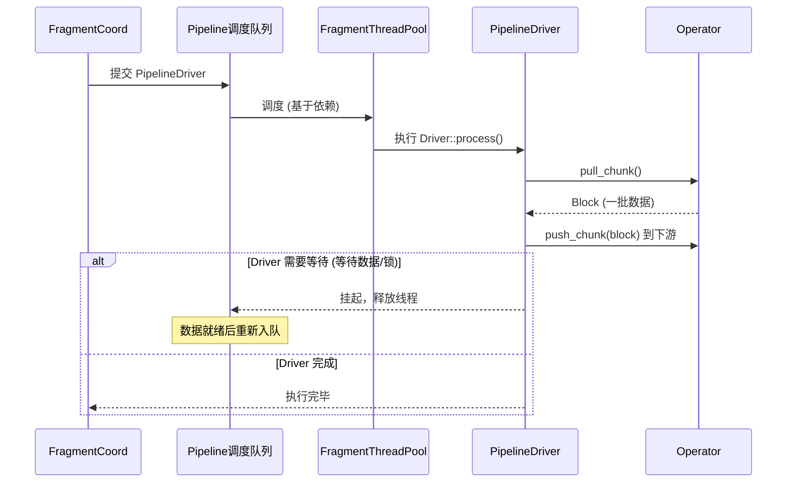
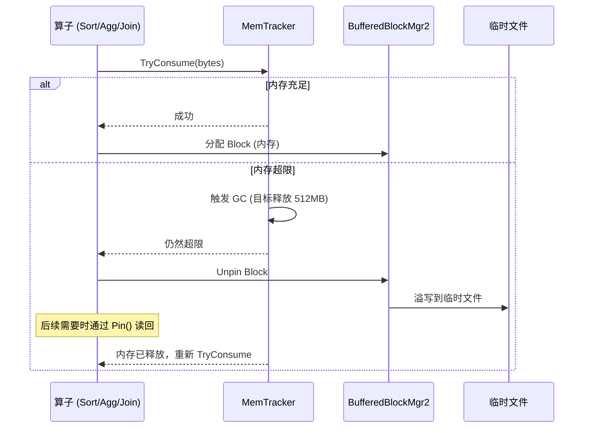

# Apache Doris 线程模型与内存模型

## 一、线程模型总览

Doris 采用**多线程池 + 事件驱动 RPC**的架构。BE（Backends）和 FE（Frontends）使用完全不同的线程模型：BE 是 C++ 多线程池，FE 是 JVM 线程池。

### 1.1 BE 整体线程架构

```
┌─────────────────────────────────────────────────────────────────────┐
│                        BE 进程线程全景                               │
│                                                                     │
│  ┌──────────────┐  ┌──────────────┐  ┌──────────────────────────┐  │
│  │ BRPC Server  │  │ Thrift Server│  │ HTTP Server (bvar/http)  │  │
│  │ (RPC 请求)   │  │ (老协议)      │  │ (监控/管理接口)          │  │
│  └──────┬───────┘  └──────┬───────┘  └──────────────────────────┘  │
│         │                 │                                         │
│         ▼                 ▼                                         │
│  ┌─────────────────────────────────────────────────────────────┐   │
│  │                  ExecEnv (全局执行环境)                        │   │
│  │                                                              │   │
│  │  ┌────────────────────────────────────────────────────┐     │   │
│  │  │          Pipeline 引擎 (推荐)                       │     │   │
│  │  │  ┌──────────┐  ┌──────────┐  ┌──────────────────┐  │     │   │
│  │  │  │Fragment   │  │Scan      │  │Data Loading      │  │     │   │
│  │  │  │ThreadPool │  │ThreadPool │  │ThreadPool        │  │     │   │
│  │  │  │(查询执行)  │  │(扫描调度)  │  │(导入任务)        │  │     │   │
│  │  │  └──────────┘  └──────────┘  └──────────────────┘  │     │   │
│  │  └────────────────────────────────────────────────────┘     │   │
│  │                                                              │   │
│  │  ┌────────────────────────────────────────────────────┐     │   │
│  │  │          存储后台线程                                │     │   │
│  │  │  ┌──────────┐  ┌──────────┐  ┌──────────────────┐  │     │   │
│  │  │  │Compaction │  │Flush     │  │GC/回收           │  │     │   │
│  │  │  │ThreadPool │  │线程      │  │线程              │  │     │   │
│  │  │  └──────────┘  └──────────┘  └──────────────────┘  │     │   │
│  │  └────────────────────────────────────────────────────┘     │   │
│  │                                                              │   │
│  │  ┌────────────────────────────────────────────────────┐     │   │
│  │  │          后台 Daemon 线程                           │     │   │
│  │  │  ┌──────────┐  ┌──────────┐  ┌──────────────────┐  │     │   │
│  │  │  │Heartbeat │  │Report    │  │Statistic         │  │     │   │
│  │  │  │线程      │  │线程      │  │线程              │  │     │   │
│  │  │  └──────────┘  └──────────┘  └──────────────────┘  │     │   │
│  │  └────────────────────────────────────────────────────┘     │   │
│  └─────────────────────────────────────────────────────────────┘   │
└─────────────────────────────────────────────────────────────────────┘
```

---

## 二、RPC 网络层线程

### 2.1 BRPC Server（主要 RPC 通道）

Doris 使用百度 BRPC 作为核心 RPC 框架。BRPC 自身管理线程池：

| 线程 | 说明 | BRPC 默认值 |
|------|------|------------|
| `bRPC-accept` | 连接接受线程 | 1 |
| `bRPC-io` | I/O 处理线程 | CPU 核数 |
| `bRPC-worker` | RPC 处理线程 (Reactor) | CPU 核数 + 1 |
| `bRPC-timer` | 定时器线程 | 1 |

BRPC 的处理模型：Reactor 模式，worker 线程处理用户逻辑。请求处理函数在 worker 线程中执行，完成后由 BRPC 线程发送响应。

### 2.2 Thrift Server（兼容老版本）

```
ThriftServer
├── acceptor 线程 x1         // 接受连接
├── worker 线程 x thread_num  // 处理 RPC 请求
└── index 线程 x1             // Thrift 内部
```

Thrift Server 的 worker 线程直接执行 FE 发来的计划 Fragment 执行逻辑。

### 2.3 HTTP Server

用于监控页面、Web 管理接口和部分内部 API，基于 bvar/http 实现，复用 BRPC 的 I/O 线程。

---

## 三、Pipeline 引擎线程模型

Pipeline 引擎是 Doris 当前的默认执行引擎，替代了老的 FragmentExecutor。

### 3.1 核心线程池

| 线程池 | 默认大小 | 说明 |
|--------|---------|------|
| **FragmentThreadPool** | CPU 核数 | 查询执行主线程池 |
| **ScanThreadPool** | CPU 核数 | 数据扫描调度 |
| **DataLoadThreadPool** | CPU 核数 | Stream Load 等数据导入 |
| **ETLThreadPool** | CPU 核数 | ETL 任务 |
| **ConnectorScanThreadPool** | CPU 核数 | 外表扫描 |

### 3.2 Pipeline 执行模型

```
┌──────────────────────────────────────────────────────────┐
│                    Pipeline 执行模型                       │
│                                                          │
│  Query                                                   │
│    └── Fragment (Plan Fragment)                          │
│          └── Pipeline (算子链)                            │
│                └── Driver (可运行实例)                     │
│                      │                                   │
│                      │ 调度到线程池                        │
│                      ▼                                   │
│              ┌──────────────┐                            │
│              │  线程池 Worker │                            │
│              │  执行 Driver  │                            │
│              │  Pull 模式    │                            │
│              └──────────────┘                            │
└──────────────────────────────────────────────────────────┘
```

Pipeline 的核心抽象：

| 概念 | 说明 |
|------|------|
| **Pipeline** | 一串相连的算子 (Operator)，数据在算子间流水线传递 |
| **PipelineDriver** | Pipeline 的可调度实例，可被提交到线程池 |
| **Operator** | 算子实例 (Scan, HashJoin, Aggregation, Sort 等) |
| **Dependency** | 驱动间依赖关系，控制调度顺序 |

### 3.3 Driver 调度流程



调度策略：
- Driver 可以**挂起和恢复**，不独占线程
- 阻塞操作（等待 I/O、等待数据）时 Driver 挂起，线程返回池中
- 数据就绪后 Driver 重新入队，由任意空闲线程继续执行
- 支持多 Fragment 并行执行

### 3.4 算子间数据传递

Pipeline 算子间通过 **Block** 对象传递数据（向量化执行模型）：

```
ScanOperator ──Block──→ FilterOperator ──Block──→ HashJoinOperator ──Block──→ AggOperator
      │                   │                       │                          │
      │ Pull 模式         │                       │                          │
      ▼                   ▼                       ▼                          ▼
  一次性产生一批行    逐行过滤后传递        构建哈希表 / 探测         分组聚合
  (默认 4096 行)      (向量化的批量过滤)
```

---

## 四、存储后台线程

### 4.1 Compaction 线程

| 参数 | 默认值 | 说明 |
|------|--------|------|
| `max_compaction_threads` | 10 | Compaction 最大线程数 |
| `compaction_task_num_per_disk` | 2 | 每个磁盘最小 compaction 线程 |
| `compaction_task_num_per_fast_disk` | 4 | SSD 每磁盘 compaction 线程 |

Compaction 类型：
- **Base Compaction**：全量合并，重写整个行组
- **Cumulative Compaction**：增量合并，仅合并最近的 rowset

内存控制通过 `CompactionPermitLimiter` 实现，基于 compaction score 限制并发：
- `total_permits_for_compaction_score` = 10000（全局上限）
- 每个 compaction 任务按数据量申请 permit
- 超出上限时新任务等待

### 4.2 数据刷新（Flush）线程

MemTable 达到阈值后触发 flush，将内存数据写入磁盘 segment。由 BE 内部的任务调度器管理。

### 4.3 其他后台线程

| 线程 | 职责 |
|------|------|
| **Heartbeat** | 定期向 FE 发送心跳，报告状态 |
| **Report** | 上报 Tablet 信息、数据容量统计 |
| **Statistic** | 收集和上报表/列统计信息 |
| **Trash Cleaner** | 清理过期数据 |
| **Update Cache** | 刷新元数据缓存 |
| **Storage Engine** | 初始化、关闭管理 |

---

## 五、FE（Frontend）线程模型

FE 是 Java 进程，基于标准 JVM 线程模型：

### 5.1 核心 ExecutorService

| 线程池 | 说明 |
|--------|------|
| **QueryPlanner** | SQL 解析、优化、计划生成 |
| **StmtExecutor** | 语句执行协调 |
| **Master Daemon** | 主节点后台任务（元数据管理、副本调度） |
| **Checkpoint Thread** | 元数据 checkpoint |
| **Namenode HA Thread** | 元数据高可用 |
| **Audit Log Thread** | 审计日志 |
| **Statistic Thread** | 统计信息收集 |
| **Gtid Executor** | 全局事务 ID 管理 |

### 5.2 FE 调度模型

```
Client SQL Request
       │
       ▼
┌──────────────┐
│  ConnectProcessor │  → MySQL 协议解析
└──────┬───────┘
       ▼
┌──────────────┐
│  StmtExecutor  │  → 协调查询执行
└──────┬───────┘
       │
       ├─ DDL → Master Daemon Thread
       │         (元数据变更)
       │
       └─ DQL → QueryPlanner
                │
                ├─ 解析 (Parser)
                ├─ 优化 (Optimizer)
                ├─ 生成 Plan Fragment
                └─ 分发到 BE 执行
```

---

## 六、BE 进程线程总览（默认配置）

以 64 核 CPU 为例，BE 进程典型线程分布：

| 类别 | 线程数 | 说明 |
|------|--------|------|
| BRPC | ~65 | I/O + worker + acceptor |
| FragmentThreadPool | 64 | Pipeline 查询执行 |
| ScanThreadPool | 64 | 扫描调度 |
| DataLoadThreadPool | 64 | 数据导入 |
| Compaction | 10 | 数据合并 |
| Flush | 数个 | 内存表刷盘 |
| HTTP/Bvar | ~65 | 监控 HTTP |
| Heartbeat/Report | ~4 | 后台通信 |
| 其他 Daemon | ~10 | GC、统计等 |
| **合计** | **~350** | |

---

## 七、内存模型

### 7.1 内存预算分配

```
物理内存: 100 GB (示例)
│
├── Process Limit (mem_limit=80%): 80 GB
│   ├── Buffer Pool (buffer_pool_limit=20%): 16 GB
│   │   └── Clean Pages (50% of BP): 8 GB
│   ├── Storage Page Cache (20%): 16 GB
│   │   ├── DataPageCache (90%): 14.4 GB
│   │   └── IndexPageCache (10%): 1.6 GB
│   └── 查询执行 + Compaction + Load 等: ~48 GB
│
└── OS + 其他进程: 20 GB
```

### 7.2 MemTracker 层级树

Doris 使用**树形 MemTracker** 进行精确的内存追踪：

```
Root MemTracker (无限制)
├── Process MemTracker ("Process")    [硬限制 = 80% 物理内存]
│   ├── StoragePageCache              [限制 = 20% of mem_limit]
│   │   ├── DataPageCache             [90% of page cache]
│   │   └── IndexPageCache            [10% of page cache]
│   ├── TabletHeader
│   ├── LoadChannelMgr
│   └── Query MemTracker ("query:<id>")  [限制 = query option mem_limit]
│       └── Instance MemTracker ("instance:")
│           ├── ExecNode MemTracker
│           ├── Expr MemTracker
│           └── DataStreamRecvr MemTracker
└── SegmentLoader MemTracker
```

关键行为：
- `Consume(bytes)`：当前节点和**所有祖先节点**同步递增
- `Release(bytes)`：当前节点和所有祖先节点同步递减
- `TryConsume(bytes)`：原子性检查限制，超限时触发 GC 回收
- **硬限制**：不可超越，分配直接失败
- **软限制**：硬限制 × `soft_mem_limit_frac`(0.9)，触发 GC 警告

### 7.3 分配器层级

```
┌─────────────────────────────────────────────────────────────┐
│  用户代码 (ExecNode, Expr, etc.)                           │
│  ┌─────────────────────────────────────────────────────┐    │
│  │  Vectorized Allocator (ClickHouse 风格)             │    │
│  │  小分配 (< 64MB): malloc/calloc/realloc             │    │
│  │  大分配 (>= 64MB): mmap/mremap                      │    │
│  └──────────────────┬──────────────────────────────────┘    │
│                      │                                     │
│  ┌──────────────────▼──────────────────────────────────┐    │
│  │  BufferAllocator (per-core Arena 缓存)              │    │
│  │  每个核心维护独立的 FreeBufferArena                  │    │
│  │  按 2 的幂次维护空闲链表                            │    │
│  │  缓存已释放的 buffer 和 clean page                  │    │
│  └──────────────────┬──────────────────────────────────┘    │
│                      │                                     │
│  ┌──────────────────▼──────────────────────────────────┐    │
│  │  SystemAllocator                                     │    │
│  │  小块: malloc()                                      │    │
│  │  大块: mmap(MAP_ANONYMOUS)                           │    │
│  └──────────────────┬──────────────────────────────────┘    │
│                      │                                     │
│  ┌──────────────────▼──────────────────────────────────┐    │
│  │  tcmalloc (全局系统分配器)                            │    │
│  │  注: tcmalloc 不立即释放内存给 OS                    │    │
│  │      这是 Process 消耗可能高于实际使用的原因          │    │
│  └─────────────────────────────────────────────────────┘    │
└─────────────────────────────────────────────────────────────┘
```

### 7.4 BufferPool 机制

`BufferPool` 是 Doris 内存管理的核心，支持**内存不足时自动溢写到磁盘**：

| 概念 | 说明 |
|------|------|
| **Page** | 逻辑内存块，可在内存或磁盘上 |
| **Buffer** | Page 在内存中的物理表示 |
| **Pinned Page** (pin_count > 0) | 固定在内存中，不可换出 |
| **Unpinned Page** (pin_count = 0) | 可被写回磁盘，Buffer 可回收 |

```
BufferPool 内存管理循环:

                  分配请求
                    │
                    ▼
            ┌───────────────┐
            │  Pinned Page  │ ← 正在使用，不可换出
            └───────┬───────┘
                    │ Unpin()
                    ▼
            ┌───────────────┐
            │  Unpinned Page│ ← 可换出到磁盘
            └───────┬───────┘
                    │ 内存不足
                    ▼
            ┌───────────────┐
            │  写入临时文件  │ ← TmpFileMgr 管理
            └───────┬───────┘
                    │ 后续 Pin()
                    ▼
            ┌───────────────┐
            │  从磁盘读回   │ ← 异步 I/O
            └───────────────┘
```

### 7.5 查询内存溢写（Spill）机制

当查询内存超过限制时，Doris 会将中间数据溢写到磁盘：



支持溢写的算子：

| 算子 | 溢写方式 | 说明 |
|------|---------|------|
| **Sort** | SpillSorter | 内存排序后溢写到磁盘，最后多路归并 |
| **Aggregation** | PartitionedAggregationNode | Hash 分区溢写，每个分区独立溢出 |
| **HashJoin** | 可选溢写 | Build 侧大表溢写到磁盘 |

### 7.6 缓存体系

```
┌─────────────────────────────────────────────────────────────┐
│                      缓存层级                                │
│                                                              │
│  ┌───────────────────────────────────────────────────────┐  │
│  │  StoragePageCache (LRU, 20% of mem_limit)             │  │
│  │  ┌─────────────────────┐  ┌────────────────────────┐  │  │
│  │  │ DataPageCache (90%) │  │ IndexPageCache (10%)   │  │  │
│  │  │ 列数据页缓存        │  │ 索引页缓存             │  │  │
│  │  │ Key: (file, offset) │  │ Zone Map, Ordinal 等   │  │  │
│  │  └─────────────────────┘  └────────────────────────┘  │  │
│  │                                                       │  │
│  │  优先级: DURABLE > NORMAL                             │  │
│  │  驱逐策略: LRU                                       │  │
│  └───────────────────────────────────────────────────────┘  │
│                                                              │
│  ┌───────────────────────────────────────────────────────┐  │
│  │  SegmentLoader (LRU, 1,000,000 entries)               │  │
│  │  缓存已打开的 Segment 文件句柄 (非数据)                │  │
│  │  Key: RowsetId                                        │  │
│  └───────────────────────────────────────────────────────┘  │
│                                                              │
│  ┌───────────────────────────────────────────────────────┐  │
│  │  ResultCache (256MB + 128MB elastic)                  │  │
│  │  查询结果缓存 (可选功能)                               │  │
│  └───────────────────────────────────────────────────────┘  │
│                                                              │
│  ┌───────────────────────────────────────────────────────┐  │
│  │  Client Caches                                        │  │
│  │  BRPC Stub Cache / Thrift Client Cache                │  │
│  └───────────────────────────────────────────────────────┘  │
└─────────────────────────────────────────────────────────────┘
```

---

## 八、Fragment 间数据传输

### 8.1 Exchange 模型

Doris 的分布式查询通过 Exchange 节点在 Fragment 间传输数据：

```
Fragment 1 (Producer)                Fragment 2 (Consumer)
┌──────────────┐                    ┌──────────────┐
│  Scan Node   │                    │  Agg Node    │
│    ↓         │                    │    ↑         │
│  Exchange    │ ──── BRPC ─────→  │  Exchange    │
│  Sender      │    Data Block     │  Receiver    │
└──────────────┘                    └──────────────┘
                                          │
                                    DataStreamRecvr
                                    ┌──────────────┐
                                    │ Sender Queue │ ← 每个 Sender 一个队列
                                    │ Back-pressure│ ← 队列满时暂停 ACK
                                    └──────────────┘
```

反压机制：
- `DataStreamRecvr` 维护所有 Sender 的数据队列
- 当总缓冲超过 `_total_buffer_limit` 时，停止发送 ACK
- Sender 端因收不到 ACK 而阻塞，自然实现反压

---

## 九、与 3FS 线程/内存模型对比

| 维度 | Doris | 3FS |
|------|-------|-----|
| **语言** | BE: C++, FE: Java | C++ (folly coro) |
| **线程模型** | 多线程池 + BRPC Reactor | 线程池 + EventLoop + C++20 协程 |
| **协程支持** | 无原生协程 (Pipeline 挂起/恢复模拟) | folly::coro::Task (原生 async/await) |
| **RPC 框架** | BRPC (Reactor + Worker 线程) | 自研 RDMA/TCP (EventLoop + CPUExecutorGroup) |
| **执行引擎** | Pipeline + 向量化 (Block) | 无 (存储系统) |
| **内存追踪** | MemTracker 树形层级 | 无显式内存追踪 (预分配池) |
| **溢写机制** | BufferPool → 临时文件 (查询级) | 无 (内存分配不足则失败) |
| **缓存** | LRU PageCache + SegmentLoader | io_uring fixed buffer + O_DIRECT |
| **分配器** | tcmalloc + mmap/mremap | tcmalloc + ObjectPool + 预注册 RDMA |
| **RDMA** | 不支持 | 核心传输层，零拷贝 |
| **I/O** | 普通 read/write + mmap | O_DIRECT + io_uring |
| **典型线程数** | BE: ~350, FE: ~50+ | Storage: ~95, Meta: ~28, FUSE: ~30 |
| **内存管理哲学** | 精细追踪 + 溢写兜底 | 预分配池 + 零分配热路径 |

---

## 十、关键配置参数速查

### 内存相关

| 参数 | 默认值 | 说明 |
|------|--------|------|
| `mem_limit` | `80%` | BE 进程内存上限 (占物理内存比例) |
| `soft_mem_limit_frac` | `0.9` | 软限制 = 硬限制 × 此值 |
| `buffer_pool_limit` | `20%` | Buffer Pool 上限 (占 mem_limit) |
| `storage_page_cache_limit` | `20%` | Page Cache 上限 |
| `index_page_cache_percentage` | `10` | Index Page 占 Page Cache 的比例 |
| `query_cache_max_size_mb` | `256` | 结果缓存大小 |
| `segment_cache_capacity` | `1000000` | Segment 句柄缓存数量 |

### 线程相关

| 参数 | 默认值 | 说明 |
|------|--------|------|
| `pipeline_dop` | 0 (自动) | Pipeline 并行度 (0=按 fragment 自动) |
| `max_compaction_threads` | `10` | Compaction 最大线程数 |
| `compaction_task_num_per_disk` | `2` | 每磁盘 compaction 线程 |
| `compaction_task_num_per_fast_disk` | `4` | SSD 每磁盘 compaction 线程 |
| `total_permits_for_compaction_score` | `10000` | Compaction 并发 score 上限 |

---