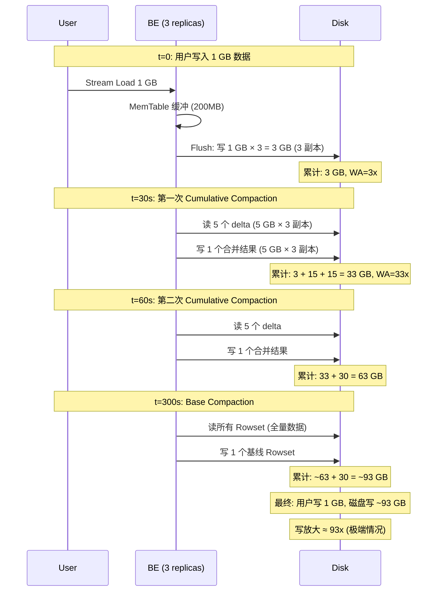

# Apache Doris 读写放大分析

## 一、什么是读写放大

- **写放大（Write Amplification, WA）**：用户写入 1 字节数据，系统实际写入磁盘的字节数
- **读放大（Read Amplification, RA）**：用户请求读取 1 字节数据，系统实际从磁盘读取的字节数

---

## 二、写放大分析

### 2.1 写放大的来源

```
用户写入 1 字节数据的实际写入路径:

  ① Stream Load
     └→ MemTable (内存, 不写磁盘)
     └→ Flush: 写 1 次 Segment 文件 ────────────────── WA = 1x

  ② 副本复制 (replication_num=3)
     └→ 3 个 BE 各写 1 次 ─────────────────────────── WA = 3x

  ③ Cumulative Compaction (累积压缩)
     └→ 5~1000 个 Rowset 合并为 1 个 ──────────────── WA = 3~10x

  ④ Base Compaction (基线压缩)
     └→ 所有 Base Rowset 合并为 1 个 ──────────────── WA = 1~2x

  ⑤ FE 元数据 (EditLog)
     └→ BDB JE 写 8~13 条日志, 2 个 FE 节点 ──────── WA ≈ 0 (元数据, 可忽略)
```

### 2.2 写放大计算公式

```
总写放大 = 副本因子 × (1 + Cumulative Compaction WA + Base Compaction WA)

         = 3 × (1 + 3~10 + 1~2)
         = 3 × 5~13
         = 15~39x
```

### 2.3 各环节详解

#### 环节①：MemTable Flush

```
用户数据 → MemTable (内存缓冲区, 最大 200MB)
                    │
                    │ MemTable 满 → Flush
                    ▼
           Segment 文件 (.dat)

写入次数: 1 次 (仅 MemTable 满时)
空间: 等于原始数据大小 (LZ4F 压缩后约 30~60%)
```

**配置**：

| 参数 | 默认值 | 说明 |
|------|-------|------|
| `write_buffer_size` | 200 MB | MemTable 最大容量 |

#### 环节②：副本复制

```
              ┌→ BE1: 写 Segment ──────────────┐
用户写入 ────┼→ BE2: 写 Segment ──────────────┼── Quorum 确认后 Commit
              └→ BE3: 写 Segment ──────────────┘

写入次数: 3 次 (3 个 BE 各写一次)
```

**关键点**：
- 同步复制：3 个 BE 全部写成功才 Commit
- 无 WAL：BE 不写预写日志，崩溃时丢弃未 Commit 的 Rowset，客户端重试
- 副本因子默认 3，可配置 1~Short.MAX_VALUE

#### 环节③：Cumulative Compaction（累积压缩）

```
Compaction 前:
  Base:     [1,5] (已有基线, 1 个 Rowset)
  Delta:    [6,6] [7,7] [8,8] [9,9] [10,10] (5 个新 Rowset)

Cumulative Compaction 触发 (min=5 个 delta):
  读取: [6,6] + [7,7] + [8,8] + [9,9] + [10,10] → 5 次读
  写入: [6,10] (1 个新 Rowset) → 1 次写
  WA = 读5次 + 写1次 ≈ 数据量的 5~6x

如果连续 9 轮 Cumulative 后触发 Base:
  第1轮: [6,10] ← 合并 5 个 delta
  第2轮: [11,15] ← 合并 5 个 delta
  ...
  第9轮: [46,50] ← 合并 5 个 delta
  每轮 WA ≈ 5~6x

数据被反复读取重写, 但每次范围不同, 属于递归放大
```

**配置**：

| 参数 | 默认值 | 说明 |
|------|-------|------|
| `min_cumulative_compaction_num_singleton_deltas` | 5 | 最少累积几个 delta 触发 |
| `max_cumulative_compaction_num_singleton_deltas` | 1000 | 最多容忍几个 delta |
| `cumulative_compaction_rounds_for_each_base_compaction_round` | 9 | 9 轮累积压 1 轮基线压 |
| `cumulative_size_based_promotion_size_mbytes` | 1024 MB | 累积结果晋升基线的最大大小 |
| `cumulative_size_based_promotion_ratio` | 0.05 (5%) | 晋升大小 = base_size × 5% |

#### 环节④：Base Compaction（基线压缩）

```
Base Compaction 触发条件 (满足任一):
  ① 累积 delta 数量 >= 5 (base_compaction_num_cumulative_deltas)
  ② 累积总大小 / 基线大小 >= 0.3 (base_cumulative_delta_ratio)
  ③ 距上次基线压 >= 24 小时

Base Compaction:
  读取: [1,5] + [6,10] + [11,15] + ... + [46,50] → 全部数据
  写入: [1,50] (1 个大 Rowset, 有序去重)
  WA = 1x (全量读+全量写)

Compaction 后: 每个 Key 只出现一次
  压缩率: 取决于工作负载
    Append-only: ≈ 1.0 (无重复数据, 仅重排)
    Upsert-heavy: 2~10x (消除大量过期版本)
```

### 2.4 写放大完整流水线



### 2.5 不同工作负载下的写放大

| 工作负载 | 每轮 Cumulative WA | Cumulative 轮数 | Base WA | 总 WA |
|---------|-------------------|-----------------|---------|-------|
| 低频大批量 (每分钟一次) | 1~2x | 1~2 | 1x | **6~12x** |
| 中频中批量 (每秒一次) | 5~6x | 3~5 | 1x | **15~30x** |
| 高频小批量 (每秒多次) | 5~6x | 5~9 | 1x | **20~39x** |
| Append-only (无更新) | 3~4x | 3~5 | 1x | **12~24x** |
| Upsert-heavy (大量更新) | 5~6x | 5~9 | 2~3x | **21~45x** |

### 2.6 与其他系统对比

| 系统 | 写放大 (典型) | 说明 |
|------|-------------|------|
| **Doris** | **15~39x** | 3 副本 + Compaction |
| **Apache Kudu** | ~10~30x | 3 副本 + MemoryStore + DiskStore |
| **Apache HBase** | ~10~35x | WAL + MemStore + HFile + Compaction |
| **RocksDB** | ~10~30x | WAL + MemTable + SST File + Compaction |
| **Apache Cassandra** | ~15~40x | Commit Log + MemTable + SSTable + Compaction |
| **3FS** | **3x** (写入) | 3 副本链式复制, 无 Compaction |

Doris 的写放大主要由 **Compaction** 驱动，是典型的 LSM-Tree 类存储引擎特征。

---

## 三、读放大分析

### 3.1 读放大的来源

```
用户查询 SELECT * FROM t1 WHERE dt='2024-01-01' 的实际读取路径:

  ① FE 路由
     └→ 确定需要扫描的 Partition + Tablet

  ② Segment 文件选择
     └→ Rowset 版本选择 (MVCC 快照)

  ③ Short Key Index
     └→ 二分查找 Block → 缩小到部分 Block

  ④ Bitmap Index (如有)
     └→ 精确匹配行号位图

  ⑤ Bloom Filter
     └→ 概率性过滤 Page (5% 误判率 → 少量额外读取)

  ⑥ Zone Map
     └→ min/max 过滤 Page

  ⑦ 多 Rowset 合并读
     └→ 每个版本都需要读 → 读放大主要来源

  ⑧ Page Cache
     └→ 命中则不读磁盘 → 降低实际读放大
```

### 3.2 读放大计算公式

```
读放大 = Rowset 数量 × (1 + Bloom Filter 误判率) × Page 未命中率

典型值:
  RA = (5~20) × (1 + 0.05) × (1.0 ~ 0.2)  // 缓存命中率 0~80%
     = 5.25 ~ 21 × 0.2 ~ 1.0
     = 1.05 ~ 21x

最坏情况 (无缓存, 1000 个未压缩 Rowset):
  RA = 1000 × 1.05 × 1.0 = 1050x (极端)
```

### 3.3 各环节详解

#### 环节①②：MVCC 版本选择

```
查询时的 Rowset 版本链:
  活跃: [1,2] [3,3] [4,4] [5,5] [6,6] [7,7] [8,8]

  VersionGraph 最短路径:
    0 → [1,2] → 3 → [3,3] → 4 → [4,4] → 5 → [5,5] → 6 → [6,6] → 7 → [7,7] → 8 → [8,8]

  需要读取的 Rowset 数 = 版本路径中的 Rowset 数
  Compaction 后: [1,5] [6,8] → 只需读 2 个 Rowset
```

**读放大与 Compaction 的关系**：

| 状态 | Rowset 数量 | 读放大 |
|------|------------|--------|
| Compaction 刚完成 | 1 (base only) | **1x** (最优) |
| 累积 5 个 delta | 1 + 5 = 6 | **6x** |
| 累积 20 个 delta | 1 + 20 = 21 | **21x** |
| 累积 1000 个 delta (极端) | 1 + 1000 = 1001 | **1001x** |

#### 环节③：Short Key Index

```
每个 Block = 1024 行

Segment 有 100,000 行 → 98 个 Block

Short Key Index 查找: 二分搜索 98 个 Block
  → 排除约 90% 的 Block (取决于查询条件选择性)

额外开销: 读 Short Key Index Page (1 次 I/O, 通常缓存命中)
读放大贡献: ~0 (可忽略)
```

#### 环节⑤：Bloom Filter

```
Bloom Filter 误判率 = 5% (默认)

扫描 20 个 Rowset, 每个有 100 个 Page:
  总 Page 数 = 2000
  Bloom Filter 正确排除的 Page ≈ 1900 (95%)
  误判的 Page ≈ 100 (5%)

额外读取 = 100 Page × 64KB = 6.4 MB
如果查询实际只命中 10 个 Page, 则 Bloom Filter 误判导致:
  RA_bloom = (10 + 100) / 10 = 11x
```

#### 环节⑦：UNIQUE_KEYS 的 Merge Heap

```
UNIQUE_KEYS 查询需要多 Rowset 合并:
  20 个 Rowset, 每个 100 万行

  Merge Heap 操作:
    - 每行需要比较 Key (log(20) ≈ 5 次比较)
    - 同一 Key 的多个版本都需要读出再丢弃

  实际数据读取: 20 × 100 万行 = 2000 万行
  有效数据输出: 100 万行 (去重后)
  读放大 = 20x
```

#### 环节⑧：Page Cache

```
Page Cache 命中率对读放大的影响:

  缓存大小: 20% 系统内存
    假设 256 GB 内存 → 51.2 GB Page Cache

  热数据查询:
    Page Cache 命中率 ≈ 90%+
    实际读放大 = RA_理论 × (1 - 0.9) = RA × 0.1

  冷数据查询:
    Page Cache 命中率 ≈ 0%
    实际读放大 = RA_理论 × 1.0
```

### 3.4 读放大完整示例

```
场景: SELECT * FROM sales WHERE dt = '2024-01-15' AND user_id = 12345
表: 1000 万行, 1000 万行/Partition, 8 Tablet, 3 副本

Step 1: FE 路由 → 1 Partition, 8 Tablet, 选 1 副本
Step 2: 每个 Tablet 有 10 个 Rowset (base + 9 delta)
Step 3: Short Key Index → 排除 90% Block → 剩余 10%
Step 4: Bloom Filter (user_id 列) → 95% Page 正确排除
Step 5: Zone Map (dt 列) → 排除不匹配的 Page
Step 6: 实际需要读的 Page 数 = 10% × 5% × 原始 Page 数

理论读放大:
  RA = 10 Rowset × 1.05 × 1.0 = 10.5x (无缓存)
  RA = 10 Rowset × 1.05 × 0.1 = 1.05x (90% 缓存命中)
```

### 3.5 不同场景下的读放大

| 场景 | Rowset 数 | 缓存命中率 | 实际读放大 | 说明 |
|------|----------|-----------|-----------|------|
| 刚 Compaction + 热数据 | 1 | 95% | **0.05x** | 最优 |
| 刚 Compaction + 冷数据 | 1 | 0% | **1x** | 无放大 |
| 10 个 delta + 热数据 | 10 | 90% | **1.05x** | 缓存抵消 Rowset 放大 |
| 10 个 delta + 冷数据 | 10 | 0% | **10.5x** | 典型 OLAP 查询 |
| 100 个 delta + 冷数据 | 100 | 0% | **105x** | Compaction 跟不上写入速度 |
| 1000 个 delta + 冷数据 | 1000 | 0% | **1050x** | 极端情况 |

---

## 四、读写放大的优化手段

### 4.1 写放大优化

| 手段 | 效果 | 配置 |
|------|------|------|
| 增大 MemTable | 减少 Flush 次数, 减少 Rowset 数 | `write_buffer_size = 200MB → 1GB` |
| 调优 Cumulative 策略 | 减少无效 Compaction 轮数 | `cumulative_compaction_policy = "size_based"` |
| 降低副本因子 | 直接减少写放大 | `replication_num = 2` (降低可靠性) |
| 增大 Cumulative 层数 | 每轮合并更多 Rowset | `min_cumulative_compaction_num_singleton_deltas = 10` |
| 降低 Promotion Ratio | 更多数据留在 Cumulative 层 | `cumulative_size_based_promotion_ratio = 0.1` |
| Append-only 工作负载 | Compaction 无数据消除, 纯重排 | 从设计上减少写放大 |

### 4.2 读放大优化

| 手段 | 效果 | 配置 |
|------|------|------|
| 及时 Compaction | 减少 Rowset 数量 | `max_compaction_threads = 10` |
| Bloom Filter | 等值查询减少 95% Page 读取 | `bloom_filter_columns = "col1,col2"` |
| Bitmap Index | 低基数字典列精确过滤 | `CREATE INDEX ... USING BITMAP` |
| Page Cache | 热数据免磁盘 I/O | `storage_page_cache_limit = "50%"` |
| 大 Page Size | 减少 Page 数量 (但增加单次 I/O) | `data_page_size = 256KB` |
| 读预取 | 顺序扫描减少 I/O 等待 | `enable_prefetch = true` |
| 分区裁剪 | 只扫描相关 Partition | `PARTITION BY RANGE(dt)` |

### 4.3 写入频率与读写放大的关系

```
写入频率 (QPS)
    │
    ├─ 低频 (< 1/s) ──── Compaction 跟得上 ──── WA=6~12x, RA=1~3x
    │
    ├─ 中频 (1~100/s) ── Compaction 勉强跟上 ── WA=15~30x, RA=5~20x
    │
    └─ 高频 (> 100/s) ── Compaction 跟不上 ──── WA=20~45x, RA=20~100x
                                           ↑
                                    需要优化: 增大 MemTable,
                                    增加 Compaction 线程,
                                    调整 Cumulative 策略
```

---

## 五、总结

### 写放大

| 来源 | 放大倍数 | 可调 |
|------|---------|------|
| 副本复制 | 3x | replication_num |
| MemTable Flush | 1x | write_buffer_size |
| Cumulative Compaction | 3~10x | 累积压缩策略 |
| Base Compaction | 1~2x | 基线压缩策略 |
| **总计** | **15~39x** | — |

### 读放大

| 来源 | 放大倍数 | 可调 |
|------|---------|------|
| MVCC 多版本 (Rowset 数) | 1~1000x | Compaction 频率 |
| Bloom Filter 误判 | +5% | bloom_filter_fpp |
| Zone Map | 减少读 (负放大) | 自动 |
| Page Cache | 减少 80~95% 读 | storage_page_cache_limit |
| **总计 (典型)** | **5~21x** (无缓存) / **1~5x** (有缓存) | — |

### 核心结论

1. **写放大的主因是 Compaction**，这是 LSM-Tree 类存储引擎的固有代价，用于将随机写转化为顺序写
2. **读放大的主因是 MVCC 多版本**，Compaction 不及时会导致 Rowset 堆积，读放大急剧上升
3. **读写放大是相互制约的**：更频繁的 Compaction 降低读放大但增加写放大；更少的 Compaction 降低写放大但增加读放大
4. **Page Cache 是最有效的读放大优化手段**，可将实际磁盘 I/O 降低一个数量级
5. **与 3FS 对比**：3FS 无 Compaction 机制，写放大仅为 3x（副本因子），但牺牲了列存、索引、压缩等 OLAP 能力

---