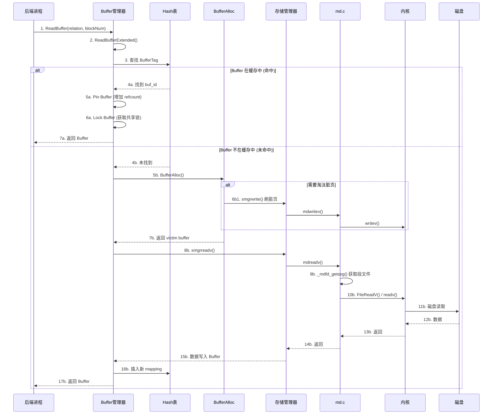
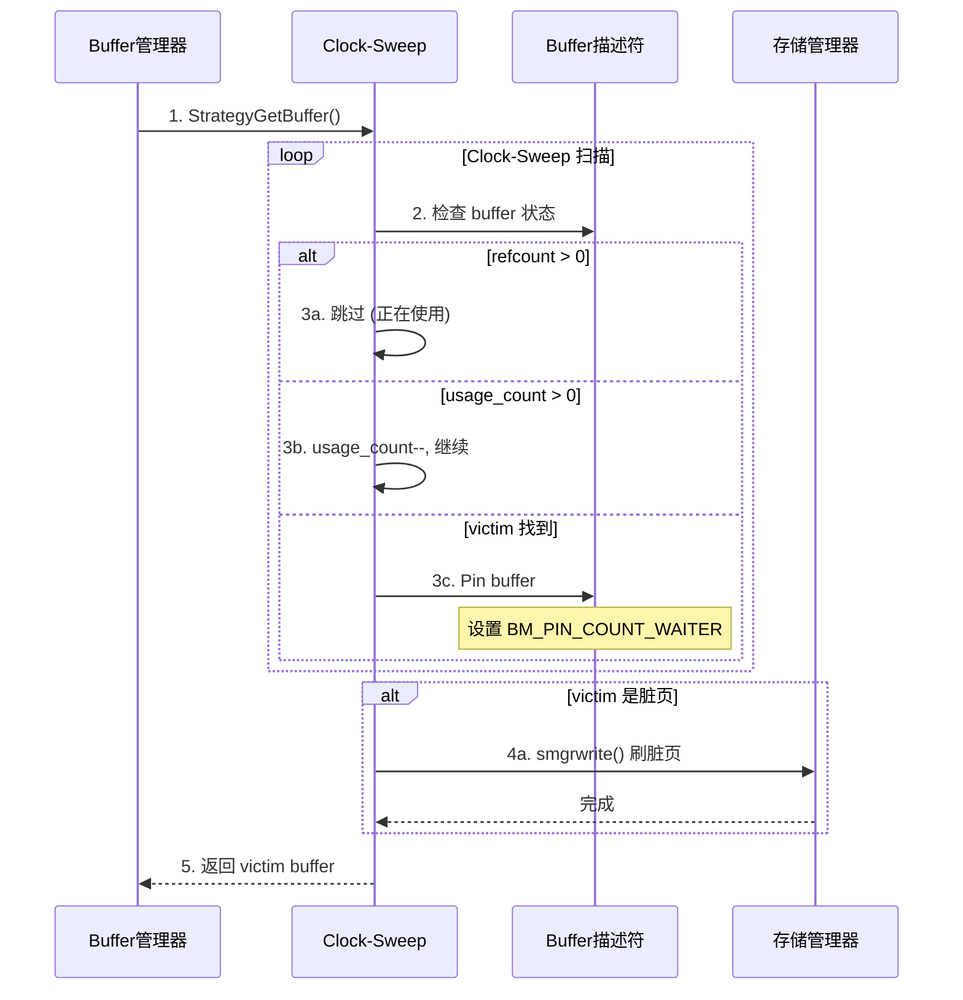
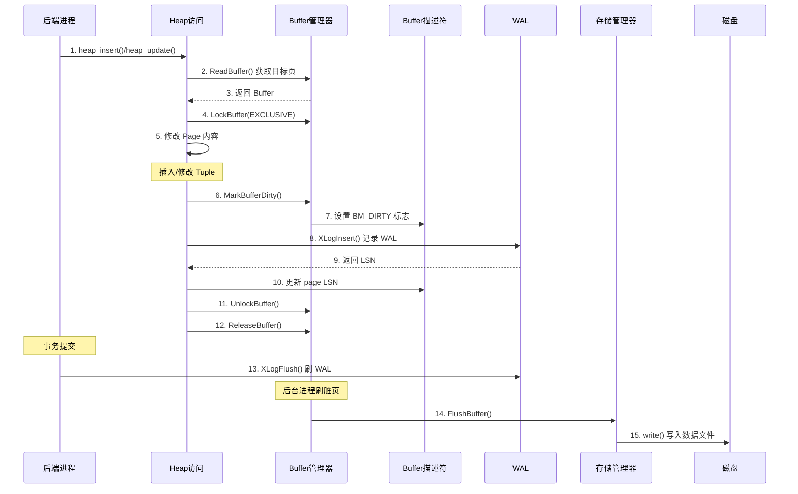
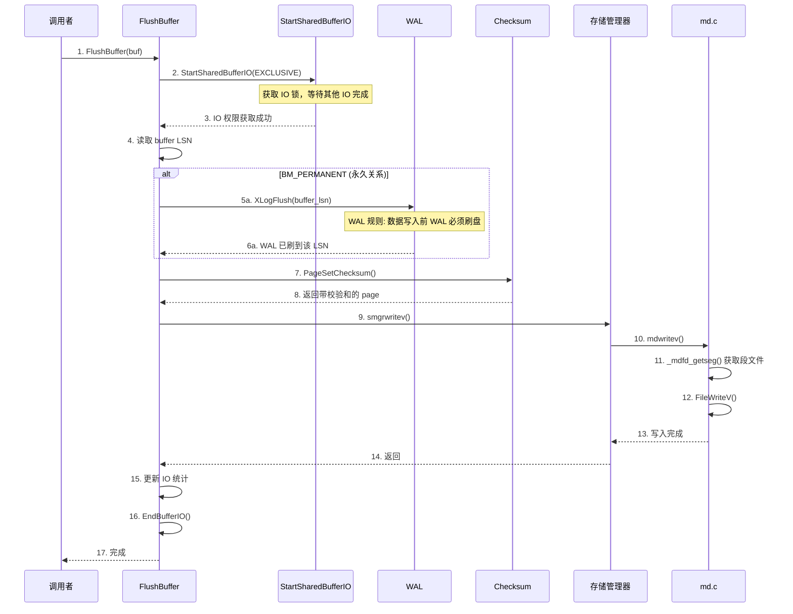
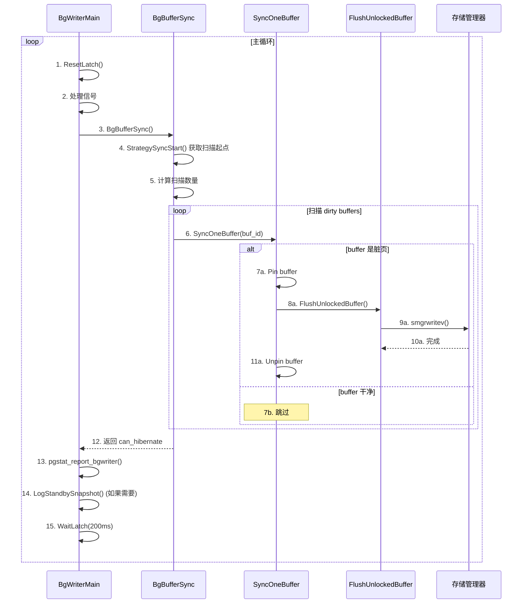
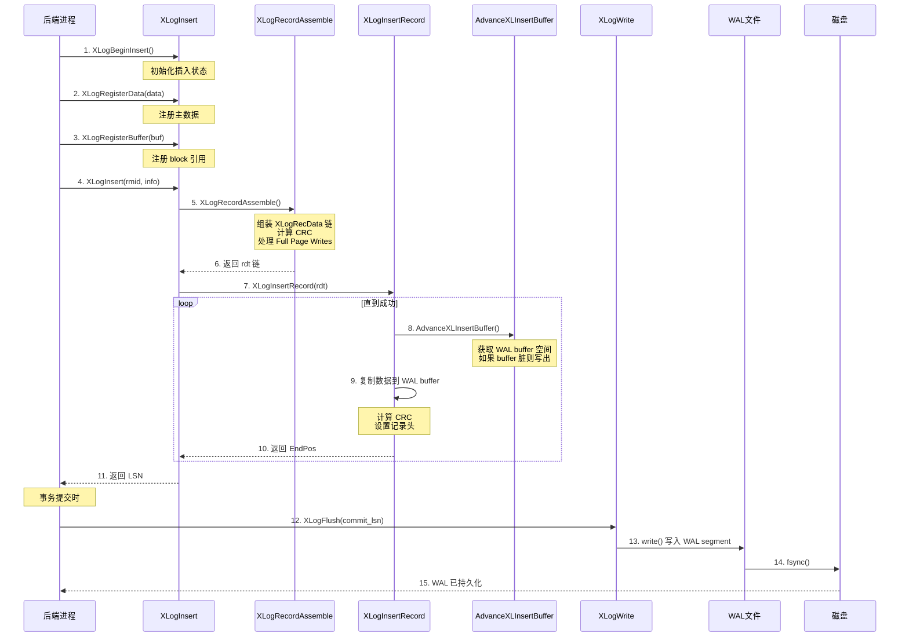
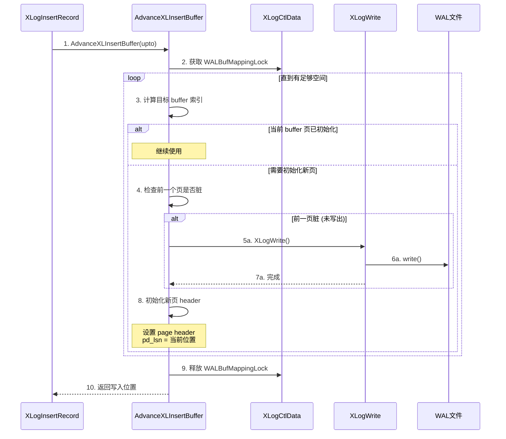
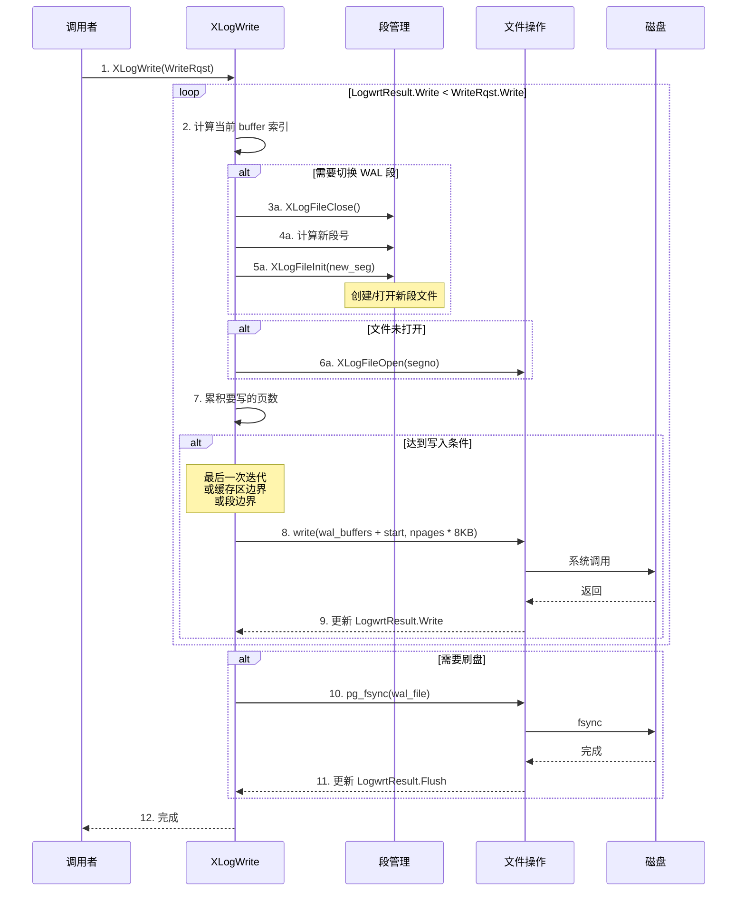
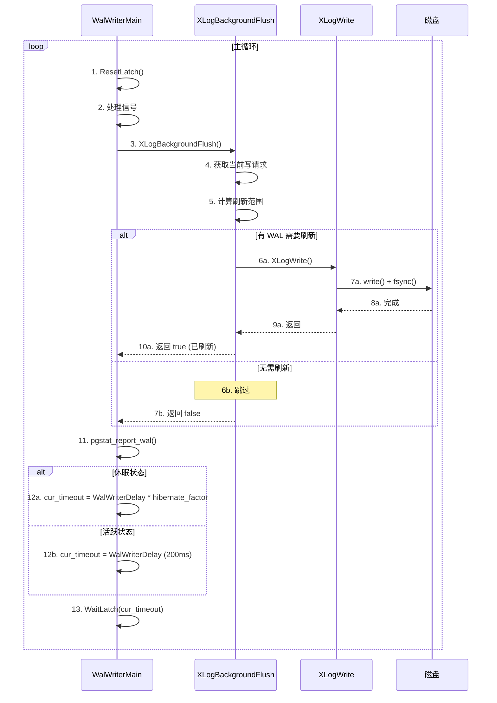
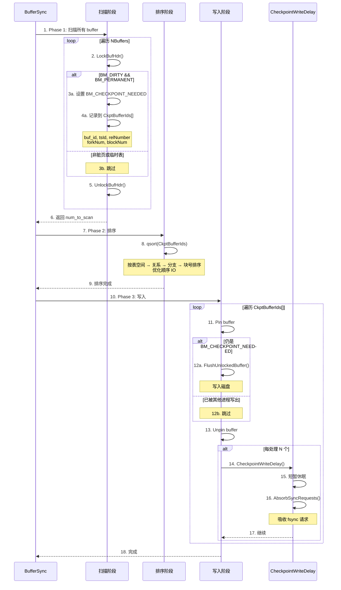

# PostgreSQL IO 流程详解

## 1. 概述

本文档详细分析 PostgreSQL 的 IO 流程，包括：
- 读 IO 流程
- 写 IO 流程
- WAL IO 流程
- Checkpoint IO 流程
- Background Writer 流程

## 2. 核心组件

### 2.1 组件架构

```
┌─────────────────────────────────────────────────────────────────────────┐
│                        PostgreSQL IO 架构                                │
├─────────────────────────────────────────────────────────────────────────┤
│                                                                          │
│  客户端进程 (Backend)                                                    │
│  ┌─────────────────────────────────────────────────────────────────┐   │
│  │ Executor → HeapAM → Buffer Manager                               │   │
│  └─────────────────────────────────────────────────────────────────┘   │
│      │                                                                   │
│      ▼                                                                   │
│  共享内存                                                                │
│  ┌─────────────────────────────────────────────────────────────────┐   │
│  │ Shared Buffers | WAL Buffers | Locks                             │   │
│  └─────────────────────────────────────────────────────────────────┘   │
│      │                                                                   │
│      ├──────────────────────────────────────────────────────────────┐  │
│      │                                                              │  │
│      ▼                                                              ▼  │
│  ┌─────────────────┐                           ┌─────────────────────┐ │
│  │ Storage Manager │                           │ WAL Subsystem       │ │
│  │ (smgr/md.c)     │                           │ (xlog.c)            │ │
│  └─────────────────┘                           └─────────────────────┘ │
│      │                                                              │   │
│      ▼                                                              ▼   │
│  ┌─────────────────────────────────────────────────────────────────┐  │
│  │                        文件系统                                   │  │
│  │              ext4/XFS + Linux Page Cache                         │  │
│  └─────────────────────────────────────────────────────────────────┘  │
│                                                                          │
│  后台进程                                                                │
│  ┌───────────┐  ┌───────────┐  ┌───────────┐  ┌───────────┐          │
│  │BgWriter   │  │WalWriter  │  │Checkpointer│  │BgWriter   │          │
│  └───────────┘  └───────────┘  └───────────┘  └───────────┘          │
│                                                                          │
└─────────────────────────────────────────────────────────────────────────┘
```

### 2.2 关键数据结构

```c
// Buffer Descriptor (buf_internals.h)
typedef struct BufferDesc {
    BufferTag   tag;              // Page 标识 (spcOid, dbOid, relNumber, blockNum)
    int         buf_id;           // Buffer 索引
    pg_atomic_uint64 state;       // 状态: refcount, usage count, flags
    LWLock      content_lock;     // 内容访问锁
    int         wait_backend_pgprocno;
    proclist_head lock_waiters;
} BufferDesc;

// Buffer 状态 (64位组合)
// - 18 位: refcount (引用计数)
// - 4 位: usage count (使用计数)
// - 12 位: flags (BM_DIRTY, BM_VALID 等)

// Storage Manager Relation
typedef struct SMgrRelationData {
    RelFileLocatorBackend smgr_rlocator;   // 关系定位器
    BlockNumber smgr_targblock;             // 扩展目标块
    BlockNumber smgr_cached_nblocks[MAX_FORKNUM];
    struct _MdfdVec *md_seg_fds[MAX_FORKNUM]; // 段文件描述符
    int md_num_open_segs[MAX_FORKNUM];
} SMgrRelationData;
```

### 2.3 关键源文件

| 组件 | 源文件 |
|------|--------|
| Buffer Manager | `src/backend/storage/buffer/bufmgr.c` |
| Storage Manager | `src/backend/storage/smgr/smgr.c`, `md.c` |
| WAL | `src/backend/access/transam/xlog.c`, `xloginsert.c` |
| Background Writer | `src/backend/postmaster/bgwriter.c` |
| WAL Writer | `src/backend/postmaster/walwriter.c` |
| Checkpointer | `src/backend/postmaster/checkpointer.c` |

## 3. 读 IO 流程

### 3.1 整体读流程



### 3.2 ReadBuffer 详细流程

```c
// bufmgr.c:926
Buffer ReadBufferExtended(Relation reln, ForkNumber forkNum, 
                          BlockNumber blockNum, ReadBufferMode mode,
                          BufferAccessStrategy strategy)
{
    // 1. 检查是否是本地临时表
    if (RelationUsesLocalBuffers(reln))
        return LocalBufferAlloc(...);
    
    // 2. 获取 SMgrRelation
    smgr = RelationGetSmgr(reln);
    
    // 3. 调用 ReadBuffer_common
    return ReadBuffer_common(smgr, RELATION_IS_OTHER_TEMP(reln), 
                             forkNum, blockNum, mode, strategy);
}
```

### 3.3 BufferAlloc 流程



### 3.4 mdreadv() 详细流程

```c
// md.c:859
void mdreadv(SMgrRelation reln, ForkNumber forknum, BlockNumber blocknum,
             void **buffers, BlockNumber nblocks)
{
    // 1. 获取段文件描述符
    v = _mdfd_getseg(reln, forknum, blocknum, false, 
                     EXTENSION_FAIL | EXTENSION_CREATE_RECOVERY);
    
    // 2. 计算读取位置
    seekpos = BLCKSZ * (blocknum % RELSEG_SIZE);
    
    // 3. 转换为 iovec
    buffers_to_iovec(&iov, buffers, nblocks);
    
    // 4. 循环读取处理短读
    while (nbytes < total_size) {
        nbytes = FileReadV(v->mdfd_vfd, iov, iovcnt, seekpos + nbytes);
        if (nbytes < 0)
            ereport(ERROR, ...);
    }
}
```


## 4. 写 IO 流程

### 4.1 整体写流程



### 4.2 MarkBufferDirty 流程

```c
// bufmgr.c:3147
void MarkBufferDirty(Buffer buffer)
{
    BufferDesc *bufHdr;
    uint32 buf_state;
    
    // 1. 验证 buffer 已 pin 和 lock
    Assert(BufferIsPinned(buffer));
    Assert(LWLockHeldByMe(BufferDescriptorGetContentLock(bufHdr)));
    
    // 2. 原子设置 BM_DIRTY 标志
    buf_state = pg_atomic_read_u64(&bufHdr->state);
    
    do {
        if (buf_state & BM_DIRTY)
            break;  // 已经是脏页
        old_buf_state = buf_state;
        buf_state |= BM_DIRTY;
    } while (!pg_atomic_compare_exchange_u64(&bufHdr->state, 
                                             &old_buf_state, 
                                             buf_state));
    
    // 3. 更新 vacuum cost 计数
    if (old_buf_state == 0)
        VacuumCostBalance += VacuumCostPageDirty;
}
```

### 4.3 FlushBuffer 流程



### 4.4 WAL 规则

```
┌─────────────────────────────────────────────────────────────────────────┐
│                          WAL 写前日志规则                                │
├─────────────────────────────────────────────────────────────────────────┤
│                                                                          │
│  规则: 数据页写入磁盘前，必须先将对应的 WAL 刷到磁盘                       │
│                                                                          │
│  原因:                                                                   │
│  - 如果数据页先写入，WAL 未写入，崩溃后无法恢复                           │
│  - WAL 是恢复的唯一来源                                                  │
│                                                                          │
│  实现:                                                                   │
│  1. 每个 Page 有 pd_lsn 字段记录最后修改的 LSN                           │
│  2. FlushBuffer() 时检查 BM_PERMANENT 标志                              │
│  3. 如果是永久关系，调用 XLogFlush(page_lsn)                            │
│  4. 确保 WAL 刷盘后才写数据页                                            │
│                                                                          │
│  时序:                                                                   │
│  ┌─────────────────────────────────────────────────────────────────┐   │
│  │  1. 修改 Page → 记录 WAL (LSN=X)                                  │   │
│  │  2. Page LSN = X                                                  │   │
│  │  3. FlushBuffer()                                                 │   │
│  │     ├── XLogFlush(X)  ← 先刷 WAL                                  │   │
│  │     └── write(page)  ← 后写数据                                   │   │
│  └─────────────────────────────────────────────────────────────────┘   │
│                                                                          │
└─────────────────────────────────────────────────────────────────────────┘
```

### 4.5 Background Writer 流程



```c
// bgwriter.c:89
void BackgroundWriterMain(const void *startup_data, size_t startup_data_len)
{
    for (;;) {
        ResetLatch(MyLatch);
        ProcessMainLoopInterrupts();
        
        // 执行一轮脏页写入
        can_hibernate = BgBufferSync(&wb_context);
        
        // 报告统计
        pgstat_report_bgwriter();
        pgstat_report_wal(true);
        
        // 处理 standby snapshot
        if (XLogStandbyInfoActive() && !RecoveryInProgress())
            LogStandbySnapshot();
        
        // 等待 200ms 或信号
        WaitLatch(MyLatch, WL_LATCH_SET | WL_TIMEOUT | WL_EXIT_ON_PM_DEATH,
                  BgWriterDelay, WAIT_EVENT_BGWRITER_MAIN);
    }
}
```


## 5. WAL IO 流程

### 5.1 WAL 写入整体流程



### 5.2 XLogInsert 详细流程

```c
// xloginsert.c:482
XLogRecPtr XLogInsert(RmgrId rmid, uint8 info)
{
    XLogRecPtr EndPos;
    
    // 1. 验证 XLogBeginInsert() 已调用
    Assert(begininsert_called);
    
    // 2. Bootstrap 模式返回假指针
    if (InRecovery)
        return GetXLogReplayRecPtr(NULL);
    
    // 3. 主循环
    do {
        // 3.1 获取 Full Page Write 信息
        GetFullPageWriteInfo(&RedoRecPtr, &doPageWrites);
        
        // 3.2 组装 WAL 记录
        rdt = XLogRecordAssemble(rmid, info, RedoRecPtr, doPageWrites, ...);
        
        // 3.3 插入到 WAL buffer
        EndPos = XLogInsertRecord(rdt, fpw_lsn, curinsert_flags, ...);
        
    } while (!XLogRecPtrIsValid(EndPos));
    
    // 4. 重置插入状态
    XLogResetInsertion();
    
    return EndPos;
}
```

### 5.3 WAL Buffer 管理



### 5.4 XLogWrite 详细流程



### 5.5 WAL Writer 后台进程



```c
// walwriter.c:89
void WalWriterMain(const void *startup_data, size_t startup_data_len)
{
    for (;;) {
        // 刷新 WAL
        if (XLogBackgroundFlush())
            left_till_hibernate = LOOPS_UNTIL_HIBERNATE;
        
        pgstat_report_wal(false);
        
        // 等待
        WaitLatch(MyLatch, WL_LATCH_SET | WL_TIMEOUT | WL_EXIT_ON_PM_DEATH,
                  cur_timeout, WAIT_EVENT_WAL_WRITER_MAIN);
    }
}
```

### 5.6 WAL 段文件管理

```
┌─────────────────────────────────────────────────────────────────────────┐
│                        WAL 段文件结构                                    │
├─────────────────────────────────────────────────────────────────────────┤
│                                                                          │
│  WAL 目录: $PGDATA/pg_wal/                                              │
│                                                                          │
│  段文件命名: 时间线ID + 段序号                                           │
│  ┌─────────────────────────────────────────────────────────────────┐   │
│  │ 000000010000000000000001   (时间线 1, 段 1)                       │   │
│  │ 000000010000000000000002   (时间线 1, 段 2)                       │   │
│  │ 000000010000000000000003   (时间线 1, 段 3)                       │   │
│  └─────────────────────────────────────────────────────────────────┘   │
│                                                                          │
│  段大小: 默认 16MB (wal_segment_size)                                   │
│                                                                          │
│  段切换条件:                                                             │
│  1. 写入超过段大小                                                       │
│  2. 时间线切换                                                           │
│  3. pg_switch_wal() 手动切换                                            │
│                                                                          │
│  段文件生命周期:                                                          │
│  ┌─────────────────────────────────────────────────────────────────┐   │
│  │  1. 创建: XLogFileInit()                                         │   │
│  │  2. 写入: XLogWrite()                                            │   │
│  │  3. 完成后: 可能被归档 (archive_command)                          │   │
│  │  4. 归档后: 可能被删除或保留用于恢复                               │   │
│  └─────────────────────────────────────────────────────────────────┘   │
│                                                                          │
└─────────────────────────────────────────────────────────────────────────┘
```


## 6. Checkpoint IO 流程

### 6.1 Checkpoint 整体流程

```mermaid
sequenceDiagram
    participant Main as CheckpointerMain
    participant Create as DoCheckPoint
    participant Pre as SyncPreCheckpoint
    participant BufSync as BufferSync
    participant WriteDelay as CheckpointWriteDelay
    participant WAL as WAL
    participant Post as SyncPostCheckpoint
    participant Disk as 磁盘

    loop 主循环
        Main->>Main: 1. 等待 checkpoint 请求或超时
        
        alt 收到请求
            Main->>Create: 2. DoCheckPoint(flags)
            
            Create->>Pre: 3. SyncPreCheckpoint()
            Note over Pre: 让 smgr 准备
            
            Create->>Create: 4. 进入临界区
            Create->>Create: 5. 获取 REDO 指针
            Note over Create: WAL 位置，恢复起点
            
            Create->>Create: 6. 确定 checkpoint 字段
            Note over Create: ThisTimeLineID<br/>fullPageWrites<br/>redo<br/>oldestActiveXid
            
            Create->>BufSync: 7. BufferSync(flags)
            
            BufSync->>BufSync: Phase 1: 扫描标记脏页
            Note over BufSync: 设置 BM_CHECKPOINT_NEEDED
            
            BufSync->>BufSync: Phase 2: 排序
            Note over BufSync: 按表空间/关系/块排序优化 IO
            
            loop Phase 3: 写入脏页
                BufSync->>Disk: 写入一批脏页
                BufSync->>WriteDelay: CheckpointWriteDelay()
                Note over WriteDelay: 速率限制<br/>允许其他后端继续
            end
            
            BufSync-->>Create: 8. 返回
            
            Create->>WAL: 9. XLogBeginInsert()
            Create->>WAL: 10. XLogRegisterData(checkpoint)
            Create->>WAL: 11. XLogInsert(XLOG_CHECKPOINT)
            WAL-->>Create: 12. 返回 LSN
            
            Create->>WAL: 13. XLogFlush(checkpoint_lsn)
            Note over WAL: 确保 checkpoint WAL 持久化
            
            Create->>Create: 14. 更新控制文件
            Note over Create: 记录 checkpoint 位置
            
            Create->>Post: 15. SyncPostCheckpoint()
            Note over Post: 处理 fsync 请求
            
            Create-->>Main: 16. 完成
        end
    end
```

### 6.2 BufferSync 三阶段流程



### 6.3 CheckpointWriteDelay 速率控制

```c
// checkpointer.c:800
void CheckpointWriteDelay(int flags, double progress)
{
    static int absorb_counter = 0;
    
    // 1. 计算休眠时间
    // 基于 checkpoint_completion_target 分散写入
    
    // 2. 短暂休眠
    pg_usleep(50000);  // 50ms
    
    // 3. 定期吸收 sync 请求
    if ((absorb_counter % PGSMGR_ABSORB_FREQUENCY) == 0)
        AbsorbSyncRequests();
    
    // 4. 检查配置重载
    if (ConfigReloadPending) {
        ConfigReloadPending = false;
        ProcessConfigFile(PGC_SIGHUP);
    }
    
    // 5. 检查中断
    CHECK_FOR_INTERRUPTS();
}
```

### 6.4 Checkpoint 触发条件

```
┌─────────────────────────────────────────────────────────────────────────┐
│                        Checkpoint 触发条件                               │
├─────────────────────────────────────────────────────────────────────────┤
│                                                                          │
│  时间触发:                                                               │
│  ─────────────────────────────────────────────────────────────────────  │
│  checkpoint_timeout = 5min (默认)                                       │
│  距离上次 checkpoint 超过此时间则触发                                     │
│                                                                          │
│  WAL 触发:                                                               │
│  ─────────────────────────────────────────────────────────────────────  │
│  max_wal_size = 1GB (默认)                                              │
│  WAL 文件总量超过此值则触发                                              │
│                                                                          │
│  手动触发:                                                               │
│  ─────────────────────────────────────────────────────────────────────  │
│  CHECKPOINT;                                                            │
│  pg_checkpoint();                                                       │
│                                                                          │
│  关闭触发:                                                               │
│  ─────────────────────────────────────────────────────────────────────  │
│  shutdown checkpoint (CHECKPOINT_IS_SHUTDOWN)                           │
│                                                                          │
│  其他触发:                                                               │
│  ─────────────────────────────────────────────────────────────────────  │
│  - 数据库启动完成 (CHECKPOINT_END_OF_RECOVERY)                          │
│  - ALTER DATABASE ... SET ...                                           │
│  - CREATE DATABASE ...                                                  │
│  - pg_ctl stop                                                          │
│                                                                          │
└─────────────────────────────────────────────────────────────────────────┘
```

### 6.5 Checkpoint 类型

```c
// xlog.h
#define CHECKPOINT_IS_SHUTDOWN      0x0001  // 关闭检查点
#define CHECKPOINT_END_OF_RECOVERY  0x0002  // 恢复结束
#define CHECKPOINT_IMMEDIATE        0x0004  // 立即执行，不分散
#define CHECKPOINT_FORCE            0x0008  // 强制执行，忽略限制
#define CHECKPOINT_WAIT             0x0010  // 等待完成
#define CHECKPOINT_CAUSE_XLOG       0x0020  // WAL 触发
#define CHECKPOINT_CAUSE_TIME       0x0040  // 超时触发
```


## 7. IO 参数配置

### 7.1 Buffer 相关参数

| 参数 | 默认值 | 说明 |
|------|--------|------|
| `shared_buffers` | 128MB | 共享缓冲池大小 |
| `effective_io_concurrency` | 1 | 预读并发数 |
| `random_page_cost` | 4.0 | 随机 IO 代价 |
| `effective_cache_size` | 4GB | 预估系统缓存大小 |

### 7.2 WAL 相关参数

| 参数 | 默认值 | 说明 |
|------|--------|------|
| `wal_buffers` | 4MB | WAL 缓冲区大小 |
| `wal_writer_delay` | 200ms | WAL writer 休眠间隔 |
| `wal_writer_flush_after` | 1MB | 触发刷盘的阈值 |
| `synchronous_commit` | on | 同步提交开关 |
| `wal_sync_method` | fdatasync | WAL 刷盘方法 |

### 7.3 Checkpoint 相关参数

| 参数 | 默认值 | 说明 |
|------|--------|------|
| `checkpoint_timeout` | 5min | Checkpoint 超时 |
| `max_wal_size` | 1GB | 最大 WAL 大小 |
| `checkpoint_completion_target` | 0.9 | 完成目标比例 |
| `checkpoint_flush_after` | 256KB | 刷盘阈值 |

### 7.4 Background Writer 参数

| 参数 | 默认值 | 说明 |
|------|--------|------|
| `bgwriter_delay` | 200ms | 休眠间隔 |
| `bgwriter_lru_maxpages` | 100 | 每轮最大写页数 |
| `bgwriter_lru_multiplier` | 2.0 | 写入倍数 |

## 8. IO 性能优化建议

### 8.1 读 IO 优化

```
1. 增大 shared_buffers
   - 通常设置为系统内存的 25%
   - 但不要超过 8GB (Windows) 或 16GB (Linux)

2. 使用 effective_io_concurrency
   - SSD: 设置为 200
   - HDD: 设置为 2

3. 调整 random_page_cost
   - SSD: 设置为 1.1
   - HDD: 保持 4.0

4. 使用 huge pages
   - 减少页表开销
   - 对大 shared_buffers 特别有效
```

### 8.2 写 IO 优化

```
1. 调整 checkpoint 参数
   - checkpoint_completion_target = 0.9
   - max_wal_size = 适当增大

2. 考虑异步提交
   - synchronous_commit = off
   - 延迟降低，但有数据丢失风险

3. 使用合适的 wal_sync_method
   - Linux: fdatasync 或 open_datasync
   - 测试选择最佳方法

4. 分离 WAL 和数据文件
   - 放在不同磁盘
   - 减少竞争
```

### 8.3 监控指标

```sql
-- Buffer 命中率
SELECT 
    sum(heap_blks_read) as heap_read,
    sum(heap_blks_hit) as heap_hit,
    sum(heap_blks_hit) / (sum(heap_blks_hit) + sum(heap_blks_read)) as ratio
FROM pg_statio_user_tables;

-- Checkpoint 统计
SELECT * FROM pg_stat_bgwriter;

-- WAL 统计
SELECT * FROM pg_stat_wal;
```

## 9. 总结

### 9.1 IO 路径对比

| IO 类型 | 触发者 | 目的 | 关键函数 |
|---------|--------|------|----------|
| **读 IO** | 后端进程 | 读取数据页 | `ReadBuffer()` → `smgrreadv()` |
| **写 IO** | BgWriter/Checkpointer | 刷脏页 | `FlushBuffer()` → `smgrwritev()` |
| **WAL IO** | WAL Writer/后端 | 持久化日志 | `XLogInsert()` → `XLogWrite()` |
| **Checkpoint IO** | Checkpointer | 全量刷盘 | `BufferSync()` → `FlushBuffer()` |

### 9.2 后台进程职责

```
┌─────────────────────────────────────────────────────────────────────────┐
│                        后台进程职责                                      │
├─────────────────────────────────────────────────────────────────────────┤
│                                                                          │
│  Background Writer (bgwriter):                                          │
│  ─────────────────────────────────────────────────────────────────────  │
│  - 周期性扫描并写出脏页                                                  │
│  - 减少检查点压力                                                        │
│  - 为后端进程预留干净 buffer                                             │
│  - 休眠间隔: 200ms                                                       │
│                                                                          │
│  WAL Writer (walwriter):                                                │
│  ─────────────────────────────────────────────────────────────────────  │
│  - 周期性刷新 WAL 缓冲区                                                 │
│  - 减少事务提交延迟                                                      │
│  - 支持异步提交                                                          │
│  - 休眠间隔: 200ms                                                       │
│                                                                          │
│  Checkpointer (checkpointer):                                           │
│  ─────────────────────────────────────────────────────────────────────  │
│  - 执行检查点                                                            │
│  - 刷新所有脏页                                                          │
│  - 记录检查点 WAL                                                        │
│  - 更新控制文件                                                          │
│  - 处理 fsync 请求                                                       │
│  - 触发条件: 超时 / WAL 大小 / 手动                                      │
│                                                                          │
└─────────────────────────────────────────────────────────────────────────┘
```

### 9.3 关键设计原则

1. **WAL 写前日志**: 数据写入前必须先写 WAL
2. **Clock-Sweep 替换**: 基于使用频率的 buffer 替换
3. **分散检查点**: 避免瞬时大量 IO
4. **批量写入**: 减少系统调用次数
5. **异步 IO**: 后台进程处理刷盘，减少前端延迟

---
