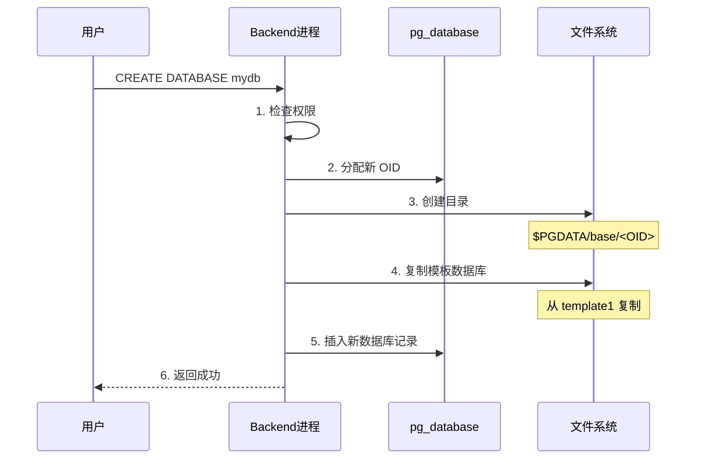
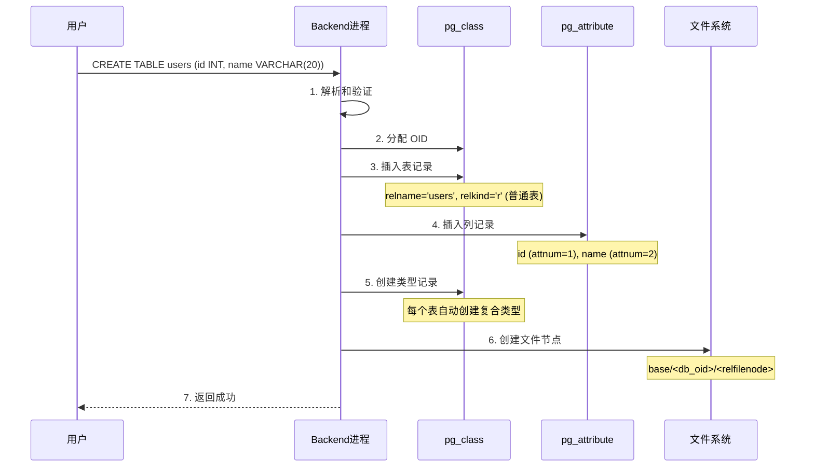
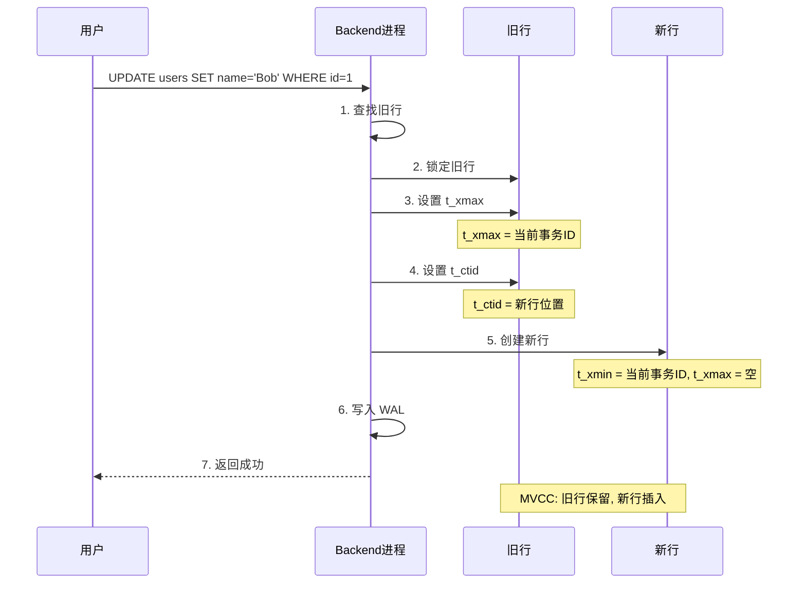

# PostgreSQL 元数据管理分析

## 1. 概述

PostgreSQL 使用**系统目录（System Catalog）**管理数据库、表、行等元数据。系统目录是一组特殊的表，存储在 `pg_catalog` schema 中。

**层次结构**：
```
数据库集群 (Cluster)
├── 数据库 (Database)
│   ├── Schema
│   │   ├── 表 (Table)
│   │   │   ├── 列 (Column)
│   │   │   └── 行 (Row/Tuple)
│   │   ├── 索引 (Index)
│   │   └── 其他对象
```

## 2. 数据库级别元数据

### 2.1 核心系统表

| 系统表 | 说明 |
|--------|------|
| `pg_database` | 数据库信息 |
| `pg_tablespace` | 表空间信息 |
| `pg_authid` | 用户认证信息 |
| `pg_settings` | 配置参数 |

### 2.2 pg_database 结构

```sql
SELECT * FROM pg_database;

主要字段:
├── datname      : 数据库名称
├── datdba       : 所有者 OID
├── encoding     : 编码
├── datcollate   : 排序规则
├── datctype     : 字符类型
├── datistemplate: 是否为模板数据库
├── datallowconn : 是否允许连接
└── datconnlimit : 连接数限制 (-1 为无限制)
```

### 2.3 数据库存储结构

```
数据目录 ($PGDATA)
├── base/                  : 默认表空间
│   ├── 1/                 : template1 数据库
│   ├── 13067/             : postgres 数据库
│   └── 16384/             : 用户数据库 (OID)
├── global/                : 共享系统表
├── pg_wal/                : WAL 日志
├── pg_xact/               : 事务提交状态
└── postgresql.conf        : 配置文件
```

### 2.4 数据库创建流程



## 3. 表级别元数据

### 3.1 核心系统表

| 系统表 | 说明 |
|--------|------|
| `pg_class` | 表、索引、序列等对象 |
| `pg_namespace` | Schema 信息 |
| `pg_attribute` | 列信息 |
| `pg_type` | 数据类型 |
| `pg_index` | 索引信息 |
| `pg_constraint` | 约束信息 |

### 3.2 pg_class 结构

```sql
SELECT * FROM pg_class WHERE relname = 'users';

主要字段:
├── relname      : 表名
├── relnamespace : 所属 schema OID
├── reltype      : 对应类型 OID
├── reloftype    : 类型表 OID
├── relowner     : 所有者 OID
├── relam        : 访问方法
├── relfilenode  : 文件节点号
├── reltablespace: 表空间 OID
├── relpages     : 页面数
├── reltuples    : 行数估计
├── relallvisible: 全可见页面数
├── reltoastrelid: TOAST 表 OID
├── relhasindex  : 是否有索引
├── relisshared  : 是否共享
└── relpersistence: 持久性类型
```

### 3.3 pg_attribute 结构

```sql
SELECT * FROM pg_attribute WHERE attrelid = 'users'::regclass;

主要字段:
├── attrelid     : 所属表 OID
├── attname      : 列名
├── atttypid     : 数据类型 OID
├── attlen       : 类型长度
├── attnum       : 列编号
├── attndims     : 数组维度
├── attcacheoff  : 缓存偏移
├── attbyval     : 是否按值传递
├── attstorage   : 存储类型
├── attalign     : 对齐方式
├── attnotnull   : 是否 NOT NULL
├── atthasdef    : 是否有默认值
└── attidentity  : 标识列类型
```

### 3.4 表创建流程



### 3.5 表文件映射

```
表对象到文件的映射:

pg_class.relfilenode → 文件路径

示例:
relfilenode = 16385
├── 数据文件: base/16384/16385
├── FSM文件:  base/16384/16385_fsm  (空闲空间映射)
└── VM文件:   base/16384/16385_vm   (可见性映射)

TRUNCATE 或 REINDEX 会改变 relfilenode
```

## 4. 行级别元数据

### 4.1 行头信息 (HeapTupleHeaderData)

```
行头结构 (23B，最小):
┌─────────────────────────────────────────────────────────────────────────┐
│ t_xmin (4B)   : 插入该行的事务 ID                                        │
│ t_xmax (4B)   : 删除/更新该行的事务 ID                                    │
│ t_cid (4B)    : 命令 ID (插入/删除命令序号)                               │
│ t_ctid (6B)   : 行标识符 (块号, 偏移)                                     │
│ t_infomask2 (2B): 列数 + 标志位                                          │
│ t_infomask (2B): 标志位                                                  │
│ t_hoff (1B)   : 用户数据偏移量                                           │
└─────────────────────────────────────────────────────────────────────────┘
```

### 4.2 关键标志位 (t_infomask)

| 标志位 | 说明 |
|--------|------|
| HEAP_HASNULL | 有 NULL 值 |
| HEAP_HASVARWIDTH | 有变长列 |
| HEAP_XMIN_COMMITTED | 插入事务已提交 |
| HEAP_XMIN_INVALID | 插入事务无效 |
| HEAP_XMAX_COMMITTED | 删除事务已提交 |
| HEAP_XMAX_INVALID | 删除事务无效 |
| HEAP_UPDATED | 这是更新后的行 |
| HEAP_ONLY_TUPLE | 这是仅存储的元组 |

### 4.3 事务可见性判断

```
行可见性判断规则:

1. 如果 t_xmin 已提交且 t_xmax 为空:
   → 行对所有人可见

2. 如果 t_xmin 已提交且 t_xmax 已提交:
   → 行对 t_xmax 之后的事务不可见

3. 如果 t_xmin 未提交:
   → 行对其他事务不可见

4. 如果 t_xmax 未提交:
   → 行仍然可见 (删除未完成)
```

### 4.4 UPDATE 操作的元数据变化



## 5. 系统缓存

### 5.1 系统表缓存

```
PostgreSQL 缓存系统目录以提高性能:

┌─────────────────────────────────────────────────────────────────────────┐
│                        系统目录缓存                                       │
├─────────────────────────────────────────────────────────────────────────┤
│                                                                          │
│  RelCache (关系缓存)                                                     │
│  ├── 缓存 pg_class 记录                                                  │
│  └── 加速表、索引查找                                                    │
│                                                                          │
│  AttrCache (属性缓存)                                                    │
│  ├── 缓存 pg_attribute 记录                                              │
│  └── 加速列信息查找                                                      │
│                                                                          │
│  TypeCache (类型缓存)                                                    │
│  ├── 缓存 pg_type 记录                                                   │
│  └── 加速类型查找                                                        │
│                                                                          │
│  CatCache (目录缓存)                                                     │
│  ├── 通用系统目录缓存                                                    │
│  └── 使用哈希表快速查找                                                  │
│                                                                          │
└─────────────────────────────────────────────────────────────────────────┘
```

### 5.2 缓存失效

```
缓存失效机制:

1. DDL 操作后:
   - 发送失效消息
   - 所有后端进程收到通知
   - 清除相关缓存

2. 事务提交时:
   - 检查是否修改了系统表
   - 广播失效消息

3. 示例:
   ALTER TABLE users ADD COLUMN age INT;
   → 所有后端进程清除 users 的 RelCache
```

## 6. 元数据查询示例

### 6.1 查看数据库信息

```sql
-- 所有数据库
SELECT datname, encoding, datcollate FROM pg_database;

-- 数据库大小
SELECT pg_size_pretty(pg_database_size('mydb'));
```

### 6.2 查看表信息

```sql
-- 所有表
SELECT tablename FROM pg_tables WHERE schemaname = 'public';

-- 表结构
SELECT column_name, data_type, is_nullable
FROM information_schema.columns
WHERE table_name = 'users';

-- 表大小
SELECT pg_size_pretty(pg_total_relation_size('users'));
```

### 6.3 查看索引信息

```sql
-- 表的索引
SELECT indexname, indexdef FROM pg_indexes WHERE tablename = 'users';

-- 索引详情
SELECT * FROM pg_index WHERE indrelid = 'users'::regclass;
```

## 7. OID 管理

### 7.1 OID 分配

```
OID (Object Identifier):
- 4 字节无符号整数
- 全局唯一
- 用于标识数据库对象

分配机制:
1. 从 pg_class 读取下一个 OID
2. 全局计数器递增
3. 插入系统表时分配
```

### 7.2 OID 查询

```sql
-- 查看表 OID
SELECT oid, relname FROM pg_class WHERE relname = 'users';

-- 通过 OID 查表名
SELECT relname FROM pg_class WHERE oid = 16385;

-- regclass 类型自动转换
SELECT 'users'::regclass::oid;
```

## 8. 总结

| 层级 | 系统表 | 主要字段 |
|------|--------|----------|
| **数据库** | pg_database | datname, encoding, datcollate |
| **表空间** | pg_tablespace | spcname, spcowner |
| **Schema** | pg_namespace | nspname, nspowner |
| **表** | pg_class | relname, relnamespace, relfilenode |
| **列** | pg_attribute | attname, atttypid, attnum |
| **类型** | pg_type | typname, typlen, typbyval |
| **索引** | pg_index | indrelid, indkey, indclass |
| **行** | HeapTupleHeader | t_xmin, t_xmax, t_ctid |

---