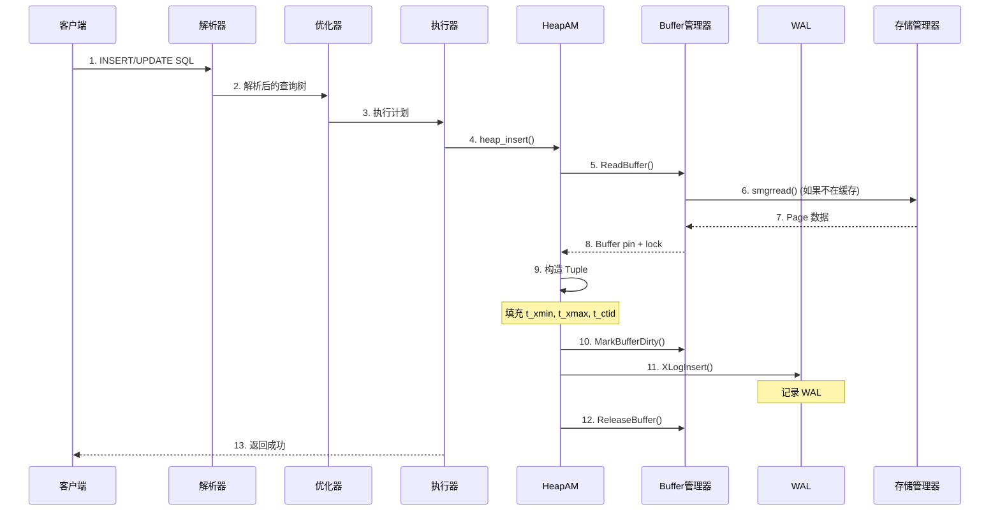
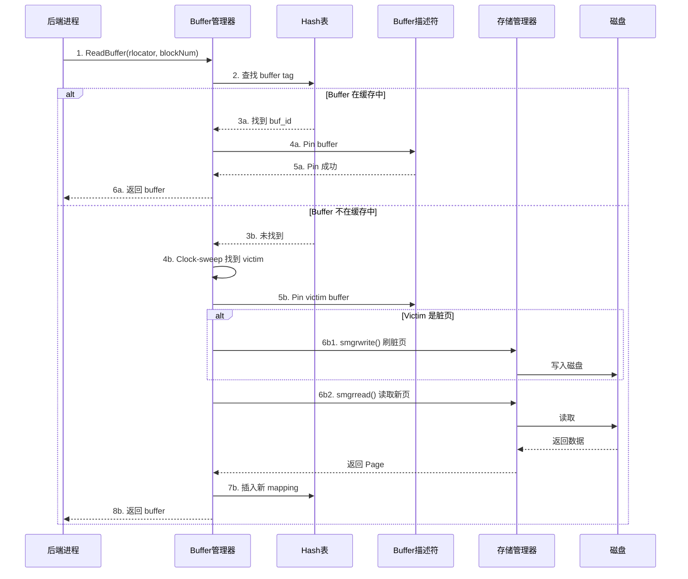
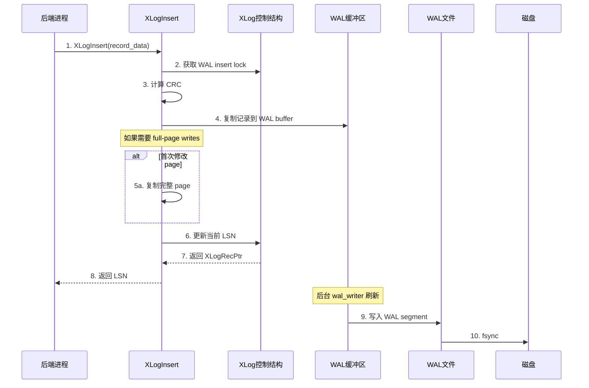
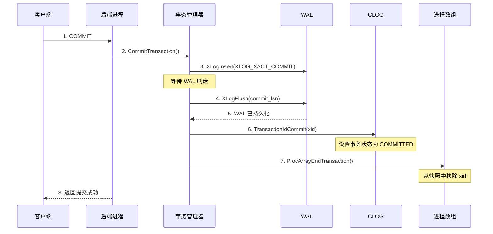
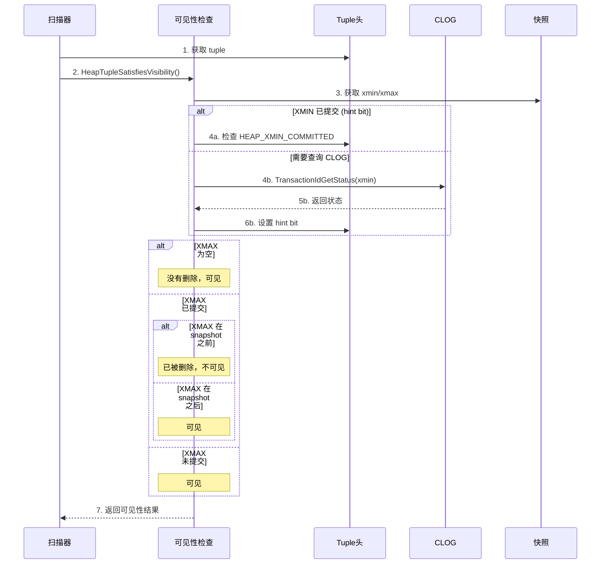
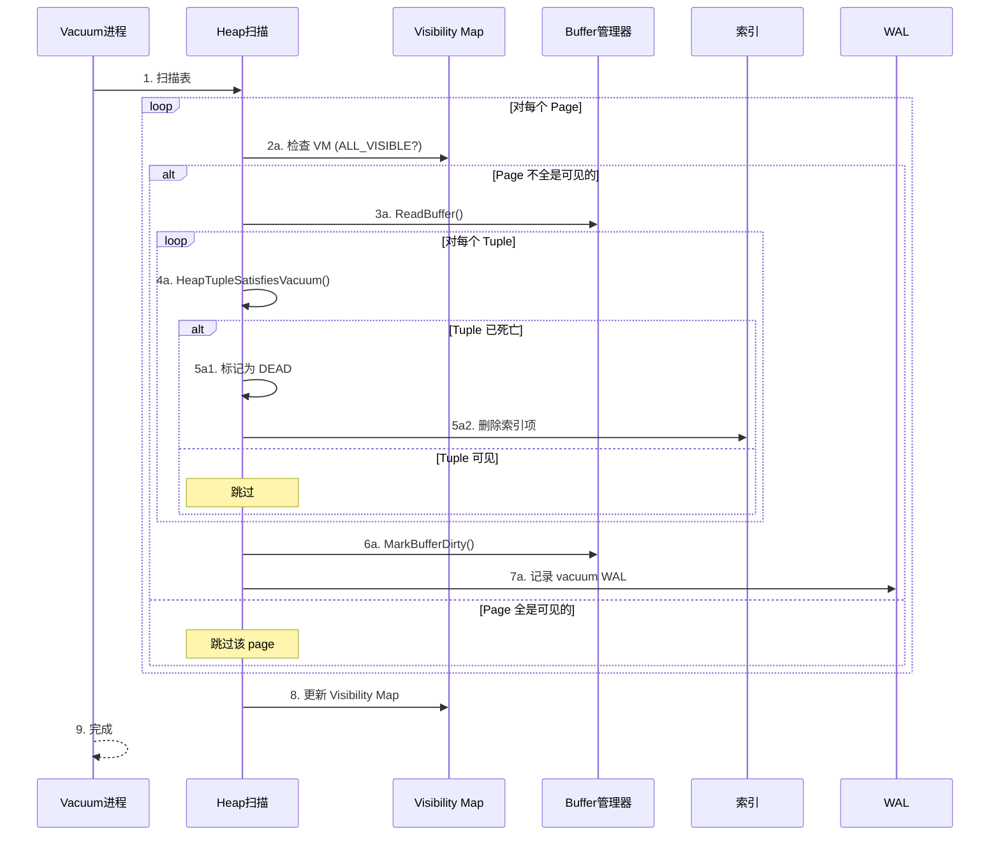
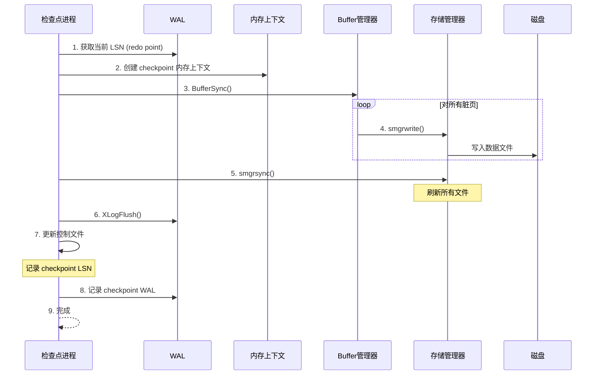

# PostgreSQL 存储模型分析

## 1. 概述

PostgreSQL 是一个功能强大的开源关系型数据库，其存储模型设计精巧，支持 ACID 事务、MVCC 并发控制等特性。

本文档基于 PostgreSQL 源码分析其存储模型，包括：
- 数据文件组织
- Page 和 Tuple 结构
- Buffer 管理
- WAL 机制
- MVCC 实现
- 关键流程时序图

## 2. 源码目录结构

```
postgres-master/src/
├── backend/
│   ├── storage/
│   │   ├── buffer/     # Buffer 管理器
│   │   ├── page/       # Page 操作
│   │   ├── smgr/       # 存储管理器 (磁盘 IO)
│   │   ├── file/       # 文件访问
│   │   ├── freespace/  # Free Space Map
│   │   └── lmgr/       # 锁管理器
│   └── access/
│       ├── heap/       # Heap 访问方法
│       ├── transam/    # 事务管理、WAL、Clog
│       ├── index/      # 索引访问方法
│       └── common/     # 通用访问
└── include/
    ├── storage/        # 存储相关头文件
    └── access/         # 访问方法头文件
```

## 3. 数据文件组织

### 3.1 关系文件定位器

```c
// src/include/storage/relfilelocator.h
typedef struct RelFileLocator {
    Oid         spcOid;     // Tablespace OID
    Oid         dbOid;      // Database OID
    RelFileNumber relNumber; // Relation 文件编号
} RelFileLocator;
```

### 3.2 分支 (Fork)

每个关系有多个分支，每个分支是一个独立文件：

```c
// src/include/common/relpath.h
typedef enum ForkNumber {
    MAIN_FORKNUM = 0,           // 主数据文件
    FSM_FORKNUM = 1,            // Free Space Map
    VISIBILITYMAP_FORKNUM = 2,  // Visibility Map
    INIT_FORKNUM = 3            // Initialization fork (unlogged tables)
} ForkNumber;
```

### 3.3 文件命名规则

```
文件路径格式: $PGDATA/base/<dbOid>/<relNumber>.<forkNum>

示例:
  主数据文件: base/16384/12345
  FSM 文件:   base/16384/12345_fsm
  VM 文件:    base/16384/12345_vm

大表分段: 每段最大 1GB (RELSEG_SIZE)
  base/16384/12345      (段 0)
  base/16384/12345.1    (段 1)
  base/16384/12345.2    (段 2)
```

## 4. Page 结构

### 4.1 Page 布局

PostgreSQL 使用 8KB 的固定页面大小 (BLCKSZ)：

```
+-------------------+----------------------------------------+
| PageHeaderData    | linp[0] linp[1] linp[2] ... linp[N-1]  |
+-------------------+----------------------------------------+
| ... linp[N-1]     |                                        |
+-------------------+         空闲空间                          |
|                   |                                        |
|                   v pd_upper                                |
|                                                            |
|                   ^ pd_lower                                |
|                   |                                        |
+-------------------+----------------------------------------+
|                   | tuple[N-1] ... tuple[2] tuple[1] tuple[0] |
+-------------------+------------------+---------------------+
|          "special space" (可选，用于索引)                    |
+--------------------------------------------+---------------+
                                            ^ pd_special
```

### 4.2 Page Header

```c
// src/include/storage/bufpage.h
typedef struct PageHeaderData {
    PageXLogRecPtr pd_lsn;      // WAL LSN (8 bytes)
    uint16          pd_checksum; // Page 校验和
    uint16          pd_flags;    // 标志位
    LocationIndex   pd_lower;    // 空闲空间起始
    LocationIndex   pd_upper;    // 空闲空间结束
    LocationIndex   pd_special;  // 特殊空间起始
    uint16          pd_pagesize_version;
    TransactionId   pd_prune_xid; // 最老的可能需要修剪的 XID
    ItemIdData      pd_linp[FLEXIBLE_ARRAY_MEMBER]; // Line pointer 数组
} PageHeaderData;
```

### 4.3 Line Pointer (ItemId)

```c
// src/include/storage/itemid.h
typedef struct ItemIdData {
    unsigned    lp_off:15,      // Tuple 在 page 中的偏移
                lp_flags:2,     // 状态标志
                lp_len:15;      // Tuple 长度
} ItemIdData;

// lp_flags 状态:
#define LP_UNUSED      0    // 未使用
#define LP_NORMAL      1    // 正常使用
#define LP_REDIRECT    2    // HOT 重定向
#define LP_DEAD        3    // 已死亡
```

## 5. Tuple 结构

### 5.1 HeapTupleHeaderData

```c
// src/include/access/htup_details.h
struct HeapTupleHeaderData {
    HeapTupleFields t_heap;      // 事务信息
    ItemPointerData t_ctid;      // 当前或更新版本的 TID
    uint16          t_infomask2; // 属性数量 + 标志
    uint16          t_infomask;  // 可见性标志
    uint8           t_hoff;      // 头部偏移
    uint8           t_bits[FLEXIBLE_ARRAY_MEMBER]; // NULL bitmap
};

struct HeapTupleFields {
    TransactionId t_xmin;   // 插入事务 ID
    TransactionId t_xmax;   // 删除/更新事务 ID
    union {
        CommandId t_cid;    // 命令 ID
        TransactionId t_xvac; // VACUUM 事务 ID
    } t_field3;
};
```

### 5.2 infomask 标志位

```c
// 事务可见性标志
#define HEAP_HASNULL           0x0001  // 有 NULL 值
#define HEAP_HASVARWIDTH       0x0002  // 有变长列
#define HEAP_HASEXTERNAL       0x0004  // 有外部存储 (TOAST)

#define HEAP_XMIN_COMMITTED    0x0100  // XMIN 已提交
#define HEAP_XMIN_INVALID      0x0200  // XMIN 无效
#define HEAP_XMIN_FROZEN       0x0300  // XMIN 已冻结

#define HEAP_XMAX_COMMITTED    0x0400  // XMAX 已提交
#define HEAP_XMAX_INVALID      0x0800  // XMAX 无效

#define HEAP_HOT_UPDATED       0x4000  // HOT 更新
#define HEAP_ONLY_TUPLE        0x8000  // 仅在 HOT 链中
```

## 6. Buffer 管理

### 6.1 Buffer Descriptor

```c
// src/include/storage/buf_internals.h
typedef struct BufferDesc {
    BufferTag   tag;                // Page 标识
    int         buf_id;             // Buffer 索引
    pg_atomic_uint64 state;         // 状态 (refcount, usage, flags)
    int         wait_backend_pgprocno;
    proclist_head lock_waiters;
} BufferDesc;

typedef struct BufferTag {
    RelFileLocator rlocator;
    ForkNumber     forkNum;
    BlockNumber    blockNum;
} BufferTag;
```

### 6.2 Buffer 状态

64 位组合状态：
- 18 位: refcount (引用计数)
- 4 位: usage count (使用计数)
- 12 位: flags (BM_DIRTY, BM_VALID 等)

### 6.3 Clock-Sweep 替换算法

```
1. 扫描所有 buffer，寻找 refcount=0 的
2. usage_count > 0 则减 1，跳过
3. usage_count = 0 则选中替换
4. 被访问的 buffer usage_count 加 1 (最大 5)
```

## 7. WAL (Write-Ahead Logging)

### 7.1 WAL 记录结构

```c
// XLogRecPtr: 64 位 LSN (Log Sequence Number)
typedef uint64 XLogRecPtr;

// WAL segment: 默认 16MB
#define XLOG_SEG_SIZE (16 * 1024 * 1024)
```

### 7.2 WAL 记录类型

```c
// src/include/access/xact.h
#define XLOG_XACT_COMMIT          0x00
#define XLOG_XACT_ABORT           0x20
#define XLOG_XACT_PREPARE         0x30
#define XLOG_XACT_COMMIT_PREPARED 0x40
```

### 7.3 Full Page Writes

防止 torn page 问题：
- 每次修改 page 后首次写入 WAL 时
- 记录完整的 page 镜像
- 恢复时可以完整恢复

## 8. MVCC (多版本并发控制)

### 8.1 Snapshot 结构

```c
// src/include/utils/snapshot.h
typedef struct SnapshotData {
    SnapshotType snapshot_type;
    TransactionId xmin;     // 所有 XID < xmin 可见
    TransactionId xmax;     // 所有 XID >= xmax 不可见
    TransactionId *xip;     // 进行中的事务 ID 列表
    uint32        xcnt;     // xip 数量
    TransactionId *subxip;  // 子事务列表
    int32         subxcnt;
    bool          suboverflowed;
    CommandId     curcid;   // 当前命令 ID
} SnapshotData;
```

### 8.2 可见性判断

```c
// src/backend/access/heap/heapam_visibility.c

// 判断 tuple 对 snapshot 是否可见
bool HeapTupleSatisfiesVisibility(HeapTuple htup, Snapshot snapshot);

// 返回值:
typedef enum {
    HEAPTUPLE_DEAD,              // 可以删除
    HEAPTUPLE_LIVE,              // 对所有人可见
    HEAPTUPLE_RECENTLY_DEAD,     // 对 snapshot 不可见，但可能被其他事务看到
    HEAPTUPLE_INSERT_IN_PROGRESS,
    HEAPTUPLE_DELETE_IN_PROGRESS
} HTSV_Result;
```

### 8.3 Visibility Map

```c
// src/include/access/visibilitymap.h
#define VISIBILITYMAP_ALL_VISIBLE  0x01  // 所有 tuple 可见
#define VISIBILITYMAP_ALL_FROZEN   0x02  // 所有 tuple 已冻结
```

## 9. TOAST 机制

### 9.1 概述

用于存储超大字段：
- 大于 ~2KB 的值存储在外部
- 支持压缩 (PGLZ, LZ4)
- TOAST 表是独立的关系

### 9.2 存储策略

```c
#define TOAST_TUPLE_THRESHOLD  2048
#define TOAST_TUPLE_TARGET     2048

// 存储策略
#define TYPSTORAGE_PLAIN    'p'  // 不压缩，不外部存储
#define TYPSTORAGE_EXTENDED 'x'  // 压缩，可能外部存储
#define TYPSTORAGE_EXTERNAL 'e'  // 不压缩，外部存储
#define TYPSTORAGE_MAIN     'm'  // 压缩，尽量不外部存储
```

## 10. HOT (Heap-Only Tuples)

### 10.1 概述

减少索引膨胀：
- 更新时在原 page 创建新 tuple
- 设置 HEAP_HOT_UPDATED 标志
- 新 tuple 设置 HEAP_ONLY_TUPLE 标志
- 不需要更新索引

### 10.2 HOT 链

```
Old Tuple (HEAP_HOT_UPDATED)
    │
    └──▶ New Tuple (HEAP_ONLY_TUPLE)
              │
              └──▶ Newer Tuple (HEAP_ONLY_TUPLE)

索引指向:
  Index ──▶ Old Tuple ──▶ New Tuple ──▶ Newer Tuple
  (索引只指向 HOT 链头部)
```


## 11. 关键流程时序图

### 11.1 数据写入流程



### 11.2 Buffer 读取流程



### 11.3 WAL 写入流程



### 11.4 事务提交流程



### 11.5 MVCC 可见性判断流程



### 11.6 Vacuum 流程



### 11.7 检查点流程




## 12. 核心设计总结

### 12.1 存储层次

```
┌─────────────────────────────────────────────────────────────────────────┐
│                        PostgreSQL 存储层次                               │
├─────────────────────────────────────────────────────────────────────────┤
│                                                                          │
│  SQL 层                                                                  │
│  ┌─────────────────────────────────────────────────────────────────┐   │
│  │ Parser → Planner → Executor                                      │   │
│  └─────────────────────────────────────────────────────────────────┘   │
│      │                                                                   │
│      ▼                                                                   │
│  访问方法层                                                              │
│  ┌─────────────────────────────────────────────────────────────────┐   │
│  │ HeapAM, IndexAM, TOAST                                           │   │
│  └─────────────────────────────────────────────────────────────────┘   │
│      │                                                                   │
│      ▼                                                                   │
│  缓冲区管理层                                                            │
│  ┌─────────────────────────────────────────────────────────────────┐   │
│  │ Buffer Manager (共享缓冲池)                                       │   │
│  │ - Clock-sweep 替换                                               │   │
│  │ - Pin/Lock 并发控制                                              │   │
│  └─────────────────────────────────────────────────────────────────┘   │
│      │                                                                   │
│      ▼                                                                   │
│  存储管理层                                                              │
│  ┌─────────────────────────────────────────────────────────────────┐   │
│  │ SMgr (md.c - magnetic disk driver)                               │   │
│  └─────────────────────────────────────────────────────────────────┘   │
│      │                                                                   │
│      ▼                                                                   │
│  文件系统                                                                │
│  ┌─────────────────────────────────────────────────────────────────┐   │
│  │ ext4/XFS, Linux Page Cache                                       │   │
│  └─────────────────────────────────────────────────────────────────┘   │
│                                                                          │
└─────────────────────────────────────────────────────────────────────────┘
```

### 12.2 数据大小参考

| 概念 | 大小 | 说明 |
|------|------|------|
| Page | 8KB | 固定页面大小 (BLCKSZ) |
| Segment | 1GB | 大表分段 (RELSEG_SIZE) |
| WAL Segment | 16MB | WAL 文件大小 |
| Line Pointer | 4B | ItemIdData |
| Tuple Header | 23B+ | HeapTupleHeaderData |
| XLogRecPtr | 8B | LSN |

### 12.3 并发控制机制

| 机制 | 层次 | 说明 |
|------|------|------|
| MVCC | 事务层 | 多版本可见性控制 |
| Hint Bits | Tuple 层 | 缓存事务状态 |
| Pin Count | Buffer 层 | 防止淘汰 |
| Content Lock | Buffer 层 | 读写锁 |
| WAL | 持久化层 | 崩溃恢复 |

### 12.4 与其他数据库对比

| 特性 | PostgreSQL | MySQL InnoDB |
|------|------------|--------------|
| 存储模型 | Heap 表 | B+ 树聚簇索引 |
| MVCC | 多版本元组 | Undo Log |
| 主键 | 非必须 | 必须 |
| Page 大小 | 8KB | 16KB |
| WAL | XLog | Redo Log |
| 回滚 | 不支持 | 支持 |

## 13. 关键源文件参考

| 组件 | 主要文件 |
|------|----------|
| Page/Tuple | `src/include/storage/bufpage.h`<br>`src/include/access/htup_details.h`<br>`src/backend/storage/page/bufpage.c` |
| Buffer Manager | `src/backend/storage/buffer/bufmgr.c`<br>`src/include/storage/buf_internals.h`<br>`src/backend/storage/buffer/freelist.c` |
| Heap Access | `src/backend/access/heap/heapam.c`<br>`src/backend/access/heap/heapam_visibility.c`<br>`src/backend/access/heap/hio.c` |
| WAL | `src/backend/access/transam/xlog.c`<br>`src/backend/access/transam/xloginsert.c`<br>`src/include/access/xlog.h` |
| Transaction | `src/backend/access/transam/xact.c`<br>`src/backend/access/transam/clog.c`<br>`src/backend/access/transam/transam.c` |
| TOAST | `src/backend/access/heap/heaptoast.c`<br>`src/include/access/toast_internals.h` |
| Storage Manager | `src/backend/storage/smgr/smgr.c`<br>`src/backend/storage/smgr/md.c` |
| Visibility Map | `src/backend/access/heap/visibilitymap.c`<br>`src/include/access/visibilitymap.h` |
| Free Space Map | `src/backend/storage/freespace/freespace.c`<br>`src/include/storage/freespace.h` |
| Vacuum | `src/backend/commands/vacuum.c`<br>`src/backend/commands/vacuumlazy.c` |
| Checkpoint | `src/backend/postmaster/checkpointer.c`<br>`src/backend/access/transam/xlog.c` |

## 14. 总结

PostgreSQL 的存储模型具有以下特点：

1. **Heap 表存储**：无聚簇索引，主键是普通索引
2. **MVCC 实现**：通过多版本元组实现，非 Undo Log
3. **Page 结构**：Slotted page 设计，灵活管理变长元组
4. **Buffer 管理**：Clock-sweep 算法，Pin/Lock 并发控制
5. **WAL 机制**：Full page writes 防止 torn page
6. **HOT 优化**：减少索引膨胀，提高更新效率
7. **TOAST 机制**：支持大字段存储

核心设计思想：
- **简单可靠**：Heap 表结构简单，崩溃恢复可靠
- **并发友好**：MVCC 避免读写冲突
- **扩展性强**：表空间、分支、TOAST 表等设计灵活

---