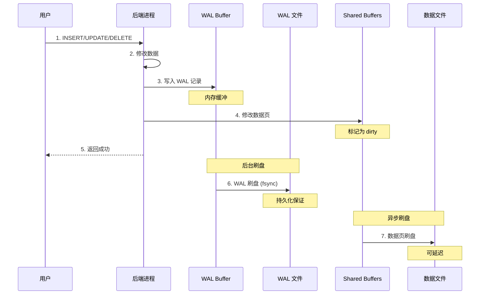
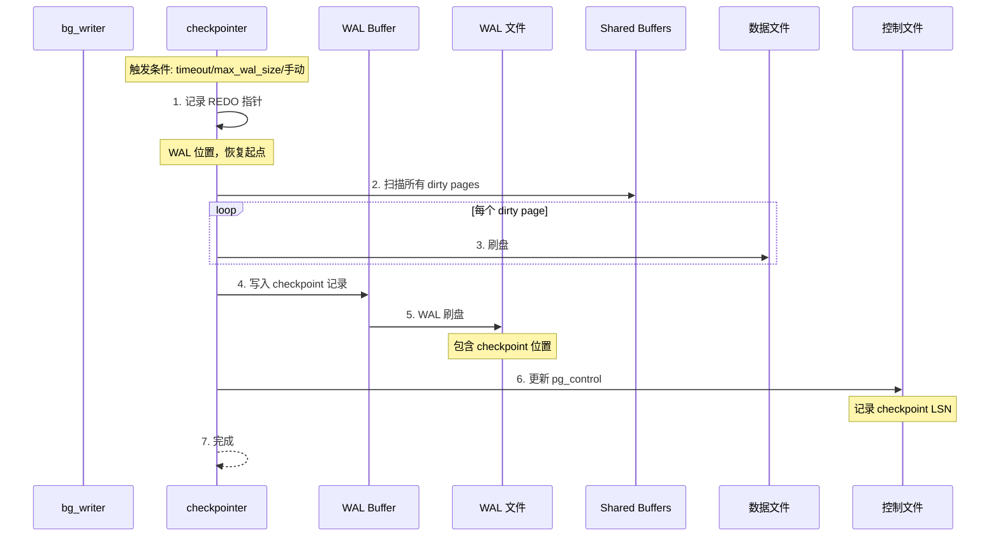
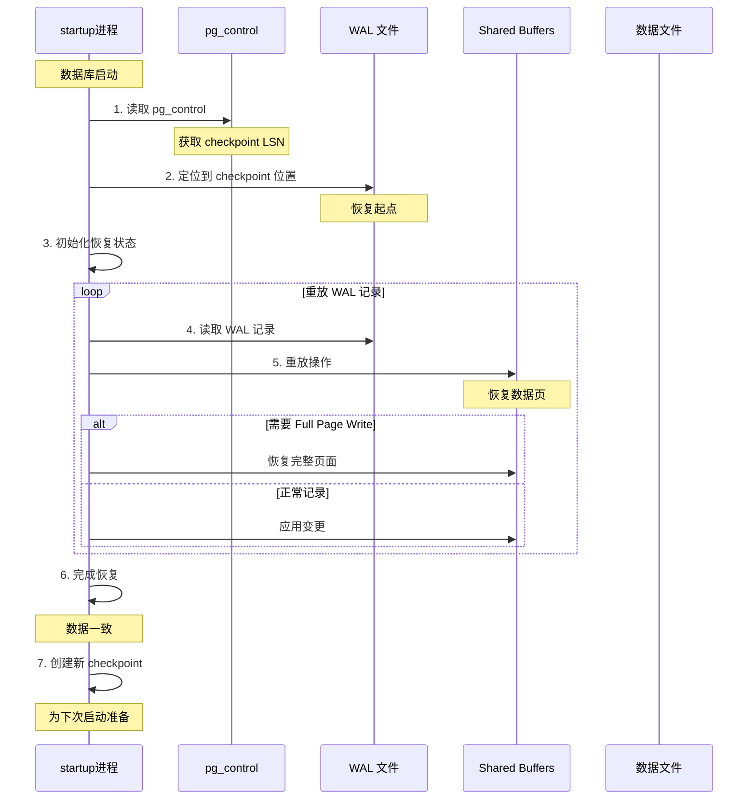
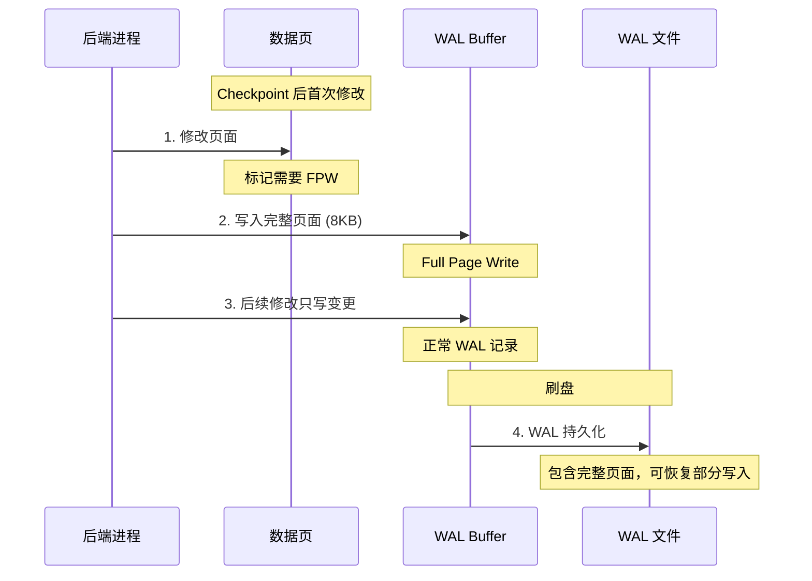

# PostgreSQL 崩溃一致性机制

## 1. 概述

PostgreSQL 通过 **WAL (Write-Ahead Log)** 和 **Checkpoint** 机制保证崩溃一致性。

**核心原则**：数据页写入磁盘前，必须先将对应的 WAL 记录刷到磁盘。

## 2. WAL 先写原则 (Write-Ahead Logging)

### 2.1 基本原理

```
WAL 先写原则:

1. 修改数据前，先记录 WAL
2. WAL 必须先于数据页刷盘
3. 崩溃后通过重放 WAL 恢复数据

保证: 只要 WAL 持久化，数据就不会丢失
```

### 2.2 写入流程时序图



## 3. Checkpoint 机制

### 3.1 Checkpoint 作用

```
Checkpoint 的作用:

1. 确定恢复起点
   - 记录此时所有 dirty pages 的状态
   - 之前的 WAL 可以回收

2. 减少 WAL 数量
   - Checkpoint 之前的 WAL 可以删除
   - 减少崩溃恢复时间

3. 定期刷盘
   - 将所有 dirty pages 刷到磁盘
   - 确保数据持久化
```

### 3.2 Checkpoint 时序图



### 3.3 Checkpoint 类型

| 类型 | 触发条件 | 说明 |
|------|----------|------|
| **SHUTDOWN** | 数据库关闭 | 关闭前强制 checkpoint |
| **IMMEDIATE** | 手动执行 | 立即完成 |
| **SPREAD** | 后台定期 | 分散刷盘，减少 IO 峰值 |

## 4. 崩溃恢复流程

### 4.1 恢复时序图



### 4.2 恢复详细步骤

```
Step 1: 读取 pg_control
├── 获取 checkpoint 位置
├── 获取数据库状态
└── 获取 WAL 文件位置

Step 2: 定位 WAL 起点
├── 从 checkpoint LSN 开始
└── 读取 WAL 记录

Step 3: 重放 WAL
├── 循环读取 WAL 记录
├── 对每条记录:
│   ├── 判断记录类型
│   ├── 获取目标页面
│   ├── 检查 LSN 是否需要重放
│   └── 应用变更到 Shared Buffers
└── 直到 WAL 结束

Step 4: 完成恢复
├── 创建新的 checkpoint
└── 数据库进入正常状态
```

## 5. Full Page Writes

### 5.1 问题背景

```
问题: 部分页面写入 (Torn Page)

场景: 写入 8KB 页面时崩溃
├── 可能只写了前 4KB
├── 页面损坏，无法恢复
└── checksum 检测到损坏，但无法修复

示例:
写入前: [AAAA BBBB CCCC DDDD]
崩溃后: [AAAA BBBB ???? ????]  ← 部分写入
```

### 5.2 解决方案

```
Full Page Writes:

1. 每个检查点后，首次修改页面时
2. 将整个页面写入 WAL (不只是变更)
3. 恢复时可以直接恢复完整页面

保证: 即使部分写入，也能通过 WAL 恢复完整页面
```

### 5.3 Full Page Write 时序图



## 6. 关键配置参数

```sql
-- WAL 配置
wal_level = replica              -- WAL 级别
wal_buffers = 16MB               -- WAL 缓冲区大小
wal_writer_delay = 200ms         -- WAL 刷盘间隔

-- Checkpoint 配置
checkpoint_timeout = 5min        -- checkpoint 间隔
max_wal_size = 1GB               -- WAL 最大大小
min_wal_size = 80MB              -- WAL 最小大小
checkpoint_completion_target = 0.9  -- 完成时间比例

-- Full Page Writes
full_page_writes = on            -- 开启 FPW

-- 同步提交
synchronous_commit = on          -- 等待 WAL 刷盘
fsync = on                       -- 强制 fsync
```

## 7. 各种崩溃场景分析

| 场景 | 阶段 | 保护机制 | 结果 |
|------|------|----------|------|
| **写入 WAL Buffer 后崩溃** | WAL 刷盘前 | 无 | 未持久化，数据丢失 |
| **WAL 刷盘后崩溃** | 数据页刷盘前 | WAL 持久化 | 重放 WAL 恢复 |
| **数据页刷盘中崩溃** | 部分写入 | Full Page Write | 通过 FPW 恢复 |
| **Checkpoint 中崩溃** | 刷盘中 | 旧 checkpoint 仍有效 | 从上个 checkpoint 恢复 |
| **恢复中崩溃** | 重放中 | WAL 仍完整 | 重新开始恢复 |

## 8. 总结

| 问题 | 答案 |
|------|------|
| 崩溃一致性如何保证？ | **WAL 先写 + Checkpoint** |
| WAL 何时刷盘？ | 提交时 (synchronous_commit=on) |
| 数据页何时刷盘？ | 异步，可延迟 |
| Checkpoint 作用？ | 确定恢复起点，减少 WAL |
| 如何处理部分写入？ | **Full Page Write** |
| 恢复流程？ | 从 checkpoint 重放 WAL |

---
