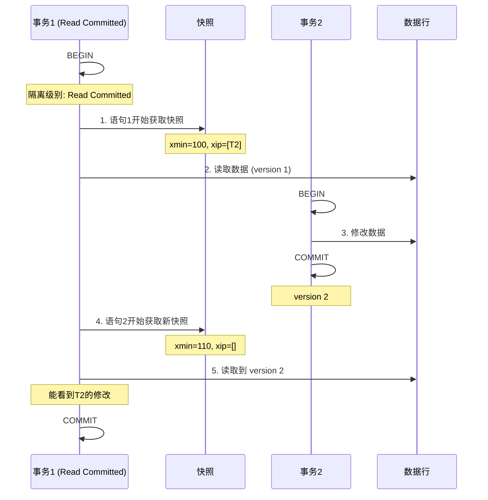
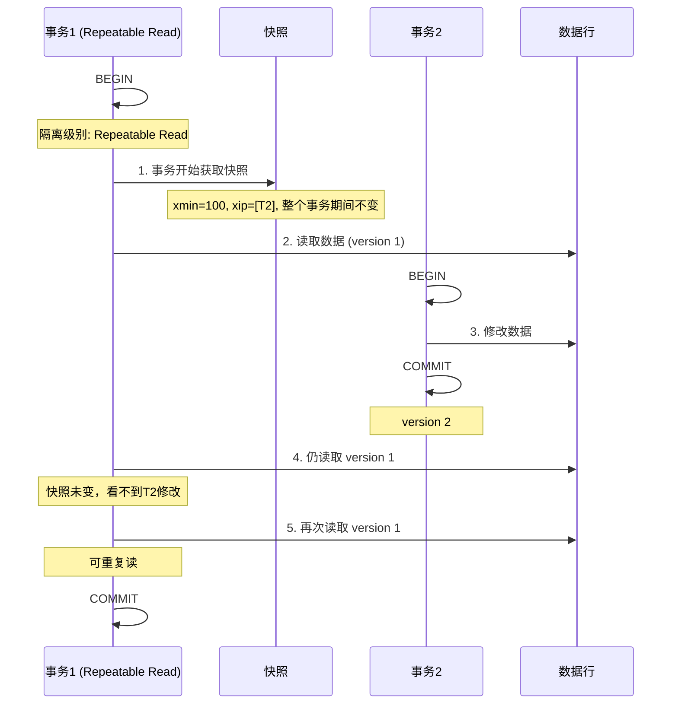
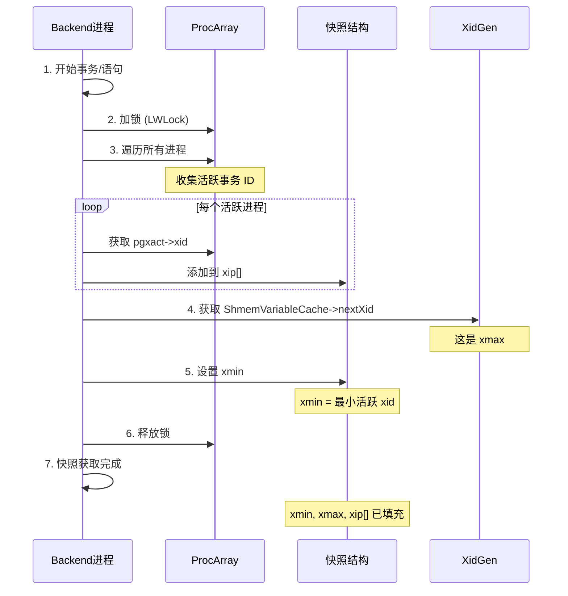
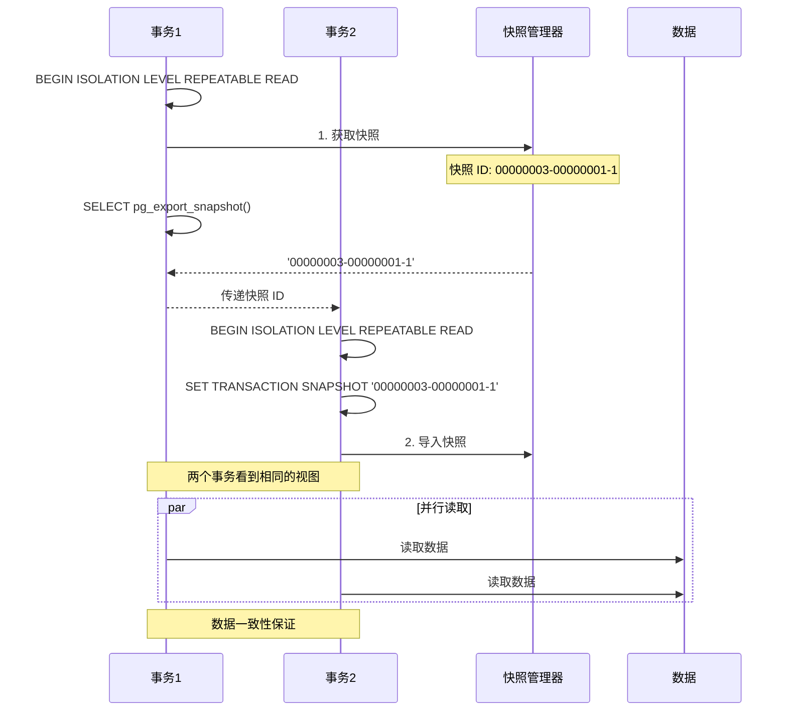

# PostgreSQL 快照机制

## 1. 概述

快照（Snapshot）是 PostgreSQL **MVCC（多版本并发控制）** 的核心机制，用于实现事务隔离和一致性读取。

**核心作用**：
- 记录某个时刻哪些事务对当前事务可见
- 实现"读不阻塞写，写不阻塞读"
- 支持不同隔离级别

## 2. 快照结构

### 2.1 数据结构

```c
// src/include/utils/snapshot.h

typedef struct SnapshotData {
    TransactionId xmin;           // 最小活跃事务 ID
    TransactionId xmax;           // 最大活跃事务 ID + 1
    TransactionId *xip;           // 活跃事务 ID 数组
    uint32 xcnt;                  // 活跃事务数量
    TransactionId *subxip;        // 子事务 ID 数组
    int32 subcnt;                 // 子事务数量
    bool takenDuringRecovery;     // 是否在恢复期间获取
    bool copied;                  // 是否复制
} SnapshotData;
```

### 2.2 字段含义

```
快照字段说明:

xmin:
├── 当前活跃事务中最小的事务 ID
└── 所有 < xmin 的事务都已提交

xmax:
├── 当前已分配的最大事务 ID + 1
└── 所有 >= xmax 的事务都还未开始

xip[] (活跃事务列表):
├── 当前正在执行的事务 ID 数组
├── 这些事务的修改对当前快照不可见
└── 大小 = xcnt

subxip[] (子事务列表):
├── 子事务 ID 数组
└── 用于处理嵌套事务
```

### 2.3 快照示意图

```
事务 ID 时间线:
┌─────────────────────────────────────────────────────────────────────────┐
│                                                                          │
│  xmin=100                    xmax=200                                    │
│     │                           │                                        │
│     ▼                           ▼                                        │
│  ───┬────────────────────────────┬───▶                                   │
│     │    │     │     │     │     │                                       │
│     │   120    135   150   180   │                                       │
│     │    │     │     │     │     │                                       │
│     │    └──┬──┴──┬──┴──┬──┘     │                                       │
│     │       │     │     │        │                                       │
│     │     xip[]  xip[] xip[]     │                                       │
│     │       │     │     │        │                                       │
│     │    活跃事务列表 (3个)       │                                       │
│                                                                          │
│  已提交事务 (< 100): 对快照可见                                          │
│  活跃事务 (120, 135, 150, 180): 对快照不可见                             │
│  未来事务 (>= 200): 对快照不可见                                         │
│                                                                          │
└─────────────────────────────────────────────────────────────────────────┘
```

## 3. 隔离级别与快照

### 3.1 三种隔离级别

| 隔离级别 | 快照获取时机 | 特点 |
|----------|--------------|------|
| **Read Committed** | 每条语句开始 | 可能看到其他事务提交的修改 |
| **Repeatable Read** | 事务开始 | 整个事务期间看到一致的数据 |
| **Serializable** | 事务开始 | 串行化执行，检测写冲突 |

### 3.2 Read Committed 时序图



### 3.3 Repeatable Read 时序图



## 4. 快照获取流程

### 4.1 获取快照时序图



### 4.2 快照获取代码流程

```c
// src/backend/storage/ipc/procarray.c

Snapshot GetSnapshotData(Snapshot snapshot) {
    // 1. 获取 ProcArray 锁
    LWLockAcquire(ProcArrayLock, LW_SHARED);

    // 2. 计算 xmax (下一个要分配的事务 ID)
    snapshot->xmax = ShmemVariableCache->latestCompletedXid + 1;

    // 3. 遍历所有进程，收集活跃事务
    snapshot->xcnt = 0;
    for (int i = 0; i < ProcGlobal->allProcCount; i++) {
        TransactionId xid = ProcGlobal->allPgXact[i].xid;
        if (TransactionIdIsNormal(xid)) {
            snapshot->xip[snapshot->xcnt++] = xid;
        }
    }

    // 4. 计算 xmin (最小活跃事务 ID)
    snapshot->xmin = snapshot->xip[0];

    // 5. 释放锁
    LWLockRelease(ProcArrayLock);

    return snapshot;
}
```

## 5. 可见性判断

### 5.1 行可见性判断流程

```mermaid
flowchart TD
    Start[开始判断行可见性] --> CheckXmin{t_xmin < snapshot.xmin?}
    
    CheckXmin -->|是| Visible1[已提交，可见]
    CheckXmin -->|否| CheckXmax{t_xmin >= snapshot.xmax?}
    
    CheckXmax -->|是| Invisible1[未来事务，不可见]
    CheckXmax -->|否| CheckXip{t_xmin in xip[]?}
    
    CheckXip -->|是| Invisible2[活跃事务，不可见]
    CheckXip -->|否| CheckCommitted{t_xmin 已提交?}
    
    CheckCommitted -->|否| Invisible3[未提交，不可见]
    CheckCommitted -->|是| CheckXmaxNull{t_xmax 为空?}
    
    CheckXmaxNull -->|是| Visible2[未删除，可见]
    CheckXmaxNull -->|否| CheckXmaxXip{t_xmax in xip[]?}
    
    CheckXmaxXip -->|是| Visible3[删除未提交，可见]
    CheckXmaxXip -->|否| CheckXmaxCommitted{t_xmax 已提交?}
    
    CheckXmaxCommitted -->|否| Visible4[删除未提交，可见]
    CheckXmaxCommitted -->|是| Invisible4[已删除，不可见]
    
    Visible1 --> End[返回结果]
    Invisible1 --> End
    Invisible2 --> End
    Invisible3 --> End
    Visible2 --> End
    Visible3 --> End
    Visible4 --> End
    Invisible4 --> End
```

### 5.2 可见性判断规则表

| 条件 | 结果 | 说明 |
|------|------|------|
| t_xmin < snapshot.xmin | **可见** | 插入事务在快照前已提交 |
| t_xmin >= snapshot.xmax | **不可见** | 插入事务在快照后才开始 |
| t_xmin in xip[] | **不可见** | 插入事务当时还是活跃的 |
| t_xmin 已提交且 t_xmax 为空 | **可见** | 行未被删除 |
| t_xmax in xip[] | **可见** | 删除事务还未提交 |
| t_xmax 已提交且 t_xmax < snapshot.xmin | **不可见** | 行在快照前已被删除 |

## 6. 快照导出与导入

### 6.1 使用场景

```
场景: 多个事务需要看到相同的数据库视图

应用:
├── 并行数据导出
├── 一致性备份
└── 数据同步

方法:
1. 事务1导出快照
2. 事务2导入该快照
3. 两个事务看到相同的数据
```

### 6.2 导出导入时序图



### 6.3 SQL 示例

```sql
-- 事务1: 导出快照
BEGIN TRANSACTION ISOLATION LEVEL REPEATABLE READ;
SELECT pg_export_snapshot();
-- 返回: '00000003-00000001-1'

-- 事务2: 导入快照
BEGIN TRANSACTION ISOLATION LEVEL REPEATABLE READ;
SET TRANSACTION SNAPSHOT '00000003-00000001-1';

-- 现在两个事务看到相同的数据视图
SELECT * FROM users;

COMMIT;
```

## 7. 系统视图

### 7.1 查看当前快照

```sql
-- 查看当前快照
SELECT pg_current_snapshot();

-- 返回示例: 100:200:120,135,150
-- 格式: xmin:xmax:xip1,xip2,...

-- 查看事务 ID
SELECT pg_current_xact_id();

-- 查看快照包含的事务
SELECT * FROM pg_snapshot_xip(pg_current_snapshot());
```

### 7.2 快照相关函数

| 函数 | 说明 |
|------|------|
| `pg_current_snapshot()` | 获取当前快照 |
| `pg_current_xact_id()` | 获取当前事务 ID |
| `pg_snapshot_xip(snapshot)` | 获取快照中的活跃事务列表 |
| `pg_export_snapshot()` | 导出当前快照 |
| `pg_is_visible_xid(xid, snapshot)` | 判断事务是否对快照可见 |

## 8. 性能优化

### 8.1 快照缓存

```
快照缓存机制:

1. 事务开始时获取快照
2. 缓存在进程本地
3. 后续查询复用快照 (Repeatable Read)

优点:
├── 避免重复扫描 ProcArray
├── 减少锁竞争
└── 提高性能
```

### 8.2 活跃事务数量影响

```
快照获取开销:

活跃事务越多:
├── xip[] 数组越大
├── 可见性判断越慢
└── 内存占用越多

优化建议:
├── 及时提交长事务
├── 控制并发连接数
└── 使用连接池
```

## 9. 总结

| 问题 | 答案 |
|------|------|
| 什么是快照？ | 记录某个时刻活跃事务列表的数据结构 |
| 作用？ | 实现 MVCC，支持一致性读取 |
| 核心字段？ | xmin, xmax, xip[] |
| 隔离级别？ | Read Committed, Repeatable Read, Serializable |
| 何时获取？ | 语句开始或事务开始 |
| 能导出吗？ | 能，通过 pg_export_snapshot() |
| 可见性判断？ | 基于事务 ID 和快照信息 |

---
