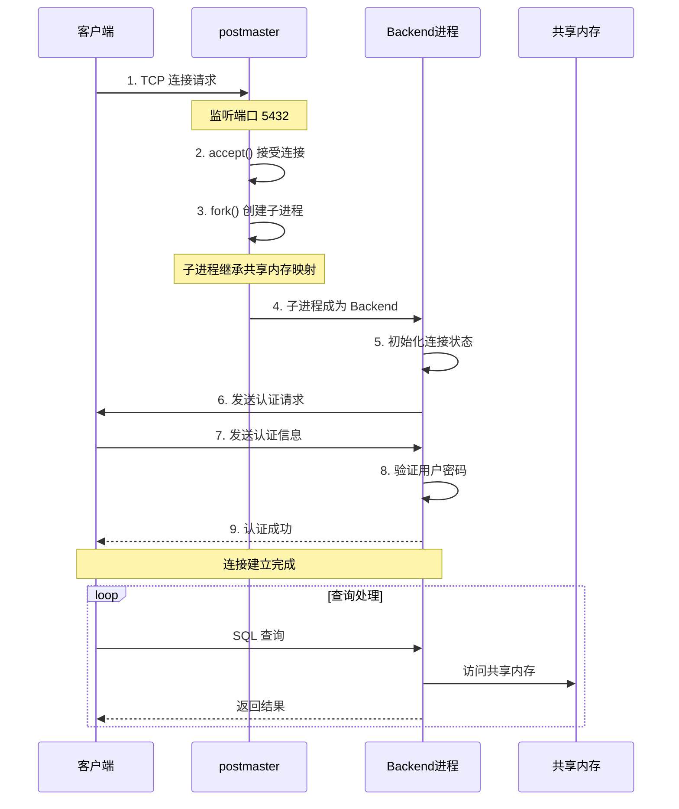
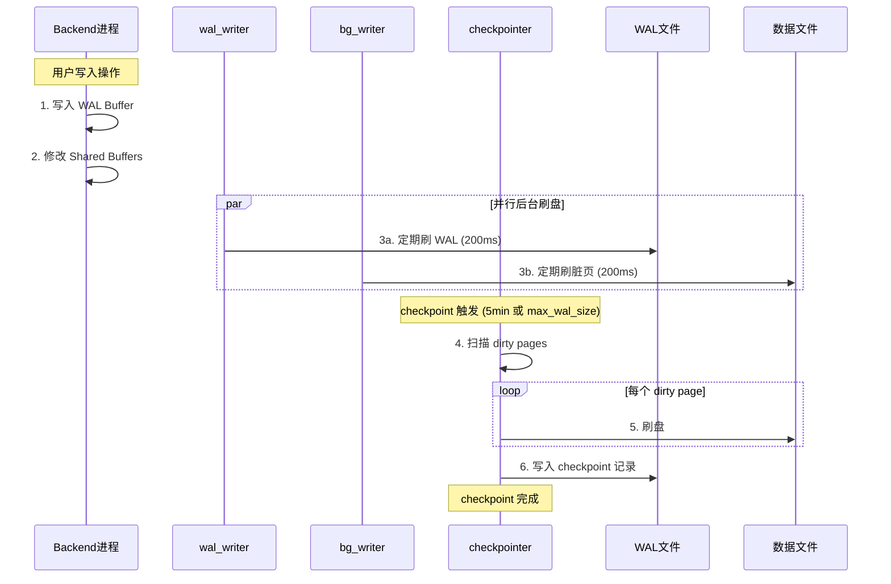
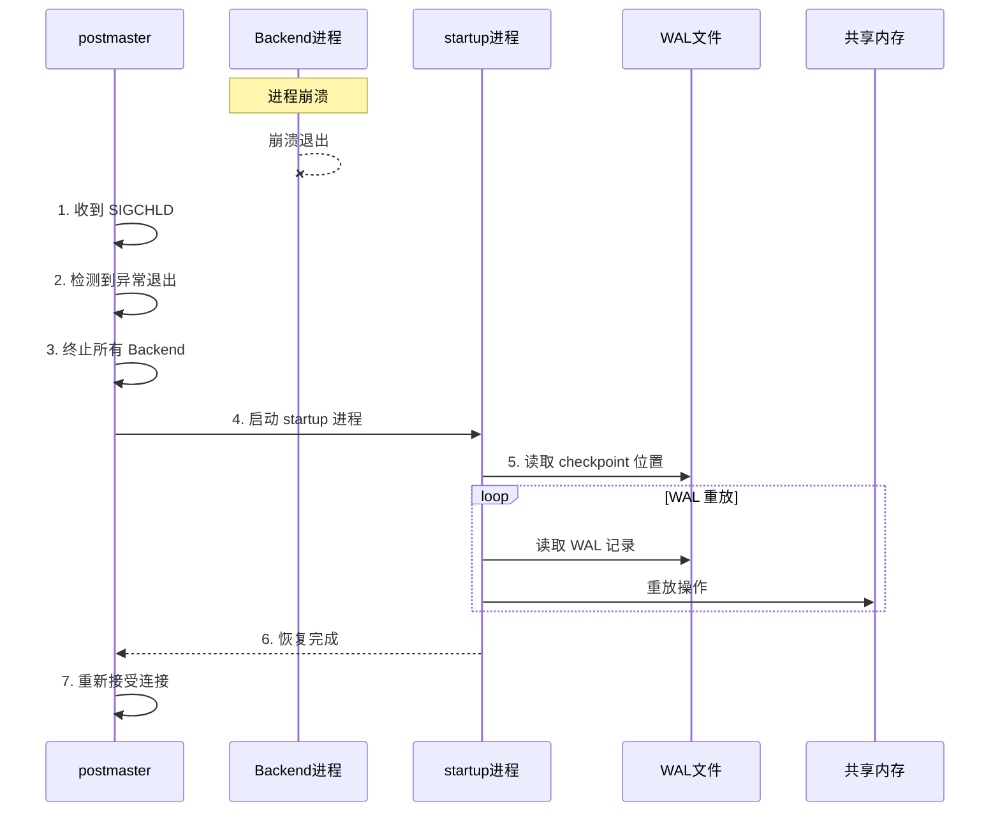

# PostgreSQL 进程模型分析

## 1. 概述

PostgreSQL 使用**多进程架构**（而非多线程），每个客户端连接对应一个独立的后端进程。

**核心特点**：
- 进程隔离，稳定性高
- 共享内存通信
- 主进程监控和管理

## 2. 进程架构图

```
┌─────────────────────────────────────────────────────────────────────────┐
│                        PostgreSQL 进程架构                                │
├─────────────────────────────────────────────────────────────────────────┤
│                                                                          │
│  ┌─────────────────────────────────────────────────────────────────┐   │
│  │ postmaster (主进程)                                               │   │
│  │ - 监听客户端连接                                                  │   │
│  │ - 启动和管理子进程                                                │   │
│  │ - 进程崩溃后重启                                                  │   │
│  └─────────────────────────────────────────────────────────────────┘   │
│                              │                                           │
│                              ├── fork() ──┐                             │
│                              │            │                             │
│                              ▼            ▼                             │
│  ┌──────────────┐  ┌──────────────┐  ┌──────────────┐                   │
│  │ Backend 1    │  │ Backend 2    │  │ Backend N    │                   │
│  │ (客户端连接) │  │ (客户端连接) │  │ (客户端连接) │                   │
│  └──────────────┘  └──────────────┘  └──────────────┘                   │
│                                                                          │
│  ┌─────────────────────────────────────────────────────────────────┐   │
│  │ 后台进程                                                          │   │
│  │ ├── wal_writer     : WAL 写进程                                  │   │
│  │ ├── bg_writer      : 后台写进程                                  │   │
│  │ ├── checkpointer   : 检查点进程                                  │   │
│  │ ├── autovacuum     : 自动清理进程                                │   │
│  │ ├── stats_collector: 统计收集进程                                │   │
│  │ ├── archiver       : 归档进程                                    │   │
│  │ └── logger         : 日志进程                                    │   │
│  └─────────────────────────────────────────────────────────────────┘   │
│                                                                          │
│  ┌─────────────────────────────────────────────────────────────────┐   │
│  │ 共享内存 (Shared Memory)                                          │   │
│  │ ├── Shared Buffers  : 数据页缓存                                  │   │
│  │ ├── WAL Buffer      : WAL 缓存                                   │   │
│  │ ├── Lock Tables     : 锁表                                       │   │
│  │ └── Process Table   : 进程表                                     │   │
│  └─────────────────────────────────────────────────────────────────┘   │
│                                                                          │
└─────────────────────────────────────────────────────────────────────────┘
```

## 3. 主要进程详解

### 3.1 postmaster (主进程)

| 职责 | 说明 |
|------|------|
| **监听连接** | 监听客户端连接请求 |
| **创建后端** | fork() 创建后端进程处理连接 |
| **进程监控** | 监控子进程状态，崩溃后重启 |
| **信号处理** | 处理系统信号 (SIGHUP, SIGTERM 等) |

### 3.2 Backend Process (后端进程)

| 职责 | 说明 |
|------|------|
| **处理查询** | 解析、优化、执行 SQL |
| **事务管理** | 开始、提交、回滚事务 |
| **权限检查** | 验证用户权限 |
| **结果返回** | 返回查询结果给客户端 |

**特点**：每个客户端连接对应一个后端进程

### 3.3 wal_writer (WAL 写进程)

| 职责 | 说明 |
|------|------|
| **刷 WAL** | 定期将 WAL Buffer 刷到磁盘 |
| **保证持久性** | 确保事务提交后 WAL 持久化 |
| **间隔** | 默认 200ms |

### 3.4 bg_writer (后台写进程)

| 职责 | 说明 |
|------|------|
| **刷脏页** | 定期将 dirty pages 刷到磁盘 |
| **减轻 checkpoint 压力** | 分散 IO 负载 |
| **间隔** | 默认 200ms |

### 3.5 checkpointer (检查点进程)

| 职责 | 说明 |
|------|------|
| **创建 checkpoint** | 定期或在特定条件下创建检查点 |
| **刷所有脏页** | 将所有 dirty pages 刷到磁盘 |
| **记录 checkpoint** | 写入 checkpoint 记录到 WAL |
| **触发条件** | timeout (5min) / max_wal_size / 手动 |

### 3.6 autovacuum (自动清理进程)

| 职责 | 说明 |
|------|------|
| **清理死元组** | 删除标记为删除的行 |
| **更新统计** | 更新表统计信息 |
| **回收空间** | 释放未使用的页面 |

### 3.7 stats_collector (统计收集进程)

| 职责 | 说明 |
|------|------|
| **收集统计** | 收集表、索引使用统计 |
| **性能分析** | 为查询优化器提供统计信息 |

## 4. 客户端连接处理流程

### 4.1 连接建立时序图



### 4.2 连接池对比

```
PostgreSQL 多进程模型:
├── 每个连接一个进程
├── 进程隔离，稳定性高
├── 进程切换开销大
└── 需要连接池 (pgbouncer, pgpool)

MySQL 多线程模型:
├── 每个连接一个线程
├── 线程共享地址空间
├── 切换开销小
└── 一个线程崩溃可能影响整个进程
```

## 5. 进程间通信

### 5.1 共享内存通信

```
┌─────────────────────────────────────────────────────────────────────────┐
│                        共享内存通信                                       │
├─────────────────────────────────────────────────────────────────────────┤
│                                                                          │
│  Backend 1 ────┐                                                        │
│                 │                                                        │
│  Backend 2 ────┼──▶ Shared Buffers (共享数据页缓存)                      │
│                 │                                                        │
│  Backend N ────┘                                                        │
│                                                                          │
│  通信方式:                                                               │
│  1. 直接读写共享内存                                                     │
│  2. 通过锁机制同步 (LWLock, SpinLock)                                    │
│  3. 通过信号量通知                                                       │
│                                                                          │
└─────────────────────────────────────────────────────────────────────────┘
```

### 5.2 进程同步机制

| 机制 | 说明 |
|------|------|
| **LWLock** | 轻量级锁，保护共享内存数据结构 |
| **SpinLock** | 自旋锁，短时间持有 |
| **Semaphore** | 信号量，进程间同步 |
| **Condition Variable** | 条件变量，等待事件 |

## 6. 后台进程协作时序图



## 7. 进程崩溃恢复

### 7.1 后端进程崩溃

```
Backend 进程崩溃处理:

1. postmaster 检测到子进程退出 (SIGCHLD)
2. postmaster 终止所有其他后端进程
3. postmaster 启动 recovery 进程
4. recovery 重放 WAL 恢复数据
5. postmaster 重新接受连接
```

### 7.2 崩溃恢复时序图



## 8. 关键配置参数

```sql
-- 连接相关
max_connections = 100                -- 最大连接数
superuser_reserved_connections = 3   -- 超级用户保留连接

-- 共享内存
shared_buffers = 128MB               -- 共享缓冲区大小

-- 后台进程
wal_writer_delay = 200ms             -- WAL 写进程间隔
bgwriter_delay = 200ms               -- 后台写进程间隔
checkpoint_timeout = 5min            -- checkpoint 间隔

-- autovacuum
autovacuum = on                      -- 开启自动清理
autovacuum_max_workers = 3           -- 最大 worker 数
```

## 9. 进程状态查看

```sql
-- 查看当前进程
SELECT pid, usename, application_name, state, query
FROM pg_stat_activity;

-- 查看后台进程
SELECT * FROM pg_stat_bgwriter;

-- 查看进程锁
SELECT * FROM pg_locks;
```

## 10. 进程模型优缺点

| 优点 | 缺点 |
|------|------|
| **进程隔离**：一个进程崩溃不影响其他进程 | **内存开销**：每个进程独立地址空间 |
| **稳定性高**：进程间无共享状态干扰 | **进程切换**：上下文切换开销大 |
| **调试方便**：可以使用标准调试工具 | **连接数限制**：max_connections 受系统限制 |
| **多核利用**：天然支持多核并行 | **需要连接池**：高并发场景需要外部连接池 |

## 11. 总结

| 问题 | 答案 |
|------|------|
| PostgreSQL 使用什么模型？ | **多进程模型** |
| 每个连接对应什么？ | **一个后端进程** |
| 主进程职责？ | 监听连接、管理子进程 |
| 后端进程职责？ | 处理 SQL 查询 |
| 进程间如何通信？ | **共享内存** |
| 后台进程有哪些？ | wal_writer, bg_writer, checkpointer, autovacuum 等 |
| 崩溃后如何恢复？ | postmaster 重启所有进程，startup 重放 WAL |

---
