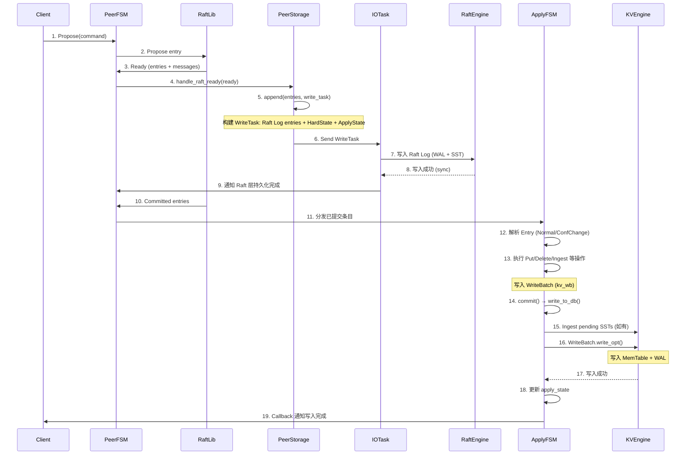
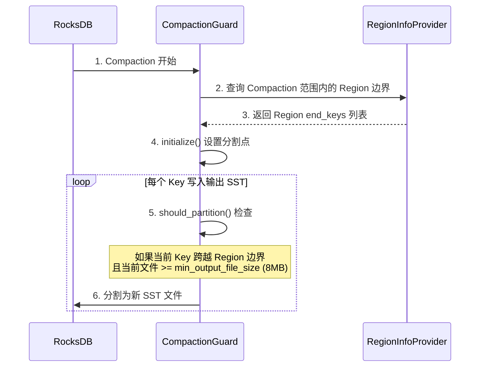
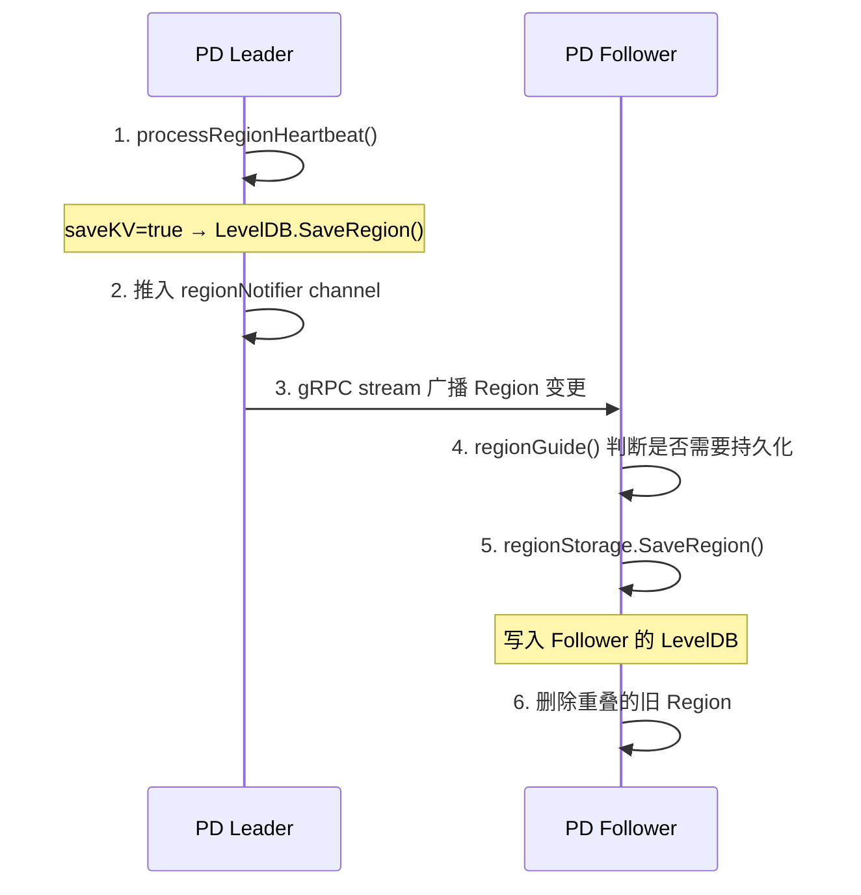
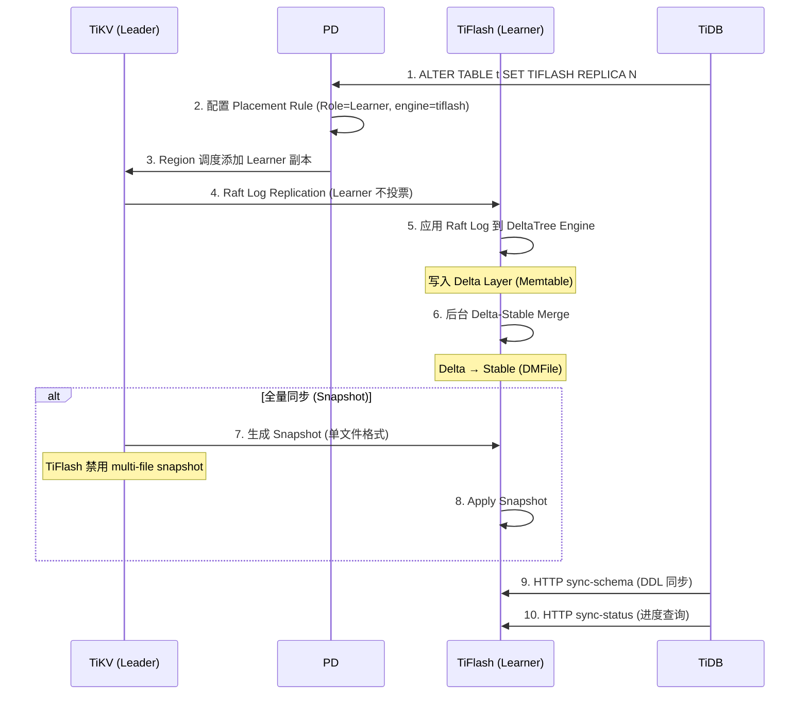
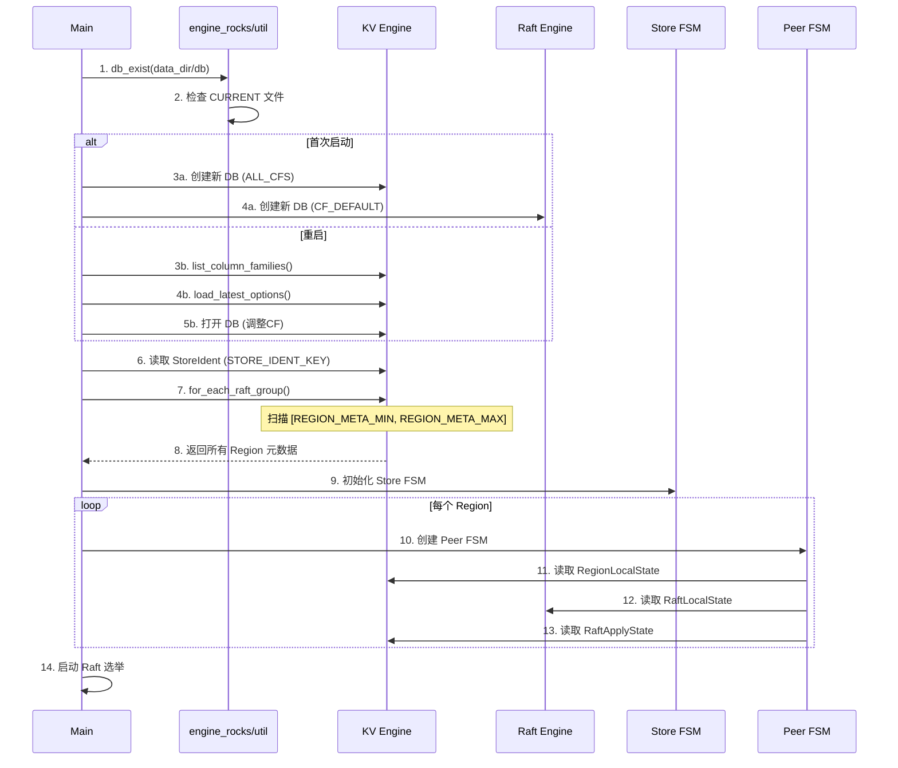
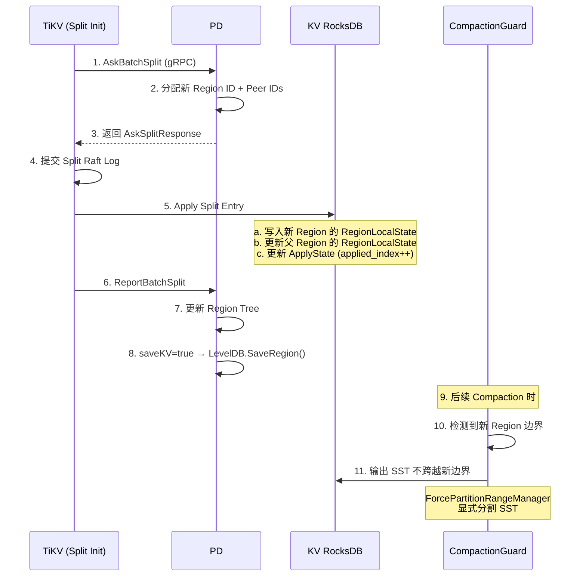
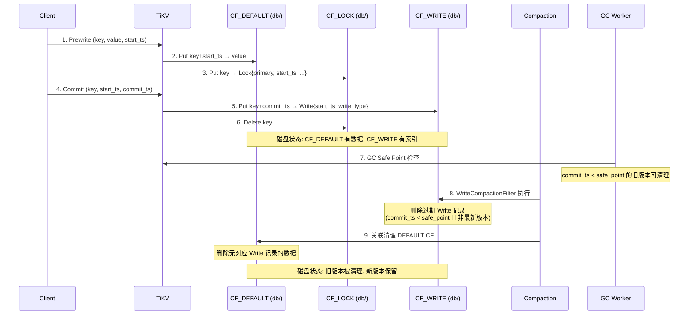

# TiDB 存储层架构与磁盘文件布局分析

> 基于 TiDB/TiKV/PD 源码深度分析

---

## 目录

1. [整体存储架构](#1-整体存储架构)
2. [TiKV 存储引擎架构](#2-tikv-存储引擎架构)
3. [RocksDB Column Family 体系](#3-rocksdb-column-family-体系)
4. [键空间编码与磁盘映射](#4-键空间编码与磁盘映射)
5. [磁盘文件布局](#5-磁盘文件布局)
6. [SST 文件内部结构](#6-sst-文件内部结构)
7. [写入管线：从 Raft 到 RocksDB](#7-写入管线从-raft-到-rocksdb)
8. [Compaction 策略与 Region 感知](#8-compaction-策略与-region-感知)
9. [Raft 日志存储](#9-raft-日志存储)
10. [Region 元数据持久化](#10-region-元数据持久化)
11. [PD 存储架构与文件布局](#11-pd-存储架构与文件布局)
12. [TiFlash 列存存储层](#12-tiflash-列存存储层)
13. [关键时序流程](#13-关键时序流程)

---

## 1. 整体存储架构

TiDB 集群采用**计算-存储分离**架构，数据持久化分布在三个存储引擎中：

```
┌─────────────────────────────────────────────────────────┐
│                     TiDB (SQL Layer)                     │
│              Parser → Optimizer → Executor               │
└────────────┬──────────────┬──────────────┬──────────────┘
             │              │              │
     gRPC/KV Protocol  Schema Sync    TSO Request
             │              │              │
┌────────────▼──────┐ ┌────▼────────┐ ┌───▼──────────────┐
│   TiKV Node 1     │ │ TiKV Node N │ │   PD (Placement  │
│ ┌───────────────┐ │ │             │ │     Driver)       │
│ │  KV Engine    │ │ │             │ │ ┌──────────────┐ │
│ │ (RocksDB 4CF) │ │ │             │ │ │ Etcd Backend │ │
│ ├───────────────┤ │ │             │ │ ├──────────────┤ │
│ │ Raft Engine   │ │ │             │ │ │ LevelDB      │ │
│ │ (RocksDB 1CF) │ │ │             │ │ │ (Region Meta)│ │
│ ├───────────────┤ │ │             │ │ └──────────────┘ │
│ │ Raft Log Eng  │ │ │             │ │                  │
│ │ (v2专用)      │ │ │             │ │                  │
│ └───────────────┘ │ │             │ │                  │
└───────────────────┘ └─────────────┘ └──────────────────┘
        │
        │ Raft Learner Replication
        ▼
┌─────────────────────────┐
│    TiFlash Node          │
│ ┌──────────────────────┐│
│ │  DeltaTree Engine    ││
│ │ ┌──────┐ ┌─────────┐││
│ │ │Delta │ │Stable   │││
│ │ │Layer │ │Layer    │││
│ │ │(Mem+ │ │(DMFiles)│││
│ │ │Pers.)│ │         │││
│ │ └──────┘ └─────────┘││
│ └──────────────────────┘│
└─────────────────────────┘
```

**核心抽象**：`Engines<K, R>` 结构体（源码 `engine_traits/src/engines.rs:9-13`）持有两个引擎实例：

```rust
pub struct Engines<K, R> {
    pub kv: K,    // KV 引擎：存储用户数据（4个CF）
    pub raft: R,  // Raft 引擎：存储 Raft 日志（1个CF）
}
```

---

## 2. TiKV 存储引擎架构

TiKV 的存储层基于 **RocksDB** 构建，采用双引擎架构：

| 引擎 | 路径 | Column Family | 用途 |
|------|------|---------------|------|
| **KV Engine** | `{data_dir}/db/` | CF_DEFAULT, CF_LOCK, CF_WRITE, CF_RAFT | 用户数据 + Region元数据 + Raft状态 |
| **Raft Engine** | `{data_dir}/raft/` | CF_DEFAULT | Raft 日志条目 |
| **Raft Log Engine** (v2) | `{data_dir}/raft-engine/` | 自定义格式 | v2 专用 Raft 日志引擎 |

> **关键设计决策**（源码 `apply.rs:1107-1113`）：`RaftApplyState` 写入 **KV Engine** 而非 Raft Engine。原因是：如果 apply_state 与 KV 数据在不同的 WAL 中，断电可能导致 apply_state 已刷盘但 KV 数据未刷盘，从而造成数据丢失。

引擎初始化流程（源码 `engine_rocks/src/util.rs:39-95`）：

1. 调用 `DB::list_column_families()` 获取已有 CF 列表
2. 调用 `load_latest_options()` 加载 OPTIONS 文件
3. 调用 `adjust_dynamic_level_bytes()` 保留已有的动态层级字节设置
4. 对比已有 CF 与期望 CF 列表，丢弃多余 CF、创建缺失 CF
5. 存在性检测：通过 `CURRENT` 文件判断 DB 是否已存在（`util.rs:142-157`）

---

## 3. RocksDB Column Family 体系

### 3.1 CF 定义

源码：`engine_traits/src/cf_defs.rs:3-11`

```rust
pub const CF_DEFAULT: CfName = "default";  // MVCC 数据（key+start_ts → value）
pub const CF_LOCK: CfName = "lock";        // 事务锁（key → Lock struct）
pub const CF_WRITE: CfName = "write";      // MVCC 写记录（key+commit_ts → Write struct）
pub const CF_RAFT: CfName = "raft";        // Raft 日志与元数据

pub const DATA_CFS: &[CfName] = &[CF_DEFAULT, CF_LOCK, CF_WRITE];  // 用户数据CF
pub const ALL_CFS: &[CfName] = &[CF_DEFAULT, CF_LOCK, CF_WRITE, CF_RAFT];
```

### 3.2 各 CF 配置对比

| 参数 | CF_DEFAULT | CF_WRITE | CF_LOCK | CF_RAFT |
|------|-----------|----------|---------|---------|
| **block_size** | 32KB | 32KB | 16KB | 16KB |
| **bloom_filter** | 是 (whole_key) | 是 (prefix) | 是 (whole_key) | 是 (whole_key) |
| **optimize_filters_for_hits** | true | **false** | false | true |
| **whole_key_filtering** | true | **false** | true | true |
| **compression** | No,No,Lz4,Lz4,Lz4,Zstd,Zstd | No,No,Lz4,Lz4,Lz4,Zstd,Zstd | **No (全层级)** | **No (全层级)** |
| **write_buffer_size** | 128MB | 128MB | 默认 | 128MB |
| **max_write_buffer_number** | 5 | 5 | 5 | 5 |
| **max_bytes_for_level_base** | 512MB | 512MB | 128MB | 128MB |
| **L0 compaction trigger** | 4 | 4 | **1** | **1** |
| **compaction_pri** | MinOverlappingRatio | MinOverlappingRatio | ByCompensatedSize | ByCompensatedSize |
| **bottommost_compression** | Zstd | Zstd | Disable | Disable |
| **prefix_extractor** | - | FixedSuffixSliceTransform(8B) | NoopSliceTransform | NoopSliceTransform |
| **Titan** | 可选 | 禁用 | 禁用 | 禁用 |
| **MVCC Properties** | RangeProperties | RangeProperties + MVCC | - | - |

> 源码位置：`config/mod.rs:792-857` (DefaultCf), `:963-1028` (WriteCf), `:1092-1149` (LockCf), `:1191-1248` (RaftCf)

### 3.3 CF_WRITE 的特殊设计

CF_WRITE 的 `whole_key_filtering = false` 和 `optimize_filters_for_hits = false` 是因为 Write CF 的键格式为 `key+commit_ts`，前缀相同（相同数据键）的记录很多。使用 **前缀 Bloom Filter**（`FixedSuffixSliceTransform`，截掉后 8 字节时间戳）可以在点查时跳过不相关的 SST 文件，同时避免全键 Bloom Filter 对相同前缀键的误判。

### 3.4 Lock/Raft CF 不压缩的原因

Lock 和 Raft CF 的数据量相对较小，且访问模式以随机读写为主。不压缩避免了压缩/解压的 CPU 开销，同时 `L0 compaction trigger = 1` 确保 L0 文件尽快合并，减少读放大。

---

## 4. 键空间编码与磁盘映射

### 4.1 键空间分区

源码：`keys/src/lib.rs:23-58`

TiKV 的整个键空间被划分为两大区域，通过首字节前缀分离：

```
0x00 ───────────────────────────────────────────── 0xFF
 │                                                    │
 ├── 0x01 Local Keys (内部元数据)                      │
 │   ├── 0x01 0x01: StoreIdent                       │
 │   ├── 0x01 0x02: Region Raft 数据                   │
 │   │   ├── 0x01 0x02 {region_id} 0x01 {log_idx}: Raft Log │
 │   │   ├── 0x01 0x02 {region_id} 0x02: Raft State  │
 │   │   ├── 0x01 0x02 {region_id} 0x03: Apply State │
 │   │   └── 0x01 0x02 {region_id} 0x04: Snapshot State │
 │   └── 0x01 0x03: Region Meta 数据                   │
 │       └── 0x01 0x03 {region_id} 0x01: Region State │
 │                                                    │
 └── 0x7A ('z') Data Keys (用户数据)                    │
     └── z + encoded_key: MVCC 键                      │
```

### 4.2 Local Key 编码

**Raft 相关键**（前缀 `0x01 0x02`）：

| 键类型 | 编码格式 | 长度 | 生成函数 |
|--------|----------|------|----------|
| Raft Log | `[0x01, 0x02, region_id(8B BE), 0x01, log_index(8B BE)]` | 19 bytes | `raft_log_key()` :91 |
| Raft State | `[0x01, 0x02, region_id(8B BE), 0x02]` | 11 bytes | `raft_state_key()` :95 |
| Apply State | `[0x01, 0x02, region_id(8B BE), 0x03]` | 11 bytes | `apply_state_key()` :103 |
| Snapshot State | `[0x01, 0x02, region_id(8B BE), 0x04]` | 11 bytes | `snapshot_raft_state_key()` :99 |

**Region Meta 键**（前缀 `0x01 0x03`）：

| 键类型 | 编码格式 | 长度 | 生成函数 |
|--------|----------|------|----------|
| Region State | `[0x01, 0x03, region_id(8B BE), 0x01]` | 11 bytes | `region_state_key()` :198 |

**特殊键**：

| 键 | 编码 | 用途 |
|----|------|------|
| StoreIdent | `[0x01, 0x01]` | 存储 ClusterID、StoreID |
| PrepareBootstrap | `[0x01, 0x02]` | Bootstrap 标记 |
| RecoverState | `[0x01, 0x03]` | 恢复状态 |

### 4.3 Data Key 编码

用户数据键添加 `0x7A`（`'z'`）前缀（源码 `keys/src/lib.rs:28-31`）：

```rust
pub const DATA_PREFIX: u8 = b'z';   // 0x7A
pub const DATA_MAX_KEY: &[u8] = &[DATA_PREFIX + 1];  // 0x7B
```

- `data_key(key)` → `[0x7A] + key`
- `enc_start_key(region)` → `data_key(region.start_key)`
- `enc_end_key(region)` → 若 end_key 为空则返回 `[0x7B]`，否则 `data_key(end_key)`

**排序保证**：所有 Local Keys (`0x01`) < 所有 Data Keys (`0x7A`)，因此扫描用户数据时不会被元数据干扰。

---

## 5. 磁盘文件布局

### 5.1 TiKV 节点完整目录结构

```
{data_dir}/                          # 默认: /var/lib/tikv/data
├── db/                              # KV Engine (RocksDB, 4个CF)
│   ├── 000398.sst                   # SST 数据文件 (L0-L6)
│   ├── 000399.sst
│   ├── ...
│   ├── CURRENT                      # 指向当前 MANIFEST
│   ├── LOCK                         # 文件锁 (防多实例)
│   ├── MANIFEST-001234              # 版本编辑日志
│   ├── MANIFEST-001234.old          # 旧版本 MANIFEST
│   ├── OPTIONS-001234                # 持久化的 DB/CF 配置
│   ├── OPTIONS-001234.old
│   ├── 000123.log                   # WAL (Write-Ahead Log)
│   ├── 000124.log
│   ├── LOG                          # RocksDB 运行日志
│   ├── LOG.old.*                    # 旧日志轮转
│   ├── STATS                        # 统计信息
│   ├── IDENTITY                     # 实例标识
│   ├── archive/                     # SST/MANIFEST 归档 (用于备份)
│   │   ├── *.sst
│   │   └── MANIFEST-*
│   └── titan/                       # Titan Blob 文件 (若启用)
│       └── blob_*                   # 大值分离存储
│
├── raft/                            # Raft Engine (RocksDB, 1个CF)
│   ├── 000001.sst                   # Raft 日志 SST
│   ├── CURRENT
│   ├── LOCK
│   ├── MANIFEST-*
│   ├── OPTIONS-*
│   ├── 000001.log                   # Raft WAL
│   └── LOG
│
├── raft-engine/                     # Raft Log Engine (v2 专用)
│   ├── raftlog-0001.rc              # Raft 日志记录文件
│   ├── raftlog-0001.idx             # 索引文件
│   └── ...
│
├── tablets/                         # Raftstore-v2 多 RocksDB 模式
│   ├── {region_id}_v{version}/      # 每个 Region 独立 RocksDB
│   │   ├── 000001.sst
│   │   ├── CURRENT
│   │   └── ...
│   └── ...
│
├── snap/                            # Region 快照
│   ├── {region_id}_{snapshot_idx}_default.sst
│   ├── {region_id}_{snapshot_idx}_write.sst
│   ├── {region_id}_{snapshot_idx}_lock.sst
│   └── meta                        # 快照元数据
│
├── import/                          # SST 导入目录 (Lightning/BR)
│   ├── *.sst
│   └── ...
│
└── last_tikv.toml                   # 持久化配置副本
```

### 5.2 RocksDB 文件类型详解

| 文件类型 | 文件名格式 | 用途 | 持久化 |
|----------|-----------|------|--------|
| **SST** | `{number}.sst` | Sorted String Table，不可变有序键值对 | 持久 |
| **WAL** | `{number}.log` | 写前日志，MemTable 的持久化保证 | 可配置 TTL |
| **MANIFEST** | `MANIFEST-{number}` | 版本编辑日志，记录 SST 新增/删除/层级移动 | 持久 + 归档 |
| **CURRENT** | `CURRENT` | 指向当前 MANIFEST 的指针文件 | 持久 |
| **OPTIONS** | `OPTIONS-{number}` | DB 和 CF 的配置快照 | 持久 + 归档 |
| **LOCK** | `LOCK` | flock 文件锁 | 临时 |
| **LOG** | `LOG` | RocksDB 信息日志 | 可配置轮转 |
| **IDENTITY** | `IDENTITY` | DB 实例唯一标识 | 持久 |
| **Blob** (Titan) | `blob_{number}` | 大值分离存储 | 持久 |

### 5.3 SST 文件命名与编号

SST 文件使用单调递增的全局编号（源码 `event_listener.rs:175-179`，正则 `/\w*\.sst`）。编号由 RocksDB 的 `VersionSet` 统一分配，跨所有 CF 共享编号空间。

### 5.4 WAL 配置

源码 `config/mod.rs:1593-1654`（`DbConfig::build_opt()`）：

```rust
opts.set_wal_recovery_mode(self.wal_recovery_mode);     // WAL 恢复模式
opts.set_wal_dir(&self.wal_dir);                        // WAL 独立目录
opts.set_wal_ttl_seconds(self.wal_ttl_seconds);          // WAL TTL
opts.set_wal_size_limit_mb(self.wal_size_limit.as_mb()); // WAL 大小限制
opts.set_max_total_wal_size(...);                         // 最大总 WAL 大小
opts.enable_pipelined_write(self.enable_pipelined_write); // 管道写
opts.enable_multi_batch_write(enable_multi_batch_write);  // 多批次写
```

---

## 6. SST 文件内部结构

### 6.1 Block-Based Table 布局

每个 SST 文件（BlockBasedTable）的物理布局：

```
┌────────────────────────────────────┐
│         Data Block 0               │  ← 32KB (Default/Write) 或 16KB (Lock/Raft)
├────────────────────────────────────┤
│         Data Block 1               │
├────────────────────────────────────┤
│         ...                        │
├────────────────────────────────────┤
│         Data Block N               │
├────────────────────────────────────┤
│         Meta Index Block           │  ← 指向 Filter Block 和 Properties Block
├────────────────────────────────────┤
│         Index Block                │  ← 二级索引: Data Block 偏移量
├────────────────────────────────────┤
│         Filter Block               │  ← Bloom/Ribbon Filter
├────────────────────────────────────┤
│         Properties Block           │  ← Table Properties (MVCC统计等)
├────────────────────────────────────┤
│         Footer                     │  ← Index/MetaIndex 偏移量 + Magic Number
└────────────────────────────────────┘
```

### 6.2 Block 配置

源码 `config/mod.rs:672-759`（`build_cf_opt!` 宏）：

```rust
// 共享 Block Cache
opts.set_block_cache(&shared.cache);
opts.set_cache_index_and_filter_blocks(true);     // 索引和Filter也入缓存
opts.set_pin_l0_filter_and_index_blocks_in_cache(true); // L0 的 Filter/索引常驻内存
opts.set_format_version(2);                       // 格式版本
opts.set_checksum(ChecksumType::CRC32c);          // 校验和算法
```

### 6.3 Bloom/Ribbon Filter

源码 `config/mod.rs:688-701`：

- **默认**：Bloom Filter，`bits_per_key = 10`
- **可选**：Ribbon Filter（`ribbon_filter_above_level`），压缩时内存开销大，默认禁用
- **CF_WRITE 特殊**：使用 `FixedSuffixSliceTransform` 截掉后 8 字节时间戳后构建 prefix Bloom Filter

### 6.4 Table Properties 收集器

源码 `engine_rocks/src/properties.rs`：

| 收集器 | 应用 CF | 收集内容 |
|--------|---------|----------|
| `RangePropertiesCollectorFactory` | ALL | 每 4MB/40K keys 记录偏移量，用于近似范围大小/键数统计 |
| `MvccPropertiesCollectorFactory` | CF_WRITE | min/max ts, num_puts, num_deletes, num_versions, max_row_versions 等 |
| `RawMvccPropertiesCollectorFactory` | CF_DEFAULT | RawKV v2 的 MVCC 统计 |

**MVCC Properties**（源码 `mvcc_properties.rs`）存储的 SST 用户属性：

```
tikv.min_ts, tikv.max_ts, tikv.num_rows, tikv.num_puts,
tikv.num_deletes, tikv.num_versions, tikv.max_row_versions,
tikv.oldest_stale_version_ts, tikv.newest_stale_version_ts
```

这些属性使 TiKV 可以在 Compaction 时执行 MVCC GC，无需全量扫描。

---

## 7. 写入管线：从 Raft 到 RocksDB

### 7.1 完整写入流程



### 7.2 关键代码路径

| 步骤 | 源码位置 | 核心逻辑 |
|------|---------|---------|
| 1. Propose | `fsm/peer.rs` | `propose_raft_command_internal()` |
| 3. Ready | `fsm/peer.rs:2876` | `handle_raft_ready_append()` |
| 4. handle_raft_ready | `peer_storage.rs:1011` | 构建 `WriteTask`，append entries |
| 5. append | `peer_storage.rs:1041` | `self.append(ready.take_entries(), &mut write_task)` |
| 7. Raft Log 写入 | `raft_engine.rs:349-370` | `RaftLogBatch::append()` → `raft_log_key(region_id, index)` |
| 12-13. Apply | `fsm/apply.rs:1190` | `handle_raft_committed_entries()` |
| 14-16. write_to_db | `fsm/apply.rs:581-641` | 先 Ingest SST，再 WriteBatch 写入 |
| 18. Apply State | `apply.rs:559-562` | `maybe_write_apply_state(self)` — 写入 KV Engine |

### 7.3 write_to_db 详解

源码 `apply.rs:581-641`：

```
write_to_db():
  1. if pending_ssts 不为空:
     → importer.ingest(pending_ssts, engine)   // SST Ingest
  2. if kv_wb 不为空:
     → WriteOptions { sync: sync_log_hint, disable_wal }
     → kv_wb.write_opt(&write_opts)            // WriteBatch 写入
  3. if data_size > APPLY_WB_SHRINK_SIZE:
     → 重建 WriteBatch 控制内存
  4. else:
     → 清空 WriteBatch 复用
```

### 7.4 WriteBatch 分片

源码 `write_batch.rs:40`：`RocksWriteBatchVec` 支持 **MultiBatchWrite** — 大批次拆分为多个 `RawWriteBatch` 并发写入。`WRITE_BATCH_MAX_KEYS = 256`。

---

## 8. Compaction 策略与 Region 感知

### 8.1 Compaction 优先级

源码 `engine_rocks/src/config.rs:427-445`：

| 优先级 | 枚举值 | 应用场景 |
|--------|--------|---------|
| ByCompensatedSize | 0 | Lock CF, Raft CF — 小数据量，快速合并 |
| OldestLargestSeqFirst | 1 | — |
| OldestSmallestSeqFirst | 2 | — |
| **MinOverlappingRatio** | 3 | Default CF, Write CF — 减少写放大 |

### 8.2 Compaction Guard（Region 感知 Compaction）

源码 `raftstore/src/store/compaction_guard.rs`：

这是 TiKV 对 RocksDB 的关键优化 — **确保 Compaction 输出的 SST 文件不跨越 Region 边界**。



**核心逻辑**（`compaction_guard.rs:270, :346`）：

- `CompactionGuardGenerator::initialize()`: 查询 `RegionInfoProvider` 获取 Region 边界
- `should_partition()`: 当前输出 key 跨越 `data_end_key(region.end_key)` 且文件大小 >= `min_output_file_size`（默认 8MB）
- `ForcePartitionRangeManager`: 支持显式指定分割范围（TTL 机制），用于 Region Split 等操作

### 8.3 MVCC GC Compaction Filter

CF_WRITE 在 Compaction 时通过 `WriteCompactionFilterFactory`（源码 `config/mod.rs:1067-1081`）自动清理过期的 MVCC 版本，无需全量 GC 扫描。

### 8.4 Range Compaction Filter

源码 `engine_rocks/src/util.rs:472-527`：`RangeCompactionFilterFactory` 在 Compaction 时删除指定范围外的所有键，用于 Region 清理。

### 8.5 Per-CF Compaction 线程限制

源码 `config/mod.rs:1662-1681`：每个 CF 可配置独立的 `ConcurrentTaskLimiter`（`max_compactions`），防止单个 CF 占用过多 Compaction 线程。

---

## 9. Raft 日志存储

### 9.1 Raft Log Key 格式

源码 `keys/src/lib.rs:91-93`：

```
raft_log_key(region_id, log_index):
  [0x01, 0x02, region_id(8B BigEndian), 0x01, log_index(8B BigEndian)]
  ───────  ───────  ────────────────────  ─────  ────────────────────
  LOCAL    RAFT     Region ID             LOG    Log Index
  PREFIX   PREFIX                         SUFFIX
```

**排序特性**：同一 Region 的 Raft Log 按 index 递增排列，不同 Region 的日志按 region_id 分组。

### 9.2 Raft State 持久化

| 键 | 值类型 | 存储位置 | 用途 |
|----|--------|---------|------|
| `raft_state_key(region_id)` | `RaftLocalState` | Raft Engine | HardState (term, vote, commit) |
| `apply_state_key(region_id)` | `RaftApplyState` | **KV Engine** | applied_index, commit_index, TruncatedState |
| `snapshot_raft_state_key(region_id)` | `RaftSnapshotData` | KV Engine | 快照相关状态 |
| `region_state_key(region_id)` | `RegionLocalState` | KV Engine | Region + PeerState + MergeState |

> **为什么 apply_state 在 KV Engine 而非 Raft Engine？** 断电恢复时，如果 apply_state 和 KV 数据在不同的 WAL 中，可能出现 apply_state 已持久化但 KV 数据丢失的不一致状态。将它们放在同一个 RocksDB 实例（同一个 WAL）中保证原子性。

### 9.3 Raft Log Batch 写入

源码 `raft_engine.rs:349-458`：

```rust
fn append(&mut self, raft_group_id: u64, overwrite_to: Option<u64>, entries: Vec<Entry>) {
    // 1. 如果有 overwrite，删除 [last_index+1, overwrite_to) 范围的旧日志
    // 2. 序列化每个 Entry protobuf 并 put 到 raft_log_key
    for entry in entries {
        let key = keys::raft_log_key(raft_group_id, entry.get_index());
        entry.write_to_vec(&mut ser_buf);
        self.put(&key, &ser_buf)?;
    }
}
```

### 9.4 Raft Log GC

源码 `raft_engine.rs:287`：`gc()` 方法删除 `[from, to)` 范围内的 Raft Log 条目。TruncatedState 记录已截断的日志位置，避免重复 GC。

---

## 10. Region 元数据持久化

### 10.1 RegionLocalState

源码 `peer_storage.rs:22-42`：

`RegionLocalState` protobuf 存储在 KV Engine 的 `region_state_key(region_id)` 中：

```
RegionLocalState:
  Region:           // metapb.Region
    id:             uint64  Region ID
    start_key:      bytes  Region 起始键
    end_key:        bytes  Region 结束键
    region_epoch:   RegionEpoch {conf_ver, version}
    peers:          []Peer  {id, store_id, role}
  state:            PeerState  // Normal | Merging | Applying | Tombstone
  merge_state:      MergeState // 仅 Merging 状态
```

### 10.2 Region 元数据迭代

源码 `raft_engine.rs:320`：`for_each_raft_group()` 扫描 `[REGION_META_MIN_KEY, REGION_META_MAX_KEY]` 范围，解码所有 Region 元数据键，用于启动时恢复 Region 信息。

---

## 11. PD 存储架构与文件布局

### 11.1 双后端存储架构

源码 `pd/pkg/storage/storage.go:55-106`：

PD 使用**双后端架构**：etcd 存储集群元数据，LevelDB 存储 Region 元数据。

```
┌─────────────────────────────────────────────┐
│            coreStorage (统一封装)             │
│  ┌───────────────┐  ┌─────────────────────┐ │
│  │ etcdBackend   │  │ LevelDBBackend      │ │
│  │ (集群元数据)   │  │ (Region 元数据)      │ │
│  │               │  │                     │ │
│  │ Store, Config │  │ Region protobuf     │ │
│  │ Rule, GC,    │  │ HistoryBuffer       │ │
│  │ Keyspace...  │  │                     │ │
│  └───────────────┘  └─────────────────────┘ │
└─────────────────────────────────────────────┘
```

**切换逻辑**（`storage.go:122-138`）：`TrySwitchRegionStorage()` 根据 `useLocalRegionStorage` 决定 Region 数据路由到 LevelDB 还是 etcd。

### 11.2 PD 磁盘文件布局

```
{data_dir}/                          # 默认: "default.{name}"
├── member/                          # 嵌入式 etcd 成员目录
│   ├── snap/                        # etcd 快照
│   │   └── {revision}.snap          # BoltDB 格式的 MVCC 存储快照
│   └── wal/                         # etcd WAL
│       ├── 0000000000000000-0000000000000000.wal
│       └── ...
│
├── region-meta/                     # LevelDB 数据库 (Region 元数据)
│   ├── 000001.ldb                   # SST 文件
│   ├── CURRENT
│   ├── LOCK
│   ├── MANIFEST-*
│   └── LOG
│
├── hot-region/                      # LevelDB 数据库 (热点 Region 历史)
│   ├── 000001.ldb
│   ├── CURRENT
│   ├── LOCK
│   ├── MANIFEST-*
│   └── LOG
│
└── {etcd_data}/                     # etcd 内部数据
    ├── member/
    │   ├── snap/
    │   └── wal/
    └── ...
```

### 11.3 PD Key Path 体系

源码 `pd/pkg/utils/keypath/absolute_key_path.go:27-315`：

| Key | 路径 | 后端 |
|-----|------|------|
| Region | `/pd/{cluster_id}/raft/r/{region_id_20位}` | LevelDB |
| Store | `/pd/{cluster_id}/raft/s/{store_id_20位}` | etcd |
| Cluster ID | `/pd/cluster_id` | etcd |
| Alloc ID | `/pd/{cluster_id}/alloc_id` | etcd |
| Config | `/pd/{cluster_id}/config` | etcd |
| GC Safe Point | `/pd/{cluster_id}/gc/safe_point` | etcd |
| TSO | `/pd/{cluster_id}/timestamp` | etcd |
| Keyspace Meta | `/pd/{cluster_id}/keyspaces/meta/{id_8位}` | etcd |
| Hot Region | `schedule/hot_region/{type}/{time_20位}/{region_id_20位}` | LevelDB |
| History Index | `historyIndex` | LevelDB |

### 11.4 Region 持久化决策

源码 `pd/pkg/core/region.go:871-970`（`regionGuide` 函数）：

| 事件 | 持久化到 LevelDB (saveKV) | 更新缓存 (saveCache) |
|------|--------------------------|----------------------|
| Region Version 变更 (Split/Merge) | 是 | 是 |
| ConfVer 变更 (Peer 变更) | 是 | 是 |
| Leader 变更 | 否 | 是 |
| Bucket Version 变更 | 是 | 是 |
| 流量统计变更 | 否 | 是 (仅内存) |

### 11.5 LevelDB 批量写入机制

源码 `pd/pkg/storage/leveldb_backend.go:43-153`：

- 批量缓存 `map[string][]byte`，累积写入
- `batchSize = 100`：缓存满 100 条后刷盘
- 后台 flush 协程：每 3 秒检查，1 秒间隔执行
- 使用 `leveldb.Batch` 原子写入

### 11.6 Region 同步器（Follower 持久化）

源码 `pd/pkg/syncer/server.go:234-282` 和 `client.go:88-160`：



---

## 12. TiFlash 列存存储层

### 12.1 DeltaTree 引擎架构

TiFlash 使用 **DeltaTree (DT)** 引擎，每个 Segment 分为 Delta 和 Stable 两层：

```
┌───────────────────────────────────────────────────┐
│                    Segment                         │
│  ┌──────────────────────────────────────────────┐ │
│  │              Delta Layer                      │ │
│  │  ┌─────────────────────────────────────────┐ │ │
│  │  │  Memtable (内存)                         │ │ │
│  │  │  - delta_memtable_rows                  │ │ │
│  │  │  - delta_memtable_column_files          │ │ │
│  │  │  - delta_memtable_delete_ranges         │ │ │
│  │  └─────────────────────────────────────────┘ │ │
│  │  ┌─────────────────────────────────────────┐ │ │
│  │  │  Persisted (持久化)                      │ │ │
│  │  │  - delta_persisted_page_id              │ │ │
│  │  │  - delta_persisted_column_files         │ │ │
│  │  │  - delta_persisted_delete_ranges        │ │ │
│  │  └─────────────────────────────────────────┘ │ │
│  └──────────────────────────────────────────────┘ │
│  ┌──────────────────────────────────────────────┐ │
│  │              Stable Layer                     │ │
│  │  - stable_page_id                           │ │
│  │  - stable_dmfiles (DMFile 数量)              │ │
│  │  - stable_dmfiles_packs (Pack 总数)          │ │
│  │  - stable_rows / stable_size                │ │
│  └──────────────────────────────────────────────┘ │
│                                                   │
│  segment_id, epoch, range, delta_rate             │
└───────────────────────────────────────────────────┘
```

### 12.2 DMFile (Delta Merge File) 结构

Stable 层的数据存储在 DMFile 中，按 Pack 组织：

```
DMFile/
├── pack1/                          # 8192 rows/pack
│   ├── col_{col_id}.dat            # 列数据 (LZ4/ZSTD 压缩)
│   ├── col_{col_id}.mrk           # Mark 文件 (索引偏移)
│   └── ...
├── pack2/
│   └── ...
├── dat{pack_id}.pcol              # 持久化列文件
└── meta                           # 元数据
```

- **Pack 大小**：8192 行（源码 `tiflash_predicate_push_down.go:38`：`tiflashDataPackSize = 8192`）
- **RS Index (Rough Set)**：每个 Pack 的 min/max 值索引，扫描时跳过不满足条件的 Pack
- **MVCC 列**：MVCC 版本信息作为独立列存储在 DMFile 中
- **Late Materialization**：Filter 条件在 Pack 级别跳过不需要的行

### 12.3 TiFlash 数据接收管线

TiFlash 作为 **Raft Learner** 接收数据：



### 12.4 TiFlash 三层存储分离

源码 `dt_tables` 系统表（`tiflash_v640_dt_tables.json`）：

| 存储层 | 页面管理 | 快照 | 用途 |
|--------|---------|------|------|
| **Stable** | `storage_stable_num_pages` | `storage_stable_num_snapshots` | DMFile 列存数据 |
| **Delta** | `storage_delta_num_pages` | `storage_delta_num_snapshots` | 增量数据 (column files) |
| **Meta** | `storage_meta_num_pages` | `storage_meta_num_snapshots` | Segment 定义元数据 |

每层独立的 Page Storage 管理，支持独立的快照和 GC。

### 12.5 TiFlash Snapshot 兼容性

TiKV 为 TiFlash 生成 Snapshot 时**禁用 multi-file snapshot**（源码 `snap_gen.rs:164-268`），因为 TiFlash 要求每个 CF 一个 SST 文件。

Raftstore-v2 对 TiFlash 的兼容：通过 `enable_v2_compatible_learner` 配置和 `commit_index_hint` 机制（源码 `snapshot.rs:611-622`）解决 v1/v2 快照格式差异。

---

## 13. 关键时序流程

### 13.1 TiKV 启动恢复流程



### 13.2 Region Split 磁盘操作流程



### 13.3 MVCC 数据在磁盘上的生命周期



---

## 附录：核心代码索引

| 章节 | 文件 | 行号 | 核心内容 |
|------|------|------|---------|
| CF 定义 | `engine_traits/src/cf_defs.rs` | 3-11 | CF_DEFAULT/LOCK/WRITE/RAFT 常量 |
| Engines 结构 | `engine_traits/src/engines.rs` | 9-22 | `Engines<K, R>` 双引擎封装 |
| 键编码 | `keys/src/lib.rs` | 23-251 | Local Key / Data Key / Raft Key |
| Raft State Key | `keys/src/lib.rs` | 91-105 | raft_log_key, raft_state_key, apply_state_key |
| Region State Key | `keys/src/lib.rs` | 157-200 | region_state_key |
| DefaultCf 配置 | `config/mod.rs` | 792-857 | block_size, compression, compaction |
| WriteCf 配置 | `config/mod.rs` | 963-1028 | prefix filter, MVCC properties |
| LockCf 配置 | `config/mod.rs` | 1092-1149 | no compression, L0 trigger=1 |
| RaftCf 配置 | `config/mod.rs` | 1191-1248 | no compression, Noop prefix |
| DB 配置 | `config/mod.rs` | 1593-1654 | WAL, pipelined write, rate limiter |
| build_cf_opt 宏 | `config/mod.rs` | 672-759 | BlockBasedOptions 构建 |
| SST Properties | `engine_rocks/src/properties.rs` | 39-591 | Range/MVCC/RawMVCC collectors |
| SST Read/Write | `engine_rocks/src/sst.rs` | 26-358 | SstFileReader/Writer |
| Compaction | `engine_rocks/src/compact.rs` | 27-91 | compact_range_cf, compact_files |
| Compaction Guard | `raftstore/src/store/compaction_guard.rs` | 161-346 | Region 感知 SST 分割 |
| Range Compaction Filter | `engine_rocks/src/util.rs` | 472-527 | Region 清理过滤器 |
| Raft Engine | `engine_rocks/src/raft_engine.rs` | 21-458 | RaftLogBatch, gc, append |
| Peer Storage | `raftstore/src/store/peer_storage.rs` | 1000-1074 | handle_raft_ready |
| Apply FSM | `raftstore/src/store/fsm/apply.rs` | 547-641 | write_to_db, commit |
| WriteBatch | `engine_rocks/src/write_batch.rs` | 17-40 | MultiBatchWrite, MAX_KEYS=256 |
| DB 存在检测 | `engine_rocks/src/util.rs` | 142-157 | db_exist (CURRENT 检查) |
| Engine 初始化 | `engine_rocks/src/util.rs` | 39-95 | new_engine_opt |
| PD Storage 接口 | `pd/pkg/storage/storage.go` | 33-106 | 双后端架构 |
| PD LevelDB 后端 | `pd/pkg/storage/leveldb_backend.go` | 43-153 | 批量写入, 后台 flush |
| PD Key Path | `pd/pkg/utils/keypath/absolute_key_path.go` | 27-315 | Region/Store/Config 路径 |
| PD Region 持久化 | `pd/pkg/core/region.go` | 871-970 | regionGuide 决策 |
| PD Region 同步 | `pd/pkg/syncer/server.go` | 234-282 | Leader 广播 |
| PD Follower 同步 | `pd/pkg/syncer/client.go` | 88-160 | Follower 持久化 |
| PD History Buffer | `pd/pkg/syncer/history_buffer.go` | 44-143 | Ring buffer + LevelDB |
| TiFlash DT 系统表 | `executor/infoschema_reader.go` | 3590-3594 | dt_tables/dt_segments |
| TiFlash Segment 结构 | `executor/testdata/tiflash_v630_dt_segments.json` | 1-132 | Delta/Stable 分层 |
| TiFlash Pack 大小 | `planner/core/operator/physicalop/tiflash_predicate_push_down.go` | 38 | 8192 rows/pack |
| TiFlash Placement | `domain/infosync/tiflash_manager.go` | 358-374 | Role=Learner, engine=tiflash |
| TiFlash Snapshot | `raftstore/src/store/worker/snap_gen.rs` | 164-268 | 禁用 multi-file |
