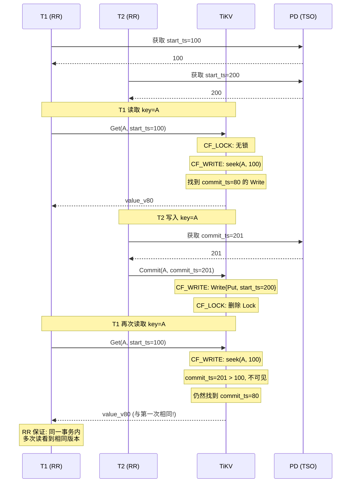
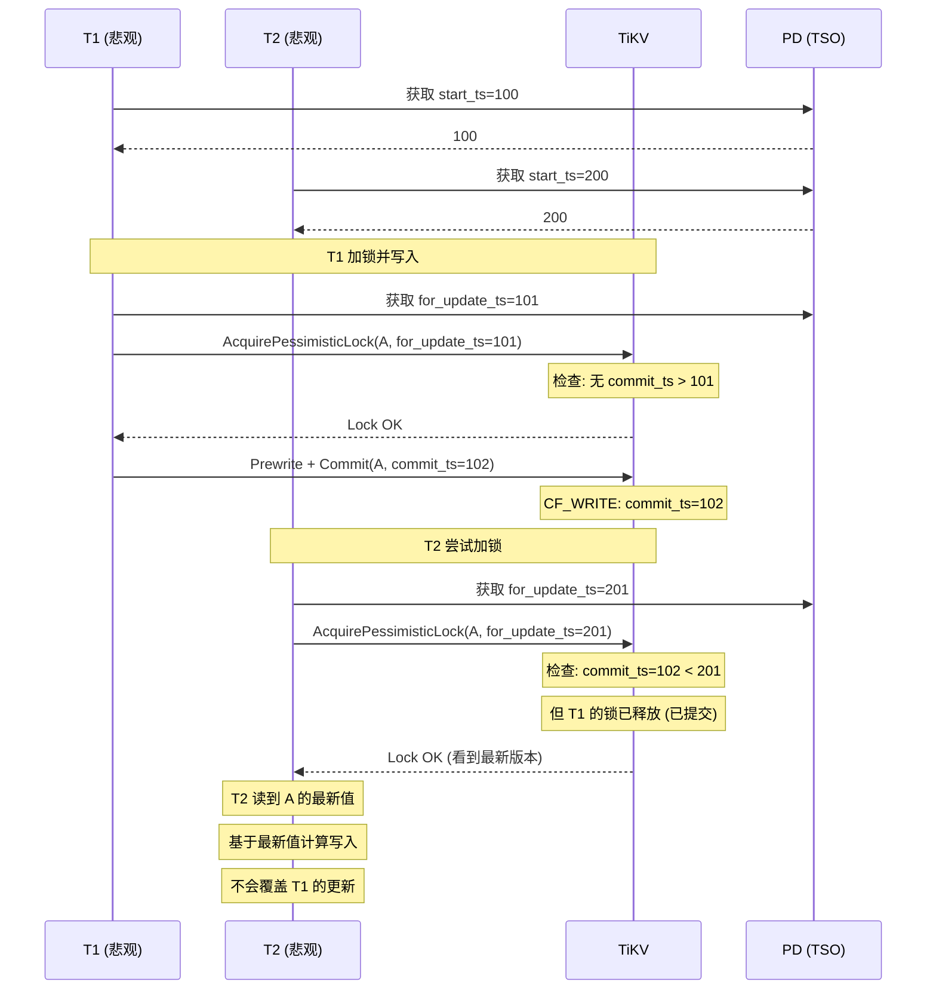
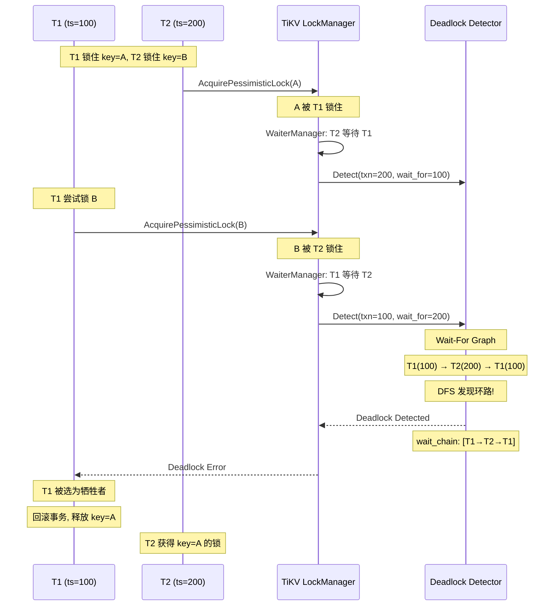
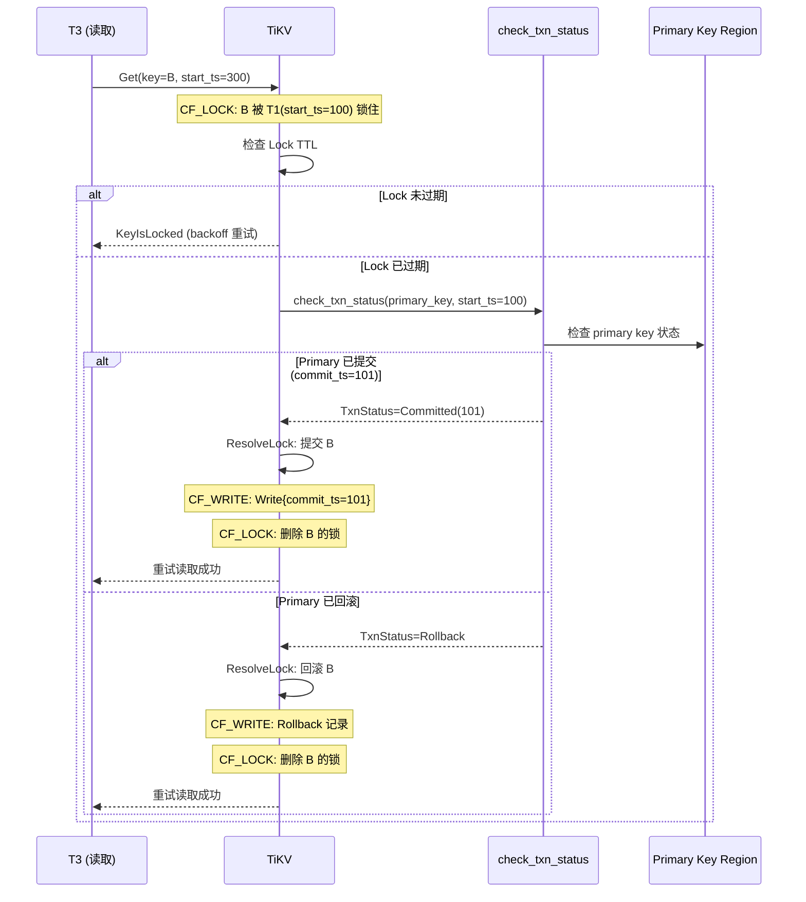
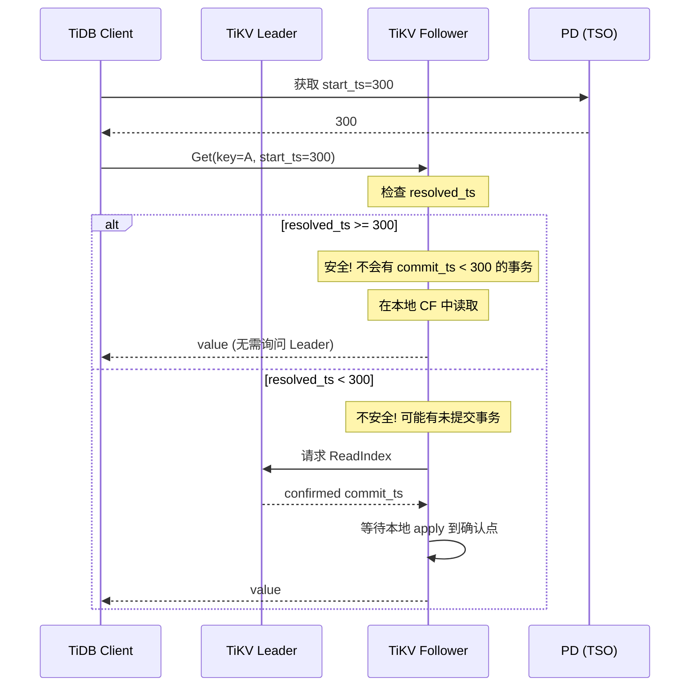
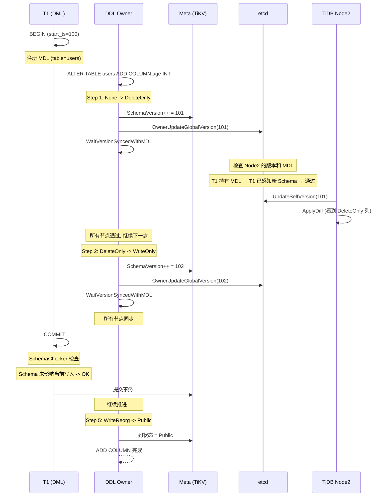

# TiDB 数据一致性保证分析

## 1. 一致性全景

TiDB 通过 **7 层一致性机制** 协同工作，覆盖从事务隔离到物理复制的全链路：

```
┌─────────────────────────────────────────────────────────────────────────┐
│                    TiDB 数据一致性 7 层防护                                 │
├─────────────────────────────────────────────────────────────────────────┤
│                                                                          │
│  Layer 1: TSO 时间戳                                                     │
│  ├── PD 全局单调递增时间戳                                                │
│  └── 事务 start_ts / commit_ts 严格有序                                  │
│                                                                          │
│  Layer 2: MVCC 多版本                                                    │
│  ├── 三列族 (CF_DEFAULT + CF_LOCK + CF_WRITE)                           │
│  ├── 快照读: 只看 commit_ts <= start_ts 的版本                           │
│  └── 写入不覆盖, 追加新版本                                              │
│                                                                          │
│  Layer 3: 2PC 原子提交                                                    │
│  ├── Primary Key 先提交 → 决定事务命运                                   │
│  ├── Secondary Keys 异步提交                                             │
│  └── 任一阶段失败可回滚                                                  │
│                                                                          │
│  Layer 4: 冲突检测与锁                                                    │
│  ├── 悲观锁: for_update_ts 防止丢失更新                                  │
│  ├── 写冲突检测: prewrite 时检查 newer version                           │
│  └── 死锁检测: Wait-For Graph + DFS                                     │
│                                                                          │
│  Layer 5: 锁清理与恢复                                                    │
│  ├── 读取遇锁 → check_txn_status → 解锁或等待                           │
│  ├── GC Safe Point → 清理过期锁和旧版本                                 │
│  └── Resolved TS → 安全的 Follower Read 时间戳                          │
│                                                                          │
│  Layer 6: Raft 复制                                                      │
│  ├── 多数派提交保证不丢失                                                │
│  ├── Leader 读写, Follower 可读 (resolved_ts 之后)                      │
│  └── 一致性读: Leader Lease + Read Index                                 │
│                                                                          │
│  Layer 7: Schema 一致性                                                   │
│  ├── 2-Version 不变量: 集群最多 2 个相邻 Schema 状态                    │
│  ├── MDL: 事务持有元数据锁防止 DDL 破坏                                 │
│  └── SchemaChecker: 提交前检查 Schema 是否被变更                         │
│                                                                          │
└─────────────────────────────────────────────────────────────────────────┘
```

---

## 2. TSO：全局时序基础

### 2.1 TSO 保证

**代码位置**: `pd-master/pkg/tso/tso.go:428-475`

```
┌─────────────────────────────────────────────────────────────────────────┐
│                    TSO 全局时序保证                                        │
├─────────────────────────────────────────────────────────────────────────┤
│                                                                          │
│  PD 作为唯一时间戳源 (Timestamp Oracle):                                 │
│  ├── 物理部分: 毫秒级系统时钟                                            │
│  ├── 逻辑部分: 同毫秒内递增计数器 (最大 2^18)                           │
│  ├── 窗口式持久化: 提前保存到 etcd, 避免每次写 etcd                     │
│  └── 单调性保证: 物理时间永不回退, 逻辑计数永不溢出                     │
│                                                                          │
│  关键性质:                                                               │
│  ├── 全局有序: 任意两个 TSO 可比较大小                                   │
│  ├── 不可重复: 同一 PD 不会分配相同 TSO                                 │
│  ├── 单调递增: 后分配的 TSO 一定大于先分配的                             │
│  └── 持久化: Leader 切换后从 etcd 恢复, 保证不回退                       │
│                                                                          │
│  事务时间戳:                                                             │
│  ├── start_ts: 事务开始时分配, 用于快照读                                │
│  ├── commit_ts: 事务提交时分配, 必须 > start_ts                         │
│  └── for_update_ts: 悲观锁获取时分配, 代表读到的最新版本                 │
│                                                                          │
└─────────────────────────────────────────────────────────────────────────┘
```

---

## 3. MVCC：多版本一致性读

### 3.1 快照读保证

**代码位置**: `pkg/sessiontxn/isolation/repeatable_read.go:37-71`

```
┌─────────────────────────────────────────────────────────────────────────┐
│                    快照读一致性 (SI / RR 模式)                             │
├─────────────────────────────────────────────────────────────────────────┤
│                                                                          │
│  Repeatable Read (SI) 模式:                                              │
│  ├── 事务开始: 从 PD 获取 start_ts                                      │
│  ├── 所有读操作: 固定使用同一 start_ts 的快照                            │
│  │   getStmtReadTSFunc = getTxnStartTS  (固定!)                         │
│  ├── 写操作: 每条语句获取新的 for_update_ts                              │
│  │   getStmtForUpdateTSFunc = getOracleTS (每语句!)                     │
│  └── 结果: 同一事务内, 多次读同一行数据看到相同版本                     │
│                                                                          │
│  Read Committed 模式:                                                    │
│  ├── 每条语句获取新的读时间戳 (新的 TSO)                                │
│  │   getStmtReadTSFunc = getStmtTS  (每语句!)                           │
│  ├── 可以看到其他事务已提交的最新版本                                    │
│  └── RCCheckTS 优化: 缓存 TSO, 遇冲突时刷新重试                        │
│                                                                          │
│  事务内单调性:                                                           │
│  ├── start_ts > session.lastCommitTS                                    │
│  ├── 保证: 后开始的事务 start_ts 一定大于先完成事务的 commit_ts         │
│  └── 代码: sessiontxn/isolation/base.go:327-335                         │
│                                                                          │
└─────────────────────────────────────────────────────────────────────────┘
```

### 3.2 MVCC 读取一致性时序图



---

## 4. 2PC：原子提交保证

### 4.1 Primary Key 决定性

```
┌─────────────────────────────────────────────────────────────────────────┐
│                    2PC Primary Key 决定事务命运                            │
├─────────────────────────────────────────────────────────────────────────┤
│                                                                          │
│  Phase 1: Prewrite                                                      │
│  ├── 所有 key 写入 CF_LOCK                                              │
│  ├── Primary key 的 Lock.primary = primary 自身                        │
│  ├── Secondary keys 的 Lock.primary = 指向 primary                      │
│  └── 任何一个 key prewrite 失败 → 回滚所有已写入的 Lock                │
│                                                                          │
│  Phase 2: Commit Primary                                                │
│  ├── Primary key 提交成功 → 事务已确定提交                              │
│  │   CF_WRITE: Write{type, start_ts, commit_ts}                        │
│  │   CF_LOCK: 删除 primary Lock                                       │
│  └── Primary key 提交失败 → 事务回滚                                   │
│                                                                          │
│  Phase 3: Commit Secondaries (异步)                                     │
│  ├── Secondary keys 提交不影响事务结果                                  │
│  ├── 如果 secondary 未提交:                                             │
│  │   └── 后续读取遇锁 → 检查 primary 状态 → 决定提交或回滚             │
│  └── 最终一致: 所有 secondary 会被提交或由锁清理机制处理                │
│                                                                          │
│  原子性保证:                                                             │
│  ├── Primary 的 commit 是事务的 "决定性瞬间"                            │
│  ├── Primary 之前的所有 key 都在 CF_LOCK 中 (可回滚)                   │
│  └── Primary 之后的所有 key 都可通过 primary 状态推导                 │
│                                                                          │
└─────────────────────────────────────────────────────────────────────────┘
```

---

## 5. 冲突检测与防丢失更新

### 5.1 for_update_ts 机制

**代码位置**: `tikv-master/src/storage/txn/actions/acquire_pessimistic_lock.rs:161-193`

```
┌─────────────────────────────────────────────────────────────────────────┐
│                    for_update_ts 防止丢失更新                              │
├─────────────────────────────────────────────────────────────────────────┤
│                                                                          │
│  场景: T1 和 T2 同时修改 key=A                                          │
│                                                                          │
│  无 for_update_ts (丢失更新):                                            │
│  ├── T1 读 A=10 → 写 A=20                                              │
│  ├── T2 读 A=10 → 写 A=30                                              │
│  └── T2 覆盖 T1 → 最终 A=30, T1 的更新丢失!                            │
│                                                                          │
│  有 for_update_ts (防丢失更新):                                          │
│  ├── T1 加锁: for_update_ts = 最新 commit_ts = 50                      │
│  ├── T2 在 T1 之后加锁: 检测到 commit_ts(50) > T2的 for_update_ts     │
│  ├── T2 必须更新 for_update_ts = 50 (读到最新值)                       │
│  └── T2 基于 A=20 写 A=30 → 正确!                                       │
│                                                                          │
│  Prewrite 时检测:                                                        │
│  ├── check_for_newer_version:                                           │
│  │   ├── 乐观事务: commit_ts > start_ts → WriteConflict                │
│  │   └── 悲观事务: commit_ts > for_update_ts → 锁丢失错误              │
│  └── PessimisticLockNotFound: 说明锁与数据版本不一致                    │
│                                                                          │
│  代码: prewrite.rs:563-648, acquire_pessimistic_lock.rs:161-193        │
│                                                                          │
└─────────────────────────────────────────────────────────────────────────┘
```

### 5.2 写冲突检测时序图



### 5.3 死锁检测

**代码位置**: `tikv-master/src/server/lock_manager/deadlock.rs:53-362`

```
┌─────────────────────────────────────────────────────────────────────────┐
│                    死锁检测: Wait-For Graph                                │
├─────────────────────────────────────────────────────────────────────────┤
│                                                                          │
│  架构:                                                                   │
│  ├── 每个 TiKV 节点运行 LockManager                                    │
│  ├── 只有 Region 包含 LEADER_KEY (空键) 的节点运行 Detector            │
│  ├── WaiterManager: 管理等待中的事务                                     │
│  └── Detector: 集中式死锁检测                                           │
│                                                                          │
│  Wait-For Graph:                                                         │
│  ┌──────────────────────────────────────────────────────┐                │
│  │  T1(A) → 等待 → T2(B) → 等待 → T3(C) → 等待 → T1(A)│                │
│  │  ↑                                                     │                │
│  │  └─── 环路检测: DFS 遍历, 发现回到起点 = 死锁        │                │
│  └──────────────────────────────────────────────────────┘                │
│                                                                          │
│  检测算法 (do_detect):                                                    │
│  ├── 输入: txn_ts, wait_for_ts                                          │
│  ├── 从 wait_for_ts 开始 DFS                                            │
│  ├── 使用 pushed map 避免重复访问                                       │
│  ├── 如果遍历中发现 lock_ts == txn_ts → 死锁!                          │
│  └── 返回 wait_chain (等待链) 供客户端诊断                              │
│                                                                          │
│  处理:                                                                   │
│  ├── 检测到死锁 → 返回 Deadlock 错误给客户端                            │
│  ├── 客户端选择: 回滚其中一个事务                                       │
│  └── 边有 TTL 自动过期, 防止图无限增长                                  │
│                                                                          │
│  代码: deadlock.rs:179-225 (do_detect)                                  │
│                                                                          │
└─────────────────────────────────────────────────────────────────────────┘
```

### 5.4 死锁检测时序图



---

## 6. 锁清理与恢复

### 6.1 读取遇锁处理

**代码位置**: `tikv-master/src/storage/txn/commands/resolve_lock_readphase.rs`, `resolve_lock.rs`

```
┌─────────────────────────────────────────────────────────────────────────┐
│                    读取遇锁处理流程                                        │
├─────────────────────────────────────────────────────────────────────────┤
│                                                                          │
│  读请求遇到 Lock (start_ts = S):                                        │
│  │                                                                       │
│  ├── 锁未过期 (TTL > 当前时间)?                                         │
│  │   ├── YES: 等待锁释放 (backoff + 重试)                               │
│  │   └── NO:  执行锁清理                                                │
│  │                                                                       │
│  └── check_txn_status(primary_key, S)                                   │
│      ├── 事务已提交?                                                     │
│      │   ├── YES: commit_ts = C                                         │
│      │   │   ├── ResolveLock: 提交所有 secondary keys (commit_ts=C)     │
│      │   │   └── 读取重试 → 看到 committed 版本                        │
│      │   └── NO: 继续...                                                │
│      ├── 事务已回滚?                                                     │
│      │   ├── YES: 清理 Lock → 写入 Rollback 记录                       │
│      │   └── 读取重试 → 看到之前版本                                    │
│      └── 事务仍在进行?                                                   │
│          ├── 锁 TTL 仍有效 → 等待                                       │
│          └── 锁 TTL 过期 → 强制清理 (rollback)                          │
│                                                                          │
│  两阶段清理:                                                             │
│  ├── ResolveLockReadPhase: 扫描 CF_LOCK 找到目标锁                      │
│  └── ResolveLock: 根据 txn_status 提交或回滚                            │
│                                                                          │
└─────────────────────────────────────────────────────────────────────────┘
```

### 6.2 锁清理时序图



---

## 7. Resolved TS：安全的 Follower Read

### 7.1 Resolved TS 机制

**代码位置**: `tikv-master/components/resolved_ts/src/resolver.rs:415-486`

```
┌─────────────────────────────────────────────────────────────────────────┐
│                    Resolved TS 机制                                       │
├─────────────────────────────────────────────────────────────────────────┤
│                                                                          │
│  Resolved TS = 保证不会有 commit_ts < resolved_ts 的事务未来再提交      │
│                                                                          │
│  计算:                                                                   │
│  resolved_ts = min(min_lock_start_ts, min_ts_from_pd)                   │
│  ├── min_lock_start_ts: 当前所有活跃锁的最小 start_ts                   │
│  └── min_ts_from_pd: 从 PD 获取的最新 TSO                              │
│                                                                          │
│  保证:                                                                    │
│  ├── resolved_ts 之后的数据版本不会改变                                 │
│  ├── Follower 可以安全地在 resolved_ts 处提供快照读                     │
│  └── resolved_ts 单调递增, 永不回退                                    │
│                                                                          │
│  Resolver 维护:                                                          │
│  ├── locks_by_key: HashMap<Key, start_ts>  ← 每个锁的 start_ts          │
│  ├── lock_ts_heap: BTreeMap<start_ts, keys> ← 按 start_ts 排序         │
│  ├── track_lock: 新锁注册                                                │
│  └── untrack_lock: 锁释放注销                                            │
│                                                                          │
│  变更追踪:                                                               │
│  ├── ChangeLog: 解码 Raft 命令得到 lock/unlock 事件                     │
│  └── 实时更新 Resolver 中的锁集合                                       │
│                                                                          │
│  代码: resolver.rs:76-108, :415-486                                     │
│                                                                          │
└─────────────────────────────────────────────────────────────────────────┘
```

### 7.2 Follower Read 时序图



---

## 8. GC：MVCC 一致性清理

### 8.1 GC Safe Point

**代码位置**: `tikv-master/src/storage/txn/actions/gc.rs:13-123`

```
┌─────────────────────────────────────────────────────────────────────────┐
│                    GC Safe Point 保证                                      │
├─────────────────────────────────────────────────────────────────────────┤
│                                                                          │
│  Safe Point = PD 确认的安全时间戳                                        │
│  ├── 保证: 没有活跃事务的 start_ts < safe_point                         │
│  ├── 因此: commit_ts < safe_point 的版本不会再被任何事务读到            │
│  └── 可以安全删除                                                        │
│                                                                          │
│  GC 算法 (per key):                                                      │
│  ├── Rewind: 跳过 commit_ts > safe_point 的版本 (仍需被读取)            │
│  ├── RemoveIdempotent: 删除 Rollback/Lock 类型的 Write 记录             │
│  └── RemoveAll: 找到最新的 Put/Delete 后, 删除所有更旧的版本             │
│      └── 保留最新的 Delete 作为 tombstone, 直到更旧版本全部删除         │
│                                                                          │
│  MVCC 一致性保护:                                                        │
│  ├── 永远不删除 commit_ts > safe_point 的版本                           │
│  ├── 保留最新 Put/Delete 直到前置版本都删除                              │
│  └── 保证任何 start_ts >= safe_point 的读都能找到正确版本               │
│                                                                          │
│  GC 触发方式:                                                            │
│  ├── GC Worker: 定期扫描 Region 并执行 GC                               │
│  ├── Compaction Filter: RocksDB 压缩时在线过滤旧版本                    │
│  └── 两者互补: Worker 处理残留, Filter 加速常规清理                    │
│                                                                          │
│  代码: gc_worker.rs:183-399, compaction_filter.rs:47-203               │
│                                                                          │
└─────────────────────────────────────────────────────────────────────────┘
```

---

## 9. Raft 复制一致性

### 9.1 多数派读写

```
┌─────────────────────────────────────────────────────────────────────────┐
│                    Raft 复制一致性保证                                      │
├─────────────────────────────────────────────────────────────────────────┤
│                                                                          │
│  写一致性:                                                               │
│  ├── 所有写操作通过 Raft Leader                                         │
│  ├── Leader 提议 → 多数派 (含自己) 确认 → 提交                         │
│  ├── 提交 = 数据不会丢失 (少数派故障不影响)                              │
│  └── 已提交的写操作对所有后续读可见                                     │
│                                                                          │
│  读一致性:                                                               │
│  ├── 默认: 从 Leader 读 → 保证看到最新已提交数据                        │
│  ├── Follower Read: 使用 resolved_ts 读 → 保证看到安全时间点的数据      │
│  └── Read Index: Follower 向 Leader 确认后读 → 保证线性一致性           │
│                                                                          │
│  Leader 租约 (Lease):                                                    │
│  ├── Leader 持有租约期间, 保证不会有其他 Leader                        │
│  ├── 租约内的读无需额外确认 → 低延迟                                    │
│  └── 租约过期 → 必须通过 Read Index 确认                                │
│                                                                          │
│  一致性不变量:                                                           │
│  ├── 已提交的数据永不丢失 (多数派存活)                                  │
│  ├── 读到的数据一定是最新的已提交版本 (Leader 读)                       │
│  └── Follower 读到的数据一定 >= resolved_ts 时刻的快照                 │
│                                                                          │
└─────────────────────────────────────────────────────────────────────────┘
```

---

## 10. Schema 一致性

### 10.1 2-Version 不变量 + MDL

```
┌─────────────────────────────────────────────────────────────────────────┐
│                    Schema 一致性保证                                       │
├─────────────────────────────────────────────────────────────────────────┤
│                                                                          │
│  2-Version 不变量:                                                       │
│  ├── DDL 每步推进状态后, 等待所有节点同步                                │
│  ├── 集群中一个 DDL 对象最多只有 2 个相邻状态                           │
│  └── 保证: DML 不会操作在过时的 Schema 上                               │
│                                                                          │
│  MDL (Metadata Lock):                                                    │
│  ├── 事务开始时: 注册到 mysql.tidb_mdl_info                             │
│  ├── DDL Owner 检查:                                                    │
│  │   ├── 节点已更新版本 → 通过                                          │
│  │   └── 节点持有 MDL → 该事务感知当前 Schema → 通过                   │
│  └── 防止: DDL 修改正在被事务使用的表结构                               │
│                                                                          │
│  SchemaChecker:                                                          │
│  ├── 事务提交前: 检查 Schema 版本是否变化                                │
│  ├── 如果 Schema 变更影响当前事务 → ErrInfoSchemaChanged                │
│  ├── 自动重试: 最多 10 次, 间隔 500ms                                   │
│  └── 防止: 基于旧 Schema 的写入导致数据不一致                           │
│                                                                          │
│  代码: domain/schema_checker.go:59-81                                   │
│        sessiontxn/isolation/base.go:596-614                             │
│                                                                          │
└─────────────────────────────────────────────────────────────────────────┘
```

### 10.2 Schema 一致性时序图



---

## 11. 线性一致性 (Linearizability)

### 11.1 GuaranteeLinearizability

**代码位置**: `pkg/sessiontxn/isolation/base.go:524-542`, `kv/option.go:62-63`

```
┌─────────────────────────────────────────────────────────────────────────┐
│                    线性一致性保证                                          │
├─────────────────────────────────────────────────────────────────────────┤
│                                                                          │
│  问题: Prewrite 时, 如果 commit_ts < 某个已分配的 TSO                  │
│  ├── 场景:                                                              │
│  │   1. T1 从 PD 获取 start_ts=100                                     │
│  │   2. T2 从 PD 获取 start_ts=200 (在 T1 提交前)                     │
│  │   3. T1 用 commit_ts=101 提交                                       │
│  │   4. T2 的快照读(start_ts=200)不应看到 T1 的结果?                   │
│  │      → 按 MVCC 规则应该看到 (101 < 200)                             │
│  │      → 但外部观察者可能认为 T2 先开始读                             │
│  │                                                                       │
│  解决: GuaranteeLinearizability=true (默认)                             │
│  ├── Prewrite 前: 获取一个 "max_ts" 从 PD                               │
│  ├── min_commit_ts = max(max_ts, start_ts + 1)                         │
│  ├── 确保 commit_ts >= 任何已分配的 TSO                                 │
│  └── 保证: 如果 T2 的 start_ts 在 T1 prewrite 之后获取                 │
│      → T1 的 commit_ts 一定 > T2 的 start_ts                          │
│      → T2 一定能看到 T1 (如果按 MVCC 应该看到)                         │
│                                                                          │
│  优化:                                                                   │
│  ├── Auto-commit 事务天然满足线性一致性 (无需额外 TSO)                  │
│  └── START TRANSACTION WITH CAUSAL CONSISTENCY ONLY                     │
│      → 放弃线性一致性, 节省一次 TSO 请求                                │
│                                                                          │
│  TiKV 侧: GuaranteeLinearizability=true → CausalConsistency=false       │
│  代码: txn_driver.go:264-265                                            │
│                                                                          │
└─────────────────────────────────────────────────────────────────────────┘
```

---

## 12. CAP 分析

```
┌─────────────────────────────────────────────────────────────────────────┐
│                    TiDB 的 CAP 取向                                        │
├─────────────────────────────────────────────────────────────────────────┤
│                                                                          │
│  TiDB 是 CP 系统 (Consistency + Partition Tolerance):                   │
│                                                                          │
│  Consistency (一致性):                                                   │
│  ├── TSO 全局有序 → 所有操作有确定的全序                                │
│  ├── MVCC 快照读 → 同一事务内可重复读                                  │
│  ├── 2PC 原子提交 → 事务要么全部提交要么全部回滚                        │
│  ├── Raft 多数派 → 已提交数据不丢失                                    │
│  └── Schema 2-Version → DDL/DML 不会冲突                                │
│                                                                          │
│  Partition Tolerance (分区容忍):                                          │
│  ├── Raft 多数派: 少数节点网络分区不影响可用性                          │
│  ├── TSO: PD 集群通过 etcd 容忍少数节点故障                            │
│  └── Follower Read: 分区后 Follower 仍可在 resolved_ts 前提供读        │
│                                                                          │
│  Availability (可用性) 在分区时的取舍:                                   │
│  ├── 网络分区导致 Leader 不可达 → 重新选举 → 短暂不可用               │
│  ├── PD Leader 分区 → 新 PD 选举 → TSO 短暂中断                       │
│  ├── DDL Owner 分区 → 新 Owner 选举 → DDL 短暂暂停                    │
│  └── 选择: 牺牲分区时刻的短暂可用性, 保证数据一致性                    │
│                                                                          │
│  总结: TiDB 在任何情况下都不会返回不一致的数据                          │
│  (宁可报错或等待, 也不会返回错误但看似成功的结果)                      │
│                                                                          │
└─────────────────────────────────────────────────────────────────────────┘
```

---

## 13. 端到端场景分析

### 13.1 场景: 悲观事务写入 + 并发读取

```
┌─────────────────────────────────────────────────────────────────────────┐
│  场景: T1 写入 key=A, T2 并发读取 key=A                                │
├─────────────────────────────────────────────────────────────────────────┤
│                                                                          │
│  T1 (start_ts=100, 悲观):                                               │
│  1. AcquirePessimisticLock(A, for_update_ts=101)                       │
│  2. Prewrite(A, start_ts=100)                                           │
│  3. Commit(A, commit_ts=102)                                            │
│                                                                          │
│  T2 (start_ts=200, RR):                                                 │
│  1. Get(A, start_ts=200)                                                │
│  2. 看到 commit_ts=102 < 200 → 可见 → 返回 T1 写入的值                │
│                                                                          │
│  一致性保证: T2 看到 T1 的结果, 因为 T1 在 T2 之前提交                  │
│                                                                          │
└─────────────────────────────────────────────────────────────────────────┘
```

### 13.2 场景: 事务回滚后读取

```
┌─────────────────────────────────────────────────────────────────────────┐
│  场景: T1 写入后回滚, T2 读取                                           │
├─────────────────────────────────────────────────────────────────────────┤
│                                                                          │
│  T1 (start_ts=100, 悲观):                                               │
│  1. AcquirePessimisticLock(A, for_update_ts=101)                       │
│  2. Prewrite(A, start_ts=100)                                           │
│  3. Rollback → CF_WRITE: Rollback(start_ts=100)                        │
│              → CF_LOCK: 删除 Lock                                       │
│                                                                          │
│  T2 (start_ts=200):                                                     │
│  1. Get(A, start_ts=200)                                                │
│  2. CF_WRITE: seek 找到 Rollback(100) → 跳过, 继续找更早版本          │
│  3. 找到 commit_ts=80 的 Put → 返回旧值                                 │
│                                                                          │
│  一致性保证: T1 回滚的数据对 T2 不可见, T2 只看到已提交的旧版本       │
│                                                                          │
└─────────────────────────────────────────────────────────────────────────┘
```

### 13.3 场景: 网络分区导致 Primary 未提交

```
┌─────────────────────────────────────────────────────────────────────────┐
│  场景: T1 Prewrite 后, Primary 提交前网络分区                           │
├─────────────────────────────────────────────────────────────────────────┤
│                                                                          │
│  T1 (start_ts=100):                                                     │
│  1. Prewrite 所有 keys (primary + secondaries) → 成功                  │
│  2. 尝试 Commit primary → 网络分区 → 未知结果                           │
│                                                                          │
│  T2 (start_ts=200):                                                     │
│  1. Get(secondary_key, start_ts=200)                                    │
│  2. 遇到 T1 的 secondary Lock                                           │
│  3. check_txn_status(primary_key, start_ts=100)                         │
│  4. 如果 primary 已提交 → 提交 secondary + 返回 T1 数据                │
│  5. 如果 primary 未提交且 TTL 过期 → 回滚 + 返回旧数据                │
│  6. 如果 primary 未提交且 TTL 未过期 → 等待                             │
│                                                                          │
│  一致性保证:                                                             │
│  ├── Secondary lock 的命运由 primary 决定                               │
│  ├── Primary 提交 → 所有 secondary 最终也会提交                        │
│  ├── Primary 未提交 → 所有 secondary 最终也会回滚                      │
│  └── 读取者永远不会看到 "部分提交" 的事务                               │
│                                                                          │
└─────────────────────────────────────────────────────────────────────────┘
```

---

## 14. 关键代码索引

```
┌──────────────────────────┬──────────────────────────────────────┬───────────┐
│ 一致性机制                │ 文件位置                               │ 关键行号   │
├──────────────────────────┼──────────────────────────────────────┼───────────┤
│ TSO 分配                 │ pd-master/pkg/tso/tso.go            │ 428-475   │
│ IsoLevel (SI/RC)         │ tidb-master/pkg/kv/kv.go            │ 846-855   │
│ LazyTxn (start_ts)       │ tidb-master/pkg/session/txn.go      │ 45-77     │
│ RR Provider (固定快照)   │ sessiontxn/isolation/repeatable_read │ 37-71     │
│ RC Provider (每语句TS)   │ sessiontxn/isolation/readcommitted    │ 53-90     │
│ Pessimistic Lock         │ tikv/txn/actions/acquire_pessimistic │ 161-193   │
│ for_update_ts 检查       │ tikv/txn/actions/prewrite.rs        │ 563-648   │
│ Write Conflict 检测      │ tikv/txn/actions/prewrite.rs        │ 476-522   │
│ 死锁检测 (DFS)           │ tikv/lock_manager/deadlock.rs        │ 179-225   │
│ Lock Resolution (读阶段) │ tikv/txn/commands/resolve_lock_read  │ 1-112     │
│ Lock Resolution (写阶段) │ tikv/txn/commands/resolve_lock.rs    │ 81-173    │
│ check_txn_status         │ tikv/txn/actions/check_txn_status    │ 17-68     │
│ Resolved TS 计算         │ tikv/resolved_ts/resolver.rs        │ 415-486   │
│ GC 算法                  │ tikv/txn/actions/gc.rs              │ 13-123    │
│ GC Worker                │ tikv/gc_worker/gc_worker.rs          │ 183-399   │
│ Compaction Filter (GC)   │ tikv/gc_worker/compaction_filter    │ 47-203    │
│ SchemaChecker            │ tidb/domain/schema_checker.go        │ 59-81     │
│ MDL 注册                 │ tidb/ddl/job_worker.go               │ 330-357   │
│ MDL Wait                 │ tidb/ddl/schemaver/syncer.go         │ 412-467   │
│ GuaranteeLinearizability │ tidb/sessiontxn/isolation/base.go    │ 524-542   │
│ Causal Consistency       │ tidb/kv/option.go                   │ 62-63     │
│ Stale Read Provider      │ tidb/sessiontxn/staleread/provider   │ 35-289    │
│ ReplicaRead 类型         │ tidb/kv/option.go                   │ 129-147   │
│ MVCC Reader              │ tikv/mvcc/reader/reader.rs          │ 126-256   │
│ Commit Action            │ tikv/txn/actions/commit.rs          │ 64-245    │
│ 2PC Prewrite             │ tikv/txn/commands/prewrite.rs       │ 46-109    │
└──────────────────────────┴──────────────────────────────────────┴───────────┘
```

---

## 15. 总结

```
┌─────────────────────────────────────────────────────────────────────────┐
│                    TiDB 数据一致性核心要点                                  │
├─────────────────────────────────────────────────────────────────────────┤
│                                                                          │
│  1. TSO 是一切的基础                                                     │
│     ├── PD 全局单调递增, 事务时间戳严格有序                              │
│     └── 保证: 所有操作有确定的先后顺序                                   │
│                                                                          │
│  2. MVCC 实现快照隔离                                                    │
│     ├── 三列族存储多版本: data + lock + write                           │
│     ├── RR 模式: 固定 start_ts, 同一事务内可重复读                     │
│     └── RC 模式: 每条语句获取新 TSO, 可看到最新提交                     │
│                                                                          │
│  3. 2PC + Primary Key 保证原子性                                         │
│     ├── Primary 先提交决定事务命运                                       │
│     ├── Secondary 可通过 primary 状态推导                               │
│     └── 读取遇 secondary 锁 → 检查 primary → 提交或回滚                 │
│                                                                          │
│  4. 悲观锁 + for_update_ts 防丢失更新                                    │
│     ├── 加锁时记录读到的最新 commit_ts                                  │
│     ├── Prewrite 时检查是否有更新版本覆盖                                │
│     └── 写冲突 → 重试或报错, 永不静默覆盖                              │
│                                                                          │
│  5. 锁清理保证恢复                                                       │
│     ├── 读取遇锁 → check_txn_status → 决定提交/回滚                     │
│     ├── TTL 过期 → 强制清理, 防止锁永久占用                             │
│     └── GC Safe Point → 清理过期版本, 保留 MVCC 一致性                  │
│                                                                          │
│  6. Raft 多数派保证不丢数据                                              │
│     ├── 写入: 多数派确认 → 数据持久化                                   │
│     ├── 读取: Leader 保证最新, Follower 通过 resolved_ts 安全读         │
│     └── 分区: 少数派不可用, 多数派继续服务                              │
│                                                                          │
│  7. Schema 一致性防止 DDL 破坏 DML                                       │
│     ├── 2-Version 不变量: 最多 2 个相邻 Schema 状态                     │
│     ├── MDL: 事务持有元数据锁 → DDL 等待                               │
│     └── SchemaChecker: 提交前检查 → 防止基于旧 Schema 写入              │
│                                                                          │
└─────────────────────────────────────────────────────────────────────────┘
```

---
