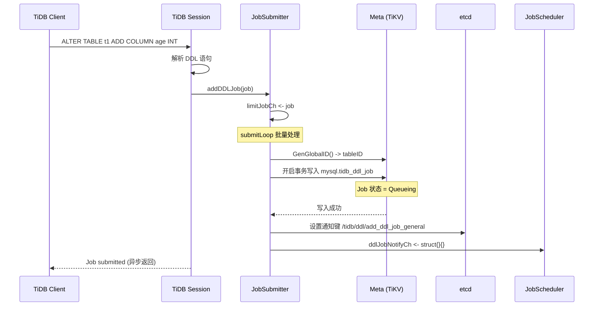
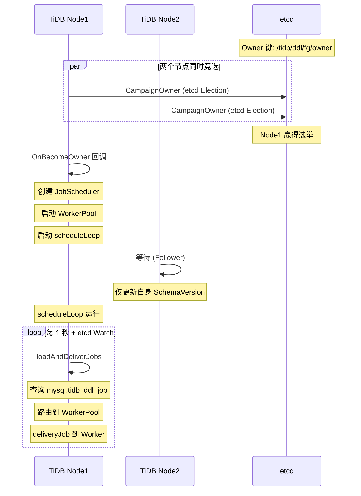
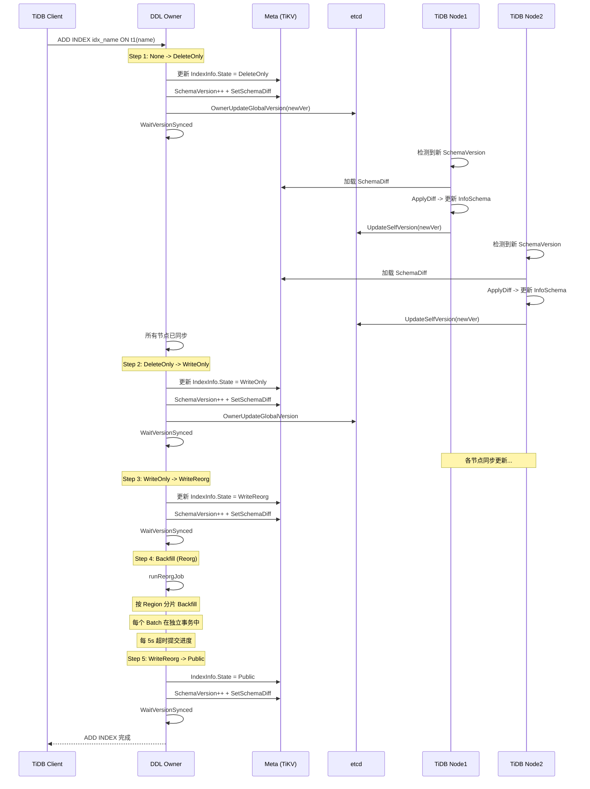
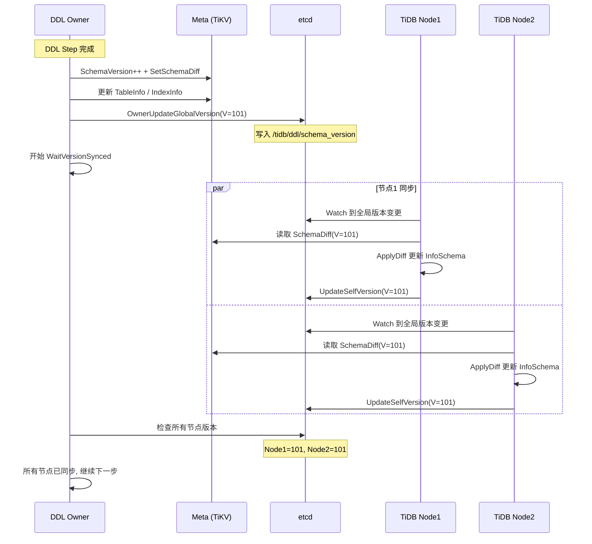
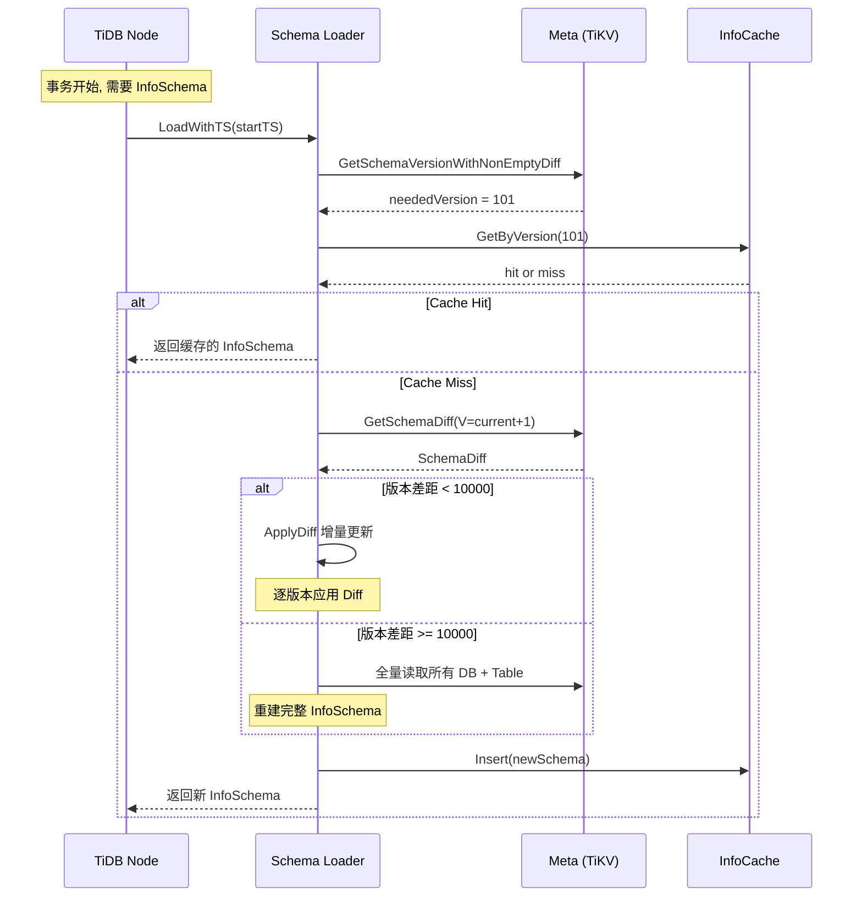

# TiDB 元数据管理分析

## 1. 元数据管理总览

```
┌─────────────────────────────────────────────────────────────────────────┐
│                    TiDB 元数据管理全景                                      │
├─────────────────────────────────────────────────────────────────────────┤
│                                                                          │
│  ┌───────────────────────────────────────────────────────────────────┐  │
│  │  Meta 层 (TiKV KV 存储)                                          │  │
│  │  ├── SchemaVersionKey  → 版本号                                   │  │
│  │  ├── DBs → { DB:1 → DBInfo, DB:2 → DBInfo, ... }                │  │
│  │  ├── DB:1 → { Table:1 → TableInfo, Table:2 → TableInfo, ... }    │  │
│  │  ├── Diff:V → SchemaDiff (增量变更)                               │  │
│  │  └── NextGlobalID → 自增 ID 计数器                               │  │
│  └───────────────────────────────────────────────────────────────────┘  │
│       │ 写入 (DDL Owner)           │ 读取 (所有 TiDB 节点)              │
│       ▼                            ▼                                     │
│  ┌────────────────┐    ┌─────────────────────────────────────────────┐  │
│  │  DDL 引擎       │    │  InfoSchema 缓存                              │  │
│  │  ├── Owner 选举  │    │  ├── InfoCache (版本→Schema 映射)           │  │
│  │  ├── Job 队列    │    │  ├── Builder (增量 Diff 应用)               │  │
│  │  ├── 状态机      │    │  └── 桶式查找 (tableID % 512)              │  │
│  │  └── Backfill   │    └─────────────────────────────────────────────┘  │
│  └────────────────┘         │                                            │
│       │                     │ 每个事务开始时加载                          │
│       ▼                     ▼                                            │
│  ┌───────────────────────────────────────────────────────────────────┐  │
│  │  Schema 同步 (etcd)                                               │  │
│  │  ├── /tidb/ddl/fg/owner → Owner 身份                              │  │
│  │  ├── /tidb/ddl/schema_version → 全局 Schema 版本                   │  │
│  │  ├── /tidb/ddl/schema_versions_by_job/{jobID}/{nodeID} → MDL     │  │
│  │  └── 各节点自身版本路径                                            │  │
│  └───────────────────────────────────────────────────────────────────┘  │
│                                                                          │
└─────────────────────────────────────────────────────────────────────────┘
```

---

## 2. Meta 存储模型

### 2.1 Meta 键空间

**代码位置**: `pkg/meta/meta.go:59-131`

所有元数据键以 `"m"` 为前缀，存储在 TiKV 中：

```
┌─────────────────────────────────────────────────────────────────────────┐
│                    Meta 键空间布局                                         │
├─────────────────────────────────────────────────────────────────────────┤
│                                                                          │
│  键前缀: "m" (metaPrefix)                                               │
│  编码: m + EncodeBytes(key) + HashData('h') + EncodeBytes(field)       │
│                                                                          │
│  ┌─────────────────────────┬──────────────────────────────────────────┐ │
│  │ 键名                     │ 值类型                                  │ │
│  ├─────────────────────────┼──────────────────────────────────────────┤ │
│  │ NextGlobalID             │ int64 (自增 ID 计数器)                  │ │
│  │ SchemaVersionKey         │ int64 (当前 Schema 版本)               │ │
│  │ DBs → { "DB:1": bytes } │ DBInfo 的 JSON 序列化                  │ │
│  │ DB:1 → {                 │                                         │ │
│  │   "Table:1": bytes       │ TableInfo 的 JSON 序列化                │ │
│  │   "TID:1": int64        │ 自增 TableID 计数器                    │ │
│  │   "IID:1": int64        │ Auto Increment 计数器                   │ │
│  │   "TARID:1": int64      │ Auto Random ID 计数器                  │ │
│  │ }                        │                                         │ │
│  │ Names → {                │                                         │ │
│  │   "DBname\x00tblname"   │ tableID (名称反查)                      │ │
│  │ }                        │                                         │ │
│  │ Diff:100 → SchemaDiff   │ 增量变更描述 (JSON)                     │ │
│  │ Policy:1                 │ Placement Policy                       │ │
│  │ RG:1                     │ Resource Group                         │ │
│  └─────────────────────────┴──────────────────────────────────────────┘ │
│                                                                          │
│  注: 整个 TableInfo (含所有列、索引) 作为单个 JSON 存储                  │
│      列不单独存储为独立 KV 条目                                           │
│                                                                          │
└─────────────────────────────────────────────────────────────────────────┘
```

### 2.2 核心数据结构

**代码位置**: `pkg/meta/model/`

```
┌─────────────────────────────────────────────────────────────────────────┐
│                    核心元数据结构                                          │
├─────────────────────────────────────────────────────────────────────────┤
│                                                                          │
│  DBInfo (model/db.go:24-35)                                             │
│  ├── ID        int64                                                    │
│  ├── Name      string                                                   │
│  ├── Charset   string                                                  │
│  ├── Collate   string                                                  │
│  ├── State     SchemaState                                              │
│  └── PlacementPolicyRef                                                 │
│                                                                          │
│  TableInfo (model/table.go:108-150+)                                    │
│  ├── ID              int64                                              │
│  ├── Name            string                                             │
│  ├── Columns         []*ColumnInfo   ← 列列表                           │
│  ├── Indices         []*IndexInfo    ← 索引列表                          │
│  ├── State           SchemaState                                         │
│  ├── MaxColumnID     int64                                              │
│  ├── MaxIndexID      int64                                              │
│  ├── AutoIncID       int64                                              │
│  ├── ForeignKeys     []*ForeignKeyInfo                                  │
│  ├── Partition       *PartitionInfo                                     │
│  ├── ShardRowIDBits  uint64                                             │
│  └── ...                                                                │
│                                                                          │
│  ColumnInfo (model/column.go:86-113)                                    │
│  ├── ID              int64                                              │
│  ├── Name            string                                             │
│  ├── Offset          int           ← 列在行中的偏移位置                 │
│  ├── State           SchemaState                                         │
│  ├── FieldType       types.FieldType                                     │
│  ├── DefaultValue    interface{}                                         │
│  ├── ChangeStateInfo *ChangeStateInfo ← 修改列时的中间状态               │
│  └── Version         uint64                                             │
│                                                                          │
│  IndexInfo (model/index.go)                                              │
│  ├── ID              int64                                              │
│  ├── Name            string                                             │
│  ├── State           SchemaState                                         │
│  ├── Columns         []*IndexColumn                                      │
│  ├── Unique          bool                                                │
│  ├── Primary         bool                                                │
│  ├── Global          bool                                               │
│  └── ...                                                                │
│                                                                          │
│  SchemaState 枚举 (model/job.go:268-291)                                │
│  ├── StateNone                = 0  ← 不存在                              │
│  ├── StateDeleteOnly          = 1  ← 仅可删除                            │
│  ├── StateWriteOnly           = 2  ← 可写不可读                          │
│  ├── StateWriteReorganization = 3  ← 数据重组中                         │
│  ├── StateDeleteReorganization = 4 ← 删除重组中                         │
│  ├── StatePublic              = 5  ← 完全可见                            │
│  ├── StateReplicaOnly         = 6  ← 等待 TiFlash 副本                  │
│  └── StateGlobalTxnOnly       = 7  ← 仅允许全局事务                     │
│                                                                          │
└─────────────────────────────────────────────────────────────────────────┘
```

### 2.3 全局 ID 分配

**代码位置**: `pkg/meta/meta.go:241-253`

```
┌─────────────────────────────────────────────────────────────────────────┐
│                    全局 ID 分配机制                                        │
├─────────────────────────────────────────────────────────────────────────┤
│                                                                          │
│  GenGlobalID():                                                          │
│  ├── 使用进程级互斥锁串行化                                              │
│  ├── 读取 "NextGlobalID" 当前值                                         │
│  ├── 原子递增 +1                                                         │
│  └── 返回递增前的值 (旧值即分配的 ID)                                   │
│                                                                          │
│  流程:                                                                   │
│  ┌──────────┐     ┌──────────┐     ┌──────────┐                        │
│  │ DDL Job  │────▶│ GenGlobal│────▶│ NextGlobal│                        │
│  │ 需要 ID  │     │ ID()+1   │     │ ID=1002  │                        │
│  └──────────┘     └──────────┘     └──────────┘                        │
│       │                                 ▲                               │
│       └── 分配 tableID=1001 ────────────┘                               │
│                                                                          │
│  GenSchemaVersion():                                                     │
│  ├── 原子递增 "SchemaVersionKey"                                       │
│  └── 每次 Schema 变更 (DDL 步骤) 都递增                                │
│                                                                          │
│  代码: meta.go:556-558                                                  │
│                                                                          │
└─────────────────────────────────────────────────────────────────────────┘
```

---

## 3. DDL 引擎

### 3.1 DDL 架构总览

**代码位置**: `pkg/ddl/ddl.go`, `job_scheduler.go`

```
┌─────────────────────────────────────────────────────────────────────────┐
│                    DDL 引擎架构                                           │
├─────────────────────────────────────────────────────────────────────────┤
│                                                                          │
│  ┌───────────────────────────────────────────────────────────────────┐  │
│  │  客户端 → DDL 语句 (CREATE/ALTER/DROP)                           │  │
│  └─────────────────────────┬─────────────────────────────────────────┘  │
│                              │                                           │
│                              ▼                                           │
│  ┌───────────────────────────────────────────────────────────────────┐  │
│  │  JobSubmitter (提交器)                                             │  │
│  │  ├── 从 limitJobCh 读取 DDL Job                                  │  │
│  │  ├── 批量分配 GlobalID (tableID, indexID)                        │  │
│  │  ├── 写入 mysql.tidb_ddl_job 表                                  │  │
│  │  └── 通知: etcd key + ddlJobNotifyCh                             │  │
│  └─────────────────────────┬─────────────────────────────────────────┘  │
│                              │                                           │
│                   ┌──────────┴──────────┐                                │
│                   │  DDL Owner (etcd)   │                                │
│                   │  /tidb/ddl/fg/owner │ ← 仅 Owner 执行 DDL           │
│                   └──────────┬──────────┘                                │
│                              │                                           │
│                              ▼                                           │
│  ┌───────────────────────────────────────────────────────────────────┐  │
│  │  JobScheduler (调度器, 仅 Owner 运行)                             │  │
│  │  ├── generalDDLWorkerPool (10 workers)                           │  │
│  │  ├── reorgWorkerPool (max 10 workers)                            │  │
│  │  ├── scheduleLoop: 监听 etcd + 定时轮询                           │  │
│  │  └── loadAndDeliverJobs → deliveryJob → transitOneJobStep         │  │
│  └─────────────────────────┬─────────────────────────────────────────┘  │
│                              │                                           │
│                              ▼                                           │
│  ┌───────────────────────────────────────────────────────────────────┐  │
│  │  Job Worker (执行器)                                              │  │
│  │  ├── transitOneJobStep → runOneJobStep                            │  │
│  │  ├── 状态推进 + 写入 Meta + 更新 SchemaVersion                     │  │
│  │  ├── 等待所有节点 Schema 同步                                     │  │
│  │  └── 循环直到 Job 到达终态                                        │  │
│  └───────────────────────────────────────────────────────────────────┘  │
│                                                                          │
└─────────────────────────────────────────────────────────────────────────┘
```

### 3.2 DDL Job 生命周期

**代码位置**: `pkg/meta/model/job.go:1117-1143`

```
┌─────────────────────────────────────────────────────────────────────────┐
│                    DDL Job 状态转换                                        │
├─────────────────────────────────────────────────────────────────────────┤
│                                                                          │
│    Queueing ──▶ Running ──▶ Done ──▶ Synced                              │
│       │           │  ▲                                                  │
│       │           │  │                                                  │
│       │           ▼  │                                                  │
│       │        Cancelling ──▶ Rollingback ──▶ RollbackDone              │
│       │           │                                                    │
│       │           ▼                                                    │
│       │        Pausing ──▶ Paused                                       │
│       │                                                                │
│  JobState 枚举:                                                         │
│  ├── Queueing      = 8   ← 入队待执行                                   │
│  ├── Running       = 1   ← 正在执行                                     │
│  ├── Cancelling    = 7   ← 客户端请求取消                               │
│  ├── Pausing       = 10  ← 请求暂停                                    │
│  ├── Paused        = 9   ← 已暂停                                      │
│  ├── Rollingback   = 2   ← 回滚中                                       │
│  ├── RollbackDone  = 3   ← 回滚完成                                    │
│  ├── Done          = 4   ← 执行完成                                    │
│  ├── Cancelled     = 5   ← 已取消                                      │
│  └── Synced        = 6   ← 已同步到所有节点                             │
│                                                                          │
│  终态: Done / RollbackDone / Cancelled / Synced                          │
│  到达终态后: 从 mysql.tidb_ddl_job 删除 → 转入 mysql.tidb_ddl_history  │
│                                                                          │
│  代码: job_worker.go:407-458 (finishDDLJob)                             │
│                                                                          │
└─────────────────────────────────────────────────────────────────────────┘
```

### 3.3 DDL 提交时序图



### 3.4 DDL Owner 选举与调度



---

## 4. Online DDL 状态机

### 4.1 Add Column 状态机

**代码位置**: `pkg/ddl/add_column.go:94-150`

```
┌─────────────────────────────────────────────────────────────────────────┐
│                Add Column 状态机 (5 步)                                    │
│                None → DeleteOnly → WriteOnly → WriteReorg → Public       │
├─────────────────────────────────────────────────────────────────────────┤
│                                                                          │
│  ┌──────────┐     ┌──────────┐     ┌──────────┐     ┌──────────┐      │
│  │  None    │────▶│DeleteOnly│────▶│WriteOnly │────▶│WriteReorg│      │
│  │  不可见   │ (1) │仅可删除   │ (2) │可写不可读│ (3) │ 重组中   │      │
│  └──────────┘     └──────────┘     └──────────┘     └─────┬────┘      │
│                                                          │ (4)         │
│                   ┌──────────┐                            │             │
│                   │  Public  │◀───────────────────────────┘             │
│                   │ 完全可见  │ (5)                                      │
│                   └──────────┘                                          │
│                                                                          │
│  每步之间:                                                               │
│  1. 推进列的 SchemaState                                                 │
│  2. 更新 Meta (写入 TableInfo JSON)                                     │
│  3. 递增 SchemaVersion + 写入 SchemaDiff                                │
│  4. 等待所有节点 Schema 同步 (2-Version 不变量)                          │
│                                                                          │
│  注: Add Column 不需要物理回填 (用默认值机制)                           │
│  WriteReorg 步骤仅做列偏移调整, 非数据搬移                               │
│  MarkNonRevertible() 在步骤3调用 → 之后不可取消                         │
│                                                                          │
└─────────────────────────────────────────────────────────────────────────┘
```

### 4.2 Add Index 状态机

**代码位置**: `pkg/ddl/index.go:1194-1340`

```
┌─────────────────────────────────────────────────────────────────────────┐
│                Add Index 状态机 (5 步, 含 Backfill)                       │
│                None → DeleteOnly → WriteOnly → WriteReorg → Public       │
├─────────────────────────────────────────────────────────────────────────┤
│                                                                          │
│  ┌──────────┐     ┌──────────┐     ┌──────────┐     ┌──────────┐      │
│  │  None    │────▶│DeleteOnly│────▶│WriteOnly │────▶│WriteReorg│      │
│  │  不可见   │ (1) │仅可删除   │ (2) │可写不可读│ (3) │ 数据回填 │      │
│  └──────────┘     └──────────┘     └──────────┘     └─────┬────┘      │
│                         │                               │  │ (4)      │
│                         │ 预分裂 Region                  │  │ Backfill  │
│                         │                               │  ▼          │
│                         │                         ┌─────────────┐     │
│                         │                         │  Backfill    │     │
│                         │                         │  Worker池    │     │
│                         │                         │  ┌───┬───┬──┐│     │
│                         │                         │  │bf1│bf2│..││     │
│                         │                         │  └───┴───┴──┘│     │
│                         │                         │  按 Region 分 │     │
│                         │                         │  按 Batch 事务│     │
│                         │                         └──────┬──────┘     │
│                         │                                │              │
│                   ┌──────────┐                           │ (5)          │
│                   │  Public  │◀──────────────────────────┘              │
│                   │ 完全可见  │                                          │
│                   └──────────┘                                          │
│                                                                          │
│  Backfill 架构:                                                         │
│  ├── Worker Master: 将表 Key 范围按 Region 分割                         │
│  ├── 每个 Range 分配给一个 Backfill Worker                              │
│  ├── 每个 Worker 在独立事务中处理 Batch                                 │
│  ├── 每 5 秒超时 → 提交进度 → 重新进入 reorg                           │
│  └── 策略: Ingest (直接导入 SST) 或 TxnMerge (事务合并)                │
│                                                                          │
│  代码: backfilling.go:94-146, reorg.go:359-463                          │
│                                                                          │
└─────────────────────────────────────────────────────────────────────────┘
```

### 4.3 Drop Column 状态机

**代码位置**: `pkg/ddl/column.go:159-200`

```
┌─────────────────────────────────────────────────────────────────────────┐
│                Drop Column 状态机 (4 步)                                   │
│                Public → WriteOnly → DeleteOnly → DeleteReorg → None      │
├─────────────────────────────────────────────────────────────────────────┤
│                                                                          │
│  ┌──────────┐     ┌──────────┐     ┌──────────┐     ┌──────────┐      │
│  │  Public  │────▶│WriteOnly │────▶│DeleteOnly│────▶│DeleteReorg│     │
│  │ 完全可见  │ (1) │可写不可读 │ (2) │仅可删除  │ (3) │ 删除重组  │     │
│  └──────────┘     └──────────┘     └──────────┘     └─────┬────┘      │
│                                                          │ (4)         │
│                   ┌──────────┐                            │             │
│                   │   None   │◀───────────────────────────┘             │
│                   │  已删除   │                                          │
│                   └──────────┘                                          │
│                                                                          │
│  步骤1: 列移到列列表末尾                                                 │
│  步骤2: 移除依赖该列的索引                                              │
│  步骤3+4: 物理清理                                                       │
│                                                                          │
└─────────────────────────────────────────────────────────────────────────┘
```

### 4.4 Online DDL 执行时序图



### 4.5 2-Version 不变量

```
┌─────────────────────────────────────────────────────────────────────────┐
│                    2-Version 不变量                                       │
├─────────────────────────────────────────────────────────────────────────┤
│                                                                          │
│  核心保证: 集群中任何时刻, 一个 DDL 对象最多只有 2 个相邻状态          │
│                                                                          │
│  时间线:                                                                  │
│  ┌──────────────────────────────────────────────────────────────────┐   │
│  │ T1     T2      T3      T4      T5      T6      T7              │   │
│  │ │      │       │       │       │       │       │               │   │
│  │ ▼      ▼       ▼       ▼       ▼       ▼       ▼               │   │
│  │ None  DelOnly WriteOnly WriteReorg Public                      │   │
│  │  │████████│           │               │                        │   │
│  │  │ 同步等待│           │ 同步等待      │ 同步等待              │   │
│  │  │        │           │               │                        │   │
│  │  └── 确保所有节点看到 DelOnly 后才推进到 WriteOnly              │   │
│  │                                                                    │   │
│  └──────────────────────────────────────────────────────────────────┘   │
│                                                                          │
│  为什么需要 2-Version?                                                   │
│  ├── 节点 A 在 WriteOnly 状态执行 DML 写入新列                          │
│  ├── 节点 B 如果还在 None 状态, 不知道新列存在                           │
│  ├── 可能导致: 写入的数据节点 B 读不到 → 数据不一致                     │
│  └── 2-Version 保证: 节点 B 最多落后一步, 仍能正确处理                 │
│                                                                          │
│  代码: job_worker.go:820-836                                            │
│                                                                          │
└─────────────────────────────────────────────────────────────────────────┘
```

---

## 5. Schema 版本与同步

### 5.1 SchemaDiff 增量机制

**代码位置**: `pkg/meta/model/job.go:1231-1264`, `pkg/ddl/schema_version.go:317-367`

```
┌─────────────────────────────────────────────────────────────────────────┐
│                    SchemaDiff 增量机制                                     │
├─────────────────────────────────────────────────────────────────────────┤
│                                                                          │
│  SchemaDiff 结构体:                                                      │
│  ├── Version    int64       ← Schema 版本号                              │
│  ├── Type       ActionType  ← DDL 操作类型                              │
│  ├── SchemaID   int64       ← 受影响的数据库 ID                         │
│  ├── TableID    int64       ← 受影响的表 ID                             │
│  ├── SubActionTypes []ActionType ← 多 Schema 变更的子操作               │
│  ├── OldTableID int64       ← Truncate 前的旧 Table ID                  │
│  ├── AffectedOpts []*AffectedOption ← 多表 DDL                          │
│  └── ReadTableFromMeta bool  ← 是否需要从 Meta 重新读取                 │
│                                                                          │
│  存储位置: Meta 中的 "Diff:{version}" 键                                │
│                                                                          │
│  流程:                                                                   │
│  ┌──────────┐     ┌──────────┐     ┌──────────┐                        │
│  │ DDL Step │────▶│ Version++│────▶│SetDiff(V)│                        │
│  │ 完成后   │     │ = 101    │     │ → TiKV   │                        │
│  └──────────┘     └──────────┘     └──────────┘                        │
│       │                                      │                          │
│       │             ┌──────────┐              │                          │
│       └────────────▶│ 其他节点  │◀─────────────┘                          │
│                     │ 读取 Diff │  仅加载增量                              │
│                     │ ApplyDiff │  而非全量重建                            │
│                     └──────────┘                                          │
│                                                                          │
│  增量加载阈值:                                                           │
│  ├── 版本差距 < 10000 → 增量 ApplyDiff                                  │
│  └── 版本差距 >= 10000 → 全量重建 InfoSchema                            │
│      代码: issyncer/loader.go:44                                        │
│                                                                          │
└─────────────────────────────────────────────────────────────────────────┘
```

### 5.2 Schema 版本同步时序图



### 5.3 MDL (Metadata Lock) 机制

**代码位置**: `pkg/ddl/schemaver/syncer.go:412-467`, `pkg/ddl/job_worker.go:330-357`

```
┌─────────────────────────────────────────────────────────────────────────┐
│                    MDL (Metadata Lock) 机制                                │
├─────────────────────────────────────────────────────────────────────────┤
│                                                                          │
│  旧方式 (无 MDL):                                                       │
│  ├── DDL Owner 在 etcd 中等待所有节点的 selfVersion >= 目标版本          │
│  ├── 超时机制: lease (默认 45s)                                         │
│  └── 问题: 节点可能持有旧 Schema 的事务, 导致数据不一致                  │
│                                                                          │
│  MDL 方式:                                                               │
│  ├── 事务开始时获取 MDL (注册到 mysql.tidb_mdl_info)                    │
│  ├── 注册信息: {jobID, version, tableIDs, ownerID}                      │
│  ├── DDL Owner 检查:                                                    │
│  │   ├── 节点已更新到目标版本 → 通过                                    │
│  │   └── 节点持有 MDL → 说明该节点的事务已感知新 Schema → 通过          │
│  └── etcd 路径: /tidb/ddl/schema_versions_by_job/{jobID}/{nodeID}       │
│                                                                          │
│  MDL 检查流程:                                                           │
│  ┌──────────────────────────────────────────────────────────────────┐  │
│  │  Owner: WaitVersionSyncedWithMDL                                 │  │
│  │  ├── 获取所有 server 信息                                         │  │
│  │  ├── 对每个 DDL Job:                                              │  │
│  │  │   ├── 检查 etcd 中的 per-job 版本                             │  │
│  │  │   ├── 检查 MDL 信息表                                         │  │
│  │  │   └── 版本匹配 或 持有 MDL → 该节点通过                       │  │
│  │  └── 所有节点通过 → 继续下一步                                    │  │
│  └──────────────────────────────────────────────────────────────────┘  │
│                                                                          │
│  代码: syncer.go:412-467 (WaitVersionSyncedWithMDL)                     │
│        job_worker.go:330-357 (registerMDLInfo)                           │
│                                                                          │
└─────────────────────────────────────────────────────────────────────────┘
```

---

## 6. InfoSchema 缓存

### 6.1 InfoSchema 结构

**代码位置**: `pkg/infoschema/infoschema.go:71-103`

```
┌─────────────────────────────────────────────────────────────────────────┐
│                    InfoSchema 缓存架构                                     │
├─────────────────────────────────────────────────────────────────────────┤
│                                                                          │
│  InfoCache                                                               │
│  ├── cache []schemaAndTimestamp  ← 按 SchemaVersion 降序排列           │
│  ├── GetByVersion(V)  → 二分查找最大 V' <= V                            │
│  ├── GetBySnapshotTS(ts) → 找到 ts 对应版本的 Schema                   │
│  └── GetLatest()  → 返回最新版本                                        │
│                                                                          │
│  infoSchema (单个 Schema 快照)                                           │
│  ├── schemaMap map[string]*schemaTables  ← DB名 → 表集合               │
│  ├── schemaID2Name map[int64]string      ← DB ID → DB名                │
│  ├── sortedTablesBuckets []sortedTables  ← tableID % 512 分桶          │
│  │   └── 每桶内有序 → 二分查找                                          │
│  ├── referredForeignKeyMap               ← 外键引用                     │
│  └── schemaMetaVersion int64            ← 该快照的 Schema 版本         │
│                                                                          │
│  查找路径:                                                               │
│  ├── 按 TableID: tableID % 512 → 桶号 → 桶内二分查找                   │
│  ├── 按 DB+TableName: schemaMap[dbName] → tables[tblName]              │
│  └── 按版本: InfoCache 二分查找                                          │
│                                                                          │
│  代码: infoschema.go:71-103, cache.go:34-51                              │
│                                                                          │
└─────────────────────────────────────────────────────────────────────────┘
```

### 6.2 增量 Diff 应用

**代码位置**: `pkg/infoschema/builder.go:70-117`

```
┌─────────────────────────────────────────────────────────────────────────┐
│                    Builder 增量 Diff 应用                                  │
├─────────────────────────────────────────────────────────────────────────┤
│                                                                          │
│  ApplyDiff(diff SchemaDiff):                                             │
│  ├── ActionCreateSchema → applyCreateSchema                             │
│  ├── ActionDropSchema   → applyDropSchema                               │
│  ├── ActionCreateTables → applyCreateTables                             │
│  ├── ActionTruncateTable → applyTruncateTableOrPartition                │
│  ├── ActionDropTable    → applyDropTable                                 │
│  ├── ActionAddColumn    → applyDefaultAction (重读 TableInfo)           │
│  ├── ActionDropColumn   → applyDefaultAction                            │
│  ├── ActionAddIndex     → applyDefaultAction                            │
│  └── ...其他 Action → applyDefaultAction                                │
│                                                                          │
│  applyDefaultAction:                                                     │
│  ├── 从 Meta 重新读取受影响的 TableInfo                                 │
│  ├── 标记 dirtyDB (需要复制的 DB)                                       │
│  └── 更新 schemaMap 中的表对象                                          │
│                                                                          │
│  增量 vs 全量:                                                           │
│  ┌──────────────────┬──────────────────────────────────────┐            │
│  │ 场景              │ 加载方式                              │            │
│  ├──────────────────┼──────────────────────────────────────┤            │
│  │ 版本差距 < 10000  │ 增量: 逐版本 ApplyDiff               │            │
│  │ 版本差距 >= 10000 │ 全量: 从 Meta 重建整个 InfoSchema     │            │
│  │ 首次启动          │ 全量: 加载所有 DB + Table            │            │
│  └──────────────────┴──────────────────────────────────────┘            │
│                                                                          │
│  代码: builder.go:70-117, issyncer/loader.go:145-200                   │
│                                                                          │
└─────────────────────────────────────────────────────────────────────────┘
```

### 6.3 Schema 加载时序图



---

## 7. DDL 回滚与容错

### 7.1 错误处理流程

**代码位置**: `pkg/ddl/job_worker.go:777-799`, `rollingback.go:605-701`

```
┌─────────────────────────────────────────────────────────────────────────┐
│                    DDL 错误处理与回滚                                      │
├─────────────────────────────────────────────────────────────────────────┤
│                                                                          │
│  错误处理流程:                                                           │
│                                                                          │
│  runOneJobStep 失败                                                      │
│      │                                                                   │
│      ├── countForError: ErrorCount++                                    │
│      │                                                                   │
│      ├── ErrorCount < DDLErrorCountLimit?                               │
│      │   ├── YES: sleep(1s) → 重试                                     │
│      │   └── NO:  job.State = Cancelling                                │
│      │                                                                   │
│      └── isRetryableJobError?                                            │
│          ├── YES (可重试错误): sleep(1s) → 重试                         │
│          └── NO  (不可重试): 转 Cancelling                              │
│                                                                          │
│  回滚路径:                                                               │
│  Cancelling → convertJob2RollbackJob → Rollingback → RollbackDone       │
│                                                                          │
│  回滚策略:                                                               │
│  ├── 可回滚: 转为逆向 DDL 状态机                                       │
│  │   例: AddIndex(WriteReorg) → DropIndex(DeleteOnly→DeleteReorg→None) │
│  └── 不可回滚: 继续正向执行 ("roll forward")                            │
│   例: DropColumn(WriteOnly) 无法回滚, 只能继续删除                     │
│                                                                          │
│  AddIndex 回滚:                                                          │
│  ├── 将 index state 设为 DeleteOnly                                     │
│  ├── 走 DropIndex 状态机: DeleteOnly → DeleteReorg → None             │
│  └── 代码: rollingback.go:41-95                                         │
│                                                                          │
│  乐观并发控制:                                                           │
│  ├── 每步执行前读取 job bytes                                           │
│  ├── 与上次比较, 如果不同 → 说明有并发修改                              │
│  └── 事务回滚 + 重试                                                    │
│                                                                          │
└─────────────────────────────────────────────────────────────────────────┘
```

### 7.2 Backfill 失败恢复

**代码位置**: `pkg/ddl/reorg.go:359-463`

```
┌─────────────────────────────────────────────────────────────────────────┐
│                    Backfill 失败恢复机制                                    │
├─────────────────────────────────────────────────────────────────────────┤
│                                                                          │
│  runReorgJob 设计:                                                       │
│  ├── 在独立 goroutine 中运行 reorgFn                                    │
│  ├── doneCh: 接收完成结果                                               │
│  ├── Ticker: 每 5 秒触发一次超时                                        │
│  └── 超时时: 提交当前进度, 返回 ErrWaitReorgTimeout                    │
│                                                                          │
│  为什么需要周期性超时?                                                   │
│  ├── 避免: 长事务 (Backfill 可能持续数小时)                             │
│  ├── 确保: DDL Worker 定期释放事务                                      │
│  ├── 允许: 检查取消/暂停请求                                            │
│  └── 保存: 当前进度 (已处理行数) 到 Job                                │
│                                                                          │
│  恢复流程:                                                               │
│  1. Backfill 中断 (Owner 切换 / 节点重启)                              │
│  2. 新 Owner 接管 DDL                                                   │
│  3. 从 mysql.tidb_ddl_job 读取 Job 进度                                │
│  4. reorgInfo 包含 SnapshotVer (起始位置)                               │
│  5. 从上次位置继续 Backfill                                             │
│                                                                          │
│  Backfill Worker 架构:                                                   │
│  ┌──────────────┐                                                       │
│  │ Worker Master│                                                       │
│  │  (协调器)     │                                                       │
│  └──┬───┬───┬──┘                                                       │
│     │   │   │                                                            │
│  ┌──▼┐┌▼──┐┌▼──┐                                                       │
│  │bf1││bf2││bf3│  ← 并行 Worker                                         │
│  └───┘└───┘└───┘                                                        │
│  每个 Worker 处理一个 Region 范围                                        │
│  每个 Batch 在独立 KV 事务中执行                                        │
│                                                                          │
│  代码: backfilling.go:94-146                                             │
│                                                                          │
└─────────────────────────────────────────────────────────────────────────┘
```

---

## 8. 一条 CREATE TABLE 的完整旅程

```
┌─────────────────────────────────────────────────────────────────────────┐
│                    CREATE TABLE 全流程                                     │
├─────────────────────────────────────────────────────────────────────────┤
│                                                                          │
│  CREATE TABLE db1.t1 (id INT PRIMARY KEY, name VARCHAR(50), KEY idx(n)) │
│                                                                          │
│  Step 1: 解析 + 生成 DDL Job                                             │
│  ├── Session 解析 SQL → AST                                             │
│  ├── 生成 Job: Type=ActionCreateTable, State=Queueing                  │
│  └── JobSubmitter 写入 mysql.tidb_ddl_job                               │
│                                                                          │
│  Step 2: DDL Owner 拾取 Job                                             │
│  ├── scheduleLoop 检测到新 Job                                          │
│  ├── loadAndDeliverJobs → deliveryJob                                   │
│  └── Worker 开始执行 transitOneJobStep                                  │
│                                                                          │
│  Step 3: 分配 ID                                                         │
│  ├── GenGlobalID() → tableID = 100                                      │
│  ├── autoIncID 初始化                                                   │
│  └── 创建 TableInfo{ID, Columns, Indices, State=StateNone}              │
│                                                                          │
│  Step 4: 状态推进 ( CreateTable 只有 1 步)                              │
│  ├── StateNone → StatePublic                                            │
│  ├── Meta: DB:1 → "Table:100" = TableInfo(JSON)                        │
│  ├── Meta: Names → "db1\x00t1" = 100                                  │
│  ├── SchemaVersion++ (例如 100→101)                                    │
│  └── SetSchemaDiff(Diff:101 = {Version:101, Type:CreateTable, ...})   │
│                                                                          │
│  Step 5: 等待同步                                                        │
│  ├── etcd: OwnerUpdateGlobalVersion(101)                               │
│  ├── 等待所有节点 UpdateSelfVersion(101)                                │
│  └── 各节点 ApplyDiff → InfoSchema 更新                                 │
│                                                                          │
│  Step 6: Job 完成                                                        │
│  ├── Job.State = Done                                                   │
│  ├── 等待同步 → Job.State = Synced                                      │
│  ├── 从 mysql.tidb_ddl_job 删除                                        │
│  └── 转入 mysql.tidb_ddl_history                                       │
│                                                                          │
│  最终 Meta 状态:                                                         │
│  ├── m + "DBs" + 'h' + "DB:1" → DBInfo{ID:1, Name:"db1"}             │
│  ├── m + "DB:1" + 'h' + "Table:100" → TableInfo(JSON, 含列和索引)     │
│  ├── m + "Names" + 'h' + "db1\x00t1" → 100                            │
│  ├── m + "DB:1" + 'h' + "TID:100" → autoIncID                         │
│  └── m + "Diff:101" + ... → SchemaDiff{Version:101, Type:CreateTable} │
│                                                                          │
└─────────────────────────────────────────────────────────────────────────┘
```

---

## 9. 元数据相关系统表

```
┌─────────────────────────────────────────────────────────────────────────┐
│                    元数据相关 MySQL 系统表                                  │
├──────────────────────┬──────────────────────────────────────────────────┤
│ 系统表               │ 用途                                        │
├──────────────────────┼──────────────────────────────────────────────────┤
│ mysql.tidb_ddl_job   │ 待执行的 DDL Job 队列 (按 job_id 排序)        │
│ mysql.tidb_ddl_history│ 已完成的 DDL Job 历史记录                    │
│ mysql.tidb_mdl_info  │ Metadata Lock 信息 (jobID, version, tableIDs) │
│ mysql.tidb_ddl_reorg │ Backfill 进度信息                             │
└──────────────────────┴──────────────────────────────────────────────────┘

Job 记录的核心字段:
├── job_id      int64     ← 全局唯一 ID (从 NextGlobalID 分配)
├── job_meta    bytes     ← 序列化的 Job 结构体 (含 Type, State, SchemaState, Error 等)
├── reorg       bool      ← 是否需要 Backfill (Add Index = true)
└── processing  bool      ← 是否正在被 Worker 处理
```

---

## 10. 关键代码索引

```
┌──────────────────────┬──────────────────────────────────────┬───────────────┐
│ 模块                  │ 文件位置                               │ 关键行号       │
├──────────────────────┼──────────────────────────────────────┼───────────────┤
│ Meta 存储              │ pkg/meta/meta.go                    │ 59-131        │
│ DB/Table 键格式       │ pkg/meta/meta.go                    │ 340-447       │
│ SchemaDiff 读写       │ pkg/meta/meta.go                    │ 2122-2151     │
│ GenSchemaVersion      │ pkg/meta/meta.go                    │ 556-558       │
│ DDL 接口              │ pkg/ddl/ddl.go                      │ 181-204       │
│ DDL Owner 选举        │ pkg/ddl/owner_mgr.go                │ 41-91         │
│ Job 提交              │ pkg/ddl/job_submitter.go            │ 59-137        │
│ Job 调度              │ pkg/ddl/job_scheduler.go             │ 138-196       │
│ Job 执行循环          │ pkg/ddl/job_scheduler.go            │ 489-566       │
│ Job 步骤推进          │ pkg/ddl/job_worker.go                │ 587-714       │
│ Add Column 状态机     │ pkg/ddl/add_column.go               │ 94-150        │
│ Add Index 状态机      │ pkg/ddl/index.go                    │ 1194-1340     │
│ Drop Column 状态机    │ pkg/ddl/column.go                   │ 159-200       │
│ Backfill 架构         │ pkg/ddl/backfilling.go              │ 94-146        │
│ Backfill 执行         │ pkg/ddl/reorg.go                    │ 359-463       │
│ DDL 回滚             │ pkg/ddl/rollingback.go              │ 605-701       │
│ SchemaVersion 更新   │ pkg/ddl/schema_version.go           │ 317-367       │
│ Schema 同步 (etcd)   │ pkg/ddl/schemaver/syncer.go         │ 328-467       │
│ SchemaVersionManager │ pkg/ddl/ddl.go                      │ 381-446       │
│ InfoSchema 结构       │ pkg/infoschema/infoschema.go        │ 71-103        │
│ InfoCache             │ pkg/infoschema/cache.go             │ 34-51         │
│ Builder ApplyDiff     │ pkg/infoschema/builder.go           │ 70-117        │
│ Schema Loader         │ pkg/infoschema/issyncer/loader.go   │ 78-200        │
│ IS Syncer             │ pkg/infoschema/issyncer/syncer.go   │ 64-200        │
│ Schema Checker        │ pkg/domain/schema_checker.go        │ 28-81         │
│ MDL 注册              │ pkg/ddl/job_worker.go               │ 330-357       │
│ JobState 枚举         │ pkg/meta/model/job.go               │ 1117-1143     │
│ SchemaState 枚举      │ pkg/meta/model/job.go               │ 268-291       │
│ SchemaDiff 结构体     │ pkg/meta/model/job.go               │ 1231-1264     │
│ TableInfo 结构体      │ pkg/meta/model/table.go             │ 108-150+      │
│ ColumnInfo 结构体     │ pkg/meta/model/column.go            │ 86-113        │
└──────────────────────┴──────────────────────────────────────┴───────────────┘
```

---

## 11. 总结

```
┌─────────────────────────────────────────────────────────────────────────┐
│                    TiDB 元数据管理核心要点                                  │
├─────────────────────────────────────────────────────────────────────────┤
│                                                                          │
│  1. 元数据存储在 TiKV 中                                                 │
│     ├── "m" 前缀 + 结构化键 (DB:ID, Table:ID, Diff:Version)            │
│     ├── 整个 TableInfo 作为单个 JSON 存储                                │
│     └── 列不单独存储, 嵌入 TableInfo                                    │
│                                                                          │
│  2. Online DDL 状态机 (F1 论文)                                          │
│     ├── 添加: None → DeleteOnly → WriteOnly → WriteReorg → Public      │
│     ├── 删除: Public → WriteOnly → DeleteOnly → DeleteReorg → None     │
│     ├── 每步之间等待所有节点同步 (2-Version 不变量)                      │
│     └── Backfill: Add Index 需要, Add Column 不需要                    │
│                                                                          │
│  3. DDL Owner 单点执行                                                  │
│     ├── etcd 选举 /tidb/ddl/fg/owner                                    │
│     ├── 仅 Owner 运行 JobScheduler                                      │
│     └── 其他节点仅同步 Schema 版本                                      │
│                                                                          │
│  4. Schema 版本同步                                                      │
│     ├── SchemaVersion 递增 + SchemaDiff 增量描述                        │
│     ├── etcd 全局版本 + 节点自身版本                                    │
│     ├── MDL: 事务持有元数据锁, 防止 DDL 破坏进行中事务                 │
│     └── 增量加载 (< 10000 版本差距) vs 全量加载                        │
│                                                                          │
│  5. InfoSchema 缓存                                                      │
│     ├── 按 SchemaVersion 降序缓存多个快照                               │
│     ├── Builder 增量 ApplyDiff 更新                                     │
│     ├── tableID % 512 分桶 + 桶内二分查找                               │
│     └── 事务开始时按 snapshotTS 加载对应版本                            │
│                                                                          │
│  6. 容错机制                                                              │
│     ├── DDL 错误计数 → 达上限则 Cancelling → Rollingback               │
│     ├── Backfill 每 5s 超时提交进度, 可从断点恢复                        │
│     ├── Owner 切换后新 Owner 接管进行中 DDL                             │
│     └── 不可回滚的 DDL 采用 roll forward 策略                          │
│                                                                          │
└─────────────────────────────────────────────────────────────────────────┘
```

---
