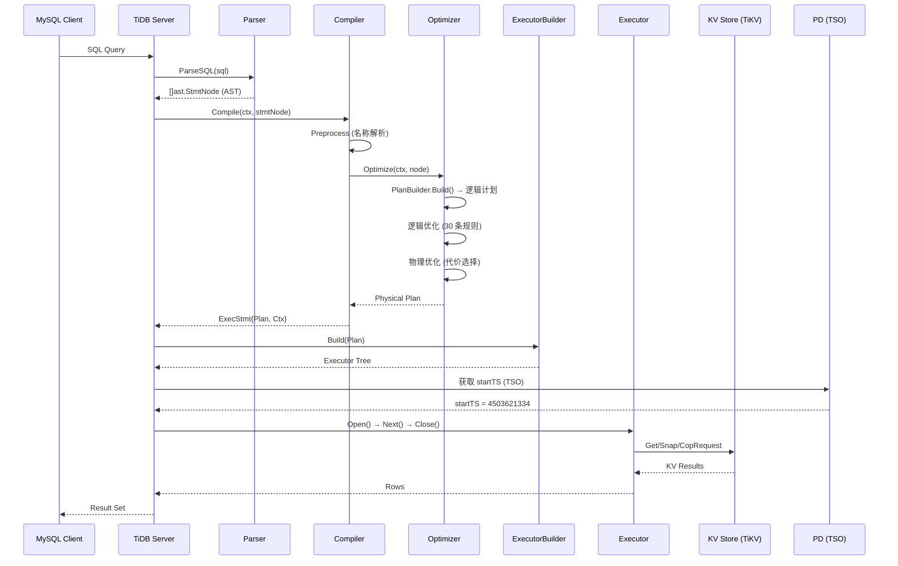
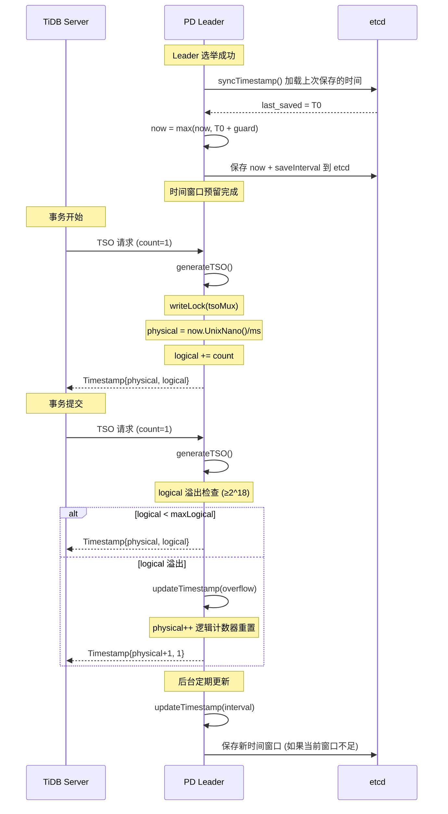
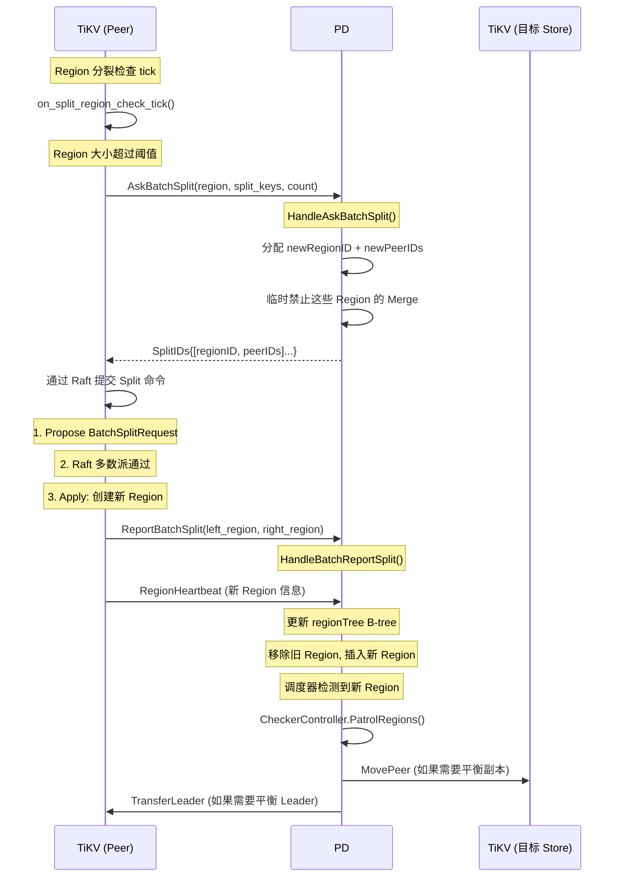
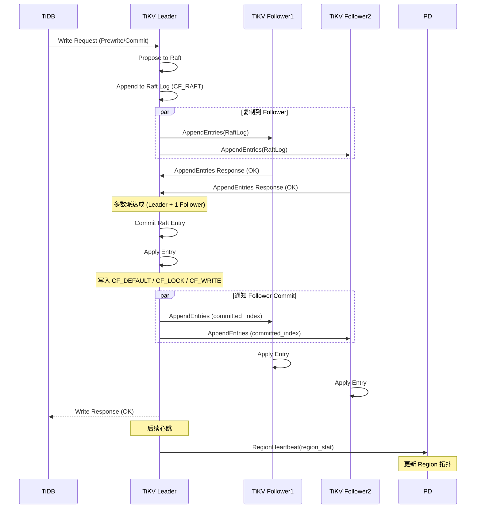
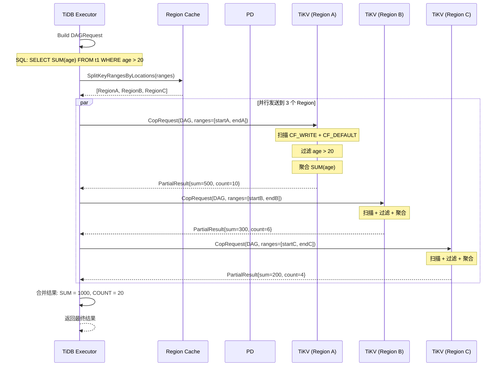
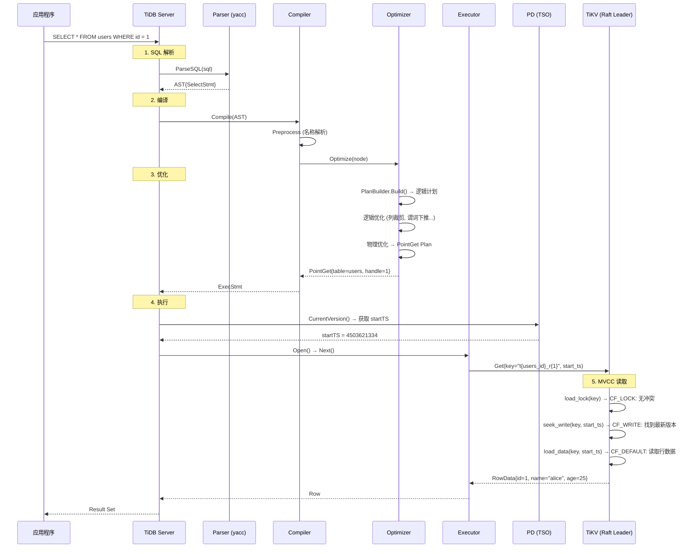
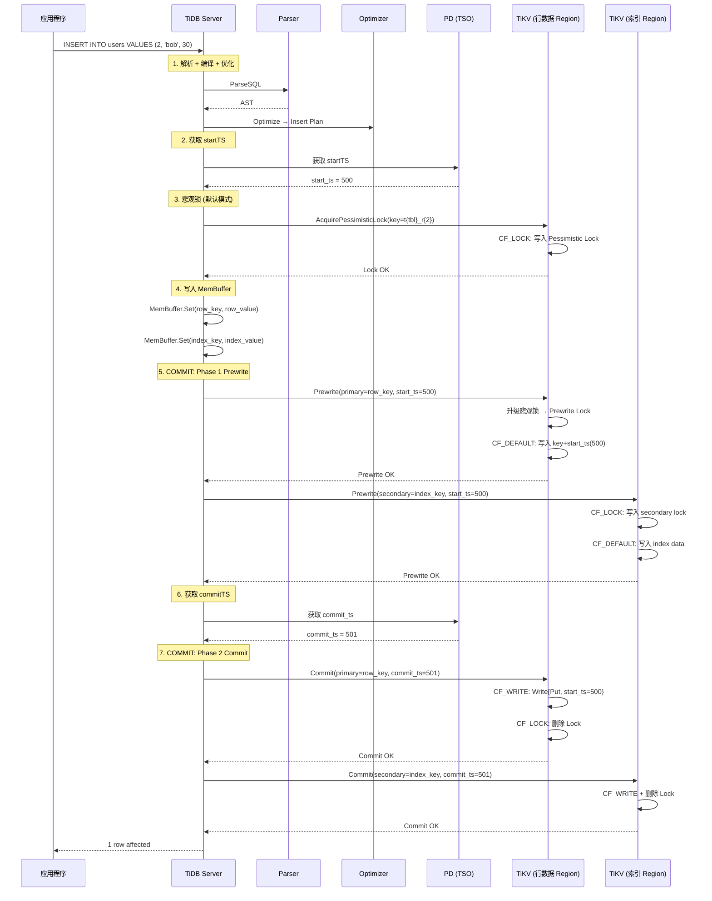

# TiDB 存储模型分析

## 1. 整体架构概览

TiDB 是一个 **计算存储分离** 的分布式数据库，由三个独立组件协作完成：

```
┌─────────────────────────────────────────────────────────────────────────┐
│                       TiDB 集群整体架构                                    │
├─────────────────────────────────────────────────────────────────────────┤
│                                                                          │
│  ┌──────────┐   ┌──────────┐   ┌──────────┐                            │
│  │ TiDB #1  │   │ TiDB #2  │   │ TiDB #3  │  ← SQL 层 (无状态)          │
│  │ (计算层)  │   │ (计算层)  │   │ (计算层)  │                            │
│  └────┬─────┘   └────┬─────┘   └────┬─────┘                            │
│       │              │              │                                    │
│       │    gRPC       │              │                                    │
│       ▼              ▼              ▼                                    │
│  ┌──────────────────────────────────────┐                               │
│  │         PD (调度中心)                  │                               │
│  │  ┌──────────┬──────────┬──────────┐  │                               │
│  │  │   TSO    │  Region  │  元数据   │  │                               │
│  │  │ 时间戳   │  调度    │  管理    │  │                               │
│  │  └──────────┴──────────┴──────────┘  │                               │
│  └──────────────────────────────────────┘                               │
│       │              │              │  Region 心跳 / TSO 请求             │
│       ▼              ▼              ▼                                    │
│  ┌──────────┐   ┌──────────┐   ┌──────────┐                            │
│  │ TiKV #1  │   │ TiKV #2  │   │ TiKV #3  │  ← 存储层 (Raft 复制)     │
│  │ Region A │   │ Region B │   │ Region C │                             │
│  │ Region D │   │ Region A'│   │ Region B'│  (副本分布)                 │
│  └──────────┘   └──────────┘   └──────────┘                            │
│       │              │              │                                    │
│       │    Raft 复制  │              │  (多数派协议)                     │
│       ▼              ▼              ▼                                    │
│  ┌──────────┐   ┌──────────┐   ┌──────────┐                            │
│  │TiFlash #1│   │TiFlash #2│   │TiFlash #3│  ← 列存 (Raft Learner)   │
│  │ 列式存储  │   │ 列式存储  │   │ 列式存储  │  (OLAP 加速)              │
│  └──────────┘   └──────────┘   └──────────┘                            │
│                                                                          │
└─────────────────────────────────────────────────────────────────────────┘
```

**三组件职责：**

| 组件 | 语言 | 职责 | 源码位置 |
|------|------|------|----------|
| **TiDB** | Go | SQL 解析、优化、执行；事务协调 | `tidb-master/pkg/` |
| **TiKV** | Rust | KV 存储、MVCC、Raft 复制 | `tikv-master/src/` |
| **PD** | Go | TSO 时间戳、Region 调度、集群元数据 | `pd-master/server/` |

---

## 2. TiDB SQL 处理管线

### 2.1 全链路概览

```
┌─────────────────────────────────────────────────────────────────────────┐
│                    TiDB SQL 处理全链路                                     │
├─────────────────────────────────────────────────────────────────────────┤
│                                                                          │
│  SQL 文本                                                                │
│      │                                                                   │
│      ▼                                                                   │
│  [1] Parser ─── yacc 语法分析 ──→ AST (抽象语法树)                       │
│      │                     parser/parser.y                               │
│      ▼                                                                   │
│  [2] Preprocess ─── 名称解析、权限校验                                    │
│      │                     planner/core/resolve.go                       │
│      ▼                                                                   │
│  [3] Optimizer ─── 逻辑优化 + 物理优化 ──→ Physical Plan                  │
│      │                     planner/optimize.go:141                       │
│      ▼                                                                   │
│  [4] Executor Builder ─── 构建 Volcano 执行器树                           │
│      │                     executor/adapter.go:321                       │
│      ▼                                                                   │
│  [5] Executor ─── Open/Next/Close 迭代执行                                │
│      │                                                                   │
│      ├── OLTP: PointGet → 直接 KV 读取                                   │
│      ├── OLTP: TableReader → Coprocessor 下推 TiKV                      │
│      └── OLAP: MPP → TiFlash 并行计算                                    │
│                                                                          │
└─────────────────────────────────────────────────────────────────────────┘
```

### 2.2 逻辑优化规则

**代码位置**: `planner/core/optimizer.go:84-116`

```
┌─────────────────────────────────────────────────────────────────────────┐
│                    逻辑优化规则列表 (按执行顺序)                            │
├─────────────────────────────────────────────────────────────────────────┤
│                                                                          │
│  1.  GcSubstituter            ── GC 表达式替换                            │
│  2.  ColumnPruner             ── 列裁剪                                  │
│  3.  ResultReorder            ── 结果重排序                               │
│  4.  BuildKeySolver           ── 唯一键推导                               │
│  5.  DecorrelateSolver        ── 去关联子查询                              │
│  6.  SemiJoinRewriter         ── 半连接重写                               │
│  7.  AggregationEliminator    ── 聚合消除                                 │
│  8.  SkewDistinctAggRewriter  ── 偏斜去重重写                             │
│  9.  ProjectionEliminator     ── 投影消除                                 │
│  10. MaxMinEliminator         ── Max/Min 优化为 TopN                      │
│  11. ConstantPropagationSolver─ 常量传播                                  │
│  12. ConvertOuterToInnerJoin  ── 外连接转内连接                           │
│  13. PPDSolver                ── 谓词下推                                 │
│  14. JoinKeyTypeCastRewriter  ── Join 键类型转换                          │
│  15. OuterJoinEliminator      ── 外连接消除                               │
│  16. PartitionProcessor       ── 分区处理                                 │
│  17. CollectPredicateColumns  ── 谓词列收集                               │
│  18. AggregationPushDown      ── 聚合下推                                 │
│  19. DeriveTopNFromWindow     ── 窗口函数转 TopN                          │
│  20. PredicateSimplification  ── 谓词简化                                 │
│  21. PushDownTopNOptimizer    ── TopN 下推                                │
│  22. OrderAwareJoinReorder    ── 感知排序的 Join 重排                     │
│  23. SyncWaitStatsLoad        ── 同步等待统计信息加载                     │
│  24. JoinReOrderSolver        ── Join 重新排序                            │
│  25. OuterJoinToSemiJoin      ── 外连接转半连接                           │
│  26. CorrelateSolver          ── 关联子查询优化                            │
│  27. ColumnPruner (2nd pass)  ── 二次列裁剪                               │
│  28. PushDownSequenceSolver   ── Sequence 下推                           │
│  29. EliminateUnionAllDual    ── UnionAll 消除                           │
│  30. EmptySelectionEliminator── 空选择消除                                │
│  31. ResolveExpand            ── Expand 算子解析                          │
│                                                                          │
└─────────────────────────────────────────────────────────────────────────┘
```

### 2.3 SQL 处理时序图



---

## 3. 关系模型到 KV 的映射

### 3.1 映射原理

TiDB 将关系表映射为 **Key-Value 对**，每行数据和每个索引各产生独立的 KV 条目。

**代码位置**: `pkg/tablecodec/tablecodec.go`

```
┌─────────────────────────────────────────────────────────────────────────┐
│                    表 → KV 映射架构                                        │
├─────────────────────────────────────────────────────────────────────────┤
│                                                                          │
│  关系表:                                                                 │
│  ┌──────────────────────────────────────────────────────────┐           │
│  │  CREATE TABLE t1 (                                       │           │
│  │    id   BIGINT PRIMARY KEY,     ← 聚簇索引 (IntHandle)   │           │
│  │    name VARCHAR(50),                                       │           │
│  │    age  INT,                                                │           │
│  │    UNIQUE KEY idx_name (name)  ← 唯一索引                │           │
│  │  )                                                         │           │
│  └──────────────────────────────────────────────────────────┘           │
│       │                                                                   │
│       │ 编码映射                                                          │
│       ▼                                                                   │
│  KV 存储:                                                                │
│  ┌──────────────────────────────────────────────────────────────────┐   │
│  │                                                                  │   │
│  │  行数据 (Record Key):                                            │   │
│  │  Key:   t{tableID}_r{rowID}                                      │   │
│  │  Value: [col1_value, col2_value, ...]                           │   │
│  │                                                                  │   │
│  │  唯一索引 (Index Key):                                           │   │
│  │  Key:   t{tableID}_i{indexID}{name_value}                       │   │
│  │  Value: [rowID 或空]                                             │   │
│  │                                                                  │   │
│  │  非唯一索引:                                                      │   │
│  │  Key:   t{tableID}_i{indexID}{name_value}{rowID}               │   │
│  │  Value: [空]                                                     │   │
│  │                                                                  │   │
│  └──────────────────────────────────────────────────────────────────┘   │
│                                                                          │
└─────────────────────────────────────────────────────────────────────────┘
```

### 3.2 Key 编码格式详解

**代码位置**: `pkg/tablecodec/tablecodec.go:49-63`, `pkg/util/codec/number.go:38-42`

#### 行键 (Record Key)

```
格式: t[tableID_encoded]_r[handle_encoded]

字节布局 (IntHandle, 共 19 字节):
┌──────┬────────────────┬──────┬──────┬────────────────┐
│ 't'  │ EncodeInt(     │ '_'  │ 'r'  │ EncodeInt(     │
│ 0x74 │   tableID)     │ 0x5F │ 0x72 │   rowID)       │
│ 1字节│   8 字节       │ 1字节│ 1字节│   8 字节       │
└──────┴────────────────┴──────┴──────┴────────────────┘

EncodeInt: 将 int64 XOR 0x8000000000000000 后大端存储
→ 保证有符号整数在无序字节比较中正确排序 (负数 < 正数)

示例: tableID=1, rowID=10
Key = t\x80\x00\x00\x00\x00\x00\x00\x01_r\x80\x00\x00\x00\x00\x00\x00\x0a
```

#### 索引键 (Index Key)

```
格式: t[tableID_encoded]_i[indexID_encoded][encoded_index_values...][handle_suffix]

字节布局:
┌──────┬────────────────┬──────┬──────┬────────────────┬──────────────────┬───────────────┐
│ 't'  │ EncodeInt(     │ '_'  │ 'i'  │ EncodeInt(     │ EncodeKey(       │ handle 后缀  │
│ 0x74 │   tableID)     │ 0x5F │ 0x69 │   indexID)     │  indexValues...) │ (非唯一索引) │
│ 1字节│   8 字节       │ 1字节│ 1字节│   8 字节       │   变长           │ 变长         │
└──────┴────────────────┴──────┴──────┴────────────────┴──────────────────┴───────────────┘

唯一索引 vs 非唯一索引:
├── 唯一索引: Key 不含 rowID, Value 中存储 rowID
└── 非唯一索引: Key 追加 rowID 作为区分后缀
    ├── IntHandle 后缀: IntHandleFlag(0x03) + EncodeInt(rowID) = 9 字节
    └── CommonHandle 后缀: 直接追加编码后的 handle 字节

代码位置: tablecodec.go:1229 (GenIndexKey)
```

#### 元数据键 (Meta Key)

```
格式: m[EncodeBytes(key)]{HashData_flag}[EncodeBytes(field)]

示例: 表 tableID=42 在数据库 dbID=1 中
Key = m + EncodeBytes("DB:1") + EncodeUint('h') + EncodeBytes("Table:42")

'前缀: 'm' (0x6D) 区分于数据键 ('t')
HashData 标志: 'h' (0x68), 来自 structure/type.go:36

代码位置: tablecodec.go:221 (EncodeMetaKey)
           meta/meta.go:345 (DBkey), :445 (TableKey)
```

### 3.3 KV 编码汇总

```
┌──────────────────┬──────────────────────────────────────────┬─────────────┐
│ 键类型            │ 格式                                      │ 长度         │
├──────────────────┼──────────────────────────────────────────┼─────────────┤
│ 表前缀            │ t + EncodeInt(tableID)                    │ 9 字节       │
│ 行键 (IntHandle)  │ t + EncodeInt(tableID) + _r + EncodeInt  │ 19 字节      │
│ 行键 (Common)     │ t + EncodeInt(tableID) + _r + 变长编码    │ 变长         │
│ 唯一索引键        │ t + tableID + _i + indexID + 列值编码     │ 变长         │
│ 非唯一索引键      │ 同上 + handle 后缀                        │ 变长         │
│ 元数据键          │ m + EncodeBytes(key) + 'h' + field       │ 变长         │
└──────────────────┴──────────────────────────────────────────┴─────────────┘
```

---

## 4. TiKV 存储引擎：RocksDB + MVCC

### 4.1 三列族架构

TiKV 使用 RocksDB 作为底层存储引擎，数据分布在 **3 个列族 (Column Family)** 中：

**代码位置**: `tikv-master/components/engine_traits/src/cf_defs.rs`

```
┌─────────────────────────────────────────────────────────────────────────┐
│                    TiKV RocksDB 三列族架构                                 │
├─────────────────────────────────────────────────────────────────────────┤
│                                                                          │
│  ┌───────────────────────────────────────────────────────────────────┐  │
│  │  CF_DEFAULT (数据列族)                                            │  │
│  │  Key:   z + user_key + start_ts (8字节, 降序)                     │  │
│  │  Value: 完整行数据 (短值 ≤255 字节会内嵌到 CF_WRITE)             │  │
│  │  作用:  存储 MVCC 各版本的实际数据                                 │  │
│  └───────────────────────────────────────────────────────────────────┘  │
│                                                                          │
│  ┌───────────────────────────────────────────────────────────────────┐  │
│  │  CF_LOCK (锁列族)                                                 │  │
│  │  Key:   z + user_key (无时间戳后缀)                               │  │
│  │  Value: Lock 结构体 (primary, ts, ttl, lock_type, ...)          │  │
│  │  作用:  存储事务锁 (悲观锁/预写锁)                                 │  │
│  └───────────────────────────────────────────────────────────────────┘  │
│                                                                          │
│  ┌───────────────────────────────────────────────────────────────────┐  │
│  │  CF_WRITE (写入记录列族)                                          │  │
│  │  Key:   z + user_key + commit_ts (8字节, 降序)                    │  │
│  │  Value: Write 结构体 (write_type, start_ts, short_value?, ...)  │  │
│  │  作用:  记录事务提交/回滚, 实现 MVCC 版本可见性                    │  │
│  └───────────────────────────────────────────────────────────────────┘  │
│                                                                          │
│  ┌───────────────────────────────────────────────────────────────────┐  │
│  │  CF_RAFT (Raft 日志列族)                                          │  │
│  │  Key:   0x01 + 前缀 + region_id + log_index                      │  │
│  │  Value: Raft Log Entry / Raft State / Apply State                 │  │
│  │  作用:  存储 Raft 协议日志和状态                                   │  │
│  └───────────────────────────────────────────────────────────────────┘  │
│                                                                          │
│  注: 所有数据键前缀为 'z' (0x7A, DATA_PREFIX)                           │
│      keys/src/lib.rs:28                                                  │
│      所有 Raft/元数据键前缀为 0x01                                       │
│                                                                          │
└─────────────────────────────────────────────────────────────────────────┘
```

### 4.2 MVCC 数据存储格式

**代码位置**: `tikv-master/components/txn_types/src/types.rs:82-228`, `lock.rs:86-127`, `write.rs:70-163`

```
┌─────────────────────────────────────────────────────────────────────────┐
│                  MVCC 多版本数据存储示例                                    │
├─────────────────────────────────────────────────────────────────────────┤
│                                                                          │
│  事务 T1: start_ts=100, commit_ts=101, 写入 key="t1_r1"                │
│  事务 T2: start_ts=200, commit_ts=201, 写入 key="t1_r1" (更新)         │
│  事务 T3: start_ts=300, 未提交, 持有锁                                 │
│                                                                          │
│  CF_DEFAULT:                                                             │
│  ┌──────────────────────────────────┬────────────────────┐              │
│  │ Key                              │ Value              │              │
│  ├──────────────────────────────────┼────────────────────┤              │
│  │ z+"t1_r1"+start_ts(100) 降序    │ value_v1 (原始数据) │              │
│  │ z+"t1_r1"+start_ts(200) 降序    │ value_v2 (原始数据) │              │
│  └──────────────────────────────────┴────────────────────┘              │
│                                                                          │
│  CF_LOCK:                                                               │
│  ┌──────────────────────────────────┬────────────────────┐              │
│  │ Key                              │ Value              │              │
│  ├──────────────────────────────────┼────────────────────┤              │
│  │ z+"t1_r1"                        │ Lock{              │              │
│  │                                  │   type: Put        │              │
│  │                                  │   primary: "t1_r1" │              │
│  │                                  │   ts: 300          │              │
│  │                                  │   ttl: 3000ms      │              │
│  │                                  │   ...              │              │
│  │                                  │ }                  │              │
│  └──────────────────────────────────┴────────────────────┘              │
│                                                                          │
│  CF_WRITE:                                                               │
│  ┌──────────────────────────────────┬────────────────────┐              │
│  │ Key                              │ Value              │              │
│  ├──────────────────────────────────┼────────────────────┤              │
│  │ z+"t1_r1"+commit_ts(201) 降序   │ Write{             │              │
│  │                                  │   type: Put        │              │
│  │                                  │   start_ts: 200    │              │
│  │                                  │   short_value: nil │              │
│  │                                  │ }                  │              │
│  ├──────────────────────────────────┼────────────────────┤              │
│  │ z+"t1_r1"+commit_ts(101) 降序   │ Write{             │              │
│  │                                  │   type: Put        │              │
│  │                                  │   start_ts: 100    │              │
│  │                                  │   short_value: nil │              │
│  │                                  │ }                  │              │
│  └──────────────────────────────────┴────────────────────┘              │
│                                                                          │
│  读取 ts=150 的数据:                                                     │
│  1. 查 CF_LOCK: 无锁 (T3 的锁 ts=300 > 150, 不阻塞)                     │
│  2. 查 CF_WRITE: seek(key, 150) → 找到 commit_ts=101 的 Write          │
│  3. 读 CF_DEFAULT: get(key, start_ts=100) → value_v1                   │
│  4. 返回 value_v1                                                       │
│                                                                          │
│  注: commit_ts 降序排列, seek 时第一个 ≤ ts 的记录即为可见版本          │
│      短值 (≤255 字节) 直接内嵌到 CF_WRITE 的 short_value 字段           │
│      此时 CF_DEFAULT 中无对应条目                                        │
│                                                                          │
└─────────────────────────────────────────────────────────────────────────┘
```

### 4.3 MVCC 读取时序图

```mermaid
sequenceDiagram
    participant Client as TiDB (Client)
    participant TiKV as TiKV Server
    participant MvccR as MvccReader
    participant CF_L as CF_LOCK
    participant CF_W as CF_WRITE
    participant CF_D as CF_DEFAULT

    Client->>TiKV: Get(key, start_ts=150)
    TiKV->>MvccR: get(key, ts=150)

    Step1: 检查锁
    MvccR->>CF_L: load_lock(key)
    CF_L-->>MvccR: nil (无冲突锁)

    Step2: 查找可见版本
    MvccR->>CF_W: seek_write(key, ts=150)
    Note over CF_W: 按commit_ts降序扫描
    CF_W-->>MvccR: Write{type=Put, start_ts=100, commit_ts=101}

    Step3: 加载数据
    alt short_value 存在
        MvccR-->>MvccR: 直接返回 short_value
    else short_value 为 nil
        MvccR->>CF_D: get_value(key, start_ts=100)
        CF_D-->>MvccR: value_v1 (原始数据)
    end

    MvccR-->>TiKV: value_v1
    TiKV-->>Client: value_v1
```

---

## 5. 事务模型：2PC + MVCC

### 5.1 两种事务模式

```
┌─────────────────────────────────────────────────────────────────────────┐
│                    TiDB 事务模式对比                                       │
├──────────────────────┬──────────────────────┬────────────────────────────┤
│ 特性                  │ 乐观事务              │ 悲观事务 (默认)            │
├──────────────────────┼──────────────────────┼────────────────────────────┤
│ 加锁时机              │ Prewrite 阶段         │ 执行 DML 时立即加锁        │
│ 冲突检测              │ Prewrite 时检测       │ 执行时检测                 │
│ 冲突处理              │ Prewrite 失败重试     │ 等待锁 / 锁等待超时       │
│ 适用场景              │ 低冲突 (批量导入)     │ 高冲突 (OLTP 在线业务)    │
│ 隔离级别              │ SI (快照隔离)         │ SI / RC (读已提交)        │
│ 性能特点              │ 写入快, 冲突代价高    │ 写入慢, 冲突代价低         │
│ 代码位置              │ kv/option.go:41      │ session/txn.go:624        │
└──────────────────────┴──────────────────────┴────────────────────────────┘
```

### 5.2 两阶段提交 (2PC) 流程

**代码位置**: `tikv-master/src/storage/txn/commands/prewrite.rs`, `commit.rs`

```
┌─────────────────────────────────────────────────────────────────────────┐
│                    两阶段提交 (2PC) 流程                                   │
├─────────────────────────────────────────────────────────────────────────┤
│                                                                          │
│  Phase 1: Prewrite (预写)                                                │
│  ┌───────────────────────────────────────────────────────────────────┐  │
│  │  1. 选 primary key (第一个写入的 key)                             │  │
│  │  2. 对所有 key 写入 CF_LOCK:                                      │  │
│  │     ├── primary key 写入 primary lock                             │  │
│  │     └── secondary keys 写入 secondary lock (指向 primary)         │  │
│  │  3. 数据写入 CF_DEFAULT (key + start_ts)                          │  │
│  │  4. 检测冲突: 已有锁 or 写冲突 → 返回错误                         │  │
│  └───────────────────────────────────────────────────────────────────┘  │
│                                                                          │
│  Phase 2: Commit (提交)                                                  │
│  ┌───────────────────────────────────────────────────────────────────┐  │
│  │  1. 从 PD 获取 commit_ts (必须 > start_ts)                        │  │
│  │  2. 先提交 primary key:                                            │  │
│  │     ├── CF_WRITE: 写入 Write{type, start_ts, commit_ts}          │  │
│  │     └── CF_LOCK: 删除 primary lock                                │  │
│  │  3. 异步提交 secondary keys:                                      │  │
│  │     ├── 普通模式: 逐个提交                                        │  │
│  │     ├── Async Commit: secondary 列表记录在 primary lock 中        │  │
│  │     └── 1PC: 所有 key 在同一 region 时跳过 Phase 2               │  │
│  └───────────────────────────────────────────────────────────────────┘  │
│                                                                          │
└─────────────────────────────────────────────────────────────────────────┘
```

### 5.3 悲观事务写入时序图

```mermaid
sequenceDiagram
    participant Client as TiDB Client
    participant PD as PD (TSO)
    participant TiKV1 as TiKV (Region A)
    participant TiKV2 as TiKV (Region B)

    Note over Client: BEGIN (悲观模式)

    Client->>PD: 获取 start_ts
    PD-->>Client: start_ts = 100

    Note over Client: UPDATE t1 SET age=30 WHERE id=1

    Client->>TiKV1: AcquirePessimisticLock(id=1, for_update_ts=100)
    Note over TiKV1: 检查锁 → 写入 CF_LOCK
    TiKV1-->>Client: Lock OK

    Note over Client: 写入 MemBuffer

    Note over Client: COMMIT

    subgraph Phase 1: Prewrite
        Client->>TiKV1: Prewrite(primary=id=1, start_ts=100)
        Note over TiKV1: 升级悲观锁为预写锁
        Note over TiKV1: CF_DEFAULT: 写入 key+start_ts(100)
        Note over TiKV1: CF_LOCK: 更新 Lock{type=Put}
        TiKV1-->>Client: Prewrite OK (primary)

        Client->>TiKV2: Prewrite(secondary=idx_name, start_ts=100)
        Note over TiKV2: CF_DEFAULT: 写入 index data
        Note over TiKV2: CF_LOCK: 写入 secondary lock
        TiKV2-->>Client: Prewrite OK (secondary)
    end

    Client->>PD: 获取 commit_ts
    PD-->>Client: commit_ts = 101

    subgraph Phase 2: Commit
        Client->>TiKV1: Commit(primary=id=1, commit_ts=101)
        Note over TiKV1: CF_WRITE: Write{Put, start_ts=100}
        Note over TiKV1: CF_LOCK: 删除 primary lock
        TiKV1-->>Client: Commit OK (primary)

        Note over Client: 异步提交 secondary
        Client->>TiKV2: Commit(secondary=idx_name, commit_ts=101)
        Note over TiKV2: CF_WRITE: Write{Put, start_ts=100}
        Note over TiKV2: CF_LOCK: 删除 secondary lock
        TiKV2-->>Client: Commit OK
    end
```

### 5.4 乐观事务写入时序图

```mermaid
sequenceDiagram
    participant Client as TiDB Client
    participant PD as PD (TSO)
    participant TiKV1 as TiKV (Region A)
    participant TiKV2 as TiKV (Region B)

    Note over Client: BEGIN (乐观模式)

    Client->>PD: 获取 start_ts
    PD-->>Client: start_ts = 100

    Note over Client: INSERT INTO t1 VALUES (1, 'alice', 25)
    Note over Client: 写入本地 MemBuffer (无远程交互)

    Note over Client: COMMIT

    subgraph Phase 1: Prewrite
        Client->>TiKV1: Prewrite(primary=id=1, start_ts=100)
        Note over TiKV1: 检查 CF_LOCK: 无冲突?
        Note over TiKV1: 检查 CF_WRITE: 无写冲突?
        Note over TiKV1: CF_DEFAULT: 写入 value
        Note over TiKV1: CF_LOCK: 写入 Lock{type=Put, primary=id=1}
        TiKV1-->>Client: Prewrite OK

        Client->>TiKV2: Prewrite(secondary keys)
        Note over TiKV2: 同样检查 + 写入
        TiKV2-->>Client: Prewrite OK

        alt 冲突发生
            TiKV1-->>Client: WriteConflict Error
            Note over Client: 回滚 + 重试整个事务
        end
    end

    Client->>PD: 获取 commit_ts
    PD-->>Client: commit_ts = 101

    subgraph Phase 2: Commit
        Client->>TiKV1: Commit(primary, commit_ts=101)
        Note over TiKV1: CF_WRITE + 删除 Lock
        TiKV1-->>Client: OK

        Client->>TiKV2: Commit(secondary, commit_ts=101)
        TiKV2-->>Client: OK
    end
```

### 5.5 提交优化：Async Commit 与 1PC

```
┌─────────────────────────────────────────────────────────────────────────┐
│                    提交优化机制                                            │
├─────────────────────────────────────────────────────────────────────────┤
│                                                                          │
│  标准 2PC:                                                               │
│  ├── Prewrite 所有 keys → 获取 commit_ts → 提交 primary → 提交 rest    │
│  ├── 延迟: 2 次 PD TSO + 2 轮 RPC                                      │
│  └── 代码: kv/option.go:41,59,61                                        │
│                                                                          │
│  Async Commit (异步提交):                                                │
│  ├── Prewrite 时在 primary lock 中记录 secondary_keys 列表              │
│  ├── 获取 commit_ts 后只需提交 primary                                  │
│  ├── Secondary keys 由 TiKV 后台自行提交                                │
│  ├── 延迟: 2 次 PD TSO + 1 轮 primary RPC                              │
│  └── 代码: prewrite.rs (secondary_keys 字段)                            │
│                                                                          │
│  1PC (一阶段提交):                                                       │
│  ├── 当所有 keys 在同一个 Region 时                                     │
│  ├── Prewrite 阶段直接提交, 跳过 Phase 2                                │
│  ├── try_one_pc = true                                                   │
│  ├── 延迟: 1 次 PD TSO + 1 轮 RPC                                      │
│  └── 代码: prewrite.rs:53 (try_one_pc)                                  │
│                                                                          │
│  性能对比:                                                               │
│  ┌──────────────┬───────────────────┬───────────────────┐                │
│  │ 模式          │ 提交延迟           │ PD TSO 次数       │                │
│  ├──────────────┼───────────────────┼───────────────────┤                │
│  │ 标准 2PC     │ 2 RTT + 2 TSO     │ 2 次              │                │
│  │ Async Commit │ 1 RTT + 2 TSO     │ 2 次              │                │
│  │ 1PC          │ 1 RTT + 1 TSO     │ 1 次              │                │
│  └──────────────┴───────────────────┴───────────────────┘                │
│                                                                          │
└─────────────────────────────────────────────────────────────────────────┘
```

---

## 6. PD：全局调度中心

### 6.1 PD 核心功能

```
┌─────────────────────────────────────────────────────────────────────────┐
│                    PD 核心功能架构                                         │
├─────────────────────────────────────────────────────────────────────────┤
│                                                                          │
│  ┌───────────────────────────────────────────────────────────────────┐  │
│  │  TSO (Timestamp Oracle)                                           │  │
│  │  ├── 全局单调递增时间戳                                            │  │
│  │  ├── 物理: 毫秒级系统时钟                                          │  │
│  │  ├── 逻辑: 同毫秒内递增计数器 (最大 2^18 = 262144)                │  │
│  │  ├── 窗口式持久化: etcd 中保存时间窗口, 避免每次请求写 etcd       │  │
│  │  └── 代码: pkg/tso/tso.go:428 (getTS), :340 (updateTimestamp)   │  │
│  └───────────────────────────────────────────────────────────────────┘  │
│                                                                          │
│  ┌───────────────────────────────────────────────────────────────────┐  │
│  │  Region 调度                                                      │  │
│  │  ├── Checker (响应式): 巡检 Region → 发现问题 → 生成 Operator     │  │
│  │  │   ├── ReplicaChecker: 补副本                                   │  │
│  │  │   ├── RuleChecker: 满足放置规则                                 │  │
│  │  │   ├── SplitChecker: 按 Label 分裂                              │  │
│  │  │   └── MergeChecker: 合并小 Region                              │  │
│  │  ├── Scheduler (主动式): 定期平衡                                  │  │
│  │  │   ├── balance_region: 平衡 Region 数量                         │  │
│  │  │   ├── balance_leader: 平衡 Leader 分布                         │  │
│  │  │   └── hot_region: 热点调度                                     │  │
│  │  └── 代码: pkg/schedule/coordinator.go:62                         │  │
│  └───────────────────────────────────────────────────────────────────┘  │
│                                                                          │
│  ┌───────────────────────────────────────────────────────────────────┐  │
│  │  Region 拓扑管理                                                  │  │
│  │  ├── regionTree: B-tree (度=64), 按 start_key 有序               │  │
│  │  ├── regions: map[regionID]*RegionInfo                           │  │
│  │  ├── leaders/followers/learners: 按 store 分组的 B-tree          │  │
│  │  └── 代码: pkg/core/region.go:1049 (RegionsInfo)                │  │
│  └───────────────────────────────────────────────────────────────────┘  │
│                                                                          │
└─────────────────────────────────────────────────────────────────────────┘
```

### 6.2 TSO 时间戳分配时序图



### 6.3 Region 分裂时序图



---

## 7. Region：数据分片与 Raft 复制

### 7.1 Region 数据分片

```
┌─────────────────────────────────────────────────────────────────────────┐
│                    Region 数据分片模型                                     │
├─────────────────────────────────────────────────────────────────────────┤
│                                                                          │
│  全局 Key 空间:                                                          │
│  ┌──────────────────────────────────────────────────────────────────┐  │
│  │ t[table1]... │ t[table2]... │ t[table3]... │ m[meta]...        │  │
│  └──────────────────────────────────────────────────────────────────┘  │
│                                                                          │
│  按 Key Range 切分为 Region:                                             │
│  ┌────────────────┬────────────────┬────────────────┬──────────────┐   │
│  │   Region 1     │   Region 2     │   Region 3     │   Region 4  │   │
│  │ [start, keyA)  │ [keyA, keyB)  │ [keyB, keyC)  │ [keyC, end)  │   │
│  │ 3 副本 (Raft)  │ 3 副本 (Raft)  │ 3 副本 (Raft)  │ 3 副本      │   │
│  └────────────────┴────────────────┴────────────────┴──────────────┘   │
│                                                                          │
│  每个 Region 的 Raft 组:                                                 │
│  ┌───────────────────────────────────────────────────────────────────┐  │
│  │                     Region 1 Raft Group                            │  │
│  │                                                                    │  │
│  │   ┌──────────┐   ┌──────────┐   ┌──────────┐                     │  │
│  │   │ Store 1  │   │ Store 2  │   │ Store 3  │                     │  │
│  │   │ Leader   │←──│ Follower │←──│ Follower │                     │  │
│  │   │ 读写     │Raft│ 只读    │Raft│ 只读    │                     │  │
│  │   └──────────┘   └──────────┘   └──────────┘                     │  │
│  │                                                                    │  │
│  │   RegionEpoch: {version: V, conf_ver: C}                         │  │
│  │   version: Split/Merge 时递增                                     │  │
│  │   conf_ver: 成员变更时递增                                         │  │
│  │   代码: raftstore/store/util.rs:187                               │  │
│  └───────────────────────────────────────────────────────────────────┘  │
│                                                                          │
│  默认 Region 大小: 96 MiB (可配置)                                       │
│  分裂触发: Region 大小 / key 数量 超过阈值                               │
│  合并触发: 两个相邻小 Region (默认 < 20 MiB)                             │
│                                                                          │
└─────────────────────────────────────────────────────────────────────────┘
```

### 7.2 Raft 写入时序图



---

## 8. Coprocessor：计算下推

### 8.1 计算下推架构

```
┌─────────────────────────────────────────────────────────────────────────┐
│                    Coprocessor 计算下推模型                                 │
├─────────────────────────────────────────────────────────────────────────┤
│                                                                          │
│  传统方式 (拉取数据):                                                    │
│  TiDB ←──── KV 数据流 ────← TiKV                                       │
│  └── 在 TiDB 端做过滤/聚合 (网络开销大)                                  │
│                                                                          │
│  计算下推 (推送计算):                                                     │
│  TiDB ──→ 发送 DAG 执行计划 ──→ TiKV                                    │
│  └── TiKV 本地执行扫描+过滤+聚合, 只返回结果                            │
│                                                                          │
│  ┌───────────────────────────────────────────────────────────────────┐  │
│  │  TiDB 侧 (distsql/request_builder.go:47)                        │  │
│  │  ├── 构建 DAGRequest (tipb.DAGRequest protobuf)                  │  │
│  │  ├── 设置 TableRanges / IndexRanges                               │  │
│  │  └── 按 Region 边界切分 → 多个 CopTask                           │  │
│  └───────────────────────────────────────────────────────────────────┘  │
│       │                                                                  │
│       │ 按 Region 并行发送                                                │
│       ▼                                                                  │
│  ┌───────────────────────────────────────────────────────────────────┐  │
│  │  TiKV 侧 (coprocessor/endpoint.rs:70)                           │  │
│  │  ├── 解析 DAGRequest                                              │  │
│  │  ├── 检查内存锁 (concurrency_manager)                             │  │
│  │  ├── 在 read_pool 中执行                                          │  │
│  │  └── 扫描 CF + 过滤 + 聚合 → 返回结果                             │  │
│  └───────────────────────────────────────────────────────────────────┘  │
│                                                                          │
│  MPP 模式 (TiFlash 列存):                                                │
│  ├── 构建 MPP Task Graph (DAG → Exchange → 多个 TiFlash 节点)          │
│  ├── TiFlash 本地列存扫描 + 向量化执行                                  │
│  └── 通过 Exchange 算子 Shuffle 数据                                    │
│                                                                          │
└─────────────────────────────────────────────────────────────────────────┘
```

### 8.2 Coprocessor 请求时序图



---

## 9. TiFlash：列存引擎

### 9.1 TiFlash 架构

```
┌─────────────────────────────────────────────────────────────────────────┐
│                    TiFlash 列存架构                                        │
├─────────────────────────────────────────────────────────────────────────┤
│                                                                          │
│  TiFlash 作为 Raft Learner 加入集群:                                     │
│  ┌───────────────────────────────────────────────────────────────────┐  │
│  │                     Raft Group                                    │  │
│  │   ┌──────────┐   ┌──────────┐   ┌──────────┐  ┌──────────┐     │  │
│  │   │ TiKV Ldr │   │ TiKV Flw │   │ TiKV Flw │  │ TiFlash  │     │  │
│  │   │ Voter    │   │ Voter    │   │ Voter    │  │ Learner  │     │  │
│  │   └──────────┘   └──────────┘   └──────────┘  └──────────┘     │  │
│  │        │              │              │              │             │  │
│  │        └──── Raft 复制 ───────────────┘──── 异步复制 ──┘           │  │
│  │   (多数派不包含 Learner, 不影响写入性能)                             │  │
│  └───────────────────────────────────────────────────────────────────┘  │
│                                                                          │
│  TiFlash 内部存储:                                                       │
│  ┌───────────────────────────────────────────────────────────────────┐  │
│  │                                                                    │  │
│  │  Delta 层 (增量)             Stable 层 (稳定)                      │  │
│  │  ├── 最近写入的数据           ├── 已合并的列存数据                 │  │
│  │  ├── 行存格式 (高效写入)      ├── 列存格式 (高效读取)              │  │
│  │  └── 定期合并到 Stable       └── 按 Pack (列块) 组织              │  │
│  │                                                                    │  │
│  │  读取时: Delta + Stable → 合并可见版本 → 返回结果                 │  │
│  │                                                                    │  │
│  └───────────────────────────────────────────────────────────────────┘  │
│                                                                          │
│  TiDB 自动选择存储引擎:                                                  │
│  ├── OLTP 查询 → TiKV (行存, 点查快)                                   │
│  ├── OLAP 查询 → TiFlash (列存, 扫描+聚合快)                           │
│  └── MPP 模式 → 多 TiFlash 节点并行计算                                │
│                                                                          │
│  注: TiFlash 源码不在本仓库中, 以上为架构概述                            │
│  TiKV 侧兼容代码:                                                       │
│  ├── raftstore/store/fsm/peer.rs:3298 (Learner 兼容)                   │
│  ├── raftstore/store/snap.rs:1696 (快照兼容)                           │
│  └── resolved_ts/advance.rs:370 (CheckLeader 降级)                     │
│                                                                          │
└─────────────────────────────────────────────────────────────────────────┘
```

---

## 10. 一条 SELECT 的完整旅程

### 10.1 全链路时序图



---

## 11. 一条 INSERT 的完整旅程

### 11.1 全链路时序图



---

## 12. 关键接口与代码索引

### 12.1 TiDB 核心接口

```
┌─────────────────────────────────────────────────────────────────────────┐
│                    TiDB 核心接口索引                                        │
├──────────────────┬──────────────────────────────────────┬───────────────┤
│ 接口/结构体       │ 文件位置                               │ 行号          │
├──────────────────┼──────────────────────────────────────┼───────────────┤
│ kv.Storage       │ pkg/kv/kv.go                         │ 760-804       │
│ kv.Transaction   │ pkg/kv/kv.go                         │ 261-340       │
│ kv.Snapshot      │ pkg/kv/kv.go                         │ 708-716       │
│ kv.MemBuffer     │ pkg/kv/kv.go                         │ 189           │
│ kv.Client        │ pkg/kv/kv.go                         │ 351-358       │
│ LazyTxn          │ pkg/session/txn.go                   │ 45-77         │
│ tikvStore        │ pkg/store/driver/tikv_driver.go       │ 267-280       │
│ tikvTxn          │ pkg/store/driver/txn/txn_driver.go   │ 47-71         │
│ tikvSnapshot     │ pkg/store/driver/txn/snapshot.go     │ 33-153        │
│ ExecStmt         │ pkg/executor/adapter.go              │ 321-355       │
│ Compiler         │ pkg/executor/compiler.go              │ 50            │
│ Domain           │ pkg/domain/domain.go                 │ 147-224       │
│ CopClient        │ pkg/store/copr/coprocessor.go        │ 86-120        │
└──────────────────┴──────────────────────────────────────┴───────────────┘
```

### 12.2 TiKV 核心结构

```
┌──────────────────┬──────────────────────────────────────┬───────────────┐
│ 结构体            │ 文件位置                               │ 行号          │
├──────────────────┼──────────────────────────────────────┼───────────────┤
│ Lock             │ components/txn_types/src/lock.rs      │ 86-127        │
│ Write            │ components/txn_types/src/write.rs      │ 70-163        │
│ MvccTxn          │ src/storage/mvcc/txn.rs              │ 60-83         │
│ MvccReader       │ src/storage/mvcc/reader/reader.rs     │ 126-256       │
│ Prewrite Cmd     │ src/storage/txn/commands/prewrite.rs  │ 46-109        │
│ Commit Cmd       │ src/storage/txn/commands/commit.rs     │ 21-98        │
│ AcquirePessimisticLock │ src/storage/txn/commands/  │ 25-100        │
│ Coprocessor Endpoint │ src/coprocessor/endpoint.rs      │ 70-199        │
│ HeartbeatTask    │ components/raftstore/store/worker/pd.rs│ 128-140      │
│ RegionLocalState │ components/raftstore/store/region_meta│ 243-251      │
└──────────────────┴──────────────────────────────────────┴───────────────┘
```

### 12.3 PD 核心结构

```
┌──────────────────┬──────────────────────────────────────┬───────────────┐
│ 结构体/接口       │ 文件位置                               │ 行号          │
├──────────────────┼──────────────────────────────────────┼───────────────┤
│ timestampOracle  │ pkg/tso/tso.go                       │ 62-77         │
│ Coordinator      │ pkg/schedule/coordinator.go           │ 62-81         │
│ RegionsInfo      │ pkg/core/region.go                   │ 1049-1062     │
│ regionTree       │ pkg/core/region_tree.go              │ 62-72         │
│ GrpcServer       │ server/grpc_service.go               │ ~78           │
│ RaftCluster      │ server/cluster/cluster.go            │ ~82           │
│ HandleAskSplit   │ server/cluster/cluster_worker.go      │ 78-120        │
│ HandleBatchSplit │ server/cluster/cluster_worker.go      │ 123-195       │
└──────────────────┴──────────────────────────────────────┴───────────────┘
```

---

## 13. 总结

```
┌─────────────────────────────────────────────────────────────────────────┐
│                    TiDB 存储模型核心要点                                    │
├─────────────────────────────────────────────────────────────────────────┤
│                                                                          │
│  1. 计算存储分离                                                         │
│     ├── TiDB: 无状态 SQL 层, 可水平扩展                                  │
│     ├── TiKV: 有状态存储层, Raft 复制保证一致性                           │
│     └── PD: 全局协调器, TSO + 调度 + 元数据                              │
│                                                                          │
│  2. 关系模型 → KV 映射                                                    │
│     ├── 行数据: t{tableID}_r{rowID} → value                              │
│     ├── 唯一索引: t{tableID}_i{idxID}{values} → rowID                    │
│     ├── 非唯一索引: t{tableID}_i{idxID}{values}{rowID} → nil             │
│     └── 元数据: m{key}{HashData}{field} → meta_value                     │
│                                                                          │
│  3. MVCC 三列族                                                          │
│     ├── CF_DEFAULT: key+start_ts → 实际数据值                            │
│     ├── CF_LOCK: key → 事务锁 (primary, ttl, type)                      │
│     └── CF_WRITE: key+commit_ts → 提交记录 (type, start_ts)             │
│                                                                          │
│  4. 事务模型                                                             │
│     ├── 默认悲观事务: DML 时加锁, 2PC 提交                               │
│     ├── 乐观事务: Prewrite 时检测冲突                                     │
│     ├── Async Commit: 减少 1 RTT                                         │
│     └── 1PC: 同 Region 事务跳过 Phase 2                                  │
│                                                                          │
│  5. 计算下推                                                             │
│     ├── Coprocessor: 过滤/聚合下推到 TiKV                                │
│     ├── MPP: 大规模并行计算到 TiFlash                                    │
│     └── 行存 (TiKV) + 列存 (TiFlash) 混合部署                           │
│                                                                          │
│  6. Region 分片 + Raft 复制                                              │
│     ├── Region 按 Key Range 分片, 默认 96 MiB                           │
│     ├── 每个 Region 一个 Raft 组, 3 副本 (默认)                          │
│     ├── PD 调度: 平衡 Region/Leader/热点                                 │
│     └── 自动分裂/合并, 弹性扩缩容                                       │
│                                                                          │
└─────────────────────────────────────────────────────────────────────────┘
```

---
