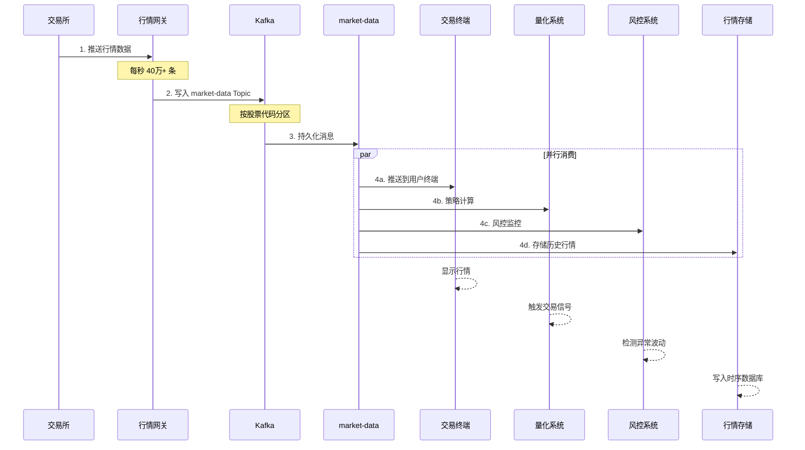
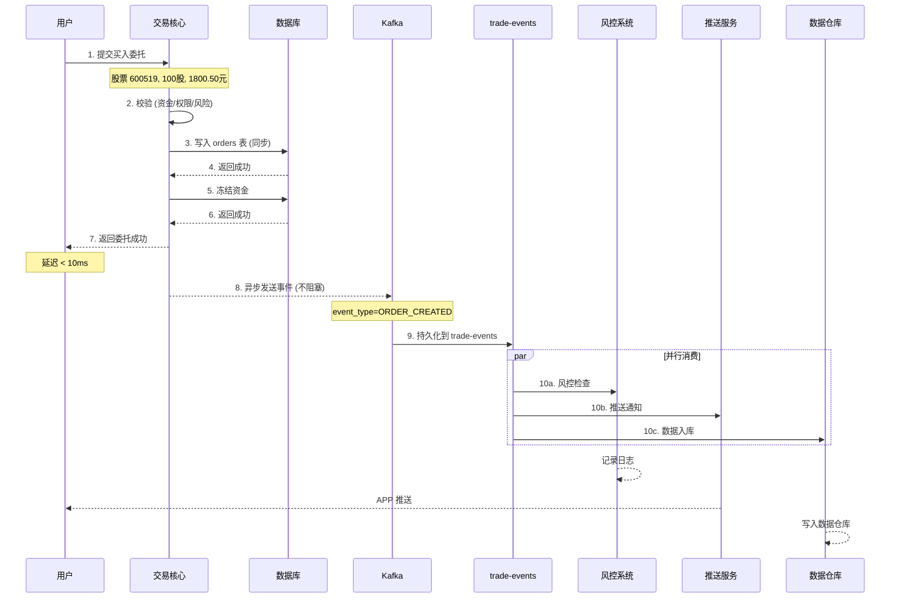
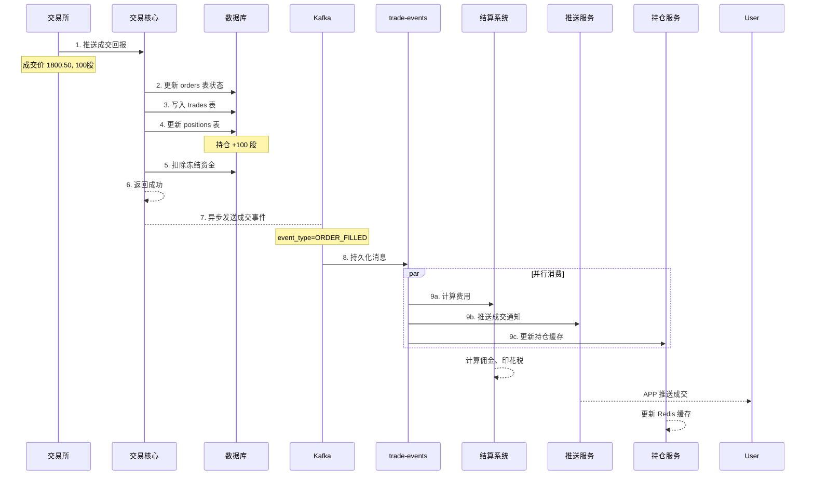
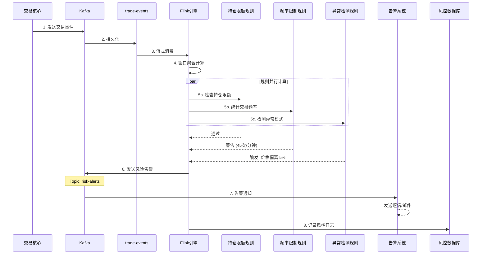
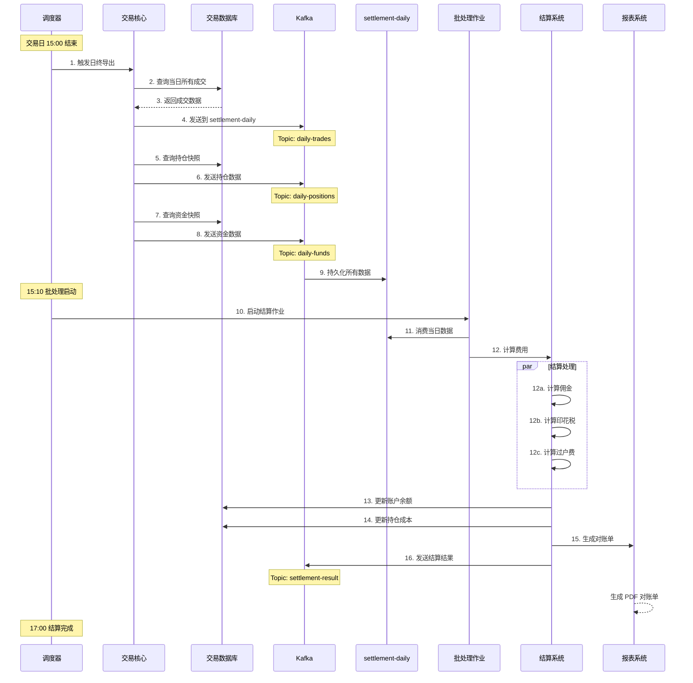
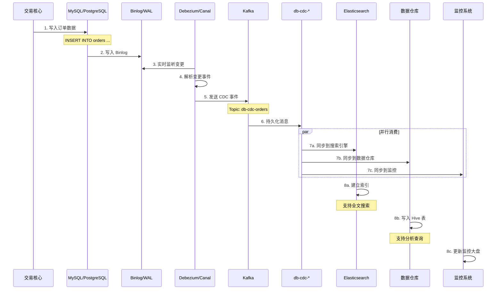
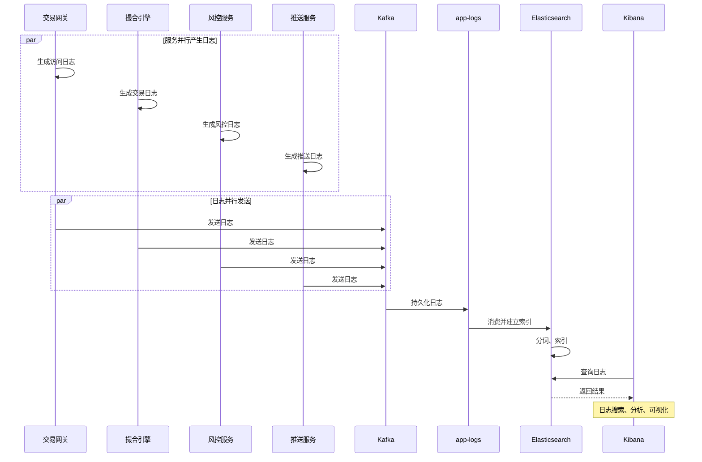
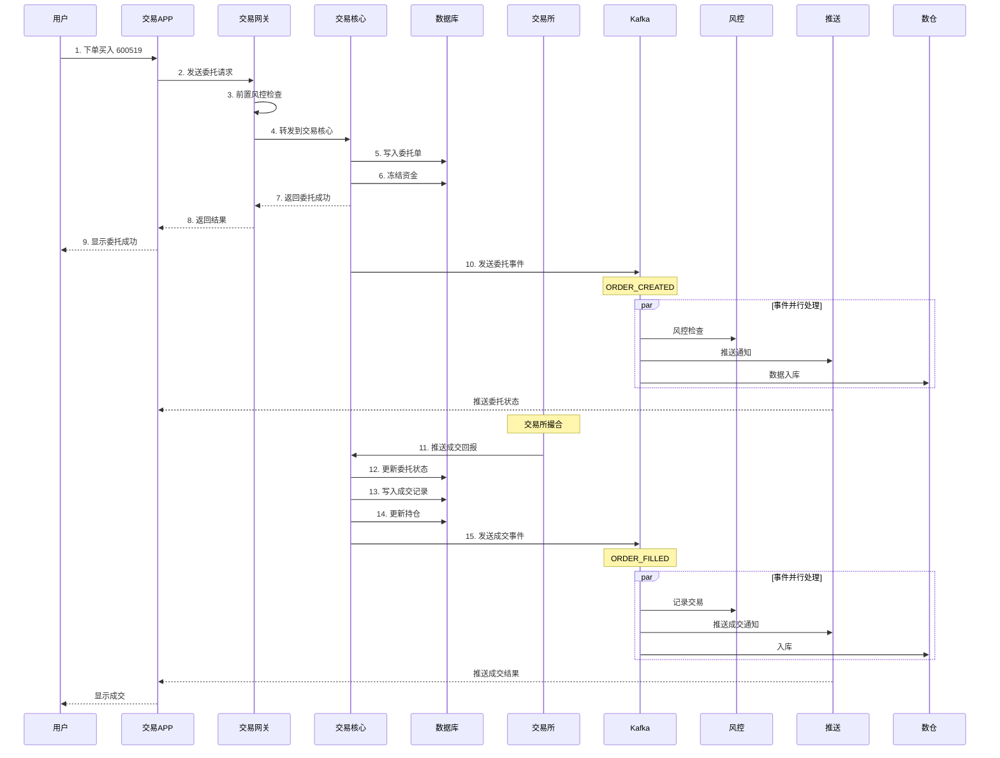

# Kafka 在证券交易系统中的应用

## 1. 概述

Kafka 作为**分布式消息队列**，在证券交易系统中承担**异步解耦、数据分发、日志收集**等关键职责。

```
┌─────────────────────────────────────────────────────────────────────────┐
│                    Kafka 在交易系统中的定位                               │
├─────────────────────────────────────────────────────────────────────────┤
│                                                                          │
│   [交易核心]          [Kafka]              [下游系统]                    │
│   单机数据库    ◀──▶  异步解耦    ◀──▶    行情、风控、结算              │
│   低延迟              高吞吐              批量处理                       │
│   强一致              最终一致            容错恢复                       │
│                                                                          │
└─────────────────────────────────────────────────────────────────────────┘
```

**本文档包含以下时序图：**

| 时序图 | 说明 |
|--------|------|
| 行情分发时序图 | 交易所行情如何通过 Kafka 分发给多个消费者 |
| 委托下单时序图 | 用户下单到事件异步处理的完整流程 |
| 成交事件时序图 | 成交回报处理和下游通知流程 |
| 风控监控时序图 | Flink 实时风控计算流程 |
| 日终结算时序图 | T+1 结算批处理流程 |
| CDC 数据同步时序图 | 数据库变更实时同步流程 |
| 日志收集时序图 | 分布式日志收集流程 |
| 完整端到端流程 | 一笔交易从下单到成交的完整消息流转 |

---

### 2.1 行情数据分发

```
┌─────────────────────────────────────────────────────────────────────────┐
│                        行情数据分发架构                                   │
├─────────────────────────────────────────────────────────────────────────┤
│                                                                          │
│  交易所行情                                                              │
│      │                                                                   │
│      ▼                                                                   │
│  ┌─────────┐      ┌─────────────────────────────────────────────┐      │
│  │行情网关  │────▶│         Kafka: market-data                   │      │
│  └─────────┘      │         Topic: 4000+ 分区                    │      │
│                   └─────────────────────────────────────────────┘      │
│                              │                                          │
│              ┌───────────────┼───────────────┬──────────────┐          │
│              ▼               ▼               ▼              ▼          │
│         ┌─────────┐    ┌─────────┐    ┌─────────┐    ┌─────────┐      │
│         │交易终端  │    │量化系统  │    │风控系统  │    │行情存储  │      │
│         │(实时推送)│    │(策略计算)│    │(监控预警)│    │(历史查询)│      │
│         └─────────┘    └─────────┘    └─────────┘    └─────────┘      │
│                                                                          │
└─────────────────────────────────────────────────────────────────────────┘
```

**Topic 设计：**

| Topic | 分区键 | 说明 |
|-------|--------|------|
| `market-data` | 股票代码 | 实时行情（每秒 40万+ 条） |
| `market-data-snapshot` | 市场 | 定时快照（每 3 秒） |
| `index-data` | 指数代码 | 指数行情 |

**消息格式：**

```json
{
    "symbol": "600519",
    "exchange": "SH",
    "timestamp": 1703145600000,
    "open": 1800.00,
    "high": 1810.00,
    "low": 1795.00,
    "last": 1805.50,
    "volume": 1234567,
    "turnover": 2222222222.22,
    "bid": [
        {"price": 1805.00, "volume": 100},
        {"price": 1804.50, "volume": 200}
    ],
    "ask": [
        {"price": 1806.00, "volume": 150},
        {"price": 1806.50, "volume": 300}
    ]
}
```

**行情分发时序图：**



---

### 2.2 交易消息流转

```
┌─────────────────────────────────────────────────────────────────────────┐
│                        交易消息流转架构                                   │
├─────────────────────────────────────────────────────────────────────────┤
│                                                                          │
│  用户下单                                                                │
│      │                                                                   │
│      ▼                                                                   │
│  ┌─────────┐                                                             │
│  │交易核心  │──┐                                                          │
│  │(同步处理)│  │                                                          │
│  └─────────┘  │                                                          │
│               ▼                                                          │
│  ┌─────────────────────────────────────────────────────────────────┐   │
│  │                     Kafka: trade-events                          │   │
│  ├─────────────────────────────────────────────────────────────────┤   │
│  │  Topic: order-created    ─ 委托创建事件                           │   │
│  │  Topic: order-filled     ─ 成交事件                               │   │
│  │  Topic: order-cancelled  ─ 撤单事件                               │   │
│  │  Topic: position-changed ─ 持仓变动事件                           │   │
│  └─────────────────────────────────────────────────────────────────┘   │
│               │                                                          │
│     ┌─────────┼─────────┬─────────┬─────────┐                          │
│     ▼         ▼         ▼         ▼         ▼                          │
│ ┌───────┐ ┌───────┐ ┌───────┐ ┌───────┐ ┌───────┐                     │
│ │风控系统│ │推送服务│ │结算系统│ │对账系统│ │数据仓库│                     │
│ └───────┘ └───────┘ └───────┘ └───────┘ └───────┘                     │
│                                                                          │
└─────────────────────────────────────────────────────────────────────────┘
```

**为什么用 Kafka 解耦？**

| 原因 | 说明 |
|------|------|
| **不阻塞交易核心** | 成交后异步通知下游，不影响下单延迟 |
| **多订阅者** | 一条成交消息，风控、推送、结算都需要 |
| **削峰填谷** | 开盘高峰期，消息堆积在 Kafka，下游慢慢消费 |
| **容错** | 下游系统故障时，消息不丢失 |

**委托事件消息：**

```json
{
    "event_type": "ORDER_CREATED",
    "event_id": "uuid-xxx",
    "event_time": "2024-12-21T09:30:01.123Z",
    "data": {
        "order_id": 40001,
        "user_id": 10001,
        "symbol": "600519",
        "order_type": "BUY",
        "price": 1800.50,
        "quantity": 100,
        "status": "SUBMITTED"
    }
}
```

**委托下单时序图：**



**成交事件时序图：**



---

### 2.3 风控监控

```
┌─────────────────────────────────────────────────────────────────────────┐
│                        风控监控架构                                       │
├─────────────────────────────────────────────────────────────────────────┤
│                                                                          │
│  ┌─────────────────────────────────────────────────────────────────┐   │
│  │                     Kafka: risk-monitor                          │   │
│  ├─────────────────────────────────────────────────────────────────┤   │
│  │  Topic: trade-events     ─ 交易事件 (实时风控)                    │   │
│  │  Topic: position-snapshot ─ 持仓快照 (隔夜风险)                   │   │
│  │  Topic: risk-alerts      ─ 风险告警                              │   │
│  └─────────────────────────────────────────────────────────────────┘   │
│                              │                                          │
│                              ▼                                          │
│                     ┌─────────────────┐                                │
│                     │    Flink 实时    │                                │
│                     │    风控计算      │                                │
│                     └─────────────────┘                                │
│                              │                                          │
│              ┌───────────────┼───────────────┐                          │
│              ▼               ▼               ▼                          │
│         ┌─────────┐    ┌─────────┐    ┌─────────┐                      │
│         │持仓限额  │    │交易频率  │    │异常行为  │                      │
│         │监控     │    │限制      │    │检测      │                      │
│         └─────────┘    └─────────┘    └─────────┘                      │
│                                                                          │
└─────────────────────────────────────────────────────────────────────────┘
```

**实时风控规则：**

| 规则 | 触发条件 | 处理 |
|------|----------|------|
| 单笔限额 | 委托金额 > 500万 | 拦截/人工审核 |
| 频率限制 | 1分钟内委托 > 50次 | 拦截/临时冻结 |
| 异常交易 | 价格偏离 > 3% | 预警 |
| 内幕交易 | 敏感账户异常操作 | 实时告警 |

**风控监控时序图：**



---

### 2.4 结算清算

```
┌─────────────────────────────────────────────────────────────────────────┐
│                        结算清算架构                                       │
├─────────────────────────────────────────────────────────────────────────┤
│                                                                          │
│  交易日日终                                                              │
│      │                                                                   │
│      ▼                                                                   │
│  ┌─────────────────────────────────────────────────────────────────┐   │
│  │                    Kafka: settlement                             │   │
│  ├─────────────────────────────────────────────────────────────────┤   │
│  │  Topic: daily-trades      ─ 当日成交数据                         │   │
│  │  Topic: daily-positions   ─ 日终持仓快照                         │   │
│  │  Topic: daily-funds       ─ 日终资金快照                         │   │
│  │  Topic: settlement-result ─ 结算结果                             │   │
│  └─────────────────────────────────────────────────────────────────┘   │
│                              │                                          │
│                              ▼                                          │
│                     ┌─────────────────┐                                │
│                     │    批处理作业    │                                │
│                     │  (T+1 结算)     │                                │
│                     └─────────────────┘                                │
│                              │                                          │
│              ┌───────────────┼───────────────┐                          │
│              ▼               ▼               ▼                          │
│         ┌─────────┐    ┌─────────┐    ┌─────────┐                      │
│         │计算佣金  │    │更新持仓  │    │生成对账单│                      │
│         │印花税    │    │成本价    │    │         │                      │
│         └─────────┘    └─────────┘    └─────────┘                      │
│                                                                          │
└─────────────────────────────────────────────────────────────────────────┘
```

**日终处理流程：**

```
15:00  交易日结束
  │
  ▼
15:05  导出当日成交到 Kafka
  │
  ▼
15:10  批处理作业启动
  │
  ├──▶ 计算佣金、印花税、过户费
  │
  ├──▶ 更新持仓成本价
  │
  ├──▶ 更新资金账户余额
  │
  ├──▶ 生成对账单
  │
  ▼
17:00  结算完成，数据归档
```

**日终结算时序图：**



---

### 2.5 数据同步与分发

```
┌─────────────────────────────────────────────────────────────────────────┐
│                        数据同步架构                                       │
├─────────────────────────────────────────────────────────────────────────┤
│                                                                          │
│  ┌─────────┐                                                             │
│  │交易核心  │                                                             │
│  │数据库    │                                                             │
│  └────┬────┘                                                             │
│       │                                                                  │
│       │ CDC (Debezium/Canal)                                             │
│       ▼                                                                  │
│  ┌─────────────────────────────────────────────────────────────────┐   │
│  │                     Kafka: data-sync                             │   │
│  ├─────────────────────────────────────────────────────────────────┤   │
│  │  Topic: db-orders        ─ orders 表变更                         │   │
│  │  Topic: db-trades        ─ trades 表变更                         │   │
│  │  Topic: db-positions     ─ positions 表变更                      │   │
│  │  Topic: db-fund_accounts ─ fund_accounts 表变更                  │   │
│  └─────────────────────────────────────────────────────────────────┘   │
│       │                                                                  │
│       ├────────────────────┬────────────────────┐                       │
│       ▼                    ▼                    ▼                       │
│  ┌─────────┐         ┌─────────┐         ┌─────────┐                  │
│  │搜索引擎  │         │数据仓库  │         │监控大盘  │                  │
│  │(ES)     │         │(Hive/DW)│         │(Grafana)│                  │
│  └─────────┘         └─────────┘         └─────────┘                  │
│                                                                          │
└─────────────────────────────────────────────────────────────────────────┘
```

**CDC (Change Data Capture) 的作用：**

| 目标 | 说明 |
|------|------|
| **实时同步** | 数据库变更实时同步到搜索引擎 |
| **数据仓库** | 增量同步到数据仓库，支持分析 |
| **审计日志** | 记录所有数据变更，满足合规要求 |

**CDC 数据同步时序图：**



**CDC 消息格式：**

```json
{
    "before": null,
    "after": {
        "order_id": 40001,
        "user_id": 10001,
        "symbol": "600519",
        "order_type": "BUY",
        "price": 1800.50,
        "quantity": 100,
        "status": "SUBMITTED"
    },
    "source": {
        "version": "1.9.0",
        "connector": "mysql",
        "name": "trading",
        "ts_ms": 1703145601123,
        "db": "trading_db",
        "table": "orders"
    },
    "op": "c",
    "ts_ms": 1703145601123
}
```

| op 值 | 含义 |
|-------|------|
| `c` | Create - 插入 |
| `u` | Update - 更新 |
| `d` | Delete - 删除 |
| `r` | Read - 初始快照 |

---

### 2.6 日志收集

```
┌─────────────────────────────────────────────────────────────────────────┐
│                        日志收集架构                                       │
├─────────────────────────────────────────────────────────────────────────┤
│                                                                          │
│  ┌─────────┐  ┌─────────┐  ┌─────────┐  ┌─────────┐                   │
│  │交易网关  │  │撮合引擎  │  │风控服务  │  │推送服务  │                   │
│  └────┬────┘  └────┬────┘  └────┬────┘  └────┬────┘                   │
│       │            │            │            │                         │
│       └────────────┴────────────┴────────────┘                         │
│                         │                                                │
│                         ▼                                                │
│            ┌─────────────────────────────────────────┐                 │
│            │         Kafka: logs                     │                 │
│            │  Topic: app-logs (应用日志)              │                 │
│            │  Topic: access-logs (访问日志)           │                 │
│            │  Topic: error-logs (错误日志)            │                 │
│            └─────────────────────────────────────────┘                 │
│                         │                                                │
│                         ▼                                                │
│                  ┌─────────────┐                                        │
│                  │ Elasticsearch│                                       │
│                  │ + Kibana     │                                       │
│                  └─────────────┘                                        │
│                                                                          │
└─────────────────────────────────────────────────────────────────────────┘
```

**日志收集时序图：**



---

## 2.7 完整端到端流程

**一笔交易的完整消息流转：**



---

## 3. Topic 规划

### 3.1 Topic 分类

| 分类 | Topic | 分区数 | 保留时间 | 用途 |
|------|-------|--------|----------|------|
| **行情** | market-data | 4000 | 1天 | 实时行情 |
| | market-snapshot | 100 | 7天 | 行情快照 |
| **交易** | order-events | 64 | 3天 | 委托事件 |
| | trade-events | 64 | 7天 | 成交事件 |
| **风控** | risk-alerts | 32 | 30天 | 风险告警 |
| **结算** | settlement-daily | 16 | 90天 | 日终结算 |
| **同步** | db-cdc-orders | 16 | 7天 | CDC同步 |
| **日志** | app-logs | 32 | 7天 | 应用日志 |

### 3.2 分区策略

```
分区策略选择:

1. 行情数据: 按股票代码分区
   - 保证同一股票的行情有序
   - 分区数 = 股票数 / 每分区股票数

2. 交易事件: 按用户ID分区
   - 保证同一用户的事件有序
   - 支持用户维度的顺序消费

3. 日志数据: 按服务名 + 时间分区
   - 均匀分布
   - 便于按时间范围查询
```

---

## 4. 消费者组设计

```
┌─────────────────────────────────────────────────────────────────────────┐
│                        消费者组设计                                       │
├─────────────────────────────────────────────────────────────────────────┤
│                                                                          │
│  Topic: trade-events (64 partitions)                                    │
│                                                                          │
│  消费者组 1: risk-consumer-group (风控)                                  │
│  ├── consumer-1: partition 0-15                                         │
│  ├── consumer-2: partition 16-31                                        │
│  ├── consumer-3: partition 32-47                                        │
│  └── consumer-4: partition 48-63                                        │
│                                                                          │
│  消费者组 2: push-consumer-group (推送)                                  │
│  ├── consumer-1: partition 0-31                                         │
│  └── consumer-2: partition 32-63                                        │
│                                                                          │
│  消费者组 3: dw-consumer-group (数据仓库)                                │
│  └── consumer-1: partition 0-63 (单消费者批量消费)                       │
│                                                                          │
└─────────────────────────────────────────────────────────────────────────┘
```

**消费者组隔离的好处：**

| 好处 | 说明 |
|------|------|
| **独立消费进度** | 各下游按自己的速度消费 |
| **故障隔离** | 一个消费者组故障不影响其他 |
| **弹性扩展** | 可独立扩展某个消费者组 |

---

## 5. 与交易核心的关系

```
┌─────────────────────────────────────────────────────────────────────────┐
│                    Kafka 与交易核心的关系                                 │
├─────────────────────────────────────────────────────────────────────────┤
│                                                                          │
│  交易核心 (同步路径)                                                      │
│  ┌─────────────────────────────────────────────────────────────────┐   │
│  │ 用户下单 → 委托校验 → 资金冻结 → 发送交易所 → 返回结果            │   │
│  │                    ↓                                              │   │
│  │              写入数据库 (同步)                                     │   │
│  │                    ↓                                              │   │
│  │              发送 Kafka (异步)  ◀── 不阻塞用户请求                 │   │
│  └─────────────────────────────────────────────────────────────────┘   │
│                                                                          │
│  下游处理 (异步路径)                                                      │
│  ┌─────────────────────────────────────────────────────────────────┐   │
│  │ Kafka → 风控检查 → 消息推送 → 数据同步 → 结算清算                 │   │
│  └─────────────────────────────────────────────────────────────────┘   │
│                                                                          │
│  关键点:                                                                  │
│  ├── 交易核心: 同步写入数据库，保证数据一致性                             │
│  ├── Kafka 发送: 异步，不阻塞交易核心                                    │
│  └── 下游消费: 最终一致，允许延迟                                        │
│                                                                          │
└─────────────────────────────────────────────────────────────────────────┘
```

---

## 6. 为什么不用 Kafka 做交易核心？

| 原因 | 说明 |
|------|------|
| **延迟要求** | 交易核心需要 < 1ms 延迟，Kafka 延迟 ~5-10ms |
| **事务支持** | 资金、持仓需要强一致事务，Kafka 只有最终一致 |
| **查询需求** | 需要随机查询委托、持仓，Kafka 不支持 |
| **回滚需求** | 交易失败需要回滚，Kafka 消息难以回滚 |

**结论：Kafka 用于异步解耦，不用于交易核心同步处理。**

---

## 7. 消息可靠性保证

```
┌─────────────────────────────────────────────────────────────────────────┐
│                        消息可靠性保证                                     │
├─────────────────────────────────────────────────────────────────────────┤
│                                                                          │
│  生产者配置:                                                              │
│  ├── acks=all                    (所有副本确认)                          │
│  ├── retries=3                   (重试次数)                              │
│  ├── enable.idempotence=true     (幂等性)                                │
│  └── max.in.flight.requests=1    (保证顺序)                              │
│                                                                          │
│  Broker 配置:                                                             │
│  ├── min.insync.replicas=2       (最小同步副本)                          │
│  ├── unclean.leader.election=false (禁止非同步副本成为Leader)             │
│  └── replication.factor=3        (副本数)                                │
│                                                                          │
│  消费者配置:                                                              │
│  ├── enable.auto.commit=false    (手动提交)                              │
│  └── isolation.level=read_committed (只读已提交消息)                      │
│                                                                          │
└─────────────────────────────────────────────────────────────────────────┘
```

---

## 8. 总结

| 场景 | Kafka 作用 | 为什么用 Kafka |
|------|-----------|----------------|
| **行情分发** | 一份数据，多订阅者 | 高吞吐、低延迟 |
| **交易事件** | 异步通知下游 | 解耦、削峰、容错 |
| **风控监控** | 实时数据流 | 流式计算、实时预警 |
| **结算清算** | 日终批量处理 | 削峰、可靠性 |
| **数据同步** | CDC 同步 | 实时、可靠 |
| **日志收集** | 统一日志管道 | 高吞吐、可扩展 |

**核心价值：异步解耦、削峰填谷、数据分发、容错恢复。**

---
