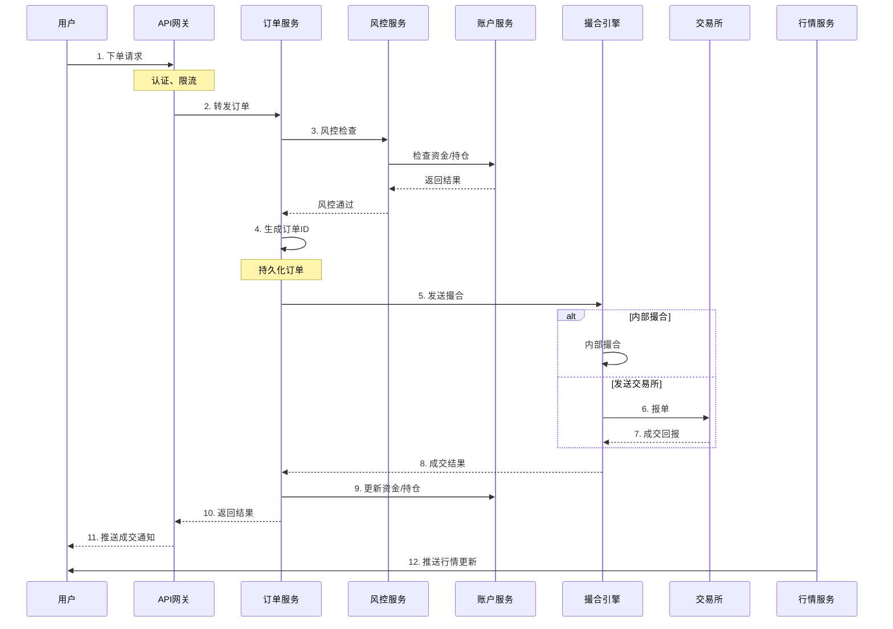

# 券商交易系统架构分析

## 1. 概述

以东方财富、老虎证券为代表的互联网券商，其交易系统架构需要满足：
- **高并发**：峰值百万级订单/秒
- **低延迟**：订单处理延迟 < 1ms
- **高可用**：99.99% 可用性
- **合规性**：符合监管要求

## 2. 整体架构

```
┌─────────────────────────────────────────────────────────────────────────┐
│                        券商交易系统整体架构                                │
├─────────────────────────────────────────────────────────────────────────┤
│                                                                          │
│  客户端层                                                                 │
│  ┌─────────────────────────────────────────────────────────────────┐   │
│  │ App (iOS/Android)  Web  PC客户端  API (机构)                      │   │
│  └─────────────────────────────────────────────────────────────────┘   │
│                              │                                           │
│                              ▼                                           │
│  接入层                                                                   │
│  ┌─────────────────────────────────────────────────────────────────┐   │
│  │ CDN  API Gateway  负载均衡  WebSocket集群                         │   │
│  └─────────────────────────────────────────────────────────────────┘   │
│                              │                                           │
│                              ▼                                           │
│  业务层                                                                   │
│  ┌──────────────┬──────────────┬──────────────┬──────────────┐        │
│  │ 账户服务     │ 订单服务     │ 行情服务     │ 资讯服务     │        │
│  │ 用户认证     │ 撮合路由     │ 实时推送     │ 新闻公告     │        │
│  │ 资金管理     │ 风控校验     │ K线生成      │ 研报数据     │        │
│  └──────────────┴──────────────┴──────────────┴──────────────┘        │
│                              │                                           │
│                              ▼                                           │
│  核心层                                                                   │
│  ┌─────────────────────────────────────────────────────────────────┐   │
│  │ 交易核心引擎                                                       │   │
│  │ ├── 订单网关: 接收、验证、路由                                     │   │
│  │ ├── 撮合引擎: 价格优先、时间优先                                   │   │
│  │ ├── 行情引擎: 实时行情计算推送                                     │   │
│  │ └── 风控引擎: 实时风险监控                                         │   │
│  └─────────────────────────────────────────────────────────────────┘   │
│                              │                                           │
│                              ▼                                           │
│  数据层                                                                   │
│  ┌──────────────┬──────────────┬──────────────┬──────────────┐        │
│  │ MySQL/TiDB   │ Redis        │ Kafka        │ 时序数据库   │        │
│  │ 账户/订单    │ 缓存/会话    │ 消息队列     │ K线/行情     │        │
│  └──────────────┴──────────────┴──────────────┴──────────────┘        │
│                              │                                           │
│                              ▼                                           │
│  外部接口                                                                 │
│  ┌─────────────────────────────────────────────────────────────────┐   │
│  │ 交易所接口 (上交所/深交所/港交所/美股)                             │   │
│  │ 银行接口 (三方存管)                                               │   │
│  │ 清算接口                                                          │   │
│  └─────────────────────────────────────────────────────────────────┘   │
│                                                                          │
└─────────────────────────────────────────────────────────────────────────┘
```

## 3. 核心模块详解

### 3.1 订单系统

| 模块 | 功能 | 关键指标 |
|------|------|----------|
| **订单网关** | 接收客户端订单 | QPS > 100万 |
| **风控校验** | 资金、持仓、权限检查 | 延迟 < 0.5ms |
| **订单路由** | 路由到交易所/内部撮合 | 延迟 < 0.1ms |
| **订单状态机** | 管理订单生命周期 | 状态一致性 |

### 3.2 撮合引擎

```
撮合原则:
1. 价格优先: 买单价格高者优先，卖单价格低者优先
2. 时间优先: 同价格时，先到者优先

撮合流程:
┌─────────────────────────────────────────────────────────────────────────┐
│                                                                          │
│  买单队列 (价格降序)          卖单队列 (价格升序)                         │
│  ┌─────────────────┐         ┌─────────────────┐                        │
│  │ 10.05 (1000股)  │         │ 10.00 (500股)   │                        │
│  │ 10.03 (2000股)  │         │ 10.01 (1000股)  │                        │
│  │ 10.02 (1500股)  │         │ 10.02 (2000股)  │                        │
│  │ 10.00 (3000股)  │         │ 10.05 (1500股)  │                        │
│  └─────────────────┘         └─────────────────┘                        │
│                                                                          │
│  新订单: 买入 10.02 价格 2000股                                          │
│     │                                                                    │
│     ▼                                                                    │
│  匹配: 与卖单队列 10.00, 10.01, 10.02 成交                               │
│     │                                                                    │
│     ▼                                                                    │
│  成交结果:                                                               │
│  - 10.00 成交 500股                                                      │
│  - 10.01 成交 1000股                                                     │
│  - 10.02 成交 500股 (部分成交)                                           │
│  - 剩余 0股 (全部成交)                                                   │
│                                                                          │
└─────────────────────────────────────────────────────────────────────────┘
```

### 3.3 行情系统

```
行情数据流:
┌─────────────────────────────────────────────────────────────────────────┐
│                                                                          │
│  交易所行情源                                                            │
│      │                                                                   │
│      ▼                                                                   │
│  行情接入网关 (多路冗余)                                                  │
│      │                                                                   │
│      ▼                                                                   │
│  行情处理引擎                                                            │
│  ├── 解码: Fast/二进制协议                                               │
│  ├── 校验: 数据完整性检查                                                │
│  └── 分发: Kafka 消息队列                                                │
│      │                                                                   │
│      ├──▶ K线生成服务: 1分/5分/日K                                       │
│      ├──▶ 实时推送服务: WebSocket 推送                                   │
│      └──▶ 历史存储: 时序数据库                                           │
│                                                                          │
└─────────────────────────────────────────────────────────────────────────┘
```

### 3.4 风控系统

```
风控层级:
┌─────────────────────────────────────────────────────────────────────────┐
│                                                                          │
│  事前风控 (下单前)                                                        │
│  ├── 资金充足性检查                                                      │
│  ├── 持仓限制检查                                                        │
│  ├── 交易权限检查                                                        │
│  ├── 价格偏离检查                                                        │
│  └── 黑名单/白名单检查                                                   │
│                                                                          │
│  事中风控 (交易中)                                                        │
│  ├── 实时持仓监控                                                        │
│  ├── 实时盈亏监控                                                        │
│  ├── 异常交易检测                                                        │
│  └── 熔断机制                                                            │
│                                                                          │
│  事后风控 (清算后)                                                        │
│  ├── 日终清算对账                                                        │
│  ├── 风险报告生成                                                        │
│  └── 合规审计                                                            │
│                                                                          │
└─────────────────────────────────────────────────────────────────────────┘
```

## 4. 订单处理时序图



## 5. 数据存储架构

### 5.1 存储选型

| 数据类型 | 存储系统 | 特点 |
|----------|----------|------|
| 账户/订单 | MySQL/TiDB | 强一致性、事务支持 |
| 实时行情 | Redis | 低延迟、高吞吐 |
| K线数据 | InfluxDB/TimescaleDB | 时序存储、压缩 |
| 订单流水 | Kafka | 顺序消费、持久化 |
| 日志数据 | Elasticsearch | 全文检索 |

### 5.2 数据分片策略

```
分片策略:
┌─────────────────────────────────────────────────────────────────────────┐
│                                                                          │
│  账户数据:                                                               │
│  └── 按 user_id 分片                                                    │
│                                                                          │
│  订单数据:                                                               │
│  ├── 主表: 按 order_id 分片                                             │
│  └── 索引表: 按 user_id + date 分片                                     │
│                                                                          │
│  行情数据:                                                               │
│  └── 按 stock_code + date 分区                                          │
│                                                                          │
│  清算数据:                                                               │
│  └── 按 date 分区                                                       │
│                                                                          │
└─────────────────────────────────────────────────────────────────────────┘
```

## 6. 高可用架构

### 6.1 多活部署

```
多活架构:
┌─────────────────────────────────────────────────────────────────────────┐
│                                                                          │
│  北京机房                         上海机房                               │
│  ┌─────────────────┐             ┌─────────────────┐                   │
│  │ 交易核心集群 A  │◀──同步──▶│ 交易核心集群 B  │                   │
│  │ 订单服务        │             │ 订单服务        │                   │
│  │ 撮合引擎        │             │ 撮合引擎        │                   │
│  │ 行情服务        │             │ 行情服务        │                   │
│  └─────────────────┘             └─────────────────┘                   │
│         │                                │                              │
│         │         数据同步               │                              │
│         └────────────────────────────────┘                              │
│                                                                          │
│  故障切换:                                                               │
│  ├── 健康检查: 心跳检测                                                  │
│  ├── 自动切换: VIP 漂移                                                  │
│  └── 数据同步: 双写/异步复制                                             │
│                                                                          │
└─────────────────────────────────────────────────────────────────────────┘
```

### 6.2 容灾级别

| 级别 | 场景 | 恢复时间 |
|------|------|----------|
| **组件级** | 单服务故障 | 秒级自动恢复 |
| **节点级** | 单机故障 | 分钟级切换 |
| **机房级** | 机房故障 | 分钟级切换 |
| **地域级** | 城市故障 | 小时级恢复 |

## 7. 关键技术挑战

### 7.1 低延迟

```
延迟优化:
┌─────────────────────────────────────────────────────────────────────────┐
│                                                                          │
│  网络层:                                                                 │
│  ├── 专线接入交易所                                                      │
│  ├── 内核旁路 (DPDK/XDP)                                                │
│  └── TCP 优化                                                            │
│                                                                          │
│  系统层:                                                                 │
│  ├── CPU 绑核                                                            │
│  ├── 内存大页                                                            │
│  └── 中断亲和                                                            │
│                                                                          │
│  应用层:                                                                 │
│  ├── 无锁数据结构                                                        │
│  ├── 内存池                                                              │
│  └── 对象池                                                              │
│                                                                          │
│  目标延迟:                                                               │
│  ├── 订单处理: < 1ms                                                     │
│  ├── 行情推送: < 10ms                                                    │
│  └── 撮合成交: < 0.1ms                                                   │
│                                                                          │
└─────────────────────────────────────────────────────────────────────────┘
```

### 7.2 高并发

```
并发处理:
┌─────────────────────────────────────────────────────────────────────────┐
│                                                                          │
│  接入层:                                                                 │
│  ├── 连接池复用                                                          │
│  ├── 异步非阻塞 IO                                                       │
│  └── 协程模型                                                            │
│                                                                          │
│  服务层:                                                                 │
│  ├── 微服务拆分                                                          │
│  ├── 水平扩展                                                            │
│  └── 服务网格                                                            │
│                                                                          │
│  数据层:                                                                 │
│  ├── 读写分离                                                            │
│  ├── 分库分表                                                            │
│  └── 缓存加速                                                            │
│                                                                          │
│  目标并发:                                                               │
│  └── 峰值 QPS: > 100万                                                   │
│                                                                          │
└─────────────────────────────────────────────────────────────────────────┘
```

## 8. 监控与运维

### 8.1 监控体系

```
监控层级:
┌─────────────────────────────────────────────────────────────────────────┐
│                                                                          │
│  业务监控:                                                               │
│  ├── 订单成功率、延迟                                                    │
│  ├── 成交量、成交额                                                      │
│  └── 用户活跃度                                                          │
│                                                                          │
│  系统监控:                                                               │
│  ├── CPU、内存、磁盘、网络                                               │
│  ├── JVM、线程池、GC                                                     │
│  └── 连接数、QPS                                                         │
│                                                                          │
│  基础设施监控:                                                           │
│  ├── 机房、机柜                                                          │
│  ├── 电力、空调                                                          │
│  └── 网络设备                                                            │
│                                                                          │
│  告警策略:                                                               │
│  ├── 实时告警: 电话/短信/IM                                              │
│  ├── 分级处理: P0/P1/P2/P3                                               │
│  └── 自动修复: 弹性扩容                                                  │
│                                                                          │
└─────────────────────────────────────────────────────────────────────────┘
```

## 9. 合规与安全

### 9.1 合规要求

| 要求 | 说明 |
|------|------|
| **实名认证** | 身份验证、银行卡绑定 |
| **适当性管理** | 风险评估、产品匹配 |
| **反洗钱** | 大额交易监控、可疑报告 |
| **数据安全** | 加密存储、访问控制 |
| **审计留痕** | 操作日志、交易记录 |

### 9.2 安全措施

```
安全架构:
┌─────────────────────────────────────────────────────────────────────────┐
│                                                                          │
│  网络安全:                                                               │
│  ├── DDoS 防护                                                          │
│  ├── WAF (Web应用防火墙)                                                │
│  └── API 网关安全                                                       │
│                                                                          │
│  应用安全:                                                               │
│  ├── 身份认证 (MFA)                                                     │
│  ├── 权限控制 (RBAC)                                                    │
│  └── 数据加密 (TLS/AES)                                                 │
│                                                                          │
│  数据安全:                                                               │
│  ├── 敏感数据脱敏                                                        │
│  ├── 数据库审计                                                          │
│  └── 备份恢复                                                            │
│                                                                          │
└─────────────────────────────────────────────────────────────────────────┘
```

## 10. 与传统券商对比

| 对比项 | 互联网券商 | 传统券商 |
|--------|------------|----------|
| **技术栈** | 云原生、微服务 | 传统架构 |
| **延迟** | < 1ms | ~10ms |
| **并发** | 百万 QPS | 十万 QPS |
| **部署** | 容器化、K8s | 虚拟机/物理机 |
| **扩展性** | 弹性伸缩 | 手动扩容 |
| **成本** | 相对较低 | 相对较高 |

## 11. 总结

| 问题 | 答案 |
|------|------|
| 核心挑战？ | 低延迟、高并发、高可用 |
| 关键模块？ | 订单系统、撮合引擎、行情系统、风控系统 |
| 延迟目标？ | 订单处理 < 1ms |
| 并发目标？ | 峰值 QPS > 100万 |
| 可用性目标？ | 99.99% |
| 存储选型？ | MySQL/TiDB + Redis + Kafka + 时序数据库 |
| 部署方式？ | 多机房多活 |

---
