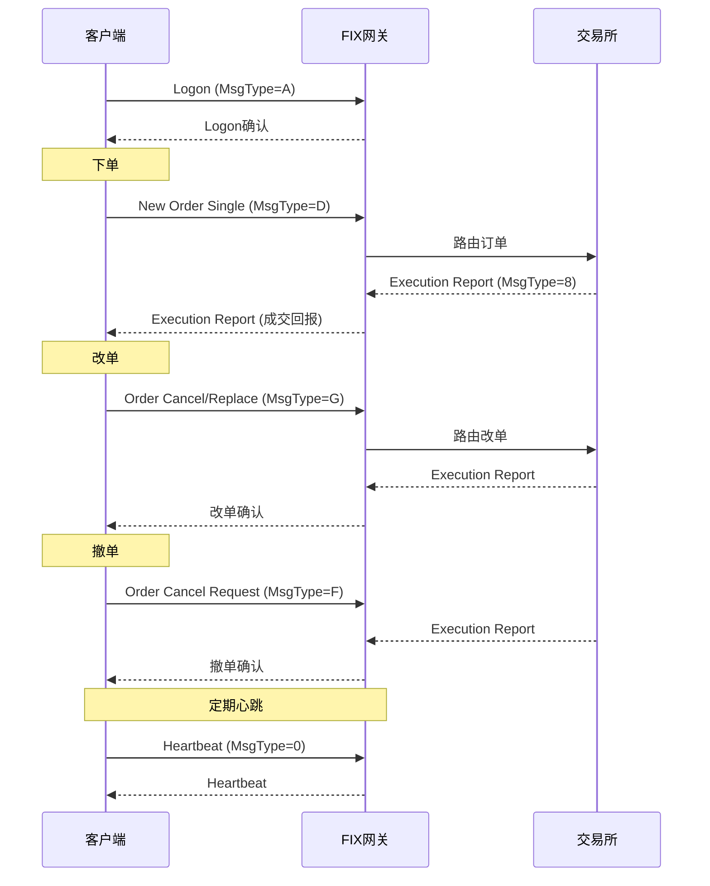

# 金融交易协议详解

## 1. 概述

金融交易系统使用多种协议进行通信，主要包括：
- **交易协议**：下单、成交回报
- **行情协议**：市场数据分发
- **结算协议**：资金、证券结算

## 2. 协议分类

```
┌─────────────────────────────────────────────────────────────────────────┐
│                        金融交易协议分类                                   │
├─────────────────────────────────────────────────────────────────────────┤
│                                                                          │
│  交易协议 (下单/成交)                                                     │
│  ├── FIX: 金融信息交换协议 (国际标准)                                    │
│  ├── STEP: 证券交易交换协议 (中国标准)                                   │
│  └── Binary: 交易所私有二进制协议                                        │
│                                                                          │
│  行情协议 (市场数据)                                                      │
│  ├── FAST: 面向流的FIX协议                                               │
│  ├── Binary: 二进制行情协议                                              │
│  └── ITCH: 纳斯达克行情协议                                              │
│                                                                          │
│  结算协议 (资金/证券)                                                     │
│  ├── SWIFT: 银行间通信协议                                               │
│  ├── ISO 15022: 证券报文标准                                             │
│  └── ISO 20022: 新一代金融报文标准                                       │
│                                                                          │
└─────────────────────────────────────────────────────────────────────────┘
```

---

## 3. FIX 协议

### 3.1 简介

| 项目 | 说明 |
|------|------|
| **全称** | Financial Information eXchange |
| **用途** | 机构投资者与交易所/券商间交易 |
| **特点** | 文本协议、可读性强、扩展性好 |
| **版本** | FIX 4.2, 4.4, 5.0 |

### 3.2 消息结构

```
FIX 消息格式:

8=FIX.4.2|                  # BeginString: 协议版本
9=156|                       # BodyLength: 消息体长度
35=D|                        # MsgType: D = New Order Single (新订单)
49=CLIENT|                   # SenderCompID: 发送方ID
56=BROKER|                   # TargetCompID: 接收方ID
34=123|                      # MsgSeqNum: 消息序号
52=20240101-09:30:00|        # SendingTime: 发送时间
11=ORDER001|                 # ClOrdID: 客户端订单ID
21=1|                        # HandlInst: 处理指令 (自动执行)
55=AAPL|                     # Symbol: 证券代码
54=1|                        # Side: 1=买入, 2=卖出
38=1000|                     # OrderQty: 订单数量
40=2|                        # OrdType: 2=限价单
44=150.00|                   # Price: 价格
10=123|                      # Checksum: 校验和

字段说明:
├── 每个字段: Tag=Value
├── 字段分隔: SOH (0x01)
└── 消息结束: Checksum
```

### 3.3 常用消息类型

| MsgType | 说明 |
|---------|------|
| **D** | New Order Single - 新订单 |
| **G** | Order Cancel/Replace - 改单 |
| **F** | Order Cancel Request - 撤单 |
| **8** | Execution Report - 成交回报 |
| **9** | Order Cancel Reject - 撤单拒绝 |
| **0** | Heartbeat - 心跳 |
| **1** | Test Request - 测试请求 |
| **A** | Logon - 登录 |
| **5** | Logout - 登出 |

### 3.4 交易流程时序图



### 3.5 使用场景

```
FIX 协议使用场景:

机构投资者 ──▶ 券商/交易所
├── 基金公司
├── 对冲基金
├── 资管公司
└── 量化私募

特点:
├── 支持复杂订单类型
├── 完整的交易生命周期
├── 行业标准
└── 适合机构业务
```

---

## 4. STEP 协议

### 4.1 简介

| 项目 | 说明 |
|------|------|
| **全称** | Securities Trading Exchange Protocol |
| **用途** | 中国证券市场交易 |
| **特点** | 基于FIX、本土化适配 |
| **标准** | 中国金融行业标准 |

### 4.2 与 FIX 的关系

```
STEP vs FIX:
┌─────────────────────────────────────────────────────────────────────────┐
│                                                                          │
│  STEP 是 FIX 的中国本土化版本:                                           │
│                                                                          │
│  共同点:                                                                 │
│  ├── 消息格式相同 (Tag=Value)                                           │
│  ├── 基础字段兼容                                                       │
│  └── 通信方式相同                                                       │
│                                                                          │
│  差异点:                                                                 │
│  ├── 增加中国特有字段                                                   │
│  │   ├── SecurityID: 证券代码 (6位)                                     │
│  │   ├── MarketID: 市场代码                                             │
│  │   └── OwnerType: 账户类型                                            │
│  ├── 支持A股特有业务                                                    │
│  │   ├── 涨跌停板                                                       │
│  │   ├── 融资融券                                                       │
│  │   └── 大宗交易                                                       │
│  └── 编码: 支持 GB18030                                                 │
│                                                                          │
└─────────────────────────────────────────────────────────────────────────┘
```

### 4.3 STEP 特有字段

```
STEP 扩展字段:

中国证券市场特有:
├── Tag 1229: OwnerType (账户类型)
│   ├── 0: 普通
│   ├── 1: 基金
│   ├── 2: 券商自营
│   └── 3: 社保基金
│
├── Tag 1228: ClientID (客户代码)
│
├── Tag 10002: MarketID (市场代码)
│   ├── 1: 上交所
│   └── 2: 深交所
│
└── Tag 10003: SecurityID (证券代码)
    └── 6位数字代码
```

---

## 5. Binary 协议

### 5.1 简介

| 项目 | 说明 |
|------|------|
| **用途** | 高性能交易场景 |
| **特点** | 二进制编码、低延迟 |
| **场景** | 交易所私有协议 |

### 5.2 二进制 vs 文本协议

```
二进制协议 vs 文本协议:

文本协议 (FIX/STEP):
┌────────────────────────────────────────────────────────────────────────┐
│ 8=FIX.4.2|35=D|55=AAPL|54=1|38=1000|44=150.00|...                      │
│ 大小: 约150 字节                                                         │
│ 解析: 字符串解析，较慢                                                   │
│ 可读性: 高                                                               │
└────────────────────────────────────────────────────────────────────────┘

二进制协议:
┌────────────────────────────────────────────────────────────────────────┐
│ 0x01 0x02 0x00 0x0F 0x00 0x00 0x03 E8 0x00 0x00 0xBB 0x80 ...          │
│ 大小: 约50 字节                                                          │
│ 解析: 直接内存读取，快                                                   │
│ 可读性: 低                                                               │
└────────────────────────────────────────────────────────────────────────┘

性能对比:
┌────────────────────────────────────────────────────────────────────────┐
│ 指标          │ 文本协议      │ 二进制协议                              │
├────────────────────────────────────────────────────────────────────────┤
│ 消息大小      │ 约150B       │ 约50B                                   │
│ 解析延迟      │ 约50μs       │ 约5μs                                   │
│ 网络带宽      │ 高           │ 低                                      │
│ 开发调试      │ 简单         │ 复杂                                    │
└────────────────────────────────────────────────────────────────────────┘
```

### 5.3 交易所二进制协议示例

```
上交所 Binary 协议:

消息头 (固定 16B):
┌─────────────────────────────────────────────────────────────────────────┐
│ 字段           │ 长度   │ 说明                                          │
├─────────────────────────────────────────────────────────────────────────┤
│ MsgType        │ 2B     │ 消息类型                                      │
│ MsgLen         │ 2B     │ 消息长度                                      │
│ SeqNo          │ 4B     │ 序列号                                        │
│ SendingTime    │ 8B     │ 发送时间                                      │
└─────────────────────────────────────────────────────────────────────────┘

订单消息:
┌─────────────────────────────────────────────────────────────────────────┐
│ 字段           │ 长度   │ 说明                                          │
├─────────────────────────────────────────────────────────────────────────┤
│ ClOrdID        │ 8B     │ 客户端订单ID                                  │
│ SecurityID     │ 8B     │ 证券代码                                      │
│ Side           │ 1B     │ 买卖方向                                      │
│ OrderQty       │ 8B     │ 订单数量                                      │
│ Price          │ 8B     │ 价格 (定点数)                                 │
└─────────────────────────────────────────────────────────────────────────┘
```

---

## 6. FAST 协议

### 6.1 简介

| 项目 | 说明 |
|------|------|
| **全称** | FIX Adapted for STreaming |
| **用途** | 高速行情数据传输 |
| **特点** | 压缩编码、增量传输 |
| **场景** | Level-2 行情 |

### 6.2 编码原理

```
FAST 编码原理:

1. 模板定义:
   ├── 预定义消息结构
   └── 字段编码规则

2. 增量编码:
   ├── 只传输变化部分
   └── 基准值 + 差值

3. 压缩技术:
   ├── 停止位编码
   ├── 字典压缩
   └── 值引用
```

### 6.3 编码示例

```
FAST 编码示例:

行情快照 1:
├── Price=100.00, Volume=1000, High=100.00, Low=100.00
└── 编码后: 完整数据

行情快照 2:
├── Price=100.01, Volume=1005, High=100.01, Low=100.00
└── 编码后: 只传输变化部分
    ├── Price=+0.01
    ├── Volume=+5
    ├── High=+0.01
    └── Low=不变

压缩率: 通常 5-10 倍
```

---

## 7. ITCH/OUCH 协议

### 7.1 简介

| 协议 | 用途 | 特点 |
|------|------|------|
| **ITCH** | 行情数据 (单向) | 广播全量订单簿 |
| **OUCH** | 订单录入 (单向) | 低延迟下单 |

### 7.2 ITCH 消息结构

```
NASDAQ ITCH 协议:

Add Order 消息:
┌─────────────────────────────────────────────────────────────────────────┐
│ 字段           │ 偏移   │ 长度   │ 说明                                  │
├─────────────────────────────────────────────────────────────────────────┤
│ MessageType    │ 0      │ 1B     │ 'A' = Add Order                       │
│ StockLocate    │ 1      │ 2B     │ 证券位置代码                          │
│ TrackingNumber │ 3      │ 2B     │ 追踪号                                │
│ Timestamp      │ 5      │ 6B     │ 时间戳                                │
│ OrderReference │ 11     │ 8B     │ 订单参考号                            │
│ BuySell        │ 19     │ 1B     │ 'B'=买, 'S'=卖                        │
│ Shares         │ 20     │ 4B     │ 数量                                  │
│ Stock          │ 24     │ 8B     │ 证券代码                              │
│ Price          │ 32     │ 4B     │ 价格                                  │
└─────────────────────────────────────────────────────────────────────────┘

特点:
├── 固定长度消息
├── 二进制编码
├── 无需解析，直接映射
└── 延迟 < 1μs
```

### 7.3 OUCH 消息类型

```
OUCH 协议消息:

订单录入:
├── Enter Order: 新订单
├── Replace Order: 改单
└── Cancel Order: 撤单

订单回报:
├── Accepted: 订单接受
├── Rejected: 订单拒绝
├── Executed: 订单成交
├── Canceled: 订单撤销
└── Replaced: 订单修改
```

---

## 8. SWIFT 协议

### 8.1 简介

| 项目 | 说明 |
|------|------|
| **用途** | 银行间金融报文传输 |
| **场景** | 跨境转账、证券结算 |
| **格式** | MT (Message Type) 报文 |

### 8.2 常用报文类型

| MT类型 | 说明 |
|--------|------|
| **MT103** | 单笔客户汇款 |
| **MT202** | 银行间转账 |
| **MT300** | 外汇交易确认 |
| **MT540** | 证券买入结算指令 |
| **MT541** | 证券卖出结算指令 |
| **MT542** | 证券交割指令 |
| **MT543** | 证券结算指令 |
| **MT545** | 证券买入确认 |
| **MT546** | 证券卖出确认 |

### 8.3 MT103 示例

```
:20:TXN123456789                    # 交易参考号
:23B:CRED                           # 银行操作代码
:32A:240101USD1000,00               # 金额 (日期+币种+金额)
:33B:USD1000,00                     # 指示金额
:50K:/123456789                     # 汇款人账户
JOHN DOE
NEW YORK, USA
:52A:BANKUS33                       # 汇款银行
:57A:CHASUS33                       # 收款银行
:59:/987654321                      # 收款人账户
JANE SMITH
LONDON, UK
:70:PAYMENT FOR INVOICE #12345      # 汇款用途
:71A:SHA                            # 费用承担方式
```

---

## 9. ISO 20022

### 9.1 简介

| 项目 | 说明 |
|------|------|
| **用途** | 新一代金融报文标准 |
| **格式** | XML/JSON |
| **特点** | 语义丰富、可扩展 |
| **趋势** | 逐步替代 SWIFT MT |

### 9.2 消息示例

```xml
<!-- 证券交易确认消息 -->
<Document xmlns="urn:iso:std:iso:20022:tech:xsd:sese.035.001.04">
    <SctiesTradConf>
        <TradDtls>
            <TradTxId>TX123456789</TradTxId>
            <TradDtTm>2024-01-01T09:30:00</TradDtTm>
            <FinInstrmId>
                <Tkn>600000</Tkn>
            </FinInstrmId>
            <TradQty>
                <Qty>1000</Qty>
            </TradQty>
            <TradPric>
                <Pric>10.50</Pric>
            </TradPric>
        </TradDtls>
        <SttlmDtls>
            <SttlmAmt>
                <Amt Ccy="CNY">10500.00</Amt>
            </SttlmAmt>
        </SttlmDtls>
    </SctiesTradConf>
</Document>
```

---

## 10. 协议选择策略

### 10.1 决策树

```
协议选择决策树:

场景: 交易下单
├── 机构业务 (公募/私募) ──▶ FIX/STEP
└── 高频交易 ──▶ Binary 协议

场景: 行情接收
├── Level-1 (基础行情) ──▶ FAST/Binary
├── Level-2 (十档行情) ──▶ Binary
└── 全量订单簿 ──▶ ITCH

场景: 资金结算
├── 国内银行 ──▶ CNAPS/大额支付系统
├── 跨境转账 ──▶ SWIFT
└── 证券结算 ──▶ ISO 20022
```

### 10.2 各协议对比

| 协议 | 延迟 | 带宽 | 复杂度 | 场景 |
|------|------|------|--------|------|
| FIX | ~100μs | 高 | 低 | 机构交易 |
| STEP | ~100μs | 高 | 低 | A股交易 |
| Binary | ~10μs | 低 | 高 | 高频交易 |
| FAST | ~50μs | 低 | 中 | 行情推送 |
| ITCH | ~1μs | 中 | 中 | 订单簿 |
| SWIFT | ~秒级 | 低 | 中 | 跨境转账 |
| ISO 20022 | ~秒级 | 高 | 低 | 证券结算 |

---

## 11. 总结

| 协议 | 用途 | 特点 | 适用场景 |
|------|------|------|----------|
| **FIX** | 国际交易标准 | 文本、可扩展 | 机构交易 |
| **STEP** | 中国交易标准 | FIX本土化 | A股交易 |
| **Binary** | 高性能交易 | 二进制、低延迟 | 高频交易 |
| **FAST** | 高速行情 | 压缩、增量 | Level-2行情 |
| **ITCH** | 订单簿行情 | 广播、固定长度 | 全量订单簿 |
| **OUCH** | 订单录入 | 低延迟 | 高频下单 |
| **SWIFT** | 银行间通信 | MT报文 | 跨境转账 |
| **ISO 20022** | 新一代标准 | XML/JSON | 证券结算 |

---
