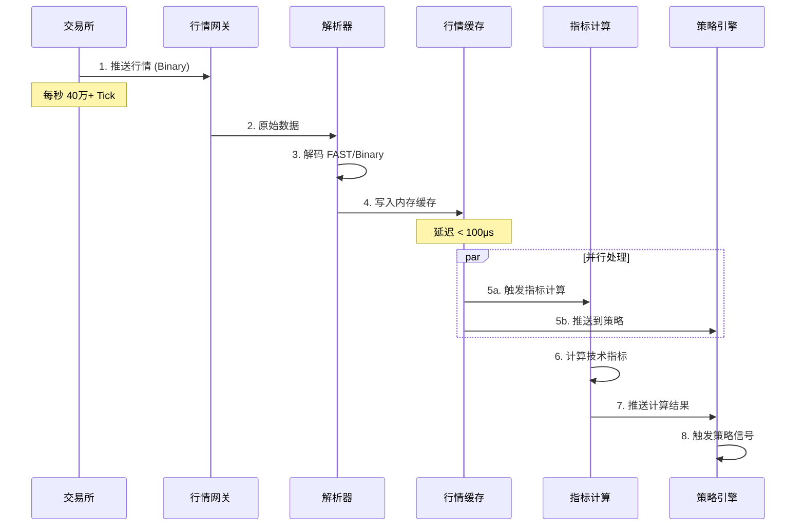
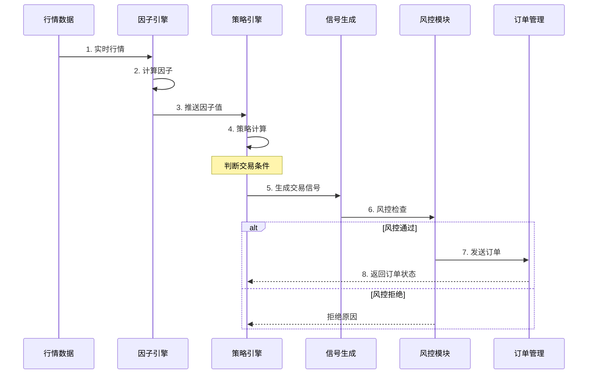
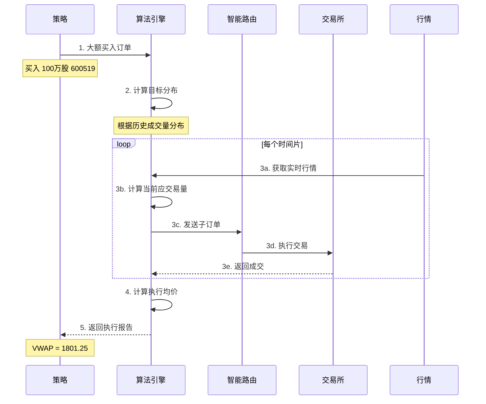
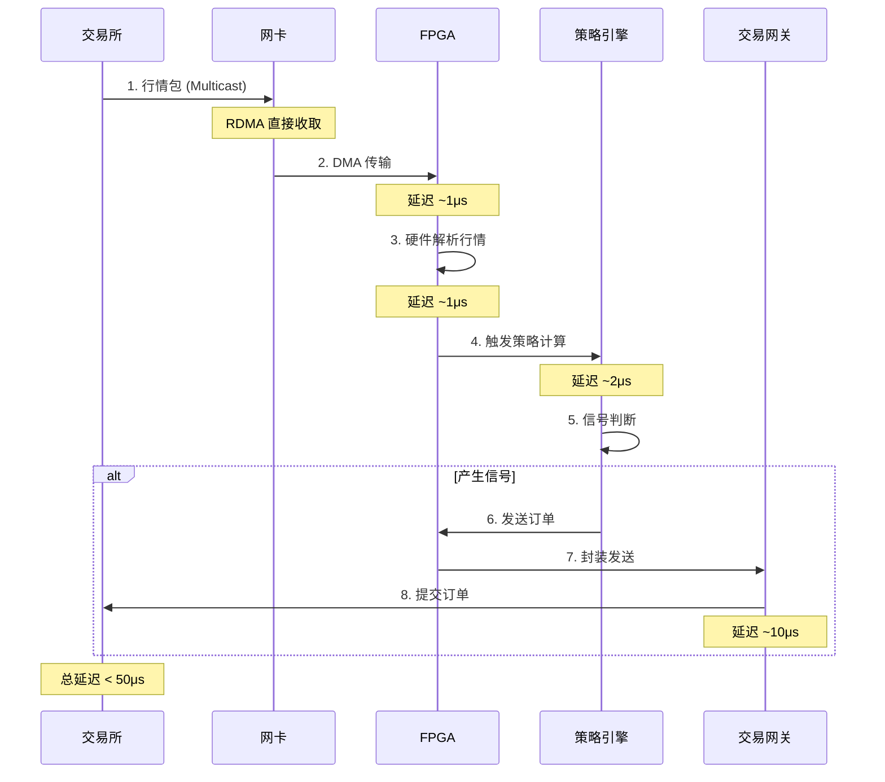
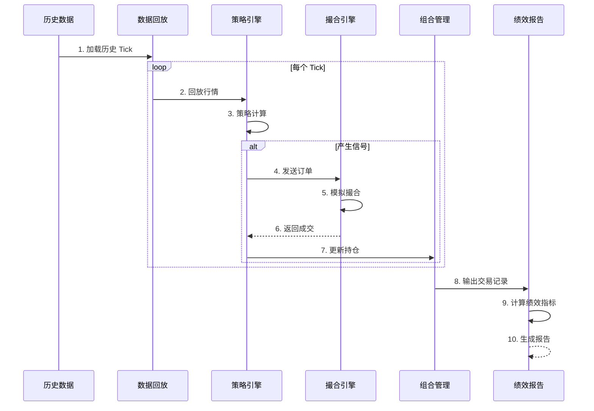
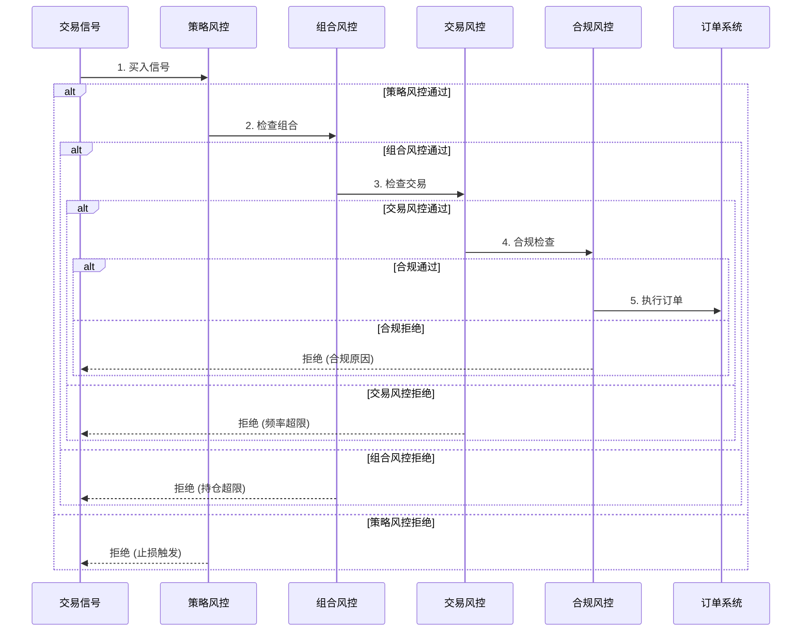

# 量化交易系统架构

## 1. 概述

量化交易系统是**基于数学模型和算法**进行自动化交易的系统，核心目标是**低延迟、高吞吐、策略灵活**。

```
┌─────────────────────────────────────────────────────────────────────────┐
│                     量化交易系统 vs 券商交易系统                          │
├─────────────────────────────────────────────────────────────────────────┤
│                                                                          │
│  券商交易系统                          量化交易系统                       │
│  ├── 用户驱动                          ├── 策略驱动                       │
│  ├── 业务逻辑复杂                      ├── 计算密集                       │
│  ├── 延迟要求 ~10ms                    ├── 延迟要求 <1ms (高频)           │
│  ├── 数据库为核心                      ├── 内存为核心                     │
│  └── 强一致性优先                      └── 极致性能优先                   │
│                                                                          │
└─────────────────────────────────────────────────────────────────────────┘
```

---

## 2. 系统整体架构

```
┌─────────────────────────────────────────────────────────────────────────┐
│                        量化交易系统整体架构                               │
├─────────────────────────────────────────────────────────────────────────┤
│                                                                          │
│  ┌─────────────────────────────────────────────────────────────────┐   │
│  │                        数据层                                    │   │
│  │  行情数据源 │ 历史数据 │ 另类数据 │ 新闻舆情                      │   │
│  └─────────────────────────────────────────────────────────────────┘   │
│                              │                                          │
│                              ▼                                          │
│  ┌─────────────────────────────────────────────────────────────────┐   │
│  │                        数据处理层                                │   │
│  │  行情引擎 │ 数据清洗 │ 特征工程 │ 实时指标计算                    │   │
│  └─────────────────────────────────────────────────────────────────┘   │
│                              │                                          │
│                              ▼                                          │
│  ┌─────────────────────────────────────────────────────────────────┐   │
│  │                        策略层                                    │   │
│  │  策略引擎 │ 因子计算 │ 信号生成 │ 组合优化                        │   │
│  └─────────────────────────────────────────────────────────────────┘   │
│                              │                                          │
│                              ▼                                          │
│  ┌─────────────────────────────────────────────────────────────────┐   │
│  │                        执行层                                    │   │
│  │  订单管理 │ 智能路由 │ 算法交易 │ 风险控制                        │   │
│  └─────────────────────────────────────────────────────────────────┘   │
│                              │                                          │
│                              ▼                                          │
│  ┌─────────────────────────────────────────────────────────────────┐   │
│  │                        通道层                                    │   │
│  │  券商接口 │ 交易所接口 │ 柜台系统 │ FIX/ Binary 协议               │   │
│  └─────────────────────────────────────────────────────────────────┘   │
│                                                                          │
└─────────────────────────────────────────────────────────────────────────┘
```

---

## 3. 各层详细架构

### 3.1 数据层

```
┌─────────────────────────────────────────────────────────────────────────┐
│                           数据层架构                                     │
├─────────────────────────────────────────────────────────────────────────┤
│                                                                          │
│  实时数据源                                                              │
│  ┌─────────────┐  ┌─────────────┐  ┌─────────────┐  ┌─────────────┐   │
│  │ 交易所行情   │  │ Level-2数据 │  │ 期货行情    │  │ 期权行情    │   │
│  │ (SH/SZ)     │  │ (逐笔成交)  │  │ (CFFEX)     │  │ (上交所)    │   │
│  └──────┬──────┘  └──────┬──────┘  └──────┬──────┘  └──────┬──────┘   │
│         │                │                │                │           │
│         └────────────────┴────────────────┴────────────────┘           │
│                                   │                                     │
│  历史数据                        ▼                                     │
│  ┌─────────────┐  ┌─────────────┐  ┌─────────────┐                    │
│  │ K线数据      │  │ Tick数据    │  │ 财务数据    │                    │
│  │ (日/分/秒)   │  │ (逐笔)      │  │ (季报/年报) │                    │
│  └─────────────┘  └─────────────┘  └─────────────┘                    │
│                                                                          │
│  另类数据                                                                │
│  ┌─────────────┐  ┌─────────────┐  ┌─────────────┐                    │
│  │ 新闻舆情    │  │ 社交媒体    │  │ 卫星图像    │                    │
│  └─────────────┘  └─────────────┘  └─────────────┘                    │
│                                                                          │
└─────────────────────────────────────────────────────────────────────────┘
```

**数据存储方案：**

| 数据类型 | 存储系统 | 延迟要求 | 查询模式 |
|----------|----------|----------|----------|
| 实时行情 | 内存 + Redis | < 1ms | 随机读取 |
| Tick 数据 | KDB+ / QuestDB | < 10ms | 时间范围查询 |
| K线数据 | ClickHouse | < 100ms | 聚合查询 |
| 历史数据 | HDFS / S3 | 无限制 | 批量扫描 |

---

### 3.2 数据处理层

```
┌─────────────────────────────────────────────────────────────────────────┐
│                         数据处理层架构                                   │
├─────────────────────────────────────────────────────────────────────────┤
│                                                                          │
│  行情引擎                                                                │
│  ┌─────────────────────────────────────────────────────────────────┐   │
│  │                                                                  │   │
│  │   行情数据流                                                      │   │
│  │       │                                                          │   │
│  │       ▼                                                          │   │
│  │   ┌─────────┐    ┌─────────┐    ┌─────────┐    ┌─────────┐    │   │
│  │   │ 解析     │──▶│ 校验     │──▶│ 分发     │──▶│ 缓存     │    │   │
│  │   │ (解码)   │    │ (去重)   │    │ (Pub/Sub)│    │ (内存)   │    │   │
│  │   └─────────┘    └─────────┘    └─────────┘    └─────────┘    │   │
│  │                                                                  │   │
│  └─────────────────────────────────────────────────────────────────┘   │
│                                                                          │
│  实时计算引擎                                                            │
│  ┌─────────────────────────────────────────────────────────────────┐   │
│  │                                                                  │   │
│  │   Flink / Spark Streaming                                        │   │
│  │       │                                                          │   │
│  │       ├──▶ 滑动窗口计算 (1分钟/5分钟/1小时)                        │   │
│  │       ├──▶ 实时指标计算 (MA/EMA/MACD/RSI)                         │   │
│  │       ├──▶ 因子计算 (动量/波动率/成交量)                           │   │
│  │       └──▶ 异常检测 (价格突变/成交量异常)                          │   │
│  │                                                                  │   │
│  └─────────────────────────────────────────────────────────────────┘   │
│                                                                          │
└─────────────────────────────────────────────────────────────────────────┘
```

**实时行情处理时序图：**



---

### 3.3 策略层

```
┌─────────────────────────────────────────────────────────────────────────┐
│                           策略层架构                                     │
├─────────────────────────────────────────────────────────────────────────┤
│                                                                          │
│  策略引擎                                                                │
│  ┌─────────────────────────────────────────────────────────────────┐   │
│  │                                                                  │   │
│  │   策略管理                                                        │   │
│  │   ├── 策略注册 / 启动 / 停止                                      │   │
│  │   ├── 策略生命周期管理                                            │   │
│  │   └── 策略热更新                                                  │   │
│  │                                                                  │   │
│  │   策略类型                                                        │   │
│  │   ├── 趋势跟踪策略 (Trend Following)                              │   │
│  │   ├── 均值回归策略 (Mean Reversion)                               │   │
│  │   ├── 套利策略 (Arbitrage)                                        │   │
│  │   ├── 做市策略 (Market Making)                                    │   │
│  │   └── 高频策略 (HFT)                                              │   │
│  │                                                                  │   │
│  └─────────────────────────────────────────────────────────────────┘   │
│                                                                          │
│  因子引擎                                                                │
│  ┌─────────────────────────────────────────────────────────────────┐   │
│  │                                                                  │   │
│  │   多因子模型                                                      │   │
│  │   ├── 动量因子 (Momentum)                                         │   │
│  │   ├── 价值因子 (Value)                                            │   │
│  │   ├── 质量因子 (Quality)                                          │   │
│  │   ├── 波动因子 (Volatility)                                       │   │
│  │   └── 流动性因子 (Liquidity)                                      │   │
│  │                                                                  │   │
│  │   因子计算: F = Σ(wi * fi)                                        │   │
│  │                                                                  │   │
│  └─────────────────────────────────────────────────────────────────┘   │
│                                                                          │
│  信号生成                                                                │
│  ┌─────────────────────────────────────────────────────────────────┐   │
│  │                                                                  │   │
│  │   信号类型                                                        │   │
│  │   ├── 开仓信号 (买入/卖出)                                        │   │
│  │   ├── 平仓信号 (止盈/止损)                                        │   │
│  │   ├── 调仓信号 (加仓/减仓)                                        │   │
│  │   └── 风控信号 (强制平仓)                                         │   │
│  │                                                                  │   │
│  └─────────────────────────────────────────────────────────────────┘   │
│                                                                          │
└─────────────────────────────────────────────────────────────────────────┘
```

**策略执行时序图：**



---

### 3.4 执行层

```
┌─────────────────────────────────────────────────────────────────────────┐
│                           执行层架构                                     │
├─────────────────────────────────────────────────────────────────────────┤
│                                                                          │
│  订单管理系统 (OMS)                                                      │
│  ┌─────────────────────────────────────────────────────────────────┐   │
│  │                                                                  │   │
│  │   订单生命周期                                                    │   │
│  │   ┌─────────┐   ┌─────────┐   ┌─────────┐   ┌─────────┐        │   │
│  │   │ 信号生成 │──▶│ 订单创建 │──▶│ 订单路由 │──▶│ 订单执行 │        │   │
│  │   └─────────┘   └─────────┘   └─────────┘   └─────────┘        │   │
│  │                                      │                          │   │
│  │                                      ▼                          │   │
│  │                              ┌─────────────┐                    │   │
│  │                              │ 订单状态追踪 │                    │   │
│  │                              └─────────────┘                    │   │
│  │                                                                  │   │
│  └─────────────────────────────────────────────────────────────────┘   │
│                                                                          │
│  智能路由                                                                │
│  ┌─────────────────────────────────────────────────────────────────┐   │
│  │                                                                  │   │
│  │   路由策略                                                        │   │
│  │   ├── 最优价格路由 (Best Price)                                   │   │
│  │   ├── 最小冲击路由 (Min Impact)                                   │   │
│  │   ├── 流动性路由 (Liquidity)                                      │   │
│  │   └── 智能拆单 (Smart Order Routing)                              │   │
│  │                                                                  │   │
│  │   多市场路由                                                      │   │
│  │   ├── 上交所 (SSE)                                                │   │
│  │   ├── 深交所 (SZSE)                                               │   │
│  │   ├── 中金所 (CFFEX)                                              │   │
│  │   └── 港股 (HKEX)                                                 │   │
│  │                                                                  │   │
│  └─────────────────────────────────────────────────────────────────┘   │
│                                                                          │
│  算法交易                                                                │
│  ┌─────────────────────────────────────────────────────────────────┐   │
│  │                                                                  │   │
│  │   算法类型                                                        │   │
│  │   ├── TWAP (Time Weighted Average Price)  时间加权均价            │   │
│  │   ├── VWAP (Volume Weighted Average Price) 成交量加权均价         │   │
│  │   ├── POV (Percentage of Volume)          成交量百分比            │   │
│  │   ├── IS (Implementation Shortfall)        执行落差               │   │
│  │   └── 自定义算法                                                  │   │
│  │                                                                  │   │
│  └─────────────────────────────────────────────────────────────────┘   │
│                                                                          │
└─────────────────────────────────────────────────────────────────────────┘
```

**算法交易执行流程 (VWAP 为例)：**



---

### 3.5 通道层

```
┌─────────────────────────────────────────────────────────────────────────┐
│                           通道层架构                                     │
├─────────────────────────────────────────────────────────────────────────┤
│                                                                          │
│  券商柜台接口                                                            │
│  ┌─────────────────────────────────────────────────────────────────┐   │
│  │                                                                  │   │
│  │   券商柜台                                                        │   │
│  │   ├── 恒生柜台 (Hundsun)                                          │   │
│  │   ├── 金证柜台 (Kingdom)                                          │   │
│  │   ├── 顶点柜台 (Apex)                                             │   │
│  │   ├── 华锐柜台 (Fast)                                             │   │
│  │   └── 迅投柜台 (QMT/PTrade)                                       │   │
│  │                                                                  │   │
│  └─────────────────────────────────────────────────────────────────┘   │
│                                                                          │
│  交易接口协议                                                            │
│  ┌─────────────────────────────────────────────────────────────────┐   │
│  │                                                                  │   │
│  │   协议类型                     延迟          适用场景              │   │
│  │   ├── Binary 协议             ~10μs        高频交易              │   │
│  │   ├── FIX 协议                ~100μs       标准交易              │   │
│  │   ├── STEP 协议               ~100μs       国内标准              │   │
│  │   └── API 接口 (SDK)          ~1ms         一般交易              │   │
│  │                                                                  │   │
│  └─────────────────────────────────────────────────────────────────┘   │
│                                                                          │
│  交易所直连                                                              │
│  ┌─────────────────────────────────────────────────────────────────┐   │
│  │                                                                  │   │
│  │   机房托管                                                        │   │
│  │   ├── 交易所机房托管 (主机)                                       │   │
│  │   ├── 跨机房专线 (备用)                                           │   │
│  │   └── 网络延迟 < 1ms                                              │   │
│  │                                                                  │   │
│  └─────────────────────────────────────────────────────────────────┘   │
│                                                                          │
└─────────────────────────────────────────────────────────────────────────┘
```

---

## 4. 高频交易 (HFT) 架构

```
┌─────────────────────────────────────────────────────────────────────────┐
│                        高频交易系统架构                                   │
├─────────────────────────────────────────────────────────────────────────┤
│                                                                          │
│  极致低延迟设计                                                          │
│  ┌─────────────────────────────────────────────────────────────────┐   │
│  │                                                                  │   │
│  │   硬件优化                                                        │   │
│  │   ├── FPGA 加速卡 (行情解析/策略计算)                              │   │
│  │   ├── RDMA 网络 (绕过内核协议栈)                                   │   │
│  │   ├── Solarflare 网卡 (低延迟网卡)                                 │   │
│  │   └── CPU 绑核 / 内存锁定                                         │   │
│  │                                                                  │   │
│  │   软件优化                                                        │   │
│  │   ├── 内核旁路 (Kernel Bypass)                                    │   │
│  │   ├── 零拷贝 (Zero Copy)                                          │   │
│  │   ├── 无锁数据结构                                                │   │
│  │   └── 内存预分配                                                  │   │
│  │                                                                  │   │
│  └─────────────────────────────────────────────────────────────────┘   │
│                                                                          │
│  延迟分解                                                                │
│  ┌─────────────────────────────────────────────────────────────────┐   │
│  │                                                                  │   │
│  │   行情接收      ~1-5μs                                           │   │
│  │   行情解析      ~1-2μs                                           │   │
│  │   策略计算      ~1-5μs                                           │   │
│  │   订单生成      ~1-2μs                                           │   │
│  │   网络传输      ~10-50μs                                         │   │
│  │   ─────────────────────                                          │   │
│  │   总延迟        ~20-100μs                                        │   │
│  │                                                                  │   │
│  └─────────────────────────────────────────────────────────────────┘   │
│                                                                          │
└─────────────────────────────────────────────────────────────────────────┘
```

**HFT 时序图：**



---

## 5. 回测系统架构

```
┌─────────────────────────────────────────────────────────────────────────┐
│                          回测系统架构                                    │
├─────────────────────────────────────────────────────────────────────────┤
│                                                                          │
│  回测流程                                                                │
│  ┌─────────────────────────────────────────────────────────────────┐   │
│  │                                                                  │   │
│  │   ┌─────────┐    ┌─────────┐    ┌─────────┐    ┌─────────┐    │   │
│  │   │ 历史数据 │──▶│ 数据回放 │──▶│ 策略执行 │──▶│ 绩效分析 │    │   │
│  │   └─────────┘    └─────────┘    └─────────┘    └─────────┘    │   │
│  │                                                                  │   │
│  └─────────────────────────────────────────────────────────────────┘   │
│                                                                          │
│  撮合引擎                                                                │
│  ┌─────────────────────────────────────────────────────────────────┐   │
│  │                                                                  │   │
│  │   撮合模式                                                        │   │
│  │   ├── 精确撮合: 按历史逐笔成交撮合                                 │   │
│  │   ├── 近似撮合: 按K线/快照估算                                    │   │
│  │   └── 蒙特卡洛: 随机模拟                                          │   │
│  │                                                                  │   │
│  │   滑点模型                                                        │   │
│  │   ├── 固定滑点                                                    │   │
│  │   ├── 成交量加权滑点                                              │   │
│  │   └── 市场冲击模型                                                │   │
│  │                                                                  │   │
│  └─────────────────────────────────────────────────────────────────┘   │
│                                                                          │
│  绩效指标                                                                │
│  ┌─────────────────────────────────────────────────────────────────┐   │
│  │                                                                  │   │
│  │   收益指标                                                        │   │
│  │   ├── 年化收益率                                                  │   │
│  │   ├── 累计收益率                                                  │   │
│  │   └── 超额收益 (Alpha)                                            │   │
│  │                                                                  │   │
│  │   风险指标                                                        │   │
│  │   ├── 最大回撤 (Max Drawdown)                                     │   │
│  │   ├── 夏普比率 (Sharpe Ratio)                                     │   │
│  │   ├── 卡玛比率 (Calmar Ratio)                                     │   │
│  │   └── 波动率 (Volatility)                                         │   │
│  │                                                                  │   │
│  └─────────────────────────────────────────────────────────────────┘   │
│                                                                          │
└─────────────────────────────────────────────────────────────────────────┘
```

**回测执行时序图：**



---

## 6. 风控系统架构

```
┌─────────────────────────────────────────────────────────────────────────┐
│                          风控系统架构                                    │
├─────────────────────────────────────────────────────────────────────────┤
│                                                                          │
│  多层风控                                                                │
│  ┌─────────────────────────────────────────────────────────────────┐   │
│  │                                                                  │   │
│  │   第 1 层: 策略风控 (策略内)                                       │   │
│  │   ├── 止盈止损                                                    │   │
│  │   ├── 持仓限制                                                    │   │
│  │   └── 信号过滤                                                    │   │
│  │                                                                  │   │
│  │   第 2 层: 组合风控 (账户级)                                       │   │
│  │   ├── 总持仓限制                                                  │   │
│  │   ├── 单标的比例限制                                              │   │
│  │   └── 行业集中度限制                                              │   │
│  │                                                                  │   │
│  │   第 3 层: 交易风控 (实时)                                         │   │
│  │   ├── 交易频率限制                                                │   │
│  │   ├── 单笔金额限制                                                │   │
│  │   └── 异常交易检测                                                │   │
│  │                                                                  │   │
│  │   第 4 层: 合规风控 (监管)                                         │   │
│  │   ├── 内幕交易监控                                                │   │
│  │   ├── 操纵市场检测                                                │   │
│  │   └── 报送合规                                                    │   │
│  │                                                                  │   │
│  └─────────────────────────────────────────────────────────────────┘   │
│                                                                          │
└─────────────────────────────────────────────────────────────────────────┘
```

**风控检查时序图：**



---

## 7. 系统部署架构

```
┌─────────────────────────────────────────────────────────────────────────┐
│                          系统部署架构                                    │
├─────────────────────────────────────────────────────────────────────────┤
│                                                                          │
│  交易所机房托管                                                          │
│  ┌─────────────────────────────────────────────────────────────────┐   │
│  │                                                                  │   │
│  │   上交所机房 (上海)                                               │   │
│  │   ├── 行情服务器 (接收行情)                                        │   │
│  │   ├── 交易服务器 (下单)                                           │   │
│  │   └── 策略服务器 (策略计算)                                        │   │
│  │                                                                  │   │
│  │   深交所机房 (深圳)                                               │   │
│  │   ├── 行情服务器                                                  │   │
│  │   ├── 交易服务器                                                  │   │
│  │   └── 策略服务器                                                  │   │
│  │                                                                  │   │
│  │   专线互联                                                        │   │
│  │   └── 上海 ←→ 深圳 (延迟 ~5ms)                                    │   │
│  │                                                                  │   │
│  └─────────────────────────────────────────────────────────────────┘   │
│                                                                          │
│  网络拓扑                                                                │
│  ┌─────────────────────────────────────────────────────────────────┐   │
│  │                                                                  │   │
│  │   [交易所]                                                        │   │
│  │       │                                                          │   │
│  │       │ 专线 (延迟 < 1ms)                                         │   │
│  │       ▼                                                          │   │
│  │   [托管机房]                                                      │   │
│  │       │                                                          │   │
│  │       ├──▶ 行情网关 (Multicast 接收)                              │   │
│  │       ├──▶ 交易网关 (Binary/FIX 协议)                             │   │
│  │       └──▶ 策略引擎 (FPGA/CPU)                                    │   │
│  │                                                                  │   │
│  └─────────────────────────────────────────────────────────────────┘   │
│                                                                          │
└─────────────────────────────────────────────────────────────────────────┘
```

---

## 8. 技术栈选型

### 8.1 编程语言

| 语言 | 适用场景 | 延迟 |
|------|----------|------|
| **C++** | 高频策略、核心引擎 | < 1μs |
| **Rust** | 安全关键组件 | < 1μs |
| **Java** | 策略开发、回测 | ~10μs |
| **Python** | 研究、回测、运营 | ~1ms |
| **Go** | 服务端、API | ~100μs |

### 8.2 核心框架

| 组件 | 选型 | 说明 |
|------|------|------|
| 行情引擎 | 自研 / DPI | 极致低延迟 |
| 策略引擎 | 自研 / Zipline | 灵活可扩展 |
| 消息队列 | Kafka / Disruptor | 高吞吐 |
| 时序数据库 | KDB+ / QuestDB | Tick 级数据 |
| 计算引擎 | Flink / Spark | 流批一体 |
| 缓存 | Redis / Memcached | 行情缓存 |

---

## 9. 总结

| 层级 | 核心功能 | 关键技术 |
|------|----------|----------|
| **数据层** | 行情接收、历史存储 | RDMA、KDB+、FPGA |
| **处理层** | 实时计算、特征工程 | Flink、Spark Streaming |
| **策略层** | 因子计算、信号生成 | 多因子模型、ML |
| **执行层** | 订单管理、智能路由 | OMS、算法交易 |
| **通道层** | 券商接口、交易所直连 | Binary/FIX、专线 |

**核心目标：低延迟、高吞吐、策略灵活、风控完备。**

---
