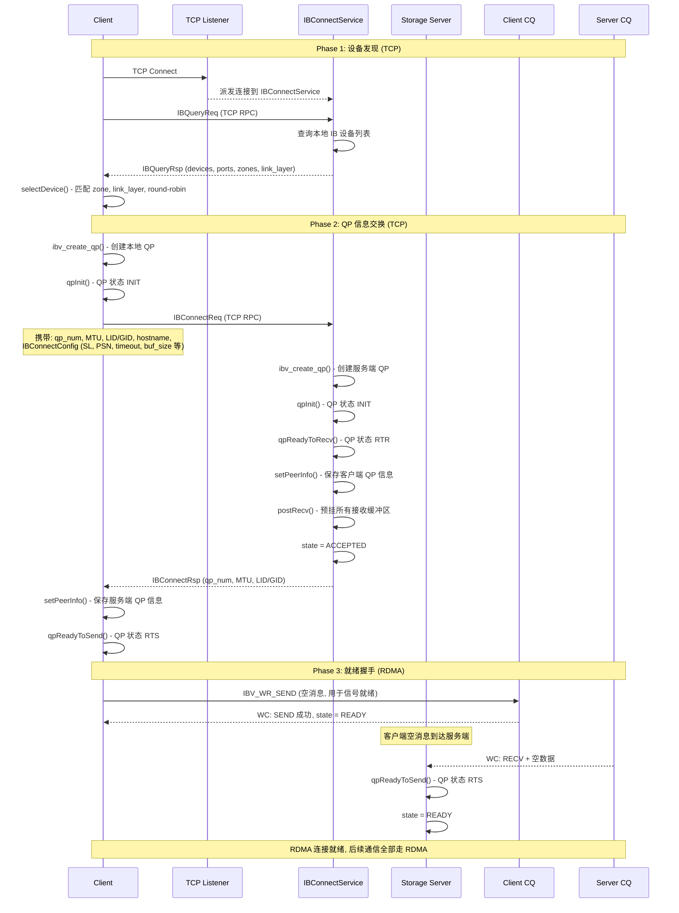
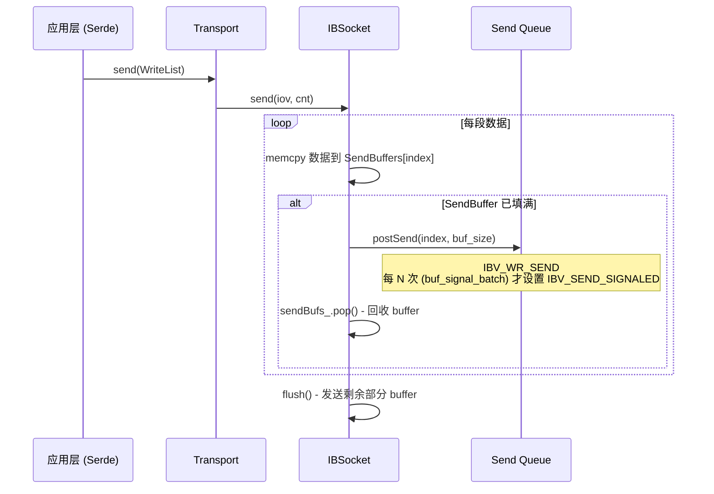
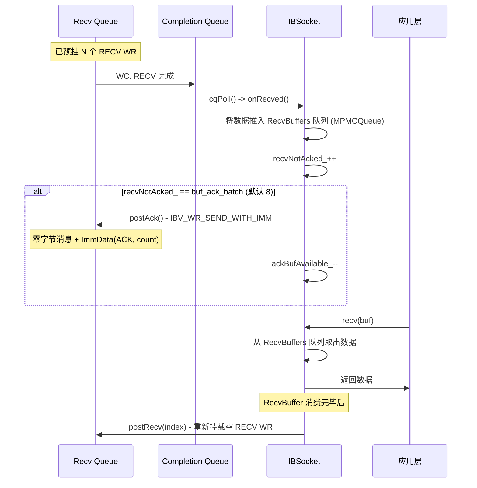
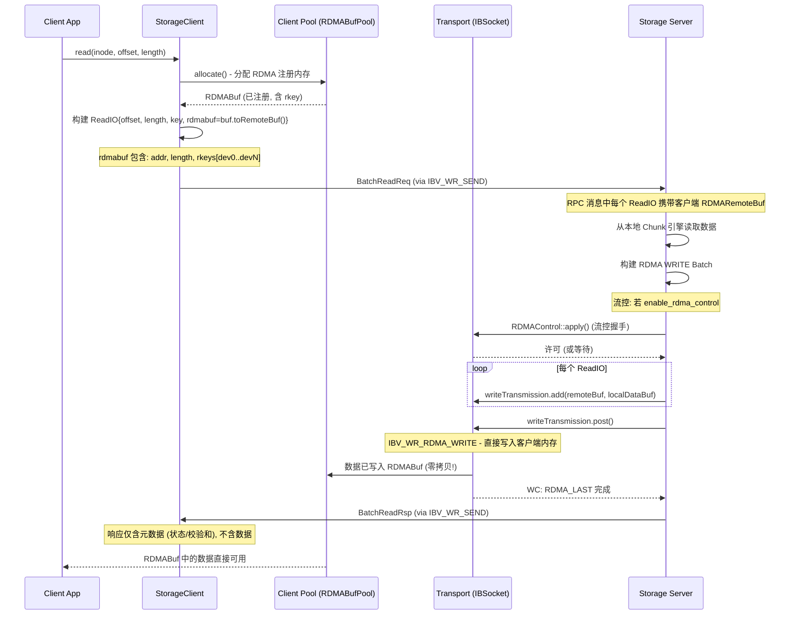
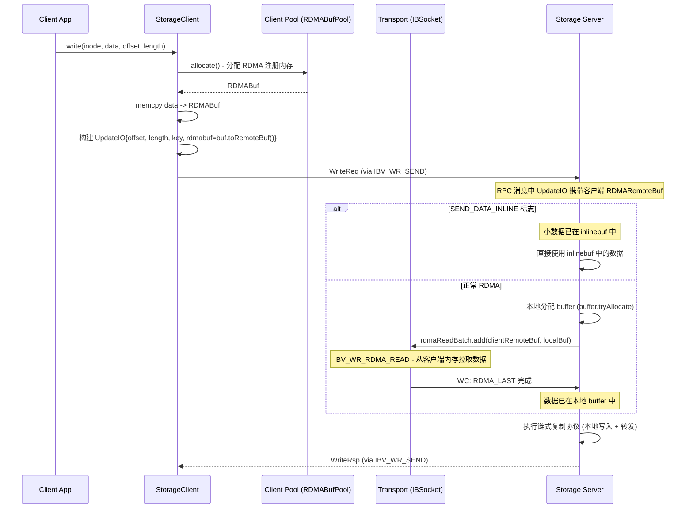
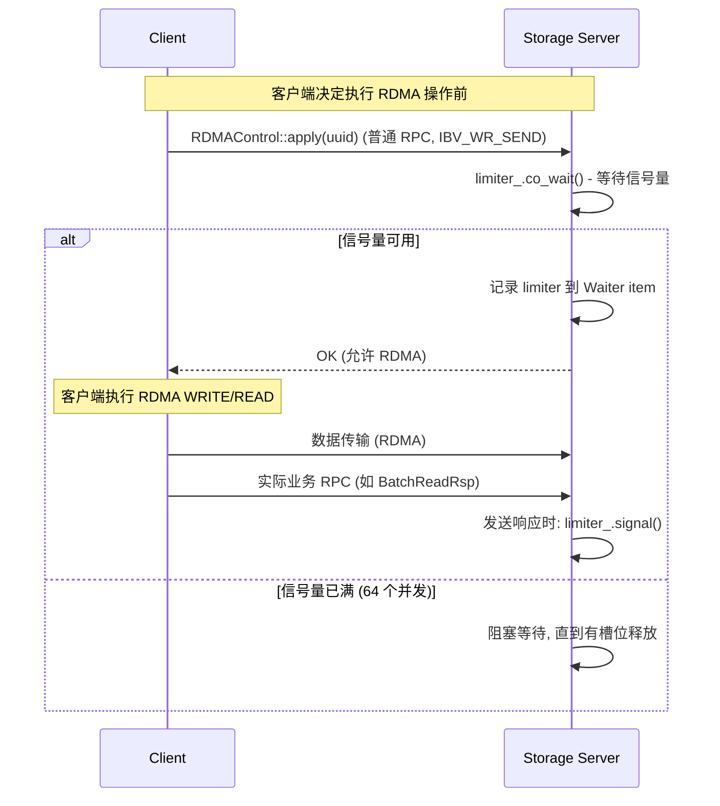
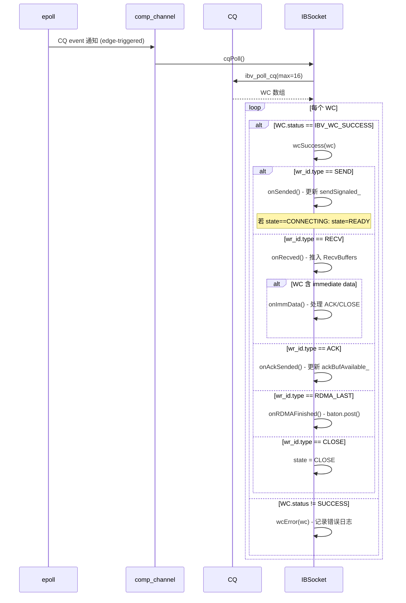

# 3FS RDMA 技术详解

## 概述

3FS 的整个网络通信栈基于 **InfiniBand/RoCE RDMA** 构建，RPC 消息和大块数据传输均通过 RDMA verbs 完成，TCP 仅作为连接协商的辅助通道和降级备选。核心实现位于 `src/common/net/ib/` 目录。

本文档详细描述 3FS 的 RDMA 架构、连接建立、数据传输、流控机制和性能优化。

### 架构总览

```
┌─────────────────────────────────────────────────────────────────┐
│                        应用层 RPC                                │
│  MetaClient / StorageClient / StorageOperator                    │
├─────────────────────────────────────────────────────────────────┤
│                     Serde RPC 框架                                │
│  MessagePacket (序列化/反序列化/压缩/校验)                        │
├─────────────────────────────────────────────────────────────────┤
│                    Transport 抽象层                               │
│  Transport.h - 统一的 send/recv 接口                             │
│  ┌──────────────────┐    ┌──────────────────────────────────┐   │
│  │   TcpSocket      │    │          IBSocket                │   │
│  │   (降级备选)       │    │                                  │   │
│  │                  │    │  IBV_WR_SEND/RECV    (RPC 消息)   │   │
│  │   kernel TCP     │    │  IBV_WR_RDMA_WRITE   (读响应)     │   │
│  │   send/recv      │    │  IBV_WR_RDMA_READ    (写请求)     │   │
│  │                  │    │  IBV_WR_SEND_WITH_IMM (ACK)       │   │
│  └──────────────────┘    └──────────────────────────────────┘   │
├─────────────────────────────────────────────────────────────────┤
│                     IB Verbs / rdma-core                         │
│  ibv_create_qp, ibv_post_send, ibv_poll_cq, ibv_reg_mr         │
├─────────────────────────────────────────────────────────────────┤
│                  InfiniBand HCAs / RoCE NICs                    │
└─────────────────────────────────────────────────────────────────┘
```

---

## 一、IBSocket 核心 API

IBSocket 继承自 `Socket` 抽象接口，对外暴露与 TCP 完全一致的 `send()`/`recv()` API，同时额外提供 `rdmaRead()`/`rdmaWrite()` 方法。

### 1.1 操作类型对照

| 方法 | IB Verb | 用途 |
|------|---------|------|
| `send(buf)` | `IBV_WR_SEND` | 发送 RPC 消息（请求头、响应、小数据） |
| `recv(buf)` | 对端 `IBV_WR_SEND` | 接收 RPC 消息 |
| `rdmaRead(remote, local)` | `IBV_WR_RDMA_READ` | 从对端内存读取数据（写路径：服务端拉取客户端数据） |
| `rdmaWrite(remote, local)` | `IBV_WR_RDMA_WRITE` | 写入对端内存（读路径：服务端推送数据到客户端） |
| `postAck()` | `IBV_WR_SEND_WITH_IMM` | 发送 ACK（零字节 + immediate data） |

### 1.2 RDMA 操作的 WR 类型标识

每个 Work Request 的 `wr_id` 编码了类型和上下文，用于 CQ 完成时区分：

| WRType | 标识 | CQ 完成处理 |
|--------|------|------------|
| `SEND` | `pack(signalCount, SEND)` | 释放信号量计数，连接建立时触发状态转换 |
| `RECV` | `pack(bufIndex, RECV)` | 数据推入 RecvBuffers 队列，触发 ACK |
| `ACK` | `pack(nullptr, ACK)` | 更新 ackBufAvailable_ 计数器 |
| `RDMA` | `pack(ctx, RDMA)` | 中间 WR 完成，无操作 |
| `RDMA_LAST` | `pack(ctx, RDMA_LAST)` | 批次最后一个 WR，通知 baton 完成 |
| `CLOSE` | `pack(nullptr, CLOSE)` | 设置连接状态为 CLOSE |
| `CHECK` | `pack(nullptr, CHECK)` | 心跳检查完成 |

---

## 二、RDMA 连接建立

3FS 不使用原生 RDMA CM（Connection Manager），而是通过 **TCP sideband** 协议交换 QP 信息。连接建立完成后，TCP 连接可关闭，后续所有通信走 RDMA。

### 2.1 连接建立时序图



### 2.2 QP 状态机

```
                  Client                            Server
                    │                                  │
              ibv_create_qp                    ibv_create_qp
                    │                                  │
              qpInit() ──> INIT                qpInit() ──> INIT
                    │                                  │
                    │                          qpReadyToRecv()
                    │                             (设置 rtr 参数)
                    │                                  │
                    │                                  │──> RTR
                    │                                  │   state = ACCEPTED
                    │                                  │
              setPeerInfo()                    setPeerInfo()
                    │                                  │
              qpReadyToSend()                        │
               (设置 rts 参数)                        │
                    │                                  │
                    │──> RTS                           │
                    │   state = CONNECTING             │
                    │                                  │
              postSend(空消息)                         │
                    │                                  │
              WC: SEND OK                             │
              state = READY                          │
                    │                                  │
                    │        ── RECV 空消息 ──>         │
                    │                          qpReadyToSend()
                    │                             (设置 rts 参数)
                    │                                  │
                    │                                  │──> RTS
                    │                                  │   state = READY
```

### 2.3 IB vs RoCE 区别

| 参数 | InfiniBand | RoCE (RDMA over Converged Ethernet) |
|------|-----------|-------------------------------------|
| 地址解析 | LID (Local ID) | GID (Global Identifier) + GRH |
| 路由 | Subnet Manager | Ethernet 交换机 |
| 连接参数 | `dlid`, `sl`, `pkey_index` | `dgid`, `sgid_index`, `traffic_class`, `hop_limit=255` |
| 配置字段 | `IBConnectIBInfo { lid }` | `IBConnectRoCEInfo { gid }` |

### 2.4 IBConnectConfig 参数

客户端和服务端通过 TCP 交换的连接参数：

| 参数 | 默认值 | 说明 |
|------|-------|------|
| `sl` | 0 | Service Level |
| `pkey_index` | auto | Partition Key |
| `traffic_class` | 0 | RoCE Traffic Class |
| `start_psn` | 0 | Packet Sequence Number 起始值 |
| `min_rnr_timer` | 1 | Receiver Not Ready 最小超时 |
| `timeout` | 14 | QP 超时 (单位 4.096us, 14 = ~67ms) |
| `retry_cnt` | 7 | 最大重试次数 |
| `rnr_retry` | 0 | RNR 重试次数 |
| `max_sge` | 16 | Scatter-Gather Element 上限 |
| `max_rdma_wr` | 128 | 最大挂起 RDMA WR 数 |
| `max_rdma_wr_per_post` | 32 | 单次 post_send 最大 WR 数 |
| `max_rd_atomic` | 16 | 最大原子 RDMA 操作数 |
| `buf_size` | 16384 | SEND/RECV 缓冲区大小 (16KB) |
| `send_buf_cnt` | 32 | 发送缓冲区数量 |
| `buf_ack_batch` | 8 | 每接收 N 个消息发送一次 ACK |
| `buf_signal_batch` | 8 | 每发送 N 个 WR 触发一次 CQ 信号 |

---

## 三、RPC 消息传输

### 3.1 消息发送 (IBV_WR_SEND)

RPC 请求和响应通过 `IBSocket::send()` 发送，内部实现为：



**关键优化**：
- **信号批量（Signal Batching）**：不是每个 SEND WR 都触发 CQ 信号，而是每 `buf_signal_batch`（默认 8）个 WR 才设置 `IBV_SEND_SIGNALED`，减少 CQ 中断频率
- **无锁环形缓冲区**：`SendBuffers` 使用原子 `frontIdx_`/`tailIdx_` 实现 lock-free ring buffer
- **预注册内存**：所有 SendBuffers 在连接建立时一次性分配并注册 MR，避免运行时 `ibv_reg_mr`

### 3.2 消息接收与 ACK



**ACK 机制**：
- 接收方每收到 `buf_ack_batch`（默认 8）个消息发送一次 ACK
- ACK 使用 `IBV_WR_SEND_WITH_IMM`（零字节 + 32 位 immediate data）
- ImmData 高 8 位为类型（`ACK` 或 `CLOSE`），低 24 位为计数
- `ackBufAvailable_` 原子计数器追踪可用 ACK WR 槽位，负值表示有待发送的 pending ACK

---

## 四、数据传输

### 4.1 传输模式选择

客户端根据数据大小选择传输模式：

| 条件 | 模式 | 传输方式 |
|------|------|---------|
| `requestedBytes < max_inline_read_bytes` | Inline | 数据内嵌在 RPC 响应中，memcpy |
| `requestedBytes >= max_inline_read_bytes` | RDMA | 服务端 RDMA WRITE 直接写入客户端注册内存 |
| `BYPASS_RDMAXMIT` 标志设置 | RDMA 无流控 | 跳过 RDMAControl 流控握手 |

### 4.2 读路径：服务端 RDMA WRITE 推送数据



### 4.3 写路径：服务端 RDMA READ 拉取数据



### 4.4 RDMA 批量操作

`IBSocket::rdmaBatch()` 对大量 RDMA 操作进行批量化处理：

```
例如一次 BatchReadReq 包含 64 个 ReadIO:

max_rdma_wr_per_post = 32

批次 1: WR[0..31]  ─── 仅最后一个设置 IBV_SEND_SIGNALED
                    ─── 其余 31 个为 unsignaled (减少 CQ 开销)

批次 2: WR[32..63] ─── 仅最后一个 signaled

两个批次可通过 folly::coro::collectAllRange 并发执行
```

**关键优化**：
- **仅最后一个 WR 设置信号**：中间 WR 无需等待 CQ，硬件自动按序完成
- **BatchSemaphore 流控**：`rdmaSem_` 限制每个 Socket 上挂起的 RDMA WR 总数（`max_rdma_wr`），防止 SEND Queue 溢出
- **Split by max_rdma_wr_per_post**：大批量操作拆分为多个 `ibv_post_send` 调用，避免单次提交过多 WR

---

## 五、流控机制

3FS 在多个层级实现了 RDMA 流控，防止服务端或网卡被过载。

### 5.1 三层流控架构

```
┌─────────────────────────────────────────────┐
│ Layer 1: 全局传输流控 (RDMAControl RPC)       │
│ 限制服务端同时处理的 RDMA 传输数量              │
│ 默认 max_concurrent_transmission = 64        │
├─────────────────────────────────────────────┤
│ Layer 2: Per-Socket WR 流控 (rdmaSem_)        │
│ 限制每个 IBSocket 上挂起的 RDMA WR 总数        │
│ 默认 max_rdma_wr = 128                       │
├─────────────────────────────────────────────┤
│ Layer 3: Per-Device 流控 (StorageOperator)    │
│ 限制每张 IB 网卡上的并发 RDMA 操作数            │
│ per-device semaphore                         │
└─────────────────────────────────────────────┘
```

### 5.2 全局传输流控 (RDMAControl)



**设计要点**：
- `RDMAControl` 是一个普通 serde 服务（Service ID=10），通过 IBV_WR_SEND 发送
- 服务端在 `apply()` 中 `co_await limiter_.co_wait()`，请求会排队等待
- 信号量在**响应实际发送时**释放（`Waiter::post()` 中调用 `limiter->signal()`），而非 RDMA 完成时
- 客户端通过 `enable_rdma_control` 配置启用

### 5.3 Per-Socket WR 流控

```cpp
// IBSocket.h
folly::fibers::BatchSemaphore rdmaSem_{0};  // 初始值为 0

// QP 进入 RTS 时
rdmaSem_.changeUsableTokens(config_.max_rdma_wr);  // 设为 128

// 每次 rdmaPost 前
co_await rdmaSem_.co_wait();  // 获取信号量
// ... ibv_post_send ...
// CQ 完成时
rdmaSem_.signal();  // 释放信号量
```

### 5.4 Per-Device 流控

Storage Server 为每张 IB 网卡维护独立的并发信号量，防止单张网卡成为瓶颈：

```cpp
// StorageOperator.cc
struct PerDeviceSema {
    folly::fibers::BatchSemaphore sema;
    std::string deviceName;
};
// 每个 RDMA 操作前: co_await guard.co_wait()
```

---

## 六、内存管理

### 6.1 内存注册

RDMA 操作要求内存提前注册（`ibv_reg_mr`），3FS 支持两种注册模式：

| 模式 | 类 | 说明 |
|------|-----|------|
| 连接缓冲区 | `IBSocket::BufferMem` | 每个连接分配，SEND/RECV 缓冲区复用同一块注册内存 |
| 数据缓冲区 | `RDMABufPool` | 全局缓冲池，为文件 I/O 数据分配 RDMA 注册内存 |

**注册标志**：

```cpp
// Socket SEND/RECV buffers
IBV_ACCESS_LOCAL_WRITE | IBV_ACCESS_RELAXED_ORDERING

// 数据 buffers (RDMABuf)
IBV_ACCESS_LOCAL_WRITE | IBV_ACCESS_REMOTE_WRITE |
IBV_ACCESS_REMOTE_READ | IBV_ACCESS_RELAXED_ORDERING
```

- `IBV_ACCESS_REMOTE_WRITE`：允许对端 RDMA WRITE 写入（读路径：服务端推送数据）
- `IBV_ACCESS_REMOTE_READ`：允许对端 RDMA READ 读取（写路径：服务端拉取数据）
- `IBV_ACCESS_RELAXED_ORDERING`：放宽内存排序约束，提升性能

### 6.2 多设备支持

3FS 支持最多 4 张 IB 网卡（`kMaxDeviceCnt = 4`）：

```
                    ┌─────────────┐
                    │  RDMABuf     │
                    │  (用户数据)   │
                    └──────┬──────┘
                           │
              ┌────────────┼────────────┐
              │            │            │
        ┌─────┴───┐ ┌────┴────┐ ┌────┴───┐
        │ mr[0]   │ │ mr[1]   │ │ mr[2]  │  (每张网卡一个 MR)
        │ dev=mlx5_0│ dev=mlx5_1│ dev=mlx5_2│
        └─────┬───┘ └────┬────┘ └────┬───┘
              │            │            │
         rkey[0]      rkey[1]      rkey[2]

RDMARemoteBuf { addr, length, rkeys: [(rkey,devId), ...] }
```

`RDMARemoteBuf` 在序列化时携带所有设备的 rkey，接收方根据实际使用的网卡设备查找对应 rkey。

### 6.3 缓冲池 (RDMABufPool)

```cpp
class RDMABufPool {
    folly::fibers::Semaphore semaphore_;  // 限制并发分配数
    std::deque<Inner*> freeList_;         // 空闲缓冲区列表
    size_t bufSize_;                      // 每个 buffer 大小

    CoTask<RDMABuf> allocate();   // 从池中获取, 满则等待
    void deallocate(RDMABuf);     // 归还到池中
};
```

- 使用协程友好的 `folly::fibers::Semaphore`，无锁等待
- 缓冲区按需注册 MR，首次分配时注册，归还后保留 MR 供复用
- 支持用户自定义 buffer（`createFromUserBuffer`），外部分配后注册

### 6.4 连接缓冲区布局

每个 IBSocket 在 `initBufs()` 中一次性分配所有 SEND/RECV 缓冲区：

```
┌─────────────────────────────────────────────┐
│           单次 memalign 分配                  │
│                                              │
│  ┌──────┐ ┌──────┐ ... ┌──────┐             │
│  │SEND  │ │SEND  │     │SEND  │  send_buf_cnt  │
│  │BUF 0 │ │BUF 1 │     │BUF N │  个发送缓冲区   │
│  └──────┘ └──────┘ ... └──────┘             │
│  ┌──────┐ ┌──────┐ ... ┌──────┐             │
│  │RECV  │ │RECV  │     │RECV  │  send_buf_cnt + │
│  │BUF 0 │ │BUF 1 │     │BUF M │  buf_ack_batch  │
│  └──────┘ └──────┘ ... └──────┘  个接收缓冲区   │
│                                              │
├──────────────────────────────────────────────┤
│  单次 ibv_reg_mr 注册整个区域                   │
│  flags: LOCAL_WRITE | RELAXED_ORDERING       │
└─────────────────────────────────────────────┘
```

---

## 七、CQ 完成处理

### 7.1 轮询模型

每个 IBSocket 拥有独立的 CQ 和 `ibv_comp_channel`，通过 **edge-triggered epoll** 监听：



### 7.2 错误处理

IBSocket 对 RDMA 错误的处理策略：

| 错误类型 | 处理方式 |
|---------|---------|
| `IBV_WC_RETRY_EXC_ERR` | QP 进入 error 状态，连接关闭 |
| `IBV_WC_RNR_RETRY_EXC_ERR` | QP 进入 error 状态 |
| `IBV_WC_WR_FLUSH_ERR` | 忽略（正常关闭时的残留 WR） |
| 其他错误 | 记录日志，根据严重程度决定是否关闭连接 |

---

## 八、性能优化总结

| 优化技术 | 实现位置 | 效果 |
|---------|---------|------|
| **Signal Batching** | `postSend()` 每 N 个 WR 才 CQ 信号 | 减少 CQ 中断 ~8x |
| **Unsignaled RDMA Batch** | 仅批次最后一个 WR 设置信号 | 大批量 RDMA 操作开销趋近 O(1) |
| **预注册内存** | `BufferMem::create()` 一次性注册 | 消除运行时 `ibv_reg_mr` 开销 |
| **Lock-free Ring Buffer** | `SendBuffers` 原子 front/tail | 无锁 send 路径 |
| **MPMC Queue** | `RecvBuffers` 多生产者多消费者 | CQ 线程与 recv 协程并发安全 |
| **Zero-copy 数据传输** | RDMA READ/WRITE 直接访问对端内存 | 大数据传输零 CPU 拷贝 |
| **Inline 小数据** | `SEND_DATA_INLINE` 标志 | 小请求避免 RDMA 建立开销 |
| **ACK 批量确认** | 每 `buf_ack_batch` 个 RECV 发一次 ACK | 减少 ACK 消息数 ~8x |
| **多层流控** | 全局 + Socket + Device 三级信号量 | 防止网卡/CPU 过载 |
| **多设备并行** | 最多 4 张 IB/RoCE 网卡 | 横向扩展带宽 |
| **Relaxed Ordering** | `IBV_ACCESS_RELAXED_ORDERING` | 放宽内存排序，提升硬件吞吐 |
| **TCP Sideband** | 连接建立用 TCP，数据用 RDMA | 兼容 CM 不稳定的部署环境 |

---

## 九、配置参数索引

| 配置项 | 默认值 | 位置 | 说明 |
|-------|-------|------|------|
| `force_use_tcp` | false | `net::Client` | 强制使用 TCP |
| `enable_rdma_control` | false | `net::Client` | 启用 RDMA 传输流控 |
| `buf_size` | 16384 | `IBSocket` | SEND/RECV 缓冲区大小 |
| `send_buf_cnt` | 32 | `IBSocket` | 发送缓冲区数量 |
| `max_rdma_wr` | 128 | `IBSocket` | 每连接最大挂起 RDMA WR |
| `max_rdma_wr_per_post` | 32 | `IBSocket` | 单次 post 最大 WR |
| `buf_ack_batch` | 8 | `IBSocket` | ACK 批量大小 |
| `buf_signal_batch` | 8 | `IBSocket` | CQ 信号批量大小 |
| `max_concurrent_transmission` | 64 | `RDMAControl` | 全局 RDMA 传输并发上限 |
| `max_inline_read_bytes` | - | `StorageClient` | 内联读阈值 |

---

## 十、关键文件索引

| 文件 | 职责 |
|------|------|
| `src/common/net/Socket.h` | Socket 抽象接口 (send/recv/flush) |
| `src/common/net/Transport.h` | Transport 封装 (TCP/RDMA 统一接口) |
| `src/common/net/Client.h` | 网络客户端 (RDMA/TCP 选择) |
| `src/common/net/Processor.h` | 消息处理器 (请求分发/响应) |
| `src/common/net/RDMAControl.h` | RDMA 全局流控服务 |
| `src/common/net/ib/IBSocket.h/.cc` | RDMA Socket 核心实现 |
| `src/common/net/ib/IBDevice.h/.cc` | IB 设备管理 (PD/CQ/MR) |
| `src/common/net/ib/RDMABuf.h/.cc` | RDMA 缓冲池与远程缓冲描述符 |
| `src/common/net/ib/IBConnect.h/.cc` | TCP sideband 连接协议 |
| `src/common/net/ib/IBConnectService.h/.cc` | 服务端连接 RPC (query/connect) |
| `src/common/net/Listener.cc` | 服务端监听 (TCP + RDMA accept) |
| `src/common/serde/ClientContext.h/.cc` | RPC 客户端上下文 (RDMATransmission) |
| `src/common/serde/CallContext.h/.cc` | RPC 服务端上下文 (RDMA WRITE/READ) |
| `src/fbs/storage/Common.h` | ReadIO/UpdateIO (rdmabuf 字段) |
| `src/storage/service/StorageOperator.cc` | 存储层 RDMA 读写实现 |
| `src/client/storage/StorageClientImpl.cc` | 客户端 RDMA 读写发起 |
