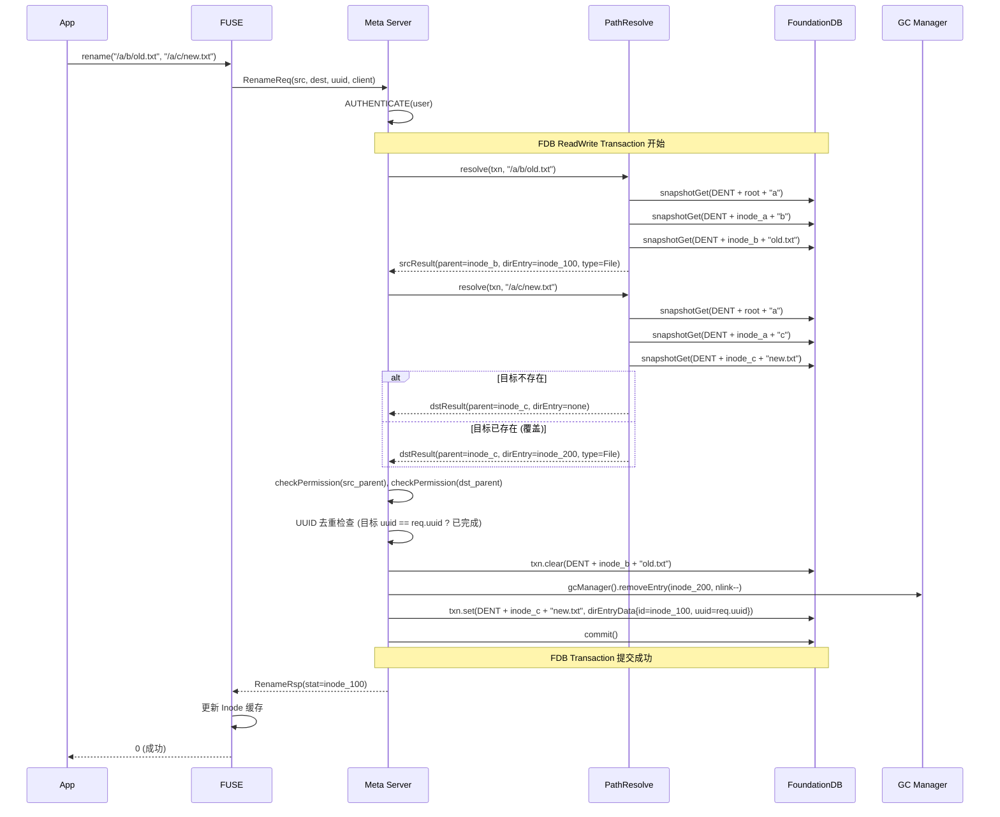
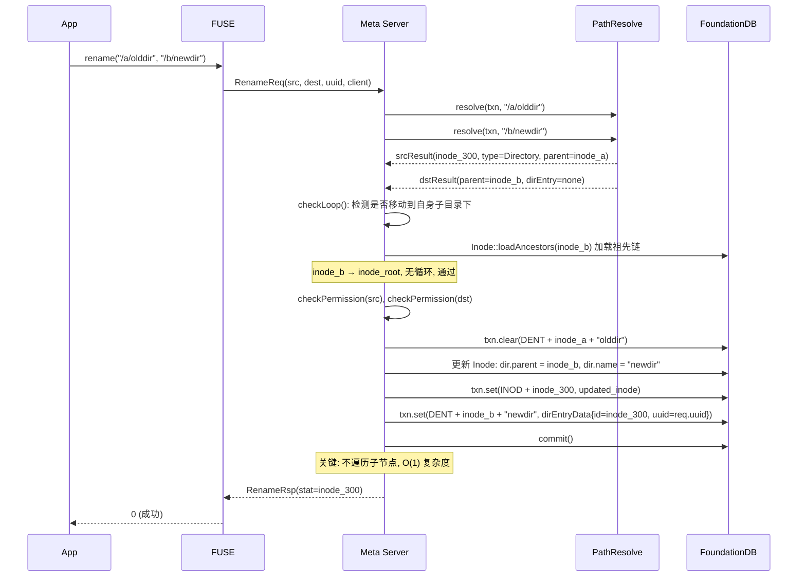
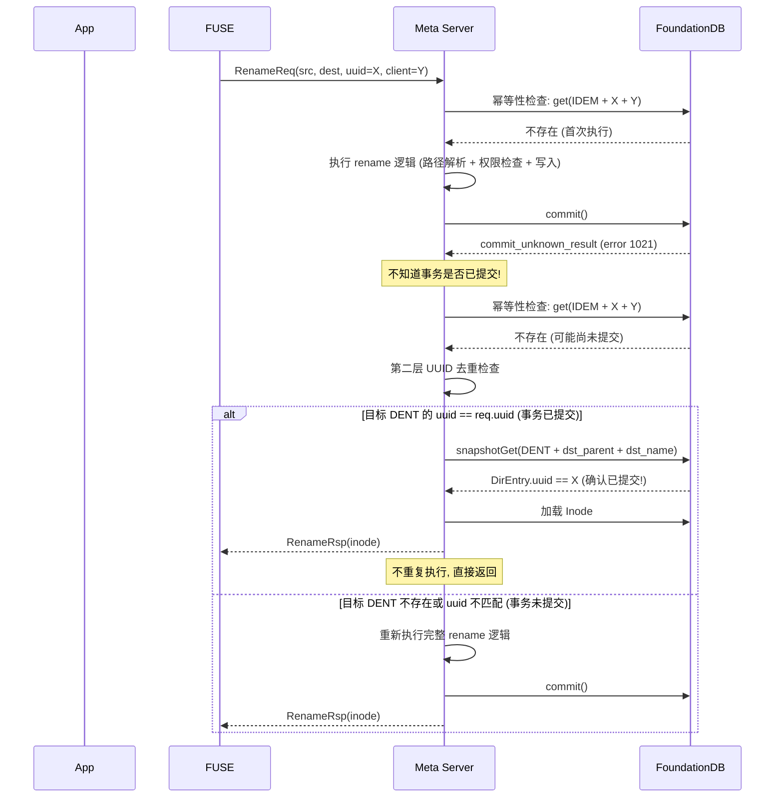
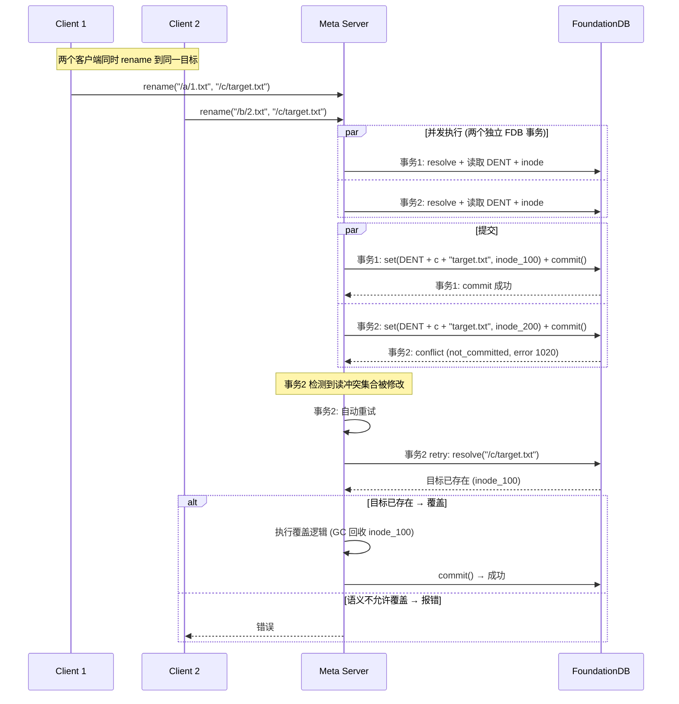

# 3FS Rename 实现原理

## 一、概览

3FS 的 rename 是一个**单 FDB 事务**的原子操作，将旧目录项（DENT）删除、新目录项创建、Inode 更新（目录场景）合并为一个不可分割的提交。对于跨目录、覆盖目标、目录移动等场景，实现方式完全统一，没有特殊分支。

---

## 二、核心数据结构

### RenameReq / RenameRsp

```
RenameReq {
  user: UserInfo              // 操作者身份
  src: Path                   // 源路径 /a/b/old_name
  dest: Path                  // 目标路径 /a/c/new_name
  uuid: Uuid                  // 幂等性请求 ID
  client: ClientId            // 客户端 ID
  moveToTrash: bool           // 是否移到回收站
}

RenameRsp {
  stat: Inode                 // 源 Inode 的最新元数据 (重命名后)
}
```

### 语义：遵循 POSIX rename(2)

| 场景 | 行为 |
|------|------|
| 源是文件, 目标不存在 | 直接移动 |
| 源是文件, 目标是文件 | **原子覆盖**目标文件 (GC 回收旧文件) |
| 源是文件, 目标是空目录 | 报错 `kNotDirectory` |
| 源是目录, 目标不存在 | 直接移动 (O(1), 不遍历子节点) |
| 源是目录, 目标是空目录 | **原子替换**目标目录 |
| 源是目录, 目标是文件 | 报错 `kIsDirectory` |
| 源是目录, 目标是非空目录 | 报错 `kNotEmpty` |
| 源和目标是同一个 | 直接返回 Inode, 不做任何修改 |

---

## 三、FDB 事务内容

### 3.1 读取的 Key

```
事务内读取 (snapshotGet, 不加入读冲突集):
  ├── 路径解析: 每个 DENT (DENT + parent + name)
  └── ACL 缓存: 父目录 Inode 的 ACL

事务内读取 (get, 加入读冲突集):
  ├── 源父目录 Inode (INOD + parent1)
  ├── 源 DENT (DENT + parent1 + old_name)
  ├── 目标父目录 Inode (INOD + parent2)
  ├── 目标 DENT (DENT + parent2 + new_name) [如果存在]
  └── 源 Inode (INOD + src_inodeId)

显式加入读冲突集 (addReadConflict, 不实际读取):
  ├── INOD + src_parent_id
  ├── DENT + src_parent + src_name
  ├── INOD + dst_parent_id
  └── DENT + dst_parent + dst_name

目录重命名额外:
  └── 目标路径的所有祖先 Inode (直到 root)
```

### 3.2 写入的 Key

```
单个 FDB 事务内的所有写入:

  1. txn.clear(DENT + src_parent + src_name)     ← 删除源目录项
  2. 覆盖处理 (如果目标存在):
     ├── 文件: GC 管理 (nlink--, 创建 GC 条目)
     ├── 空目录: txn.clear(INOD + dst_inode_id)
     └── 符号链接: nlink--, 更新 Inode
  3. txn.set(DENT + dst_parent + dst_name, new_dir_entry_data)  ← 创建新目录项
     └── new_dir_entry_data.uuid = req_.uuid (用于幂等去重)
  4. 目录重命名: txn.set(INOD + src_inode_id, updated_inode_data)
     └── 更新 Directory.parent 和 Directory.name
```

**所有写入在同一个 FDB 事务中，要么全部提交，要么全部回滚。**

---

## 四、时序流程图

### 4.1 正常 rename 流程 (文件)



### 4.2 目录 rename 流程



### 4.3 幂等性处理 (commit_unknown_result)



### 4.4 并发冲突处理



---

## 五、关键设计点

### 5.1 O(1) 目录重命名

```
rename("/a/olddir", "/b/newdir"):

  只修改 3 个 Key:
    1. clear(DENT + inode_a + "olddir")     ← 删除旧目录项
    2. set(INOD + inode_300, updated_dir)    ← 更新目录 Inode 的 parent 和 name
    3. set(DENT + inode_b + "newdir", data)  ← 创建新目录项

  不修改的内容:
    ├── 子目录的 DENT 不变 (仍指向正确的 Inode)
    ├── 子文件的 DENT 不变 (仍指向正确的 Inode)
    ├── 子 Inode 不变
    └── 孙子目录的 Inode.parent 也不变 (指向其直接父目录)

  为什么正确?
    /a/olddir/x/y.txt 的路径查找:
      root → "a" → inode_a → "olddir" → inode_300 → "x" → inode_x → "y.txt"
    改名后:
      /b/newdir/x/y.txt 的路径查找:
      root → "b" → inode_b → "newdir" → inode_300 → "x" → inode_x → "y.txt"
                                              ↑ 同一个 Inode!
    inode_300 的 parent 已更新为 inode_b, 但子节点不需要感知这个变化
```

### 5.2 两层幂等性保护

```
第一层: IDEM 幂等记录 (FDB Key)
  ├── Key: IDEM + requestId + clientId
  ├── Value: RenameRsp (序列化结果)
  ├── 触发条件: checkUuid() && (moveToTrash || idempotent_rename)
  └── 默认关闭 (idempotent_rename = false)

第二层: UUID 去重 (DENT 内嵌)
  ├── 创建新 DENT 时写入 uuid = req_.uuid
  ├── 重试时检查: 目标 DENT.uuid == req_.uuid ?
  ├── 如果匹配 → 之前已提交, 直接返回
  └── 始终生效, 不依赖配置开关
```

### 5.3 FDB 读冲突集优化

```
部分路径解析使用 snapshotGet (不加读冲突集):
  ├── 减少冲突概率 (两个不相关的 rename 不会互相冲突)
  └── 路径中间节点的变更不触发重试

关键 Key 显式加入读冲突集 (addReadConflict):
  ├── 源 DENT 和目标 DENT (防止两个 rename 写同一目标)
  ├── 源父 Inode 和目标父 Inode (防止父目录被并发删除)
  └── 目录重命名: 目标祖先链 Inode (防止移动到自身子树下)
```

### 5.4 覆盖目标的安全处理

```
覆盖文件:
  1. GC 管理: nlink--, 不立即删除 Chunk 数据
  2. Chunk 数据由后台 GC 任务异步回收
  3. 如果有活跃写会话, GC 延迟到所有 fd 关闭

覆盖空目录:
  1. 直接 txn.clear(INOD + dst_inode_id) 删除目录 Inode
  2. 无子节点, 无需递归

覆盖非空目录:
  1. 返回 kNotEmpty 错误
  2. 符合 POSIX 语义
```

---

## 六、与 POSIX rename(2) 的对比

| 语义 | POSIX rename(2) | 3FS 实现 | 一致? |
|------|----------------|---------|------|
| 原子性 | 源和目标的替换是原子的 | 单 FDB 事务, 原子提交 | 是 |
| 覆盖文件 | 原子替换 | 单事务内 clear + set | 是 |
| 覆盖非空目录 | EEXIST | kNotEmpty | 是 |
| 目录移动到自身子树下 | EINVAL | checkLoop 检测 | 是 |
| 打开的文件被 rename | fd 仍有效 (指向同一 inode) | Inode 不变, fd 缓存仍有效 | 是 |
| O(1) 目录 rename | 是 (POSIX 不要求, 但普遍实现) | 是 (只改 DENT + Inode.parent) | 是 |
| Sticky bit | 非属主/目录属主/root 不能删除 | 检查 S_ISVTX | 是 |
| 跨文件系统 rename | EXDEV | 单集群内无文件系统边界 | N/A |

---

## 七、性能特征

| 维度 | 特征 | 说明 |
|------|------|------|
| **延迟** | 1 次 FDB 事务 (网络往返 ~1ms) | 所有读写在一个事务内 |
| **吞吐** | 受 FDB 事务冲突率限制 | 并发 rename 同一目标会触发重试 |
| **复杂度** | O(D) 路径深度 | 路径解析 + 目录重命名的祖先链检查 |
| **空间** | O(1) | 不创建临时副本, 不拷贝数据 |
| **GC 开销** | 覆盖文件时异步 GC Chunk | 不阻塞 rename 操作 |

---
