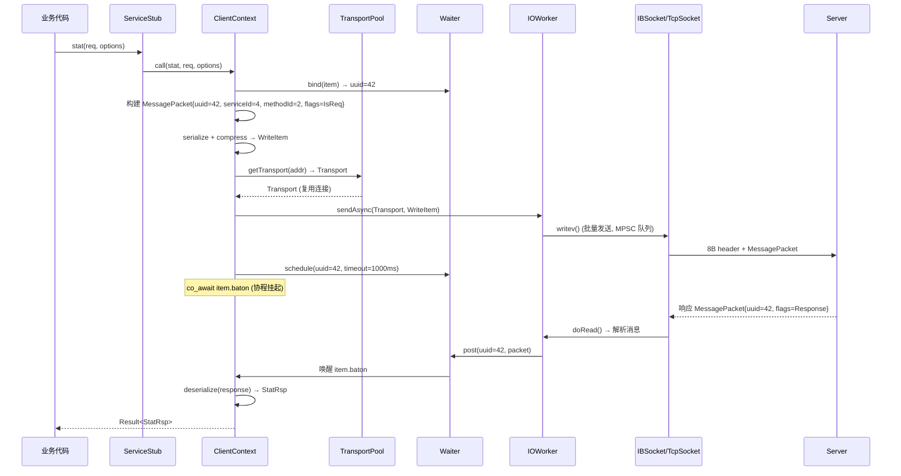
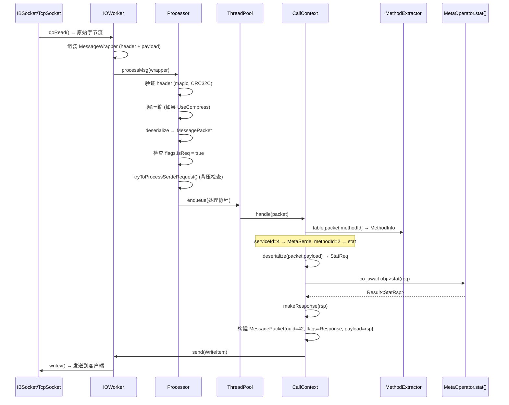

# 3FS RPC 框架详解

## 一、概览

3FS 使用**自研的 Serde RPC 框架**，无外部依赖，直接构建在 RDMA/TCP 传输层之上。整个框架基于 C++20 编译期反射和 Folly 协程实现。

```
┌────────────────────────────────────────────────────────┐
│  业务层                                                 │
│  MetaSerde (ID=4): stat, create, rename, ...           │
│  StorageSerde (ID=3): batchRead, write, update, ...    │
├────────────────────────────────────────────────────────┤
│  RPC 框架 (Serde RPC)                                  │
│  ┌──────────────┐  ┌──────────────┐  ┌──────────────┐ │
│  │ Service 定义  │  │ 消息序列化    │  │ 协程调度     │ │
│  │ 宏 + 反射     │  │ DownwardBytes│  │ folly::coro  │ │
│  └──────────────┘  └──────────────┘  └──────────────┘ │
│  ┌──────────────┐  ┌──────────────┐  ┌──────────────┐ │
│  │ 连接管理      │  │ 请求/响应匹配 │  │ 超时/重试    │ │
│  │ TransportPool│  │ Waiter(uuid) │  │ Timer min-heap│ │
│  └──────────────┘  └──────────────┘  └──────────────┘ │
├────────────────────────────────────────────────────────┤
│  传输层                                                 │
│  IBSocket (RDMA RC) ← 主传输 | TcpSocket ← 管理/备选  │
└────────────────────────────────────────────────────────┘
```

---

## 二、为什么不使用 gRPC / Thrift / brpc

| 维度 | 3FS 自研 RPC | gRPC | brpc |
|------|-------------|------|------|
| 传输协议 | **RDMA RC (原生)** | HTTP/2 over TCP | TCP |
| 数据传输 | **RDMA WRITE/READ 零拷贝** | 内存拷贝 (2 次) | 内存拷贝 (2 次) |
| 序列化 | **DownwardBytes** (自研) | Protobuf | Protobuf |
| 延迟 | **~1μs** | ~100μs+ | ~50μs+ |
| 外部依赖 | **无** | protobuf, grpc | protobuf, brpc |
| 代码生成 | **宏 + 编译期反射** | protoc 生成 | protoc 生成 |
| 连接复用 | 多路复用 (uuid 匹配) | HTTP/2 stream | 多路复用 |

**核心原因**：gRPC 基于 HTTP/2 + TCP，即使有 RDMA 网卡也走内核协议栈，无法实现 RDMA 零拷贝。3FS 自研 RPC 的唯一目的就是**深度绑定 RDMA 传输**。

---

## 三、消息格式

### 3.1 线上格式

```
┌──────────────────────────────────────────┐
│ MessageHeader (8 bytes)                  │
├──────────────┬───────────────────────────┤
│  checksum    │         size              │
│  (4 bytes)   │        (4 bytes)          │
│              │                           │
│  低 8 位:    │  serde 序列化的           │
│    magic=0x86│  MessagePacket 长度        │
│    + 压缩标志 │  (不含 header)            │
│  高 24 位:   │                           │
│    CRC32C    │                           │
├──────────────┴───────────────────────────┤
│ MessagePacket (size bytes, serde 序列化)  │
│                                          │
│  uuid:       uint64 (关联 ID)            │
│  serviceId:  uint16 (服务 ID)            │
│  methodId:   uint16 (方法 ID)            │
│  flags:      uint16 (IsReq/压缩/RDMA)    │
│  version:    Version (协议版本)           │
│  payload:    Payload<T> (请求/响应体)     │
│  timestamp:  optional (端到端延迟追踪)     │
└──────────────────────────────────────────┘
```

### 3.2 关键字段

| 字段 | 大小 | 说明 |
|------|------|------|
| `checksum` | 4B | magic(0x86) + 压缩标志 + CRC32C 校验 |
| `size` | 4B | MessagePacket 序列化长度 |
| `uuid` | 8B | 关联 ID，用于请求/响应匹配 |
| `serviceId` | 2B | 目标服务 ID（直接数组索引，O(1) 查找） |
| `methodId` | 2B | 服务内方法 ID（编译期分发表，O(1) 查找） |
| `flags.IsReq` | 1 bit | 区分请求(1)和响应(0) |
| `flags.UseCompress` | 1 bit | ZSTD 压缩 (>128KB 时启用) |
| `flags.ControlRDMA` | 1 bit | RDMA 控制消息 |

---

## 四、服务定义

### 4.1 服务定义宏

```cpp
// src/fbs/meta/Service.h
SERDE_SERVICE(MetaSerde, 4) {
  SERDE_SERVICE_METHOD(stat,       1,  StatReq,       StatRsp);
  SERDE_SERVICE_METHOD(create,     3,  CreateReq,     CreateRsp);
  SERDE_SERVICE_METHOD(remove,     7,  RemoveReq,     RemoveRsp);
  SERDE_SERVICE_METHOD(open,       8,  OpenReq,       OpenRsp);
  SERDE_SERVICE_METHOD(sync,       9,  SyncReq,       SyncRsp);
  SERDE_SERVICE_METHOD(close,      10, CloseReq,      CloseRsp);
  SERDE_SERVICE_METHOD(rename,     11, RenameReq,     RenameRsp);
  SERDE_SERVICE_METHOD(batchStat,  20, BatchStatReq,  BatchStatRsp);
  // ... 共 20+ 方法
};

// src/fbs/storage/Service.h
SERDE_SERVICE(StorageSerde, 3) {
  SERDE_SERVICE_METHOD(batchRead,  1,  BatchReadReq,  BatchReadRsp);
  SERDE_SERVICE_METHOD(write,      2,  WriteReq,      WriteRsp);
  SERDE_SERVICE_METHOD(update,     3,  UpdateReq,     UpdateRsp);
  SERDE_SERVICE_METHOD(removeChunks, 7, RemoveChunksReq, RemoveChunksRsp);
  // ... 共 15+ 方法
};
```

宏展开后生成：

```
SERDE_SERVICE(MetaSerde, 4)
  → struct MetaSerde<T> : ServiceBase<"MetaSerde", 4>

SERDE_SERVICE_METHOD(stat, 1, StatReq, StatRsp)
  → 服务端: MethodInfo<"stat", T, StatReq, StatRsp, 1, &T::stat>
  → 客户端: static stat(req, options) → ctx.call<MethodInfo>(req)
```

### 4.2 编译期方法分发表

```cpp
// MethodExtractor: 编译期构建 methodId → 处理函数 的映射
template <class T, class C>
class MethodExtractor {
  consteval MethodExtractor() {
    for (uint16_t i = 0; i <= kMaxThreadId; ++i) {
      table[i] = calc(i);  // 递归匹配 method ID → MethodInfo
    }
  }
  std::array<Method, kMaxThreadId + 1> table;  // constexpr 数组
};
```

调度过程：`methodId → table[methodId] → handler()`，**O(1)** 复杂度，零运行时开销。

---

## 五、客户端调用流程



### 5.1 关键机制

**请求/响应匹配（多路复用）**：

```
单连接上可以同时有 N 个 in-flight RPC:
  ┌── uuid=42: stat()    → 等待中
  ├── uuid=43: create()  → 等待中
  ├── uuid=44: sync()    → 等待中
  └── uuid=45: stat()    → 等待中

Waiter 内部:
  ConcurrentHashMap<uint64_t, Item> map;  // uuid → 等待项
  Timer min_heap;                         // 超时定时器

响应到达时: Waiter::post(uuid, packet) → 查找 map → 唤醒对应协程
```

**超时**：

```
Waiter 有专用定时器线程 (min-heap):
  schedule(uuid=42, timeout=1000ms)
  → 1 秒后检查是否已响应
  → 未响应 → 设置错误状态, 唤醒协程
  → 已响应 → 取消定时器
```

**重试**：

```
两层重试:
  传输层重试: sendRetryTimes=1, WriteList.extractForRetry()
  应用层重试: RetryConfig{init_wait=10s, max_wait=30s, max_retry_time=60s}
  快速重试: kMaybeCommitted 错误立即重试 (无退避)
```

---

## 六、服务端处理流程



### 6.1 服务端线程池

```
每个 ServiceGroup 使用 4 个线程池:

  procThreadPool (CPU 密集):
    ├── 请求反序列化
    ├── 方法分发
    └── 业务逻辑执行

  ioThreadPool (I/O 密集):
    ├── Transport 读写
    └── 消息组装/拆包

  bgThreadPool (后台):
    └── 连接健康检查

  connThreadPool (阻塞):
    └── 连接建立 (TCP connect, RDMA CM)

背压:
  max_processing_requests_num = 4096
  max_coroutines_num = 256
  超限返回 kRequestRefused
```

---

## 七、连接管理

### 7.1 TransportPool

```
连接池结构:

  全局池 (32 分片):
    robin_hood::unordered_map<Address, TransportSet>

  线程本地缓存 (ThreadLocal):
    unordered_map<Address, weak_ptr<Transport>> ← 无锁查询

  TransportSet (每个地址):
    ├── max_connections = 1 (默认, 可配置)
    ├── 随机选择: rand32() % max_connections
    └── 健康检查: 定期 poll() 检测连接存活

查找优先级:
  1. ThreadLocal 缓存 (0 开销)
  2. 全局池 (加锁, 32 分片降低竞争)
  3. 新建连接
```

### 7.2 RDMA 连接建立

```
两阶段建立:

  Phase 1: TCP 连接
    Client → Server: TCP SYN/SYN-ACK/ACK
    (用于交换 RDMA 连接参数)

  Phase 2: RDMA QP 建立
    Client → Server: RDMA CM REQ
    Server → Client: RDMA CM REP / RTU
    QP 状态: RESET → INIT → RTR → RTS

  之后: 所有数据通过 RDMA 传输, TCP 连接保留用于管理
```

---

## 八、批量 RPC（非 Streaming）

3FS **没有 gRPC 式的 Streaming RPC**，而是使用**批量请求/响应**模式：

### 8.1 batchRead

```
客户端:
  128 个 ReadIO → 按目标节点分组 → batchReadReq(vector<ReadIO>)

传输:
  单次 RPC 消息包含 128 个读请求
  响应消息包含 128 个读结果 + RDMA 传输的数据

服务端:
  batchRead() → 拆分到 AIO Worker → 并行读磁盘
  数据通过 RDMA WRITE 直接写入客户端 buffer
```

### 8.2 RDMA 传输（update 方法）

```
普通 RPC (write 方法):
  数据嵌入 RPC 消息体 → 序列化 → SEND → 服务端收到 → 写入磁盘
  数据路径: Client → [内核/RNIC] → Server → 磁盘

RDMA 传输 (update 方法):
  元数据走 RPC (SEND), 数据走 RDMA (WRITE)
  Step 1: Client → Server: RPC{chunkId, offset, length, client_rkey, client_addr}
  Step 2: Server → Client: RDMA_READ (从客户端 buffer 拉取数据)
  Step 3: Server: 写入磁盘
  数据路径: Client buffer ←[RNIC]→ Server buffer → 磁盘 (零拷贝)
```

---

## 九、完整 RPC 调用链路

```
业务代码: metaClient.stat(inodeId)
  │
  ├── MetaServiceStub::stat(req)
  │     └── MetaSerde::stat(ctx, req)
  │           └── ClientContext::call<stat_method>(req)
  │
  ├── 序列化: serde::serialize(MessagePacket{uuid, serviceId=4, methodId=2, payload=req})
  ├── 压缩:   ZSTD (如果 payload > 128KB)
  ├── 校验:   CRC32C + magic
  │
  ├── 连接:   TransportPool.getTransport(meta_addr)
  │           └── IBSocket (RDMA) 或 TcpSocket
  │
  ├── 发送:   IOWorker.sendAsync(transport, writeItem)
  │           └── writev() (MPSC 队列 + scatter-gather)
  │
  ├── 等待:   Waiter.schedule(uuid, timeout)
  │           └── co_await item.baton (Folly 协程挂起)
  │
  ├── 接收:   IOWorker.doRead() → MessageHeader → MessagePacket
  │           └── Waiter.post(uuid, packet) → 唤醒协程
  │
  ├── 反序列化: serde::deserialize(packet.payload) → StatRsp
  │
  └── 返回:   Result<StatRsp>
```

---

## 十、关键参数汇总

| 参数 | 值 | 说明 |
|------|-----|------|
| 默认 RPC 超时 | 1000 ms | `CoreRequestOptions::timeout` |
| 发送重试次数 | 1 | `sendRetryTimes` |
| 最大消息大小 | 512 MB | `kMessageMaxSize` |
| 压缩阈值 | 128 KB | `default_compression_threshold` |
| 压缩算法 | ZSTD | 可配置 level |
| 最大处理中请求数 | 4096 | `max_processing_requests_num` |
| 最大并发协程数 | 256 | `max_coroutines_num` |
| 服务 ID 范围 | 0~65535 | `services_[2]` 数组 |
| 方法 ID 范围 | 0~65535 | `MethodExtractor` 分发表 |
| 连接池分片数 | 32 | `TransportPool` |
| 每地址最大连接数 | 1 (可配置) | `max_connections` |
| proc 线程数 | 2 | `num_proc_threads` |
| io 线程数 | 2 | `num_io_threads` |
| Magic number | 0x86 | 消息头标识 |

---
