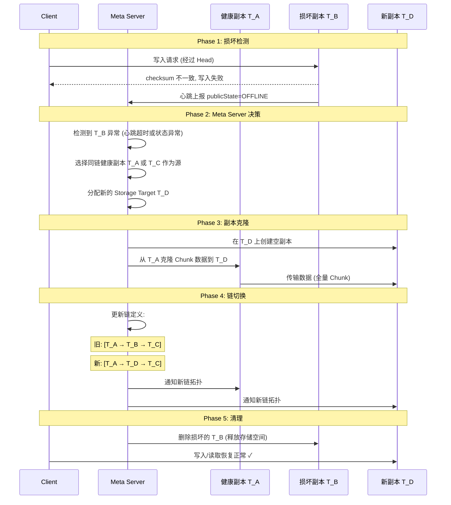

# 3FS 副本损坏检测与修复机制

## 一、核心结论

3FS 的副本修复是**精细粒度**的：

- **检测粒度**：单副本级别（写入时 checksum 实时比对）
- **修复粒度**：单副本级别（只重建损坏的那个副本）
- **不涉及整个 Chunk/Tablet 重建**

与 Doris 的 Tablet 级粗粒度 Clone 形成鲜明对比。

---

## 二、3FS 的复制架构

```
Chunk 的 3 副本分布在不同 Storage Target 上, 通过 Chain 连接:

  Client → [Head: T_A] → [Member2: T_B] → [Tail: T_C]

  写入: 顺序经过 Head → Member2 → Tail (全序保证)
  读取: 读任意一个副本 (负载均衡选择最空闲的)
```

---

## 三、损坏检测机制

### 3.1 写入时 Checksum 校验（最快，实时检测）

3FS 链式写协议的 Step 5 专门做数据完整性校验：

```
写入流程:
  Step 1: Head 获取 Chunk 锁
  Step 2: Head 本地写入, 生成 checksum
  Step 3: Head forward 到 Member2 → 本地写入, 生成 checksum
  Step 4: Member2 forward 到 Tail → 本地写入, 生成 checksum
  Step 5: Head 收集所有 ACK, 比对 checksum

  ┌──────────────────────────────────────────────────────┐
  │ Step 5: Checksum 比对                                │
  │                                                        │
  │  Head checksum:    a3f2c8e1...  ✓                     │
  │  Member2 checksum: a3f2c8e1...  ✓ (一致)              │
  │  Tail checksum:    7e1b4d3f...  ✗ (不一致!)           │
  │                                                        │
  │  → Head 判定写入失败                                    │
  │  → 返回错误给 Client                                   │
  │  → 该副本被标记为异常                                   │
  └──────────────────────────────────────────────────────┘
```

**关键特性**：
- **实时检测**：每次写入都校验，不依赖后台扫描
- **Head 端比对**：Head 作为链的入口，收集所有副本的 checksum 做比较
- **写入即校验**：不需要额外的"读后校验"步骤
- **只能覆盖写入路径**：如果某个副本上的数据在写入后逐渐损坏（如 bit rot），写入时校验不到

### 3.2 Storage 心跳上报（周期性检测）

```
每个 Storage Server → Meta Server 心跳:

  上报内容:
  ├── TargetInfo (每个 Target 的状态)
  │   ├── targetId
  │   ├── publicState: SERVING / OFFLINE / INVALID / ...
  │   ├── localState: UPTODATE / ONLINE / OFFLINE
  │   └── chainId, diskIndex, usedSize
  ├── Chain 版本信息
  └── 磁盘使用情况

  Meta Server 检测:
  ├── Target 从 SERVING → OFFLINE → 下线/损坏
  ├── Target 长时间不上报 → 心跳超时 → 标记异常
  └── 定期比对预期链结构与实际上报 → 发现缺失副本
```

### 3.3 客户端读失败（访问时检测）

```
Client 读请求路径:
  1. 选择目标 Target (LoadBalance 策略, 选最空闲的)
  2. 发送读请求
  3. Target 返回数据 (或错误)

  如果 Target 返回错误:
  ├── 数据损坏 (checksum 不匹配)
  ├── Target 不可达 (网络故障)
  ├── Chunk 不存在 (被意外删除)
  └── Client 可切换到同链其他副本重试
```

---

## 四、检测能力对比

| 检测手段 | 发现速度 | 覆盖场景 | 局限 |
|---------|---------|---------|------|
| **写入 checksum** | 实时 | 写入路径上的数据损坏 | 无法检测写入后逐渐损坏的数据 (bit rot) |
| **心跳上报** | 秒级 (心跳周期) | Target 下线/磁盘故障/进程崩溃 | 无法检测数据内容损坏 |
| **客户端读失败** | 访问时 | 所有读取路径上的损坏 | 冷数据可能长期不被访问 |
| 后台主动扫描 | — | 3FS **无此机制** | 冷数据损坏可能长期未发现 |

---

## 五、修复机制

### 5.1 修复流程总览



### 5.2 修复的两个阶段

#### 阶段 1：链降级运行

```
检测到 T_B 损坏后, 链暂时以 2 副本运行:

  正常:  [T_A] → [T_B] → [T_C]  (3 副本)
  降级:  [T_A] ─── ✗ ───→ [T_C]  (2 副本, T_B 被 skip)

  影响:
  ├── 写入: Head 直接 forward 到 Tail (跳过 Member2)
  ├── 读取: 只从 T_A 或 T_C 读 (跳过 T_B)
  ├── 一致性: 仍保证强一致 (W=N=2)
  └── 冗余度: 降低, 无法再容忍额外故障
```

#### 阶段 2：副本重建

```
Meta Server 触发修复:

  Step 1: 选择源副本
    ├── 优先选 Head (通常是最新数据)
    └── 或选 Tail (写入完成的数据)

  Step 2: 创建新副本
    ├── 在可用 Storage Target 上分配空间
    └── 创建空 Chunk

  Step 3: 克隆数据
    ├── 从源副本读取完整 Chunk 数据
    ├── 写入新副本
    └── 校验 checksum

  Step 4: 更新链定义
    ├── 在 Meta Server (FDB) 中更新链的成员列表
    ├── 通知 Head/Tail 新的链拓扑
    └── 后续写入自动经过新副本

  Step 5: 删除损坏副本
    └── 从 Storage Target 上物理删除
```

---

## 六、3FS vs Doris 修复能力对比

| 维度 | 3FS | Doris |
|------|-----|-------|
| **检测时机** | 写入时 checksum (实时) + 心跳 | 读取时 CRC32C + 心跳 + Tablet Report |
| **检测粒度** | 单副本 (Chain 成员) | Tablet 级 |
| **修复粒度** | **单副本** | **整个 Tablet** |
| **修复方式** | 克隆单个副本 + 链切换 | HTTP 下载整个 Tablet |
| **修复数据量** | 单个 Chunk (MB~GB) | 整个 Tablet (1~100 GB) |
| **修复速度** | **秒级** | **分钟~小时** |
| **服务中断** | 修复期间 2 副本运行 | 修复期间副本缺失 |
| **恢复对查询的影响** | 降级期间仍可读写 | Clone 完成前查询可能受影响 |
| **后台主动检测** | 心跳 (无 bit rot 扫描) | 心跳 + Tablet Report (无 bit rot 扫描) |
| **冷数据损坏发现** | 延迟 (访问时才发现) | 延迟 (访问时才发现) |
| **数据丢失阈值** | 链中 2 个副本同时损坏 | 3 个副本同时损坏 |
| **修复协议** | RDMA 零拷贝传输 | HTTP 下载 (50 MB/s 限速) |
| **元数据更新** | FDB 事务 (原子) | EditLog + CloneTask |

---

## 七、3FS 修复速度快的原因

```
1. 修复粒度小:
   只重建损坏的 1 个副本 (单 Chunk)
   而非整个 Tablet 的所有 Chunk + Rowset

2. 传输距离短:
   RDMA 集群内网, 延迟 ~1μs/跳
   单 Chunk ~4MB, 传输时间 <100ms

3. 元数据更新简单:
   在 FDB 中修改一条链定义记录 (原子事务)
   不需要复杂的版本协商

4. 链架构天然支持:
   链是有序的, 替换一个成员是原子操作
   不需要像 Quorum 那样协调多个副本的版本

5. 无 Compaction 干扰:
   3FS 没有 LSM-Tree 的 Compaction
   修复的副本不会被后续操作"覆盖"
```

---

## 八、3FS 的不足

| 问题 | 说明 |
|------|------|
| **无后台 Bit Rot 扫描** | 冷数据损坏只有访问时才发现 |
| **Head 是单点** | Head 不可用则整条链不可写 (需要选举) |
| **链断裂风险** | 中间节点不可用则链断裂, 需要重建链 |
| **修复期间冗余度降低** | 从 3 副本降到 2 副本, 窗口期内无法再容忍故障 |
| **Checksum 只覆盖写入** | 写入后的存储级损坏 (bit rot) 不被主动发现 |

---

## 九、总结

```
3FS 副本修复的核心优势:

  1. 写入时实时校验 → 损坏在写入瞬间发现
  2. 单副本重建 → 修复数据量最小 (Chunk 级)
  3. RDMA 传输 → 修复速度极快 (秒级)
  4. 链式架构 → 替换副本只需更新链定义 (原子事务)
  5. FDB 元数据 → 链切换强一致, 无需额外协调

  与 Doris 对比:
  Doris 修整个 Tablet (10~100 GB, 分钟~小时)
  3FS 修单个副本    (4 MB Chunk, 秒级)

  核心原因: Chain 是最小的复制单元
  每个 Chain 独立管理 3 个副本
  替换一个副本不影响其他副本
  这与 Doris 的"Tablet 是原子修复单元"形成鲜明对比
```

---
