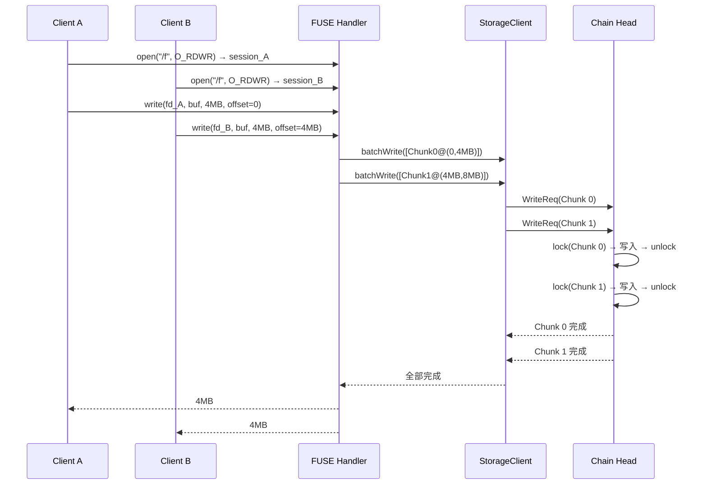
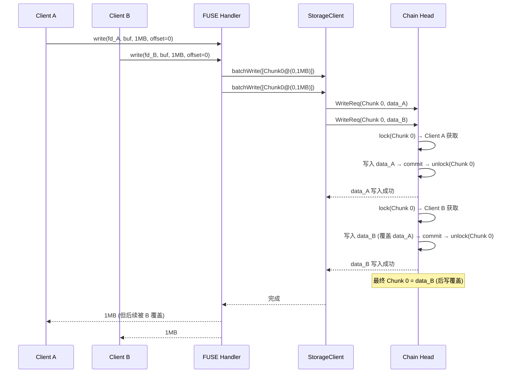

# 3FS 多客户端并发写同一文件分析

## 一、核心结论

**3FS 不会报错，允许并发写入同一文件。** 但 POSIX 语义下，重叠区域的并发写入结果未定义——3FS 不做文件级的写锁或冲突检测，数据完整性由应用层保证。

---

## 二、不会报错的原因

### 2.1 独立的 FileSession

```
Client A: open("/data/file", O_RDWR) → session_A
Client B: open("/data/file", O_RDWR) → session_B
Client C: open("/data/file", O_RDWR) → session_C

每个客户端持有独立的 FileSession:
  INOS + inodeId + sessionId_A
  INOS + inodeId + sessionId_B
  INOS + inodeId + sessionId_C

三个 session 互不排斥, 都可以正常写入
```

### 2.2 写入路径无文件级锁

```
3FS 的锁层级:

  FileSession (文件级):   不阻止并发写入 ✗
  Per-Chunk Lock (Chunk级): 序列化同一 Chunk 的写入 ✓
  Chain Lock (链级):       不存在

结论: 3FS 只在 Chunk 级别做写入序列化,
     不在文件级别做互斥 → 多客户端写同一文件不报错
```

---

## 三、不同场景的结果

| 场景 | 是否报错 | 数据正确性 | 说明 |
|------|---------|-----------|------|
| 写不同 offset（不同 Chunk） | 不报错 | 正确 | 并行写入, 无冲突 |
| 写不同 offset（同一 Chunk） | 不报错 | 正确 | per-chunk 锁序列化 |
| 写同一 offset（不同客户端） | 不报错 | **不确定** | last-write-wins 或数据损坏 |
| Append-only（追加写入） | 不报错 | 取决于 offset 计算 | 需要 hintLength 协调 |
| 单 Writer + 多 Reader | 不报错 | 正确 | AI Checkpoint 典型模式 |

---

## 四、写入路径上的序列化机制

### 4.1 不重叠写入（无冲突）

```
Client A: write(offset=0MB, length=4MB)
  → Chunk 0, Chunk 1

Client B: write(offset=8MB, length=4MB)
  → Chunk 2, Chunk 3

两个写入涉及不同的 Chunk → 无锁冲突 → 并行执行 ✓
```

### 4.2 同一 Chunk 的不同区域

```
Client A: write(offset=0MB, length=1MB)  → Chunk 0 [0~1MB]
Client B: write(offset=2MB, length=1MB)  → Chunk 0 [2~3MB]

两个写入都命中 Chunk 0:

  Head 的 per-chunk 锁 (CoLockManager):
    Client A: lock(Chunk 0) → 成功
    Client B: lock(Chunk 0) → 等待...

    Client A: 写入 [0~1MB] → commit → unlock(Chunk 0)
    Client B: lock(Chunk 0) → 成功
    Client B: 写入 [2~3MB] → commit → unlock(Chunk 0)

  结果: 正确 ✓ (不同区域, 序列化执行)
```

### 4.3 同一 Chunk 的重叠区域（最危险）

```
Client A: write(offset=0, "AAAA")  → Chunk 0
Client B: write(offset=0, "BBBB")  → Chunk 0

Head 的 per-chunk 锁:
    Client A: lock(Chunk 0) → 成功
    Client B: lock(Chunk 0) → 等待...

    Client A: 写入 "AAAA" → commit → unlock
    Client B: lock(Chunk 0) → 成功
    Client B: 写入 "BBBB" → commit → unlock

  结果: 文件内容 = "BBBB" (后写覆盖, 数据正确)
```

### 4.4 真正危险的情况：细粒度交错

```
Client A: write(offset=0, "AAAABBBB")  → 覆盖 8 字节
Client B: write(offset=4, "CCCCDDDD")  → 覆盖 offset 4~7

如果在 Chunk 内部发生交错 (per-chunk 锁粒度足够细):

  正常情况 (Client A 先完成):
    offset 0~3: "AAAA"  (来自 A)
    offset 4~7: "CCCC"  (来自 B, 覆盖 A 的 "BBBB")
    结果: "AAAACCCC"

  异常情况 (如果在 commit 前交错):
    两个客户端同时持有同一个 Chunk 的锁?
    → 不可能, per-chunk 锁保证了同一 Chunk 的串行写入

  但如果 A 和 B 的写入跨越多个 Chunk:
    Client A: write(offset=3MB, 4MB) → Chunk 0 [3~4MB] + Chunk 1 [4~7MB]
    Client B: write(offset=3MB, 4MB) → Chunk 0 [3~4MB] + Chunk 1 [4~7MB]

    Chunk 0: A 先获取锁 → A 写入 → B 写入 (覆盖 A)
    Chunk 1: B 先获取锁 → B 写入 → A 写入 (覆盖 B)
    → 最终文件内容是 A 和 B 的混合! 部分损坏!
```

---

## 五、3FS 的保护机制（仅 Chunk 级别）

### 5.1 保护层级

```
┌─────────────────────────────────────────────────────┐
│  应用层 (用户负责)                                     │
│  ├── 分布式锁 (etcd/Redis)                           │
│  ├── 单 Writer 模式                                   │
│  └── Write-to-temp + rename                           │
├─────────────────────────────────────────────────────┤
│  3FS Meta Server (不提供文件级写锁)                    │
│  ├── FileSession: 追踪写会话, 不阻止并发写            │
│  └── truncateVer: 版本号, 不阻止并发写                 │
├─────────────────────────────────────────────────────┤
│  3FS Storage Server (Chunk 级保护)                     │
│  ├── Per-Chunk Lock: 序列化同一 Chunk 的写入          │
│  ├── updateVer: 版本号, 保证单次写入原子性             │
│  └── Checksum: Head 比对副本一致性                    │
└─────────────────────────────────────────────────────┘
```

### 5.2 FileSession 的作用

```
FileSession 只做两件事:

1. 延迟删除:
   文件有活跃写会话时, meta 服务延迟删除
   等所有 fd 关闭后再执行 GC

2. 会话清理:
   客户端断开连接后, 后台任务扫描并清理过期 session

FileSession 不做的事情:
  ✗ 不阻止多个客户端同时以写模式打开同一文件
  ✗ 不协调多个客户端的写入顺序
  ✗ 不检测写入冲突
```

---

## 六、并发写时序流程图

### 6.1 多客户端写同一文件（不同 Chunk）



### 6.2 多客户端写同一文件（同一 Chunk，有竞争）



---

## 七、安全并发写的方案

### 7.1 方案对比

| 方案 | 复杂度 | 一致性 | 吞吐 | 适用场景 |
|------|--------|--------|------|---------|
| 不重叠写入 | 低 | 最终一致 | 高 | 数据并行处理 |
| Append-only | 低 | 最终一致 | 高 | 日志追加 |
| 单 Writer | 低 | 强一致 | 中 | AI Checkpoint |
| 分布式锁 | 中 | 强一致 | 低 (锁开销) | 通用 |
| Write-to-temp + rename | 中 | 原子性 | 中 | 原子更新 |
| 多 Writer + 协调 | 高 | 最终一致 | 高 | 需要应用层合并 |

### 7.2 AI 场景的典型模式

```
Checkpoint 保存 (单 Writer):
  ┌──────────────────────────────────────┐
  │ Trainer Process (唯一 Writer)        │
  │  ├── open("ckpt.ckpt", O_RDWR|O_CREAT)│
  │  ├── write(0, weights)               │
  │  ├── write(offset, optimizer)        │
  │  └── close() → sync                  │
  └──────────────────────────────────────┘

  其他进程: 只读访问已完成的 Checkpoint
  → 单 Writer 模式, 无并发写冲突

训练数据并行加载 (多 Writer, 不重叠):
  ┌──────────┐ ┌──────────┐ ┌──────────┐
  │ Worker 0 │ │ Worker 1 │ │ Worker N │
  │ 写 shard 0│ │ 写 shard 1│ │ 写 shard N│
  │ offset=0 │ │ offset=X │ │ offset=Y │
  └──────────┘ └──────────┘ └──────────┘
  → 不重叠写入, 天然并行
```

### 7.3 POSIX rename 原子更新

```
安全更新流程:

  Step 1: Client 写入临时文件
    write("/data/file.tmp.001", new_data)

  Step 2: 原子重命名
    rename("/data/file.tmp.001", "/data/file")
    → FDB 事务: clear(旧 DENT) + set(新 DENT), 原子提交

  Step 3: 其他客户端读取时看到新文件

  优势:
    写入过程不影响正在读取旧文件的客户端
    rename 是原子的, 读者要么看到旧版本要么看到新版本
    适合配置更新、模型权重替换等场景
```

---

## 八、与 POSIX 语义的对比

| 行为 | POSIX 规定 | 3FS 实现 | 一致? |
|------|-----------|---------|------|
| 多 fd 并发写不重叠区域 | 安全 | 安全 | 是 |
| 多 fd 并发写重叠区域 | 未定义 | last-write-wins | 是 (未定义) |
| 同 fd 并发写 | 未定义 | last-write-wins | 是 (未定义) |
| O_APPEND 并发追加 | 原子追加 | 依赖 hintLength | 部分 |
| write + rename 原子性 | 无保证 | rename 原子 | 超出 POSIX |
| 文件锁 (flock/fcntl) | 可选支持 | 未实现 | N/A |

---

## 九、总结

```
3FS 对并发写同一文件的态度:

  不会报错 → 允许多个客户端同时写入
  不做协调 → 不保证重叠写入的数据一致性
  不做互斥 → 不提供文件级写锁

  设计哲学:
    信任应用层做正确的并发控制
    3FS 只负责高效地执行写入
    性能优先, 简单优先

  如果需要安全的并发写:
    → 应用层使用分布式锁、单 Writer 或 rename
    → 或者确保写入区域不重叠 (最简单高效)
```

---
