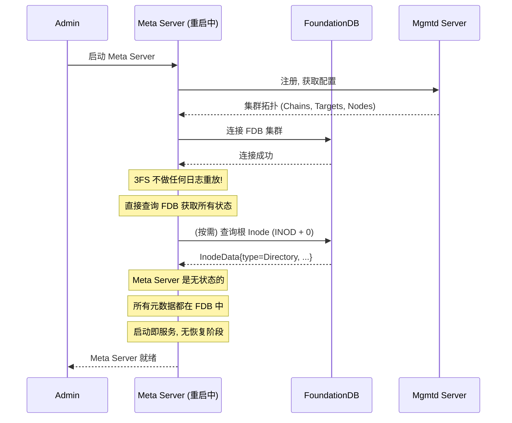
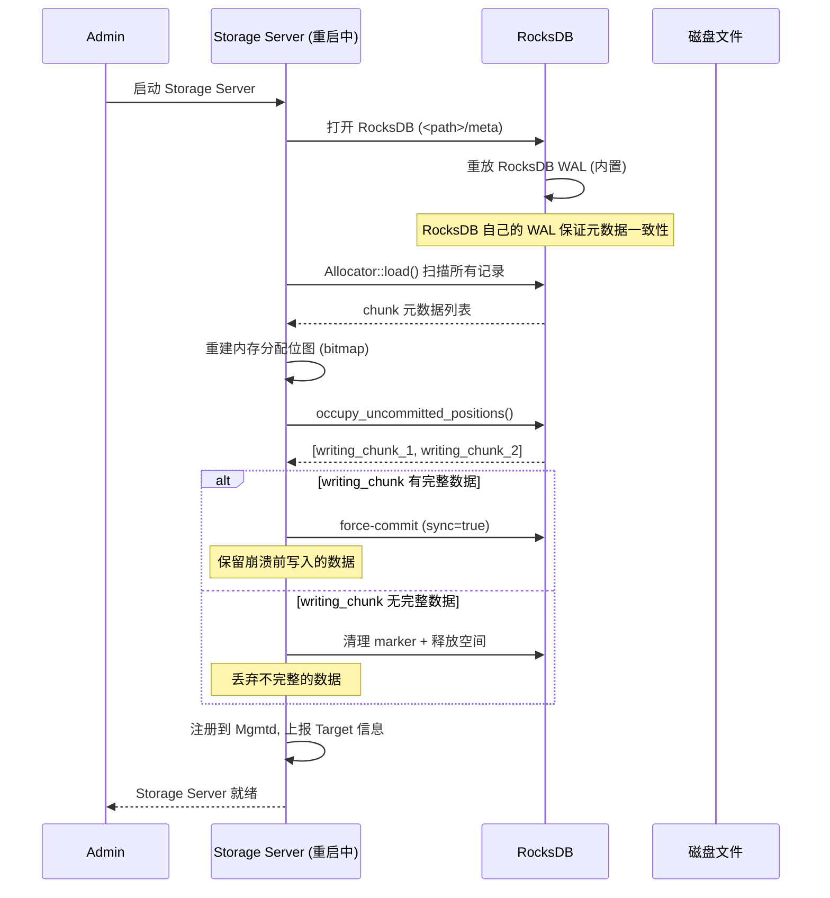

# 3FS 日志与持久化机制

## 一、核心结论：3FS 不需要自己的日志

3FS **没有 WAL（预写日志）**，**没有操作日志**，**没有审计日志**。所有持久化和崩溃恢复都委托给两个外部系统：

```
┌─────────────────────────────────────────────────────────┐
│                    3FS 架构                              │
│                                                          │
│  Meta Server ─── 委托 ──→ FoundationDB (ACID + 内部 WAL) │
│  Storage Server ── 委托 ──→ RocksDB (内置 WAL) + pwrite  │
│  应用日志 (诊断用) ──→ Folly XLOG (不参与持久化)          │
└─────────────────────────────────────────────────────────┘
```

| 组件 | 持久化方式 | 日志 | 崩溃恢复 |
|------|-----------|------|---------|
| Meta Server | FoundationDB | 无自身日志 | 直接查 FDB，无需重放 |
| Storage 数据 | pwrite + RocksDB | 无自身日志 | RocksDB WAL + writing marker |
| IDEM 幂等记录 | FoundationDB | 不是日志，是去重缓存 | 30 分钟过期自动清理 |
| 应用诊断日志 | Folly XLOG | 不参与持久化 | 不需要恢复 |

---

## 二、为什么不需要自己的日志

### 2.1 Meta Server：FDB 就是日志

```
传统文件系统 (如 ext4, ZFS):
  用户操作 → 日志 → 提交 → 刷盘
           └── 自己管理 WAL, 自己重放, 自己保证一致性

3FS:
  用户操作 → FDB 事务 → 提交 (FDB 内部有 WAL)
           └── 完全委托 FDB, 3FS 不关心日志

3FS Meta Server 启动流程:
  1. 连接 FDB 集群
  2. 查询 FDB 获取当前状态
  3. 开始服务

  无需重放日志, 因为 FDB 保证:
  - 已提交的事务一定持久化
  - 未提交的事务一定回滚
  - 读取一定返回一致的数据
```

### 2.2 Storage Server：RocksDB WAL + pwrite

```
Chunk 写入流程:

  1. Allocator 分配磁盘位置 (内存)
  2. persist_writing_chunk() → RocksDB 写入 "writing" 标记
  3. pwrite(data) → 直接写入磁盘数据文件
  4. commit_chunk() → RocksDB WriteBatch:
     ├── 写入 chunk 元数据
     ├── 写入 position → chunk_id 映射
     ├── 更新 group 分配位图
     ├── 更新已用空间
     └── 删除 "writing" 标记
  5. (可选) sync: true → fdatasync

崩溃恢复:
  启动时扫描 RocksDB 中的 "writing" 标记
  ├── 有数据但无 commit → force-commit 或清理
  └── 无数据但有 marker → 直接清理
```

---

## 三、Meta Server 崩溃恢复时序



### 对比 Doris FE 的恢复

```
Doris FE 启动:
  1. 加载 Image (本地文件, 可能有多个版本)
  2. 从 BDB JE 重放 Edit Log (数万~数十万条)
  3. 恢复时间: 秒~分钟

3FS Meta Server 启动:
  1. 连接 FDB
  2. 完成
  恢复时间: 毫秒

原因: FDB 本身就是分布式日志系统
      3FS 不需要 Image + Edit Log 这套自建机制
```

---

## 四、Storage Server 崩溃恢复时序



---

## 五、IDEM 系统：去重缓存，不是日志

```
常见误解: IDEM 是操作日志?

  IDEM 记录:
    Key:   IDEM + requestId + clientId
    Value: 序列化的操作结果 (如 RenameRsp)

  特征:
    ├── 不是按时间顺序排列
    ├── 不能重放 (没有操作内容, 只有结果)
    ├── 有过期时间 (默认 30 分钟)
    ├── 只用于 remove 和 rename 操作
    └── 目的: 处理 FDB commit_unknown_result 的去重

  它是 "已处理请求的缓存", 不是 "待处理请求的日志"
```

### IDEM 与日志的本质区别

| 维度 | 操作日志 (WAL/Journal) | IDEM 幂等记录 |
|------|----------------------|-------------|
| 记录内容 | 操作本身 (redo/undo) | 操作结果 |
| 有序性 | 严格按时间顺序 | 无序 (按 UUID 哈希) |
| 生命周期 | 永久 (直到 checkpoint) | 30 分钟过期 |
| 恢复用途 | 崩溃后重放恢复状态 | 重试时去重返回缓存结果 |
| 覆盖操作 | 所有写操作 | 仅 remove 和 rename |

---

## 六、应用诊断日志

3FS 使用 **Folly XLOG** 做应用级诊断日志，仅用于调试和监控，不参与持久化：

```
使用方式:
  XLOGF(INFO, "Client connected: {}", addr);
  XLOGF(ERR, "Failed to commit transaction: {}", err);
  XLOGF(CRITICAL, "Checksum mismatch: expected={}, actual={}", expected, actual);
  XLOGF(DBG, "Processing write request: chunk={}, offset={}", chunkId, offset);

日志级别:
  INFO    → 正常运行信息
  DBG     → 调试信息 (默认关闭)
  WARNING → 可恢复的异常
  ERR     → 需要关注的错误
  CRITICAL → 严重错误
  DFATAL  → 致命错误后继续

输出: 标准输出 / 文件 (由部署配置决定)
作用: 人工排查问题, 不参与数据持久化或恢复
```

---

## 七、架构优势

### 为什么不用自建日志是正确的设计

```
自建日志的代价:
  ├── 实现复杂: WAL 格式设计、redo/undo、checkpoint、压缩...
  ├── 正确性难保证: 日志 vs 数据的一致性 (crash-safe)
  ├── 分布式日志更难: 多副本日志同步、选举...
  ├── 性能瓶颈: 所有操作先写日志再执行
  └── 维护成本: 日志回收、空间管理、故障恢复测试

3FS 的做法:
  ├── 元数据日志 → FoundationDB (久经考验的分布式事务系统)
  ├── Chunk 元数据日志 → RocksDB (成熟的嵌入式 KV 引擎)
  ├── 数据写入 → pwrite + 链式复制 (3 副本保证持久化)
  └── RPC 幂等 → IDEM (FDB 中的去重缓存)

结果:
  ├── 3FS 代码中没有一行 WAL 代码
  ├── 没有 checkpoint 逻辑
  ├── 没有 redo/undo 机制
  └── Meta Server 启动无需恢复, 毫秒级就绪
```

---

## 八、总结

```
3FS 的日志策略: "不写日志"

  ┌────────────┐    事务    ┌──────────────┐
  │ Meta 操作   │ ────────→ │ FoundationDB │ (内部有 WAL)
  └────────────┘           └──────────────┘

  ┌────────────┐    pwrite  ┌──────────────┐
  │ Chunk 数据  │ ────────→ │  磁盘文件     │ (链式复制 3 副本)
  └────────────┘           └──────────────┘

  ┌────────────┐  RocksDB   ┌──────────────┐
  │ Chunk 元数据│ ────────→ │   RocksDB    │ (内部有 WAL)
  └────────────┘           └──────────────┘

  ┌────────────┐  FDB 存缓存 │
  │ RPC 去重   │ ────────→ │ FDB IDEM     │ (30 分钟过期)
  └────────────┘           └──────────────┘

  ┌────────────┐  标准输出   │
  │ 诊断日志   │ ────────→ │ XLOG (不持久化)│
  └────────────┘           └──────────────┘
```

**3FS 通过将持久化委托给 FoundationDB 和 RocksDB，完全避免了自建日志系统的复杂性和正确性风险，这是"做好一件事"架构哲学的体现。**

---
