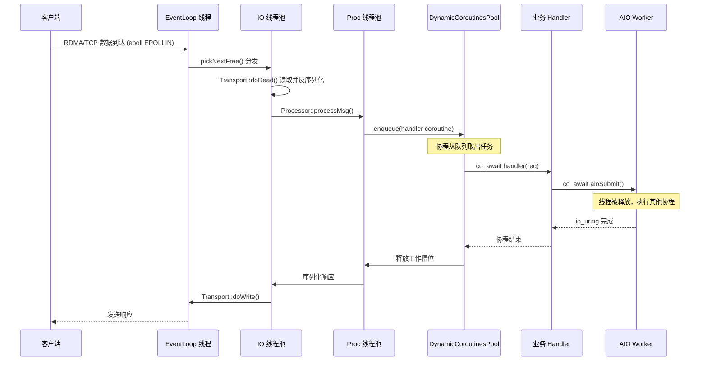
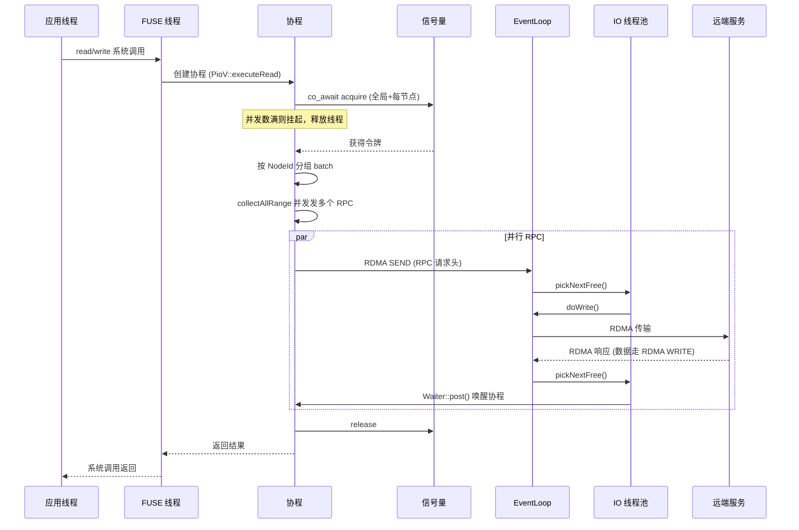
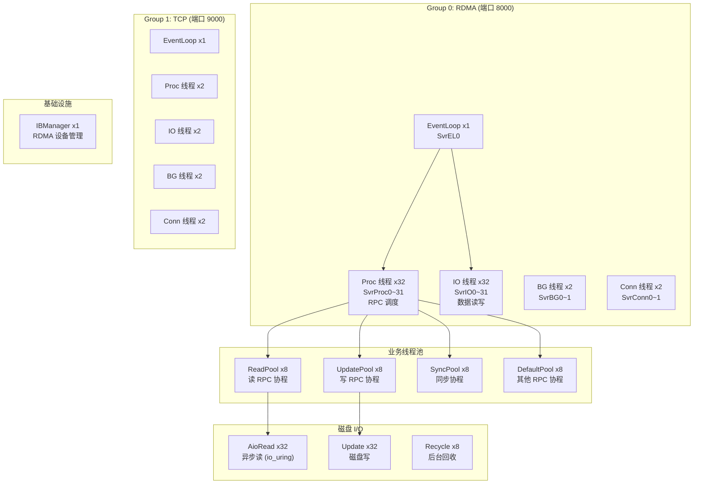
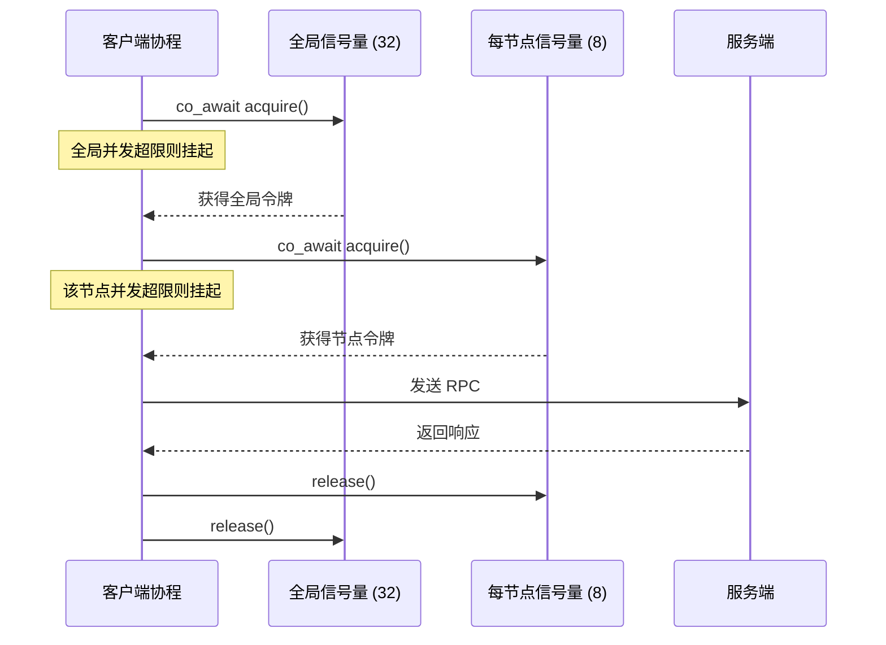
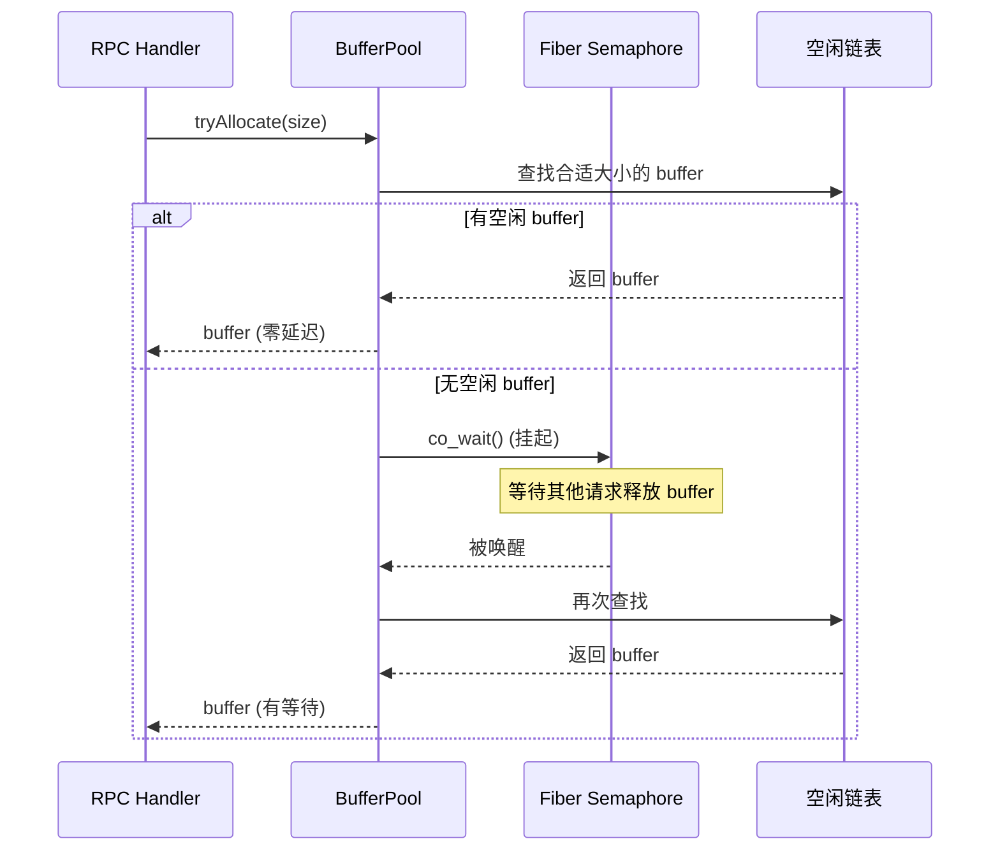

# 3FS 线程模型与内存模型

## 一、线程模型总览

3FS 的线程模型基于 **分层线程池 + 无栈协程（C++20 coroutine）** 构建。每个进程类型（FUSE 客户端、Meta 服务、Storage 服务）都使用相同的基础设施，但线程池规模和配置不同。

### 1.1 核心设计思想

```
                    ┌─────────────────────────┐
                    │    folly::coro::Task<T> │  ← 无栈协程，C++20
                    └────────────┬────────────┘
                                 │ co_await
          ┌──────────────────────┼──────────────────────┐
          ▼                      ▼                      ▼
   ┌─────────────┐      ┌─────────────┐      ┌─────────────┐
   │  CPUExecutor │      │ CPUExecutor │      │ IOExecutor  │
   │  (Proc Pool) │      │  (IO Pool)  │      │ (Conn Pool) │
   └──────┬──────┘      └──────┬──────┘      └──────┬──────┘
          │                    │                     │
          ▼                    ▼                     ▼
   ┌─────────────┐      ┌─────────────┐      ┌─────────────┐
   │   RPC 请求   │      │  数据读写   │      │  连接建立   │
   │  反序列化    │      │  处理/分发  │      │  TCP/RDMA   │
   │  调度分发    │      │             │      │  accept     │
   └─────────────┘      └─────────────┘      └─────────────┘
                                ▲
                                │ epoll 事件通知
                        ┌───────┴────────┐
                        │  EventLoop 线程 │  ← epoll_wait 循环
                        └────────────────┘
```

- **EventLoop 线程**：纯 epoll 事件通知，不做数据处理
- **IO 线程池**：处理数据读写、消息反序列化
- **Proc 线程池**：处理 RPC 请求调度、服务逻辑
- **Conn 线程池**：处理连接建立/断开
- **协程**：在上述线程池之间迁移，co_await 时自动让出线程

---

## 二、网络层线程模型

### 2.1 ThreadPoolGroup — 四池架构

每个 `net::Server` 和 `net::Client` 都创建一个 `ThreadPoolGroup`，包含 4 个线程池：

| 池 | 前缀 | 默认线程数 | 底层实现 | 职责 |
|----|------|-----------|---------|------|
| **procThreadPool** | `{name}Proc` | 2 | `CPUExecutorGroup` | RPC 反序列化 + 请求调度 |
| **ioThreadPool** | `{name}IO` | 2 | `CPUExecutorGroup` | 数据读写处理 |
| **bgThreadPool** | `{name}BG` | 2 | `CPUExecutorGroup` | 后台任务（连接检查、统计） |
| **connThreadPool** | `{name}Conn` | 2 | `IOThreadPoolExecutor` | 连接建立/accept |

### 2.2 CPUExecutorGroup — 核心线程池

`CPUExecutorGroup` 包装 `folly::CPUThreadPoolExecutor`，支持 6 种调度策略：

| 策略 | 行为 | 适用场景 |
|------|------|---------|
| `SHARED_QUEUE` | 所有线程共享一个队列（默认） | 通用 |
| `SHARED_NOTHING` | 每线程独立队列 | 无竞争场景 |
| `WORK_STEALING` | 独立队列 + 工作窃取 | 负载不均 |
| `ROUND_ROBIN` | 独立队列 + 轮询分发 | 均匀分派 |
| `GROUP_WAITING_4` | 4 线程一组共享队列 | 中等粒度 |
| `GROUP_WAITING_8` | 8 线程一组共享队列 | 粗粒度 |

选择方法：
- `pickNext()` — 原子递增轮询
- `pickNextFree()` — 探测最多 4 个 executor，选队列最短的
- `randomPick()` — 随机选择

### 2.3 EventLoop — 事件驱动

每个 `EventLoop` 创建：
- 一个 **epoll fd**（容量 16K）
- 一个 **eventfd**（唤醒通知）
- 一个 **专用 jthread** 运行 epoll 循环

```cpp
void EventLoop::loop() {
    while (true) {
        constexpr int kMaxEvents = 64;
        epoll_event events[kMaxEvents];
        int n = epoll_wait(epfd_, events, kMaxEvents, -1);
        handler->handleEvents(events, n);  // 分发到 IO 线程池
    }
}
```

关键设计：EventLoop **只做事件通知，不做数据处理**。数据处理通过 `pickNextFree()` 分发到 IO 线程池。

### 2.4 RDMA CQ 集成

3FS **没有专门的 CQ 轮询线程**。RDMA 完成事件通过标准 epoll 机制集成：

```
IBSocket 创建 → ibv_create_comp_channel → ibv_create_cq
                                              │
                                    channel->fd 注册到 EventLoop
                                              │
                                    epoll_wait 触发 EPOLLIN
                                              │
                                    IBSocket::poll() → ibv_poll_cq (批量处理)
```

每个 `IBSocket` 拥有独立的 CQ，CQ 完成通道 fd 注册到 IOWorker 的 EventLoop。完成通知走标准 epoll 路径，与 TCP fd 事件统一处理。

---

## 三、请求处理全流程

### 3.1 服务端请求处理时序



### 3.2 DynamicCoroutinesPool — 服务端协程调度

服务端的核心调度机制。每个池：

| 属性 | 默认值 | 说明 |
|------|--------|------|
| `threads_num` | 8 | 底层 CPUThreadPoolExecutor 线程数 |
| `coroutines_num` | 64 | 协程工作数 |
| `queue_size` | 1024 | 待处理任务队列大小 |

工作原理：
```
64 个协程 worker，每个在 CPUThreadPoolExecutor 上运行:

while (true) {
    task = co_dequeue();    // 挂起等待，释放线程
    co_await task();        // 执行业务逻辑
                             // (期间可能再次 co_await 其他操作)
}
```

Storage 服务端定义 4 个协程池：

| 池 | 用途 |
|----|------|
| `ReadPool` | batchRead RPC |
| `UpdatePool` | write/update RPC |
| `SyncPool` | sync 操作 |
| `DefaultPool` | 其他 RPC |

### 3.3 客户端请求发送时序



---

## 四、各进程线程模型

### 4.1 Storage 服务线程全景

Storage 服务是最线程密集的进程，默认配置约 **95+ 线程**：



### 4.2 Meta 服务线程全景

Meta 服务的线程相对轻量：

```
Group 0 (RDMA): 1 EL + 2 Proc + 2 IO + 2 BG + 2 Conn = 9
Group 1 (TCP):  1 EL + 2 Proc + 2 IO + 2 BG + 2 Conn = 9
Background Client: ~9
IBManager: 1
─────────────────────────────────────────────────────
合计: ~28 线程
```

### 4.3 FUSE 客户端线程全景

```
libfuse3 线程池: maxThreads (可配，如 16~64)
Network Client: 1 EL + 2 Proc + 2 IO + 2 BG + 2 Conn = 9
io_uring Worker: N (可配)
Periodic Sync: CoroutinesPool
FUSE Inval: IOThreadPoolExecutor
IBManager: 1
─────────────────────────────────────────────────────
合计: ~30+ 线程
```

---

## 五、协程模型

### 5.1 基础原语

3FS 使用 `folly::coro::Task<T>`（C++20 无栈协程），核心类型：

| 类型 | 定义 | 用途 |
|------|------|------|
| `CoTask<T>` | `folly::coro::Task<T>` | 普通协程 |
| `CoTryTask<T>` | `CoTask<Result<T>>` | 带错误处理的协程 |
| `CoSemaphore` | `folly::fibers::Semaphore` | 协程信号量，支持 `co_wait()` |
| `BoundedQueue` | 基于 `folly::MPMCQueue` | 有界队列，支持 `co_enqueue/co_dequeue` |
| `CoLockManager` | 按键分片的异步锁 | 细粒度协程锁 |

### 5.2 协程调度模型

```
┌──────────────────────────────────────────────────────────┐
│                    协程生命周期                            │
│                                                          │
│  创建: handler(req) → CoTask<void>                       │
│    ↓                                                     │
│  提交: DynamicCoroutinesPool::enqueue(task)               │
│    ↓                                                     │
│  调度: CPUExecutorGroup.pickNext().add(task.start())     │
│    ↓                                                     │
│  执行: 协程在某线程上运行                                   │
│    ↓                                                     │
│  挂起: co_await semaphore / co_await queue → 线程被释放    │
│    ↓                                                     │
│  恢复: Baton::post() → 协程在任意空闲线程上恢复            │
│    ↓                                                     │
│  结束: 协程返回 → 释放工作槽位                             │
└──────────────────────────────────────────────────────────┘
```

关键特性：
- **无栈协程**：每个协程仅需 ~200 字节栈帧，可以创建百万级
- **线程无关**：挂起后可在任意线程恢复，不绑定特定线程
- **同步语义**：`co_await` 写法像同步代码，实际是异步

### 5.3 并发控制 — 多级信号量



所有信号量都支持运行时热更新（`changeUsableTokens()`），无需重启服务。

---

## 六、内存模型

### 6.1 内存架构总览

```
┌──────────────────────────────────────────────────────────────────┐
│                        用户空间内存                               │
│                                                                  │
│  ┌──────────────┐  ┌──────────────┐  ┌───────────────────────┐  │
│  │  RDMA 注册内存 │  │  内核 Bypass  │  │  普通堆内存           │  │
│  │  (ibv_reg_mr) │  │  (io_uring)  │  │  (ObjectPool)        │  │
│  │              │  │              │  │                      │  │
│  │  客户端:      │  │  registered  │  │  ┌─ WriteItem Pool   │  │
│  │  IOBuffer     │  │  files +     │  │  ├─ SerdeBuffer      │  │
│  │              │  │  fixed bufs  │  │  ├─ RPC Message       │  │
│  │  服务端:      │  │              │  │  ├─ Coroutine Frame  │  │
│  │  BufferPool   │  │  零拷贝读写   │  │  └─ Task Queue       │  │
│  │  (4MB×1024)  │  │  无 page     │  │                      │  │
│  │  (64MB×64)   │  │  cache 参与  │  │  所有对象池复用，      │  │
│  └──────────────┘  └──────────────┘  │  避免频繁 malloc/free │  │
│                                      └───────────────────────┘  │
│  ┌──────────────────────────────────────────────────────────┐   │
│  │                    多级缓存体系                            │   │
│  │  Inode Cache │ FD Cache │ Conn Pool │ ThreadLocal Cache  │   │
│  └──────────────────────────────────────────────────────────┘   │
└──────────────────────────────────────────────────────────────────┘
```

### 6.2 RDMA 注册内存

RDMA 要求内存通过 `ibv_reg_mr` 注册，使网卡可以直接 DMA 访问。3FS 的注册策略是**预注册大块内存池**，运行时从中分配：

#### 客户端

```cpp
// StorageClient::registerIOBuffer()
// 客户端注册 IOBuffer 供服务端 RDMA WRITE 直写
IOBuffer { rdmabuf: RDMABuf }  // 每个 IOBuffer 对应一块 RDMA 注册内存
```

#### 服务端 BufferPool

| 池 | 单个大小 | 数量 | 总量 | 用途 |
|----|---------|------|------|------|
| 小 buffer | 4 MB | 1024 | 4 GB | 读响应数据 |
| 大 buffer | 64 MB | 64 | 4 GB | 超大读请求 |

注册标志位：

```cpp
IBV_ACCESS_LOCAL_WRITE      // 本地可写
| IBV_ACCESS_REMOTE_WRITE    // 远端可写 (RDMA WRITE)
| IBV_ACCESS_REMOTE_READ     // 远端可读 (RDMA READ)
| IBV_ACCESS_RELAXED_ORDERING // 宽松顺序 (性能优化)
```

分配流程：


#### io_uring 注册

BufferPool 中的 buffer 同时注册到 io_uring：

```cpp
io_uring_register_buffers(&ring_, iovecs.data(), iovecs.size());
```

使用 `io_uring_prep_read_fixed()` + `IOSQE_FIXED_FILE`，消除每次 I/O 的：
- fd 查找（fixed file index 直接索引）
- buffer 地址转换（fixed buffer index 直接索引）

### 6.3 对象池（ObjectPool）

避免热路径上的 `malloc/free`：

```cpp
template <typename T, uint32_t kBatchSize = 1024, uint32_t kMaxSize = 64 * 1024>
class ObjectPool;
```

| 对象类型 | 池大小 | 用途 |
|---------|--------|------|
| `WriteItem` | 1024 个，每个 64KB | RPC 消息缓冲 |
| `SerdeBuffer` | 4KB × 1024，最大 64MB | 序列化缓冲 |
| `Transport` | 连接池管理 | 网络连接复用 |

设计特点：
- 预分配、批量扩容
- 归还时放回池中，不释放
- 无锁快速路径（TLS 缓存）

### 6.4 多级缓存体系

```
┌─────────────────────────────────────────────────────────────┐
│  Level 1: ThreadLocal Cache (最快，无锁)                     │
│  ┌─────────────┐  ┌──────────────┐  ┌──────────────────┐   │
│  │ Transport   │  │ File         │  │ Allocator        │   │
│  │ 连接缓存     │  │ FD 缓存      │  │ TLS 缓存         │   │
│  └──────┬──────┘  └──────┬───────┘  └──────────────────┘   │
└─────────┼────────────────┼─────────────────────────────────┘
          │ miss           │ miss
┌─────────┼────────────────┼─────────────────────────────────┐
│  Level 2: Sharded Global Cache (分片锁)                     │
│  ┌─────────────┐  ┌──────────────┐  ┌──────────────────┐   │
│  │ Transport   │  │ ChunkFile    │  │ ReliableUpdate   │   │
│  │ Pool 32分片  │  │ Store 64分片  │  │ 1024 分片        │   │
│  └──────┬──────┘  └──────────────┘  └──────────────────┘   │
└─────────┼──────────────────────────────────────────────────┘
          │ miss
┌─────────┼──────────────────────────────────────────────────┐
│  Level 3: In-Memory Data Structures                        │
│  ┌─────────────┐  ┌──────────────┐  ┌──────────────────┐   │
│  │ ChunkStore  │  │ Inode Cache  │  │ ChainInfo        │   │
│  │ 32 分片 Map  │  │ (FUSE 侧)    │  │ (Meta 侧)        │   │
│  └─────────────┘  └──────────────┘  └──────────────────┘   │
└────────────────────────────────────────────────────────────┘
```

### 6.5 分片锁（Sharded Lock）模式

3FS 大量使用分片 ConcurrentHashMap 来减少锁竞争：

```cpp
// ChunkStore: 32 分片
static constexpr auto kShardsNum = 32u;
std::array<Map, kShardsNum> maps_;

// ReliableUpdate: 1024 分片
Shards<ClientMap, 1024> shards_;

// TransportPool: 32 分片
constexpr static auto kShardsSize = 32u;
std::array<Map, kShardsSize> maps_;
```

分片策略统一使用 `hash(key) % shardCount`，每个分片是独立的 `ConcurrentHashMap`。

### 6.6 内存分配策略总结

| 层级 | 策略 | 目标 |
|------|------|------|
| **RDMA 数据传输** | 预注册内存池 (4GB + 4GB) | 零 CPU 拷贝、零运行时注册 |
| **磁盘 I/O** | io_uring fixed buffers + O_DIRECT | 绕过页缓存、零地址转换 |
| **RPC 消息** | ObjectPool + SerdeBuffer | 零 malloc/free |
| **网络连接** | 分片连接池 + ThreadLocal | 零锁竞争快速复用 |
| **文件描述符** | ThreadLocal FD 缓存 | 避免 open/close 系统调用 |
| **元数据** | 分片 ConcurrentHashMap | 减少锁竞争 |
| **协程** | 无栈协程 (~200B/个) | 极低内存开销、百万级并发 |
| **WriteItem** | 无锁 MPSC 链表 | 多生产者单消费者零竞争 |

---

## 七、写缓冲与读缓冲

### 7.1 Per-Inode 写缓冲

```
FUSE write() 调用
       │
       ▼
┌──────────────────────────┐
│  InodeWriteBuf (1MB)     │
│  ┌────────────────────┐  │
│  │ RDMA 注册内存       │  │  ← 服务端可以直接 RDMA READ 拉取
│  │ memcpy(data) → buf │  │  ← 用户态拷贝，绕过内核
│  └────────────────────┘  │
│  offset + length 跟踪    │
└──────────────────────────┘
       │ 缓冲满 / fsync / close
       ▼
  PioV::executeWrite()
  → batchWrite RPC
  → 服务端通过 RDMA READ 拉取数据
```

### 7.2 读路径内存

```
应用 read() 调用
       │
       ▼
┌──────────────────────────────────────────────┐
│  小数据 (< max_inline_read_bytes)             │
│  数据直接嵌入 RPC 响应 → memcpy 到用户缓冲    │
└──────────────────────────────────────────────┘
       │
       ▼
┌──────────────────────────────────────────────┐
│  大数据 (≥ max_inline_read_bytes)             │
│  服务端 RDMA WRITE → 客户端 IOBuffer          │
│  IOBuffer 是预注册的 RDMA 内存                │
│  网卡直接 DMA 到应用缓冲 → 零拷贝            │
└──────────────────────────────────────────────┘
```

---

## 八、与 SPDK Reactor 模型的对比

| 维度 | SPDK Reactor | 3FS |
|------|-------------|-----|
| **核心模型** | 线程绑定核心，每核一个 reactor | 线程池 + 协程，动态调度 |
| **并发原语** | 无锁环形队列 | folly::coro + Semaphore |
| **CPU 亲和性** | 严格绑核 | 不绑核（可配置） |
| **上下文切换** | 用户态轮询，无切换 | co_await 挂起/恢复 |
| **扩展性** | 线程数 = 核数 | 线程数可远大于核数 |
| **编程模型** | 状态机 + 回调 | 同步风格 async/await |
| **RDMA CQ** | 专用轮询线程 | 集成到 epoll |
| **磁盘 I/O** | NVMe 直接访问 (SPDK bdev) | io_uring / libaio + O_DIRECT |
| **适用场景** | 极低延迟、存储后端 | 通用文件系统、多协议支持 |

3FS 选择协程模型而非 Reactor 模型的原因：
1. **编程效率**：`co_await` 比回调/状态机更易维护
2. **功能丰富**：文件系统需要复杂的 RPC 交互（meta 查询、路由发现、GC），协程更适合表达复杂流程
3. **灵活性**：不严格要求绑核，部署更简单
4. **延迟权衡**：协程上下文切换 (~微秒级) 对文件系统场景足够，极端低延迟不是首要目标

---