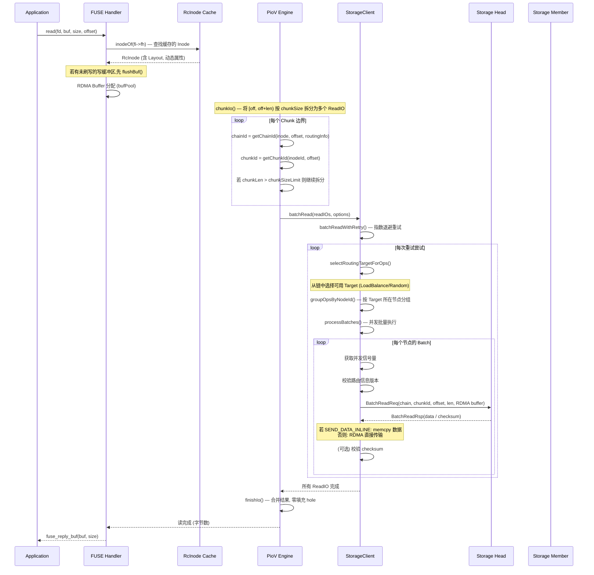
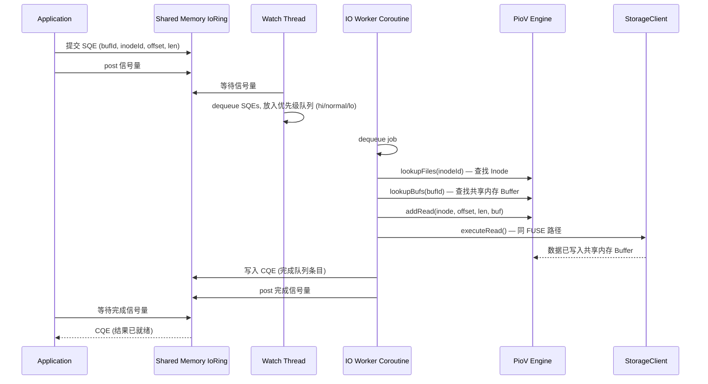
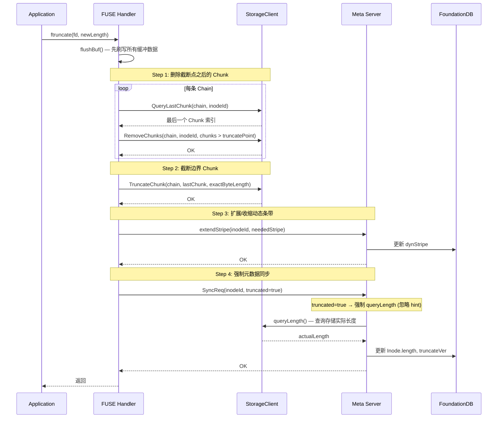
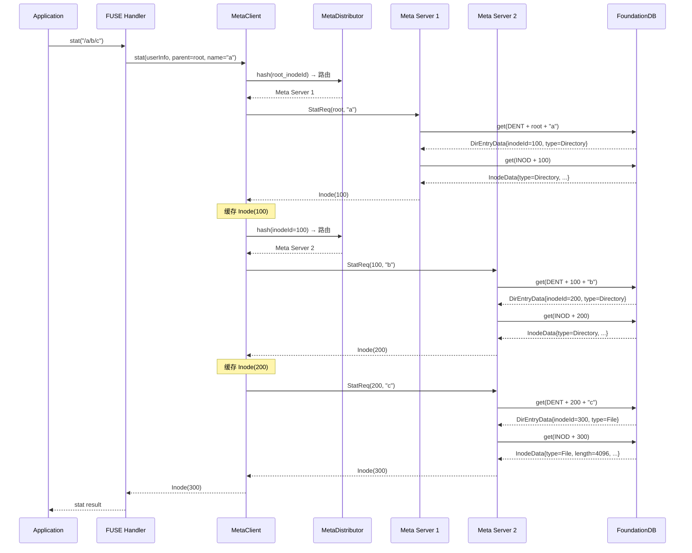
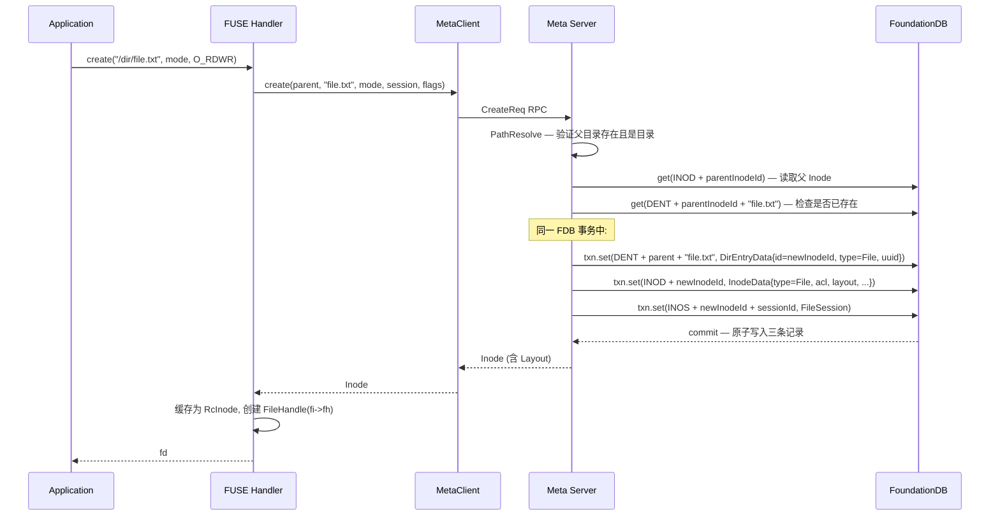
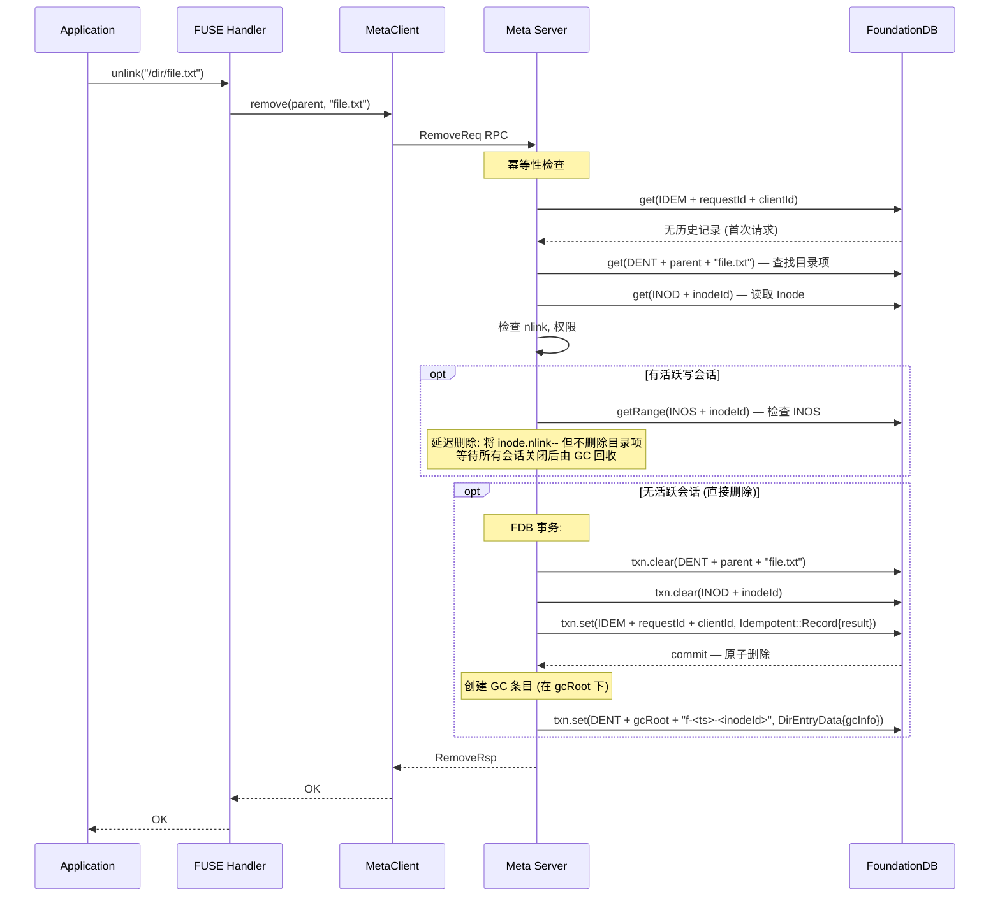
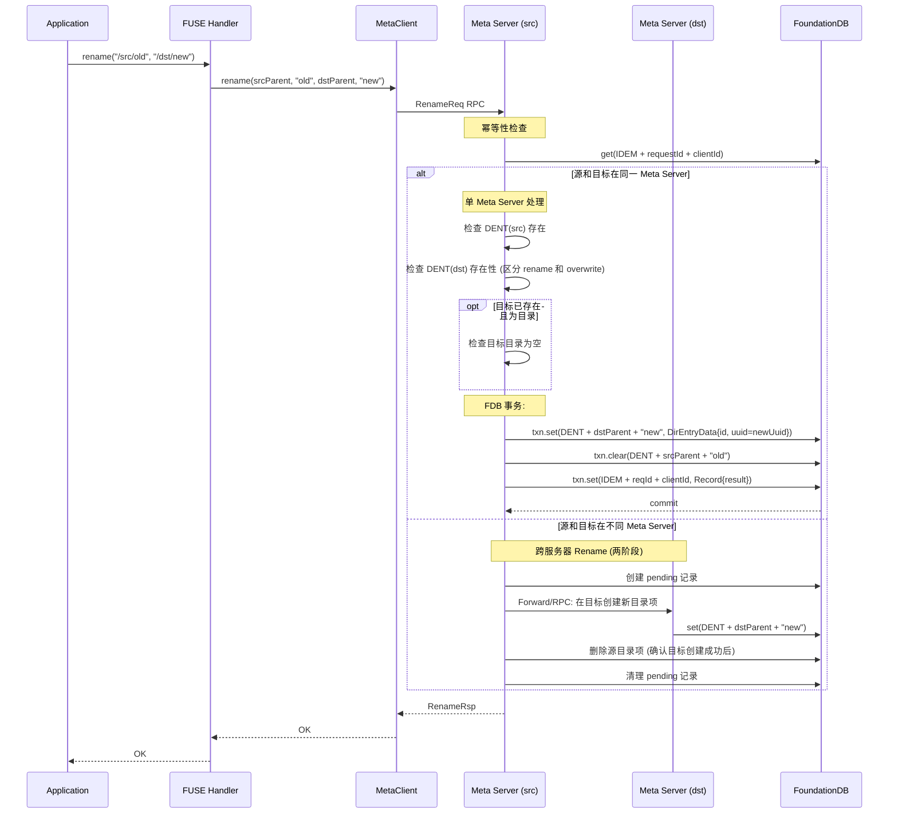
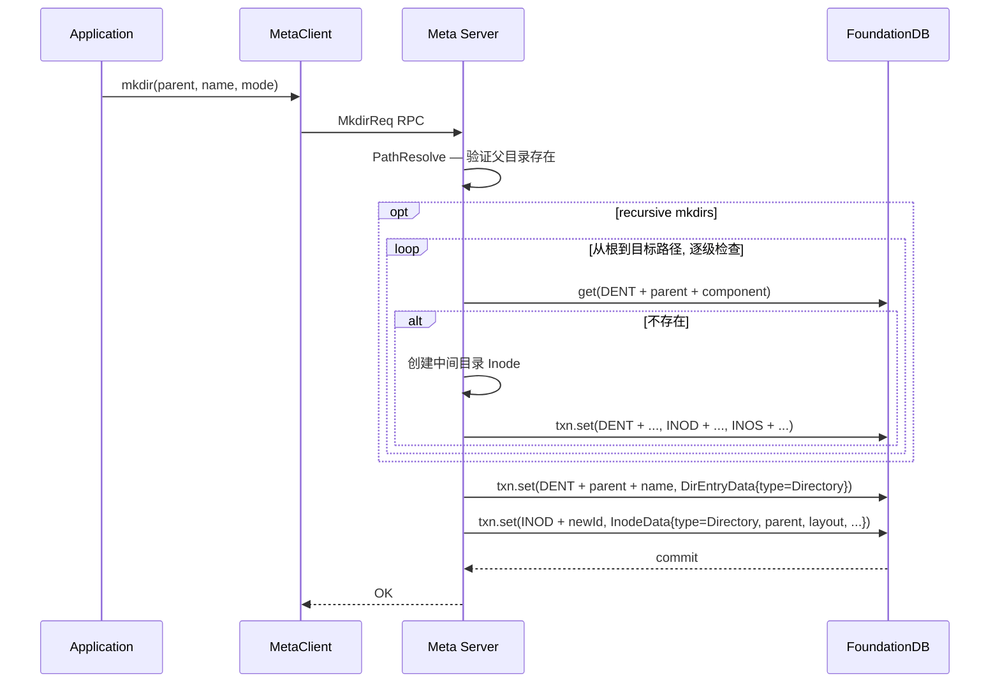

# 3FS 读写流程详解

## 概述

3FS 是一个面向大模型训练场景的高性能分布式文件系统，采用**元数据与数据分离**架构：元数据存储在 FoundationDB（通过 Meta Server 管理），文件数据通过链式复制（Chain Replication）存储在 Storage Server 上。

本文档详细描述 3FS 的完整读、写、元数据操作流程，并附带 Mermaid 时序图。

### 核心组件

| 组件 | 职责 |
|------|------|
| **FUSE / IoRing** | 接收用户态 I/O 请求，FUSE 为 POSIX 兼容入口，IoRing 为高性能旁路入口 |
| **Client（MetaClient + StorageClient）** | 客户端库，缓存 Inode、发起元数据 RPC 和数据 RPC |
| **Meta Server** | 管理 Inode、目录项、会话等元数据，读写 FDB |
| **Storage Server** | 存储文件 Chunk 数据，执行链式复制协议 |
| **Mgmtd Server** | 集群管理服务，维护路由信息（节点、链、Target 状态） |
| **FoundationDB** | 持久化存储所有元数据，提供 SSI 事务 |

### 数据布局模型

```
File (Inode)
├── chunk 0  ──> Chain 0  ──> [Target A] -> [Target B] -> [Target C]  (3 副本)
├── chunk 1  ──> Chain 1  ──> [Target D] -> [Target E] -> [Target F]
├── chunk 2  ──> Chain 0  ──> [Target A] -> [Target B] -> [Target C]  (stripe 循环)
├── ...
└── chunk N  ──> Chain N%stripeSize

Layout { chunkSize, stripeSize, chains: [0, 1, 2, ...] }
chainIndex = chunkIndex % stripeSize
```

- **chunkSize**：每个 Chunk 的大小（如 1 MiB、4 MiB），必须为 2 的幂
- **stripeSize**：参与条带化的链数量，chunk 按此值循环映射到不同链
- **动态条带（Dynamic Stripe）**：stripeSize 可按需扩展（`dynStripe`），避免创建时预分配所有链

---

## 一、读流程

### 1.1 FUSE 读入口

当应用程序调用 `read()` 时，FUSE 框架分发到 `hf3fs_read()`。

### 1.2 读时序图



### 1.3 读流程关键步骤详解

#### Step 1: Inode 缓存查找

客户端维护 `std::unordered_map<InodeId, shared_ptr<RcInode>>` 作为 Inode 缓存。打开文件时 Inode 已被缓存，后续读操作直接使用，无需再访问 Meta Server。

```cpp
// FuseOps.cc
auto pi = inodeOf(*fi, ino);  // 从 FileHandle 或全局缓存获取
pi->dynamicAttr.wlock()->atime = UtcClock::now();  // 更新访问时间
```

#### Step 2: 写缓冲区刷写

若当前 Inode 有未完成的写缓冲数据，需先刷写以保证读后写一致性（read-after-write consistency）：

```cpp
// FuseOps.cc
auto wb = pi->writeBuf;
std::lock_guard<std::mutex> lg(pi->wbMtx);
if (wb && wb->len > 0) {
    co_await flushBuf(*pi, ...);
}
```

#### Step 3: Chunk 拆分（chunkIo）

`PioV::chunkIo()` 将文件区间 `[off, off+len)` 按照文件 `chunkSize` 拆分为多个 `ReadIO`：

```
文件: [========chunk 0========][========chunk 1========][========chunk 2========]
读:          [===== 读区间 =====]
                          ┌──────────────────┐
                     ReadIO 0 (chunk 0 剩余)  ReadIO 1 (chunk 1 全部)  ReadIO 2 (chunk 2 部分)
```

对每个 `ReadIO`：
- `chainIndex = (offset / chunkSize) % stripeSize` — 确定使用哪条链
- `chunkId = ChunkId(inodeId, 0, offset / chunkSize)` — 计算 16 字节 ChunkId
- 如果单个 chunk 大于 `chunkSizeLimit`，继续拆分

#### Step 4: Target 选择

对每个 ReadIO，从链中选择一个可用的 Storage Target：

| 策略 | 行为 |
|------|------|
| `LoadBalance` (默认) | 选择当前并发 I/O 最少的 Target |
| `RoundRobin` | 按 ChainId 轮询 |
| `RandomTarget` | 随机选择 |
| `TailTarget` / `HeadTarget` | 固定选择链尾/链首 |

过滤条件：仅选择 `SERVING` 状态且在配置的流量区域内的 Target。

#### Step 5: 批量 RPC 与重试

同一 Storage Node 上的多个 ReadIO 被合并为一个 `BatchReadReq` 以减少 RPC 开销。支持指数退避重试，对路由版本过期和未提交 chunk 进行快速重试。

#### Step 6: Hole 处理

未写入的区域（hole）在存储层表现为 `kChunkNotFound` 或短读，客户端用零填充：

```cpp
// PioV.cc
if (iolen < io.length) {
    // 可能是 hole，零填充剩余部分
    memset(buf + iolen, 0, io.length - iolen);
}
```

### 1.4 IoRing 高性能读路径

除 FUSE 外，3FS 提供**共享内存 IoRing** 旁路路径，适用于对延迟敏感的高性能应用：



---

## 二、写流程

### 2.1 写时序总览

```mermaid
sequenceDiagram
    participant App as Application
    participant FUSE as FUSE Handler
    participant RC as RcInode
    participant MC as MetaClient
    participant MS as Meta Server
    participant FDB as FoundationDB
    participant PioV as PioV Engine
    participant SC as StorageClient
    participant SH as Storage Head
    participant S2 as Storage Member 2
    participant S3 as Storage Member 3

    rect rgb(240, 248, 255)
    Note over App,FDB: Phase 1: 文件创建 / 打开
    App->>FUSE: create(path, mode) / open(path, O_RDWR)
    FUSE->>FUSE: 生成 SessionId::random()
    FUSE->>MC: CreateReq(parent, name, mode, session)
    MC->>MS: CreateReq RPC
    MS->>MS: PathResolve — 解析父目录路径
    MS->>MS: 分配 InodeId (原子递增, 32 分片)
    MS->>FDB: txn.set(DENT + parent + name, DirEntryData)
    MS->>FDB: txn.set(INOD + inodeId, InodeData)
    MS->>FDB: txn.set(INOS + inodeId + sessionId, FileSession)
    FDB-->>MS: commit OK
    MS-->>MC: Inode + Layout
    MC-->>FUSE: Inode (含 Layout)
    FUSE->>RC: 缓存 Inode → RcInode
    FUSE-->>App: fd
    end

    rect rgb(255, 248, 240)
    Note over App,S3: Phase 2: 数据写入
    App->>FUSE: write(fd, data, size)

    alt 缓冲写 (默认)
        FUSE->>RC: memcpy data → InodeWriteBuf
        FUSE-->>App: 立即返回 size (异步刷写)
        Note over FUSE: 后续触发 flushBuf()
    else O_DIRECT
        FUSE->>FUSE: 分配 RDMA Buffer, memcpy data
    end

    Note over RC: flushBuf() 执行
    RC->>MC: beginWrite() → extendStripe (若需要)
    MC->>MS: SetAttrReq::extendStripe
    MS->>FDB: 更新 Inode.dynStripe
    MS-->>MC: OK

    RC->>PioV: addWrite() — 按 chunkSize 拆分为 WriteIOs
    PioV->>SC: batchWrite(writeIOs)
    SC->>SC: 选择链头 Target (HeadTarget)
    SC->>SH: WriteReq(chain, chunkId, data, RDMA buffer)

    Note over SH,S3: 链式复制协议 (5 步)
    SH->>SH: Step 1: 获取 Chunk 锁
    SH->>SH: Step 2: doUpdate() — 本地写入
    SH->>S2: Step 3: forward() — 转发到后继
    S2->>S2: 本地写入, 生成 checksum
    S2->>S3: 继续转发
    S3->>S3: 本地写入, commit
    S3-->>S2: ACK (含 checksum)
    S2-->>SH: ACK (含 checksum)
    SH->>SH: Step 4: doCommit() — 本地提交
    SH->>SH: Step 5: 比对 checksum (数据完整性校验)
    SH-->>SC: WriteRsp (length, checksum)
    SC-->>RC: 写完成
    RC->>RC: finishWrite() — bump written, update hintLength
    end

    rect rgb(240, 255, 240)
    Note over App,FDB: Phase 3: 元数据同步
    App->>FUSE: fsync(fd) / 或后台周期 sync
    FUSE->>MC: SyncReq(inodeId, hintLength, atime, mtime)
    MC->>MS: SyncReq RPC
    MS->>MS: merge hintLength (合并多个并发 sync)
    opt hintLength 有效 且 >= 已存长度
        MS->>MS: 跳过查询存储 (优化)
    else hintLength 无效
        MS->>SC: queryLength() — 查询存储服务器
        SC-->>MS: 实际文件长度
    end
    MS->>FDB: 更新 Inode.length, truncateVer, mtime, ctime
    MS-->>MC: OK
    MC-->>FUSE: OK
    FUSE-->>App: fsync 返回
    end

    rect rgb(255, 240, 245)
    Note over App,FDB: Phase 4: 文件关闭
    App->>FUSE: close(fd)
    FUSE->>RC: 移除 dirtyInodes, 释放 FileHandle
    FUSE->>MC: CloseReq(inodeId, session)
    MC->>MS: CloseReq RPC
    MS->>MS: syncAndClose() — 同步长度 + 删除会话
    MS->>FDB: 删除 INOS + inodeId + sessionId (释放写租约)
    MS-->>MC: OK
    end
```

### 2.2 写流程关键步骤详解

#### Phase 1: 文件创建 / 打开

**创建文件** (`hf3fs_create`)：
1. 客户端生成随机 `SessionId`，调用 `MetaClient::create()`
2. Meta Server 解析路径、分配 InodeId（FDB 原子计数器，32 分片避免冲突）
3. 在 FDB 中原子写入 DENT、INOD、INOS 三条记录
4. 返回 Inode 含 Layout 信息，客户端缓存为 `RcInode`

**打开已有文件** (`hf3fs_open` with O_RDWR)：
1. 若 `O_TRUNC` 且满足条件（单链接、无活跃会话、文件足够大），Meta Server 替换为新 Inode
2. 创建 `FileSession` 记录作为**写租约**，防止 O_TRUNC 替换冲突

**RcInode 数据结构**：

```cpp
struct RcInode {
    Inode inode;                                // 元数据
    int refcount;                               // 引用计数
    std::mutex wbMtx;                          // 写缓冲锁
    shared_ptr<InodeWriteBuf> writeBuf;        // 每文件写缓冲
    Synchronized<DynamicAttr> dynamicAttr;      // 动态属性
    coro::Mutex extendStripeLock;              // 条带扩展锁
};

struct DynamicAttr {
    uint64_t written;        // 写版本号 (单调递增)
    uint64_t synced;         // 已同步版本
    uint64_t fsynced;        // 已 fsync 版本
    uint64_t truncateVer;    // 最大截断版本
    VersionedLength hintLength; // (最大已写字节, truncateVer)
    uint32_t dynStripe;      // 当前动态条带大小
};
```

#### Phase 2: 数据写入

**缓冲写 vs 直接写**：

| 模式 | 触发条件 | 行为 |
|------|---------|------|
| 缓冲写 (默认) | `write_buf_size > 0` | 数据先拷贝到 `InodeWriteBuf`，立即返回成功 |
| 直接写 | `O_DIRECT` 或 `write_buf_size == 0` | 分配 RDMA Buffer，立即刷写到存储 |

缓冲写的刷写时机：
- 缓冲区已满
- 非顺序写（当前偏移不接续上一个写）
- 后续读操作之前（保证 read-after-write）
- `fsync()` 调用时
- 后台周期性刷写（`periodicSync`）

**动态条带扩展（Dynamic Stripe Extension）**：

```
初始: dynStripe = 1 (仅使用 Chain 0)
写入 chunk 0 → Chain 0  ✓
写入 chunk 1 → 需要 Chain 1 → beginWrite() 触发 extendStripe()
                                    Meta Server 将 dynStripe 更新为 2
写入 chunk 1 → Chain 1  ✓
写入 chunk 2 → 需要 Chain 0  ✓ (循环复用)
```

**链式复制协议（Chain Replication Protocol）**：

存储层采用 **链式复制**保证多副本一致性，写入时仅与链头通信：

```
Client → [Head] → [Member 2] → [Member 3]
                    ↑                ↑
                本地写入           本地写入
                                    ↓
                               commit
                               ↓
Client ← [Head] ← [Member 2] ← ACK
              ↑
          本地 commit
          checksum 校验
```

5 个步骤：
1. **Lock Chunk**：获取 Chunk 级别互斥锁，串行化同一 Chunk 的写操作
2. **Local Update**：写入本地存储引擎，获取 `updateVer`
3. **Forward to Successor**：转发给链中下一个 Target，递归执行相同操作
4. **Commit**：所有后继确认后，本地提交写操作（变为可见和持久化）
5. **Response**：结果（长度、checksum）沿链返回给客户端

此外，`ReliableUpdate` 层提供**幂等性保证**：通过 `UpdateChannel`（clientId + channel + seqnum）检测重复请求，网络重试不会导致数据重复写入。

#### Phase 3: 元数据同步

写入完成后，Inode 的 `length`（文件大小）需要同步到 Meta Server。3FS 采用**延迟同步**策略：

**hintLength 优化**：客户端维护本地已写最大偏移量，sync 时发送给 Meta Server。若 hint 有效且 Meta Server 已存长度 ≥ hint，则跳过昂贵的存储查询。

**Sync 触发时机**：
- `fsync()` / `fdatasync()`
- `stat()` / `lookup()` 时（若配置 `flush_on_stat`）
- 后台周期同步（`periodicSync`）

**Meta Server 端的 queryLength**：若 hint 无效，Meta Server 向所有链发送 `QueryLastChunk` RPC 查询实际最高已写字节偏移。

#### Phase 4: 文件关闭

```
close 流程:
1. 从 dirtyInodes 移除
2. 释放 FileHandle (RcInode refcount--)
3. 发送 CloseReq → Meta Server
4. Meta Server: syncAndClose()
   ├── 合并 hintLength
   ├── queryLength (如需要)
   ├── 更新 Inode (FDB)
   └── 删除 FileSession (释放写租约)
5. 若关闭失败 → 加入 bgCloser_ 后台重试队列
```

---

## 三、Truncate 流程

Truncate 是最复杂的写操作之一，涉及数据删除和元数据精确同步。



---

## 四、元数据操作流程

### 4.1 元数据分发机制

Meta Server 集群通过**一致性哈希**将 Inode 分布到不同的 Meta Server 节点：

```
Client → MetaDistributor → hash(InodeId) → Meta Server 1/2/3/...

路由方式:
- 单 Inode 操作 (stat, setattr): hash(inodeId) → 目标 Meta Server
- 父目录操作 (create, lookup, unlink, rename): hash(parentInodeId) → 目标 Meta Server
- 路径解析: 逐级解析, 每级 hash 父 InodeId 到对应 Meta Server
```

若请求路由到错误的 Meta Server，服务端通过 `Forward` 机制转发到正确的节点。

### 4.2 Lookup（路径解析）



### 4.3 Create（创建文件/目录）



**关键点**：
- DENT、INOD、INOS 三条记录在同一 FDB 事务中原子写入
- 目录项的 `uuid` 字段用于 rename 的幂等性
- `FileSession` 创建了写租约，允许后续写操作

### 4.4 Remove（删除文件）



**删除两种模式**：

| 模式 | 条件 | 行为 |
|------|------|------|
| 延迟删除 | Inode 有活跃写会话 | `nlink--`，等待会话关闭 |
| 直接删除 | 无活跃会话 | 原子删除 DENT + INOD，创建 GC 条目 |

### 4.5 Rename（重命名）



**Rename 幂等性**：目录项的 `uuid` 字段唯一标识一次 rename 操作。重试时通过 `IDEM` 记录检测重复，幂等返回。

### 4.6 Mkdir（创建目录）



---

## 五、幂等性与容错机制

### 5.1 客户端幂等（Idempotent Records）

Meta Server 为 remove 和 rename 操作提供**幂等性保证**，处理 FDB 的 `commit_unknown_result` 错误：

```
客户端发送 RemoveReq (requestId + clientId)
        │
        ▼
┌─────────────────────┐
│ 检查 IDEM 记录      │── 有 → 直接返回历史结果 (幂等)
│ (FDB get)           │
└────────┬────────────┘
         │ 无
         ▼
┌─────────────────────┐
│ 执行实际操作        │
│ (FDB 事务)          │
└────────┬────────────┘
         │
    ┌────┴────┐
    │         │
  成功      commit_unknown_result
    │         │
    ▼         ▼
 写入 IDEM   重试整个流程
 (同一事务)  (再次检查 IDEM)
```

**设计要点**：
- `IDEM` Key 格式：`requestId(16B) + clientId(16B)` — requestId 在前避免热点
- IDEM 记录与实际数据变更在**同一 FDB 事务**中原子写入
- 过期记录（默认 30 分钟）由后台任务清理

### 5.2 存储层幂等（ReliableUpdate）

```
客户端重试 WriteReq (相同 UpdateChannel: clientId + channelId + seqnum)
        │
        ▼
┌─────────────────────┐
│ ReliableUpdate      │
│ 检查 channel seqnum │── 已处理 → 返回缓存结果 (幂等)
└────────┬────────────┘
         │ 新请求
         ▼
┌─────────────────────┐
│ 获取 Chunk 锁       │
│ 本地写入            │
│ 转发给后继          │
│ 等待全部 ACK        │
│ 本地 Commit         │
└─────────────────────┘
```

### 5.3 FDB 事务重试

3FS 对 FDB 事务使用 `FDBRetryStrategy`（`fdb_client_max_retries` 控制），自动处理：
- 事务冲突（`not_committed`）
- `commit_unknown_result`
- FDB 暂时不可用

对于 remove/rename 等修改操作，事务重试通过幂等性系统保证正确性。

---

## 六、关键文件索引

| 功能 | 文件路径 |
|------|---------|
| FUSE 操作处理器 | `src/fuse/FuseOps.cc` |
| IoRing 高性能路径 | `src/fuse/IoRing.cc` |
| PioV Chunk I/O 引擎 | `src/fuse/PioV.cc` |
| RcInode / FileHandle 定义 | `src/fuse/FuseClients.h` |
| Layout / ChunkId / ChainId | `src/fbs/meta/Schema.h` + `.cc` |
| MetaClient RPC | `src/client/meta/MetaClient.cc` |
| StorageClient 读写 | `src/client/storage/StorageClientImpl.cc` |
| 存储层链式复制 | `src/storage/service/StorageOperator.cc` |
| ReliableUpdate 幂等 | `src/storage/service/ReliableUpdate.cc` |
| Meta Open/Close | `src/meta/store/ops/Open.cc` |
| Meta Remove | `src/meta/store/ops/Remove.cc` |
| Meta Rename | `src/meta/store/ops/Rename.cc` |
| Meta Mkdirs | `src/meta/store/ops/Mkdirs.cc` |
| Meta 批量 Sync/Close | `src/meta/store/ops/BatchOperation.cc` |
| 幂等性记录 | `src/meta/store/Idempotent.h` |
| 元数据分发 | `src/meta/components/Distributor.cc` |
| 路径解析引擎 | `src/meta/store/PathResolve.cc` |
| FDB 重试策略 | `src/fdb/FDBRetryStrategy.h` |
