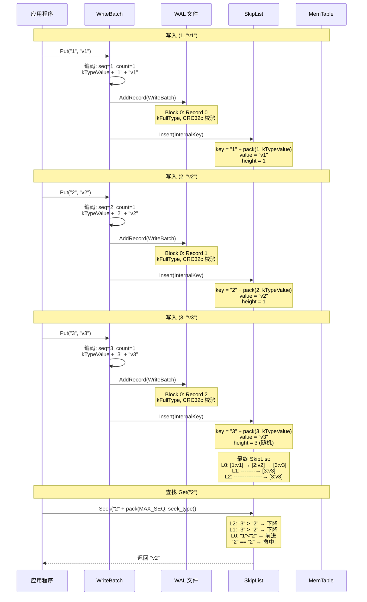

# RocksDB 写入 (1,1) (2,2) (3,3) 过程详解

---

## 目录

1. [写入概览](#1-写入概览)
2. [写入 (1,1) 详细过程](#2-写入-1-1-详细过程)
3. [写入 (2,2) 详细过程](#3-写入-2-2-详细过程)
4. [写入 (3,3) 详细过程](#4-写入-3-3-详细过程)
5. [最终 SkipList 形态](#5-最终-skiplist-形态)
6. [Flush 后的 SST 文件形态](#6-flush-后的-sst-文件形态)
7. [完整时序流程图](#7-完整时序流程图)

---

## 1. 写入概览

```
三次写入的完整数据流:

  Put(1, "v1") → Put(2, "v2") → Put(3, "v3")

  每次写入:
    1. 构造 WriteBatch
    2. 分配 SequenceNumber (递增)
    3. 编码为 InternalKey (user_key + seq + type)
    4. 写入 WAL
    5. 插入 MemTable (SkipList)
```

### InternalKey 编码规则

```
用户写入: Put(user_key, value)

InternalKey = user_key + PackSequenceAndType(seq, type)
  type = kTypeValue = 0x01

排序规则:
  user_key 升序 (1 < 2 < 3)
  sequence 降序 (seq 大的排前面)
  → 同一个 user_key 的新版本排在旧版本前面
```

---

## 2. 写入 (1,1) 详细过程

### 2.1 WriteBatch 编码

```
WriteBatch #1:
  Header:  sequence = 1, count = 1
  Entry:   kTypeValue, key = "1", value = "v1"

  二进制编码:
  ┌────────────┬────────────────────────────────────┐
  │ Header     │ Entry                               │
  │ seq: 8B    │ count: 4B = 1                       │
  │ = 0x000000 │ [kTypeValue=0x01] [len=1] [1]       │
  │  00000001  │ [len=2] [v1]                        │
  └────────────┴────────────────────────────────────┘
```

### 2.2 WAL 记录

```
WAL 文件 (000001.log):

  Block 0 (32KB):
  ┌─────────────────────────────────────────────┐
  │ Record 0: kFullType                        │
  │ ┌────────┬──────┬──────┬──────────────────┐ │
  │ │ CRC    │ Size  │ Type │ Payload           │ │
  │ │ 4B     │ 2B    │ 1B   │ WriteBatch 编码  │ │
  │ │        │ = 17  │ = 1  │ (header+entry)   │ │
  │ └────────┴──────┴──────┴──────────────────┘ │
  │                                             │
  │ (剩余空间空置，等待后续记录)                  │
  └─────────────────────────────────────────────┘
```

### 2.3 MemTable SkipList 插入

```
InternalKey 编码:
  user_key = "1" (1字节)
  seq = 1, type = kTypeValue (0x01)
  packed = (1 << 8) | 0x01 = 0x0000000000000101

  完整 InternalKey (字节):
  ┌─────────┬───────────────────────┐
  │ "1"     │ 0x01 0x00 0x00 ...    │
  │ user_key│ seq=1 + type=0x01     │
  │ 1 byte  │ 8 bytes trailer       │
  └─────────┴───────────────────────┘

SkipList (插入 1 个节点):

  Level 0: → [1|seq=1|v1] →

  高层: 空 (随机高度 = 1)

  Arena 状态:
    已分配: InternalKey (9B) + value ("v1", 2B) + SkipList Node ≈ 50B
    总计: ~60 bytes
```

---

## 3. 写入 (2,2) 详细过程

### 3.1 WriteBatch 编码

```
WriteBatch #2:
  Header:  sequence = 2, count = 1
  Entry:   kTypeValue, key = "2", value = "v2"

  二进制编码:
  ┌────────────┬────────────────────────────────────┐
  │ Header     │ Entry                               │
  │ seq: 8B    │ count: 4B = 1                       │
  │ = 0x000000 │ [kTypeValue=0x01] [len=1] [2]       │
  │  00000002  │ [len=2] [v2]                        │
  └────────────┴────────────────────────────────────┘
```

### 3.2 WAL 记录

```
WAL 文件 (000001.log):

  Block 0 (32KB):
  ┌─────────────────────────────────────────────┐
  │ Record 0: kFullType (WriteBatch #1)         │
  │ [CRC][Size=17][Type=1][payload]              │
  │                                             │
  │ Record 1: kFullType (WriteBatch #2)         │
  │ ┌────────┬──────┬──────┬──────────────────┐ │
  │ │ CRC    │ Size  │ Type │ Payload           │ │
  │ │ 4B     │ 2B    │ 1B   │ WriteBatch 编码  │ │
  │ │        │ = 17  │ = 1  │ (header+entry)   │ │
  │ └────────┴──────┴──────┴──────────────────┘ │
  │                                             │
  │ (剩余空间空置)                               │
  └─────────────────────────────────────────────┘
```

### 3.3 MemTable SkipList 插入

```
InternalKey 编码:
  user_key = "2"
  seq = 2, type = kTypeValue
  packed = (2 << 8) | 0x01 = 0x0000000000000201

SkipList (插入后，2 个节点):

  排序: "1" < "2"，所以 node[1] 排在 node[2] 前面

  Level 2: (空)
  Level 1: (空，假设 node[2] 高度也为 1)
  Level 0: → [1|seq=1|v1] → [2|seq=2|v2] →

  Arena 状态: ~120 bytes
```

---

## 4. 写入 (3,3) 详细过程

### 4.1 WriteBatch 编码

```
WriteBatch #3:
  Header:  sequence = 3, count = 1
  Entry:   kTypeValue, key = "3", value = "v3"

  二进制编码:
  ┌────────────┬────────────────────────────────────┐
  │ Header     │ Entry                               │
  │ seq: 8B    │ count: 4B = 1                       │
  │ = 0x000000 │ [kTypeValue=0x01] [len=1] [3]       │
  │  00000003  │ [len=2] [v3]                        │
  └────────────┴────────────────────────────────────┘
```

### 4.2 WAL 记录

```
WAL 文件 (000001.log):

  Block 0 (32KB):
  ┌─────────────────────────────────────────────┐
  │ Record 0: kFullType (seq=1, Put(1,v1))     │
  │ Record 1: kFullType (seq=2, Put(2,v2))     │
  │ Record 2: kFullType (seq=3, Put(3,v3))     │
  │                                             │
  │ (剩余 ~32KB 空间)                            │
  └─────────────────────────────────────────────┘
```

### 4.3 MemTable SkipList 插入

```
InternalKey 编码:
  user_key = "3"
  seq = 3, type = kTypeValue
  packed = (3 << 8) | 0x01 = 0x0000000000000301

SkipList (假设 node[3] 随机高度 = 3):

  Level 2:           ─────────────────→ [3|seq=3|v3]
  Level 1:  ──────────────────→ [3|seq=3|v3]
  Level 0:  → [1|seq=1|v1] → [2|seq=2|v2] → [3|seq=3|v3] →

  Arena 状态: ~180 bytes
```

---

## 5. 最终 SkipList 形态

### 5.1 内存布局

```
MemTable (Arena 分配):

  ┌──────────────────────────────────────────────────────────┐
  │                    SkipList                               │
  │                                                           │
  │  head_ ──────────────────────────────────────────────┐    │
  │  Level 2:  ─────────────────────────────→ ┌───────┐   │    │
  │                                            │ node3 │   │    │
  │  Level 1:  ────────────────────────→ ┌────┤       │   │    │
  │                                     │ n3 │       │   │    │
  │  Level 0:  → ┌─────┐ → ┌─────┐ → ┌──┤────┴───────┘   │    │
  │              │node1│   │node2│   │node3│              │    │
  │              └─────┘   └─────┘   └─────┘              │    │
  └──────────────────────────────────────────────────────────┘

  每个 node 存储内容:

  node1:
    key:   "1" + 0x0000000000000101  (user_key "1" + seq=1 + type=value)
    value: "v1"

  node2:
    key:   "2" + 0x0000000000000201  (user_key "2" + seq=2 + type=value)
    value: "v2"

  node3:
    key:   "3" + 0x0000000000000301  (user_key "3" + seq=3 + type=value)
    value: "v3"
    height: 3 (随机，概率 1/4 × 1/4 = 1/16)

  排序结果 (user_key 升序):
    "1" < "2" < "3"  →  node1 → node2 → node3
```

### 5.2 查找过程示例

```
查找 Get("2"):

  1. 构建 LookupKey:
     InternalKey = "2" + pack(MAX_SEQ, kTypeValuePreferredSeqno)
     = "2" + 0xFFFFFFFFFFFFFF18

  2. SkipList 查找:
     从 head_ Level 2 开始:
       Level 2: node3.key = "3" + seq=3 → "3" > "2" → 不前进，下降
       Level 1: node3.key = "3" + seq=3 → "3" > "2" → 不前进，下降
       Level 0: node1.key = "1" + seq=1 → "1" < "2" → 前进到 node1
               node2.key = "2" + seq=2 → 匹配!

  3. 比较确认:
     InternalKey 的 user_key 部分 "2" == 查找的 "2"
     type = kTypeValue (不是 deletion)
     → 返回 value = "v2"

查找 Get("5"):
  1. InternalKey = "5" + pack(MAX_SEQ, ...)
  2. SkipList:
     Level 2: node3.key = "3" → "3" < "5" → 前进到 node3
               next = null → 下降
     Level 1: (node3 已是最后一个) → 下降
     Level 0: (node3 已是最后一个) → 返回 NotFound
  3. → Status::NotFound()
```

---

## 6. Flush 后的 SST 文件形态

### 6.1 触发条件

```
假设 write_buffer_size = 64MB:
  当前 MemTable: ~180 bytes << 64MB
  → 不会自动触发 Flush

  手动触发:
  db->Flush(FlushOptions())
  → FlushJob::Run()
  → 将 MemTable 写入 SST 文件
```

### 6.2 SST 文件结构

```
SST 文件 (000020.sst, 假设使用默认 BlockBasedTable):

  ┌───────────────────────────────────────────────────────┐
  │ Data Block 0:                                         │
  │                                                       │
  │  Entry 1 (无前缀共享，第一个 entry):                   │
  │    shared_len  = 0  (varint32)                        │
  │    unshared_len = 1  (varint32)                        │
  │    value_len   = 2  (varint32)                        │
  │    key_delta    = "1"                                  │
  │    value        = "v1"                                 │
  │                                                       │
  │  Entry 2 (前缀无共享):                                │
  │    shared_len  = 0  (varint32)                        │
  │    unshared_len = 1  (varint32)                        │
  │    value_len   = 2  (varint32)                        │
  │    key_delta    = "2"                                  │
  │    value        = "v2"                                 │
  │                                                       │
  │  Entry 3:                                             │
  │    shared_len  = 0  (varint32)                        │
  │    unshared_len = 1  (varint32)                        │
  │    value_len   = 2  (varint32)                        │
  │    key_delta    = "3"                                  │
  │    value        = "v3"                                 │
  │                                                       │
  │  Restart Points (每 1 个 entry):                      │
  │    restart[0] = 0  (Entry 1 的 offset)                 │
  │    restart[1] = 9  (Entry 2 的 offset)                 │
  │    restart[2] = 18 (Entry 3 的 offset)                 │
  │    num_restarts = 3  (uint32)                          │
  │                                                       │
  │  Block Trailer:                                        │
  │    compression_type = 0x00 (kNoCompression)            │
  │    CRC32c = 0xXXXXXXXX                                │
  ├───────────────────────────────────────────────────────┤
  │ Meta Block: Bloom Filter                               │
  │  (包含 "1", "2", "3" 的布隆过滤器)                     │
  ├───────────────────────────────────────────────────────┤
  │ Meta Block: Properties                                │
  │  data_size, index_size, num_entries = 3,               │
  │  raw_key_size, raw_value_size, ...                    │
  ├───────────────────────────────────────────────────────┤
  │ Meta Index Block                                      │
  │  {"rocksdb.filter.2" → filter_block_handle}            │
  │  {"rocksdb.properties" → properties_block_handle}     │
  ├───────────────────────────────────────────────────────┤
  │ Index Block:                                          │
  │  Entry 1: key = "1" + seq=3 + type (largest in block) │
  │            value = BlockHandle(offset=0, size=30)      │
  ├───────────────────────────────────────────────────────┤
  │ Footer:                                               │
  │  checksum_type (1B) | metaindex_handle | index_handle │
  │  format_version=7 (4B) | magic = 0x88e241b785f4cff7   │
  └───────────────────────────────────────────────────────┘
```

### 6.3 Flush 后的 MANIFEST 变更

```
MANIFEST 新增 VersionEdit:

  kNewFile4:
    level       = 0
    file_number = 20
    file_size   = ~200 bytes
    smallest    = "1" + seq=1 + type=value
    largest     = "3" + seq=3 + type=value

  kLogNumber:
    min_log_number_to_keep = 2  (或更高)
    → 000001.log 可以被删除/回收
```

---

## 7. 完整时序流程图



### 7.1 各阶段数据形态总结

```
                     WriteBatch    WAL              SkipList        SST
                    (编码格式)   (磁盘文件)       (内存结构)     (磁盘文件)

Put(1, v1):         seq=1       Block0:Rec0     [1|v1]           -
                    count=1     kFullType       L0 only
                    put(1,v1)

Put(2, v2):         seq=2       Block0:Rec1     [1|v1]→[2|v2]   -
                    count=1     kFullType       L0 only
                    put(2,v2)

Put(3, v3):         seq=3       Block0:Rec2     [1|v1]→[2|v2]→[3|v3]
                    count=1     kFullType       L1: →[3|v3]
                    put(3,v3)                    L2: →[3|v3]

Flush:              -           (保留到<br/>MIN_LOG)   (释放)
                                                      Level 0:
                                              [1|v2|v3]
                                              Data Block 0
                                              + Index Block
                                              + Bloom Filter
                                              + Footer
```
