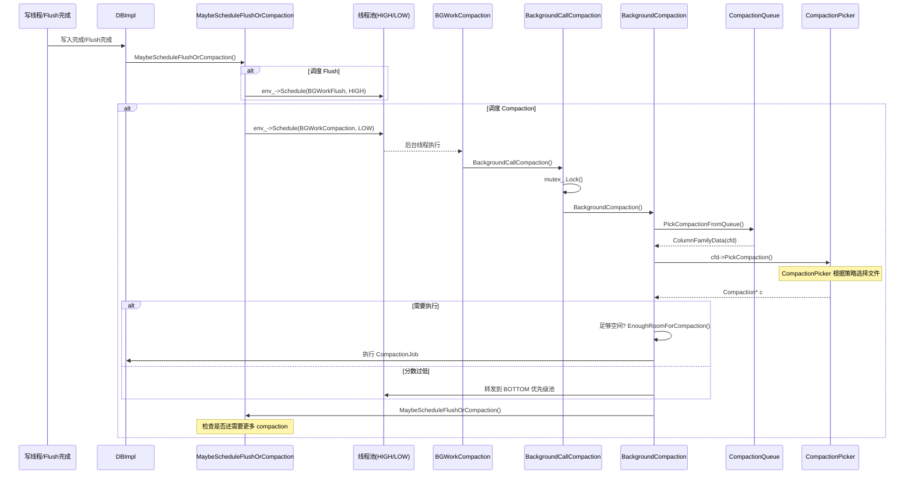
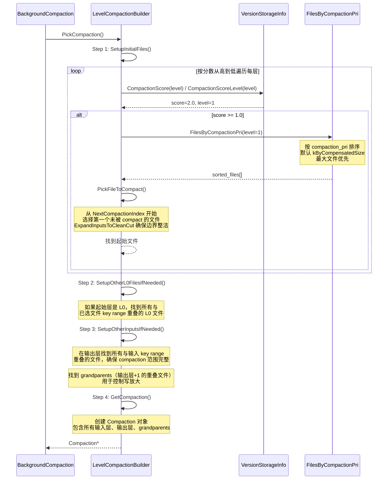
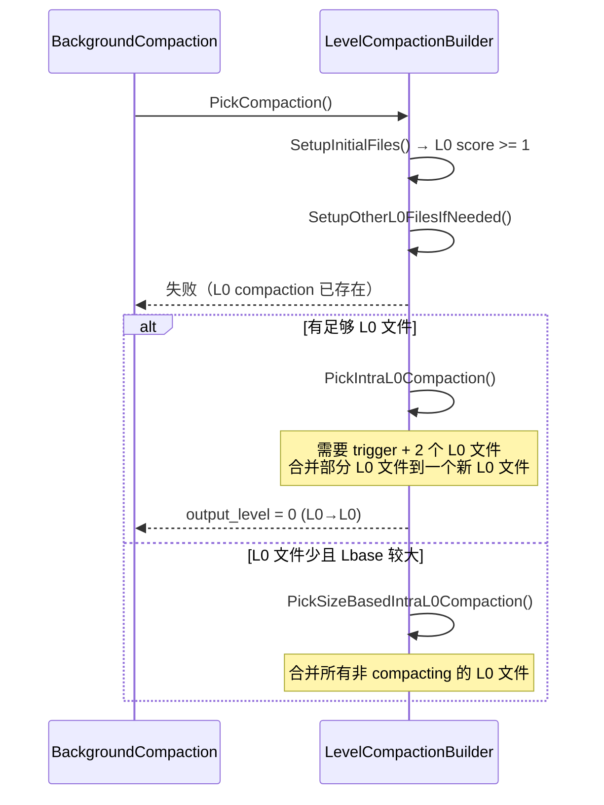
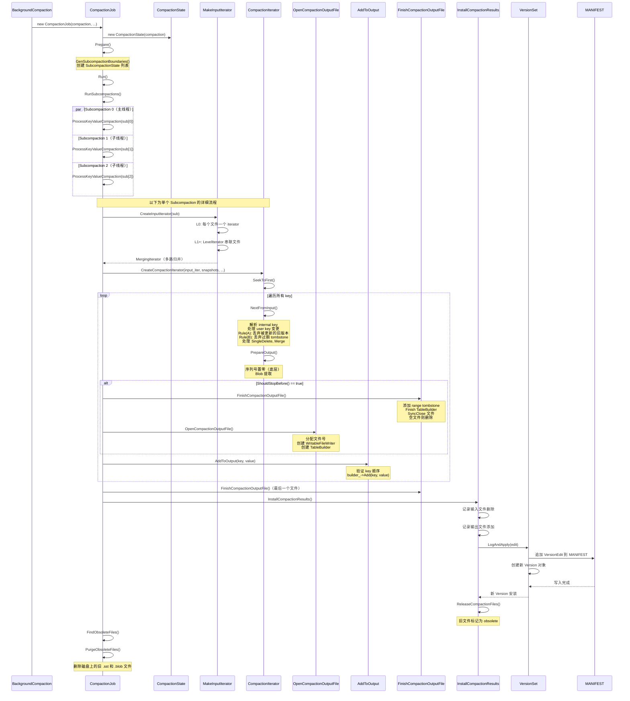
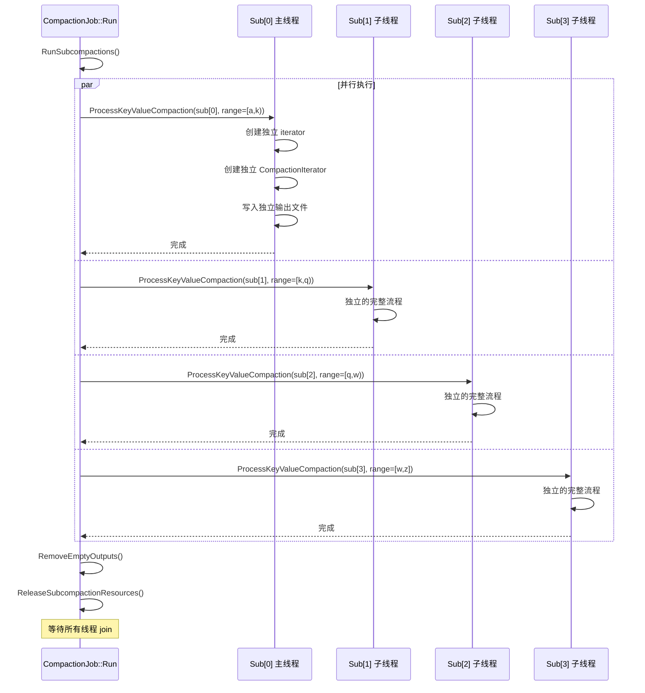
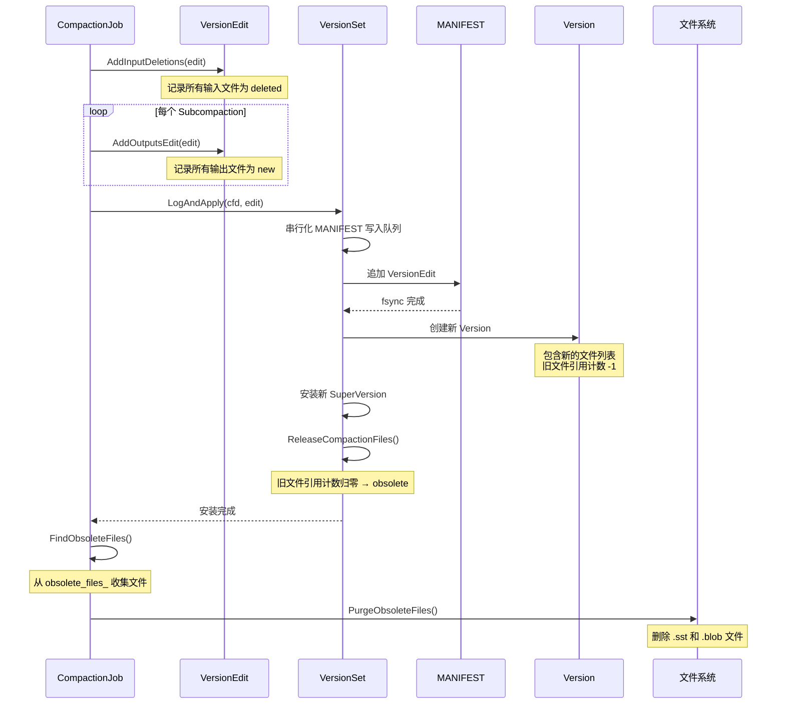
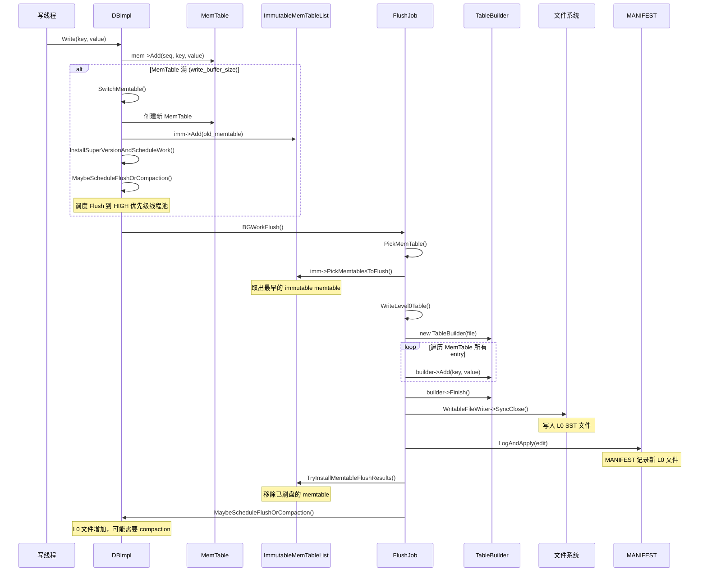
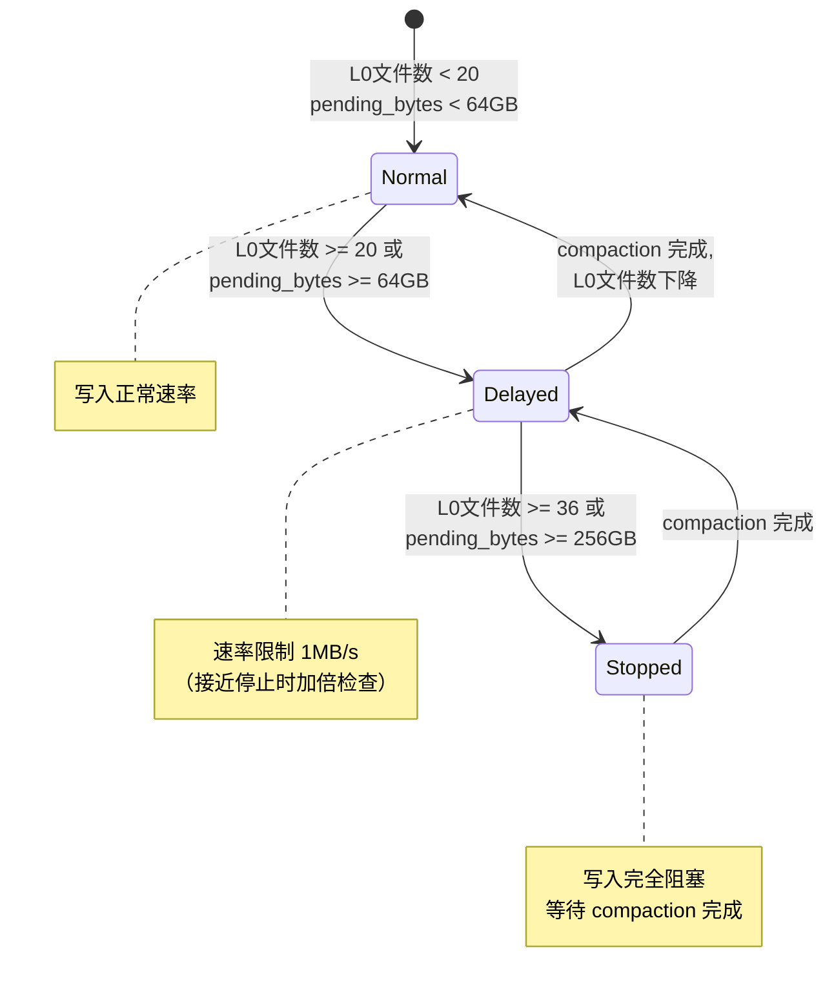

# RocksDB Compaction 机制分析

## 目录

1. [Compaction 概述](#1-compaction-概述)
2. [三种 Compaction 策略](#2-三种-compaction-策略)
3. [Compaction 调度与触发](#3-compaction-调度与触发)
4. [文件选择与评分机制](#4-文件选择与评分机制)
5. [Level 0 特殊处理](#5-level-0-特殊处理)
6. [Compaction 执行流程](#6-compaction-执行流程)
7. [CompactionIterator 核心逻辑](#7-compactioniterator-核心逻辑)
8. [子 Compaction（并行化）](#8-子-compaction并行化)
9. [输出文件管理与安装](#9-输出文件管理与安装)
10. [Flush 机制](#10-flush-机制)
11. [Write Stall 写停顿](#11-write-stall-写停顿)
12. [CompactionFilter](#12-compactionfilter)
13. [源码索引](#13-源码索引)

---

## 1. Compaction 概述

Compaction 是 LSM-Tree（Log-Structured Merge Tree）架构的核心机制。RocksDB 将写入先写入 MemTable 和 WAL，当 MemTable 满后刷盘为 SST 文件存入 L0 层。随着 SST 文件不断积累，Compaction 将多层的 SST 文件**合并重写**到更低层，完成以下目标：

| 目标 | 说明 |
|------|------|
| **回收空间** | 删除被 Tombstone 覆盖的旧数据 |
| **降低读放大** | 减少 SST 文件数量，减少读时需要搜索的文件 |
| **降低空间放大** | 清理同一 key 的多个历史版本 |
| **保持有序性** | 确保每层内文件按键范围有序、不重叠 |

** LSM-Tree 层级结构（Leveled 策略）**：

```
写入 → MemTable → L0 SST ──Compaction──→ L1 SST ──→ ... ──→ L6 SST
                      (小文件, 互相可能重叠)  (按键有序, 互不重叠)
```

**层大小关系（默认配置）**：

```
L1:  256 MB  (max_bytes_for_level_base)
L2:  2.56 GB (L1 × 10)
L3:  25.6 GB (L2 × 10)
L4:  256 GB
L5:  2.56 TB
L6:  25.6 TB
```

---

## 2. 三种 Compaction 策略

### 2.1 类层次结构

```
CompactionPicker (抽象基类, db/compaction/compaction_picker.h:48)
├── PickCompaction() → 选择要 compact 的文件
├── NeedsCompaction() → 是否需要 compaction
│
├── LevelCompactionPicker (默认, compaction_picker_level.h)
│   └── 分层合并: L0→L1→L2→...→L6
│
├── UniversalCompactionPicker (compaction_picker_universal.h)
│   └── 按比例合并 sorted runs，降低空间放大
│
├── FIFOCompactionPicker (compaction_picker_fifo.h)
│   └── 删除最旧文件，适用于时间序列数据
│
└── NullCompactionPicker (compaction_picker.h:274)
    └── 不触发自动 compaction
```

### 2.2 Leveled Compaction（默认）

```
核心思想：每层按大小限制触发，文件按键范围有序不重叠

L0: [f1] [f2] [f3] [f4]     ← 互相可能重叠，按 seq 排序
       ↓  compaction
L1: [f_a][f_b][f_c][f_d]    ← 按 key range 有序，互不重叠
         ↓  compaction
L2: [f_A][f_B][f_C][f_D][f_E]
```

- **触发条件**：某层大小超过限制 → `score = level_size / MaxBytesForLevel(level)`
- **空间放大**：较高（多版本存在）
- **写放大**：中等（~10x，受 max_bytes_for_level_multiplier 影响）
- **读放大**：低（每层最多一个文件包含目标 key）

### 2.3 Universal Compaction

```
核心思想：所有文件视为 sorted runs，按比例合并

sorted runs: [SR0] [SR1] [SR2] [SR3] [SR4] [SR5]
                  │       │       │
                  └───┬───┘       │
                      │           │
              [SR0+SR1+SR2]     [SR3] [SR4] [SR5]
```

**优先级链**（`compaction_picker_universal.cc:767`）：
1. `MaybePickPeriodicCompaction()` — 周期性全量 compaction
2. `MaybePickSizeAmpCompaction()` — 减少空间放大（`size_ratio > max_size_amplification_percent`）
3. `MaybePickSizeRatioCompaction()` — 按大小比例合并（新 run ≥ 前面所有 run 之和 × `size_ratio%`）
4. `MaybePickReadAmpCompaction()` — 减少读放大（`max_read_amp` 限制 sorted run 数量）

### 2.4 FIFO Compaction

```
核心思想：所有文件在 L0，按创建时间排序，直接删除最旧文件

L0: [f_old] [f_2] [f_3] [f_4] [f_newest]
        ↓ 超过 max_table_files_size → 直接删除
L0: [f_2] [f_3] [f_4] [f_newest]
```

**优先级链**（`compaction_picker_fifo.cc:730`）：
1. `PickTTLCompaction()` — 删除超过 TTL 的最旧文件
2. `PickSizeCompaction()` — 删除最旧文件直到总大小 ≤ `max_table_files_size`
3. `PickIntraL0Compaction()` — 合并小文件（需要 `allow_compaction = true`）
4. `PickTemperatureChangeCompaction()` — 迁移文件温度

**适用场景**：时间序列、日志数据，数据有天然过期时间。

### 2.5 策略对比

| 特性 | Leveled | Universal | FIFO |
|------|---------|-----------|------|
| 写放大 | ~10x | ~10-30x（取决于配置） | ~1x（不重写） |
| 空间放大 | 较高 | 低（可控） | 取决于 TTL |
| 读放大 | 低（L × max_files_per_level） | 高（sorted runs 数量） | 中等 |
| 适用场景 | 通用 | 写多读少，需要低空间放大 | 时序数据、日志 |

---

## 3. Compaction 调度与触发

### 3.1 调度流程时序图



### 3.2 调度入口

```cpp
// db/db_impl/db_impl_compaction_flush.cc:3160-3254
void DBImpl::MaybeScheduleFlushOrCompaction() {
    mutex_.AssertHeld();

    // 前置检查：DB 未打开、BG 工作暂停、错误、关闭等
    if (!opened_successfully_ || bg_work_paused_ > 0 || ...) return;

    auto bg_job_limits = GetBGJobLimits();
    // max_background_jobs 默认 2
    // 1/4 用于 flush，3/4 用于 compaction
    // 如果 max_background_flushes/compactions 都为 -1（默认）则自动分配

    // Phase 1: HIGH 优先级池调度 Flush
    while (!is_flush_pool_empty && unscheduled_flushes_ > 0 &&
           bg_flush_scheduled_ < bg_job_limits.max_flushes) { ... }

    // Phase 2: LOW 优先级池调度 Compaction
    while (bg_compaction_scheduled_ < bg_job_limits.max_compactions &&
           unscheduled_compactions_ > 0) { ... }
}
```

### 3.3 线程池分配

```
max_background_jobs (默认 2)
├── Flush 线程 = max(1, total / 4) = 1
│   └── Env::Priority::HIGH
└── Compaction 线程 = max(1, total - flush) = 1
    └── Env::Priority::LOW
    └── Env::Priority::BOTTOM（低分 compaction 降级）

注意：如果 write_controller.NeedSpeedupCompaction() == false，
      compaction 线程数限制为 1（避免与前台写争抢 IO）
```

### 3.4 CompactionReason 枚举

```cpp
// include/rocksdb/listener.h:113-164
enum class CompactionReason : int {
    kLevelL0FilesNum,              // L0 文件数 > trigger
    kLevelMaxLevelSize,            // 某层大小超限
    kUniversalSizeAmplification,   // Universal: 空间放大
    kUniversalSizeRatio,           // Universal: 大小比例
    kFIFOMaxSize,                  // FIFO: 总大小超限
    kFIFOTtl,                      // FIFO: TTL 过期
    kManualCompaction,             // 用户手动触发
    kBottommostFiles,              // 底层 tombstone 清理
    kTtl,                          // TTL 过期
    kPeriodicCompaction,           // 周期性 compaction
    kReadTriggered,                // 读触发
    kExternalSstIngestion,         // 外部 SST 导入
    kForcedBlobGC,                 // Blob GC
    // ... 共 22 种原因
};
```

---

## 4. 文件选择与评分机制

### 4.1 评分计算

```cpp
// db/version_set.cc:3770-3973
void VersionStorageInfo::ComputeCompactionScore(...) {
    for (int level = 0; level < num_levels(); level++) {
        double score;

        if (level == 0) {
            // L0: score = 文件数 / trigger_threshold
            score = (double)num_sorted_runs / level0_file_num_compaction_trigger;
            // dynamic_level_bytes 模式下还会考虑 L0 总大小
            if (score > 1.0) score *= kScoreScale;  // × 10.0 加权
        } else {
            // L1+: score = 当前大小 / 目标大小
            score = level_bytes_no_compacting / MaxBytesForLevel(level);
        }

        // 超标层优先级 × 10
        // 按 score 降序排列，最高分的层优先 compaction
    }
}
```

**评分示例**（默认配置，4 个 L0 文件，L1 超过 256MB）：

```
L0: num_files=4, trigger=4 → score = 4/4 = 1.0
L1: size=512MB, target=256MB → score = 512/256 = 2.0
L2: size=2GB, target=2.56GB → score = 2/2.56 = 0.78

排序结果: L1(2.0) > L0(1.0) > L2(0.78)
→ 优先选择 L1 → L2 的 compaction
```

### 4.2 Level Compaction 文件选择时序图



### 4.3 文件优先级排序（CompactionPri）

```cpp
// db/version_set.cc:4489-4555
switch (ioptions.compaction_pri) {
    case kByCompensatedSize:       // 默认：按补偿大小降序
        // compensated_size = file_size + seqno_range_penalty
        // 大文件 + 序列号范围广的文件优先
        break;
    case kOldestLargestSeqFirst:   // 最旧的文件优先
        // 按 largest_seqno 升序
        break;
    case kOldestSmallestSeqFirst:  // 最旧的文件优先（按 smallest_seqno）
        break;
    case kMinOverlappingRatio:     // 最小重叠比例（减少写放大）
        break;
    case kRoundRobin:              // 轮询（避免热点 key 阻塞）
        break;
}
```

### 4.4 Trivial Move 优化

当 L0 文件的 key range 与输出层的所有文件**不重叠**时，可以直接**移动文件**而不需要重写：

```
L0: [f1: keys a~b] [f2: keys c~d] [f3: keys e~f]
L1: [fA: keys g~h] [fB: keys i~j]

→ f1, f2, f3 都可以直接 move 到 L1，无需读取/重写
```

---

## 5. Level 0 特殊处理

### 5.1 L0 文件的特殊性

L0 文件直接由 MemTable flush 产生，**互相之间可能 key range 重叠**（因为不同时刻的写入可能写相同的 key 范围）。这与 L1+ 层不同，L1+ 层文件之间 key range 互不重叠。

```
L0（可能重叠）:
  [f1: a~~~~z] [f2: a~~~~m] [f3: n~~~~z] [f4: a~~~~z]

L1（互不重叠）:
  [fA: a~e] [fB: f~m] [fC: n~s] [fD: t~z]
```

### 5.2 L0 触发阈值

| 参数 | 默认值 | 作用 |
|------|--------|------|
| `level0_file_num_compaction_trigger` | 4 | L0 文件数 ≥ 4 时触发 compaction |
| `level0_slowdown_writes_trigger` | 20 | L0 文件数 ≥ 20 时**延迟**写入（速率限制） |
| `level0_stop_writes_trigger` | 36 | L0 文件数 ≥ 36 时**停止**写入 |

### 5.3 L0→Lbase Compaction 范围扩展

```
1. 选中 L0 文件 f1 (key range: a~m)
2. SetupOtherL0FilesIfNeeded: 找到与 f1 重叠的其他 L0 文件
   → f2 (a~z) 也与 f1 重叠 → 加入
3. 扩展后 L0 输入: [f1(a~m), f2(a~z)]
4. SetupOtherInputsIfNeeded: 在 L1 找到与 a~z 重叠的所有文件
   → [fA(a~e), fB(f~m), fC(n~s), fD(t~z)] 全部加入
5. 找到 grandparents: L2 中与 a~z 重叠的文件
```

### 5.4 Intra-L0 Compaction

当 L0→Lbase compaction 被阻塞（已有 L0 compaction 在执行），可以执行 **Intra-L0 compaction** 合并 L0 文件，减少 L0 文件数：



---

## 6. Compaction 执行流程

### 6.1 完整执行时序图



### 6.2 CompactionJob 关键方法

```
CompactionJob (db/compaction/compaction_job.cc)
├── Prepare()                        [line 264]
│   ├── GenSubcompactionBoundaries() [line 535]
│   └── 创建 SubcompactionState[]
│
├── Run()                            [line 1091]
│   ├── RunSubcompactions()          [line 718] ← 并行执行
│   ├── SyncOutputDirectories()
│   ├── VerifyOutputFiles()
│   └── AggregateStats()
│
├── ProcessKeyValueCompaction()      [line 1855]
│   ├── SetupAndValidateCompactionFilter()
│   ├── CreateInputIterator()        [line 1490]
│   ├── CreateCompactionIterator()   [line 1561]
│   ├── ProcessKeyValue()            ← 主循环
│   └── FinalizeSubcompaction()
│
├── OpenCompactionOutputFile()       [line 2403]
├── FinishCompactionOutputFile()     [line 2007]
├── InstallCompactionResults()       [line 2279]
└── CleanupAbortedSubcompactions()   [line 765]
```

---

## 7. CompactionIterator 核心逻辑

CompactionIterator 是 compaction 的**大脑**，负责合并多路输入、应用快照保护、清理过期数据。

### 7.1 输入迭代器构建

```cpp
// db/version_set.cc:7708-7798
InternalIterator* VersionSet::MakeInputIterator(Compaction* c, ...) {
    // L0: 每个文件一个 iterator（因为 L0 文件可能重叠）
    for (auto* f : c->inputs_[0]) {
        iters.push_back(table_cache->NewIterator(f, ...));
    }
    // L1+: 每层一个 LevelIterator（文件已有序不重叠）
    for (int level = 1; level < c->num_input_levels(); level++) {
        iters.push_back(NewLevelIterator(..., c->inputs_[level]));
    }
    // 多路归并
    return NewMergingIterator(&icmp, &iters[0], num_iters, ...);
}
```

### 7.2 NextFromInput() 核心规则

```
对每个输入的 internal key (user_key, seq, type):

┌─────────────────────────────────────────────────────────┐
│ Rule (A): 丢弃被更新的旧版本                               │
│ 如果此 key 的最早可见快照 == 上一个 key 的最早可见快照,    │
│ 则此版本被更新版本隐藏，直接丢弃                            │
├─────────────────────────────────────────────────────────┤
│ Rule (B): 丢弃过期 Tombstone                               │
│ 如果是 Delete 类型，且在输出层之下不存在此 key 的数据,       │
│ 且 delete 对所有快照都可见，则可以丢弃                       │
├─────────────────────────────────────────────────────────┤
│ SingleDelete 处理:                                        │
│ 匹配最近的 Put（同一快照区间内）,                          │
│ 匹配成功则两者都删除, 匹配失败则保留 SingleDelete           │
├─────────────────────────────────────────────────────────┤
│ Merge 处理:                                               │
│ 调用 MergeHelper.MergeUntil() 将连续的 Merge 操作符合并,   │
│ 直到遇到 Put/Delete/SingleDelete 基值                     │
├─────────────────────────────────────────────────────────┤
│ CompactionFilter 处理:                                    │
│ 对每个 user key 的第一个 committed 版本调用 filter,        │
│ 根据 Decision(kKeep/kRemove/kChangeValue/kRemoveAndSkipUntil)│
│ 决定保留、删除、修改或跳过到指定位置                         │
├─────────────────────────────────────────────────────────┤
│ 底层序列号置零:                                            │
│ 在最底层(level_max)，如果 key 对最早快照可见且已提交,       │
│ 则序列号置零以提升压缩率                                    │
└─────────────────────────────────────────────────────────┘
```

### 7.3 快照保护的详细示例

```
活跃快照: snap1(seq=100), snap2(seq=200)
当前 key "hello" 的版本:

    seq=250  Put "v5"    → 新于所有快照, 保留（最新版本）
    seq=180  Put "v4"    → snap1(100)~snap2(200) 区间, 保留
    seq=80   Delete      → 早于 snap1, 保留（作为删除标记）
    seq=50   Put "v2"    → 被 seq=80 Delete 覆盖, 丢弃
    seq=30   Put "v1"    → 同上, 丢弃

Compaction 输出:
    hello|seq=250|Put "v5"
    hello|seq=180|Put "v4"
    hello|seq=80|Delete
```

### 7.4 输出文件切割（ShouldStopBefore）

```cpp
// db/compaction/compaction_outputs.cc:235-362
bool CompactionOutputs::ShouldStopBefore(const CompactionIterator& c_iter) {
    // 1. TTL 过期 → 切割
    // 2. 用户 Partitioner 要求 → 切割
    // 3. L0 输出永不切割
    // 4. 文件大小达到 max_output_file_size → 切割
    //    （非底层: target_file_size_base; 底层: 2×target）
    // 5. Grandparent 重叠字节数超限 → 切割（避免读放大）
    // 6. 跨越太多 grandparent 边界 → 切割
}
```

---

## 8. 子 Compaction（并行化）

### 8.1 边界生成

```
输入文件 key range: [a ──────────────────────── z]
                   total_size = 500MB
                   max_subcompactions = 4

估算锚点（从 index block 采样）:
    a ──── c ──── e ──── g ──── i ──── k ──── m ──── o ──── q ──── s ──── u ──── w ──── z

按大小均分（target = 500/4 = 125MB）:
    ┌─────── 125MB ───────┐
    [a ─── c ─── e ─── g ─ i ─── k ─── m ─── o ─── q ─── s ─── u ─── w ─── z]
    ↑                       ↑                           ↑                       ↑
    start                boundary1                  boundary2                 end

子 Compaction:
    sub[0]: [a, k)
    sub[1]: [k, q)
    sub[2]: [q, w)
    sub[3]: [w, z]
```

### 8.2 并行执行



**关键点**：
- 子 compaction 之间完全独立，各自有独立的输入 iterator、输出文件
- 子 compaction 0 在主线程执行，其余启动新线程
- `max_subcompactions` 默认由线程池大小决定（`max_background_jobs` 的 1/4）
- RoundRobin 模式下可以申请额外线程

---

## 9. 输出文件管理与安装

### 9.1 VersionEdit 与 MANIFEST

```
每次 Compaction 产生一个 VersionEdit:
┌──────────────────────────────────────┐
│ VersionEdit                          │
│ ├── deleted_files: [f1, f2, f3]     │ ← 输入文件（待删除）
│ ├── new_files:                      │
│ │   ├── L1: [new_f1, new_f2]       │ ← 输出文件
│ │   └── L2: [new_f3]               │
│ └── column_family: "default"        │
└──────────────────────────────────────┘

追加到 MANIFEST（元数据 WAL）:
  ┌────────────────────────────────────────┐
  │ MANIFEST (追加写入, 类似 WAL)           │
  │ ├── VersionEdit #1 (flush)             │
  │ ├── VersionEdit #2 (compaction L0→L1)  │
  │ ├── VersionEdit #3 (compaction L1→L2)  │
  │ └── ...                                │
  └────────────────────────────────────────┘
```

### 9.2 文件安装时序图



### 9.3 SuperVersion 安装

```
Compaction 完成后:

旧 SuperVersion ──→ 新 SuperVersion
    │                    │
    ├── old_version      ├── new_version (包含新文件列表)
    ├── mem              ├── mem (不变)
    ├── imm              ├── imm (不变)
    └── ...              └── ...

引用旧 SuperVersion 的读操作继续使用旧版本,
新读操作使用新 SuperVersion。
旧 Version 引用计数归零后被销毁,
其中不再存在的文件被标记为 obsolete。
```

---

## 10. Flush 机制

### 10.1 Flush 时序图



### 10.2 Flush 触发原因

```cpp
// db/flush_job.cc:53-88
enum class FlushReason : int {
    kWriteBufferFull,        // MemTable 达到 write_buffer_size（最常见）
    kWriteBufferManager,     // WriteBufferManager 全局内存超限
    kManualFlush,            // 用户调用 db->Flush()
    kWalFull,                // WAL 大小超限
    kAutoCompaction,         // compaction 完成后调度 pending flush
    kGetLiveFiles,           // 备份/检查点
    kShutDown,               // 关闭时刷盘
    kExternalFileIngestion,  // 导入外部 SST
    kDeleteFiles,            // 删除文件后
    kErrorRecovery,          // 错误恢复
};
```

### 10.3 Flush 与 Compaction 的循环

```
写入 → MemTable 满 → Flush 到 L0 → L0 文件增加 → 触发 L0 compaction
                                                            ↓
                        ← 安装新 Version ← LogAndApply ← L0→L1 compaction
                                                            ↓
                        ← 可能触发 L1 compaction ← L1 文件增加
                              ...
```

---

## 11. Write Stall 写停顿

### 11.1 停顿阈值与效果

| 参数 | 默认值 | 效果 |
|------|--------|------|
| `level0_file_num_compaction_trigger` | 4 | L0 文件数 ≥ 4 触发 compaction |
| `level0_slowdown_writes_trigger` | 20 | L0 文件数 ≥ 20 **延迟写入**（速率限制 1MB/s） |
| `level0_stop_writes_trigger` | 36 | L0 文件数 ≥ 36 **停止写入** |
| `soft_pending_compaction_bytes_limit` | 64GB | 待 compact 字节 ≥ 64GB **延迟写入** |
| `hard_pending_compaction_bytes_limit` | 256GB | 待 compact 字节 ≥ 256GB **停止写入** |
| `max_write_buffer_number` | 2 | 未刷盘 memtable 数 ≥ 2 **停止写入** |

### 11.2 写停顿状态机



### 11.3 检测逻辑

```cpp
// db/column_family.cc:1008-1043
std::pair<WriteStallCondition, WriteStallCause>
ColumnFamilyData::GetWriteStallConditionAndCause(...) {
    // STOPPED（硬停顿）:
    if (num_unflushed_memtables >= max_write_buffer_number)
        return {kStopped, kMemtableLimit};
    if (num_l0_files >= level0_stop_writes_trigger)       // 默认 36
        return {kStopped, kL0FileCountLimit};
    if (pending_bytes >= hard_pending_compaction_bytes_limit)  // 默认 256GB
        return {kStopped, kPendingCompactionBytes};

    // DELAYED（软停顿/速率限制）:
    if (num_unflushed_memtables >= max_write_buffer_number - 1)
        return {kDelayed, kMemtableLimit};
    if (num_l0_files >= level0_slowdown_writes_trigger)    // 默认 20
        return {kDelayed, kL0FileCountLimit};
    if (pending_bytes >= soft_pending_compaction_bytes_limit) // 默认 64GB
        return {kDelayed, kPendingCompactionBytes};

    return {kNormal, kNone};
}
```

### 11.4 速率限制实现

```cpp
// db/write_controller.h
class WriteController {
    // StopToken: total_stopped_++ → 写入完全阻塞
    std::unique_ptr<WriteControllerToken> GetStopToken();

    // DelayToken: total_delayed_++ → 令牌桶速率限制
    std::unique_ptr<WriteControllerToken> GetDelayToken(uint64_t delayed_write_rate);

    // GetDelay: 返回写入 num_bytes 前需要 sleep 的微秒数
    uint64_t GetDelay(SystemClock* clock, uint64_t num_bytes);

    // CompactionPressureToken: 增加 compaction 线程数
    std::unique_ptr<WriteControllerToken> GetCompactionPressureToken();
};
```

速率限制采用令牌桶算法：
- 默认延迟速率 1MB/s
- 当 `L0 接近 stop_writes_trigger - 2` 时速率翻倍（更激进地限速）
- 每次 SuperVersion 安装时重新计算停顿条件

---

## 12. CompactionFilter

### 12.1 接口定义

```cpp
// include/rocksdb/compaction_filter.h:54-337
class CompactionFilter {
    // V1 API（经典）
    virtual bool Filter(int level, const Slice& key, const Slice& value,
                        std::string* new_value, bool* value_changed) const;

    // V2 API（统一，推荐）
    virtual Decision FilterV2(int level, const Slice& key, ValueType type,
                              const Slice& value, std::string* new_value,
                              std::string* skip_until) const;

    // V3 API（支持 Wide Column）
    virtual Decision FilterV3(int level, const Slice& key, ValueType type,
                              const Slice* value, const WideColumns* columns,
                              std::string* new_value, ...) const;
};

enum Decision {
    kKeep,                // 保留
    kRemove,              // 删除（Put→Tombstone, Merge→丢弃）
    kChangeValue,         // 修改值
    kRemoveAndSkipUntil,  // 删除 [key, skip_until) 范围（高效跳过）
    kPurge,               // 转为 SingleDelete
};
```

### 12.2 使用方式

```cpp
// 通过 CompactionFilterFactory 为每个 compaction 线程创建独立实例
class CompactionFilterFactory {
    virtual std::unique_ptr<CompactionFilter> CreateCompactionFilter(
        const CompactionFilter::Context& context) = 0;
};

// Context 提供的信息:
//   is_full_compaction, is_manual_compaction,
//   input_start_level, column_family_id, reason
```

### 12.3 调用时机

```
CompactionIterator::NextFromInput() 循环中:

对每个 user_key:
    1. 找到该 user_key 的第一个 committed 版本
    2. 调用 CompactionFilter.FilterV2(key, type, value, ...)
    3. 根据 Decision:
       - kKeep → 正常处理
       - kRemove → 将此 key 视为已删除（不写入输出）
       - kChangeValue → 替换值后写入
       - kRemoveAndSkipUntil → 跳过到指定 key（大量数据快速过滤）
    4. 该 user_key 的其他版本仍按标准规则处理
```

### 12.4 典型使用场景

| 场景 | Filter 行为 |
|------|------------|
| TTL 过期 | `kRemove`（key 已过期） |
| 数据归档 | `kChangeValue`（压缩或转换值） |
| 范围清除 | `kRemoveAndSkipUntil`（清除连续时间范围的旧数据） |
| 自定义 GC | `kRemove`（基于业务逻辑判断是否保留） |

---

## 13. 源码索引

| 组件 | 文件 | 关键行号 |
|------|------|----------|
| `CompactionPicker` 基类 | `db/compaction/compaction_picker.h` | 48-270 |
| `LevelCompactionPicker` | `db/compaction/compaction_picker_level.cc` | 997-1030 |
| `LevelCompactionBuilder::PickCompaction` | `db/compaction/compaction_picker_level.cc` | 531-558 |
| `LevelCompactionBuilder::SetupInitialFiles` | `db/compaction/compaction_picker_level.cc` | 207-340 |
| `LevelCompactionBuilder::PickFileToCompact` | `db/compaction/compaction_picker_level.cc` | 811 |
| `LevelCompactionBuilder::SetupOtherInputs` | `db/compaction/compaction_picker_level.cc` | 481-529 |
| `UniversalCompactionPicker` | `db/compaction/compaction_picker_universal.cc` | 767-868 |
| `FIFOCompactionPicker` | `db/compaction/compaction_picker_fifo.cc` | 730-763 |
| `FIFOCompactionPicker::PickSizeCompaction` | `db/compaction/compaction_picker_fifo.cc` | 208-340 |
| `ComputeCompactionScore` | `db/version_set.cc` | 3770-3973 |
| `MaxBytesForLevel` | `db/version_set.cc` | 5141-5182 |
| `FilesByCompactionPri` | `db/version_set.cc` | 4489-4555 |
| `MaybeScheduleFlushOrCompaction` | `db/db_impl/db_impl_compaction_flush.cc` | 3160-3254 |
| `BGJobLimits` | `db/db_impl/db_impl_compaction_flush.cc` | 3256-3285 |
| `BGWorkCompaction` | `db/db_impl/db_impl_compaction_flush.cc` | 3508-3518 |
| `BackgroundCallCompaction` | `db/db_impl/db_impl_compaction_flush.cc` | 3827-3960 |
| `BackgroundCompaction` | `db/db_impl/db_impl_compaction_flush.cc` | 3964-4782 |
| `PickCompactionFromQueue` | `db/db_impl/db_impl_compaction_flush.cc` | 3409-3433 |
| `EnqueuePendingCompaction` | `db/db_impl/db_impl_compaction_flush.cc` | 3476 |
| `CompactRange` | `db/db_impl/db_impl_compaction_flush.cc` | 1083-1474 |
| `RunManualCompaction` | `db/db_impl/db_impl_compaction_flush.cc` | 2263-2470 |
| `CompactionJob` 构造函数 | `db/compaction/compaction_job.cc` | 138-210 |
| `CompactionJob::Prepare` | `db/compaction/compaction_job.cc` | 264-418 |
| `CompactionJob::Run` | `db/compaction/compaction_job.cc` | 1091-1143 |
| `CompactionJob::ProcessKeyValueCompaction` | `db/compaction/compaction_job.cc` | 1855-1936 |
| `CompactionJob::CreateInputIterator` | `db/compaction/compaction_job.cc` | 1490-1535 |
| `CompactionJob::CreateCompactionIterator` | `db/compaction/compaction_job.cc` | 1561-1584 |
| `CompactionJob::OpenCompactionOutputFile` | `db/compaction/compaction_job.cc` | 2403-2563 |
| `CompactionJob::FinishCompactionOutputFile` | `db/compaction/compaction_job.cc` | 2007-2194 |
| `CompactionJob::InstallCompactionResults` | `db/compaction/compaction_job.cc` | 2279-2378 |
| `CompactionJob::GenSubcompactionBoundaries` | `db/compaction/compaction_job.cc` | 535-708 |
| `CompactionJob::RunSubcompactions` | `db/compaction/compaction_job.cc` | 718-744 |
| `CompactionJob::NotifyOnSubcompactionBegin` | `db/compaction/compaction_job.cc` | 1324-1373 |
| `CompactionIterator` 定义 | `db/compaction/compaction_iterator.h` | 200-534 |
| `CompactionIterator::NextFromInput` | `db/compaction/compaction_iterator.cc` | 450-1094 |
| `CompactionIterator::PrepareOutput` | `db/compaction/compaction_iterator.cc` | 1269-1339 |
| `CompactionIterator::findEarliestVisibleSnapshot` | `db/compaction/compaction_iterator.cc` | 1341-1390 |
| `CompactionOutputs::ShouldStopBefore` | `db/compaction/compaction_outputs.cc` | 235-362 |
| `CompactionOutputs::AddToOutput` | `db/compaction/compaction_outputs.cc` | 365-420 |
| `VersionSet::MakeInputIterator` | `db/version_set.cc` | 7708-7798 |
| `VersionSet::LogAndApply` | `db/version_set.cc` | 6535-6631 |
| `VersionSet::FindObsoleteFiles` | `db/version_set.cc` | 7890-7915 |
| `VersionStorageInfo::UpdateOldestSnapshot` | `db/version_set.cc` | 4631-4640 |
| `VersionStorageInfo::EstimateCompactionBytesNeeded` | `db/version_set.cc` | 3612-3694 |
| `OutputValidator` | `db/output_validator.h` | 全文 |
| `FlushJob` | `db/flush_job.cc` | 170-397 |
| `FlushJob::WriteLevel0Table` | `db/flush_job.cc` | 136 |
| `SwitchMemtable` | `db/db_impl/db_impl_write.cc` | 2827-3101 |
| `MemTableList::TryInstallMemtableFlushResults` | `db/memtable_list.h` | 313 |
| `GetWriteStallConditionAndCause` | `db/column_family.cc` | 1008-1043 |
| `RecalculateWriteStallConditions` | `db/column_family.cc` | 1045-1170 |
| `WriteController` | `db/write_controller.h` | 全文 |
| `CompactionFilter` | `include/rocksdb/compaction_filter.h` | 54-337 |
| `CompactionFilterFactory` | `include/rocksdb/compaction_filter.h` | 347-370 |
| `CompactionReason` | `include/rocksdb/listener.h` | 113-164 |
| `Compaction` 类定义 | `db/compaction/compaction.h` | 83-648 |
| `SubcompactionState` | `db/compaction/subcompaction_state.h` | 全文 |
| `CompactionArg` | `db/db_impl/db_impl.h` | 2052-2058 |
| `ManualCompactionState` | `db/db_impl/db_impl.h` | 1996-2027 |
| `kScoreScale` | `db/version_set.cc` | 3783 |
