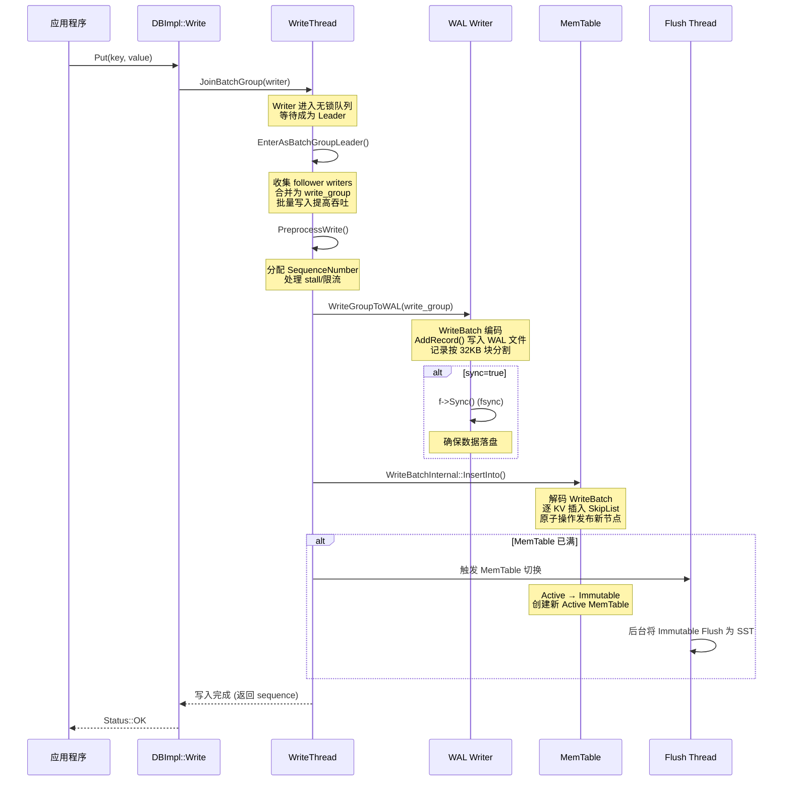
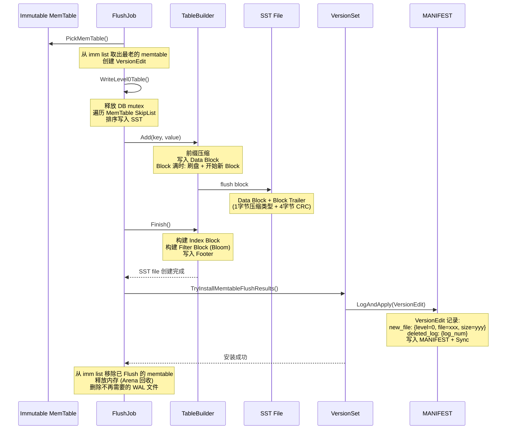
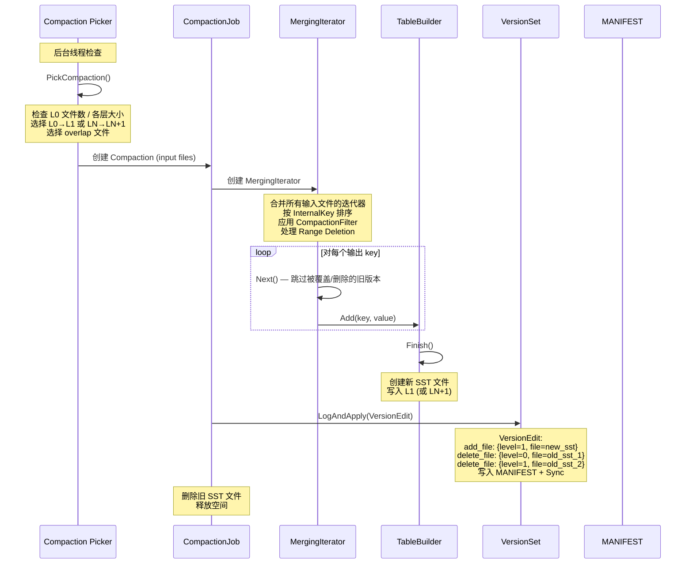
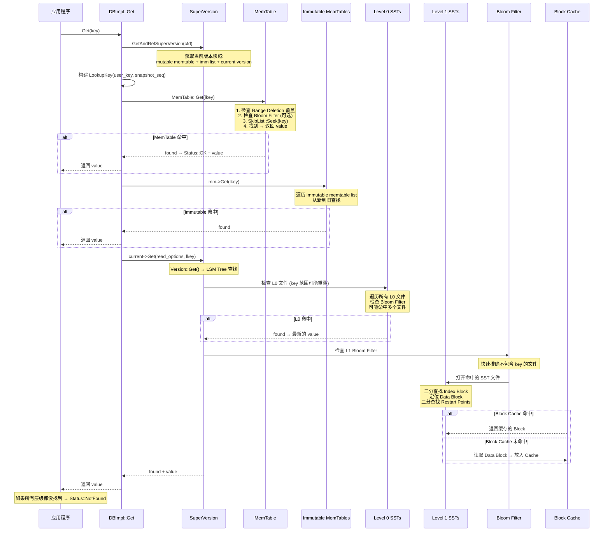
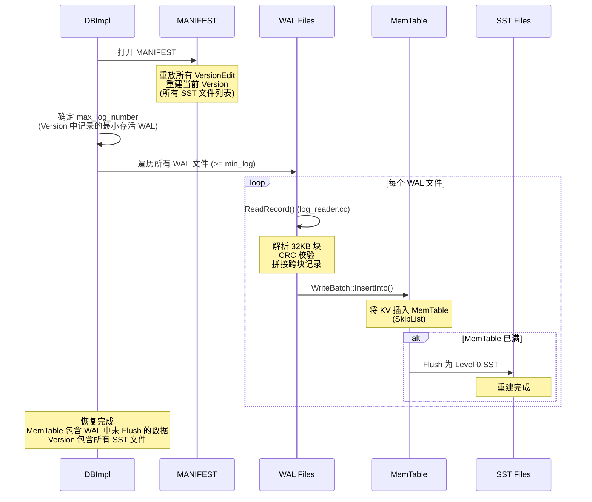

# RocksDB 存储模型分析

---

## 目录

1. [LSM-Tree 存储模型总览](#1-lsm-tree-存储模型总览)
2. [MemTable — 内存写表](#2-memtable--内存写表)
3. [WAL — 预写日志](#3-wal--预写日志)
4. [写入完整流程](#4-写入完整流程)
5. [Flush — 内存刷盘](#5-flush--内存刷盘)
6. [SST 文件格式](#6-sst-文件格式)
7. [Compaction — 层级压缩](#7-compaction--层级压缩)
8. [读取完整流程](#8-读取完整流程)
9. [快照读](#9-快照读)
10. [Manifest 与版本管理](#10-manifest-与版本管理)
11. [Bloom Filter 与 Block Cache](#11-bloom-filter-与-block-cache)
12. [崩溃恢复](#12-崩溃恢复)
13. [RocksDB 在 Ceph 中的角色](#13-rocksdb-在-ceph-中的角色)
14. [关键源码索引](#14-关键源码索引)

---

## 1. LSM-Tree 存储模型总览

### 1.1 LSM-Tree 结构

RocksDB 基于 **LSM-Tree (Log-Structured Merge-Tree)** 结构，所有写入先进入内存，再逐步下沉到磁盘：

```
┌─────────────────────────────────────────────────────────────────┐
│                      RocksDB LSM-Tree                           │
├─────────────────────────────────────────────────────────────────┤
│                                                                  │
│  写入路径:                                                       │
│    WAL → MemTable (SkipList)                                    │
│                                   │ Flush                      │
│                                   ▼                            │
│  ┌──────────────────────────────────────────────────────┐       │
│  │ Level 0: SST 文件 (可能 key 范围重叠)                  │       │
│  │   [sst_001.db] [sst_002.db] [sst_003.db]             │       │
│  ├──────────────────────────────────────────────────────┤       │
│  │ Level 1: SST 文件 (key 范围不重叠, 每层容量为上一层 ×10)│     │
│  │   [sst_010.db] [sst_011.db] [sst_012.db]             │       │
│  ├──────────────────────────────────────────────────────┤       │
│  │ Level 2: SST 文件 (每层容量再 ×10)                    │       │
│  │   [sst_020.db] [sst_021.db] ...                      │       │
│  ├──────────────────────────────────────────────────────┤       │
│  │ ...                                                    │       │
│  │ Level 6 (Lmax): SST 文件 (最终层)                     │       │
│  │   [sst_060.db] [sst_061.db] ...                      │       │
│  └──────────────────────────────────────────────────────┘       │
│                                                                  │
│  读取路径:                                                       │
│    MemTable → Immutable MemTables → L0 → L1 → ... → Lmax       │
│                                                                  │
│  后台进程:                                                       │
│    Flush Thread: MemTable → Level 0 SST                         │
│    Compaction Thread: Level N → Level N+1 (合并 + 排序)         │
│                                                                  │
└─────────────────────────────────────────────────────────────────┘
```

### 1.2 InternalKey 格式

```
用户写入: (user_key, value)

RocksDB 内部编码为 InternalKey:

  ┌──────────────────┬───────────┬──────────┐
  │   user_key       │  sequence  │   type   │
  │   (变长字符串)    │ (7字节)   │  (1字节) │
  └──────────────────┴───────────┴──────────┘
  │←------------ internal_key_size ----------→│

  排序规则: user_key 升序 + sequence 降序
    → 同一个 user_key 的新版本排在前面
    → 读取时遇到第一个匹配即可返回

  type 取值 (db/dbformat.h):
    kTypeValue    = 1  // 普通写入
    kTypeDeletion = 2  // 删除标记
```

### 1.3 与 B-Tree 对比

| 维度 | RocksDB (LSM-Tree) | 传统 B-Tree (如 ext4/xfs) |
|------|-------------------|--------------------------|
| 写入方式 | 追加写 (WAL + MemTable) | 原地更新 |
| 写入性能 | O(1) 内存写 + 后台刷盘 | O(log N) 随机磁盘写 |
| 读取性能 | O(levels) 多层查找 | O(log N) 单次查找 |
| 空间放大 | 有 (旧版本数据) | 小 |
| 写放大 | 有 (Compaction 重写) | 小 |
| 适用场景 | 写多读少 | 读写均衡 |
| 顺序写优化 | 天然顺序 | 需要预分配 |

---

## 2. MemTable — 内存写表

### 2.1 结构

```
MemTable (db/memtable.cc:126):

  ┌────────────────────────────────────────┐
  │              MemTable                  │
  │                                        │
  │  table_ (SkipList)     ← 主数据结构    │
  │    ├── 最大高度: 12 层                  │
  │    ├── 分支因子: 4                      │
  │    ├── 按 InternalKey 排序              │
  │    └── 无锁读 (原子操作发布新节点)       │
  │                                        │
  │  range_del_table_      ← 范围删除专用   │
  │    └── SkipList (单独存储)              │
  │                                        │
  │  arena_                ← Arena 分配器   │
  │    └── 批量分配，一次性释放              │
  │                                        │
  │  bloom_filter_         ← 内存级布隆过滤 │
  │    └── 可选，加速 MemTable 查找         │
  └────────────────────────────────────────┘
```

### 2.2 SkipList

```
SkipList (memtable/skiplist.h:44):

  Level 4:  ────────────────────────→
           │           │
  Level 3: ──────────→ ────────────→
           │     │     │     │
  Level 2: ──→ ──→ ──→ ──→ ──→
           │ │  │ │  │ │  │ │
  Level 1: ─→─→──→─→──→─→──→─→──→
           ││ ││ ││ ││ ││ ││
  Level 0: →→→→→→→→→→→→→→→→→→→→

  插入: 随机层数 (概率 1/4 上一层)
  查找: 从最高层开始，逐层下降
  线程安全: 读无锁，写用 CAS (Compare-And-Swap)
```

### 2.3 MemTableList — 管理 Active + Immutable MemTables

```
MemTableList (db/memtable_list.cc):

  Column Family 的 MemTable 管理:

  ┌─────────────────────────────────────────┐
  │  mutable memtable (当前写入目标)         │
  │  ├── 状态: 可读写                        │
  │  └── 当超过 write_buffer_size → 变为 immutable │
  ├─────────────────────────────────────────┤
  │  immutable memtable list                 │
  │  ├── imm_0 (等待 Flush)                  │
  │  ├── imm_1 (正在 Flush)                  │
  │  └── imm_2 (正在 Flush)                  │
  └─────────────────────────────────────────┘

  切换条件 (ShouldFlushNow, memtable.cc:233):
    ├── arena 使用量 >= write_buffer_size (默认 64MB)
    ├── 允许过量分配: kAllowOverAllocationRatio = 0.6
    └── range_deletion 数量超过阈值

  MemTableListVersion:
    └── Copy-on-Write 快照
        读取者持有引用 → MemTable 不会被提前释放
```

---

## 3. WAL — 预写日志

### 3.1 WAL 文件格式

```
WAL 文件 (db/log_writer.cc):

  文件布局: 按 32KB 块分割

  ┌─────────┬──────────┬──────────┬────┬─────────┬──────────┐
  │ Block 0           │ Block 1                               │
  │ ┌───────┬────────┐│ ┌───────┬────────┐                    │
  │ │Rec 0  │Rec 1   ││ │Rec 2  │Rec 3   │ ...               │
  │ │       │        ││ │       │        │                    │
  │ └───────┴────────┘│ └───────┴────────┘                    │
  │ │  Pad if needed  ││                                        │
  └─────────┬──────────┴───────────────────────────────────────┘
            │
            ▼
  记录格式 (Legacy):
  ┌────────┬────────┬────────┬──────────┐
  │ CRC    │ Size   │ Type   │ Payload  │
  │ 4字节  │ 2字节  │ 1字节  │ ≤30KB    │
  └────────┴────────┴────────┴──────────┘
  总头部: 7字节 + Payload + Padding

  记录类型:
    kFullType   = 1  — 完整记录 (单块内)
    kFirstType  = 2  — 记录的第一片 (跨块)
    kMiddleType = 3  — 记录的中间片
    kLastType   = 4  — 记录的最后一片

  大记录跨块示例:
  ┌────────────────┬───────────────┬─────────────────┐
  │ kFirstType+payload │ kMiddleType+payload │ kLastType+payload │
  └────────────────┴───────────────┴─────────────────┘

  校验: CRC32c 覆盖 (type, size, payload)
```

### 3.2 Recyclable Record (推荐)

```
Recyclable 记录格式 (log_format.h):
  ┌────────┬────────┬────────┬──────────┬──────────┐
  │ CRC    │ Size   │ Type   │ LogNum   │ Payload  │
  │ 4字节  │ 2字节  │ 1字节  │ 4字节    │ ≤30KB    │
  └────────┴────────┴────────┴──────────┴──────────┘

  优势: LogNum 字段防止旧 WAL 文件的记录被误读
  类型: kRecyclableFullType (5) / kRecyclableFirstType (6) / ...

  WAL 文件命名:
    archive/000001.log  (6位数字编号)
    当文件不再需要时，可以循环复用 (recycle)
```

---

## 4. 写入完整流程

### 4.1 写入时序图



### 4.2 WriteBatch 编码

```
WriteBatch (db/write_batch.cc):

  编码格式:
  ┌────────────┬──────────────────────────────────┐
  │ Header     │  Entry[]                         │
  │ 8字节      │  每个条目:                       │
  │ [seq:4B]   │  [count:4B] [key_len:varint32]   │
  │ [count:4B] │  [key] [value_len:varint32]       │
  │            │  [value]                          │
  └────────────┴──────────────────────────────────┘

  支持单 WriteBatch 跨多个 Column Family:
    每个 Entry 可以指定 column_family_id
```

### 4.3 WriteThread 批量合并

```
WriteThread::Writer 状态机 (db/write_thread.h:34):

  STATE_INIT                    ← 初始状态，排队等待
       │
       ▼ 成为 Leader
  STATE_GROUP_LEADER            ← WAL 写入 Leader
       │
       ▼ WAL 写完 (pipelined 模式)
  STATE_MEMTABLE_WRITER_LEADER  ← MemTable 写入 Leader
       │
       ▼ 并行写入
  STATE_PARALLEL_MEMTABLE_WRITER ← 并行写 MemTable
       │
       ▼ 完成
  STATE_COMPLETED               ← 写入完成

  批量合并优势:
    多个并发写入合并为一个 WAL 记录 + 一次 fsync
    大幅提高小写入的吞吐量
    max_write_batch_group_size_bytes 控制最大合并大小
```

---

## 5. Flush — 内存刷盘

### 5.1 Flush 流程



### 5.2 Flush 触发条件

```
触发 Flush:
  1. MemTable 大小 >= write_buffer_size (默认 64MB)
  2. WAL 文件数 >= min(wal_size_limit_MB / wal_dir_size, writable_file_max_base_size)
  3. 手动: db->Flush()
  4. 关闭 Column Family
  5. 写停顿 (WriteStall): imm 数量过多触发限流

WriteStall 机制:
  level0_slowdown_writes_trigger  — L0 文件数达到此值 → 减慢写入
  level0_stop_writes_trigger      — L0 文件数达到此值 → 停止写入
  soft_pending_compaction_bytes   — 待压缩字节数 → 减慢写入
  hard_pending_compaction_bytes   — 待压缩字节数 → 停止写入
```

---

## 6. SST 文件格式

### 6.1 文件布局

```
SST 文件 (BlockBasedTable):

  ┌─────────────────────────────────────────────────────┐
  │ Data Block 1                                         │
  │ Data Block 2                                         │
  │ Data Block 3                                         │
  │ ...                                                  │
  │ Data Block N                                         │
  ├─────────────────────────────────────────────────────┤
  │ Meta Block: Bloom Filter                             │
  │ Meta Block: Properties (统计信息)                    │
  │ Meta Block: Compression Dictionary                   │
  │ Meta Block: Range Deletion Tombstone                 │
  ├─────────────────────────────────────────────────────┤
  │ Meta Index Block (Meta Block 的索引)                 │
  ├─────────────────────────────────────────────────────┤
  │ Index Block (Data Block 的索引)                      │
  ├─────────────────────────────────────────────────────┤
  │ Footer (固定大小, 从文件末尾向前读)                   │
  └─────────────────────────────────────────────────────┘
```

### 6.2 Data Block 格式

```
Data Block (table/block_based/block_builder.cc):

  ┌──────────────────────────────────────────────┐
  │ Entry 1:                                      │
  │   shared_len (varint32)  — 与前一个 key 共享前缀长度 │
  │   unshared_len (varint32) — 不共享部分长度      │
  │   value_len (varint32)   — value 长度          │
  │   key_delta (unshared bytes) — key 的不共享部分 │
  │   value (value_len bytes)                     │
  │                                               │
  │ Entry 2: (前缀压缩)                            │
  │   shared_len = 3 (共享 "usr_")                 │
  │   unshared_len = 5 ("id02")                   │
  │   value = "data_for_02"                       │
  │                                               │
  │ ...                                           │
  │                                               │
  │ Restart Points: (每 K 个 entry)               │
  │   restart[0] (uint32) — entry 0 的偏移        │
  │   restart[1] (uint32) — entry K 的偏移        │
  │   ...                                         │
  │ num_restarts (uint32)                         │
  │                                               │
  │ Block Trailer:                                │
  │   compression_type (1 byte)                   │
  │   CRC32c (4 bytes)                            │
  └──────────────────────────────────────────────┘
```

### 6.3 Footer 格式

```
Footer (table/format.h:229):

  读取方式: 从文件末尾向前读 (固定大小)

  ┌──────────────────┬──────────────────┬─────────┬────────────┬───────────┐
  │ metaindex_handle │ index_handle     │ padding │ format_ver │ magic_num │
  │ (varint: offset  │ (varint: offset  │         │ (4 bytes)  │ (8 bytes) │
  │  + size)         │  + size)         │         │ = 7        │ = magic   │
  └──────────────────┴──────────────────┴─────────┴────────────┴───────────┘

  magic_num = 0x88e241b785f4cff7 (block based table)
  format_version = 7 (最新)

  通过 Footer 找到 Index Block → 找到 Data Block → 找到具体 KV
```

### 6.4 Index Block

```
Index Block 结构:

  ┌──────────────────────────────────────────┐
  │ Index Entry 1:                           │
  │   key = "largest_key_in_data_block_1"    │
  │   value = BlockHandle(offset, size)      │
  │       + first_internal_key (可选)        │
  │                                           │
  │ Index Entry 2:                           │
  │   key = "largest_key_in_data_block_2"    │
  │   value = BlockHandle(offset, size)      │
  │                                           │
  │ ...                                       │
  │ Block Trailer (compression + CRC)         │
  └──────────────────────────────────────────┘

  查找流程:
    用户 key = "usr_id05"
    → 在 Index Block 中二分查找
    → 找到 key >= "usr_id05" 的 entry
    → 获取 BlockHandle → 定位 Data Block
    → 在 Data Block 中二分查找 Restart Points
    → 找到具体 Entry
```

### 6.5 压缩与校验

```
支持的压缩算法:
  kNoCompression, kSnappy, kZlib, kBZip2,
  kLZ4, kLZ4HC, kXpress, kZSTD

  压缩粒度: 每 Data Block 独立压缩
  压缩后存储在 Data Block 区域
  Block Trailer 中记录 compression_type

校验算法:
  CRC32c, xxHash, XXH3

  每个块尾部 4 字节 CRC
  format >= 6: context-aware checksum
    checksum = base_checksum ⊕ block_offset
    → 检测数据放置错误
```

---

## 7. Compaction — 层级压缩

### 7.1 Leveled Compaction

```
Leveled Compaction 策略:

  触发条件:
    1. L0 文件数 >= level0_file_num_compaction_trigger (默认 4)
       → 选一个 L0 文件 + L1 中 key 范围重叠的文件
    2. L(N) 文件总大小超过 limit (10^N × max_bytes_for_level_base)
       → 选 L(N) 中最大的文件 + L(N+1) 中重叠文件

  层级容量关系:
    Level 0: 无序, 文件间 key 可重叠
    Level 1: 有序, 文件间 key 不重叠, 容量 = max_bytes_for_level_base (默认 256MB)
    Level 2: 有序, 容量 = 10 × L1 = 2.56GB
    Level 3: 有序, 容量 = 10 × L2 = 25.6GB
    ...
    Level 6: 有序, 容量 = 10^5 × L1 = 25.6TB

  Compaction 流程:
    1. 选取输入文件 (L0 的 1 个 + L1 的 N 个)
    2. 使用 MergingIterator 合并读取
    3. 写入新 SST 文件到 L1
    4. 删除旧的 L0 + L1 文件
    5. 记录 VersionEdit → 写入 MANIFEST
```

### 7.2 Compaction 时序图



### 7.3 三种 Compaction 策略

| 策略 | 触发条件 | 写放大 | 空间放大 | 读放大 | 适用场景 |
|------|---------|--------|---------|--------|---------|
| **Leveled** | L0 文件数 / 层级大小 | 高 (每层都重写) | 低 (1 个副本) | 低 (L0 除外) | 通用 |
| **Universal** | sorted_run 大小比 / 放大比 | 低 (少次合并) | 高 (多个版本) | 中 | 写多读少 |
| **FIFO** | TTL / 总大小 | 最低 (只删最旧) | 最低 (单层) | 最低 | 时序数据 |

### 7.4 Compaction 原因

```
compaction_reason (db/compaction/compaction_job.cc:65-115):

  kLevelL0FilesNum      — L0 文件数过多 (读放大)
  kLevelMaxLevelSize    — 层级大小超限
  kUniversalSizeRatio   — sorted run 大小比 (Universal)
  kUniversalSizeAmplification — 放大比超限 (Universal)
  kTtl                  — TTL 过期
  kPeriodicCompaction   — 周期性压缩
  kManualCompaction     — 手动触发
  kFilesMarkedForCompaction — 文件标记
  kForcedBlobGC         — Blob GC
  kReadTriggered        — 读触发 (遇到太多 tombstone)
```

---

## 8. 读取完整流程

### 8.1 读取时序图



### 8.2 读取路径总结

```
读取顺序 (由快到慢):

  1. MemTable (SkipList, 内存)         ← 最快，最新数据
  2. Immutable MemTables (SkipList)    ← 内存，尚未 Flush
  3. Level 0 SSTs (最多 4 个文件)      ← 无序，可能需要检查多个
  4. Level 1 SSTs (Bloom 筛选)         ← 有序，Bloom 排除
  5. Level 2+ SSTs (Bloom 筛选)        ← 有序，Bloom 排除

  加速机制:
    ├── Bloom Filter — 跳过不包含目标 key 的 SST 文件
    ├── Block Cache — 缓存热 Data Block，避免磁盘读
    ├── 前缀压缩 — 减少 Block 大小，提高缓存效率
    └── Index Block 二分 — 快速定位 Data Block

  读取延迟:
    MemTable 命中: ~微秒级 (内存)
    SST 读 Block Cache 命中: ~微秒级 (内存)
    SST 读磁盘: ~毫秒级 (随机 IO)
    需要跨多层: 逐层查找，最坏 O(levels)
```

---

## 9. 快照读

### 9.1 实现机制

```
快照读 (db/snapshot_impl.cc):

  创建快照:
    const Snapshot* snap = db->GetSnapshot();
    → SnapshotImpl { number_: 当前最新 sequence }

  使用快照读取:
    ReadOptions options;
    options.snapshot = snap;
    db->Get(options, "key", &value);
    → LookupKey 使用快照的 sequence number
    → 只能看到 sequence <= snapshot.number_ 的数据

  释放快照:
    db->ReleaseSnapshot(snap);
    → 序列号被释放后，Compaction 可以清理旧版本

  工作原理:
    InternalKey 排序: user_key 升序 + sequence 降序
    查找时: Seek 到 (user_key, snapshot_seq, kTypeValue)
    → 返回第一个 sequence <= snapshot_seq 的 value
    → 自然实现了 MVCC (多版本并发控制)
```

### 9.2 MVCC 示例

```
时间线:
  seq=100: Put("name", "Alice")
  seq=101: Put("name", "Bob")
  seq=102: Put("name", "Charlie")
    → GetSnapshot() → snap_seq = 102
  seq=103: Put("name", "David")
  seq=104: Delete("name")

  普通读 (seq=104): "name" 不存在 (已删除)
  快照读 (seq=102): "name" = "Charlie"
  快照读 (seq=100): "name" = "Alice"

  LSM Tree 中存储:
    "name" seq=104 type=deletion  (tombstone)
    "name" seq=103 type=value     value="David"
    "name" seq=102 type=value     value="Charlie"
    "name" seq=101 type=value     value="Bob"
    "name" seq=100 type=value     value="Alice"

  有快照时，Compaction 不能清理 seq=100~102 的数据
  快照释放后，Compaction 可以清理旧版本
```

---

## 10. Manifest 与版本管理

### 10.1 MANIFEST 文件

```
MANIFEST 文件记录所有版本变更:

  每次结构变更 (Flush/Compaction) 都产生一个 VersionEdit:

  VersionEdit 记录:
    ├── new_files:     新增的 SST 文件 (level, number, size, smallest, largest)
    ├── deleted_files: 删除的 SST 文件 (level, number)
    ├── log_number:    最小存活 WAL 编号
    ├── next_file:     下一个 SST 文件编号
    ├── last_sequence: 最后一个 sequence
    └── column_family: Column Family 变更

  MANIFEST 格式:
    [VersionEdit_1][VersionEdit_2][VersionEdit_3]...

  读取方式: 重放所有 VersionEdit → 重建当前 Version
```

### 10.2 VersionSet

```
VersionSet (db/version_set.cc):

  ┌──────────────────────────────────────────┐
  │ VersionSet                                │
  │  ├── current_ (Version*) ← 当前活跃版本   │
  │  ├── versions_ (Version list) ← 历史版本  │
  │  └── manifest_file_ ← MANIFEST 文件       │
  │                                           │
  │ Version (内存中的快照):                    │
  │  ├── files_[level] → FileMetaData[]       │
  │  │   ├── L0: [{file_num, size, keys}]     │
  │  │   ├── L1: [{file_num, size, keys}]     │
  │  │   └── ...                              │
  │  ├── compaction_score_                     │
  │  └── compaction_level_                     │
  └──────────────────────────────────────────┘

  LogAndApply() (version_set.cc:6535):
    1. 获取 MANIFEST 写锁
    2. 写入 VersionEdit 到 MANIFEST
    3. Sync MANIFEST (fsync)
    4. 应用 VersionEdit 到内存 Version
    5. 唤醒等待线程
```

---

## 11. Bloom Filter 与 Block Cache

### 11.1 Bloom Filter

```
SST 级 Bloom Filter (table/block_based/full_filter_block.cc):

  构建时机: SST 文件创建时由 FullFilterBlockBuilder 构建
  存储位置: SST 文件的 Meta Block 区域
  检查时机: 读取 SST 前先查 Bloom Filter

  两种模式:
    ├── Whole Key Filter: 对整个 user_key 做布隆
    └── Prefix Filter:   对 user_key 的前缀做布隆 (节省内存)

  假阳性率: rocksdb_bloom_bits_per_key 控制
    默认 10 bits/key → ~1% 假阳性率

  查找流程:
    Get("usr_id05")
    → 检查 L1 SST 文件的 Bloom Filter
    → false: 跳过此文件 (确定不包含)
    → true:  可能包含，需要打开文件查找
```

### 11.2 Block Cache

```
Block Cache (cache/cache.cc):

  实现: LRUCache
  缓存内容:
    ├── Data Blocks (读取后的数据块)
    ├── Index Blocks (索引块)
    └── Filter Blocks (布隆过滤块)

  容量: rocksdb_block_cache_size (默认 8MB)
  替换策略: LRU (Least Recently Used)

  查找流程:
    读取 Data Block:
    1. 查 Block Cache: (cache_key = file_num + offset)
       命中 → 直接返回 (避免磁盘 IO)
       未命中 → 从磁盘读取 → 放入 Cache
    2. 后续读取同一 Block → Cache 命中

  索引和过滤 Block 也被缓存:
    首次打开 SST → 读取 Index Block → 缓存
    后续打开同一 SST → 从 Cache 读取 Index Block
```

---

## 12. 崩溃恢复

### 12.1 恢复流程



### 12.2 恢复保证

```
崩溃恢复安全性:

  WAL 保证:
    ├── WriteBatch 写入 WAL 后才写入 MemTable
    ├── sync=true 时 WAL fsync 后才返回成功
    └── 崩溃后: WAL 中已 fsync 的记录一定可以恢复

  MANIFEST 保证:
    ├── 每次 Flush/Compaction 后 MANIFEST 写入 + Sync
    ├── VersionEdit 是原子的 (Sync 后才算完成)
    └── 崩溃后: 重放 MANIFEST 可以恢复 SST 文件列表

  最多丢失:
    sync=true  → 不丢失 (已 fsync)
    sync=false → 最多丢失一个 WAL record (OS page cache 中)
```

---

## 13. RocksDB 在 Ceph 中的角色

### 13.1 BlueStore 中的 RocksDB

```
BlueStore 使用 RocksDB 存储对象元数据:

  RocksDB 存储内容:
  ├── onode — 对象的元数据 (大小、属性、extent map)
  ├── omap — 对象的键值对数据 (扩展属性)
  ├── pg_log — PG 操作日志 (存为 pgmeta 对象的 omap)
  ├── collection 列表 — PG 的对象集合信息
  └── other metadata — 其他元数据

  在 BlueStore 中的存储位置:
    RocksDB 数据 → BlueFS 的 db/ 目录 (BDEV_DB)
    RocksDB WAL → BlueFS 的 db.wal/ 目录 (BDEV_WAL)
    通过 BlueRocksEnv 适配:
      RocksDB Env → BlueFS → BDEV_WAL/BDEV_DB → 裸块设备
```

### 13.2 与 JuiceFS 的对比

| 维度 | RocksDB (BlueStore) | JuiceFS |
|------|---------------------|---------|
| 角色 | 存储对象元数据 | 元数据引擎 (Redis/TiKV) |
| 数据格式 | onode (extent map) | inode (slice 列表) |
| WAL 位置 | BlueFS db.wal | DB 自身 WAL |
| 持久化路径 | BlueRocksEnv → BDEV_WAL | DB 事务 (fsync) |
| SST 管理 | BlueStore 管理 | DB 自己管理 |
| Compaction | Leveled/Universal | DB 自己处理 |
| 应用场景 | OSD 本地元数据 | 分布式文件系统元数据 |

---

## 14. 关键源码索引

| 模块 | 文件 | 关键内容 |
|------|------|---------|
| **写入入口** | `db/db_impl/db_impl_write.cc:669` | `WriteImpl()` |
| **默认写入路径** | `db/db_impl/db_impl_write.cc:886-1268` | Leader 写入流程 |
| **WriteThread** | `db/write_thread.cc:401` | `JoinBatchGroup()` |
| **批量分组** | `db/write_thread.cc:440` | `EnterAsBatchGroupLeader()` |
| **并行写入** | `db/write_thread.cc:680` | `LaunchParallelMemTableWriters()` |
| **WAL 写入** | `db/db_impl/db_impl_write.cc:1115` | `WriteGroupToWAL()` |
| **WAL Sync** | `db/db_impl/db_impl_write.cc:2076` | `f->Sync()` (fsync) |
| **MemTable** | `db/memtable.cc:126` | MemTable 构造函数 |
| **MemTable 查找** | `db/memtable.cc:1451` | `MemTable::Get()` |
| **MemTable 满检测** | `db/memtable.cc:233` | `ShouldFlushNow()` |
| **SkipList** | `memtable/skiplist.h:44` | `SkipList<Key, Comparator>` |
| **MemTableList** | `db/memtable_list.cc:665` | `MemTableList::Add()` |
| **选取 Flush** | `db/memtable_list.cc:409` | `PickMemtablesToFlush()` |
| **Flush Job** | `db/flush_job.cc:218` | `FlushJob::Run()` |
| **Flush 选取** | `db/flush_job.cc:170` | `FlushJob::PickMemTable()` |
| **Flush 结果安装** | `db/memtable_list.cc:521` | `TryInstallMemtableFlushResults()` |
| **WAL 记录格式** | `db/log_writer.cc:89` | `Writer::AddRecord()` |
| **WAL 记录物理写入** | `db/log_writer.cc` | `EmitPhysicalRecord()` |
| **WAL 格式定义** | `db/log_writer.h:37-73` | Legacy/Recyclable 格式 |
| **读取入口** | `db/db_impl/db_impl.cc:2437` | `DBImpl::Get()` |
| **读取实现** | `db/db_impl/db_impl.cc:2696` | `GetImpl()` |
| **SuperVersion** | `db/db_impl/db_impl.cc:2752` | `GetAndRefSuperVersion()` |
| **InternalKey** | `db/dbformat.cc` | InternalKey 编解码 |
| **Compaction Job** | `db/compaction/compaction_job.cc:138` | CompactionJob 构造 |
| **Compaction Picker** | `db/compaction/compaction_picker.h:48` | PickCompaction() |
| **Leveled Picker** | `db/compaction/compaction_picker_level.h:18` | LevelCompactionPicker |
| **Universal Picker** | `db/compaction/compaction_picker_universal.h:16` | UniversalCompactionPicker |
| **FIFO Picker** | `db/compaction/compaction_picker_fifo.h:15` | FIFOCompactionPicker |
| **版本编辑应用** | `db/version_set.cc:6535` | `LogAndApply()` |
| **SST Builder** | `table/block_based/block_based_table_builder.cc` | BlockBasedTableBuilder |
| **Data Block** | `table/block_based/block_builder.cc:10-36` | Block 格式 |
| **BlockHandle** | `table/format.h:46` | offset + size |
| **Footer** | `table/format.h:229` | Footer 格式定义 |
| **Bloom Filter** | `table/block_based/full_filter_block.cc` | FullFilterBlockBuilder |
| **快照** | `db/snapshot_impl.cc` | SnapshotImpl |
| **WriteBatch** | `db/write_batch.cc` | WriteBatch 编解码 |
| **Block Cache** | `cache/cache.cc` | LRUCache |
| **压缩选择** | `db/compaction/compaction_picker.cc:134` | `GetCompressionType()` |
