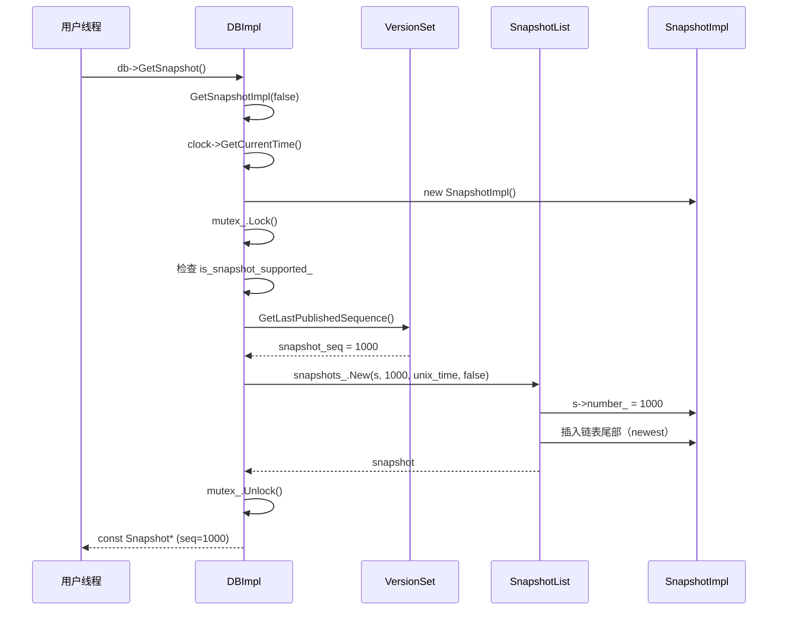
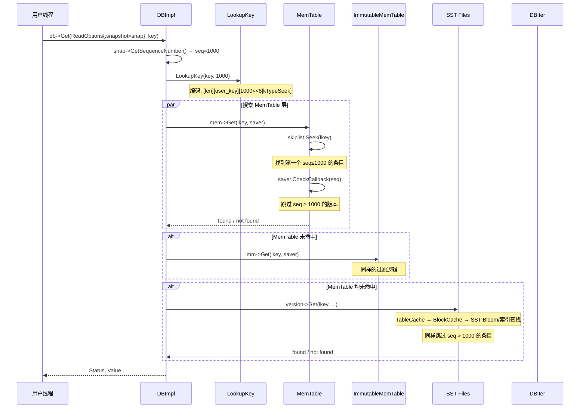
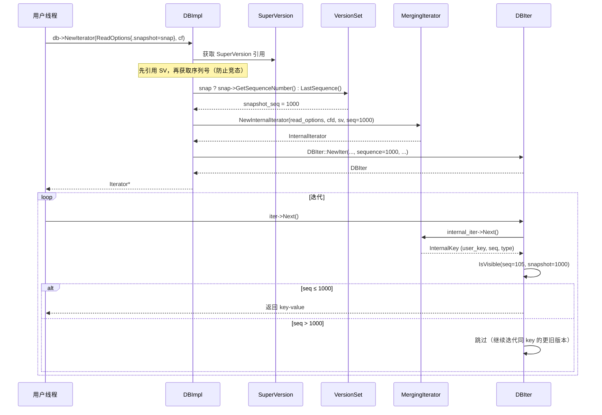
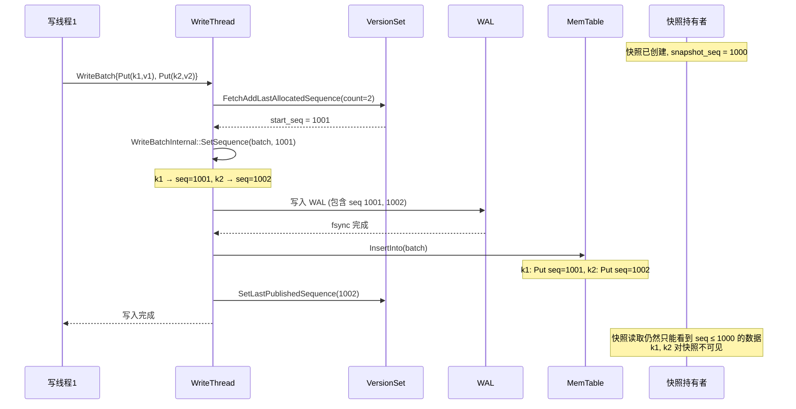
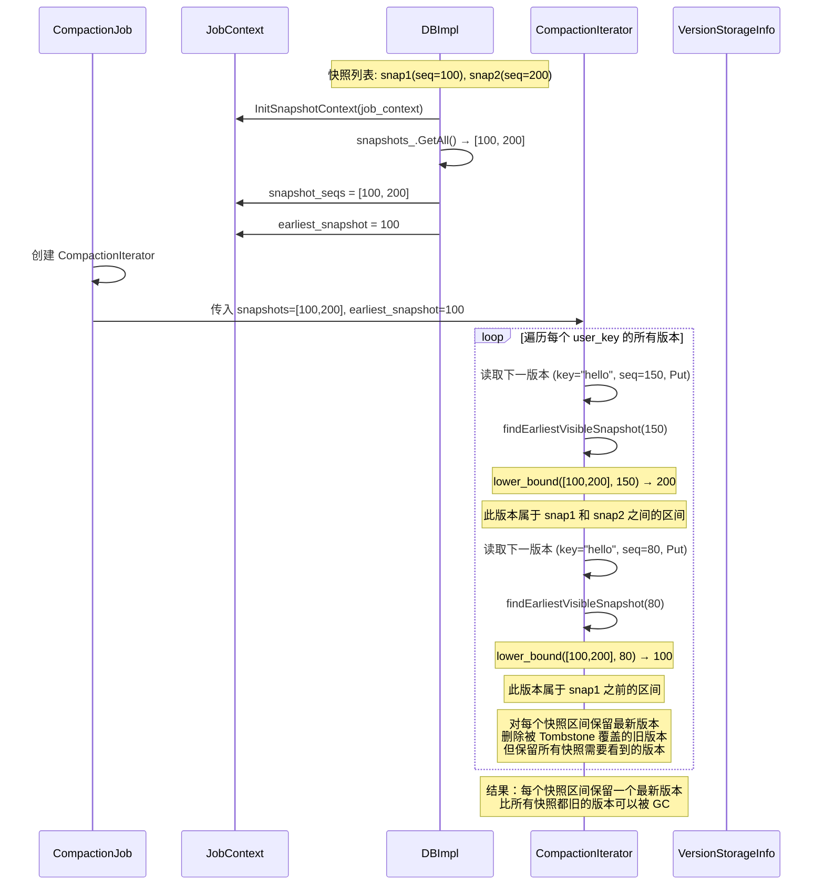
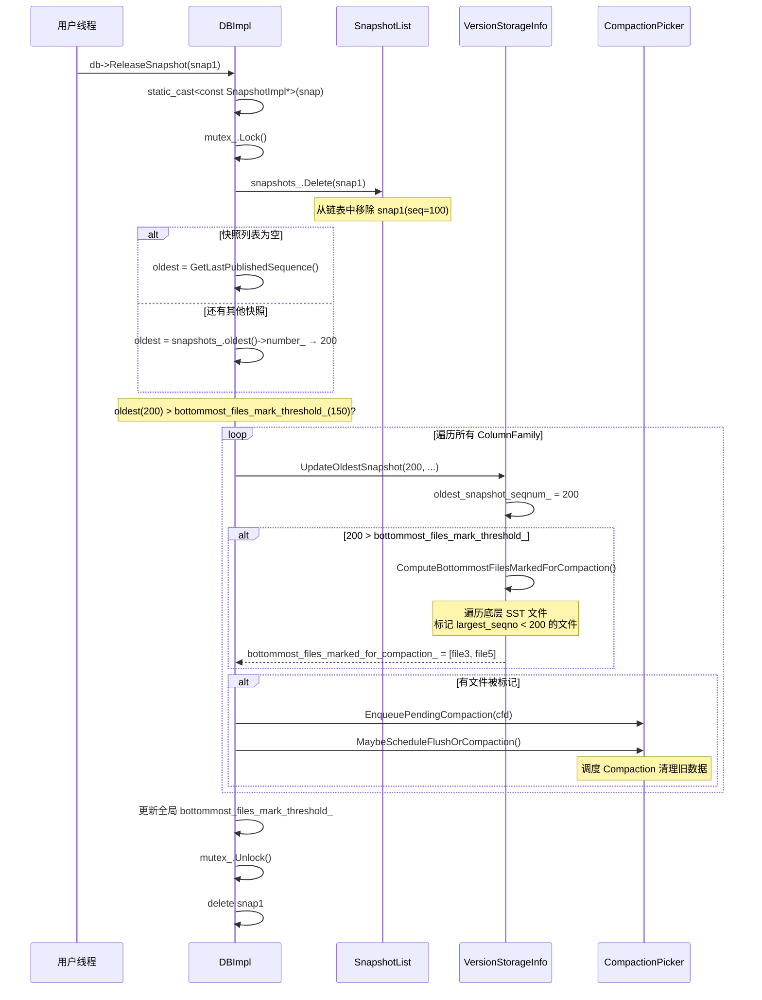
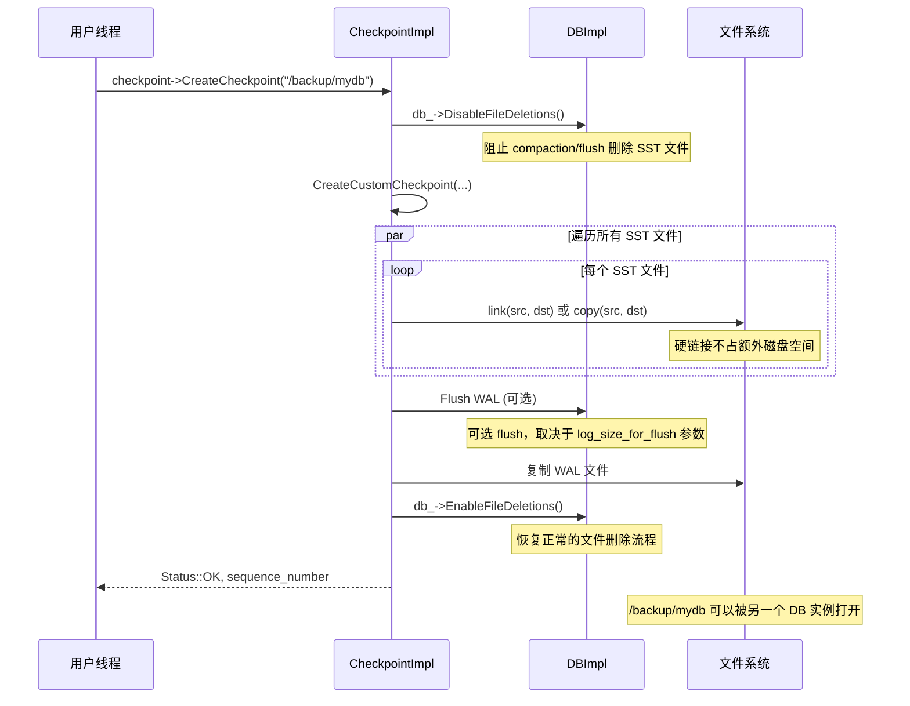

# RocksDB 快照机制详解

## 目录

1. [快照概述](#1-快照概述)
2. [类层次结构](#2-类层次结构)
3. [MVCC 可见性机制](#3-mvcc-可见性机制)
4. [快照创建流程](#4-快照创建流程)
5. [基于快照的读路径](#5-基于快照的读路径)
6. [快照与写路径的交互](#6-快照与写路径的交互)
7. [快照与 Compaction 的交互](#7-快照与-compaction-的交互)
8. [快照释放与垃圾回收](#8-快照释放与垃圾回收)
9. [SnapshotChecker（事务快照扩展）](#9-snapshotchecker事务快照扩展)
10. [Checkpoint vs Snapshot](#10-checkpoint-vs-snapshot)
11. [与 CephFS/Lustre 快照对比](#11-与-cephfslustre-快照对比)
12. [源码索引](#12-源码索引)

---

## 1. 快照概述

RocksDB 的快照是一种**轻量级的 MVCC（多版本并发控制）读一致性机制**，其核心思想非常简单：

> **快照 = 一个序列号（Sequence Number）**

创建快照时，RocksDB 记录当前的**最新已发布序列号**作为快照的序列号。之后所有使用该快照的读操作只能看到**序列号 ≤ 快照序列号**的数据，即使后续有新的写入，快照读取也不会看到。

关键特性：

| 特性 | 说明 |
|------|------|
| **实现成本** | 极低 — 仅记录一个 uint64 序列号 |
| **存储开销** | 零 — 不复制任何数据 |
| **一致性保证** | 点时间一致性（Point-in-Time Consistency） |
| **生命周期** | 手动管理 — 用户调用 `GetSnapshot()` 创建，`ReleaseSnapshot()` 释放 |
| **副作用** | 阻止 Compaction 删除旧版本数据，间接增加存储 |

---

## 2. 类层次结构

```
Snapshot (抽象基类, rocksdb/snapshot.h:20)
├── GetSequenceNumber() → 快照序列号
├── GetUnixTime()       → 创建时间戳
└── GetTimestamp()      → 用户自定义时间戳

SnapshotImpl (具体实现, db/snapshot_impl.h:23)
├── number_                      : SequenceNumber  ← 快照序列号（创建后不变）
├── min_uncommitted_             : SequenceNumber  ← WritePrepared 事务用
├── prev_ / next_                : SnapshotImpl*   ← 双向链表指针
├── list_                        : SnapshotList*   ← 所属链表
├── is_write_conflict_boundary_  : bool            ← 是否为写冲突边界
├── unix_time_                   : int64_t
└── timestamp_                   : uint64_t

SnapshotList (侵入式双向循环链表, db/snapshot_impl.h:54)
├── list_  : SnapshotImpl  ← 哨兵节点（list_.next_ = oldest, list_.prev_ = newest）
├── count_ : uint64_t
├── New()    → 尾部插入
├── Delete() → 链表移除（不释放内存）
└── GetAll() → 返回所有快照序列号（升序、去重）

ManagedSnapshot (RAII 包装器, rocksdb/snapshot.h:37)
├── ~ManagedSnapshot() 自动调用 db_->ReleaseSnapshot()
└── 用于 CompactionJob、FlushJob 等内部场景

TimestampedSnapshotList (db/snapshot_impl.h:188)
└── std::map<uint64_t, shared_ptr<SnapshotImpl>> ← 按用户时间戳索引
```

**SnapshotList 内存布局**：

```
                  SnapshotList
                  ┌──────────┐
                  │  list_   │ (哨兵节点)
                  │(sentinel)│
                  └────┬─────┘
            ┌──────────┴──────────┐
            ▼                     ▼
     ┌──────────────┐      ┌──────────────┐
     │ SnapshotImpl │←────→│ SnapshotImpl │←────→ (回到 list_)
     │  seq=100     │      │  seq=200     │
     │  (oldest)    │      │  (newest)    │
     └──────────────┘      └──────────────┘
```

---

## 3. MVCC 可见性机制

RocksDB 使用**单调递增序列号**实现 MVCC。每个写操作（Put/Delete/Merge）被分配一个序列号，序列号编码在内部键（Internal Key）中。

### 3.1 序列号编码

```
┌──────────────────────────────────────────────────┐
│              Internal Key (64 bits)                │
├────────────────────────────┬──────────┬───────────┤
│   Sequence Number (56 bits) │ Type(4b) │ Type(4b) │
│   高位 → 低位               │          │           │
└────────────────────────────┴──────────┴───────────┘

PackSequenceAndType(seq, type) = (seq << 8) | type
kMaxSequenceNumber = (1 << 56) - 1
```

**类型（ValueType）**：Put(1), Delete(0), Merge(2), SingleDelete(7), RangeDeletion(9)

### 3.2 键排序规则

内部键按 `(user_key ASC, seq DESC, type DESC)` 排序：

```
键 "hello" 的多个版本在 MemTable/SST 中的存储顺序：

  hello | seq=105 | Put     ← 最新版本（排序在前）
  hello | seq=100 | Put
  hello | seq=95  | Merge
  hello | seq=90  | Put
  hello | seq=85  | Delete  ← 删除标记
  hello | seq=80  | Put     ← 已被删除的旧数据
```

### 3.3 可见性判断

```cpp
// db/db_iter.cc:1709-1727
bool DBIter::IsVisible(SequenceNumber sequence, ...) {
    bool visible_by_seq = (read_callback_ == nullptr)
                              ? sequence <= sequence_     // 标准情况
                              : read_callback_->IsVisible(sequence);  // 事务情况
    return visible_by_seq && visible_by_ts;
}
```

标准情况下的可见性判断：**`key_seq <= snapshot_seq`**

### 3.4 LookupKey 编码

```cpp
// db/lookup_key.h
LookupKey(key="hello", snapshot_seq=100)
→ 编码为: [长度] [user_key("hello")] [100<<8 | kValueTypeForSeek]

在 skiplist 中查找时，因为键按 seq DESC 排序，
查找键会跳过所有 seq > 100 的版本，
找到第一个 seq ≤ 100 的版本。
```

---

## 4. 快照创建流程

### 4.1 创建时序图



### 4.2 核心代码

```cpp
// db/db_impl/db_impl.cc:4588-4615
SnapshotImpl* DBImpl::GetSnapshotImpl(bool is_write_conflict_boundary, bool lock) {
    SnapshotImpl* s = new SnapshotImpl;

    if (lock) { mutex_.Lock(); }

    // 检查是否支持快照（inplace update 模式不支持）
    if (!is_snapshot_supported_) {
        delete s;
        return nullptr;
    }

    // 捕获当前最新已发布序列号
    auto snapshot_seq = GetLastPublishedSequence();

    // 插入快照链表
    SnapshotImpl* snapshot =
        snapshots_.New(s, snapshot_seq, unix_time, is_write_conflict_boundary);

    if (lock) { mutex_.Unlock(); }
    return snapshot;
}
```

### 4.3 SnapshotList::New — 链表插入

```cpp
// db/snapshot_impl.h:100-116
SnapshotImpl* SnapshotList::New(SnapshotImpl* s, SequenceNumber seq, ...) {
    s->number_ = seq;
    s->list_ = this;
    s->next_ = &list_;        // 新节点的 next 指向哨兵
    s->prev_ = list_.prev_;   // 新节点的 prev 指向当前尾部
    s->prev_->next_ = s;      // 原尾部的 next 指向新节点
    s->next_->prev_ = s;      // 哨兵的 prev 指向新节点
    count_++;
    return s;
}
```

---

## 5. 基于快照的读路径

### 5.1 Get 读操作时序图



### 5.2 Iterator 迭代读时序图



### 5.3 关键代码 — DBIter 过滤

```cpp
// db/db_iter.cc:1709-1727
bool DBIter::IsVisible(SequenceNumber sequence, const Slice& ts,
                       bool* more_recent) {
    bool visible_by_seq = (read_callback_ == nullptr)
                              ? sequence <= sequence_     // 核心：seq ≤ 快照序列号
                              : read_callback_->IsVisible(sequence);
    bool visible_by_ts = (timestamp_ub_ == nullptr || ...) && ...;
    if (more_recent) {
        *more_recent = !visible_by_seq;
    }
    return visible_by_seq && visible_by_ts;
}
```

**迭代器过滤示例**：

```
快照 seq = 96，键 "AAA" 有以下版本：

    seq=100  Put   AAA → "v3"    ← IsVisible(100, 96) = false，跳过
    seq=97   Put   AAA → "v2"    ← IsVisible(97, 96) = false，跳过
    seq=95   Put   AAA → "v1"    ← IsVisible(95, 96) = true，返回 "v1"
```

---

## 6. 快照与写路径的交互

### 6.1 写路径序列号分配



### 6.2 核心代码 — 序列号分配

```cpp
// db/version_set.h:1420-1457
uint64_t LastSequence() const {
    return last_sequence_.load(std::memory_order_acquire);
}
void SetLastSequence(uint64_t s) {
    last_sequence_.store(s, std::memory_order_release);
}
uint64_t LastPublishedSequence() const {
    return last_published_sequence_.load(std::memory_order_seq_cst);
}

// db/write_batch_internal.h:161-165
static void SetSequence(WriteBatch* batch, SequenceNumber seq) {
    EncodeFixed64(&batch->rep_[0], seq);
}
```

---

## 7. 快照与 Compaction 的交互

快照对 Compaction 的影响是 RocksDB 快照**最重要的副作用**：活跃快照会阻止 Compaction 删除旧版本数据。

### 7.1 Compaction 中的快照保护时序图



### 7.2 快照分区示意图

```
键 "hello" 的版本线：

  seq=300  Put "v5"     ← 最新（无快照保护，唯一保留）
  seq=250  Put "v4"     ← snap2(200) 之后 → 保留（最新）
  ───────────────────────────────── snap2(seq=200) ─────────
  seq=150  Put "v3"     ← snap1(100) ~ snap2(200) 之间 → 保留（最新）
  ───────────────────────────────── snap1(seq=100) ─────────
  seq=50   Delete       ← 比 snap1 更旧 → 保留（作为 snap1 区间的删除标记）
  seq=30   Put "v2"     ← 被 seq=50 Delete 覆盖，比所有快照旧 → 可删除
  seq=10   Put "v1"     ← 同上 → 可删除

Compaction 输出：
  hello | seq=300 | Put "v5"   ← 最新版本
  hello | seq=250 | Put "v4"   ← snap2 需要的最旧可见版本
  hello | seq=150 | Put "v3"   ← snap1 需要的最旧可见版本
  hello | seq=50  | Delete     ← snap1 之前的删除标记
```

### 7.3 核心代码 — CompactionIterator

```cpp
// db/compaction/compaction_iterator.cc:1341-1390
inline SequenceNumber CompactionIterator::findEarliestVisibleSnapshot(
    SequenceNumber in, SequenceNumber* prev_snapshot) {
    auto snapshots_iter = std::lower_bound(snapshots_->begin(), snapshots_->end(), in);

    if (snapshot_checker_ == nullptr) {
        // 标准情况：简单二分查找
        return snapshots_iter != snapshots_->end() ? *snapshots_iter
                                                   : kMaxSequenceNumber;
    }
    // WritePrepared 事务情况：逐个检查
    for (; snapshots_iter != snapshots_->end(); ++snapshots_iter) {
        auto cur = *snapshots_iter;
        if (released_snapshots_.count(cur) > 0) continue;  // 跳过已释放
        auto res = snapshot_checker_->CheckInSnapshot(in, cur);
        if (res == SnapshotCheckerResult::kInSnapshot) return cur;
    }
    return kMaxSequenceNumber;
}
```

---

## 8. 快照释放与垃圾回收

### 8.1 释放时序图



### 8.2 底层文件重新 Compaction

```
释放 snap1(seq=100) 后：

SST L6 文件状态：
┌────────────────────────────────────────────────────────┐
│ File A: largest_seqno=50   │ 50 < 200 (oldest_snap)  │
│   hello|seq=50|Delete      │ → 标记为可重新 Compaction │
│   hello|seq=30|Put "v2"   │ → 重新 Compaction 时删除  │
├────────────────────────────────────────────────────────┤
│ File B: largest_seqno=180  │ 180 < 200 (oldest_snap)  │
│   world|seq=180|Put "w3"  │ → 标记为可重新 Compaction │
│   world|seq=120|Put "w2"  │ → 重新 Compaction 时删除  │
├────────────────────────────────────────────────────────┤
│ File C: largest_seqno=350  │ 350 > 200                 │
│   foo|seq=350|Put "f1"    │ → 不受影响                │
└────────────────────────────────────────────────────────┘

重新 Compaction File A 后：
┌────────────────────────────────────────────────────────┐
│ File A': largest_seqno=50                              │
│   hello|seq=50|Delete      │ （如果其他文件也无更旧版本 │
│                           │   则此删除标记也可清除）    │
└────────────────────────────────────────────────────────┘
```

### 8.3 核心代码

```cpp
// db/version_set.cc:4631-4640
void VersionStorageInfo::UpdateOldestSnapshot(
    SequenceNumber seqnum, bool allow_ingest_behind, ...) {
    assert(seqnum >= oldest_snapshot_seqnum_);
    oldest_snapshot_seqnum_ = seqnum;
    if (oldest_snapshot_seqnum_ > bottommost_files_mark_threshold_) {
        ComputeBottommostFilesMarkedForCompaction(...);
    }
}

// db/version_set.cc:4642-4711
void VersionStorageInfo::ComputeBottommostFilesMarkedForCompaction(...) {
    bottommost_files_marked_for_compaction_.clear();
    for (auto& level_and_file : bottommost_files_) {
        if (!level_and_file.second->being_compacted &&
            level_and_file.second->fd.largest_seqno != 0) {
            if (level_and_file.second->fd.largest_seqno < oldest_snapshot_seqnum_) {
                bottommost_files_marked_for_compaction_.push_back(level_and_file);
            }
        }
    }
}
```

---

## 9. SnapshotChecker（事务快照扩展）

标准的快照可见性判断只需比较序列号（`seq <= snapshot_seq`）。但在 **WritePrepared 事务**模式下，一个序列号可能已经写入 WAL/MemTable 但尚未提交（prepared 但未 committed），此时简单的序列号比较不够用。

### 9.1 SnapshotChecker 类层次

```
SnapshotChecker (抽象基类, db/snapshot_checker.h:20)
├── CheckInSnapshot(seq, snapshot_seq) → kInSnapshot / kNotInSnapshot / kSnapshotReleased
│
├── DisableGCSnapshotChecker (单例)
│   └── 总是返回 kNotInSnapshot → 禁止 GC
│
└── WritePreparedSnapshotChecker (db/snapshot_checker.cc:17)
    └── 委托给 WritePreparedTxnDB::IsInSnapshot()
```

### 9.2 可见性判断流程

```
标准模式（snapshot_checker == nullptr）：
    seq <= snapshot_seq → 可见
    seq > snapshot_seq  → 不可见

WritePrepared 模式（使用 SnapshotChecker）：
    seq <= snapshot_seq 仍然可能不可见（可能 prepared 未 committed）
    需要调用 WritePreparedTxnDB::IsInSnapshot(seq, snapshot_seq) 检查
    可能返回 kSnapshotReleased（快照已释放，无法确定）
```

### 9.3 Compaction 中使用 SnapshotChecker

```cpp
// db/compaction/compaction_iterator.cc:1341-1390
inline SequenceNumber CompactionIterator::findEarliestVisibleSnapshot(
    SequenceNumber in, SequenceNumber* prev_snapshot) {
    auto snapshots_iter = std::lower_bound(...);
    if (snapshot_checker_ == nullptr) {
        return snapshots_iter != snapshots_->end() ? *snapshots_iter
                                                   : kMaxSequenceNumber;
    }
    // WritePrepared 模式：逐个检查每个快照
    for (; snapshots_iter != snapshots_->end(); ++snapshots_iter) {
        auto cur = *snapshots_iter;
        if (released_snapshots_.count(cur) > 0) continue;
        auto res = snapshot_checker_->CheckInSnapshot(in, cur);
        if (res == SnapshotCheckerResult::kInSnapshot) return cur;
    }
    return kMaxSequenceNumber;
}
```

---

## 10. Checkpoint vs Snapshot

RocksDB 提供两种不同的"快照"机制，适用场景不同：

| 特性 | Snapshot | Checkpoint |
|------|----------|------------|
| **实现层** | 内存中记录序列号 | 硬链接 SST + 复制 WAL |
| **数据复制** | 不复制数据 | 硬链接 SST 文件（不占额外空间） |
| **一致性** | 读一致性（seq 过滤） | 文件级一致性（DisableFileDeletions） |
| **持久性** | 进程退出即失效 | 可持久化到磁盘，独立打开 |
| **性能影响** | 阻止旧数据 GC | 阻止文件删除，flush WAL |
| **适用场景** | 短期读一致性、事务隔离 | 备份、在线迁移 |

### 10.1 Checkpoint 创建流程



### 10.2 Backup 与 Checkpoint 的区别

Backup 引擎（`BackupEngine`）内部也使用 Checkpoint 机制，但额外提供：
- 多版本备份管理（保留多个历史备份）
- 增量备份（只复制新增 SST，旧 SST 复用硬链接）
- 备份元数据管理（manifest）

---

## 11. 与 CephFS/Lustre 快照对比

| 特性 | RocksDB Snapshot | CephFS Snapshot | Lustre Snapshot |
|------|-----------------|-----------------|-----------------|
| **快照粒度** | 全库（序列号） | 子目录级别 | 整个文件系统 |
| **数据复制** | 不复制 | COW（RADOS 层） | 依赖 ZFS COW |
| **实现层** | 用户态库 | 内核 MDS + RADOS | 用户态工具 + ZFS |
| **空间开销** | 间接（阻止 GC） | 按需 COW | ZFS COW |
| **读快照数据** | 指定 snapshot 读 | `.snap` 目录 | 独立 mount |
| **快照数量** | 无特殊限制 | 每 MDS 目录有上限 | 无特殊限制 |
| **一致性** | 单机读一致性 | 分布式一致性 | 分布式一致性（barrier 冻结） |
| **WAL 影响** | 间接（阻止 GC） | 无（RADOS 层） | 无（ZFS 层） |

---

## 12. 源码索引

| 组件 | 文件 | 关键行号 |
|------|------|----------|
| `Snapshot` 抽象类 | `include/rocksdb/snapshot.h` | 20-32 |
| `ManagedSnapshot` | `include/rocksdb/snapshot.h` | 37-51 |
| `SnapshotImpl` | `db/snapshot_impl.h` | 23-52 |
| `SnapshotList` | `db/snapshot_impl.h` | 54-185 |
| `TimestampedSnapshotList` | `db/snapshot_impl.h` | 188-237 |
| `SnapshotImpl` 实现 | `db/snapshot_impl.cc` | 11-25 |
| `SnapshotChecker` | `db/snapshot_checker.h` | 20-65 |
| `WritePreparedSnapshotChecker` | `utilities/transactions/snapshot_checker.cc` | 17-28 |
| `DataIsDefinitelyInSnapshot` | `utilities/transactions/snapshot_checker.cc` | 35-50 |
| `DBImpl::GetSnapshotImpl` | `db/db_impl/db_impl.cc` | 4588-4615 |
| `DBImpl::ReleaseSnapshot` | `db/db_impl/db_impl.cc` | 4738-4810 |
| `DBImpl::GetImpl`（读路径） | `db/db_impl/db_impl.cc` | 2696-2850 |
| `DBImpl::NewIterator` | `db/db_impl/db_impl.cc` | 4261-4354 |
| `DBIter::IsVisible` | `db/db_iter.cc` | 1709-1727 |
| `DBIter` 类定义 | `db/db_iter.h` | 58-513 |
| `LookupKey` | `db/lookup_key.h` | 20-62 |
| `PackSequenceAndType` | `db/dbformat.h` | 129, 181-186 |
| `MemTable::Get` | `db/memtable.cc` | 1182-1268 |
| `ReadCallback` | `db/read_callback.h` | 13-54 |
| `InitSnapshotContext` | `db/db_impl/db_impl_compaction_flush.cc` | 5124-5151 |
| `JobContext` | `db/job_context.h` | 156-305 |
| `CompactionIterator` 定义 | `db/compaction/compaction_iterator.h` | 200-534 |
| `CompactionIterator::findEarliestVisibleSnapshot` | `db/compaction/compaction_iterator.cc` | 1341-1390 |
| `CompactionIterator::NextFromInput` | `db/compaction/compaction_iterator.cc` | 450-600 |
| `CompactionJob::CreateCompactionIterator` | `db/compaction/compaction_job.cc` | 1561-1584 |
| `VersionStorageInfo::UpdateOldestSnapshot` | `db/version_set.cc` | 4631-4640 |
| `VersionStorageInfo::ComputeBottommostFilesMarkedForCompaction` | `db/version_set.cc` | 4642-4711 |
| `VersionSet::LastSequence` | `db/version_set.h` | 1420-1457 |
| `WriteThread::UpdateLastSequence` | `db/write_thread.h` | 394-399 |
| `WriteBatchInternal::SetSequence` | `db/write_batch_internal.h` | 161-165 |
| `CheckpointImpl::CreateCheckpoint` | `utilities/checkpoint/checkpoint_impl.cc` | 91-214 |
| `BackupEngineImpl::CreateNewBackup` | `utilities/backup/backup_engine.cc` | 1427-1673 |
| `WritePreparedTxn::SetSnapshot` | `utilities/transactions/write_prepared_txn.cc` | 553-557 |
| `WritePreparedTxn::ValidateSnapshot` | `utilities/transactions/write_prepared_txn.cc` | 520-551 |
