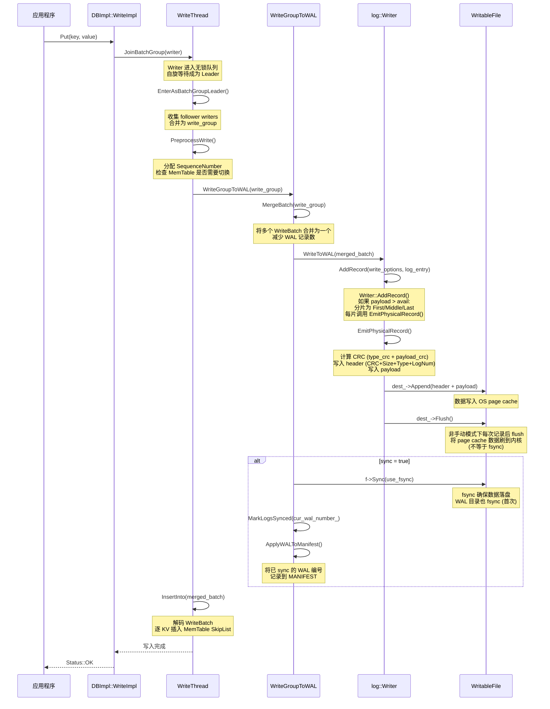
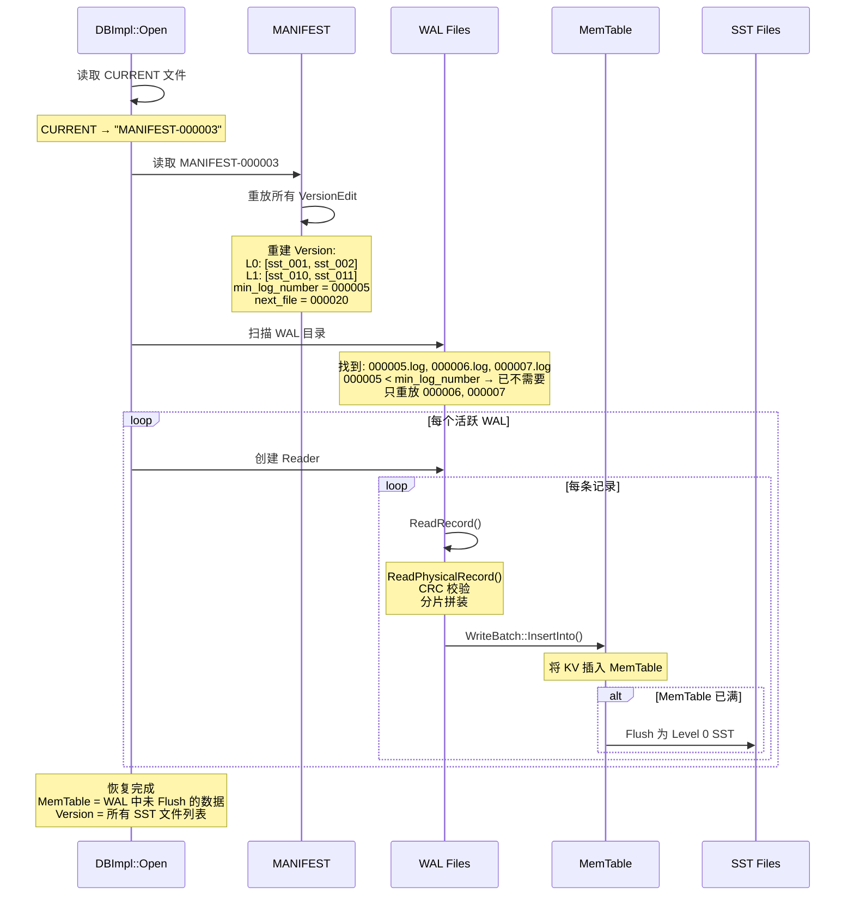
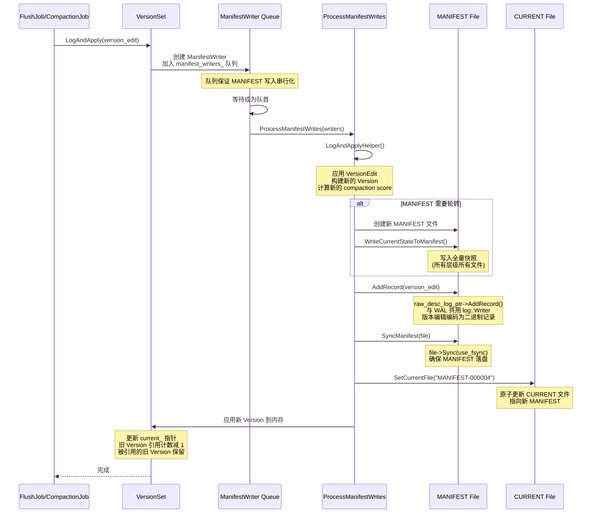

# RocksDB 日志系统详解

---

## 目录

1. [日志体系总览](#1-日志体系总览)
2. [WAL — 预写日志](#2-wal--预写日志)
3. [WAL 写入流程](#3-wal-写入流程)
4. [WAL 读取与恢复](#4-wal-读取与恢复)
5. [WAL 文件管理](#5-wal-文件管理)
6. [MANIFEST — 版本日志](#6-manifest--版本日志)
7. [MANIFEST 写入与恢复](#7-manifest-写入与恢复)
8. [应用日志 (LOG/INFO/WARN/ERROR)](#8-应用日志-loginfowarnerror)
9. [事件日志 (EventLogger)](#9-事件日志-eventlogger)
10. [日志间协作与崩溃恢复](#10-日志间协作与崩溃恢复)
11. [与 Ceph 日志体系对比](#11-与-ceph-日志体系对比)
12. [关键源码索引](#12-关键源码索引)

---

## 1. 日志体系总览

RocksDB 有三类日志，各司其职：

```
┌─────────────────────────────────────────────────────────────────┐
│                     RocksDB 日志体系                             │
├─────────────────────────────────────────────────────────────────┤
│                                                                  │
│  1. WAL (Write-Ahead Log)                                       │
│     ├── 保护: MemTable 数据 (用户写入的 KV)                      │
│     ├── 位置: <db>/wal_dir/000001.log                           │
│     ├── 格式: 32KB 块分割的记录流                                 │
│     ├── 用途: 崩溃后恢复 MemTable 中的未持久化数据               │
│     └── 生命周期: 创建 → 写入 → MemTable Flush 后可删除/回收     │
│                                                                  │
│  2. MANIFEST (Version Log)                                      │
│     ├── 保护: LSM-Tree 结构 (SST 文件列表、层级信息)             │
│     ├── 位置: <db>/MANIFEST-000001                              │
│     ├── 格式: VersionEdit 记录流 (与 WAL 共用 log::Reader)      │
│     ├── 用途: 崩溃后重建 SST 文件的完整映射                      │
│     └── 生命周期: 创建 → 追加 → 超大时轮转 → 重放恢复           │
│                                                                  │
│  3. 应用日志 (Logger)                                           │
│     ├── 保护: 无 (仅供人工查看和监控)                            │
│     ├── 位置: <db>/LOG / LOG.old.<timestamp>                    │
│     ├── 格式: 文本行 "YYYY/MM/DD-HH:MM:SS [file:line] msg"     │
│     ├── 用途: 运行时诊断 (INFO/WARN/ERROR)                     │
│     └── 生命周期: 自动按大小/时间轮转，保留有限数量              │
│                                                                  │
└─────────────────────────────────────────────────────────────────┘
```

### 1.1 三类日志对比

| 维度 | WAL | MANIFEST | 应用日志 (Logger) |
|------|-----|----------|-------------------|
| **保护对象** | MemTable 数据 | LSM-Tree 结构 | 无 |
| **写入时机** | 每次用户写入 | 每次 Flush/Compaction | 运行时事件 |
| **格式** | 二进制记录流 | 二进制 VersionEdit 流 | 文本行 |
| **fsync** | sync=true 时 fsync | 每次 LogAndApply fsync | 每 5 秒 flush |
| **恢复用途** | 重建 MemTable | 重建 SST 映射 | 无 |
| **裁剪** | MemTable Flush 后删除 | 不裁剪，只轮转 | 按大小/时间轮转 |
| **记录类型** | Full/First/Middle/Last | VersionEdit (Tag 编码) | INFO/WARN/ERROR |

---

## 2. WAL — 预写日志

### 2.1 文件格式

```
WAL 文件 (<db>/000001.log):

  按 32KB (kBlockSize) 块分割:

  ┌──────────────────┬──────────────────┬──────────────────┐
  │ Block 0 (32KB)   │ Block 1 (32KB)   │ Block 2 (32KB)   │
  │ ┌──────────────┐ │ ┌──────────────┐ │ ┌──────────────┐ │
  │ │ Record 0     │ │ │ Record 2     │ │ │ Record 4     │ │
  │ │ (kFullType)  │ │ │ (kFullType)  │ │ │ (kFirstType) │ │
  │ ├──────────────┤ │ ├──────────────┤ │ ├──────────────┤ │
  │ │ Record 1     │ │ │ Record 3     │ │ │ Record 4     │ │
  │ │ (kFirstType) │ │ │ (kLastType)  │ │ │ (cont)       │ │
  │ └──────────────┘ │ │              │ │ ├──────────────┤ │
  │                  │ │              │ │ │Pad (NUL)     │ │
  │                  │ │              │ │ ├──────────────┤ │
  │                  │ │              │ │ │ Record 5     │ │
  │                  │ │              │ │ │ (kLastType)  │ │
  └──────────────────┴──────────────────┴──────────────────┘

  单条记录格式:

  Legacy (header_size = 7):
  ┌────────┬────────┬────────┬──────────┐
  │ CRC    │ Size   │ Type   │ Payload  │
  │ 4字节  │ 2字节  │ 1字节  │ ≤30KB    │
  └────────┴────────┴────────┴──────────┘

  Recyclable (header_size = 11):
  ┌────────┬────────┬────────┬──────────┬──────────┐
  │ CRC    │ Size   │ Type   │ LogNum   │ Payload  │
  │ 4字节  │ 2字节  │ 1字节  │ 4字节    │ ≤30KB    │
  └────────┴────────┴────────┴──────────┴──────────┘

  CRC 计算:
    type_crc = crc32c(type_byte)        // 预计算
    payload_crc = crc32c(payload)       // 按需计算
    final_crc = Mask(Combine(type_crc, payload_crc, len))
```

### 2.2 记录类型

```
RecordType (db/log_format.h:22-49):

  基本类型:
    kZeroType  = 0   — 保留 (预分配文件中的空块)
    kFullType  = 1   — 完整记录 (单块内)
    kFirstType = 2   — 跨块记录的第一片
    kMiddleType= 3   — 跨块记录的中间片
    kLastType  = 4   — 跨块记录的最后一片

  可回收类型 (header 含 log_number 防止旧数据误读):
    kRecyclableFullType  = 5
    kRecyclableFirstType = 6
    kRecyclableMiddleType= 7
    kRecyclableLastType  = 8

  控制类型:
    kSetCompressionType       = 9   — WAL 压缩方式声明
    kUserDefinedTimestampSizeType = 10 — 用户定义时间戳大小
    kPredecessorWALInfoType   = 130 — 前一个 WAL 信息 (用于 WAL 链校验)

  安全忽略掩码:
    kRecordTypeSafeIgnoreMask = (1 << 13)
    → 未来新增类型设置此位，旧版本可安全忽略
```

### 2.3 大记录跨块示例

```
一条 50KB 的 WriteBatch:

  Block 0 (32KB):                    Block 1 (32KB):
  ┌───────────────────────┐          ┌───────────────────────┐
  │ kFirstType (7B header)│          │ kLastType (7B header) │
  │ Payload: 32KB-7B      │   ────→  │ Payload: 50KB-(32KB-7) │
  │ (第一片 ~32KB)        │          │ (最后片 ~18KB)        │
  └───────────────────────┘          └───────────────────────┘

  恢复时: Reader::ReadRecord() 将两片拼接到 scratch 中
```

---

## 3. WAL 写入流程

### 3.1 写入时序图



### 3.2 WAL Sync 与持久性保证

```
sync=true 时的写入保证:
  1. WriteBatch 数据写入 WAL 文件 (Append)
  2. Flush: page cache → 内核缓冲
  3. fsync: 内核缓冲 → 磁盘
  4. MemTable: 插入 SkipList (内存)
  5. 返回成功

  崩溃场景分析:

  T1: Append WAL → 崩溃
      数据在 page cache 中，未 fsync → 可能丢失
      → sync=true 不会在此时返回

  T2: fsync 完成 → 崩溃 (MemTable 未插入)
      WAL 中有数据 → 重放 WAL → 重建 MemTable → 不丢失

  T3: fsync 完成 + MemTable 插入 → 崩溃
      WAL 有数据 + MemTable 未 Flush 为 SST
      → 重放 WAL → 重建 MemTable → 不丢失

  T4: MemTable Flush 为 SST → 崩溃
      SST 已持久化 + WAL 不再需要
      → FindObsoleteFiles() 清理 WAL
```

---

## 4. WAL 读取与恢复

### 4.1 读取流程

```
Reader::ReadRecord() (db/log_reader.cc:78):

  状态机:
    in_fragmented_record = false  ← 初始状态

    loop:
      ReadPhysicalRecord(&fragment)

      switch (type):
        kFullType:     如果 in_fragmented_record → 报错
                       否则 → 直接返回 fragment

        kFirstType:    如果 in_fragmented_record → 报错
                       否则 → scratch = fragment
                                  in_fragmented_record = true

        kMiddleType:   如果 !in_fragmented_record → 报错 "missing start"
                       否则 → scratch += fragment

        kLastType:     如果 !in_fragmented_record → 报错
                       否则 → scratch += fragment
                                  in_fragmented_record = false
                                  返回 scratch (完整记录)

        kEof:          如果 in_fragmented_record → 丢弃 scratch
                       否则 → 返回 false (EOF)

        kBadRecord/CRC: 报告损坏
                        如果 in_fragmented_record → 丢弃 scratch

        kOldRecord:    可回收类型中 log_number 不匹配
                       → 返回 false (旧 WAL 数据)
```

### 4.2 崩溃恢复时序图



---

## 5. WAL 文件管理

### 5.1 WAL 生命周期

```
WAL 文件生命周期:

  创建:
    DBImpl::Open() → CreateWAL(log_number)
    文件名: <wal_dir>/<number>.log
    写入第一条记录: kSetCompressionType (如果启用压缩)

  活跃写入:
    WriteGroupToWAL() → log::Writer::AddRecord()
    sync 跟踪: MarkLogsSynced() / MarkLogsNotSynced()

  活跃 WAL 切换:
    触发: MemTable 切换 (ShouldFlushNow)
    → 创建新 WAL 文件
    → 新 WAL 加入 alive_wal_files_ 队列
    → 旧 WAL 仍在队列中

  归档:
    WalManager::ArchiveWALFile()
    → 重命名到 <wal_dir>/archive/<number>.log

  清理 (FindObsoleteFiles, db_impl_files.cc:213):
    while alive_wal_files_.begin().number < min_log_number:
      if recycle_log_file_num > wal_recycle_files_.size():
          → 加入 wal_recycle_files_ (待回收)
      else:
          → 加入 log_delete_files (待删除)
    PurgeObsoleteFiles() → 实际删除文件

  回收:
    CreateWAL(recycle_log_number = xxx)
    → fs_->ReuseWritableFile()
    → 重命名旧文件为新 WAL 文件名
    → 使用 Recyclable 记录类型 (header 含 log_number)
```

### 5.2 WAL 清理策略

```
WAL 清理由两个机制控制:

  1. min_log_number (基于 Flush):
     每次 Flush 成功后:
       VersionEdit.SetLogNumber(max_next_log_number)
       → 记录在 MANIFEST 中
       → 小于 min_log_number 的 WAL 已不再需要

  2. TTL / Size 限制 (WalManager):
     PurgeObsoleteWALFiles() (每 600 秒运行一次):
       ├── WAL_ttl_seconds > 0: 删除超过 TTL 的归档 WAL
       └── WAL_size_limit_MB > 0: 限制归档 WAL 总大小

  3. Prepared 事务保护:
     LogsWithPrepTracker 追踪包含未提交 prepared 事务的 WAL
     → FindMinLogContainingOutstandingPrep()
     → 防止删除仍有活跃 2PC 的 WAL
```

---

## 6. MANIFEST — 版本日志

### 6.1 VersionEdit 格式

```
VersionEdit 编码 (db/version_edit.cc:98):

  每条 VersionEdit 由一系列 Tag-Length-Value 组成:

  ┌─────────────────┬─────────────────────┐
  │ Tag (varint32)  │ Value (变长)         │
  └─────────────────┴─────────────────────┘

  Tag 类型 (db/version_edit.h:37-77):

  结构变更:
    kComparator (1)        → 比较器名称
    kLogNumber (2)         → 当前活跃 WAL 编号
    kNextFileNumber (3)    → 下一个 SST 文件编号
    kLastSequence (4)      → 最后一个 sequence
    kPrevLogNumber (9)     → 上一个 WAL 编号
    kMinLogNumberToKeep(10)→ 最小需保留 WAL 编号

  SST 文件操作:
    kDeletedFile (6)       → level + file_number
    kNewFile4 (103)        → level + file_number + file_size
                             + smallest_key + largest_key
                             + [custom tags: checksum, temperature, ...]

  Blob 文件操作:
    kBlobFileAddition (400) → 新增 Blob 文件
    kBlobFileGarbage (401)  → 删除 Blob 文件

  WAL 追踪:
    kWalAddition2           → 记录新 WAL 创建
    kWalDeletion2           → 记录 WAL 删除

  Column Family:
    kColumnFamilyAdd (201)  → 创建 CF
    kColumnFamilyDrop (202) → 删除 CF
```

### 6.2 MANIFEST 文件管理

```
文件命名:
  MANIFEST-000001
  MANIFEST-000002
  MANIFEST-000003  ← CURRENT 指向这个

  CURRENT 文件内容: "MANIFEST-000003"

  MANIFEST 轮转触发:
    ProcessManifestWrites() (version_set.cc:6107):
    if (manifest_file_size >= max_manifest_file_size):
        new_descriptor_log = true

    轮转过程:
    1. 创建 MANIFEST-000004
    2. 写入当前全量状态 (WriteCurrentStateToManifest)
    3. 写入新的 VersionEdit 记录
    4. Sync MANIFEST-000004
    5. 更新 CURRENT → "MANIFEST-000004"
    6. 旧 MANIFEST 文件在后续清理中删除
```

---

## 7. MANIFEST 写入与恢复

### 7.1 写入时序图



### 7.2 恢复机制

```
VersionSet::Recover() (version_set.cc:6680):

  1. 读取 CURRENT → "MANIFEST-000003"
  2. 打开 MANIFEST-000003
  3. 创建 log::Reader (与 WAL 共用读取基础设施)
  4. 循环 ReadRecord() → 解码每条 VersionEdit
  5. 应用 VersionEdit → 重建 Version:
     kNewFile → 添加 SST 到对应层级
     kDeletedFile → 从层级中移除 SST
     kLogNumber → 记录活跃 WAL 编号
  6. RecoverEpochNumbers() → 恢复 epoch

  容错: TryRecover() (version_set.cc:6849):
    如果最新 MANIFEST 损坏:
    → ManifestPicker 收集所有 MANIFEST-*
    → 从最新到最旧逐一尝试
    → 找到第一个可用的 MANIFEST 恢复
```

---

## 8. 应用日志 (LOG/INFO/WARN/ERROR)

### 8.1 日志格式

```
EnvLogger 输出格式 (logging/env_logger.h:108):

  YYYY/MM/DD-HH:MM:SS.uuuuuu thread_id [file:line] message

  示例:
  2026/04/08-14:30:22.123456 12345 [db/db_impl.cc:1234] Flush job #5 finished

  日志级别:
    INFO_LEVEL  — 正常操作信息 (Flush 完成, Compaction 开始等)
    WARN_LEVEL  — 警告 (Write stall, L0 文件过多等)
    ERROR_LEVEL — 错误 (IO 错误, 校验失败等)
    DEBUG_LEVEL — 调试 (详细内部状态)
    HEADER_LEVEL — DB 启动信息 (版本号, 选项等)
```

### 8.2 日志轮转

```
AutoRollLogger (logging/auto_roll_logger.h):

  触发轮转:
    ├── 按大小: kMaxLogFileSize (默认 1GB)
    └── 按时间: kLogFileTimeToRoll (默认 0 = 不轮转)

  保留策略:
    kKeepLogFileNum — 保留最近 N 个日志文件
    TrimOldLogFiles() — 删除超限的旧日志

  文件命名:
    LOG                    ← 当前日志
    LOG.old.1712572222000   ← 轮转后的旧日志 (时间戳)

  刷新策略:
    每 5 秒自动 flush (flush_every_seconds_ = 5)
    或手动调用 Flush()
```

### 8.3 LogBuffer — 延迟日志

```
LogBuffer (logging/log_buffer.h):

  使用场景: 持有 DB mutex 时不能直接写日志 (可能死锁)
  → 先写入 LogBuffer (Arena 分配，无锁)
  → 释放 mutex 后 FlushBufferToLog() 一次性刷出

  AddLogToBuffer():
    → Arena 分配 BufferedLog
    → vsnprintf 格式化
    → 加入 logs_ 列表

  FlushBufferToLog():
    → 遍历 logs_
    → 每条带原始时间戳写入 Logger
```

---

## 9. 事件日志 (EventLogger)

```
EventLogger (logging/event_logger.h):

  输出格式:
    EVENT_LOG_v1 {"time_micros": 1712572222123456, "event": "table_file_creation", ...}

  事件类型:
    ├── table_file_creation — SST 文件创建
    ├── table_file_deletion — SST 文件删除
    ├── compaction_started — Compaction 开始
    ├── compaction_finished — Compaction 完成
    └── ...

  使用方式:
    event_logger.Log() << "event" << "compaction_finished"
                       << "job_id" << job_id
                       << "input_files" << input_files_str
                       << "output_files" << output_files_str;

  输出到 INFO 级别日志，JSON 格式，便于监控采集
```

---

## 10. 日志间协作与崩溃恢复

### 10.1 写入时的日志协作

```
一次用户写入涉及的所有日志:

  App: Put("key", "value")

  ┌─ WAL ─────────────────────────────────────────────────────┐
  │ WriteBatch = {seq=100, count=1, put("key","value")}       │
  │ AddRecord(kFullType, WriteBatch)                          │
  │ 如果 sync=true: fsync                                     │
  └───────────────────────────────────────────────────────────┘
                              │
  ┌─ MemTable ───────────────────────────────────────────────┐
  │ InsertInto("key", "value", seq=100)                       │
  └───────────────────────────────────────────────────────────┘
                              │
  ┌─ 应用日志 (可选) ───────────────────────────────────────┐
  │ ROCKS_LOG_INFO(logger, "Write completed: seq=100")        │
  └───────────────────────────────────────────────────────────┘

  MemTable 满 → Flush:

  ┌─ MANIFEST ───────────────────────────────────────────────┐
  │ VersionEdit:                                              │
  │   kNewFile4: level=0, file=000020, size=4MB              │
  │   kLogNumber: 7 (min WAL to keep)                        │
  │ Sync MANIFEST                                             │
  │ 更新 CURRENT                                             │
  └───────────────────────────────────────────────────────────┘

  ┌─ 应用日志 ───────────────────────────────────────────────┐
  │ ROCKS_LOG_INFO(logger, "Flush job #5: ...")               │
  │ EventLogger: table_file_creation                          │
  └───────────────────────────────────────────────────────────┘
```

### 10.2 崩溃恢复全景

```
RocksDB 崩溃重启:

  Step 1: 读取 CURRENT → MANIFEST 文件名
  Step 2: 重放 MANIFEST → 重建 Version (所有 SST 文件列表)
          → 获取 min_log_number (最小需保留的 WAL)
  Step 3: 扫描 WAL 目录 → 过滤 alive WAL (>= min_log_number)
  Step 4: 逐 WAL 重放:
          ReadRecord() → WriteBatch::InsertInto() → MemTable
          → MemTable 满 → 自动 Flush 为 SST
  Step 5: 恢复完成
          Version 包含: 原 SST + 新 Flush 的 SST
          MemTable 包含: WAL 中未 Flush 的数据

  安全性保证:
    WAL sync=true  → 不丢失任何已确认写入
    WAL sync=false → 最多丢失一个 WAL record
    MANIFEST sync  → SST 文件列表不丢失
    MANIFEST 轮转 → TryRecover() 可从旧 MANIFEST 恢复
```

---

## 11. 与 Ceph 日志体系对比

| 维度 | RocksDB | Ceph |
|------|---------|------|
| **WAL 对应** | WAL 文件 (保护 MemTable) | MDS Journal (保护元数据) + BlueStore WAL (保护存储引擎) |
| **结构日志对应** | MANIFEST (保护 SST 映射) | Monitor Paxos Log (保护集群地图) |
| **应用日志对应** | EnvLogger / AutoRollLogger | ceph.log (应用日志) |
| **事件日志对应** | EventLogger (JSON) | clog / cluster log |
| **WAL 格式** | 32KB 块, CRC32c, 可回收 | RADOS 对象, Journaler 条带化 |
| **WAL fsync** | sync=true 时每写 fsync | BlueFS 两阶段提交 (bdev flush + superblock) |
| **结构日志格式** | VersionEdit (Tag-Length-Value) | Paxos proposal (MonitorDBStore Transaction) |
| **结构日志 fsync** | 每次 LogAndApply fsync | Paxos commit 后持久化 |
| **WAL 裁剪** | Flush 后删除/回收 | Journal 段过期 |
| **容错** | TryRecover (多 MANIFEST 候选) | MDS Journal 从头重放 |
| **日志层数** | 2 层 (WAL + MANIFEST) | 5 层 (pg_log + MDS Journal + BlueFS Log + RocksDB WAL + Paxos) |

### 11.1 RocksDB 日志在 Ceph 中的位置

```
Ceph 中 RocksDB 的日志:

  BlueStore 中的 RocksDB:
    ├── RocksDB WAL → BlueFS db.wal/ → BDEV_WAL 裸设备
    │   └── 通过 BlueRocksEnv 适配
    │       BlueRocksEnv::Sync() → BlueFS::fsync() → BlueFS Log → fsync
    │
    ├── RocksDB MANIFEST → BlueFS db/ → BDEV_DB
    │   └── VersionEdit 记录 SST 文件列表
    │
    └── RocksDB 应用日志 → ceph.log (重定向到 Ceph 日志系统)

  层级关系:
    Ceph 的 BlueFS Log 是 RocksDB WAL 的 "底层 WAL"
    BlueFS Log 负责保护 RocksDB WAL 文件本身的元数据
```

---

## 12. 关键源码索引

| 模块 | 文件 | 关键内容 |
|------|------|---------|
| **WAL 记录格式** | `db/log_format.h:22-61` | RecordType 枚举, kBlockSize, kHeaderSize |
| **WAL 写入** | `db/log_writer.cc:89` | `Writer::AddRecord()` |
| **WAL 物理记录** | `db/log_writer.cc:311` | `Writer::EmitPhysicalRecord()` |
| **WAL 读取** | `db/log_reader.cc:78` | `Reader::ReadRecord()` |
| **WAL 物理读取** | `db/log_reader.cc:552` | `Reader::ReadPhysicalRecord()` |
| **WAL 分片读取** | `db/log_reader.cc:960` | `FragmentBufferedReader::TryReadFragment()` |
| **WAL 创建** | `db/db_impl/db_impl_open.cc:2340` | `DBImpl::CreateWAL()` |
| **WAL 写入入口** | `db/db_impl/db_impl_write.cc:1988` | `DBImpl::WriteToWAL()` |
| **WAL 批量写入** | `db/db_impl/db_impl_write.cc:2035` | `DBImpl::WriteGroupToWAL()` |
| **WAL 并发写入** | `db/db_impl/db_impl_write.cc:2152` | `DBImpl::ConcurrentWriteGroupToWAL()` |
| **WAL Sync** | `db/db_impl/db_impl_write.cc:2076` | `f->Sync(opts, use_fsync)` |
| **WAL 清理** | `db/db_impl/db_impl_files.cc:213` | `DBImpl::FindObsoleteFiles()` |
| **WAL 删除** | `db/db_impl/db_impl_files.cc:522` | `DBImpl::PurgeObsoleteFiles()` |
| **WAL 管理** | `db/wal_manager.cc:140` | `WalManager::PurgeObsoleteWALFiles()` |
| **WAL 归档** | `db/wal_manager.cc:287` | `WalManager::ArchiveWALFile()` |
| **WAL 列表** | `db/wal_manager.cc:51` | `WalManager::GetSortedWalFiles()` |
| **Prepared 事务** | `db/logs_with_prep_tracker.h` | `LogsWithPrepTracker` |
| **VersionEdit Tag** | `db/version_edit.h:37-77` | Tag 枚举 |
| **VersionEdit 编码** | `db/version_edit.cc:98` | `VersionEdit::EncodeTo()` |
| **VersionEdit 字段** | `db/version_edit.h:1052-1094` | 数据成员定义 |
| **MANIFEST 写入** | `db/version_set.cc:5890` | `ProcessManifestWrites()` |
| **MANIFEST LogAndApply** | `db/version_set.cc:6535` | `VersionSet::LogAndApply()` |
| **MANIFEST 恢复** | `db/version_set.cc:6680` | `VersionSet::Recover()` |
| **MANIFEST 容错** | `db/version_set.cc:6849` | `VersionSet::TryRecover()` |
| **MANIFEST Sync** | `file/filename.cc:522` | `SyncManifest()` |
| **CURRENT 文件** | `db/version_set.cc:6286` | `SetCurrentFile()` |
| **Logger 接口** | `include/rocksdb/env.h:1358` | `Logger` 类 |
| **EnvLogger** | `logging/env_logger.h:108` | `EnvLogger::Logv()` |
| **AutoRollLogger** | `logging/auto_roll_logger.h` | 自动轮转 |
| **LogBuffer** | `logging/log_buffer.h` | 延迟日志 |
| **EventLogger** | `logging/event_logger.h` | JSON 事件日志 |
| **日志宏** | `logging/logging.h` | ROCKS_LOG_INFO/WARN/ERROR |
| **Statistics** | `monitoring/statistics.cc:22` | TickersNameMap |
