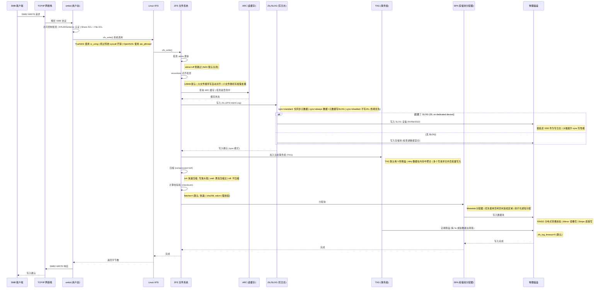
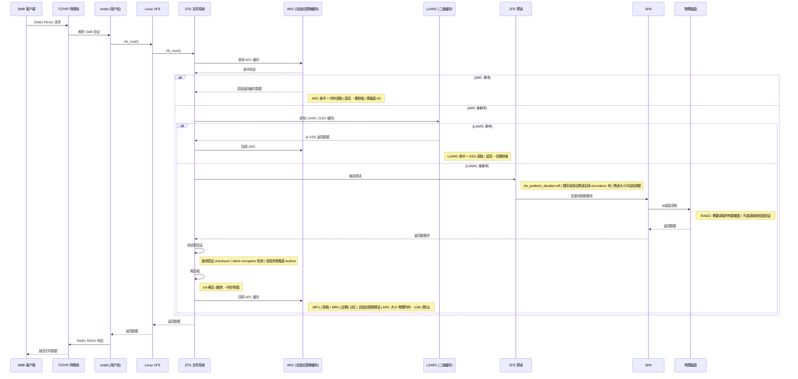
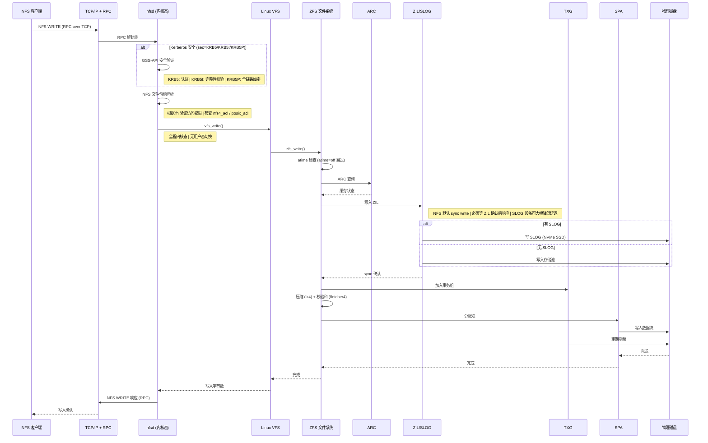
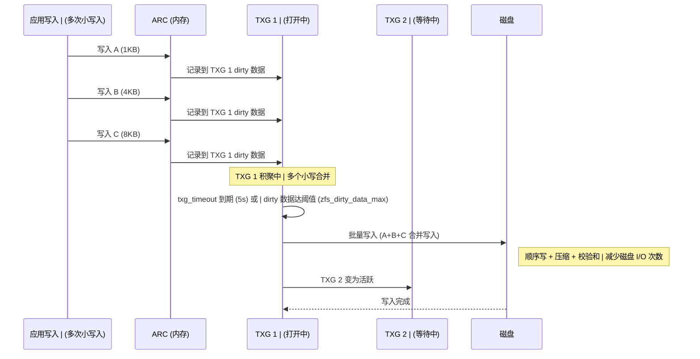

# NAS 文件 I/O 路径分析

> TrueNAS SCALE (Python/Linux) 源码分析

---

## 1. 核心结论：中间件不在 I/O 热路径上

NAS 的中间件（PHP/Python）**仅负责配置管理**，不参与实际的数据读写。文件 I/O 的热路径完全在**操作系统内核**中完成：

```
客户端读写请求 → 内核网络栈 → 文件共享服务 (内核/用户态) → VFS → ZFS → 磁盘
                     ↑                              ↑
              中间件不在此路径              中间件不在此路径
```

中间件的影响体现在**配置阶段**：它设置 ZFS 属性、Samba 参数、NFS 导出策略等，这些配置决定了 I/O 路径的行为特征。

---

## 2. NAS 三大 I/O 路径总览

```
┌─────────────────────────────────────────────────────────────────────┐
│                         NAS 存储系统                                 │
│                                                                     │
│  ┌──────────────┐   ┌──────────────┐   ┌──────────────┐            │
│  │  SMB Client  │   │  NFS Client  │   │ iSCSI Client │            │
│  │  (Windows/   │   │  (Linux/     │   │  (VM/DB/     │            │
│  │   macOS)     │   │   UNIX)      │   │   initiator) │            │
│  └──────┬───────┘   └──────┬───────┘   └──────┬───────┘            │
│         │                  │                  │                     │
│    TCP/SMB (445)      TCP/NFS (2049)    TCP/iSCSI (3260)          │
│         │                  │                  │                     │
│  ┌──────▼───────┐   ┌──────▼───────┐   ┌──────▼───────┐            │
│  │   Samba      │   │   nfsd       │   │   SCST       │            │
│  │ (smbd 用户态)│   │  (内核态)    │   │ (内核态)      │            │
│  │              │   │              │   │              │            │
│  │ io_uring     │   │              │   │              │            │
│  │ VFS模块      │   │              │   │              │            │
│  └──────┬───────┘   └──────┬───────┘   └──────┬───────┘            │
│         │                  │                  │                     │
│  ┌──────▼──────────────────▼──────────────────▼───────┐            │
│  │                    VFS 层                           │            │
│  │              (Virtual File System)                  │            │
│  └──────────────────────┬──────────────────────────────┘            │
│                         │                                            │
│  ┌──────────────────────▼──────────────────────────────┐            │
│  │                  ZFS 文件系统                        │            │
│  │                                                       │            │
│  │  ┌──────────┐  ┌──────────┐  ┌──────────────────┐  │            │
│  │  │ ARC      │  │ ZIL/SLOG │  │   zvol 层         │  │            │
│  │  │(读缓存)  │  │(写日志)  │  │ (块设备 emulation)│  │            │
│  │  └──────────┘  └──────────┘  └──────────────────┘  │            │
│  │                                                       │            │
│  │  ┌──────────────────────────────────────────────┐   │            │
│  │  │         SPA (Storage Pool Allocator)          │   │            │
│  │  │    压缩 → 检查和 → RAIDZ/Mirror → 磁盘      │   │            │
│  │  └──────────────────────────────────────────────┘   │            │
│  └──────────────────────┬──────────────────────────────┘            │
│                         │                                            │
│  ┌──────────────────────▼──────────────────────────────┐            │
│  │              块设备层 / 磁盘驱动                      │            │
│  │         /dev/sda, /dev/nvme0n1, ...                │            │
│  └──────────────────────────────────────────────────────┘            │
└─────────────────────────────────────────────────────────────────────┘
```

---

## 3. SMB/CIFS 文件 I/O 路径

### 路径特征

- Samba (`smbd`) 运行在**用户态**，是 I/O 路径中唯一经过用户态的协议
- TrueNAS SCALE 通过 `io_uring` 和 `zfs_core` VFS 模块优化 Samba → ZFS 的 I/O 路径
- OpenNAS 使用 `aio_pthread` 异步 I/O

### 3.1 SMB 写入时序图



### 3.2 SMB 读取时序图



---

## 4. NFS 文件 I/O 路径

### 路径特征

- `nfsd` 运行在**内核态**，比 SMB 少一次用户态/内核态切换
- NFSv4 支持 ACL、委托 (delegation)、状态ful 连接
- TrueNAS SCALE 支持 NFSv4 + Kerberos 安全性
- I/O 性能优于 SMB（全内核路径）

### 4.1 NFS 文件写入时序图



---

## 5. iSCSI 块 I/O 路径

### 路径特征

- iSCSI 提供**块设备**级别的访问，不是文件级别
- 数据通过 zvol (ZFS volume) 暴露为 `/dev/zvol/pool/vol`
- SCST 运行在**内核态**，处理 SCSI 命令
- TrueNAS SCALE 设置 `volthreading=off` 优化 zvol I/O

### 5.1 iSCSI 块写入时序图

```mermaid
sequenceDiagram
    participant Client as iSCSI Initiator
    participant Net as TCP/IP
    participant SCST as SCST (内核 SCSI Target)
    participant ZVOL as zvol 块设备层
    participant ZFS as ZFS SPA
    participant ZIL as ZIL/SLOG
    participant TXG as TXG
    member Disk as 物理磁盘

    Client->>Net: SCSI WRITE(10/16) PDU
    Net->>SCST: iSCSI 协议解析

    SCST->>SCST: 认证 (CHAP)
    SCST->>SCST: LUN 映射 (Target → Extent → zvol)

    SCST->>ZVOL: submit_bio() 块写入
    Note right of SCST: volblocksize 默认 16K | dRAID pool 默认 32K | 必须对齐写入

    ZVOL->>ZFS: ZFS 块 I/O 路径
    Note right of ZVOL: zvol 无 recordsize 概念 | 按 volblocksize 组织 | TrueNAS: volthreading=off | (单线程处理避免锁竞争)

    ZFS->>ZIL: 写 ZIL (sync=always)

    ZIL->>Disk: 写 SLOG

    ZIL-->>ZFS: sync 确认

    ZFS->>TXG: 加入事务组
    ZFS->>ZFS: 压缩 + 校验和
    ZFS->>Disk: 写入数据块

    TXG->>Disk: 定期刷盘

    Disk-->>ZFS: 完成
    ZFS-->>ZVOL: 完成
    ZVOL->>SCST: SCSI Response
    SCST->>Net: iSCSI Response PDU
    Net-->>Client: 写入确认
```

### 5.2 iSCSI 块读取时序图

```mermaid
sequenceDiagram
    participant Client as iSCSI Initiator
    participant Net as TCP/IP
    participant SCST as SCST (内核)
    participant ZVOL as zvol 块设备
    participant ARC as ARC
    member Disk as 物理磁盘

    Client->>Net: SCSI READ(10/16) PDU
    Net->>SCST: iSCSI 协议解析
    SCST->>ZVOL: submit_bio() 块读取

    ZVOL->>ARC: 查询 ARC 缓存

    alt ARC 命中
        ARC-->>ZVOL: 返回缓存块
    else ARC 未命中
        ZVOL->>Disk: 从磁盘读取
        Disk-->>ZVOL: 返回数据
        ZVOL->>ZVOL: 校验和验证
        ZVOL->>ARC: 回填缓存
    end

    ZVOL-->>SCST: 数据块
    SCST->>Net: SCSI Response (Data-In PDU)
    Net-->>Client: 返回块数据
```

---

## 6. 三种 I/O 路径对比

| 维度 | SMB/CIFS | NFS | iSCSI |
|------|----------|-----|-------|
| **服务运行态** | 用户态 (smbd) | 内核态 (nfsd) | 内核态 (SCST) |
| **用户态切换** | 有 (每次 I/O) | 无 | 无 |
| **访问粒度** | 文件级别 | 文件级别 | 块级别 |
| **数据单元** | recordsize (128KB) | recordsize (128KB) | volblocksize (16K) |
| **默认写模式** | async (可配置 sync) | sync (必须等 ZIL) | sync (必须等 ZIL) |
| **安全机制** | NTLM/Kerberos + ACL | UNIX perms / NFSv4 ACL / Kerberos | CHAP + LUN masking |
| **协议开销** | 最高 (SMB 头 + 用户态) | 中等 (RPC + NFS 头) | 最低 (SCSI CDB) |
| **典型延迟** | 较高 | 中等 | 最低 |
| **典型场景** | Windows 文件共享 | Linux/UNIX 挂载 | VM 磁盘 / 数据库 |
| **预读优化** | 依赖 ZFS 预读 | 依赖 ZFS 预读 | 依赖 ARC |

---

## 7. ZFS I/O 路径核心机制

### 7.1 写入聚合 (TXG) 机制



### 7.2 ARC 缓存替换算法

```
┌─────────────────────────────────────────────────────────┐
│                      ARC 缓存                            │
│                                                          │
│  ┌──────────────────────────────────────────────────┐   │
│  │                  MFU (高频使用)                    │   │
│  │   多次访问的数据, 优先保留                         │   │
│  │   ┌────────────┐  ┌────────────┐                  │   │
│  │   │ MFU ghost  │  │   MFU      │  ← 80% of ARC   │   │
│  │   │ (最近驱逐) │  │ (活跃数据) │                  │   │
│  │   └────────────┘  └────────────┘                  │   │
│  └──────────────────────────────────────────────────┘   │
│  ┌──────────────────────────────────────────────────┐   │
│  │                  MRU (近期使用)                    │   │
│  │   最近一次访问的数据                              │   │
│  │   ┌────────────┐  ┌────────────┐                  │   │
│  │   │ MRU ghost  │  │   MRU      │  ← 20% of ARC   │   │
│  │   │ (最近驱逐) │  │ (近期数据) │                  │   │
│  │   └────────────┘  └────────────┘                  │   │
│  └──────────────────────────────────────────────────┘   │
│                                                          │
│  Ghost 列表: 记录已驱逐数据元信息, 避免反复缓存抖动      │
│  自适应: 根据工作负载动态调整 MFU/MRU 比例               │
└─────────────────────────────────────────────────────────┘
         │
         ▼ (ARC 未命中时)
┌─────────────────┐
│   L2ARC         │
│   (SSD 二级缓存) │
│   ┌───────────┐ │
│   │ 热数据副本 │ │  ← 从 ARC 驱逐的频繁访问数据
│   └───────────┘ │
└─────────────────┘
         │
         ▼ (L2ARC 未命中时)
┌─────────────────┐
│   物理磁盘       │
└─────────────────┘
```

---

## 8. 中间件配置对 I/O 路径的影响

中间件虽不在 I/O 热路径上，但通过以下配置影响 I/O 性能：

### 8.1 ZFS 属性配置 (中间件 → ZFS 内核)

| 配置项 | 中间件设置方式 | 对 I/O 路径的影响 |
|--------|--------------|-------------------|
| `compression=lz4` | 创建 dataset 时设置 | 写入时压缩, 减少磁盘 I/O 量, lz4 极快 |
| `atime=off` | SMB/NFS 数据集默认关闭 | 跳过每次读的元数据写, 大幅减少写放大 |
| `recordsize=128K` | 数据集默认值 | 决定读写的块大小, 大文件顺序 I/O 性能最优 |
| `recordsize=1M` | dRAID 存储池数据集 | dRAID 校验开销大, 更大 recordsize 减少校验次数 |
| `volblocksize=16K` | zvol 创建时设置 | iSCSI 块 I/O 的最小单元, 必须与应用对齐 |
| `sync=standard` | 默认值 | SMB 写先返回, ZIL 异步刷盘; NFS sync 写必须等 ZIL |
| `sync=always` | 数据库/VM 场景 | 所有写必须等 ZIL 确认, SLOG 设备降低延迟 |
| `primarycache=all` | 默认值 | ARC 缓存数据+元数据 |
| `xattr=sa` | 文件系统数据集默认 | 扩展属性存储在 inode 中, 减少 I/O 次数 |
| `volthreading=off` | iSCSI extent 创建时 | zvol 关闭多线程, 避免 iSCSI 锁竞争 |
| `autotrim=on` | 存储池级别 | 自动回收 TRIM, SSD 优化 |
| `dedup=off` | 默认关闭 | 去重会严重消耗 ARC 内存, 通常不建议开启 |
| `ashift=12` | 存储池创建时 | 4K 扇区对齐, 避免读写放大 |

### 8.2 Samba 配置 (中间件 → smb.conf)

| 配置项 | 设置方式 | 对 I/O 路径的影响 |
|--------|---------|-------------------|
| `kernel share modes = yes` | TrueNAS SCALE 默认 | 内核处理文件锁, 减少 smbd 用户态开销 |
| `kernel change notify = yes` | TrueNAS SCALE 默认 | 内核通知文件变更 |
| `io_uring = yes` | TrueNAS SCALE 启用 | Samba 使用 io_uring, 绕过 syscall 开销 |
| `vfs_zfs_core` | TrueNAS SCALE VFS 模块 | Samba 直接调用 ZFS 内核接口, 跳过 POSIX 层 |
| `use sendfile = yes` | OpenNAS 设置 | 零拷贝发送, 减少内存拷贝 |
| `aio read size / write size` | OpenNAS 设置 | 异步 I/O 大小, 与 recordsize 对齐 |
| `strict allocate = yes` | 默认开启 | 精确预分配空间, 减少碎片 |

### 8.3 内核调优 (中间件 → sysctl)

| 配置项 | 作用 | 影响 |
|--------|------|------|
| `vfs.zfs.arc_max` | ARC 最大内存 | 默认: 物理内存 - 1GB; ARC 越大读命中越高 |
| `vfs.zfs.txg_timeout` | TXG 刷盘间隔 | 默认 5 秒; 越小数据安全性越高, 性能越低 |
| `vfs.zfs.dirty_data_max` | 脏数据上限 | 控制写聚合量, 影响 write bandwidth |
| `vfs.zfs.l2arc_write_max` | L2ARC 写入速率 | 控制 ARC → L2ARC 回填速度 |
| `vfs.zfs.prefetch_disable` | 禁用预读 | 默认 0 (启用); 顺序读工作负载建议开启 |

---

## 9. I/O 路径性能瓶颈分析

```
                     I/O 延迟来源 (从高到低)
    ┌────────────────────────────────────────────────┐
    │                                                │
    │  ██████████████  磁盘物理 I/O (机械 HDD)       │  ~10ms (随机) / ~1ms (顺序)
    │  ██████████      网络 RTT (跨网段)             │  ~0.1-5ms (LAN) / ~1-100ms (WAN)
    │  ██████          SLOG 写入 (sync write)        │  ~0.1ms (NVMe) / ~0.5ms (SATA SSD)
    │  █████           ARC 未命中读磁盘              │  ~0.5ms (SSD) / ~10ms (HDD)
    │  ████            ZFS 压缩+校验和 (CPU)         │  ~0.01-0.1ms (per block)
    │  ███             SMB 用户态切换                │  ~0.01-0.05ms (per syscall)
    │  ██              ARC 命中 (内存读)             │  ~0.001ms
    │  █               VFS 层开销                    │  ~0.001ms
    │                                                │
    └────────────────────────────────────────────────┘

    优化方向:
    1. 减少/消除磁盘 I/O → ARC 缓存 + L2ARC
    2. 加速 sync write → SLOG (NVMe SSD)
    3. 减少 SMB 开销 → io_uring + zfs_core (内核路径)
    4. 写聚合 → TXG (5s 间隔, 批量刷盘)
    5. 减少数据量 → lz4 压缩 + dedup (谨慎)
    6. 消除读放大 → atime=off, ashift=12
```

---

## 10. 总结

### I/O 路径关键发现

1. **中间件是旁观者**: PHP/Python 中间件仅负责配置，不在数据读写的热路径上
2. **SMB 是唯一经过用户态的协议**: smbd 运行在用户态, 每次文件 I/O 都有用户态/内核态切换开销; TrueNAS SCALE 通过 io_uring + zfs_core VFS 模块大幅缓解此问题
3. **NFS 和 iSCSI 全程内核态**: nfsd 和 SCST 都在内核中运行, 路径最短, 延迟最低
4. **ZFS 是 I/O 路径的核心**: 所有文件/块 I/O 最终都经过 ZFS 的 ARC → ZIL → TXG → SPA 路径
5. **中间件的关键影响在配置**: compression、atime、recordsize、volblocksize、sync、SLOG 等属性的设置直接决定了 I/O 路径的行为
6. **写性能优于读性能 (在缓存命中时)**: 写入只写 ZIL 即可返回, 实际刷盘由 TXG 异步聚合; 读取未命中时必须等磁盘
