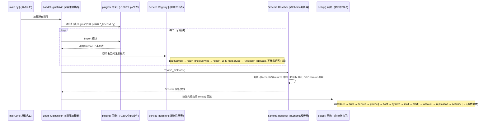
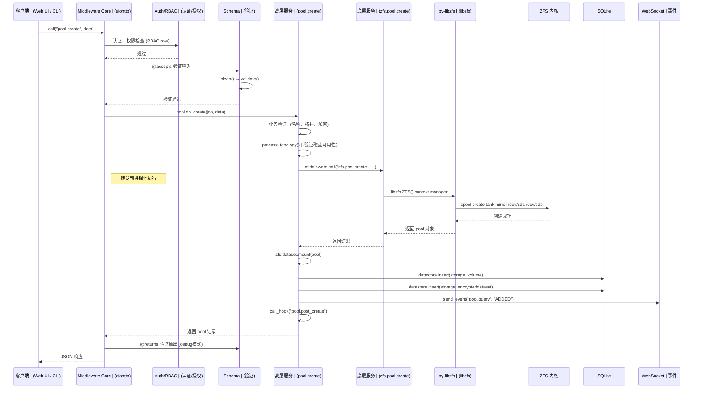
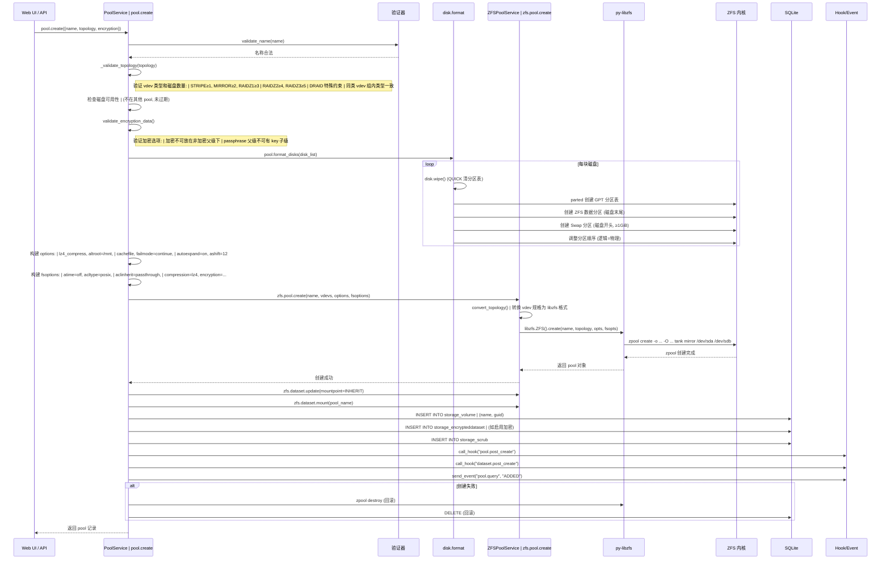
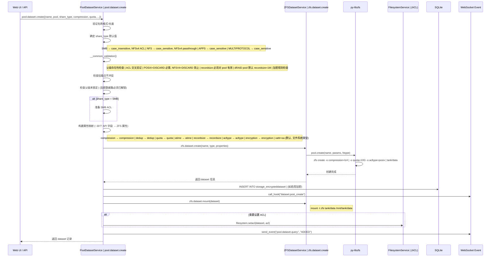
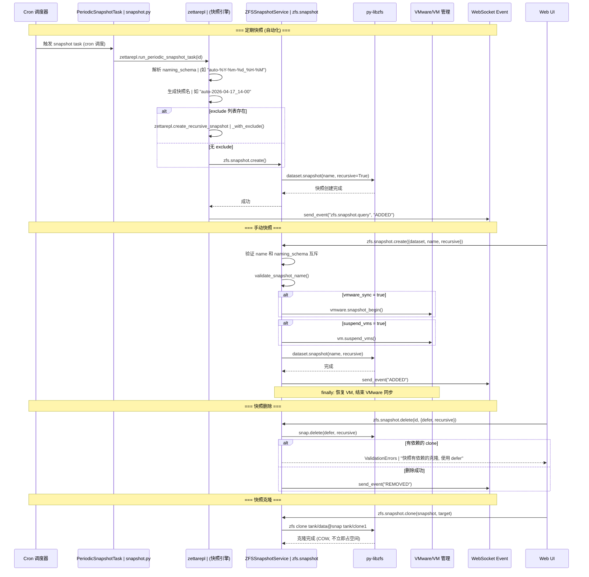
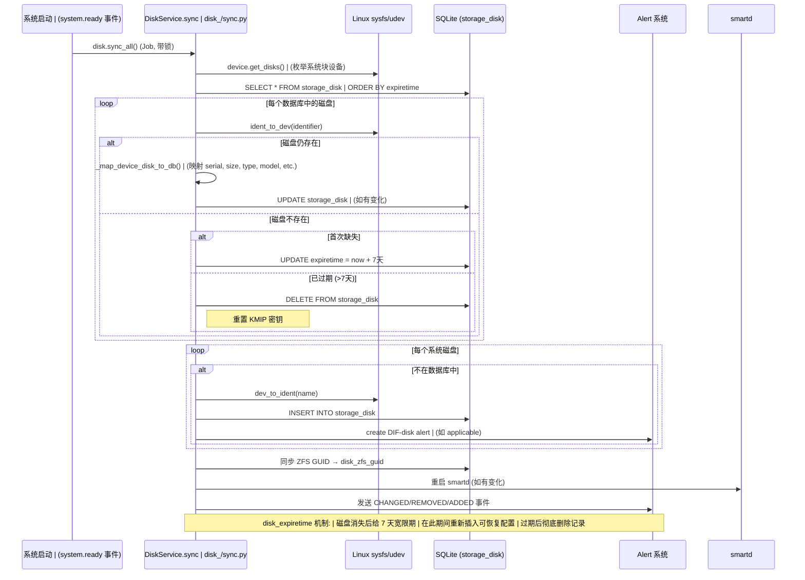
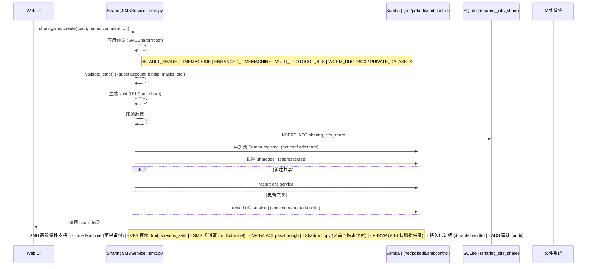
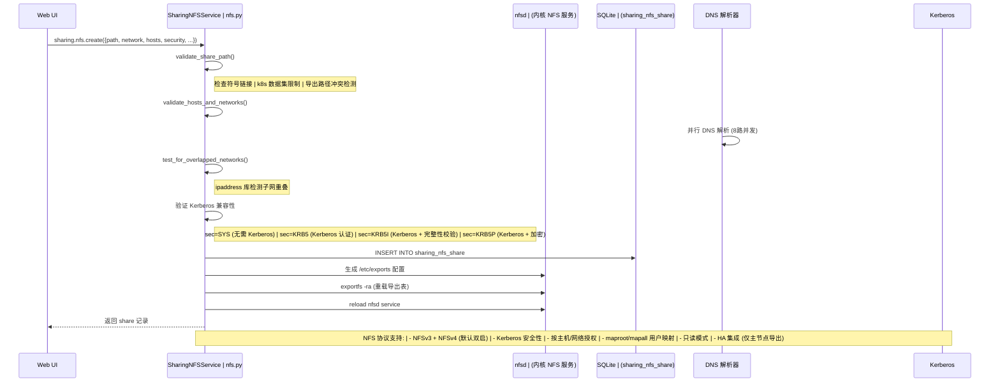
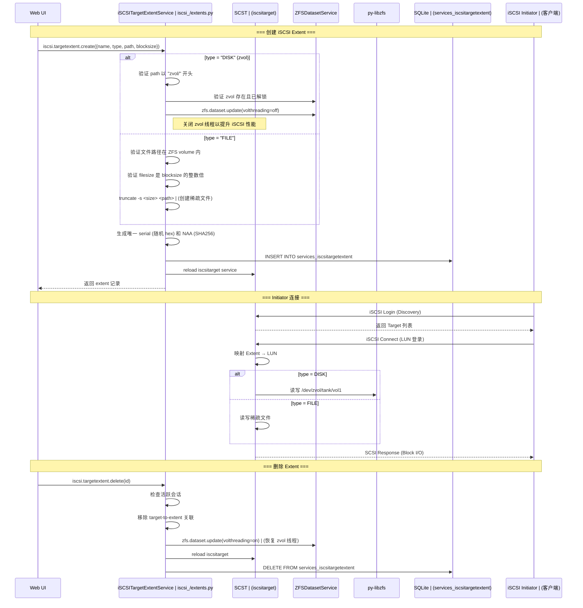

# TrueNAS SCALE (Treenas) 存储模型分析

> 基于 `middleware-release-24.04.2` (Dragonfish) 源码分析

---

## 1. 项目概述

TrueNAS SCALE 是 iXsystems 基于 Linux (Debian) 的 NAS 操作系统，其中间件 (`middlewared`) 是一个纯 **Python 3** 守护进程，提供 REST/WebSocket API，管理底层 ZFS 存储系统。与 OpenNAS (PHP/FreeBSD) 不同，TrueNAS SCALE 采用**现代 Python 插件化架构**，使用 `libzfs` Python 绑定直接操作 ZFS。

### 技术栈

| 组件 | 技术 |
|------|------|
| 语言 | Python 3 |
| Web 框架 | aiohttp (异步 HTTP/WebSocket) |
| ORM | SQLAlchemy + Alembic |
| ZFS 绑定 | py-libzfs (libzfs Python 封装) |
| 存储后端 | ZFS (Linux native) |
| 数据库 | SQLite |
| 事件系统 | WebSocket (内置) |
| 定时任务 | 内置 Job Queue + cron |
| 复制引擎 | zettarepl |

### 核心插件目录结构

```
middlewared/plugins/
├── disk.py                  # 磁盘 CRUD (storage_disk 表)
├── disk_/                   # 磁盘子功能 (sync, format, smart, wipe, sed, etc.)
├── pool_/                   # 存储池管理 (storage_volume 表)
│   ├── pool.py              #   PoolService (高级 API)
│   ├── dataset.py           #   PoolDatasetService (数据集 CRUD)
│   ├── topology.py          #   vdev 拓扑管理
│   ├── format_disks.py      #   磁盘格式化
│   ├── expand.py            #   存储池扩容
│   ├── replace_disk.py      #   磁盘替换 (resilver)
│   ├── scrub.py             #   数据校验
│   ├── attach_disk.py       #   附加磁盘
│   └── ...                  #   加密、导入导出、快照计数等
├── zfs_/                    # ZFS 底层操作 (私有服务)
│   ├── pool.py              #   ZFSPoolService (libzfs 调用)
│   ├── dataset.py           #   ZFSDatasetService (libzfs 调用)
│   ├── snapshot.py          #   ZFSSnapshotService
│   ├── pool_utils.py        #   拓扑转换工具
│   ├── pool_status.py       #   存储池健康状态
│   └── ...
├── smb.py                   # SMB/CIFS 文件共享
├── nfs.py                   # NFS 文件共享
├── iscsi_/                  # iSCSI 块存储 (SCST 后端)
├── snapshot.py              # 定期快照任务
├── replication.py           # ZFS 复制 (zettarepl)
├── cloud_sync.py            # 云同步 (rclone)
├── boot.py / bootenv.py     # 引导管理 (zectl/beadm)
├── sysdataset.py            # 系统数据集
├── smart.py                 # SMART 磁盘监控
├── filesystem.py            # 文件系统操作 (ACL/stat)
└── alert/source/            # 存储告警 (pool, disk, nfs, iscsi, etc.)
```

---

## 2. 存储架构总览

TrueNAS SCALE 采用**纯 ZFS 存储模型**，所有存储功能基于 ZFS 实现，没有传统的 UFS/FAT 挂载系统：

```
┌─────────────────────────────────────────────────────────────────────┐
│                       TrueNAS SCALE 中间件                           │
│                                                                     │
│  ┌────────────┐  ┌────────────┐  ┌────────────┐  ┌────────────┐   │
│  │ Web UI /   │  │ WebSocket  │  │ CLI        │  │ REST API   │   │
│  │ TrueCommand │  │ Events     │  │ (midclt)   │  │ (OpenAPI)  │   │
│  └─────┬──────┘  └─────┬──────┘  └─────┬──────┘  └─────┬──────┘   │
│        └────────────────┼───────────────┼───────────────┘          │
│                         ▼                                           │
│  ┌──────────────────────────────────────────────────────────────┐   │
│  │              插件系统 (Plugin Framework)                       │   │
│  │  ┌─────────┐ ┌──────────┐ ┌──────────┐ ┌──────────────┐     │   │
│  │  │pool.*   │ │pool.dataset│ │disk.*   │ │smb/nfs/iscsi │     │   │
│  │  │(高级API)│ │(数据集API)│ │(磁盘API) │ │(共享服务)    │     │   │
│  │  └────┬────┘ └────┬─────┘ └────┬─────┘ └──────┬───────┘     │   │
│  │       │           │            │               │             │   │
│  │  ┌────▼────┐ ┌────▼─────┐ ┌───▼──────┐  ┌─────▼───────┐    │   │
│  │  │zfs.pool │ │zfs.dataset│ │disk._sub │  │service_.*   │    │   │
│  │  │(底层API)│ │(底层API) │ │(子功能)  │  │(服务管理)   │    │   │
│  │  └────┬────┘ └────┬─────┘ └──────────┘  └─────────────┘    │   │
│  └───────┼───────────┼──────────────────────────────────────────┘   │
│          │           │                                              │
│  ┌───────▼───────────▼──────────────────────────────────────────┐   │
│  │            基础设施层                                          │   │
│  │  ┌──────────┐  ┌──────────┐  ┌──────────┐  ┌────────────┐  │   │
│  │  │ py-libzfs│  │ SQLAlchemy│  │ Job Queue│  │ zettarepl │  │   │
│  │  │ (ZFS绑定)│  │ (SQLite) │  │ (任务调度)│  │ (复制引擎)│  │   │
│  │  └────┬─────┘  └────┬─────┘  └──────────┘  └─────┬──────┘  │   │
│  └───────┼──────────────┼─────────────────────────────┼─────────┘   │
└──────────┼──────────────┼─────────────────────────────┼─────────────┘
           │              │                             │
           ▼              ▼                             ▼
┌──────────────┐  ┌──────────────┐  ┌──────────────────────────────┐
│   ZFS 内核   │  │    SQLite    │  │      外部服务                 │
│  ┌─────────┐ │  │              │  │  Samba | nfsd | SCST | rclone│
│  │  zpool  │ │  │ storage_disk │  │  smartd | sshd | fenced      │
│  │  dataset│ │  │ storage_volume│ │  mdnsresponder | snmp         │
│  │  zvol   │ │  │ storage_task │  │                              │
│  │  snapshot│ │  │ storage_replication │                         │
│  │  clone  │ │  │ sharing_nfs_share   │                         │
│  │  send/  │ │  │ sharing_cifs_share  │                         │
│  │  recv   │ │  │ services_iscsiextent│                         │
│  └─────────┘ │  └──────────────┘  └──────────────────────────────┘
└──────┬───────┘
       ▼
┌──────────────────────────────────────┐
│     物理存储设备                      │
│  /dev/sda  /dev/nvme0n1  (HDD/SSD)   │
│  /dev/sd[a-z]  (SAS/SATA)            │
│  /dev/nvme[0-9]n1  (NVMe)           │
└──────────────────────────────────────┘
```

---

## 3. 存储对象层次结构

```
物理磁盘 (/dev/sda, /dev/nvme0n1)
  │
  │  [disk.format] ── parted 创建 GPT 分区表
  │     ├── ZFS 数据分区 (GPT type: 6a898cc3-1dd2-11b2-99a6-080020736631)
  │     └── Swap 分区 (可选)
  │
  ├── zpool (存储池)
  │   │
  │   │  由 vdev (虚拟设备) 组成:
  │   │  ├── MIRROR  (镜像, ≥2 disks)
  │   │  ├── STRIPE  (条带化, ≥1 disk)
  │   │  ├── RAIDZ1  (单校验, ≥3 disks)
  │   │  ├── RAIDZ2  (双校验, ≥4 disks)
  │   │  ├── RAIDZ3  (三校验, ≥5 disks)
  │   │  ├── DRAID   (声明式 RAID, 自带 spare)
  │   │  ├── CACHE   (L2ARC 读缓存)
  │   │  ├── LOG     (SLOG 写日志, 可镜像)
  │   │  ├── SPARE   (热备盘)
  │   │  ├── SPECIAL (元数据特殊分配)
  │   │  └── DEDUP   (去重 vdev)
  │   │
  │   ├── Dataset (数据集 / ZFS 文件系统)
  │   │   ├── 挂载点: /mnt/pool/dataset
  │   │   ├── 属性: compression, dedup, quota, atime, acltype, recordsize
  │   │   ├── 加密: encryption=on|off|aes-256-gcm, keyformat, keylocation
  │   │   ├── 用途: SMB/NFS 共享目录, Apps 数据, VM 磁盘镜像
  │   │   └── 快照 (snapshot)
  │   │       ├── @snap_name (即时快照, COW)
  │   │       ├── 定期快照 (PeriodicSnapshotTask → zettarepl)
  │   │       ├── 克隆 (clone) ── 从快照创建可写副本
  │   │       ├── 保留 (hold) ── 防止快照被删除
  │   │       └── 发送/接收 (send/recv) ── 复制到远端
  │   │
  │   └── Volume (zvol / 块设备)
  │       ├── 设备路径: /dev/zvol/pool/volume
  │       ├── 属性: volsize, volblocksize, compression
  │       └── 用途: iSCSI extent, VM 磁盘
  │
  └── [传统文件系统支持极少, 仅作为外部兼容]
```

---

## 4. 中间件插件系统架构

### 4.1 插件加载机制



### 4.2 双层服务架构

TrueNAS SCALE 的存储管理采用**高层业务服务 + 底层 ZFS 操作服务**的双层架构：

```
┌─────────────────────────────────────────────────────────────┐
│                   高层业务服务 (Public)                       │
│  命名空间: pool.*, pool.dataset.*, disk.*, smb.*, nfs.*      │
│  职责: 业务逻辑、输入验证、加密管理、ACL、HA、钩子、事件       │
│  数据: 读写 SQLite (storage_volume, storage_disk, sharing_*) │
│  ZFS:  通过 middleware.call() 调用底层服务                    │
├─────────────────────────────────────────────────────────────┤
│                   底层 ZFS 服务 (Private)                     │
│  命名空间: zfs.pool.*, zfs.dataset.*, zfs.snapshot.*         │
│  职责: 直接调用 py-libzfs 执行 ZFS 操作                       │
│  数据: 不直接操作数据库                                       │
│  ZFS:  直接使用 libzfs.ZFS() 上下文管理器                     │
│  进程:  运行在进程池 (process_pool) 中, 避免锁竞争             │
└─────────────────────────────────────────────────────────────┘
```

### 4.3 方法调用流程



---

## 5. 数据库模型 (存储相关表)

```
┌─────────────────────────────────────────────────────────────────────┐
│                        SQLite 数据库                                 │
│                                                                     │
│  ┌─────────────────────┐     ┌──────────────────────────┐          │
│  │    storage_disk      │     │     storage_volume        │          │
│  ├─────────────────────┤     ├──────────────────────────┤          │
│  │ PK: disk_identifier  │     │ PK: id (AUTO)            │          │
│  │    disk_name         │     │ UQ: vol_name             │          │
│  │    disk_serial       │     │    vol_guid              │          │
│  │    disk_size         │     │    vol_encrypt            │          │
│  │    disk_model        │     │    vol_encryptkey         │          │
│  │    disk_type         │     └──────────┬───────────────┘          │
│  │    disk_rotationrate │                │                          │
│  │    disk_zfs_guid ────┼──→ (指向 pool)  │                          │
│  │    disk_enclosure_slot│               │                          │
│  │    disk_togglesmart   │  ┌────────────▼──────────────┐          │
│  │    disk_smartoptions   │  │ storage_encrypteddataset  │          │
│  │    disk_passwd (SED)   │  ├──────────────────────────┤          │
│  │    disk_expiretime     │  │ PK: id                   │          │
│  └─────────────────────┘  │    name (dataset path)     │          │
│                           │    encryption_key          │          │
│                           │    kmip_uid                │          │
│                           └───────────────────────────┘          │
│                                                                     │
│  ┌─────────────────────┐  ┌───────────────────────────┐           │
│  │   storage_scrub      │  │    storage_resilver       │           │
│  ├─────────────────────┤  ├───────────────────────────┤           │
│  │ FK: scrub_volume_id  │  │    enabled                │           │
│  │    scrub_threshold   │  │    begin/end (time)       │           │
│  │    scrub_cron_fields │  │    weekday                │           │
│  │    scrub_enabled     │  └───────────────────────────┘           │
│  └─────────────────────┘                                          │
│                                                                     │
│  ┌─────────────────────┐  ┌───────────────────────────┐           │
│  │   storage_task       │  │   storage_replication     │           │
│  │ (定期快照任务)        │  │   (ZFS 复制配置)          │           │
│  ├─────────────────────┤  ├───────────────────────────┤           │
│  │    task_dataset      │  │    repl_target_dataset    │           │
│  │    task_recursive    │  │    repl_direction         │           │
│  │    task_lifetime_*   │  │    repl_transport         │           │
│  │    task_naming_schema│  │    repl_source_datasets   │           │
│  │    task_cron_fields  │  │    repl_compression       │           │
│  │    task_exclude      │  │    repl_encryption_*      │           │
│  │    task_enabled      │  │    repl_state             │           │
│  └────────┬────────────┘  └────────┬──────────────────┘           │
│           │        ┌───────────────┘                              │
│           ▼        ▼                                               │
│  ┌─────────────────────────────┐                                  │
│  │ storage_replication_        │                                  │
│  │ repl_periodic_snapshot_tasks│                                  │
│  │ (快照任务↔复制任务 多对多)   │                                  │
│  └─────────────────────────────┘                                  │
│                                                                     │
│  ┌──────────────────┐  ┌──────────────────┐  ┌─────────────────┐  │
│  │ sharing_nfs_share │  │ sharing_cifs_share│  │services_iscsi   │  │
│  ├──────────────────┤  ├──────────────────┤  │targetextent     │  │
│  │ nfs_path         │  │ cifs_path         │  ├─────────────────┤  │
│  │ nfs_network      │  │ cifs_name         │  │ extent_name     │  │
│  │ nfs_ro           │  │ cifs_ro           │  │ extent_type     │  │
│  │ nfs_maproot_*    │  │ cifs_browsable    │  │ extent_path     │  │
│  │ nfs_security     │  │ cifs_timemachine  │  │ extent_blocksize│  │
│  │ nfs_enabled      │  │ cifs_acl          │  │ extent_filesize │  │
│  └──────────────────┘  │ cifs_enabled      │  └─────────────────┘  │
│                        └──────────────────┘                        │
└─────────────────────────────────────────────────────────────────────┘
```

---

## 6. 存储池创建时序图



---

## 7. 数据集 (Dataset) 创建时序图



---

## 8. ZFS 快照管理时序图



---

## 9. 磁盘同步与管理时序图



---

## 10. 文件共享服务时序图

### 10.1 SMB/CIFS 共享



### 10.2 NFS 共享



---

## 11. iSCSI 块存储时序图



---

## 12. ZFS 复制时序图

```mermaid
sequenceDiagram
    participant UI as Web UI
    participant Repl as ReplicationService | replication.py
    participant Zetta as zettarepl | (复制引擎)
    participant SSH as SSH 连接
    participant Local as 本地 ZFS
    participant Remote as 远端 NAS | (middleware)
    participant DB as SQLite
    participant Task as PeriodicSnapshotTask
    participant Event as WebSocket Event

    Note over UI,Event: === 创建复制任务 ===

    UI->>Repl: replication.create({
        name, direction: "PUSH",
        transport: "SSH",
        source_datasets: ["tank/data"],
        target_dataset: "backup/data",
        periodic_snapshot_tasks: [1,2],
        encryption_key, ...
    })

    Repl->>Repl: _validate()
    Note right of Repl: PUSH: 需要 snapshot task 或 naming_schema | SSH: 验证凭证 | 加密: 验证密钥格式/位置 | 全量复制: 需递归+属性同步

    Repl->>DB: INSERT INTO storage_replication
    Repl->>DB: INSERT INTO storage_replication_ | repl_periodic_snapshot_tasks | (多对多关联)
    Repl->>Zetta: zettarepl.update_tasks()

    Note over UI,Event: === 执行复制 (自动/手动) ===

    Repl->>Zetta: zettarepl.run_replication_task(id)

    Zetta->>Task: 获取关联的快照命名规则
    Zetta->>Local: zfs list -t snapshot -s creation | 找到匹配的源快照

    Zetta->>Zetta: 确定增量发送起点

    alt 首次复制
        Zetta->>Local: zfs send -R tank/data@snap_latest
    else 增量复制
        Zetta->>Local: zfs send -R -I | tank/data@snap_last tank/data@snap_new
    end

    Local-->>Zetta: 增量数据流

    alt transport = SSH
        Zetta->>SSH: ssh remote_nas | "zfs recv -F backup/data"
    else transport = SSH+NETCAT
        Zetta->>SSH: ssh → 启动 netcat 服务端
        Zetta->>Zetta: 本地 netcat → 发送数据
    else transport = LOCAL
        Zetta->>Remote: zfs recv (本地 pool)
    end

    Remote-->>Zetta: 接收完成

    Zetta->>Remote: 应用保留策略 | (retention_policy)
    Zetta->>Zetta: 更新任务状态
    Zetta->>Event: send_event("replication.query", "CHANGED")
    Zetta-->>Repl: 完成

    Note over UI,Event: === 双向复制 (PULL) ===
    Note right of Zetta: PULL 模式: 远端触发 | 需要 REPLICATION_TASK_WRITE_PULL 权限 | 不可 hold pending snapshots
```

---

## 13. 与 OpenNAS 的对比

| 维度 | OpenNAS (PHP/FreeBSD) | TrueNAS SCALE (Python/Linux) |
|------|----------------------|------------------------------|
| 语言 | PHP + Shell | Python 3 |
| 内核 | FreeBSD 10.2 | Debian Linux |
| ZFS 绑定 | Shell 命令 (`zpool`/`zfs` CLI) | py-libzfs (Python C 绑定) |
| 存储模型 | 双轨 (ZFS + 传统 FS) | 纯 ZFS |
| 配置存储 | 单一 XML 文件 (config.xml) | SQLite + SQLAlchemy ORM |
| 架构 | 直接脚本调用 | 插件化 + 进程池 + 异步事件循环 |
| 数据持久化 | 文件级滚动备份 (6 级) | 数据库 + Alembic 迁移 |
| 磁盘管理 | GEOM 框架 (gmirror, gstripe, gconcat) | ZFS vdev (mirror, raidz, draid) |
| 加密 | GELI (FreeBSD) | ZFS 原生加密 + LUKS (Linux) |
| 文件共享 | NFS, CIFS, AFP, FTP | NFSv3/v4, SMB (Samba 4), iSCSI (SCST) |
| 复制 | shell 脚本 (zfs send/recv) | zettarepl (Python 引擎) |
| 高可用 | HAST + CARP | fenced + Active/Standby |
| 告警 | 邮件通知 | 19+ 种存储告警源 (WebUI/邮件/PagerDuty) |
| 云集成 | 无 | rclone (S3/Azure/GCS/B2/Swift) |
| 虚拟化 | 无 | KVM VM + OpenEBS (Kubernetes 存储) |
| API | XML-RPC | REST + WebSocket + OpenAPI |

---

## 14. 关键 API 汇总

### 14.1 存储池 (pool.*)

| 方法 | 调用路径 | 说明 |
|------|---------|------|
| 创建池 | `pool.create` | 验证拓扑→格式化磁盘→zfs.pool.create→写DB→钩子 |
| 扩容池 | `pool.update` | 添加 vdev→zfs.pool.extend |
| 导入池 | `pool.import_pool` | 导入已有 zpool |
| 导出池 | `pool.export` | 导出 zpool |
| 删除池 | `pool.delete` | zfs.pool.delete→删DB |
| 查询池 | `pool.query` | zfs.pool.query→拓扑解析 |
| 数据校验 | `pool.scrub` | zpool scrub 定时任务 |
| 替换磁盘 | `pool.replace_disk` | zpool replace (resilver) |

### 14.2 数据集 (pool.dataset.*)

| 方法 | 调用路径 | 说明 |
|------|---------|------|
| 创建数据集 | `pool.dataset.create` | 验证→zfs.dataset.create→mount→ACL |
| 更新属性 | `pool.dataset.update` | zfs.dataset.update (支持 INHERIT) |
| 删除数据集 | `pool.dataset.delete` | 清理共享→zfs.dataset.delete |
| 查询数据集 | `pool.dataset.query` | zfs.dataset.query→变换→过滤 |
| 锁定/解锁 | `pool.dataset.{lock,unlock}` | 加密数据集密钥操作 |
| 推广克隆 | `pool.dataset.promote` | zfs promote |

### 14.3 快照 (zfs.snapshot.*)

| 方法 | 说明 |
|------|------|
| `zfs.snapshot.create` | 创建快照 (支持递归、命名模板、VM 挂起、VMware 同步) |
| `zfs.snapshot.delete` | 删除快照 (支持 defer、递归) |
| `zfs.snapshot.query` | 查询快照 (快速/完整双路径) |

### 14.4 磁盘 (disk.*)

| 方法 | 说明 |
|------|------|
| `disk.sync_all` | 全量同步系统磁盘到数据库 |
| `disk.format` | 格式化磁盘 (GPT + ZFS分区 + Swap) |
| `disk.wipe` | 擦除磁盘 (QUICK/FULL) |
| `disk.update` | 更新磁盘配置 (SMART/电源管理) |
| `disk.sed_unlock` | SED 自加密盘解锁 (OPAL/ATA) |

### 14.5 共享 (sharing.*)

| 方法 | 说明 |
|------|------|
| `sharing.smb.create` | 创建 SMB 共享 (支持预设模板) |
| `sharing.nfs.create` | 创建 NFS 导出 (支持 Kerberos) |
| `iscsi.targetextent.create` | 创建 iSCSI extent (zvol/文件) |
| `iscsi.target.create` | 创建 iSCSI target |
| `iscsi.targettoextent.create` | 绑定 target ↔ extent |

---

## 15. 总结

### 设计特点

1. **纯 ZFS 存储模型**: 所有存储功能基于 ZFS 实现，不依赖 LVM/RAID 等外部工具，ZFS 内建 RAIDZ/dRAID/Mirror 提供数据保护
2. **现代 Python 插件架构**: 1600+ 插件文件，通过元类驱动的服务注册，支持 CRUDService/ConfigService/Service 三级基类
3. **双层服务隔离**: 高层服务处理业务逻辑 (验证/加密/ACL/HA)，底层服务直接调用 libzfs，运行在独立进程池避免锁竞争
4. **SQLite 持久化 + ORM**: 使用 SQLAlchemy 管理配置状态，Alembic 处理数据库迁移，对比 OpenNAS 的 XML 文件更灵活
5. **异步事件驱动**: aiohttp 异步框架 + WebSocket 实时事件推送，支持 Job 队列进行长任务管理
6. **丰富的共享协议**: NFSv3/v4 (Kerberos)、SMB (Time Machine/多通道/ACL)、iSCSI (SCST)，通过 FSAttachmentDelegate 实现共享与数据集的生命周期联动
7. **完整的复制生态**: zettarepl 引擎支持 SSH/NETCAT/LOCAL 传输、增量发送、加密复制、保留策略
8. **全面的监控告警**: 19+ 种存储告警源，SMART 温度监控、磁盘过期机制 (7天宽限期)
