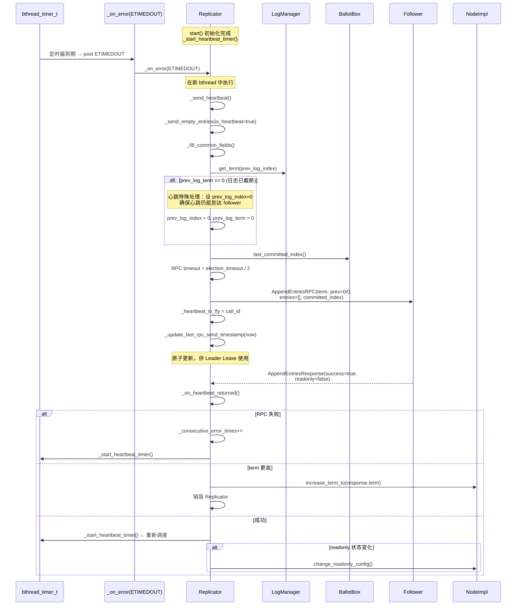
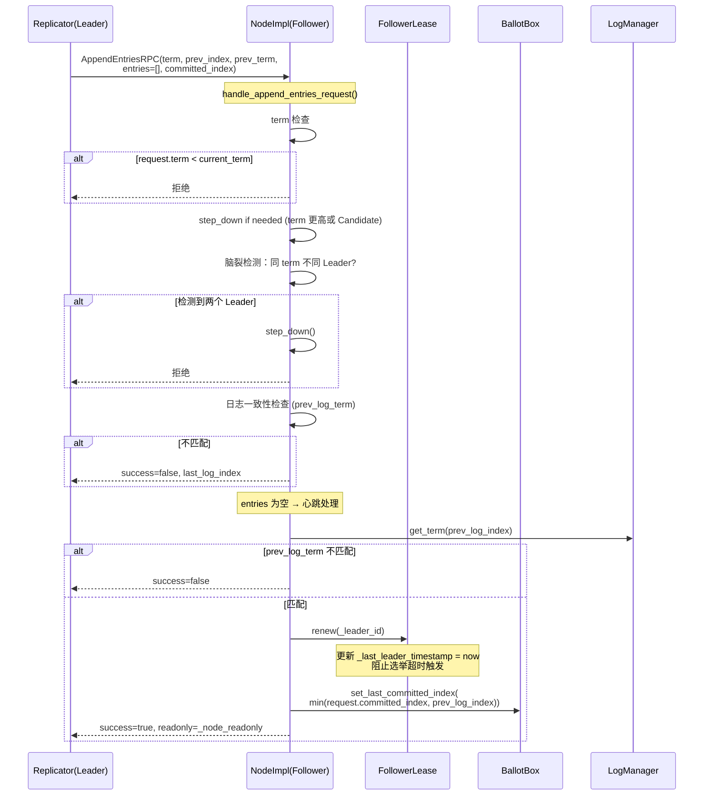
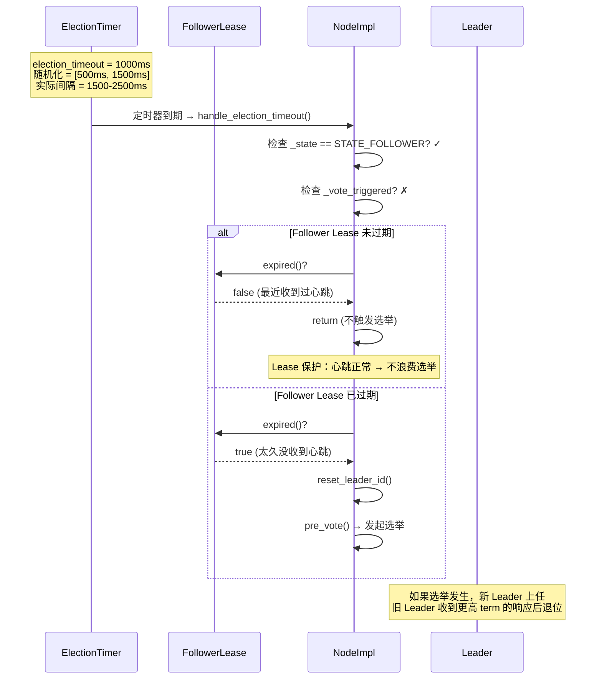
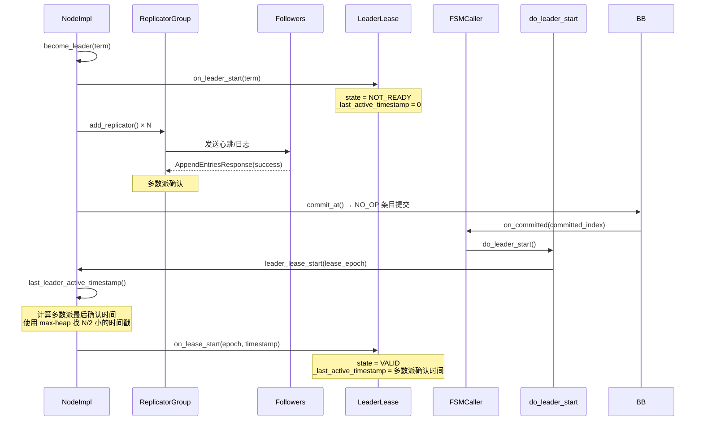
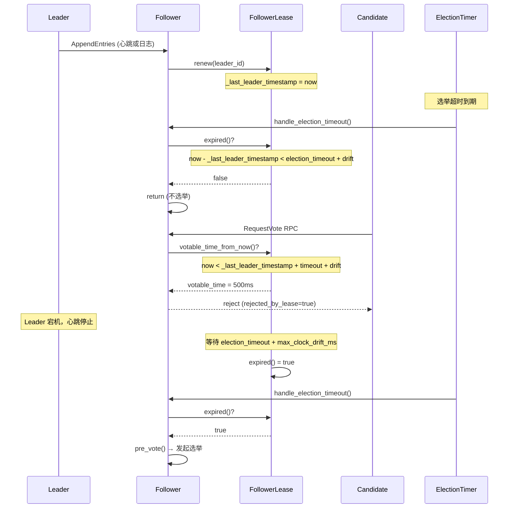
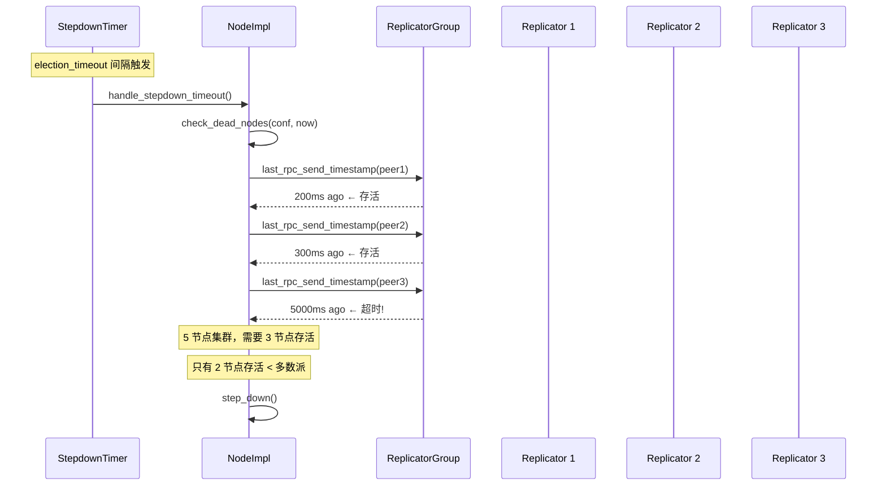
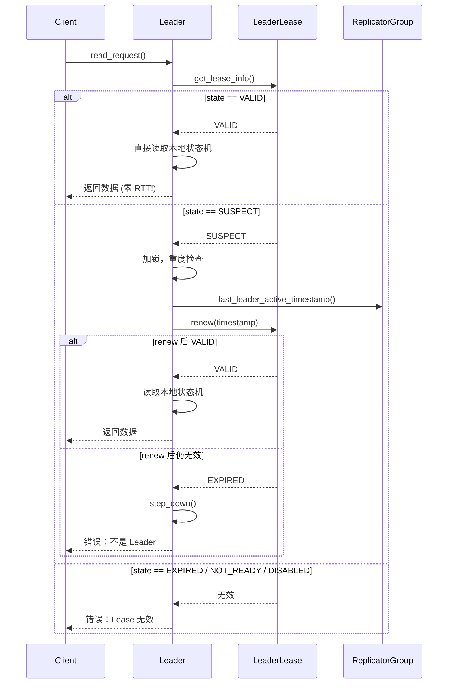

# braft 心跳机制分析

## 目录

1. [概述](#1-概述)
2. [定时器体系](#2-定时器体系)
3. [心跳发送流程（Leader 端）](#3-心跳发送流程leader-端)
4. [心跳接收流程（Follower 端）](#4-心跳接收流程follower-端)
5. [心跳 vs 探测（Probe）](#5-心跳-vs-探测probe)
6. [选举超时与心跳的配合](#6-选举超时与心跳的配合)
7. [Leader Lease 机制](#7-leader-lease-机制)
8. [Follower Lease 机制](#8-follower-lease-机制)
9. [Stepdown Timer — 死节点检测](#9-stepdown-timer--死节点检测)
10. [Readonly 模式与心跳](#10-readonly-模式与心跳)
11. [心跳丢失与异常处理](#11-心跳丢失与异常处理)
12. [Lease Read — 基于 Lease 的线性读](#12-lease-read--基于-lease-的线性读)
13. [参数汇总](#13-参数汇总)
14. [与其他实现对比](#14-与其他实现对比)
15. [源码索引](#15-源码索引)

---

## 1. 概述

braft 的心跳机制是 Leader 维持集群稳定性的核心基础设施，同时支撑了选举超时抑制、Leader Lease 线性读、死节点检测等多个上层功能。核心设计特点：

1. **双层定时器**：Replicator 心跳定时器（发送端）+ Node 选举定时器（接收端）
2. **动态心跳间隔**：`election_timeout_ms / raft_election_heartbeat_factor`，运行时可调
3. **心跳与日志复制共享 RPC**：心跳就是空的 AppendEntries，统一通信通道
4. **Lease 双向保护**：Leader Lease 保护读一致性，Follower Lease 阻止无效选举
5. **SUSPECT 状态懒续约**：Leader Lease 过期后不立即失效，先做重度检查再决定

---

## 2. 定时器体系

```
┌─────────────────────────────────────────────────────────────────┐
│  Leader (NodeImpl)                                              │
│                                                                 │
│  ┌──────────────┐  ┌──────────────┐  ┌──────────────┐          │
│  │ Replicator 1 │  │ Replicator 2 │  │ Replicator N │  ...     │
│  │              │  │              │  │              │          │
│  │ heartbeat_   │  │ heartbeat_   │  │ heartbeat_   │          │
│  │ timer_t      │  │ timer_t      │  │ timer_t      │          │
│  │ (100ms 间隔) │  │ (100ms 间隔) │  │ (100ms 间隔) │          │
│  └──────┬───────┘  └──────┬───────┘  └──────┬───────┘          │
│         │                 │                 │                   │
│         ▼                 ▼                 ▼                   │
│  AppendEntries()    AppendEntries()    AppendEntries()          │
│  (空 RPC / 带日志)  (空 RPC / 带日志)  (空 RPC / 带日志)       │
│                                                                 │
│  ┌──────────────────────────────────────┐                       │
│  │ StepdownTimer                        │                       │
│  │ (检测多数派 follower 是否存活)         │                       │
│  └──────────────────────────────────────┘                       │
└─────────────────────────────────────────────────────────────────┘
                          │ RPC
                          ▼
┌─────────────────────────────────────────────────────────────────┐
│  Follower (NodeImpl)                                            │
│                                                                 │
│  ┌──────────────────────────────────────┐                       │
│  │ ElectionTimer                        │                       │
│  │ (1000ms + 随机化 500ms)              │                       │
│  │ 如果 follower_lease 未过期 → 不选举   │                       │
│  └──────────────────────────────────────┘                       │
│                                                                 │
│  FollowerLease                                                   │
│  每次收到 AppendEntries → renew()                               │
└─────────────────────────────────────────────────────────────────┘
```

### 三类定时器

| 定时器 | 位置 | 间隔 | 作用 |
|--------|------|------|------|
| Heartbeat Timer | Replicator（Leader 端） | `election_timeout / factor`（默认 100ms） | 周期发送心跳 |
| Election Timer | Node（Follower/Candidate 端） | `election_timeout + random`（1500-2500ms） | 触发选举 |
| Stepdown Timer | Node（Leader 端） | `election_timeout`（1000ms） | 检测死节点 |

### RepeatedTimerTask 基类

```cpp
// repeated_timer_task.h
class RepeatedTimerTask {
    void schedule();   // _next_duetime = now + adjust_timeout_ms(timeout_ms)
    void start();      // _running = true, schedule()
    void stop();       // _stopped = true, delete timer
    void reset();      // 重新调度
};
```

- **ElectionTimer** 继承后重写 `adjust_timeout_ms()` → `random_timeout(timeout_ms)` 加随机化
- **VoteTimer** 同样加随机化
- **StepdownTimer** 无随机化

---

## 3. 心跳发送流程（Leader 端）



### 3.1 心跳定时器触发链

```
_start_heartbeat_timer(start_time_us)
  │
  ▼
bthread_timer_add(&_heartbeat_timer, due_time, _on_timedout)
  │
  ▼  (到期)
_on_timedout(arg)  →  bthread_id_error(id, ETIMEDOUT)
  │
  ▼
_on_error(ETIMEDOUT)  →  bthread_start_urgent(_send_heartbeat)
  │
  ▼
_send_heartbeat()  →  _send_empty_entries(true)
  │
  ▼
RaftService_Stub::append_entries(&cntl, &request, &response, _on_heartbeat_returned)
```

### 3.2 Replicator::start() 初始化

```cpp
// replicator.cpp:109-152
int Replicator::start(const ReplicatorOptions& options) {
    _next_index = log_manager->last_log_index() + 1;  // Raft 优化
    bthread_id_create(&_id, this, _on_error);          // bthread_id + error 回调
    _update_last_rpc_send_timestamp(butil::monotonic_time_ms());
    _start_heartbeat_timer(butil::gettimeofday_us());  // 启动心跳定时器
    _send_empty_entries(false);  // 首次发送探测（非心跳）
}
```

**注意**：首次发送的是 **探测**（`is_heartbeat=false`），不是心跳。探测使用 `_on_rpc_returned` 回调，会验证 follower 的日志匹配状态。心跳使用 `_on_heartbeat_returned` 回调，只做 lease 维护。

---

## 4. 心跳接收流程（Follower 端）



### 4.1 handle_append_entries_request() 心跳相关逻辑

```cpp
// node.cpp:2387-2584
void NodeImpl::handle_append_entries_request(...) {
    // 1. Term 检查
    if (request->term() < _current_term) { respond(false); return; }

    // 2. 更高 term → 退为 follower
    if (request->term() > _current_term) { step_down(request->term()); }

    // 3. 脑裂检测
    if (_leader_id != server_id && _state == STATE_LEADER) {
        step_down(_current_term);  // 两个 Leader 同时退位
    }
    _leader_id = server_id;

    // 4. 续约 Follower Lease（关键！）
    _follower_lease.renew(_leader_id);

    // 5. 日志一致性检查
    int64_t local_prev_term = _log_manager->get_term(request->prev_log_index());
    if (local_prev_term != request->prev_log_term()) {
        respond(false, last_log_index);
        return;
    }

    // 6. 空心跳 → 更新 committed_index + 返回 readonly 状态
    if (request->entries_size() == 0) {
        int64_t ci = std::min(request->committed_index(), request->prev_log_index());
        _ballot_box->set_last_committed_index(ci);
        response->set_readonly(_node_readonly);
    }
}
```

---

## 5. 心跳 vs 探测（Probe）

两者都是空的 AppendEntries RPC，但行为完全不同：

| 特性 | 心跳 (`is_heartbeat=true`) | 探测 (`is_heartbeat=false`) |
|------|---------------------------|---------------------------|
| 触发 | 心跳定时器（ETIMEDOUT） | 冲突回退 / 初始化 / Block 超时 |
| 回调 | `_on_heartbeat_returned` | `_on_rpc_returned` |
| RPC 超时 | `election_timeout / 2` | 无（使用 channel 级别 -1） |
| 在途追踪 | `_heartbeat_in_fly` | `_append_entries_in_fly` deque |
| 状态变更 | 无 | `_st.st = APPENDING_ENTRIES` |
| 计数器 | `_heartbeat_counter++` | `_append_entries_counter++` |
| 日志截断处理 | 设 `prev_log_index=0` | 触发 InstallSnapshot |
| 响应处理 | 只更新时间戳 + 检查 readonly | commit_at + 推进 next_index + 发送下一批 |

### 5.1 为什么心跳在日志截断时设 prev=0

```cpp
// replicator.cpp:527-554
if (prev_log_term == 0 && prev_log_index != 0) {
    if (!is_heartbeat) {
        return -1;  // 探测 → InstallSnapshot
    } else {
        prev_log_index = 0;  // 心跳 → 放宽条件
    }
}
```

心跳的目的是维持 Leader Lease 和更新 committed_index。即使日志已被快照截断，心跳仍然需要到达 Follower。设 `prev_log_index=0` 使得 Follower 跳过日志一致性检查，直接处理心跳。

---

## 6. 选举超时与心跳的配合



### 6.1 handle_election_timeout() 关键逻辑

```cpp
// node.cpp:1065-1090
void NodeImpl::handle_election_timeout() {
    if (_state != STATE_FOLLOWER) return;  // 只有 follower 触发选举

    // Lease 未过期 → 不选举（关键！）
    if (!_vote_triggered && !_follower_lease.expired()) {
        return;
    }

    _vote_triggered = false;
    reset_leader_id(empty_id, status);
    pre_vote(&lck, triggered);
}
```

### 6.2 时间线关系

```
时间线 ─────────────────────────────────────────────────────►

Leader 心跳间隔:     |---100ms---|---100ms---|---100ms---|
                     H1         H2         H3         H4

Follower Lease 有效:  |<<<<<<<<<<<<<<<<<<<<<<<<<|
                     renew      renew      renew
                     (H1 到达)  (H2 到达)  (H3 到达)

选举超时窗口:                                    |---随机化---|
                                                (H3 后很久没收到心跳)

正常情况: 心跳间隔(100ms) << Lease 窗口(1000ms+drift)
  → 选举永远不会被触发

Leader 宕机: 心跳停止
  → Lease 在 ~1000ms + max_clock_drift_ms 后过期
  → 选举超时在 ~1500-2500ms 后触发
  → 间隔确保不会因网络抖动误触发选举
```

---

## 7. Leader Lease 机制

### 7.1 Lease 状态

```
                    on_leader_start()
                        │
                        ▼
  [DISABLED] ◄── flag=false ──► [NOT_READY]
                                      │
                                  on_lease_start()
                                  (首条日志提交)
                                      │
                                      ▼
                                  [VALID]
                                      │
                              monotonic_time 超过
                              _last_active + timeout
                                      │
                                      ▼
                                  [SUSPECT]
                                      │
                              get_lease_info() 重度检查
                                      │
                         ┌────────────┴────────────┐
                         ▼                         ▼
                    [VALID]                   [EXPIRED]
                 (renew 成功)              (renew 失败 → step_down)

                  on_leader_stop()
                        │
                        ▼
                    [EXPIRED]
```

### 7.2 LeaderLease 类

```cpp
// lease.h:24-62
class LeaderLease {
    int _election_timeout_ms;      // Lease 有效窗口
    int64_t _last_active_timestamp; // 多数派最后确认时间
    int64_t _term;                  // 当前任期
    int64_t _lease_epoch;           // 每次 leader_start 递增（防 ABA）

    LeaseState get_lease_info();    // 快速判断状态
    void on_leader_start(term);     // _term = term, epoch++, timestamp=0
    void on_leader_stop();          // _term=0, timestamp=0
    void on_lease_start(epoch, ts); // timestamp = ts (首次提交)
    void renew(timestamp);          // timestamp = timestamp
};
```

### 7.3 Lease 建立时序



### 7.4 last_leader_active_timestamp() — 多数派确认时间

```cpp
// node.cpp:3610-3671
int64_t NodeImpl::last_leader_active_timestamp(const Configuration& conf) {
    // 对每个 peer（除自身），获取 ReplicatorStatus::last_rpc_send_timestamp
    // 使用 size=N/2 的 max-heap 找到第 N/2 小的时间戳
    // 该时间戳代表多数派最后确认 Leader 的时间
    //
    // 示例：5 节点集群
    //   peer1: 100ms, peer2: 80ms, peer3: 90ms, peer4: 120ms
    //   max-heap(size=2): [90, 100] → 第 2 小 = 100ms
    //   含自身 → 多数派(3/5)在 100ms 前确认了 Leader
}
```

### 7.5 Lease 懒续约

```cpp
// node.cpp:3428-3470
void NodeImpl::get_leader_lease_status(LeaderLeaseStatus* status) {
    // 快速路径（无锁）
    auto info = _leader_lease.get_lease_info();
    if (info.state == LEASE_VALID) return;     // 仍然有效
    if (info.state == LEASE_EXPIRED) return;   // 已过期
    if (info.state == LEASE_NOT_READY) return; // 尚未建立
    // SUSPECT → 需要重度检查

    // 重度路径（加锁）
    int64_t last_active = last_leader_active_timestamp();
    _leader_lease.renew(last_active);

    info = _leader_lease.get_lease_info();
    if (info.state != LEASE_VALID && info.state != LEASE_DISABLED) {
        step_down();  // Lease 确实失效 → 退位
    }
}
```

**SUSPECT → VALID**：如果心跳恢复正常，renew 后回到 VALID。
**SUSPECT → EXPIRED**：如果多数派确实超时，Leader 主动退位。

---

## 8. Follower Lease 机制

### 8.1 FollowerLease 类

```cpp
// lease.h:64-86
class FollowerLease {
    int _election_timeout_ms;      // 基础超时
    int _max_clock_drift_ms;       // 时钟漂移容忍
    PeerId _last_leader;           // 上次续约的 Leader
    int64_t _last_leader_timestamp; // 上次续约时间

    void renew(leader_id);                          // 更新 leader + timestamp
    bool expired();                                  // now - timestamp >= timeout + drift
    int64_t votable_time_from_now();                // 距离可投票还需多少 ms
    void expire();                                   // 立即过期
    void reset();                                    // 清空状态
};
```

### 8.2 Follower Lease 三个作用

```
┌──────────────────────────────────────────────────────────┐
│  作用 1: 抑制选举超时                                     │
│  handle_election_timeout():                              │
│    if (!_follower_lease.expired()) return;  ← 不选举     │
├──────────────────────────────────────────────────────────┤
│  作用 2: 拒绝投票请求                                     │
│  handle_pre_vote_request() / handle_request_vote():       │
│    votable_time = _follower_lease.votable_time_from_now() │
│    if (votable_time > 0) reject (rejected_by_lease=true)  │
├──────────────────────────────────────────────────────────┤
│  作用 3: 延迟自身投票（grant_self）                        │
│  grant_self():                                          │
│    wait_ms = _follower_lease.votable_time_from_now()     │
│    延迟 wait_ms 后才给自身投票                             │
└──────────────────────────────────────────────────────────┘
```

### 8.3 Lease 续约与过期



### 8.4 Lease 过期时间计算

```
Follower Lease 有效期 = _election_timeout_ms + _max_clock_drift_ms

默认值:
  _election_timeout_ms = 1000ms
  _max_clock_drift_ms = 0ms (用户可配置)
  有效期 = 1000ms

Witness 节点:
  _election_timeout_ms = 2000ms (2 倍)
  有效期 = 2000ms

votable_time_from_now():
  votable_timestamp = _last_leader_timestamp + _election_timeout_ms + _max_clock_drift_ms
  return max(0, votable_timestamp - now)
```

---

## 9. Stepdown Timer — 死节点检测

### 9.1 检测机制



### 9.2 check_dead_nodes()

```cpp
// node.cpp:794-822
void NodeImpl::check_dead_nodes(const Configuration& conf, int64_t now_ms) {
    int alive_count = 1;  // 自身算一个
    for (auto& peer : conf) {
        if (peer == _server_id) continue;
        int64_t last_ts = _replicator_group.last_rpc_send_timestamp(peer);
        if (now_ms - last_ts <= _options.election_timeout_ms) {
            ++alive_count;  // 在选举超时内收到过响应 → 存活
        }
    }
    if (alive_count < majority) {
        LOG(WARNING) << "Step down as too many dead nodes";
        step_down(_current_term);
    }
}
```

---

## 10. Readonly 模式与心跳

### 10.1 Readonly 状态传播

```
Leader 每次收到心跳响应时检查 readonly 状态变化:

Follower ──► Leader:
  AppendEntriesResponse(success=true, readonly=true)

Leader _on_heartbeat_returned():
  if (readonly != _last_known_readonly[peer]) {
      node_impl->change_readonly_config(term, peer, readonly);
  }
```

### 10.2 Replicator 对 Readonly 条目的处理

```cpp
// replicator.cpp:611-617
if (_readonly_index != 0 && log_index > _readonly_index) {
    if (type == ENTRY_TYPE_DATA) {
        return EREADONLY;  // 阻止用户数据
    }
    // ENTRY_TYPE_CONFIGURATION 仍然允许
}
```

---

## 11. 心跳丢失与异常处理

### 11.1 心跳 RPC 失败

```
Replicator._on_heartbeat_returned():
  cntl->Failed() == true
    │
    ├── _consecutive_error_times++ (每 10 次打印警告)
    ├── _start_heartbeat_timer() (重新调度下一次心跳)
    └── return (不进入 BLOCKING，继续尝试)
```

**注意**：心跳失败不会进入 BLOCKING 状态。BLOCKING 只在 AppendEntries（非心跳）失败时触发。心跳持续发送，确保即使 follower 临时不可达，恢复后能快速续约。

### 11.2 Leader 收到更高 term

```
Replicator._on_heartbeat_returned():
  response->term() > _options.term
    │
    ├── notify caught-up closure (EPERM)
    ├── node_impl->increase_term_to(response->term())
    └── 销毁 Replicator (bthread_id_error ESTOP)
```

### 11.3 心跳超时（RPC 级别）

```
心跳 RPC timeout = election_timeout_ms / 2 (默认 500ms)

如果 500ms 内 Follower 未响应:
  → cntl->Failed() == true
  → 视为 RPC 失败，重新调度下一次心跳
  → 不会触发 Leader 退位（可能只是网络抖动）
```

### 11.4 多次心跳失败后的连锁反应

```
1. 心跳连续失败 → _consecutive_error_times 累加
2. StepdownTimer 检测到 last_rpc_send_timestamp 过旧
3. 多数派不满足 → Leader 主动 step_down
4. Follower 的 Follower Lease 过期
5. Follower 触发选举超时 → pre_vote → 新 Leader 产生
```

---

## 12. Lease Read — 基于 Lease 的线性读

### 12.1 线性读的三种方式

| 方式 | 延迟 | 一致性保证 | 实现复杂度 |
|------|------|-----------|-----------|
| ReadIndex (Raft 标准) | 一次 RTT | 强一致性 | 中等 |
| Lease Read | 零 RTT | 基于 Lease 的线性一致性 | 低 |
| Learner Read | 一次 RTT | 最终一致性 | 低 |

### 12.2 Lease Read 流程



### 12.3 Lease Read 安全条件

```
Lease Read 安全需要满足:
  1. raft_enable_leader_lease = true (所有节点)
  2. Leader Lease 状态为 VALID
  3. 多数派在 election_timeout_ms 内确认过 Leader
  4. 时钟漂移 < max_clock_drift_ms
```

### 12.4 Lease Read vs ReadIndex

```
Lease Read (braft 扩展):
  Client → Leader: read
  Leader: check lease → valid → read local → return
  延迟: ~0 RTT (仅需内存检查)

ReadIndex (Raft 标准):
  Client → Leader: read
  Leader → Followers: AppendEntries(heartbeat)
  Followers → Leader: response
  Leader: committed_index ≥ read_index → read local → return
  延迟: 1 RTT (等待多数派确认)

权衡:
  Lease Read 更快，但依赖时钟同步
  ReadIndex 更安全，不依赖时钟
```

---

## 13. 参数汇总

| 参数 | 默认值 | 说明 | 代码位置 |
|------|--------|------|----------|
| `election_timeout_ms` | 1000ms | 选举超时基准 | NodeOptions |
| `raft_election_heartbeat_factor` | 10 | 心跳间隔 = election_timeout / factor | node.cpp:133 |
| 心跳间隔 | 100ms | `max(1000/10, 10)` | node.cpp:133 |
| 心跳 RPC 超时 | 500ms | `election_timeout / 2` | replicator.cpp:570 |
| 选举定时器间隔 | 1500-2500ms | `election_timeout + [0, election_timeout)` | ElectionTimer::adjust |
| Leader Lease 有效期 | 1000ms | `election_timeout_ms` | lease.cpp:28 |
| Follower Lease 有效期 | 1000ms | `election_timeout_ms + max_clock_drift_ms` | lease.cpp:94 |
| Witness Follower Lease | 2000ms | `2 * election_timeout_ms + drift` | node.cpp:544 |
| `raft_enable_leader_lease` | false | Leader Lease 功能开关 | lease.cpp:23 |
| `max_clock_drift_ms` | 0ms | 时钟漂移容忍度 | NodeOptions |
| `raft_retry_replicate_interval_ms` | 1000ms | BLOCKING 错误重试间隔 | gflag |

---

## 14. 与其他实现对比

| 特性 | braft | etcd/raft | TiKV (raft-rs) | CDS |
|------|-------|-----------|-----------------|-----|
| 心跳 RPC | 空 AppendEntries | MsgHeartbeat | Message::Tick | Raft 心跳 |
| 心跳间隔 | 动态 `timeout/factor` | `heartbeat_tick`（约 50-100ms） | `election_timeout/4`（~750ms） | 配置化 |
| 选举超时随机化 | `[0, timeout)` | `timeout ± jitter` | `timeout ± 150ms` | 无 |
| Leader Lease | 支持（SUSPECT 懒续约） | 不支持 | 支持（Lease based read） | Leader Lease |
| Follower Lease | 支持（阻止选举+投票） | 不支持 | 不支持 | 不支持 |
| 死节点检测 | StepdownTimer | 自动超时 | 自动超时 | 无 |
| 线性读方式 | ReadIndex + Lease Read | ReadIndex + Lease Read | ReadIndex + Lease Read | ReadIndex |
| Readonly 传播 | 心跳响应携带 | 无 | 无 | 无 |
| 心跳与日志复制 | 共用 AppendEntries RPC | 独立消息类型 | 独立消息 | 共用 Raft |

---

## 15. 源码索引

### 核心头文件

| 文件 | 核心内容 |
|------|----------|
| `src/braft/lease.h` | `LeaderLease` 类、`FollowerLease` 类、LeaseState 枚举 |
| `src/braft/replicator.h` | `Replicator` 心跳相关成员、`ReplicatorStatus` |
| `src/braft/node.h` | `ElectionTimer`、`VoteTimer`、`StepdownTimer` |
| `src/braft/repeated_timer_task.h` | `RepeatedTimerTask` 基类 |

### 核心实现文件

| 文件 | 行号 | 核心函数 |
|------|------|----------|
| `src/braft/replicator.cpp` | 109-152 | `Replicator::start()` — 初始化心跳定时器 |
| `src/braft/replicator.cpp` | 221-239 | `_on_block_timedout()` — Block 超时触发探测 |
| `src/braft/replicator.cpp` | 242-277 | `_block()` — 阻塞状态管理 |
| `src/braft/replicator.cpp` | 279-357 | `_on_heartbeat_returned()` — 心跳响应处理 |
| `src/braft/replicator.cpp` | 527-554 | `_fill_common_fields()` — 公共字段填充（日志截断处理） |
| `src/braft/replicator.cpp` | 556-596 | `_send_empty_entries()` — 心跳 vs 探测 |
| `src/braft/replicator.cpp` | 716-755 | `_continue_sending()` — Block 后恢复 |
| `src/braft/replicator.cpp` | 966-969 | `_on_timedout()` — 定时器回调 |
| `src/braft/replicator.cpp` | 971-979 | `_start_heartbeat_timer()` — 启动心跳定时器 |
| `src/braft/replicator.cpp` | 981-991 | `_send_heartbeat()` — 发送心跳 |
| `src/braft/replicator.cpp` | 993-1026 | `_on_error()` — ETIMEDOUT 触发心跳 |
| `src/braft/lease.cpp` | 23-92 | `LeaderLease` 全部方法 |
| `src/braft/lease.cpp` | 94-147 | `FollowerLease` 全部方法 |
| `src/braft/node.cpp` | 133-139 | `heartbeat_timeout()` — 动态心跳间隔计算 |
| `src/braft/node.cpp` | 542-546 | Lease 初始化（Leader + Follower） |
| `src/braft/node.cpp` | 794-822 | `check_dead_nodes()` — Stepdown 死节点检测 |
| `src/braft/node.cpp` | 825-841 | `handle_stepdown_timeout()` |
| `src/braft/node.cpp` | 1065-1090 | `handle_election_timeout()` — 选举超时 + Lease 检查 |
| `src/braft/node.cpp` | 1793-1875 | `step_down()` — 定时器清理 |
| `src/braft/node.cpp` | 1935-1975 | `become_leader()` — 启动 StepdownTimer |
| `src/braft/node.cpp` | 2387-2584 | `handle_append_entries_request()` — Follower 心跳处理 |
| `src/braft/node.cpp` | 3426-3470 | `is_leader_lease_valid()` / `get_leader_lease_status()` |
| `src/braft/node.cpp` | 3602-3671 | `last_leader_active_timestamp()` — 多数派确认时间计算 |
| `src/braft/fsm_caller.cpp` | 460-463 | `do_leader_start()` — Lease 建立 |
| `src/braft/repeated_timer_task.cpp` | 127-135 | `schedule()` — 定时器调度 |
| `src/braft/repeated_timer_task.cpp` | 137-158 | `reset()` — 重置定时器 |
