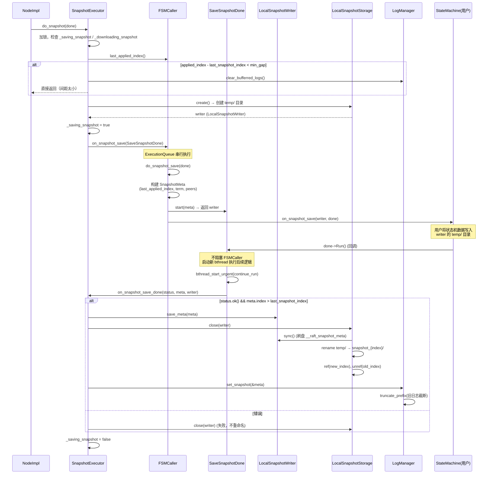
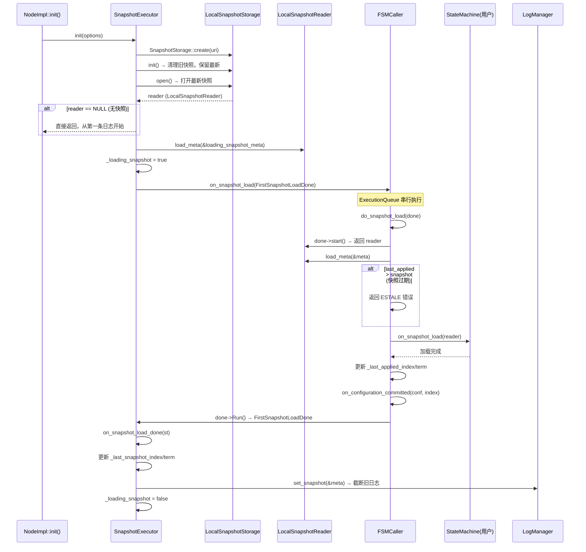
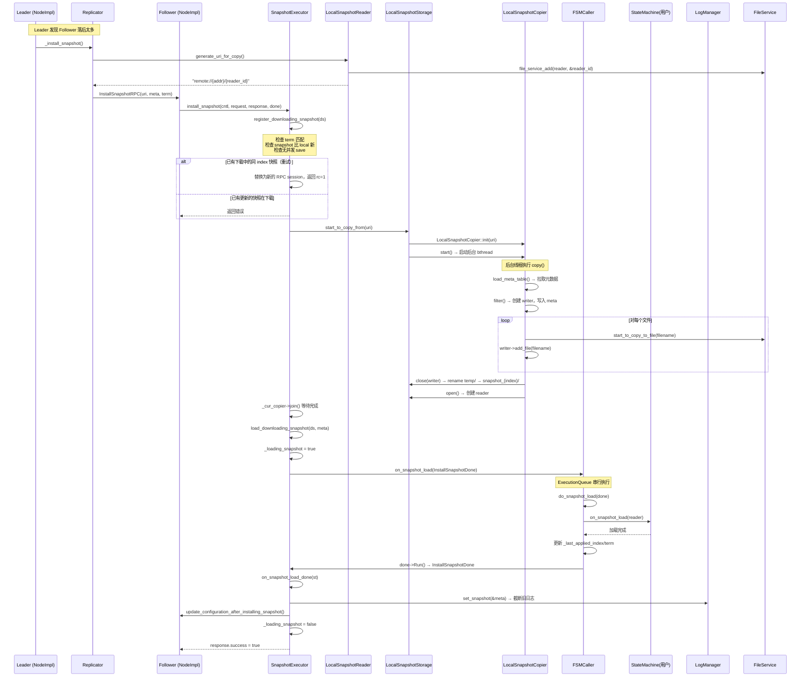
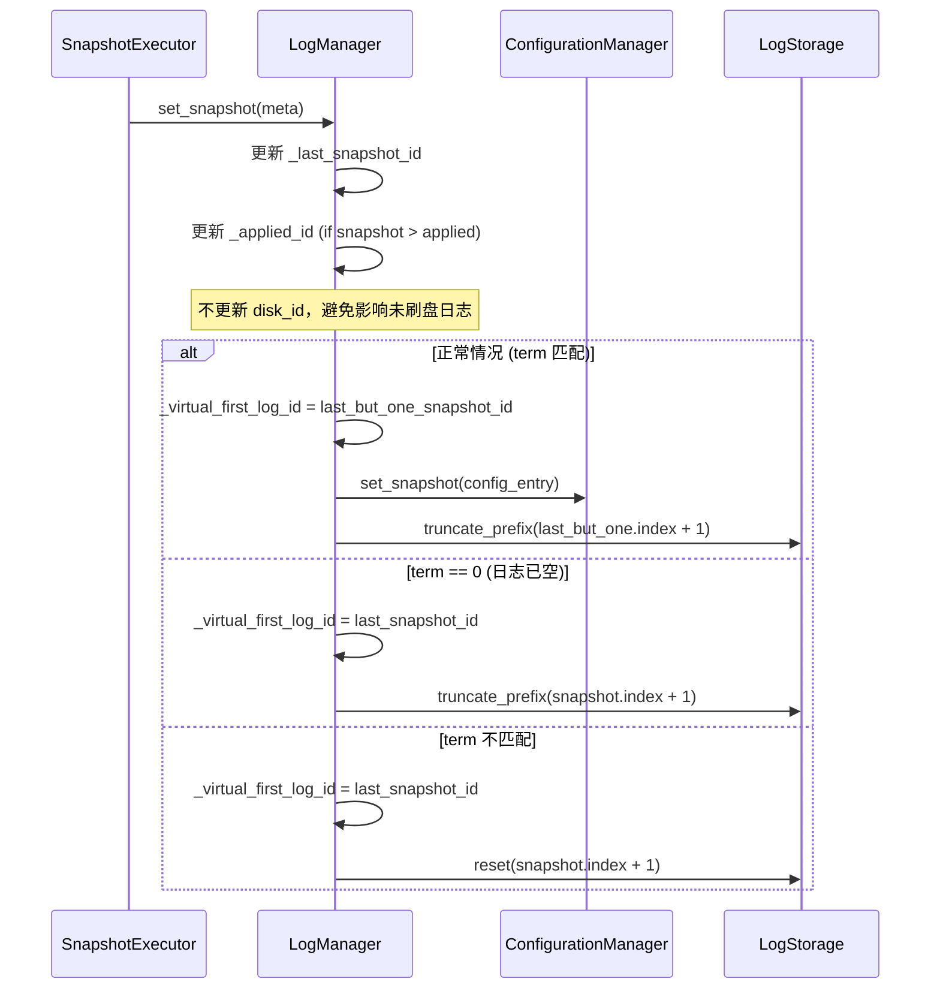
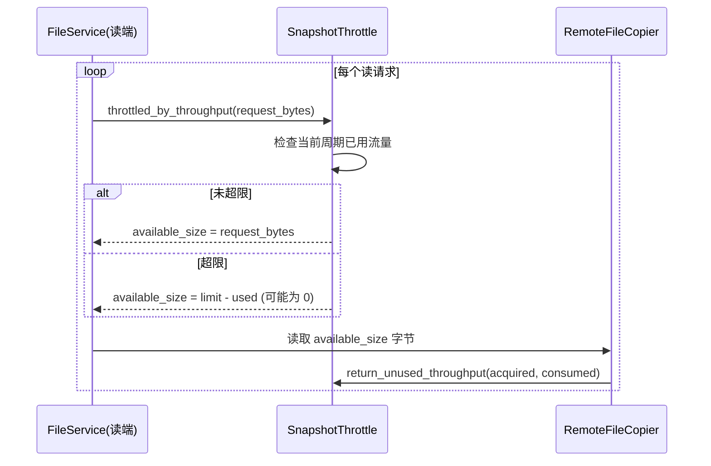

# braft 快照（Snapshot）实现分析

## 目录

1. [概述](#1-概述)
2. [核心类层次结构](#2-核心类层次结构)
3. [快照元数据格式](#3-快照元数据格式)
4. [存储目录布局](#4-存储目录布局)
5. [快照保存流程（Save）](#5-快照保存流程save)
6. [快照加载流程（Load — 启动）](#6-快照加载流程load--启动)
7. [InstallSnapshot 远程安装流程](#7-installsnapshot-远程安装流程)
8. [LogManager 与日志截断](#8-logmanager-与日志截断)
9. [快照引用计数与 GC](#9-快照引用计数与-gc)
10. [SnapshotThrottle 流量控制](#10-snapshotthrottle-流量控制)
11. [filter_before_copy_remote 优化](#11-filter_before_copy_remote-优化)
12. [关键错误处理](#12-关键错误处理)
13. [与其他实现对比](#13-与其他实现对比)
14. [源码索引](#14-源码索引)

---

## 1. 概述

braft 的快照机制是 Raft 一致性协议的关键组件，主要解决两个问题：

- **日志压缩**：Raft 日志无限增长，需要通过快照来截断已提交的历史日志
- **成员追赶**：新加入的节点或落后过远的节点无法通过 AppendEntries 追赶，需要通过 InstallSnapshot 直接安装全量快照

braft 快照的核心设计特点：

1. **用户驱动的状态机快照**：快照内容由用户定义的 StateMachine（FSM）产生，braft 只负责触发和协调
2. **原子写入 + 重命名**：先写入临时目录 `temp/`，完成后原子重命名为 `snapshot_{index}`
3. **基于 URI 的远程拷贝**：Leader 通过 `remote://addr/reader_id` URI 让 Follower 拉取快照
4. **SaveSnapshotDone 异步回调**：避免阻塞 FSMCaller 的 apply 串行队列
5. **双重互斥保护**：`_saving_snapshot` 和 `_loading_snapshot` 互斥，同一时刻只允许一个快照操作

---

## 2. 核心类层次结构

```
SnapshotStorage (storage.h:299)        -- 抽象接口
  └── LocalSnapshotStorage (snapshot.h:181)  -- 本地文件系统实现
        ├── LocalSnapshotWriter (snapshot.h:61)   -- 写入器
        │     └── LocalSnapshotMetaTable           -- 元数据管理
        ├── LocalSnapshotReader (snapshot.h:96)    -- 读取器
        │     └── SnapshotFileReader                -- 文件读取（带限流）
        └── LocalSnapshotCopier (snapshot.h:146)   -- 远程拷贝器
              └── RemoteFileCopier                  -- 底层文件传输

SnapshotExecutor (snapshot_executor.h:53)  -- 快照执行协调器
  ├── SaveSnapshotDone       -- 保存完成回调
  ├── InstallSnapshotDone    -- 安装完成回调
  └── FirstSnapshotLoadDone  -- 首次启动加载回调

FSMCaller (fsm_caller.h)     -- 状态机调用者
  ├── do_snapshot_save()     -- 在 ExecutionQueue 中串行执行
  └── do_snapshot_load()     -- 在 ExecutionQueue 中串行执行

SnapshotThrottle (snapshot_throttle.h:26)        -- 抽象限流接口
  └── ThroughputSnapshotThrottle (snapshot_throttle.h:53)  -- 吞吐量限流
```

### SnapshotStorage 接口定义

```cpp
// storage.h:299-361
class SnapshotStorage {
    virtual int init() = 0;
    virtual SnapshotWriter* create() = 0;        // 创建写入器
    virtual int close(SnapshotWriter* writer) = 0; // 关闭写入器（触发重命名）
    virtual SnapshotReader* open() = 0;           // 打开最新快照
    virtual int close(SnapshotReader* reader) = 0;
    virtual SnapshotCopier* start_to_copy_from(const std::string& uri) = 0;
    virtual SnapshotStorage* new_instance(const std::string& uri) const = 0;
};
```

---

## 3. 快照元数据格式

### SnapshotMeta（raft.proto:60-65）

快照元数据是快照的核心描述信息，包含状态机在该 index 处的完整状态：

```protobuf
message SnapshotMeta {
    required int64 last_included_index = 1;  // 快照包含的最后一条日志 index
    required int64 last_included_term = 2;   // 快照包含的最后一条日志 term
    repeated string peers = 3;               // 当前进度成员列表
    repeated string old_peers = 4;           // 联合共识阶段的旧成员列表（通常为空）
}
```

### InstallSnapshotRequest（raft.proto:67-74）

```protobuf
message InstallSnapshotRequest {
    required string group_id = 1;
    required string server_id = 2;
    required string peer_id = 3;
    required int64 term = 4;
    required SnapshotMeta meta = 5;
    required string uri = 6;              // 快照拉取 URI，格式: remote://addr/reader_id
}
```

### LocalSnapshotPbMeta（本地文件元数据）

序列化到 `__raft_snapshot_meta` 文件中，包含：
- `SnapshotMeta meta` — Raft 层元数据
- `repeated File` — 快照文件列表，每个文件包含 `name` 和 `LocalFileMeta`（含 checksum、source 等信息）

---

## 4. 存储目录布局

```
{snapshot_path}/
  ├── temp/                          # 正在创建的快照（临时目录）
  │   ├── __raft_snapshot_meta       # 元数据文件
  │   ├── data_file_1                # 用户状态机数据文件
  │   └── data_file_2                # ...
  └── snapshot_00000000000000000123/  # 已完成的快照（原子重命名）
      ├── __raft_snapshot_meta
      ├── data_file_1
      └── data_file_2
```

**关键约定**：

- 目录命名格式：`snapshot_%020PRId64`（20 位零填充 index）
- 元数据文件名：`__raft_snapshot_meta`（固定常量）
- 同一时刻只保留最新的一个快照目录（旧的在 `init()` 时清理）
- `temp/` 目录在每次创建写入器时清空

**init() 时的清理逻辑**（snapshot.cpp:448-511）：

1. 删除 `temp/` 目录
2. 扫描所有 `snapshot_*` 目录，按 index 排序
3. 保留 index 最大的一个，删除其余所有旧快照

---

## 5. 快照保存流程（Save）

快照保存由 `NodeImpl::snapshot()` 或定时触发，完整流程如下：



### 5.1 SnapshotExecutor::do_snapshot() 关键逻辑

```cpp
// snapshot_executor.cpp:114-187
void SnapshotExecutor::do_snapshot(Closure* done) {
    std::unique_lock<raft_mutex_t> lck(_mutex);
    // 1. 前置检查
    if (_stopped) return;
    if (_downloading_snapshot.load(...)) return;  // 正在安装快照
    if (_saving_snapshot) return;                  // 正在保存快照

    // 2. 检查间距（默认 min_gap = 1）
    int64_t gap = fsm_applied_index - last_snapshot_index;
    if (gap < FLAGS_raft_do_snapshot_min_index_gap) {
        log_manager->clear_bufferred_logs();  // 尝试清理缓冲日志
        return;
    }

    // 3. 创建写入器
    SnapshotWriter* writer = _snapshot_storage->create();
    _saving_snapshot = true;

    // 4. 通过 FSMCaller 投递到 ExecutionQueue 串行执行
    SaveSnapshotDone* done = new SaveSnapshotDone(this, writer, user_done);
    _fsm_caller->on_snapshot_save(done);
}
```

### 5.2 FSMCaller::do_snapshot_save()

```cpp
// fsm_caller.cpp:328-358
void FSMCaller::do_snapshot_save(SaveSnapshotClosure* done) {
    // 1. 构建 SnapshotMeta
    SnapshotMeta meta;
    meta.set_last_included_index(_last_applied_index);
    meta.set_last_included_term(_last_applied_term);

    // 2. 获取当前配置
    ConfigurationEntry conf_entry;
    _log_manager->get_configuration(last_applied_index, &conf_entry);
    // ... 填充 peers 和 old_peers

    // 3. 获取 writer，调用用户 FSM
    SnapshotWriter* writer = done->start(meta);
    _fsm->on_snapshot_save(writer, done);  // 用户异步写入数据后调用 done->Run()
}
```

### 5.3 SaveSnapshotDone::Run() — 避免阻塞 FSMCaller

```cpp
// snapshot_executor.cpp:327-338
void SaveSnapshotDone::Run() {
    // 必须在新的 bthread 中执行后续逻辑，避免阻塞 FSMCaller 的串行队列
    bthread_t tid;
    if (bthread_start_urgent(&tid, NULL, continue_run, this) != 0) {
        continue_run(this);  // 降级为同步执行
    }
}
```

### 5.4 on_snapshot_save_done() — 核心收尾

```cpp
// snapshot_executor.cpp:189-245
int SnapshotExecutor::on_snapshot_save_done(const butil::Status& st,
                                             const SnapshotMeta& meta,
                                             SnapshotWriter* writer) {
    // 1. 检查快照是否过期（InstallSnapshot 可能产生了更新的快照）
    if (meta.last_included_index() <= _last_snapshot_index) {
        return ESTALE;
    }

    // 2. 保存元数据并关闭写入器（触发原子重命名）
    writer->save_meta(meta);
    _snapshot_storage->close(writer);

    // 3. 更新状态并截断日志
    _last_snapshot_index = meta.last_included_index();
    _last_snapshot_term = meta.last_included_term();
    _log_manager->set_snapshot(&meta);

    _saving_snapshot = false;
}
```

---

## 6. 快照加载流程（Load — 启动）

节点启动时，如果存在快照，需要先加载快照恢复状态机：



### 6.1 启动加载的关键代码

```cpp
// snapshot_executor.cpp:340-400
int SnapshotExecutor::init(const SnapshotExecutorOptions& options) {
    // ... 初始化 snapshot_storage

    // 尝试打开已有快照
    SnapshotReader* reader = _snapshot_storage->open();
    if (reader == NULL) {
        return 0;  // 无快照，正常启动
    }
    reader->load_meta(&_loading_snapshot_meta);

    _loading_snapshot = true;
    FirstSnapshotLoadDone done(this, reader);
    _fsm_caller->on_snapshot_load(&done);  // 同步等待完成
    done.wait_for_run();
    _snapshot_storage->close(reader);
    return done.status().ok() ? 0 : -1;
}
```

---

## 7. InstallSnapshot 远程安装流程

当 Follower 落后太多，Leader 无法通过 AppendEntries 追赶时，触发 InstallSnapshot：



### 7.1 register_downloading_snapshot() 状态管理

```cpp
// snapshot_executor.cpp:509-598
int SnapshotExecutor::register_downloading_snapshot(DownloadingSnapshot* ds) {
    // 1. 检查 term 匹配
    if (ds->request->term() != _term) return -1;

    // 2. 检查快照比本地新
    if (ds->request->meta().last_included_index() <= _last_snapshot_index) {
        response->set_success(true);  // 已有该快照，直接返回成功
        return -1;
    }

    // 3. 检查无并发 save
    if (_saving_snapshot) return -1;

    // 4. 处理并发下载
    DownloadingSnapshot* m = _downloading_snapshot.load(...);
    if (!m) {
        // 首次下载
        _downloading_snapshot = ds;
        _cur_copier = _snapshot_storage->start_to_copy_from(uri);
        return 0;
    }

    // 同 index → 重试替换
    if (m->request->meta().last_included_index() == ds->meta().last_included_index()) {
        saved = *m; *m = *ds;  // 替换 RPC session
        saved.cntl->SetFailed(EINTR, "Interrupted by retry");
        saved.done->Run();  // 取消旧 RPC
        return 1;
    }
    // 更新的快照在下载 → 拒绝
    // 更旧的快照在下载 → 取消旧的（除非已进入 loading 阶段）
}
```

### 7.2 generate_uri_for_copy() — FileService 注册

```cpp
// snapshot.cpp:409-431
std::string LocalSnapshotReader::generate_uri_for_copy() {
    // 创建 SnapshotFileReader 并注册到全局 FileService
    scoped_refptr<SnapshotFileReader> reader(...);
    reader->set_meta_table(_meta_table);
    reader->open();
    file_service_add(reader.get(), &_reader_id);

    // 生成 URI
    oss << "remote://" << _addr << "/" << _reader_id;
    return oss.str();
}
```

### 7.3 interrupt_downloading_snapshot()

当节点 term 变化（收到新 Leader 的 RPC）时，中断正在进行的快照下载：

```cpp
// snapshot_executor.cpp:600-621
void SnapshotExecutor::interrupt_downloading_snapshot(int64_t new_term) {
    _term = new_term;
    if (!_downloading_snapshot) return;
    if (_loading_snapshot) return;  // 已进入加载阶段，无法中断
    _cur_copier->cancel();          // 取消下载
}
```

---

## 8. LogManager 与日志截断

快照保存/加载完成后，调用 `LogManager::set_snapshot()` 触发日志截断：

### 8.1 set_snapshot() 核心逻辑

```cpp
// log_manager.cpp:622-680
void LogManager::set_snapshot(const SnapshotMeta* meta) {
    if (meta->last_included_index() <= _last_snapshot_id.index) return;

    // 1. 更新 ConfigurationManager
    _config_manager->set_snapshot(entry);

    // 2. 记录上一个快照 ID
    const LogId last_but_one_snapshot_id = _last_snapshot_id;
    _last_snapshot_id.index = meta->last_included_index();
    _last_snapshot_id.term = meta->last_included_term();

    int64_t term = unsafe_get_term(meta->last_included_index());

    if (term == 0) {
        // last_included_index > last_log_index（日志已全部被截断过）
        _virtual_first_log_id = _last_snapshot_id;
        truncate_prefix(meta->last_included_index() + 1, lck);
    } else if (term == meta->last_included_term()) {
        // 正常情况：保留到上一个快照之前的日志（供落后 follower 使用）
        if (last_but_one_snapshot_id.index > 0) {
            _virtual_first_log_id = last_but_one_snapshot_id;
            truncate_prefix(last_but_one_snapshot_id.index + 1, lck);
        }
    } else {
        // term 不匹配，需要 reset
        _virtual_first_log_id = _last_snapshot_id;
        reset(meta->last_included_index() + 1, lck);
    }
}
```

### 8.2 延迟截断策略

braft 不会立即截断到最新快照位置，而是保留到**上一个快照**的位置：

```
日志:  [1] [2] [3] [4] [5] [6] [7] [8] [9] [10]
                  ^                       ^
            last_but_one              last_snapshot
            (保留到这里)               (新快照)

truncate_prefix(last_but_one.index + 1 = 4)
删除: [1] [2] [3]
保留: [4] [5] [6] [7] [8] [9] [10]
```

这样做的目的是为落后 follower 保留追赶窗口，避免频繁触发 InstallSnapshot。

### 8.3 与快照的交互时序



---

## 9. 快照引用计数与 GC

### 9.1 引用计数机制

`LocalSnapshotStorage` 通过 `_ref_map` 管理快照的引用计数：

```cpp
// snapshot.cpp:513-541
void LocalSnapshotStorage::ref(const int64_t index) {
    _ref_map[index]++;
}

void LocalSnapshotStorage::unref(const int64_t index) {
    _ref_map[index]--;
    if (_ref_map[index] == 0) {
        _ref_map.erase(index);
        destroy_snapshot(old_path);  // 引用归零时删除
    }
}
```

### 9.2 引用增减时机

| 操作 | ref | unref |
|------|-----|-------|
| `init()` 发现已有快照 | `ref(last_snapshot_index)` | — |
| `close(writer)` 完成新快照 | `ref(new_index)` | `unref(old_index)` |
| `open()` 打开快照 | `++_ref_map[last_snapshot_index]` | `close(reader)` 时 `unref(index)` |

---

## 10. SnapshotThrottle 流量控制

### 10.1 接口定义

```cpp
// snapshot_throttle.h:26-50
class SnapshotThrottle {
    virtual size_t throttled_by_throughput(int64_t bytes) = 0;  // 吞吐量限流
    virtual bool add_one_more_task(bool is_leader) = 0;          // 并发任务数限制
    virtual void finish_one_task(bool is_leader) = 0;
    virtual int64_t get_retry_interval_ms() = 0;
    virtual void return_unused_throughput(...) = 0;              // 归还未使用的配额
};
```

### 10.2 ThroughputSnapshotThrottle

核心参数：
- `_throttle_throughput_bytes`：每秒最大吞吐量（字节/秒）
- `_check_cycle`：每秒检查周期数（默认 1）
- `_snapshot_task_num`：当前并发 install_snapshot 任务数

**双重限流策略**：

1. **吞吐量限流**：`throttled_by_throughput(bytes)` 按周期分配可用带宽
2. **任务数限流**：`add_one_more_task(false)` 限制并发安装任务数（默认最大 1000）

**Leader 不受限制**：`add_one_more_task(true)` 始终返回 true，限流只在 Follower 端生效。



---

## 11. filter_before_copy_remote 优化

当开启 `filter_before_copy_remote` 时，InstallSnapshot 会先比较本地已有快照和远程快照的文件差异，只下载差异文件：

```cpp
// snapshot.cpp:832-918
int LocalSnapshotCopier::filter_before_copy(LocalSnapshotWriter* writer,
                                             SnapshotReader* last_snapshot) {
    // 1. 删除本地已有但远程没有的文件
    // 2. 对比远程文件和本地文件
    //    - checksum 匹配 → 保留（跳过下载）
    //    - checksum 不匹配 → 重新下载
    // 3. 尝试从 last_snapshot 找相同 checksum 的文件
    //    - 如果是 LOCAL source → 硬链接（copy-on-write 语义）
    //    - 否则 → 直接复用
}
```

### 优化效果

```
本地快照: fileA(crc=111) fileB(crc=222) fileC(crc=333)
远程快照: fileA(crc=111) fileB(crc=444) fileD(crc=555)

结果:
  fileA → 保留（checksum 一致）
  fileB → 重新下载（checksum 不一致）
  fileC → 删除（远程没有）
  fileD → 新下载
```

---

## 12. 关键错误处理

### 12.1 SnapshotExecutor 四种状态

通过 `describe()` 可以查看当前状态：

| 状态 | 含义 | 条件 |
|------|------|------|
| `IDLE` | 空闲 | 无任何快照操作 |
| `SAVING` | 正在保存 | `_saving_snapshot == true` |
| `DOWNLOADING` | 正在下载 | `_downloading_snapshot != NULL && !_loading_snapshot` |
| `LOADING` | 正在加载 | `_loading_snapshot == true` |

### 12.2 关键错误场景

| 错误 | 触发条件 | 处理方式 |
|------|----------|----------|
| `ESTALE` | 安装的快照比本地旧 | 丢弃快照，直接返回 |
| `EBUSY` | 并发 save/install | 拒绝请求 |
| `EINTR` | 新的 InstallSnapshot 替换旧的 | 取消旧 RPC，响应 EINTR |
| `EHOSTDOWN` | FSMCaller 已停止 | 拒绝操作 |
| term 不匹配 | InstallSnapshot 来自旧 Leader | 拒绝请求 |

### 12.3 中断机制

```
触发中断: Node term 变化 (收到更高 term 的 RPC)
    ↓
interrupt_downloading_snapshot(new_term)
    ↓
if (!_downloading_snapshot) return;  // 无下载任务
if (_loading_snapshot) return;       // 已进入加载阶段，无法中断
    ↓
_cur_copier->cancel();               // 取消文件拷贝
```

**注意**：一旦进入 `_loading_snapshot = true` 状态（即开始调用 FSM 的 `on_snapshot_load`），就无法中断。这是为了避免状态机处于不一致的中间状态。

---

## 13. 与其他实现对比

| 特性 | braft | etcd/raft | CDS Blockserver | RocksDB |
|------|-------|-----------|-----------------|---------|
| 快照触发 | 定时/手动 | 定时/手动 | COW 日志命令 | N/A |
| 写入方式 | temp + 原子重命名 | temp + 原子重命名 | Copy-on-Write | N/A |
| 远程传输 | URI + FileService 拉取 | Leader 推送流式数据 | Raft InstallSnapshot | N/A |
| 限流 | 吞吐量 + 任务数 | 无 | 无 | N/A |
| 差异传输 | filter_before_copy_remote | 增量快照 | 全量 | N/A |
| 日志截断策略 | 保留上一个快照 | 保留 compact index | COW 后截断 | N/A |
| 引用计数 | _ref_map | refcount | ref count | N/A |
| 并发控制 | saving/loading 互斥 | 单线程 apply | Raft 串行 | N/A |

---

## 14. 源码索引

### 核心头文件

| 文件 | 核心内容 |
|------|----------|
| `src/braft/snapshot_executor.h` | `SnapshotExecutor` 类定义，`DownloadingSnapshot` 结构体 |
| `src/braft/snapshot.h` | `LocalSnapshotStorage/Writer/Reader/Copier`，`LocalSnapshotMetaTable` |
| `src/braft/storage.h` | `SnapshotStorage/Writer/Reader/Copier` 抽象接口 |
| `src/braft/snapshot_throttle.h` | `SnapshotThrottle` / `ThroughputSnapshotThrottle` |
| `src/braft/fsm_caller.h` | `FSMCaller`，`SaveSnapshotClosure`，`LoadSnapshotClosure` |
| `src/braft/raft.proto` | `SnapshotMeta`，`InstallSnapshotRequest/Response` |

### 核心实现文件

| 文件 | 行号 | 核心函数 |
|------|------|----------|
| `src/braft/snapshot_executor.cpp` | 114-187 | `do_snapshot()` — 快照保存入口 |
| `src/braft/snapshot_executor.cpp` | 189-245 | `on_snapshot_save_done()` — 保存完成收尾 |
| `src/braft/snapshot_executor.cpp` | 247-285 | `on_snapshot_load_done()` — 加载完成收尾 |
| `src/braft/snapshot_executor.cpp` | 340-400 | `init()` — 启动时加载快照 |
| `src/braft/snapshot_executor.cpp` | 402-450 | `install_snapshot()` — 远程安装入口 |
| `src/braft/snapshot_executor.cpp` | 452-507 | `load_downloading_snapshot()` — 加载已下载快照 |
| `src/braft/snapshot_executor.cpp` | 509-598 | `register_downloading_snapshot()` — 下载会话管理 |
| `src/braft/snapshot_executor.cpp` | 600-621 | `interrupt_downloading_snapshot()` — 中断下载 |
| `src/braft/snapshot.cpp` | 177-230 | `LocalSnapshotWriter::init()` — 临时目录初始化 |
| `src/braft/snapshot.cpp` | 268-280 | `LocalSnapshotWriter::save_meta()` / `sync()` |
| `src/braft/snapshot.cpp` | 409-431 | `LocalSnapshotReader::generate_uri_for_copy()` |
| `src/braft/snapshot.cpp` | 440-511 | `LocalSnapshotStorage::init()` — 清理旧快照 |
| `src/braft/snapshot.cpp` | 543-575 | `LocalSnapshotStorage::create()` — 创建写入器 |
| `src/braft/snapshot.cpp` | 609-671 | `LocalSnapshotStorage::close(writer)` — 原子重命名 |
| `src/braft/snapshot.cpp` | 673-701 | `LocalSnapshotStorage::open()/close(reader)` |
| `src/braft/snapshot.cpp` | 765-801 | `LocalSnapshotCopier::copy()` — 远程拷贝主流程 |
| `src/braft/snapshot.cpp` | 803-830 | `load_meta_table()` — 拉取远程元数据 |
| `src/braft/snapshot.cpp` | 832-918 | `filter_before_copy()` — 差异比较优化 |
| `src/braft/snapshot.cpp` | 952-1011 | `copy_file()` — 单文件远程拷贝 |
| `src/braft/fsm_caller.cpp` | 321-358 | `FSMCaller::do_snapshot_save()` |
| `src/braft/fsm_caller.cpp` | 360-429 | `FSMCaller::do_snapshot_load()` |
| `src/braft/log_manager.cpp` | 622-680 | `LogManager::set_snapshot()` — 日志截断 |
| `src/braft/snapshot_throttle.cpp` | 49-79 | `throttled_by_throughput()` |
| `src/braft/snapshot_throttle.cpp` | 81-114 | `add_one_more_task()` / `finish_one_task()` |
