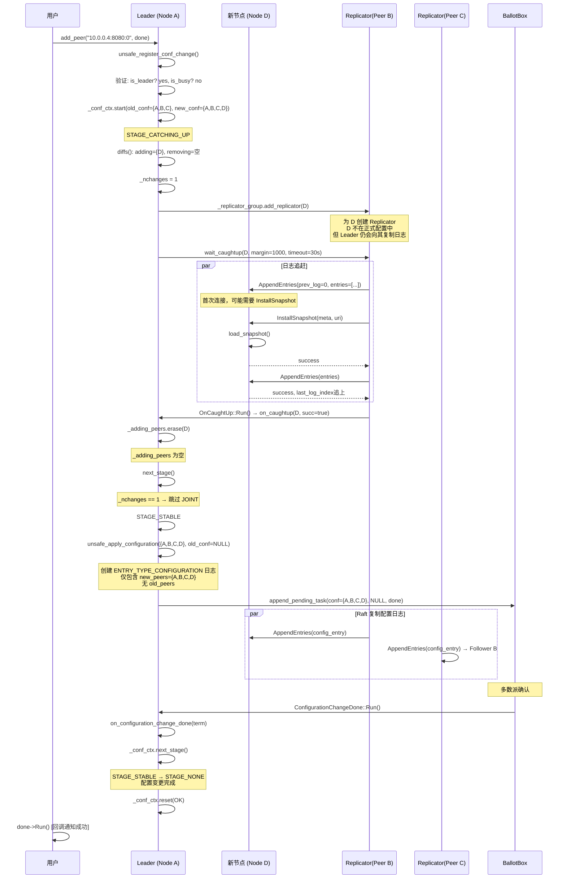
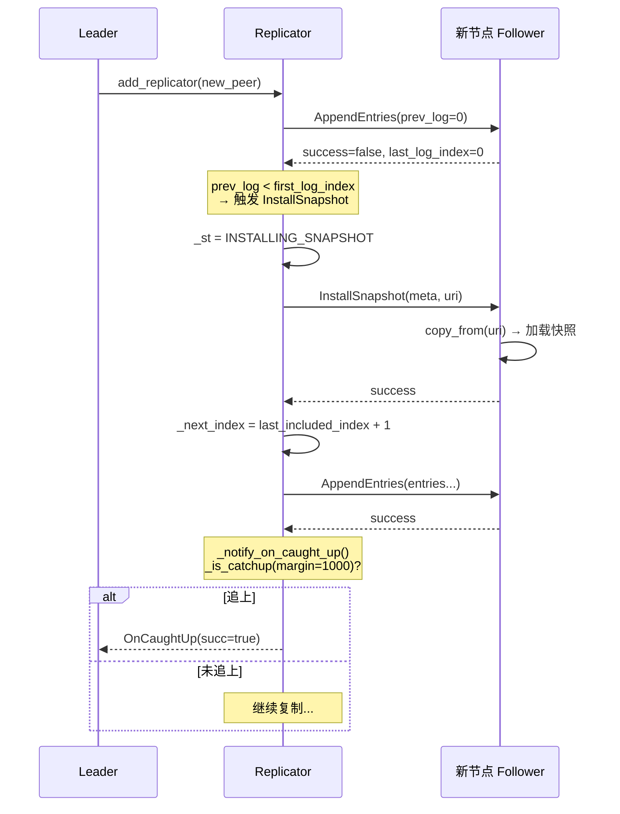
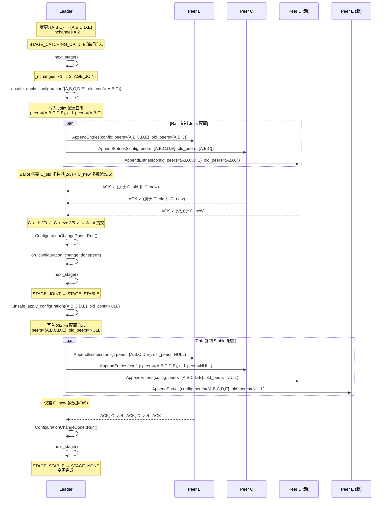
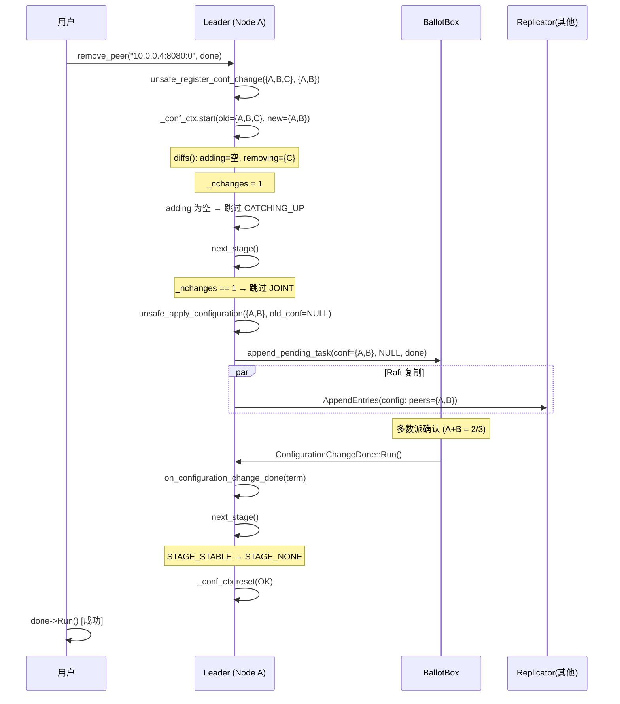
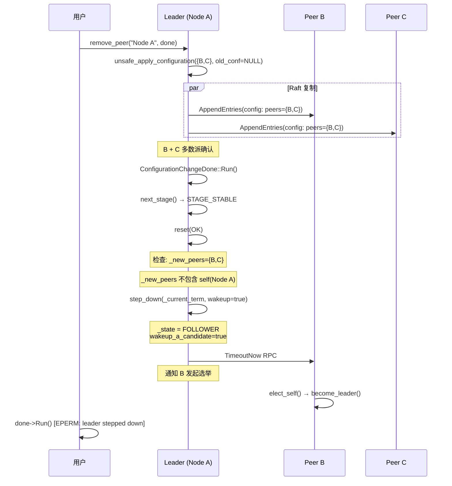

# braft 成员增删机制分析

## 目录

1. [概述](#1-概述)
2. [公共 API](#2-公共-api)
3. [配置变更验证](#3-配置变更验证)
4. [ConfigurationCtx 状态机](#4-configurationctx-状态机)
5. [添加成员完整流程](#5-添加成员完整流程)
6. [Catchup 追赶机制](#6-catchup-追赶机制)
7. [Joint Consensus 阶段](#7-joint-consensus-阶段)
8. [删除成员流程](#8-删除成员流程)
9. [Leader 自删除](#9-leader-自删除)
10. [快照与配置变更](#10-快照与配置变更)
11. [配置序列化格式](#11-配置序列化格式)
12. [ConfigurationManager 配置管理](#12-configurationmanager-配置管理)
13. [错误处理与重试](#13-错误处理与重试)
14. [与 etcd/Consul 配置变更对比](#14-与-etcdconsul-配置变更对比)
15. [源码索引](#15-源码索引)

---

## 1. 概述

braft 的成员增删基于 **Raft 论文的 Joint Consensus**（联合共识）算法，分为三个阶段：

```
成员变更生命周期:

  ┌───────────────┐     所有新节点追赶完成      ┌───────────────┐     Joint 多数派确认     ┌───────────────┐
  │ CATCHING_UP   │ ───────────────────────── → │     JOINT     │ ─────────────────── → │    STABLE     │
  │ (追赶阶段)     │                            │ (联合共识阶段)  │                        │ (稳定阶段)     │
  └───────────────┘                             └───────────────┘                             └───────────────┘
                                                        │                                              │
                                                  C_old ∪ C_new                                   仅 C_new
                                                  双方多数派                                      单方多数派
```

关键特性：

| 特性 | 说明 |
|------|------|
| **只有 Leader 发起** | add_peer / remove_peer 只能在 Leader 上调用 |
| **串行变更** | 同时只能有一个配置变更（`_conf_ctx.is_busy()` 互斥） |
| **追赶机制** | 新节点必须先追上 Leader 日志才能加入配置 |
| **单节点优化** | 变更 1 个节点时跳过 JOINT 阶段 |
| **Joint Consensus** | 多节点变更使用 C_old ∪ C_new 两阶段提交 |
| **Leader 自删除** | Leader 被移除时自动 step_down 并唤醒候选者 |

---

## 2. 公共 API

### 2.1 API 接口

```cpp
// src/braft/node.cpp:902-914

// 添加单个节点
void Node::add_peer(const PeerId& peer, Closure* done);

// 移除单个节点
void Node::remove_peer(const PeerId& peer, Closure* done);

// 批量变更成员
void Node::change_peers(const Configuration& new_peers, Closure* done);

// 列出当前成员
void Node::list_peers(std::set<PeerId>* peers);
```

### 2.2 PeerId 格式

```
PeerId = "ip:port:index"
示例: "192.168.1.100:8080:0"
```

### 2.3 add_peer / remove_peer 内部实现

```cpp
// node.cpp:902-907
void NodeImpl::add_peer(const PeerId& peer, Closure* done) {
    BAIDU_SCOPED_LOCK(_mutex);
    Configuration new_conf = _conf.conf;
    new_conf.add_peer(peer);         // 向新配置添加 peer
    return unsafe_register_conf_change(_conf.conf, new_conf, done);
}

// node.cpp:909-914
void NodeImpl::remove_peer(const PeerId& peer, Closure* done) {
    BAIDU_SCOPED_LOCK(_mutex);
    Configuration new_conf = _conf.conf;
    new_conf.remove_peer(peer);     // 从新配置移除 peer
    return unsafe_register_conf_change(_conf.conf, new_conf, done);
}
```

三者最终都调用 `unsafe_register_conf_change(old_conf, new_conf, done)`。

---

## 3. 配置变更验证

```cpp
// node.cpp:855-900
void NodeImpl::unsafe_register_conf_change(...) {
    // 检查 1: 必须是 Leader
    if (_state != STATE_LEADER) {
        if (_state == STATE_TRANSFERRING) {
            return EBUSY("Is transferring leadership");
        }
        return EPERM("Not leader");
    }

    // 检查 2: 不能有并发的配置变更
    if (_conf_ctx.is_busy()) {
        return EBUSY("Doing another configuration change");
    }

    // 检查 3: 新配置不能与当前相同（幂等检查）
    if (_conf.conf.equals(new_conf)) {
        done->Run();  // 直接返回成功
        return;
    }

    // 检查通过 → 进入配置变更流程
    _conf_ctx.start(old_conf, new_conf, done);
}
```

---

## 4. ConfigurationCtx 状态机

### 4.1 状态定义

```cpp
// node.h:331-338
enum Stage {
    STAGE_NONE = 0,        // 空闲（无配置变更）
    STAGE_CATCHING_UP = 1,  // 新节点追赶日志
    STAGE_JOINT = 2,         // 联合共识（C_old ∪ C_new）
    STAGE_STABLE = 3,        // 稳定配置（仅 C_new）
};
```

### 4.2 状态转换图

```
                  add_peer/remove_peer
                         │
                         ▼
                ┌──────────────────┐
                │  STAGE_CATCHING_UP │
                │                    │
                │  新节点复制日志    │
                │  直到追上 Leader   │
                └────────┬─────────┘
                         │ 所有新节点追上
                         │
              ┌──────────┴──────────┐
              │                     │
     _nchanges > 1           _nchanges == 1
     (多节点变更)            (单节点变更)
              │                     │
              ▼                     │
     ┌──────────────────┐          │
     │   STAGE_JOINT     │          │
     │                    │          │
     │ C_old ∪ C_new     │          │
     │ 双方多数派确认      │          │
     └────────┬─────────┘          │
              │ Joint 提交           │
              │                     │
              └──────────┬──────────┘
                         │
                         ▼
                ┌──────────────────┐
                │   STAGE_STABLE    │
                │                    │
                │  仅 C_new          │
                │  单方多数派确认     │
                └────────┬─────────┘
                         │
                         ▼
                ┌──────────────────┐
                │  STAGE_NONE      │
                │  配置变更完成      │
                └──────────────────┘
```

---

## 5. 添加成员完整流程

### 5.1 时序图（单节点添加，跳过 JOINT）



### 5.2 核心代码：ConfigurationCtx::start

```cpp
// node.cpp:3202-3247
void NodeImpl::ConfigurationCtx::start(const Configuration& old_conf,
                                       const Configuration& new_conf,
                                       Closure* done) {
    _stage = STAGE_CATCHING_UP;
    new_conf.diffs(old_conf, &adding, &removing);
    _nchanges = adding.size() + removing.size();

    if (adding.empty()) {
        // 纯移除 → 跳过追赶，直接进入下一阶段
        return next_stage();
    }

    // 为每个新节点启动 Replicator + Catchup
    for (auto iter = _adding_peers.begin(); iter != _adding_peers.end(); ++iter) {
        _replicator_group.add_replicator(*iter);  // 启动复制
        OnCaughtUp* caught_up = new OnCaughtUp(...);
        _replicator_group.wait_caughtup(*iter, catchup_margin, &due_time, caught_up);
    }
}
```

---

## 6. Catchup 追赶机制

### 6.1 追赶判定

```cpp
// replicator.h:207-218
bool _is_catchup(int64_t max_margin) {
    // 还在安装快照 → 未追上
    if (_next_index < _options.log_manager->first_log_index()) {
        return false;
    }
    // Leader.last_log - Follower.next_index >= margin → 未追上
    if (_min_flying_index() - 1 + max_margin
            < _options.log_manager->last_log_index()) {
        return false;
    }
    return true;
}
```

```
追赶条件:
  Leader.last_log_index - (Replicator.next_index - flying_size) < catchup_margin

示例:
  Leader.last_log_index = 5000
  catchup_margin = 1000 (默认)
  Replicator.next_index = 4200
  flying_size = 200

  5000 - (4200 - 200) = 5000 - 4000 = 1000
  1000 >= 1000 (margin) → 已追上!
```

### 6.2 wait_for_caughtup 流程

```cpp
// replicator.cpp:172-219
void Replicator::wait_for_caughtup(ReplicatorId id, int64_t max_margin,
                                    const timespec* due_time,
                                    CatchupClosure* done) {
    // 如果已经追上 → 立即回调
    if (r->_has_succeeded && r->_is_catchup(max_margin)) {
        run_closure_in_bthread(done);
        return;
    }

    // 注册超时定时器
    bthread_timer_add(&done->_timer, *due_time, _on_catch_up_timedout, id);
    r->_catchup_closure = done;  // 保存 closure，等待追赶完成
}
```

### 6.3 追赶完成通知

```cpp
// replicator.cpp:934-964
void Replicator::_notify_on_caught_up(int error_code, bool before_destroy) {
    if (_catchup_closure == NULL) return;

    // 如果未超时且未追上 → 不通知（继续等待）
    if (error_code != ETIMEDOUT && error_code != EPERM) {
        if (!_is_catchup(_catchup_closure->_max_margin)) return;
    }

    // 追上完成或超时 → 触发回调
    Closure* saved = _catchup_closure;
    _catchup_closure = NULL;
    run_closure_in_bthread(saved);  // → OnCaughtUp::Run()
}
```

### 6.4 超时重试

```cpp
// node.cpp:749-792
void NodeImpl::on_caughtup(const PeerId& peer, int64_t term,
                           int64_t version, const butil::Status& st) {
    if (st.ok()) {
        _conf_ctx.on_caughtup(version, peer, true);   // 成功
        return;
    }

    // 超时但节点仍存活 → 重试
    if (st.error_code() == ETIMEDOUT
            && (now - last_rpc_send_timestamp(peer)) <= election_timeout_ms) {
        OnCaughtUp* caught_up = new OnCaughtUp(...);
        _replicator_group.wait_caughtup(peer, catchup_margin, &due_time, caught_up);
        return;
    }

    // 彻底失败
    _conf_ctx.on_caughtup(version, peer, false);  // 取消配置变更
}
```

### 6.5 追赶时序图



---

## 7. Joint Consensus 阶段

### 7.1 何时进入 JOINT

```
当一次变更涉及多个节点时（_nchanges > 1）:
  例如: change_peers({A,B,C,D,E})  — 同时添加 D 和 E

  → CATCHING_UP → JOINT → STABLE (三阶段)
```

### 7.2 JOINT 阶段配置日志

```cpp
// node.cpp:2081-2107
void NodeImpl::unsafe_apply_configuration(
    const Configuration& new_conf,      // C_new = {A,B,C,D,E}
    const Configuration* old_conf,       // C_old = {A,B,C}  (非 NULL = Joint)
    bool leader_start) {

    LogEntry* entry = new LogEntry();
    entry->type = ENTRY_TYPE_CONFIGURATION;
    entry->peers = new vector<PeerId>(*new_conf);        // {A,B,C,D,E}
    entry->old_peers = new vector<PeerId>(*old_conf);     // {A,B,C}

    // 投票需要 C_old 和 C_new 的双重多数派
    _ballot_box->append_pending_task(new_conf, old_conf, done);
    _log_manager->append_entries(entries, closure);
}
```

### 7.3 JOINT 阶段 Ballot 计算

```cpp
// ballot.cpp:24-46
int Ballot::init(const Configuration& conf, const Configuration* old_conf) {
    _quorum = conf.size() / 2 + 1;       // C_new 的多数派
    if (old_conf) {
        _old_quorum = old_conf->size() / 2 + 1;  // C_old 的多数派
    }
}

bool granted() const {
    return _quorum <= 0 && _old_quorum <= 0;  // 两个都满足
}
```

### 7.4 JOINT 阶段时序图



---

## 8. 删除成员流程

### 8.1 时序图



### 8.2 删除成员特点

- **不需要追赶阶段**：被删除的节点已经在集群中
- **不需要 Joint**：单节点变更（`_nchanges = 1`）直接走 STABLE
- **被删除节点停止 Replicator**：`reset()` 中 `stop_replicator` 清理

---

## 9. Leader 自删除

### 9.1 时序图



### 9.2 核心代码

```cpp
// node.cpp:3292-3325
void NodeImpl::ConfigurationCtx::next_stage() {
    switch (_stage) {
    case STAGE_STABLE: {
        bool should_step_down =
            _new_peers.find(_node->_server_id) == _new_peers.end();
        reset(&st);  // 清理 _conf_ctx
        if (should_step_down) {
            _node->step_down(_node->_current_term, true,
                    butil::Status(ELEADERREMOVED, "This node was removed"));
        }
        return;
    }
    }
}
```

---

## 10. 快照与配置变更

### 10.1 快照保存（携带配置）

```cpp
// fsm_caller.cpp:328-358
void FSMCaller::do_snapshot_save(SaveSnapshotClosure* done) {
    SnapshotMeta meta;
    meta.set_last_included_index(last_applied_index);
    meta.set_last_included_term(last_applied_term);

    // 获取当前 index 处的配置
    ConfigurationEntry conf_entry;
    _log_manager->get_configuration(last_applied_index, &conf_entry);

    // 将配置写入快照元数据
    for (auto iter = conf_entry.conf.begin(); ...) {
        *meta.add_peers() = iter->to_string();
    }
    for (auto iter = conf_entry.old_conf.begin(); ...) {
        *meta.add_old_peers() = iter->to_string();
    }

    _fsm->on_snapshot_save(writer, done);
}
```

### 10.2 快照加载（恢复配置）

```cpp
// fsm_caller.cpp:367-429
void FSMCaller::do_snapshot_load(LoadSnapshotClosure* done) {
    SnapshotReader* reader = done->start();
    SnapshotMeta meta;
    reader->load_meta(&meta);

    // 恢复状态机
    _fsm->on_snapshot_load(reader);

    // 如果是稳定配置（非 Joint），通知用户
    if (meta.old_peers_size() == 0) {
        Configuration conf;
        for (int i = 0; i < meta.peers_size(); ++i) {
            conf.add_peer(meta.peers(i));
        }
        _fsm->on_configuration_committed(conf, meta.last_included_index());
    }

    _last_applied_index = meta.last_included_index();
    _last_applied_term = meta.last_included_term();
}
```

### 10.3 SnapshotMeta protobuf

```protobuf
// raft.proto:60-65
message SnapshotMeta {
    required int64 last_included_index = 1;
    required int64 last_included_term = 2;
    repeated string peers = 3;       // 当前配置
    repeated string old_peers = 4;   // Joint 阶段的旧配置
}
```

---

## 11. 配置序列化格式

### 11.1 LogEntry 中的配置

```
LogEntry (type = ENTRY_TYPE_CONFIGURATION):
├── id.term = current_term
├── id.index = log_index
├── peers = [PeerId_1, PeerId_2, ...]       // C_new
├── old_peers = [PeerId_1, PeerId_2, ...]    // C_old (Joint 阶段非空)
└── data = ConfigurationPBMeta (protobuf)
```

### 11.2 ConfigurationPBMeta

```protobuf
// local_storage.proto:8-11
message ConfigurationPBMeta {
    repeated string peers = 1;
    repeated string old_peers = 2;
}
```

### 11.3 序列化

```
写入磁盘 (serialize_configuration_meta):
  LogEntry.peers → ConfigurationPBMeta.peers (protobuf 序列化)
  LogEntry.old_peers → ConfigurationPBMeta.old_peers (protobuf 序列化)
  → 追加到日志段文件

读取磁盘 (parse_configuration_meta):
  日志段 → IOBuf → ConfigurationPBMeta (protobuf 反序列化)
  → ConfigurationEntry
  → ConfigurationManager.add()
```

---

## 12. ConfigurationManager 配置管理

### 12.1 数据结构

```
ConfigurationManager
├── _configurations: deque<ConfigurationEntry>  ← 日志中的配置变更历史
└── _snapshot: ConfigurationEntry                ← 快照中的配置

示例:
  _snapshot: {index=100, term=5, conf={A,B,C}}
  _configurations: [
    {index=200, term=6, conf={A,B,C,D}, old_peers={A,B,C}},  ← Joint
    {index=210, term=6, conf={A,B,C,D}},                        ← Stable
  ]

  last_configuration() → {index=210, term=6, conf={A,B,C,D}}
```

### 12.2 关键操作

```cpp
// 配置变更时添加
int add(const ConfigurationEntry& entry);         // 追加到 deque

// 日志截断前移（快照后截断旧日志）
void truncate_prefix(int64_t first_index_kept);

// 日志截断后移（Leader 截断冲突日志）
void truncate_suffix(int64_t last_index_kept);

// 设置快照配置
void set_snapshot(const ConfigurationEntry& entry);

// 获取指定 index 的配置
void get(int64_t last_included_index, ConfigurationEntry* conf);

// 获取最新配置
const ConfigurationEntry& last_configuration() const;
```

---

## 13. 错误处理与重试

### 13.1 错误场景

| 场景 | 错误码 | 说明 |
|------|--------|------|
| 非 Leader 调用 add_peer | `EPERM` | 只有 Leader 能发起配置变更 |
| Leader 正在转移领导权 | `EBUSY` | STATE_TRANSFERRING 期间拒绝 |
| 并发配置变更 | `EBUSY` | `_conf_ctx.is_busy()` 互斥 |
| 新配置与当前相同 | 成功 | 幂等操作，直接返回 |
| Catchup 超时（节点存活） | 重试 | 继续等待，直到 catchup_timeout_ms |
| Catchup 超时（节点不存活） | `ECATCHUP` | 取消配置变更，done 返回错误 |
| Leader 在变更过程中 step_down | 取消 | 新 Leader 可能发起新的配置变更 |
| Snapshot 加载失败 | 错误传播 | 节点进入 ERROR 状态 |

### 13.2 ConfigurationCtx::reset

```cpp
// node.cpp:3327-3361
void NodeImpl::ConfigurationCtx::reset(butil::Status* st) {
    // 停止多余/新加的 Replicator
    if (st && st->ok()) {
        _node->stop_replicator(_new_peers, _old_peers);  // 保留新配置的 replicator
    } else {
        _node->stop_replicator(_old_peers, _new_peers);  // 保留旧配置的 replicator
    }

    // 清理状态
    _new_peers.clear();
    _old_peers.clear();
    _adding_peers.clear();
    ++_version;   // 递增版本号，使过期回调失效
    _stage = STAGE_NONE;

    // 通知用户
    if (_done) {
        _done->status() = *st;
        run_closure_in_bthread(_done);
        _done = NULL;
    }
}
```

### 13.3 版本号防 ABA

```
场景: 配置变更 1 (add D) 尚未完成，用户又发起配置变更 2 (add E)

  变更 1: _conf_ctx._version = 5
  变更 2: _conf_ctx.is_busy() → EBUSY（被拒绝）

  如果 Leader 在变更 1 期间 step_down，新 Leader 发起变更 2:
  新 Leader 的 on_caughtup(version=5, ...) 不匹配当前 _version
  → 忽略过期的回调

  _version 的递增保证了过期回调不会影响新的配置变更流程
```

---

## 14. 与 etcd/Consul 配置变更对比

| 维度 | braft | etcd (Raft) | Consul (Raft) |
|------|-------|-------------|---------------|
| **配置变更算法** | Joint Consensus | Joint Consensus (v3 API) | Joint Consensus |
| **单节点优化** | 跳过 JOINT | 不跳过（两阶段） | 不跳过 |
| **并发变更** | 互斥（EBUSY） | 互斥 | 互斥 |
| **追赶机制** | wait_caughtup + margin | 自定义 catchup | 自定义 catchup |
| **Leader 自删除** | 自动 step_down + TimeoutNow | 自动 step_down | 自动 step_down |
| **Learner 支持** | 不支持（只有 Voter） | 支持 Learner | 支持 Learner |
| **快照携带配置** | SnapshotMeta.peers/old_peers | Snapshot 元数据 | Snapshot 元数据 |
| **用户回调** | on_configuration_committed (仅 Stable) | 无（etcd API 层处理） | 无（Consul API 层处理） |
| **配置历史** | ConfigurationManager (deque) | Raft log | Raft log |

---

## 15. 源码索引

### 公共 API

| 组件 | 文件 | 关键行号 |
|------|------|----------|
| Node::add_peer | `src/braft/node.cpp` | 902-907 |
| Node::remove_peer | `src/braft/node.cpp` | 909-914 |
| Node::change_peers | `src/braft/node.cpp` | 916-920 |
| Node::list_peers | `src/braft/node.cpp` | 922-931 |
| unsafe_register_conf_change | `src/braft/node.cpp` | 855-900 |

### ConfigurationCtx 状态机

| 组件 | 文件 | 关键行号 |
|------|------|----------|
| ConfigurationCtx 定义 | `src/braft/node.h` | 331-388 |
| Stage 枚举 | `src/braft/node.h` | 331-338 |
| ConfigurationCtx::start | `src/braft/node.cpp` | 3202-3247 |
| ConfigurationCtx::next_stage | `src/braft/node.cpp` | 3292-3325 |
| ConfigurationCtx::on_caughtup | `src/braft/node.cpp` | 3265-3290 |
| ConfigurationCtx::flush | `src/braft/node.cpp` | 3249-3263 |
| ConfigurationCtx::reset | `src/braft/node.cpp` | 3327-3361 |
| ConfigurationCtx::is_busy | `src/braft/node.h` | 370 |

### 配置日志写入

| 组件 | 文件 | 关键行号 |
|------|------|----------|
| unsafe_apply_configuration | `src/braft/node.cpp` | 2081-2107 |
| ConfigurationChangeDone | `src/braft/node.cpp` | 94-125 |
| on_configuration_change_done | `src/braft/node.cpp` | 708-720 |
| on_configuration_committed (FSM) | `src/braft/fsm_caller.cpp` | 283-290 |

### Catchup 机制

| 组件 | 文件 | 关键行号 |
|------|------|----------|
| OnCaughtUp | `src/braft/node.cpp` | 722-747 |
| NodeImpl::on_caughtup | `src/braft/node.cpp` | 749-792 |
| CatchupClosure | `src/braft/replicator.h` | 64-80 |
| wait_for_caughtup | `src/braft/replicator.cpp` | 172-219 |
| _is_catchup | `src/braft/replicator.h` | 207-218 |
| _notify_on_caught_up | `src/braft/replicator.cpp` | 934-964 |
| _on_catch_up_timedout | `src/braft/replicator.cpp` | 1028-1038 |
| wait_caughtup (group) | `src/braft/replicator.cpp` | 1414-1424 |

### 配置数据结构

| 组件 | 文件 | 关键行号 |
|------|------|----------|
| Configuration 类 | `src/braft/configuration.h` | 161-295 |
| Configuration::diffs | `src/braft/configuration.h` | 280-295 |
| ConfigurationEntry | `src/braft/configuration_manager.h` | 25-48 |
| ConfigurationManager | `src/braft/configuration_manager.h` | 51-75 |
| ConfigurationManager::add | `src/braft/configuration_manager.cpp` | 21-30 |
| ConfigurationManager::get | `src/braft/configuration_manager.cpp` | 48-72 |
| LogManager::get_configuration | `src/braft/log_manager.cpp` | 781-799 |
| LogManager::check_and_set_configuration | `src/braft/log_manager.cpp` | 801-815 |

### 快照与配置

| 组件 | 文件 | 关键行号 |
|------|------|----------|
| SnapshotMeta proto | `src/braft/raft.proto` | 60-65 |
| do_snapshot_save | `src/braft/fsm_caller.cpp` | 328-358 |
| do_snapshot_load | `src/braft/fsm_caller.cpp` | 367-429 |

### 序列化

| 组件 | 文件 | 关键行号 |
|------|------|----------|
| ConfigurationPBMeta proto | `src/braft/local_storage.proto` | 8-11 |
| serialize_configuration_meta | `src/braft/log_entry.cpp` | 55-71 |
| parse_configuration_meta | `src/braft/log_entry.cpp` | 34-53 |
| Segment::append (config) | `src/braft/log.cpp` | 392-407 |
| Segment::load (config) | `src/braft/log.cpp` | 310-330 |
