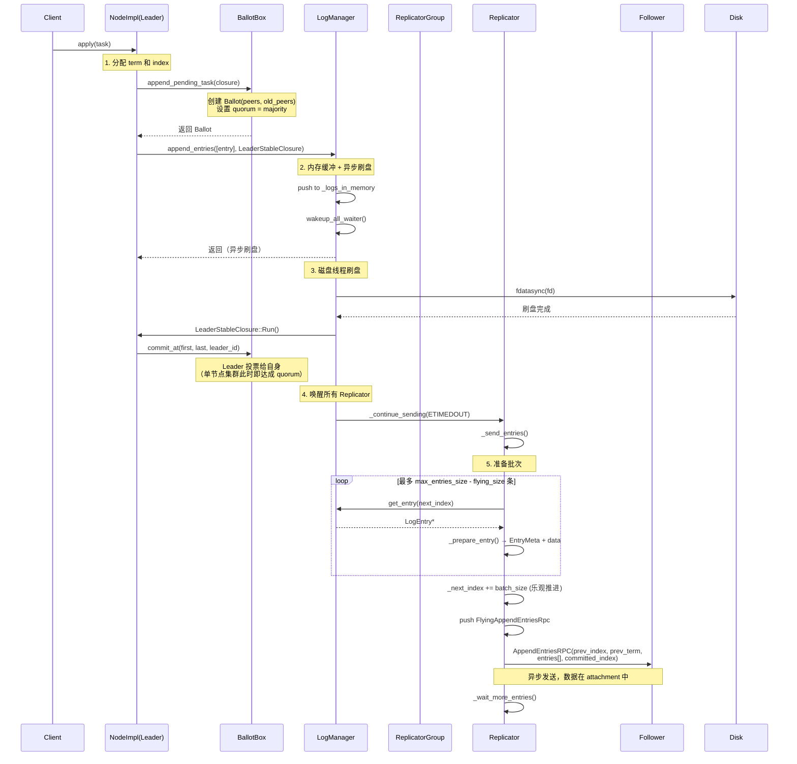
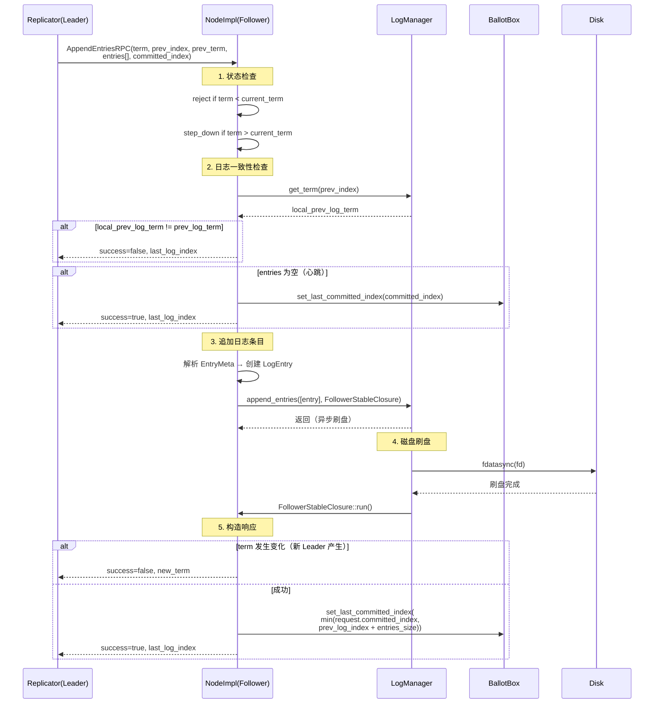
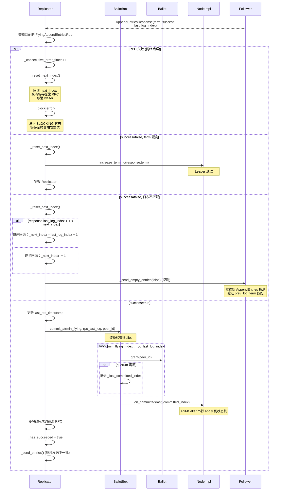
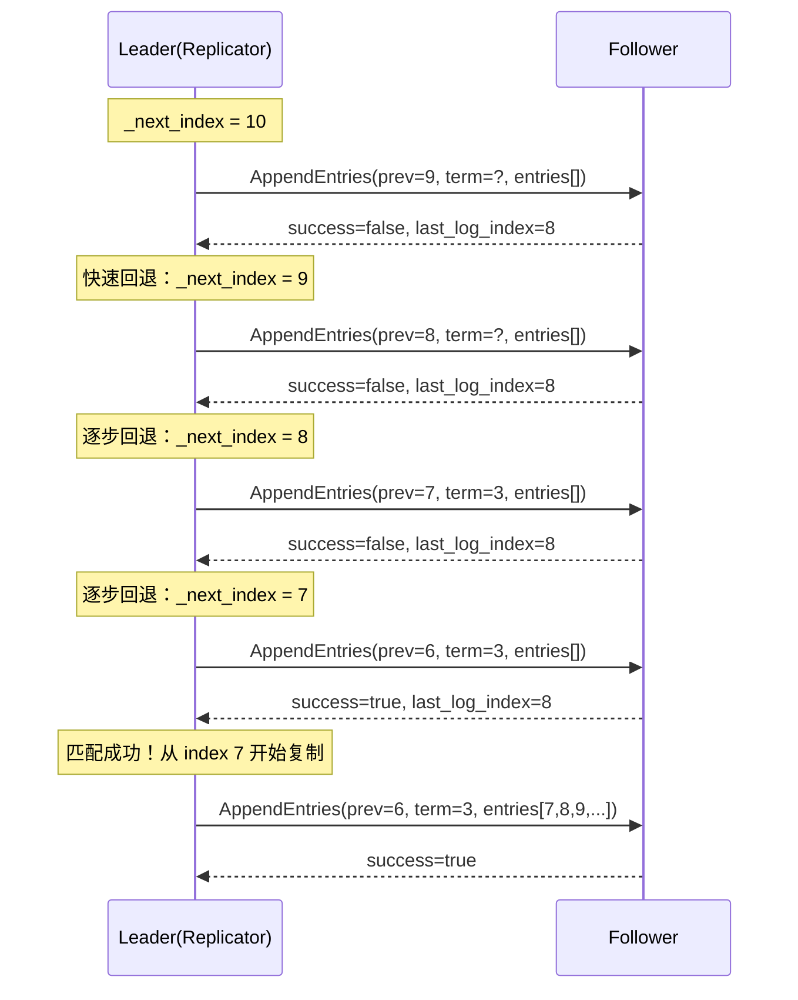
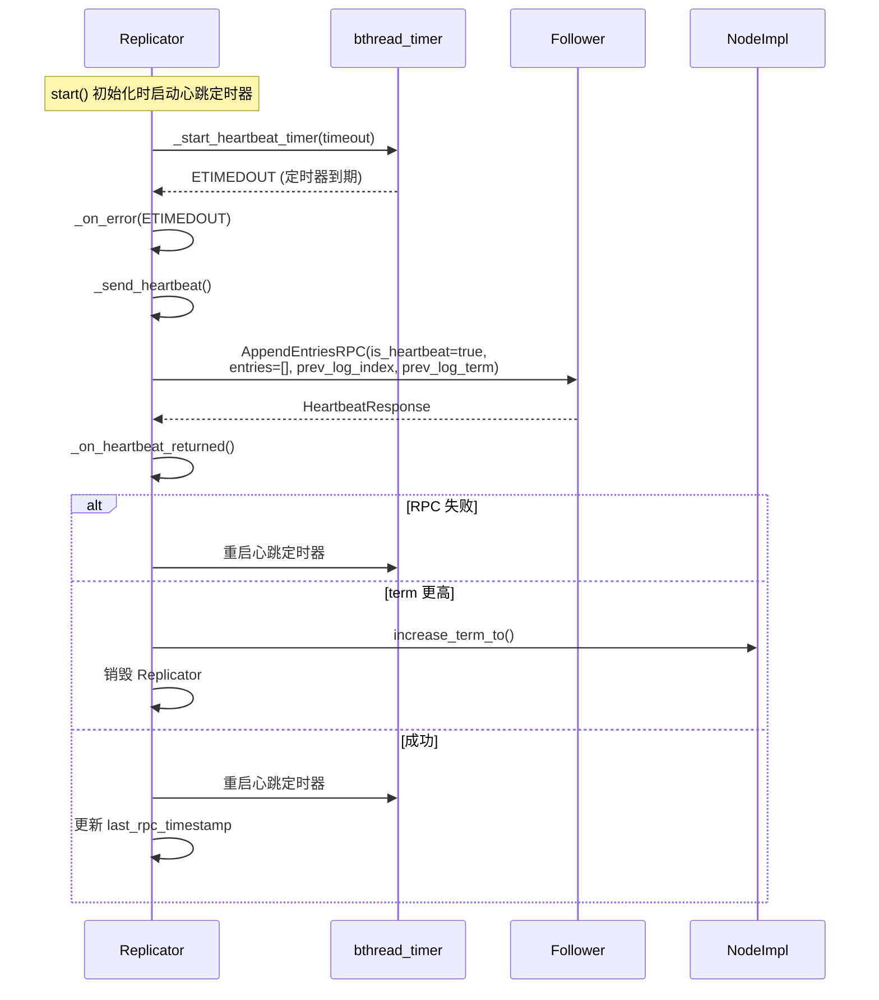
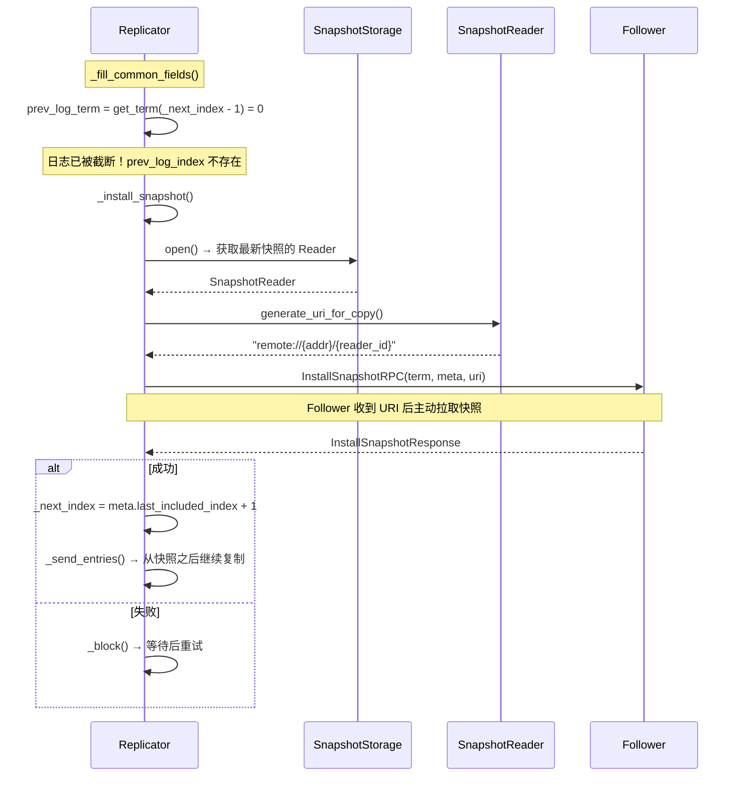
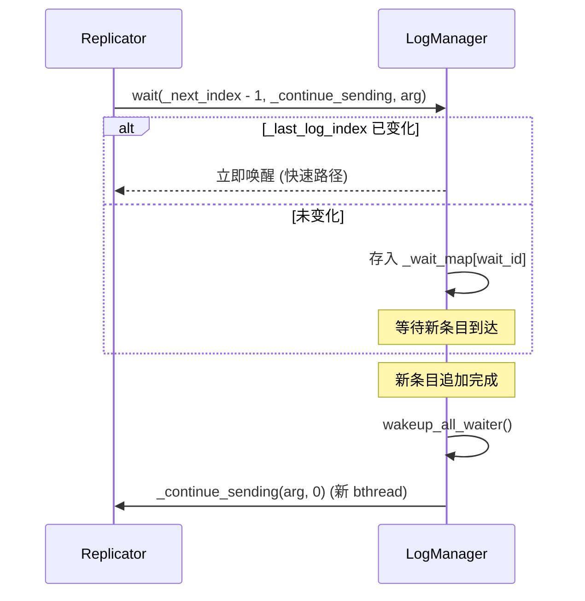
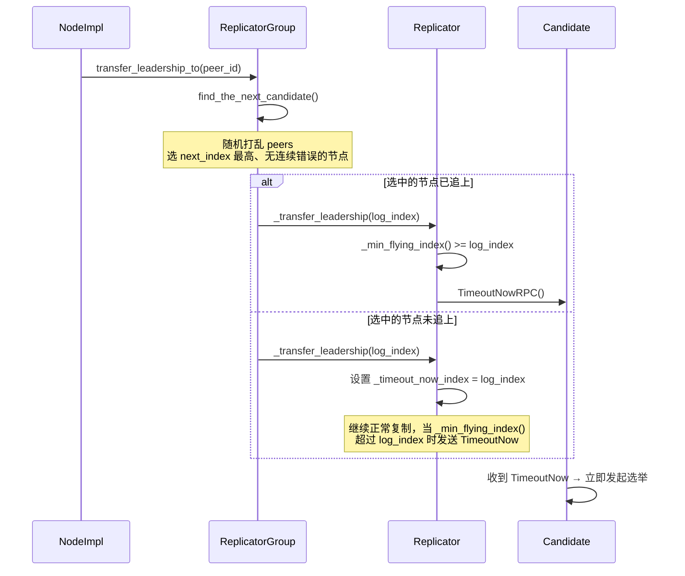
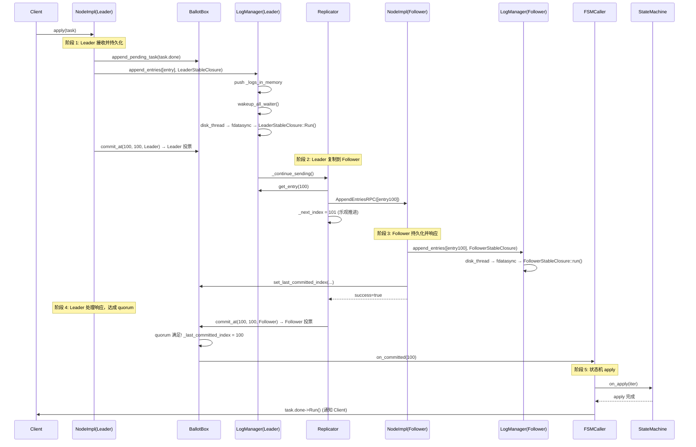

# braft 日志复制机制分析

## 目录

1. [概述](#1-概述)
2. [核心组件架构](#2-核心组件架构)
3. [Replicator 状态机](#3-replicator-状态机)
4. [Leader 发起复制流程](#4-leader-发起复制流程)
5. [Follower 接收并持久化流程](#5-follower-接收并持久化流程)
6. [Leader 处理复制响应](#6-leader-处理复制响应)
7. [日志冲突解决](#7-日志冲突解决)
8. [BallotBox 投票与提交](#8-ballotbox-投票与提交)
9. [流水线复制（Pipelining）](#9-流水线复制pipelining)
10. [心跳机制](#10-心跳机制)
11. [InstallSnapshot 触发](#11-installsnapshot-触发)
12. [日志等待与唤醒机制](#12-日志等待与唤醒机制)
13. [流量控制与限流](#13-流量控制与限流)
14. [Leader Transfer 中的复制](#14-leader-transfer-中的复制)
15. [Readonly 模式](#15-readonly-模式)
16. [完整数据流：从 Client 到 Commit](#16-完整数据流从-client-到-commit)
17. [与其他实现对比](#17-与其他实现对比)
18. [源码索引](#18-源码索引)

---

## 1. 概述

braft 的日志复制机制实现了 Raft 协议中 Leader 驱动的日志复制，核心特点：

1. **Leader 驱动**：所有日志复制由 Leader 发起，Follower 被动接收
2. **流水线复制**：支持多个 AppendEntries RPC 同时在途（pipelining），提高吞吐
3. **乐观推进 next_index**：发送时立即推进 `_next_index`，失败时回滚
4. **隐式 match_index**：不显式维护 match_index，通过 `_min_flying_index()` 等价计算
5. **批量发送**：每次 RPC 可携带多个条目，通过 AppendBatcher 在磁盘线程进一步合并
6. **快照拉取**：InstallSnapshot 通过 URI 让 Follower 主动拉取，避免阻塞 RPC 通道

---

## 2. 核心组件架构

```
                          Client
                            │
                            ▼
┌─────────────────────────────────────────────────────────┐
│  NodeImpl (Leader)                                      │
│                                                         │
│  apply() ──► BallotBox ──► LogManager ──► ReplicatorGroup│
│               │                 │               │       │
│               │                 │        ┌──────┼──────┐│
│               │                 │        ▼      ▼      ▼│
│               │                 │     Repl1  Repl2  Repl3│
│               │                 │               │       │
│               ▼                 ▼               ▼       │
│          commit_at()       _logs_in_memory   RPC发送    │
│          on_committed()    disk_thread()               │
│               │                                       │
│               ▼                                       │
│          FSMCaller ──► StateMachine.apply()            │
└─────────────────────────────────────────────────────────┘
                        │ RPC
                        ▼
┌─────────────────────────────────────────────────────────┐
│  NodeImpl (Follower)                                    │
│                                                         │
│  handle_append_entries() ──► LogManager ──► BallotBox   │
│                                   │               │     │
│                              disk_flush()     set_last_  │
│                                   │           committed() │
│                                   ▼               │     │
│                              Respond           FSMCaller │
│                                                     │   │
│                                                     ▼   │
│                                              StateMachine│
└─────────────────────────────────────────────────────────┘
```

### 组件职责

| 组件 | 职责 |
|------|------|
| `Replicator` | Leader 端每个 Follower 的复制器，管理 next_index、发送 RPC、处理响应 |
| `ReplicatorGroup` | 管理所有 Replicator，统一配置和生命周期 |
| `BallotBox` | 投票箱，每个待提交条目一张选票，追踪 quorum |
| `Ballot` | 单条日志的选票，追踪各 peer 的投票状态 |
| `LogManager::wait()` | 日志等待机制，新条目到达时唤醒等待的 Replicator |
| `FSMCaller` | 状态机调用者，串行 apply 已提交的日志 |

---

## 3. Replicator 状态机

### 3.1 四种状态

```cpp
// replicator.h:132-148
enum St {
    IDLE,                // 空闲，等待新条目到达
    BLOCKING,            // 阻塞（错误后等待重试）
    APPENDING_ENTRIES,   // 正在发送日志条目
    INSTALLING_SNAPSHOT, // 正在发送快照
};
```

### 3.2 状态转换

```
                    start()
  [创建] ──────────────────► [IDLE]
                               │
                    _wait_more_entries() / 无在途 RPC
                               │
                               ▼
                    _continue_sending() 被唤醒
                               │
                    ┌──────────┼──────────┐
                    ▼          ▼          ▼
              [APPENDING   [IDLE]    [INSTALLING
               _ENTRIES]             _SNAPSHOT]
                    │                     │
            RPC 失败/               快照传输完成
            success=false              │
                    │                     │
                    ▼                     │
              [BLOCKING] ──定时器──► 回到 _continue_sending()
                    │
                    │ 阻塞超时
                    ▼
              回到 _continue_sending()

            收到更高 term ──────────► [销毁]
            Leader step_down ───────► [销毁]
```

### 3.3 关键状态变量

```cpp
// replicator.h:233-263
int64_t _next_index;                       // 下一条要发送的 index
int64_t _flying_append_entries_size;       // 所有在途 RPC 的条目总数
int _consecutive_error_times;              // 连续错误次数
bool _has_succeeded;                       // 是否曾有成功响应
std::deque<FlyingAppendEntriesRpc> _append_entries_in_fly;  // 在途 RPC 队列
int64_t _timeout_now_index;                // Leader Transfer 触发 index
int64_t _readonly_index;                   // Readonly 模式截止 index
```

### 3.4 隐式 match_index

braft 不显式维护 `match_index`，而是通过在途 RPC 队列推导：

```cpp
// replicator.h:168-170
int64_t _min_flying_index() {
    return _next_index - _flying_append_entries_size;
}
```

- `_next_index`：发送时乐观推进
- `_flying_append_entries_size`：所有在途 RPC 携带的条目总数
- `_min_flying_index()`：最远一个在途 RPC 的起始 index，即确认已复制到的位置

---

## 4. Leader 发起复制流程



### 4.1 NodeImpl::apply() — 客户端请求入口

```cpp
// node.cpp:2024-2079
int NodeImpl::apply(const Task& task) {
    // 1. 校验状态：必须是 Leader，不能是 readonly
    CHECK_EQ(_state, STATE_LEADER);

    // 2. 为每个 task 创建 LogEntry
    LogEntry* entry = new LogEntry();
    entry->id.term = _current_term;
    entry->type = ENTRY_TYPE_DATA;
    entry->data.swap(*(task.data));

    // 3. 在 BallotBox 中创建选票
    _ballot_box->append_pending_task(task.done, _conf);

    // 4. 追加到 LogManager
    _log_manager->append_entries(entries, new LeaderStableClosure(this, ...));
}
```

### 4.2 LeaderStableClosure::Run() — Leader 自身投票

```cpp
// node.cpp:1998-2022
void LeaderStableClosure::Run() {
    if (status().ok()) {
        // 刷盘成功，Leader 给自己投票
        _node->_ballot_box->commit_at(first_log_index, last_log_index, _node->_server_id);
    }
}
```

### 4.3 _send_entries() — 核心复制方法

```cpp
// replicator.cpp:641-714
int Replicator::_send_entries() {
    // 1. 流量控制检查
    if (_flying_append_entries_size >= FLAGS_raft_max_entries_size ||
        _append_entries_in_fly.size() >= FLAGS_raft_max_parallel_append_entries_rpc_num) {
        return 0;  // 跳过，等待在途 RPC 完成
    }

    // 2. 填充公共字段 (prev_log_index, prev_log_term, committed_index)
    _fill_common_fields(request, _next_index - 1);

    // 3. 如果 prev_log_term 不存在（日志已被截断）→ InstallSnapshot
    if (request->prev_log_term() == 0 && request->prev_log_index() != 0) {
        _install_snapshot();
        return 0;
    }

    // 4. 批量准备条目
    const int max_entries = FLAGS_raft_max_entries_size - _flying_append_entries_size;
    for (int i = 0; i < max_entries; ++i) {
        if (_prepare_entry(i, &em, &cntl->request_attachment()) != 0) break;
        request->add_entries()->Swap(&em);
    }

    // 5. 零条目 → 注册等待
    if (request->entries_size() == 0) {
        _wait_more_entries();
        return 0;
    }

    // 6. 推进 next_index（乐观），记录在途 RPC
    _next_index += request->entries_size();
    _flying_append_entries_size += request->entries_size();
    push_flying_rpc();

    // 7. 发送 RPC
    stub->append_entries(&cntl, &request, &response, _on_rpc_returned);

    // 8. 注册下一批等待
    _wait_more_entries();
}
```

---

## 5. Follower 接收并持久化流程



### 5.1 handle_append_entries_request() 关键逻辑

```cpp
// node.cpp:2387-2573
void NodeImpl::handle_append_entries_request(...) {
    // 1. Term 检查：拒绝旧 term 的请求
    if (request->term() < _current_term) { respond(false); return; }

    // 2. 更高 term → 退为 follower
    if (request->term() > _current_term) { step_down(request->term()); }

    // 3. 脑裂检测：同 term 出现不同 Leader
    if (_leader_id.is_empty() || _leader_id != request->server_id()) {
        if (_state == STATE_LEADER) step_down(_current_term);  // 两个 Leader
        _leader_id = request->server_id();
    }

    // 4. 日志一致性检查
    int64_t local_prev_term = _log_manager->get_term(request->prev_log_index());
    if (local_prev_term != request->prev_log_term()) {
        respond(false, _log_manager->last_log_index());
        return;
    }

    // 5. 追加条目
    FollowerStableClosure* done = new FollowerStableClosure(this, request, response, ...);
    _log_manager->append_entries(entries, done);
}
```

### 5.2 FollowerStableClosure::run() — Follower 响应

```cpp
// node.cpp:2319-2377
void FollowerStableClosure::run() {
    if (!status().ok()) {
        // 刷盘失败
        _cntl->SetFailed(status().error_code(), status().error_cstr());
    } else if (_node->_current_term != _request->term()) {
        // Term 已变化，旧 Leader 的条目可能被截断
        _response->set_term(_node->_current_term);
        _response->set_success(false);
    } else {
        // 成功
        _response->set_success(true);
        // 安全地更新 committed_index
        int64_t committed_index = std::min(
            _request->committed_index(),
            _request->prev_log_index() + _request->entries_size());
        _node->_ballot_box->set_last_committed_index(committed_index);
    }
    _done->Run();  // 发送 RPC 响应
}
```

---

## 6. Leader 处理复制响应



### 6.1 commit_at() — 投票与提交

```cpp
// ballot_box.cpp:49-96
int BallotBox::commit_at(int64_t first_log_index, int64_t last_log_index,
                          const PeerId& peer) {
    BAIDU_SCOPED_LOCK(_mutex);
    int64_t start = std::max(_pending_index, first_log_index);

    for (int64_t i = start; i <= last_log_index; ++i) {
        int pos = i - _pending_index;
        Ballot& ballot = _pending_meta_queue[pos];
        // 投票
        ballot.grant(peer);
        // 检查 quorum
        if (ballot.granted()) {
            _last_committed_index = i;
        }
    }

    if (committed_index > _last_committed_index_before) {
        // 清理已提交的 Ballot
        while (_pending_meta_queue.size() > last_committed_index - _pending_index + 1) {
            _pending_meta_queue.pop_front();
        }
        _pending_index = last_committed_index + 1;
        _waiter->on_committed(_last_committed_index);
    }
}
```

---

## 7. 日志冲突解决

当 Follower 的日志与 Leader 不一致时，通过逐步回退找到匹配点：



### 7.1 冲突解决策略

| 条件 | 动作 | 代码位置 |
|------|------|----------|
| `last_log_index + 1 < _next_index` | 快速回退到 `last_log_index + 1` | replicator.cpp:444-449 |
| `last_log_index + 1 >= _next_index` | 逐步回退 `_next_index -= 1` | replicator.cpp:456 |
| 连续多次冲突 | 每次回退 1，发送空 AppendEntries 探测 | replicator.cpp:465 |
| `prev_log_term == 0`（日志已截断） | 触发 InstallSnapshot | replicator.cpp:656-658 |

---

## 8. BallotBox 投票与提交

### 8.1 Ballot 结构

```cpp
// ballot.h:68-71
struct Ballot {
    std::vector<UnfoundPeerId> _peers;   // 当前配置成员
    int _quorum;                          // 当前配置所需票数
    std::vector<UnfoundPeerId> _old_peers; // 联合共识旧成员
    int _old_quorum;                       // 旧配置所需票数
};

bool granted() const { return _quorum <= 0 && _old_quorum <= 0; }
```

### 8.2 投票流程示意

```
集群: A(Leader), B, C (3 节点, quorum=2)

条目 index=100:
  Ballot(peers={A,B,C}, quorum=3)

  Leader 刷盘 → commit_at(100, 100, A)  → quorum=2  (A 投票)
  Follower B 成功 → commit_at(100, 100, B) → quorum=1  (B 投票)
  → granted() = true! committed_index 推进到 100

条目 index=101 (联合共识阶段):
  Ballot(peers={A,B,C,D}, quorum=3, old_peers={A,B,C}, old_quorum=3)

  A 投票 → quorum=2, old_quorum=2
  B 投票 → quorum=1, old_quorum=1
  C 投票 → quorum=1, old_quorum=0  → 部分满足
  D 投票 → quorum=0, old_quorum=0  → granted()! (双方 quorum 都满足)
```

### 8.3 BallotBox 队列结构

```
_pending_meta_queue:  [Ballot@100] [Ballot@101] [Ballot@102] [Ballot@103]
_pending_index = 100
                      ▲
                      └─ _last_committed_index 在此之前已提交

                        ↑ pos=0     ↑ pos=1     ↑ pos=2     ↑ pos=3

index = _pending_index + pos
```

---

## 9. 流水线复制（Pipelining）

### 9.1 工作原理

```
Leader                              Follower
  │                                   │
  │── RPC1 [entry 1-100] ──────────►  │
  │── RPC2 [entry 101-200] ─────────►  │  ← RPC1 尚未返回
  │── RPC3 [entry 201-300] ─────────►  │  ← RPC2 尚未返回
  │                                   │
  │◄── success(RPC1) ─────────────── │
  │◄── success(RPC2) ─────────────── │
  │◄── success(RPC3) ─────────────── │
```

### 9.2 在途管理

```cpp
// _append_entries_in_fly: deque<FlyingAppendEntriesRpc>
// 每个 FlyingAppendEntriesRpc: {log_index, entries_size, call_id}

_send_entries():
  flying_rpc.log_index = 当前 _next_index  // 发送前的 index
  _next_index += entries_size              // 乐观推进
  _flying_append_entries_size += entries_size
  _append_entries_in_fly.push_back(flying_rpc)

_on_rpc_returned(success):
  // 因为 RPC 有序，一个成功意味着之前的全部成功
  while (_append_entries_in_fly.front().log_index <= rpc_first_index) {
      _flying_append_entries_size -= front.entries_size
      _append_entries_in_fly.pop_front()
  }
  commit_at(_min_flying_index(), rpc_last_log_index, peer_id)
```

### 9.3 流控参数

| 参数 | 默认值 | 说明 |
|------|--------|------|
| `FLAGS_raft_max_entries_size` | 1024 | 所有在途 RPC 的条目总数上限 |
| `FLAGS_raft_max_parallel_append_entries_rpc_num` | 1 | 最大并行 RPC 数（>1 启用流水线） |
| `FLAGS_raft_max_body_size` | 512KB | 单次 RPC 的最大数据量 |

---

## 10. 心跳机制



### 10.1 心跳 vs 探测

| 特性 | 心跳 (_send_heartbeat) | 探测 (_send_empty_entries) |
|------|------------------------|---------------------------|
| 触发 | 定时器超时 | 冲突回退后 |
| RPC 超时 | `election_timeout / 2` | 无特殊超时 |
| 回调 | `_on_heartbeat_returned` | `_on_rpc_returned` |
| prev_log_term 不存在 | 设 `prev_log_index=0` | 触发 InstallSnapshot |
| 记录在途 | `_heartbeat_in_fly` | `_append_entries_in_fly` |

### 10.2 动态心跳间隔

心跳间隔由 `*_options.dynamic_heartbeat_timeout_ms` 控制，通常为 election timeout 的一半。这个值是动态的，可以根据网络状况调整。

---

## 11. InstallSnapshot 触发

当 Leader 的日志已被截断（快照覆盖了 Follower 需要的条目），无法通过 AppendEntries 追赶时：



### 11.1 InstallSnapshot 前置检查

```cpp
// replicator.cpp:772-836
int Replicator::_install_snapshot() {
    // 1. witness 节点不需要快照
    if (_options.peer_is_witness) { _block(); return 0; }

    // 2. 不能并发安装
    if (_st.st == INSTALLING_SNAPSHOT) { return 0; }

    // 3. 检查 SnapshotThrottle（限制并发安装数）
    if (_snapshot_throttle && !_snapshot_throttle->add_one_more_task(is_leader)) {
        _block(); return 0;
    }

    // 4. 打开快照 reader，生成 URI
    SnapshotReader* reader = _snapshot_storage->open();
    std::string uri = reader->generate_uri_for_copy();

    // 5. 发送 InstallSnapshot RPC
    _st.st = INSTALLING_SNAPSHOT;
    stub->install_snapshot(&cntl, &request, &response, _on_install_snapshot_returned);
}
```

---

## 12. 日志等待与唤醒机制

### 12.1 等待注册



### 12.2 交互流程

```
时间线 ─────────────────────────────────────────────►

Replicator:
  _send_entries() → 无新条目 → _wait_more_entries()
                                       │
                                   [等待中]
                                       │
                              _continue_sending() 被唤醒
                                       │
                              _send_entries() → 发送新条目
                                       │
                              _wait_more_entries() → [等待中]
                                       ...

LogManager:
  append_entries(e1,e2) → wakeup_all_waiter()
  append_entries(e3)    → wakeup_all_waiter()
```

### 12.3 取消等待

当发生错误或需要重置时，Replicator 必须取消已注册的等待：

```cpp
// replicator.cpp:1086-1095
void Replicator::_reset_next_index() {
    _next_index -= _flying_append_entries_size;
    _flying_append_entries_size = 0;
    _cancel_append_entries_rpcs();
    _is_waiter_canceled = true;
    if (_wait_id != 0) {
        _options.log_manager->remove_waiter(_wait_id);
        _wait_id = 0;
    }
}
```

---

## 13. 流量控制与限流

### 13.1 多层流量控制

```
┌──────────────────────────────────────────────────┐
│  第 1 层：Replicator 流控                         │
│  ├── _flying_append_entries_size < 1024           │
│  ├── _append_entries_in_fly.size() < max_parallel │
│  └── _st != BLOCKING                             │
├──────────────────────────────────────────────────┤
│  第 2 层：单次 RPC 限制                            │
│  └── attachment.size() < 512KB (raft_max_body_size)│
├──────────────────────────────────────────────────┤
│  第 3 层：磁盘写限流                               │
│  └── AppendBatcher: 256 closures / 256KB          │
├──────────────────────────────────────────────────┤
│  第 4 层：快照传输限流                              │
│  ├── ThroughputSnapshotThrottle (吞吐量)            │
│  └── max_install_snapshot_tasks_num = 1000         │
└──────────────────────────────────────────────────┘
```

### 13.2 BLOCKING 状态

当遇到错误时，Replicator 进入 BLOCKING 状态：

```cpp
// replicator.cpp:242-277
void Replicator::_block(int error_code) {
    if (_st.st == BLOCKING) return;  // 避免叠加阻塞

    int blocking_ms;
    if (error_code == EBUSY || error_code == EINTR) {
        blocking_ms = FLAGS_raft_retry_replicate_interval_ms;  // 1000ms
    } else {
        blocking_ms = *_options.dynamic_heartbeat_timeout_ms;  // 心跳间隔
    }

    // 定时器到期后 → _on_block_timedout → _continue_sending()
    add_timer(blocking_ms, ...);
    _st.st = BLOCKING;
}
```

---

## 14. Leader Transfer 中的复制

### 14.1 触发流程



### 14.2 自动触发条件

在 `_on_rpc_returned()` 中，当复制成功且满足 `_timeout_now_index` 条件时：

```cpp
// replicator.cpp:520-522
if (_timeout_now_index > 0 && _min_flying_index() > _timeout_now_index) {
    _send_timeout_now();
}
```

---

## 15. Readonly 模式

当 Follower 进入 readonly 状态时（如 Learner 节点或维护模式）：

```cpp
// replicator.cpp:1227-1251
void Replicator::_change_readonly_config(bool readonly) {
    if (readonly) {
        // 设置截止 index，阻止用户数据复制
        _readonly_index = _options.log_manager->last_log_index() + 1;
    } else {
        // 清除限制，恢复复制
        _readonly_index = 0;
        _wait_more_entries();  // 唤醒复制
    }
}
```

在 `_prepare_entry()` 中：

```cpp
// replicator.cpp:611-617
if (_readonly_index != 0 && log_index > _readonly_index) {
    if (type == ENTRY_TYPE_DATA) {
        return EREADONLY;  // 阻止用户数据
    }
    // ENTRY_TYPE_CONFIGURATION 仍然允许通过
}
```

---

## 16. 完整数据流：从 Client 到 Commit



---

## 17. 与其他实现对比

| 特性 | braft | etcd/raft | CDS Blockserver | TiKV (raft-rs) |
|------|-------|-----------|-----------------|----------------|
| 复制模式 | Leader 驱动，异步 RPC | Leader 驱动，异步 | Leader 驱动，Raft log | Leader 驱动，异步 |
| 流水线 | 支持并行 RPC | 支持 pipeline | 单条发送 | 支持 ready/pipeline |
| match_index | 隐式 (_min_flying_index) | 显式 match_index | 显式 applied_index | 显式 match |
| next_index | 乐观推进 + 回滚 | 乐观推进 + 回滚 | Leader 分配 | 乐观推进 + 回滚 |
| 冲突解决 | 逐步回退 + 快速回退 | 逐步回退 | Leader 驱动截断 | 逐步回退 |
| 快照传输 | URI 拉取 | 流式推送 | Raft InstallSnapshot | 流式推送 |
| 投票追踪 | BallotBox (per-entry Ballot) | 持久化多数派 | Leader 自身确认 | 持久化多数派 |
| 心跳 | 定时器 → 空 AppendEntries | 定时器 → 空 MsgApp | Raft 心跳 | 定时器 |
| 流量控制 | 4 层（在途/RPC/磁盘/快照） | 内存/发送缓冲 | 无显式流控 | 发送缓冲 |
| 数据传输 | IOBuf attachment | protobuf message | Raft log entry | protobuf |
| Readonly | 支持（阻止用户数据） | 不支持 | 不支持 | Learner readonly |

---

## 18. 源码索引

### 核心头文件

| 文件 | 核心内容 |
|------|----------|
| `src/braft/replicator.h` | `Replicator` 类、状态枚举、FlyingAppendEntriesRpc、CatchupClosure、ReplicatorGroup |
| `src/braft/ballot_box.h` | `BallotBox` 类、Ballot 队列 |
| `src/braft/ballot.h` | `Ballot` 类、quorum 计算 |
| `src/braft/raft.proto` | AppendEntriesRequest/Response、InstallSnapshotRequest/Response |

### 核心实现文件

| 文件 | 行号 | 核心函数 |
|------|------|----------|
| `src/braft/replicator.cpp` | 109-152 | `Replicator::start()` — 初始化，设置 next_index |
| `src/braft/replicator.cpp` | 154-165 | `Replicator::stop()` — 停止复制器 |
| `src/braft/replicator.cpp` | 221-277 | `_block()` / `_on_block_timedout()` — 阻塞与恢复 |
| `src/braft/replicator.cpp` | 279-357 | `_on_heartbeat_returned()` — 心跳响应处理 |
| `src/braft/replicator.cpp` | 359-525 | `_on_rpc_returned()` — AppendEntries 响应处理（核心） |
| `src/braft/replicator.cpp` | 527-554 | `_fill_common_fields()` — 填充 RPC 公共字段 |
| `src/braft/replicator.cpp` | 556-596 | `_send_empty_entries()` — 发送空 AppendEntries（探测/心跳） |
| `src/braft/replicator.cpp` | 598-639 | `_prepare_entry()` — 准备单条日志（readonly/witness 检查） |
| `src/braft/replicator.cpp` | 641-714 | `_send_entries()` — 核心：批量打包发送 |
| `src/braft/replicator.cpp` | 716-755 | `_continue_sending()` — 被唤醒后继续发送 |
| `src/braft/replicator.cpp` | 757-770 | `_wait_more_entries()` — 注册日志等待 |
| `src/braft/replicator.cpp` | 772-867 | `_install_snapshot()` — 发起快照安装 |
| `src/braft/replicator.cpp` | 869-932 | `_on_install_snapshot_returned()` — 快照安装响应 |
| `src/braft/replicator.cpp` | 934-964 | `_notify_on_caught_up()` — 追赶完成通知 |
| `src/braft/replicator.cpp` | 971-991 | `_start_heartbeat_timer()` / `_send_heartbeat()` |
| `src/braft/replicator.cpp` | 993-1026 | `_on_error()` — 错误处理（ESTOP/ETIMEDOUT） |
| `src/braft/replicator.cpp` | 1064-1124 | `_transfer_leadership()` / `_send_timeout_now()` |
| `src/braft/replicator.cpp` | 1086-1095 | `_reset_next_index()` — 回滚 next_index |
| `src/braft/replicator.cpp` | 1227-1251 | `_change_readonly_config()` — readonly 模式切换 |
| `src/braft/replicator.cpp` | 1357-1602 | `ReplicatorGroup` — 复制器组管理 |
| `src/braft/node.cpp` | 1935-1975 | `become_leader()` — 启动所有 Replicator |
| `src/braft/node.cpp` | 1998-2022 | `LeaderStableClosure::Run()` — Leader 自身投票 |
| `src/braft/node.cpp` | 2024-2079 | `apply()` — 客户端请求入口 |
| `src/braft/node.cpp` | 2319-2377 | `FollowerStableClosure::run()` — Follower 响应 |
| `src/braft/node.cpp` | 2387-2573 | `handle_append_entries_request()` — Follower 接收处理 |
| `src/braft/ballot_box.cpp` | 49-96 | `commit_at()` — 投票与 quorum 判定 |
| `src/braft/ballot_box.cpp` | 121-135 | `append_pending_task()` — 创建选票 |
| `src/braft/ballot_box.cpp` | 137-156 | `set_last_committed_index()` — Follower 更新提交进度 |
| `src/braft/ballot.cpp` | 24-46 | `Ballot::init()` — 初始化 quorum |
| `src/braft/ballot.cpp` | 48-79 | `Ballot::grant()` — 投票 |
| `src/braft/log_manager.cpp` | 407-447 | `append_entries()` — 追加日志并唤醒 waiter |
| `src/braft/log_manager.cpp` | 836-906 | `wait()` / `wakeup_all_waiter()` — 日志等待机制 |
