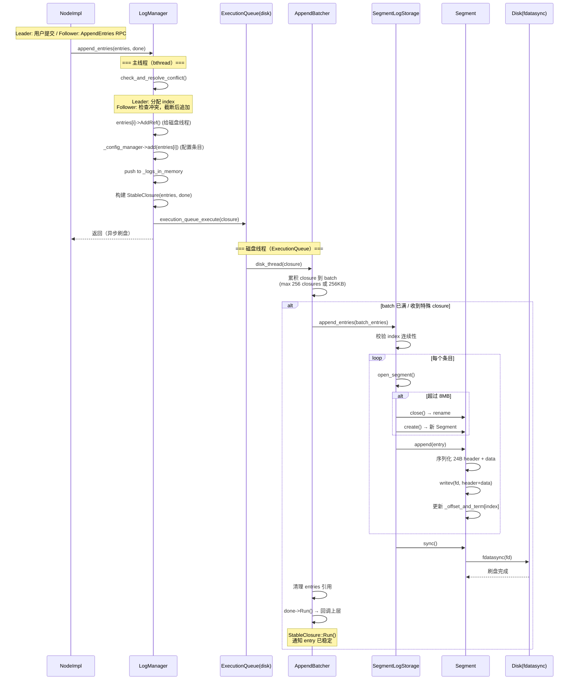
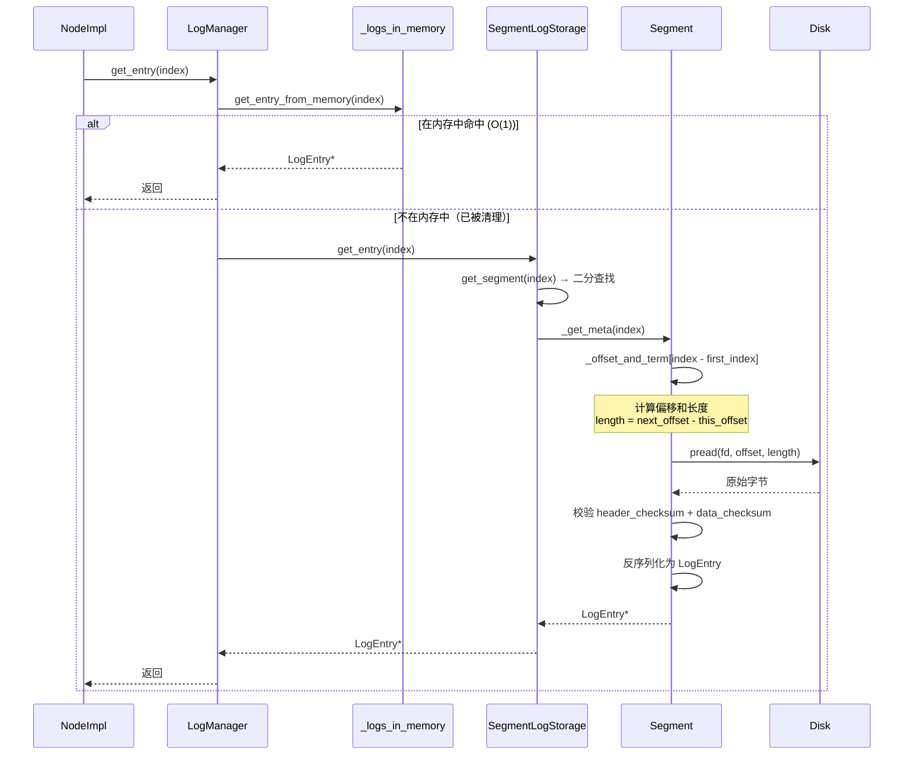
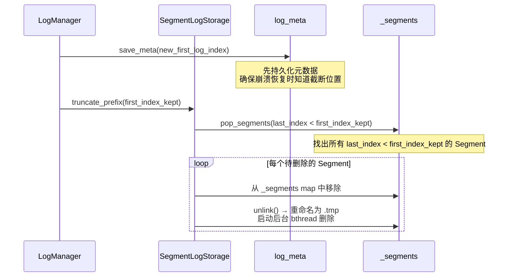
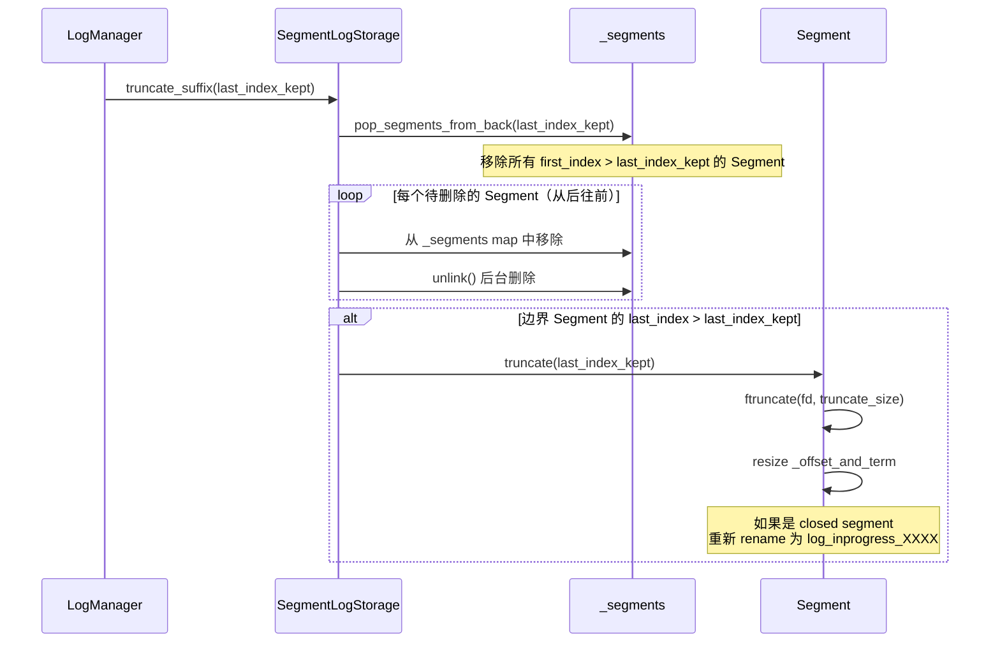
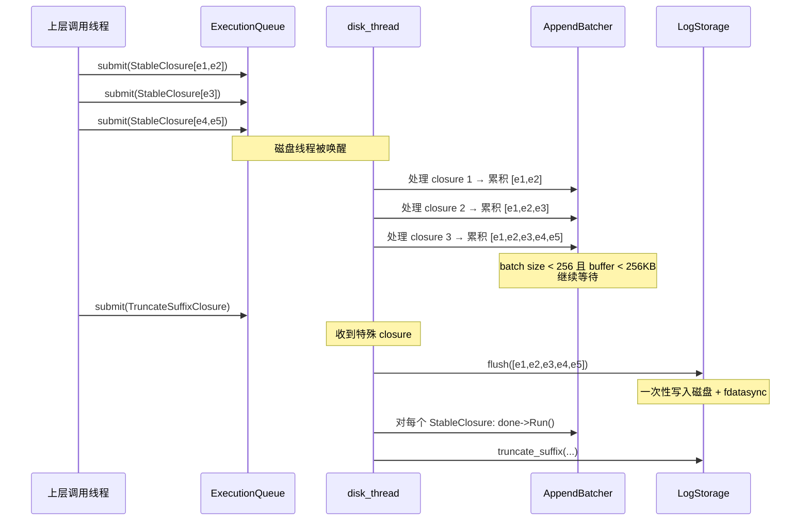
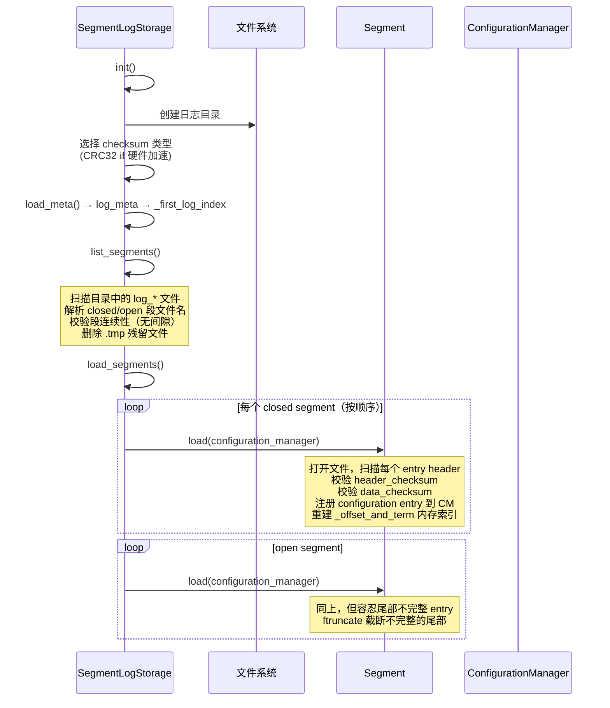
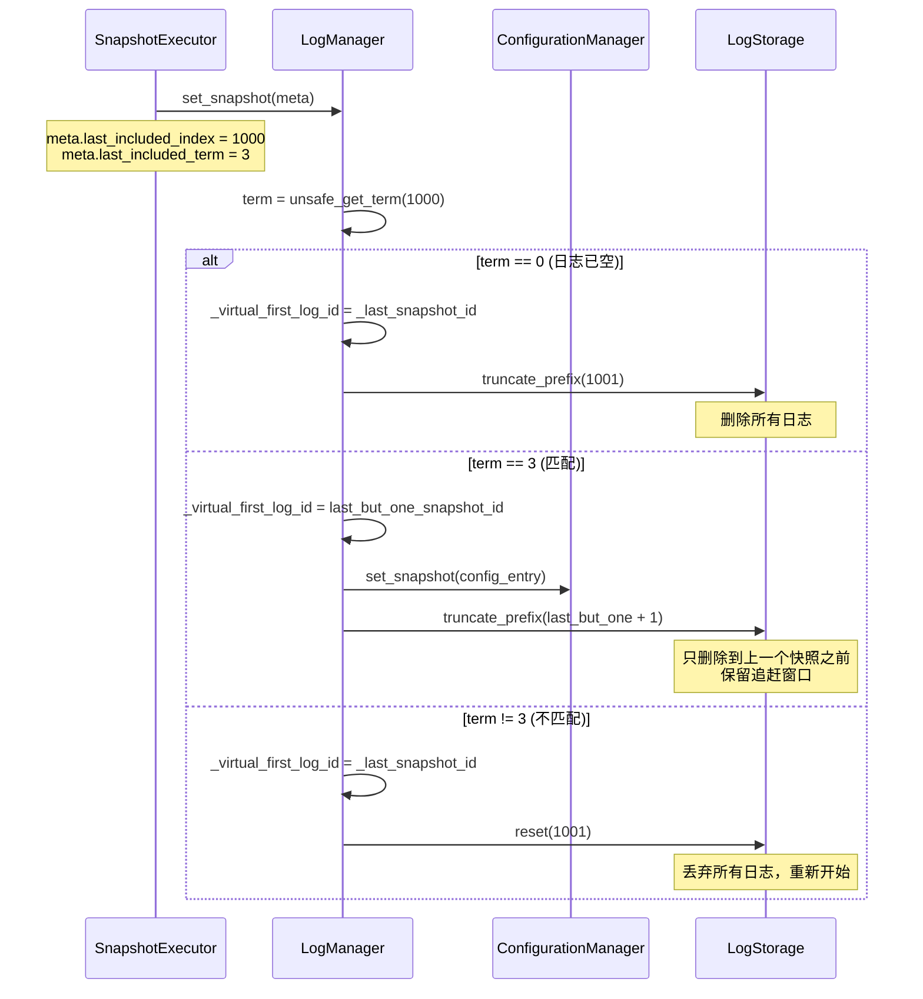

# braft 日志存储策略分析

## 目录

1. [概述](#1-概述)
2. [核心类层次结构](#2-核心类层次结构)
3. [磁盘存储格式](#3-磁盘存储格式)
4. [日志条目格式](#4-日志条目格式)
5. [Segment 管理](#5-segment-管理)
6. [日志追加流程（Append）](#6-日志追加流程append)
7. [日志读取流程（Get）](#7-日志读取流程get)
8. [日志截断策略](#8-日志截断策略)
9. [LogManager 内存与磁盘协调](#9-logmanager-内存与磁盘协调)
10. [刷盘与同步策略](#10-刷盘与同步策略)
11. [日志恢复与错误检测](#11-日志恢复与错误检测)
12. [与快照的交互](#12-与快照的交互)
13. [配置变更条目处理](#13-配置变更条目处理)
14. [与其他实现对比](#14-与其他实现对比)
15. [源码索引](#15-源码索引)

---

## 1. 概述

braft 的日志存储是 Raft 一致性协议的基础设施，负责持久化所有状态变更。其核心设计特点：

1. **分段存储（Segment）**：日志按固定大小分割为多个 Segment 文件，便于管理和清理
2. **双层架构**：LogManager（内存缓冲 + 异步刷盘）→ SegmentLogStorage（磁盘持久化）
3. **异步批量刷盘**：通过 `bthread::ExecutionQueue` 将多个 append 操作合并为一次磁盘写入
4. **WAL 保证**：每批次写入后 `fdatasync`，确保持久化后再响应
5. **双重校验**：Header checksum + Data checksum 确保数据完整性
6. **延迟截断**：与快照配合，保留上一个快照位置的日志供落后节点追赶

---

## 2. 核心类层次结构

```
LogStorage (storage.h:124)                -- 抽象接口
  └── SegmentLogStorage (log.h:139)       -- 分段日志存储实现
        ├── _segments: SegmentMap          -- 已关闭的 Segment 映射
        ├── _open_segment: Segment*        -- 当前活跃的 Segment
        └── _first_log_index / _last_log_index

Segment (log.h:34-130)                    -- 单个 Segment 文件
  ├── _fd: 文件描述符
  ├── _is_open: 是否为活跃 Segment
  ├── _first_index / _last_index: 索引范围
  ├── _bytes: 文件大小
  ├── _unsynced_bytes: 未同步字节数
  └── _offset_and_term: vector<(offset, term)>  -- 内存索引

LogManager (log_manager.h:44)             -- 日志管理层
  ├── _log_storage: LogStorage*           -- 底层存储
  ├── _logs_in_memory: deque<LogEntry*>   -- 内存缓冲
  ├── _disk_id: LogId                     -- 已刷盘的最后位置
  ├── _applied_id: LogId                  -- 已应用到 FSM 的位置
  ├── _last_snapshot_id: LogId            -- 最新快照位置
  ├── _virtual_first_log_id: LogId        -- 虚拟起始位置（优化）
  └── _disk_queue: ExecutionQueueId       -- 异步刷盘队列
```

### LogStorage 接口定义

```cpp
// storage.h:124-178
class LogStorage {
    virtual int init(ConfigurationManager*) = 0;
    virtual int64_t first_log_index() = 0;
    virtual int64_t last_log_index() = 0;
    virtual LogEntry* get_entry(int64_t index) = 0;
    virtual int64_t get_term(int64_t index) = 0;
    virtual int append_entry(const LogEntry* entry) = 0;
    virtual int append_entries(const vector<LogEntry*>&, IOMetric*) = 0;
    virtual int truncate_prefix(int64_t first_index_kept) = 0;
    virtual int truncate_suffix(int64_t last_index_kept) = 0;
    virtual int reset(int64_t next_log_index) = 0;
};
```

---

## 3. 磁盘存储格式

### 目录布局

```
{log_path}/
  ├── log_meta                                    # 元数据：first_log_index
  ├── log_00000000000000000001_00000000000000001000  # 已关闭的 Segment
  ├── log_00000000000000001001_00000000000000002000  # 已关闭的 Segment
  └── log_inprogress_00000000000000002001            # 活跃的 Segment（写入中）
```

### 文件命名约定

```cpp
// log.cpp:36-40
#define BRAFT_SEGMENT_OPEN_PATTERN   "log_inprogress_%020" PRId64   // 活跃段
#define BRAFT_SEGMENT_CLOSED_PATTERN "log_%020" PRId64 "_%020" PRId64  // 已关闭段
#define BRAFT_SEGMENT_META_FILE      "log_meta"                     // 元数据
```

- **活跃段**：`log_inprogress_{first_index}` — 正在接受写入
- **关闭段**：`log_{first_index}_{last_index}` — 已封存，文件名即索引范围
- **元数据**：`log_meta` — protobuf 格式，记录 `_first_log_index`

### log_meta 文件

```protobuf
// local_storage.proto:13-15
message LogPBMeta {
    required int64 first_log_index = 1;  // 当前有效日志的起始 index
}
```

---

## 4. 日志条目格式

### LogEntry 内存结构

```cpp
// log_entry.h:38-52
struct LogEntry {
    EntryType type;                   // NO_OP / DATA / CONFIGURATION
    LogId id;                         // {index, term}
    vector<PeerId>* peers;            // 配置变更：新成员列表
    vector<PeerId>* old_peers;        // 配置变更：旧成员列表（联合共识）
    butil::IOBuf data;                // 用户数据负载
};
```

### 条目类型

```protobuf
// enum.proto:4-9
enum EntryType {
    ENTRY_TYPE_UNKNOWN = 0;
    ENTRY_TYPE_NO_OP = 1;            // Leader 空操作（心跳）
    ENTRY_TYPE_DATA = 2;             // 用户数据
    ENTRY_TYPE_CONFIGURATION = 3;    // 集群成员变更
}
```

### 磁盘序列化格式

每个日志条目在磁盘上由 **24 字节固定头部 + 可变长度数据** 组成：

```
偏移    大小      字段
0       8 bytes   term (int64, 网络字节序)
8       4 bytes   meta_field = (entry_type << 24) | (checksum_type << 16)
12      4 bytes   data_len (uint32)
16      4 bytes   data_checksum (uint32)
20      4 bytes   header_checksum (uint32，覆盖前 20 字节)
24      data_len  data (用户数据或序列化的 ConfigurationPBMeta)
```

### 双重校验机制

```
┌──────────────────────────────────────────┐
│           Entry Header (24 bytes)         │
│  ┌────────┬────────┬────────┬──────────┐ │
│  │ term   │meta_fld│data_len│data_cksum │ │  ← header_checksum 覆盖前 20 字节
│  │ 8B     │ 4B     │ 4B     │ 4B       │ │
│  └────────┴────────┴────────┴──────────┘ │
│  ┌──────────────────────┐                │
│  │   header_checksum    │ 4B             │
│  └──────────────────────┘                │
├──────────────────────────────────────────┤
│              Entry Data                  │  ← data_checksum 覆盖数据部分
│  (data_len bytes)                        │
└──────────────────────────────────────────┘
```

Checksum 类型：
- `CHECKSUM_MURMURHASH32 = 0`（默认，非硬件加速时）
- `CHECKSUM_CRC32 = 1`（有硬件 CRC32 加速时自动选择）

---

## 5. Segment 管理

### 5.1 Segment 状态

```
        create()
  [创建] ──────► [Open] ─────► [Closed]
  (新文件)      (活跃写入)      (封存)
                    ▲                │
                    │                │ truncate()
                    └────────────────┘ (重新打开)
                                         │
                                         ▼ unlink() (后台删除)
                                      [Deleted]
```

### 5.2 Segment 创建与切换

当活跃 Segment 大小超过 `FLAGS_raft_max_segment_size`（默认 8MB）时自动切换：

```cpp
// log.cpp:1192-1228
Segment* SegmentLogStorage::open_segment() {
    if (_open_segment == NULL) {
        // 创建新的活跃段
        _open_segment = new Segment(/*is_open=*/true, _last_log_index + 1);
        _open_segment->create();
        return _open_segment;
    }
    if (_open_segment->bytes() >= FLAGS_raft_max_segment_size) {
        // 关闭当前段 → 重命名为 log_{first}_{last}
        _open_segment->close();
        _segments[_open_segment->first_index()] = _open_segment;

        // 创建新的活跃段
        _open_segment = new Segment(/*is_open=*/true, _last_log_index + 1);
        _open_segment->create();
    }
    return _open_segment;
}
```

### 5.3 Segment 查找

```cpp
// log.cpp:1230-1258
Segment* SegmentLogStorage::get_segment(int64_t index) {
    // 1. 先检查活跃段
    if (_open_segment && index >= _open_segment->first_index()) {
        return _open_segment.get();
    }
    // 2. 在已关闭段中二分查找
    auto it = _segments.upper_bound(index);
    --it;
    return it->second.get();
}
```

### 5.4 Segment::close() — 封存

```cpp
// log.cpp:536-569
int Segment::close() {
    // 重命名: log_inprogress_XXXX → log_XXXX_YYYY
    std::string old_path = _path + "/" + file_name();  // log_inprogress_{first}
    std::string new_path = _path + "/" + closed_file_name();  // log_{first}_{last}
    ::rename(old_path.c_str(), new_path.c_str());

    // 可选 fsync
    if (FLAGS_raft_sync_segments && will_sync) {
        raft_fsync(_fd);
    }
    _is_open = false;
}
```

---

## 6. 日志追加流程（Append）



### 6.1 LogManager::check_and_resolve_conflict()

```cpp
// log_manager.cpp:334-405
int LogManager::check_and_resolve_conflict(const std::vector<LogEntry*>& entries) {
    if (entries[0]->id.index == 0) {
        // Leader 模式：分配递增 index
        for (auto entry : entries) {
            entry->id.index = ++_last_log_index;
        }
    } else {
        // Follower 模式：检查日志匹配
        // 1. 找到与现有日志的分歧点
        // 2. 截断冲突的 suffix
        // 3. 跳过重复的 prefix
        for (auto entry : entries) {
            int64_t existing_term = unsafe_get_term(entry->id.index);
            if (existing_term != entry->id.term) {
                unsafe_truncate_suffix(entry->id.index - 1);
                break;
            }
        }
    }
}
```

### 6.2 Segment::append() 序列化细节

```cpp
// log.cpp:379-447
int Segment::append(const LogEntry* entry) {
    // 1. 校验 index 连续性
    CHECK_EQ(entry->id.index, _last_index + 1);

    // 2. 序列化数据部分
    butil::IOBuf data;
    switch (entry->type) {
        case ENTRY_TYPE_DATA:
            data = entry->data; break;
        case ENTRY_TYPE_NO_OP:
            break;  // 空
        case ENTRY_TYPE_CONFIGURATION:
            serialize_configuration_meta(*entry, &data); break;
    }

    // 3. 构造 24 字节 header
    int meta_field = (entry->type << 24) | (_checksum_type << 16);
    uint32_t data_checksum = butil::crc32c::Value(data);
    // ... pack term, meta_field, data_len, data_checksum, header_checksum

    // 4. scatter-gather 写入（header + data 一次系统调用）
    IOBuf::cut_multiple_into_file_descriptor(...);

    // 5. 更新内存索引
    _offset_and_term.push_back({offset, entry->id.term});
    ++_last_index;
    _bytes += header_size + data_len;
    _unsynced_bytes += header_size + data_len;
}
```

---

## 7. 日志读取流程（Get）



### 7.1 内存查找

```cpp
// log_manager.cpp:690-701
LogEntry* LogManager::get_entry_from_memory(int64_t index) {
    if (index > _last_log_index || _logs_in_memory.empty()) return NULL;
    int64_t first_index = _logs_in_memory.front()->id.index;
    if (index < first_index) return NULL;  // 已从内存清除
    return _logs_in_memory[index - first_index];
}
```

### 7.2 磁盘查找 — _get_meta()

```cpp
// log.cpp:234-257
int Segment::_get_meta(int64_t index, LogMeta* meta) {
    size_t meta_index = index - _first_index;
    meta->offset = _offset_and_term[meta_index].first;
    meta->term = _offset_and_term[meta_index].second;
    // 长度 = 下一条的偏移 - 当前偏移（最后一条用 _bytes）
    if (meta_index + 1 < _offset_and_term.size()) {
        meta->length = _offset_and_term[meta_index + 1].first - meta->offset;
    } else {
        meta->length = _bytes - meta->offset;
    }
}
```

---

## 8. 日志截断策略

### 8.1 truncate_prefix — 前截断（日志压缩）

用于删除已被快照覆盖的旧日志：



**崩溃安全保证**：先写 `log_meta` 再删文件。崩溃恢复时，如果 `log_meta` 已更新但文件未删，会在 `list_segments()` 中发现不匹配的段并删除。

### 8.2 truncate_suffix — 后截断（冲突解决）

用于 Leader 切换或日志冲突时删除未提交的尾部日志：



### 8.3 reset — 全量重置

用于 InstallSnapshot 后丢弃所有旧日志：

```cpp
// log.cpp:966-997
int SegmentLogStorage::reset(int64_t next_log_index) {
    _segments.clear();
    _open_segment = NULL;
    _first_log_index = next_log_index;
    _last_log_index = next_log_index - 1;
    save_meta();
    // 删除所有 Segment 文件
}
```

### 8.4 三种截断对比

```
truncate_prefix(4):        truncate_suffix(7):        reset(10):

 [1] [2] [3] [4] [5] [6]    [1] [2] [3] [4] [5] [6]    [1] [2] [3] [4] [5] [6]
  ✗   ✗   ✗  ──────────►     ────────────────  ✗   ✗       ✗   ✗   ✗   ✗   ✗   ✗
  删除前3条                   删除后2条                   全部删除
```

---

## 9. LogManager 内存与磁盘协调

### 9.1 双层架构

```
上层调用 (NodeImpl)
      │
      ▼
┌──────────────────────────────────────────┐
│  LogManager                              │
│                                          │
│  _logs_in_memory (deque)                 │  ← 热数据缓存
│  [entry_5][entry_6][entry_7][entry_8]    │
│                                          │
│  _disk_id  = {index:7, term:3}           │  ← 已刷盘位置
│  _applied_id = {index:6, term:3}         │  ← 已应用位置
│                                          │
│  ─── ExecutionQueue (异步) ───►          │
│          │                               │
└──────────┼───────────────────────────────┘
           ▼
┌──────────────────────────────────────────┐
│  SegmentLogStorage                       │
│                                          │
│  [Segment1: 1-1000] [Segment2: 1001-2000]│  ← 磁盘文件
│  [log_inprogress_2001]                   │
│                                          │
└──────────────────────────────────────────┘
```

### 9.2 内存清理策略

```cpp
// log_manager.cpp:125-146
void LogManager::clear_memory_logs(int64_t index) {
    while (!_logs_in_memory.empty()) {
        LogEntry* entry = _logs_in_memory.front();
        if (entry->id.index > index) break;
        _logs_in_memory.pop_front();
        entry->Release();  // 释放引用计数
    }
}
```

**清理条件**：`min(_disk_id, _applied_id)`

- 条目必须同时满足 **已刷盘** 和 **已应用到状态机** 才能从内存清除
- 这确保了：
  - 读取已提交但未应用的条目时可以从内存获取
  - 向落后 follower 发送日志时可以从内存获取

### 9.3 AppendBatcher 批量刷盘



**批量参数**：
- 最大 closure 数：256
- 最大 buffer 大小：256KB（`FLAGS_raft_max_append_buffer_size`）

---

## 10. 刷盘与同步策略

### 10.1 同步控制参数

| 参数 | 默认值 | 说明 |
|------|--------|------|
| `raft_sync` | `true` | 总开关，是否调用 fdatasync |
| `raft_sync_policy` | `0` | 0 = 每批次立即同步，1 = 按字节数同步 |
| `raft_sync_per_bytes` | `INT32_MAX` | 策略 1 时，累积多少字节后同步 |
| `raft_sync_segments` | `false` | 关闭 Segment 时是否 fsync |
| `raft_sync_meta` | `false` | 是否同步 log_meta/snapshot_meta |
| `raft_use_fsync_rather_than_fdatasync` | `false` | 用 fsync 替代 fdatasync |

### 10.2 同步时机

```
                          sync 调用点
                              │
append_entries(batch)         │
  ┌─ entry 1 ──────────┐     │
  ├─ entry 2 ──────────┤     │
  ├─ entry 3 ──────────┤     │
  └─ entry N ──────────┘     │
                              ▼
                      last_segment->sync()
                         fdatasync(fd)
```

- **每批次一次 fsync**：不是每条 entry 一次，而是一个 batch 一次
- **Configuration entry 强制同步**：即使按字节数策略，配置变更条目也会触发同步

```cpp
// log.cpp:449-467
int Segment::sync(bool sync_meta) {
    if (!FLAGS_raft_sync) return 0;

    if (FLAGS_raft_sync_policy == SYNC_BY_BYTES) {
        if (_unsynced_bytes >= FLAGS_raft_sync_per_bytes || has_conf) {
            raft_fsync(_fd);
            _unsynced_bytes = 0;
        }
    } else {
        // SYNC_IMMEDIATELY: 每次都 sync
        raft_fsync(_fd);
        _unsynced_bytes = 0;
    }
}
```

### 10.3 IOMetric 延迟分解

```cpp
// storage.h:47-68
struct IOMetric {
    int64_t start_time_us;           // 总开始时间
    int64_t bthread_queue_time_us;   // 在 ExecutionQueue 中排队等待时间
    int64_t open_segment_time_us;    // Segment 切换耗时
    int64_t append_entry_time_us;    // 写入耗时
    int64_t sync_segment_time_us;    // fdatasync 耗时
};
```

---

## 11. 日志恢复与错误检测

### 11.1 启动恢复流程



### 11.2 损坏检测

| 检测点 | 校验内容 | 处理方式 |
|--------|----------|----------|
| Header 读取 | `header_checksum`（覆盖前 20 字节） | closed segment → 报错；open segment → 截断 |
| Data 读取 | `data_checksum`（覆盖数据） | 同上 |
| 段连续性 | 相邻段的 index 无间隙 | `list_segments()` 报错 |
| Closed 段完整性 | `actual_last_index == _last_index` | 不匹配则报错 |

### 11.3 Segment::load() 扫描逻辑

```cpp
// log.cpp:291-334
while (offset < _bytes) {
    // 1. 读取 24 字节 header
    rc = _load_entry_header(offset, &header);
    if (rc != 0) {
        // header checksum 失败
        if (_is_open && FLAGS_raft_recover_log_from_corrupt) {
            ftruncate(_fd, offset);  // 截断到上一个完好的 entry
            return 0;
        }
        return -1;
    }

    // 2. 校验数据完整性
    if (offset + ENTRY_HEADER_SIZE + header.data_len > _bytes) {
        // 不完整的 entry（short read）
        ftruncate(_fd, offset);  // 截断不完整尾部
        break;
    }

    // 3. 注册内存索引
    _offset_and_term.push_back({offset, header.term});

    // 4. 如果是 configuration entry，解析并注册
    if (header.type == ENTRY_TYPE_CONFIGURATION) {
        parse_and_register_configuration(offset, ...);
    }

    offset += ENTRY_HEADER_SIZE + header.data_len;
    ++_last_index;
}
```

---

## 12. 与快照的交互

### 12.1 set_snapshot() — 延迟截断策略



### 12.2 延迟截断示意

```
日志: [1] [2] ... [800] [801] ... [999] [1000] [1001] ... [1200]
                   ^                       ^          ^
            last_but_one            last_snapshot   last_log
            (保留到这里)             (新快照)

truncate_prefix(last_but_one + 1 = 801)
删除: [1] ... [800]
保留: [801] ... [1200]

目的: 为 index < 1000 的 follower 保留追赶窗口
      避免它们频繁触发 InstallSnapshot
```

### 12.3 _virtual_first_log_id 优化

```cpp
// 该值用于 replicator 计算 next_index
// 不设为 _last_snapshot_id.index + 1（太激进）
// 而是设为 last_but_one_snapshot_id（保守）
// 这样落后 follower 可以通过 AppendEntries 追赶
// 而不是直接触发 InstallSnapshot
```

---

## 13. 配置变更条目处理

### 13.1 序列化

```cpp
// log_entry.cpp:55-71
void serialize_configuration_meta(const LogEntry& entry, butil::IOBuf* buf) {
    ConfigurationPBMeta meta;
    for (auto& peer : *entry.peers) {
        meta.add_peers(peer.to_string());
    }
    if (entry.old_peers) {
        for (auto& peer : *entry.old_peers) {
            meta.add_old_peers(peer.to_string());
        }
    }
    // protobuf 序列化到 IOBuf（零拷贝）
    butil::IOBufAsZeroCopyOutputStream wrapper(buf);
    meta.SerializeToZeroCopyStream(&wrapper);
}
```

### 13.2 恢复时注册

在 `Segment::load()` 中，每遇到 `ENTRY_TYPE_CONFIGURATION` 条目：

```cpp
if (header.type == ENTRY_TYPE_CONFIGURATION) {
    parse_configuration_meta(&data, &entry);
    _configuration_manager->add(entry.id.index, entry.peers, entry.old_peers);
}
```

这确保了 ConfigurationManager 在日志恢复后拥有完整的配置变更历史。

---

## 14. 与其他实现对比

| 特性 | braft | etcd/raft (WAL) | CDS (SingleLog) | RocksDB WAL |
|------|-------|-----------------|-----------------|-------------|
| 存储格式 | 分段文件 (Segment) | 单 WAL 文件 | 单日志文件 (SingleLog) | 单 WAL 文件 |
| 文件命名 | `log_{first}_{last}` | `0000000000000001-0000000000000003.wal` | 连续文件 | `MANIFEST-XXXXXX` |
| 条目大小 | 24B header + data | WAL record (type + len + crc + data) | RGEntryHeader + data | WriteBatch |
| 校验 | header_crc + data_crc | record_crc | CRC32 | CRC32 |
| 刷盘策略 | 每批次 fdatasync | 每批次 fsync | 每次写入 fsync | 每批次 fdatasync |
| 分段策略 | 按 8MB 大小 | 按条目数 (默认 10000) | 无分段 | 按 WAL 文件大小 |
| 内存缓存 | deque<LogEntry*> (双端队列) | 内存索引 | 无额外缓存 | WriteBuffer |
| 截断策略 | rename + 后台 unlink | 截断 + 新建 WAL | COW 快照 | 删除旧 WAL |
| 崩溃恢复 | 重放所有 Segment | 重放 WAL | 扫描 EntryHeader | 重放 WAL |
| 配置条目 | 专用 ENTRY_TYPE_CONFIGURATION | 内嵌在 entry 中 | 无（使用 Master Raft） | 无 |

---

## 15. 源码索引

### 核心头文件

| 文件 | 核心内容 |
|------|----------|
| `src/braft/log.h` | `Segment` 类、`SegmentLogStorage` 类 |
| `src/braft/log_entry.h` | `LogEntry` 结构体、`LogId` |
| `src/braft/log_manager.h` | `LogManager` 类、`StableClosure` |
| `src/braft/storage.h` | `LogStorage` 抽象接口、`IOMetric` |

### 核心实现文件

| 文件 | 行号 | 核心函数 |
|------|------|----------|
| `src/braft/log.cpp` | 81-95 | `EntryHeader` 结构定义 |
| `src/braft/log.cpp` | 104-120 | `Segment::create()` — 创建新文件 |
| `src/braft/log.cpp` | 234-257 | `Segment::_get_meta()` — 内存索引查找 |
| `src/braft/log.cpp` | 259-377 | `Segment::load()` — 从磁盘恢复 |
| `src/braft/log.cpp` | 379-447 | `Segment::append()` — 追加条目 |
| `src/braft/log.cpp` | 449-467 | `Segment::sync()` — fdatasync |
| `src/braft/log.cpp` | 469-526 | `Segment::get()` — 读取条目 |
| `src/braft/log.cpp` | 536-569 | `Segment::close()` — 封存段 |
| `src/braft/log.cpp` | 591-623 | `Segment::unlink()` — 后台删除 |
| `src/braft/log.cpp` | 625-680 | `Segment::truncate()` — 后截断 |
| `src/braft/log.cpp` | 682-732 | `SegmentLogStorage::init()` — 初始化 |
| `src/braft/log.cpp` | 738-788 | `SegmentLogStorage::append_entries()` — 批量写入 |
| `src/braft/log.cpp` | 854-878 | `SegmentLogStorage::truncate_prefix()` |
| `src/braft/log.cpp` | 919-964 | `SegmentLogStorage::truncate_suffix()` |
| `src/braft/log.cpp` | 966-997 | `SegmentLogStorage::reset()` |
| `src/braft/log.cpp` | 999-1106 | `SegmentLogStorage::list_segments()` |
| `src/braft/log.cpp` | 1108-1149 | `SegmentLogStorage::load_segments()` |
| `src/braft/log.cpp` | 1151-1190 | `SegmentLogStorage::save_meta()` / `load_meta()` |
| `src/braft/log.cpp` | 1192-1228 | `SegmentLogStorage::open_segment()` |
| `src/braft/log.cpp` | 1230-1258 | `SegmentLogStorage::get_segment()` |
| `src/braft/log_manager.cpp` | 78-101 | `LogManager::init()` |
| `src/braft/log_manager.cpp` | 125-146 | `LogManager::clear_memory_logs()` |
| `src/braft/log_manager.cpp` | 174-207 | `LogManager::last_log_id()` |
| `src/braft/log_manager.cpp` | 334-405 | `LogManager::check_and_resolve_conflict()` |
| `src/braft/log_manager.cpp` | 407-447 | `LogManager::append_entries()` |
| `src/braft/log_manager.cpp` | 449-481 | `LogManager::append_to_storage()` |
| `src/braft/log_manager.cpp` | 486-541 | `AppendBatcher` — 批量管理 |
| `src/braft/log_manager.cpp` | 543-620 | `LogManager::disk_thread()` — 磁盘线程 |
| `src/braft/log_manager.cpp` | 622-680 | `LogManager::set_snapshot()` |
| `src/braft/log_manager.cpp` | 690-778 | `LogManager::get_entry()` / `get_term()` |
| `src/braft/log_manager.cpp` | 801-810 | `LogManager::set_disk_id()` |
| `src/braft/log_manager.cpp` | 812-821 | `LogManager::set_applied_id()` |
| `src/braft/log_entry.cpp` | 34-53 | `parse_configuration_meta()` |
| `src/braft/log_entry.cpp` | 55-71 | `serialize_configuration_meta()` |
