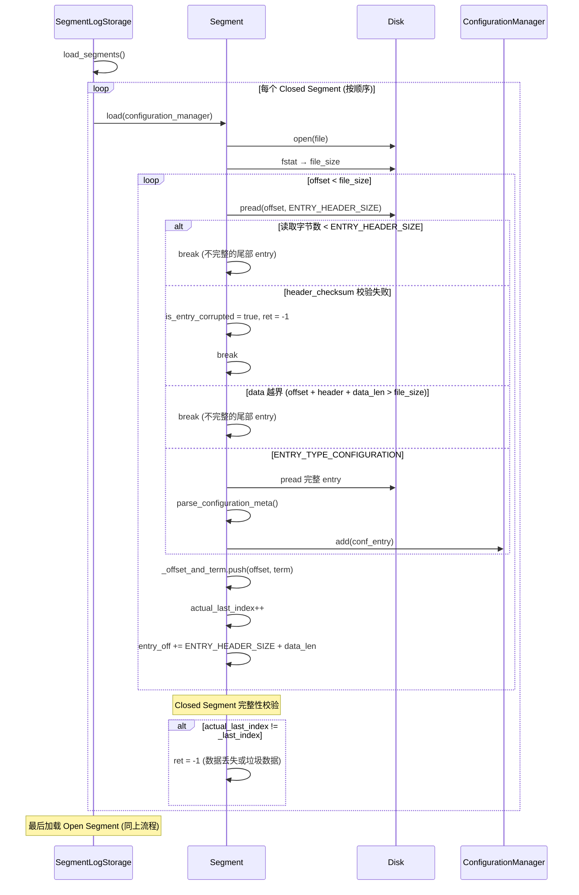
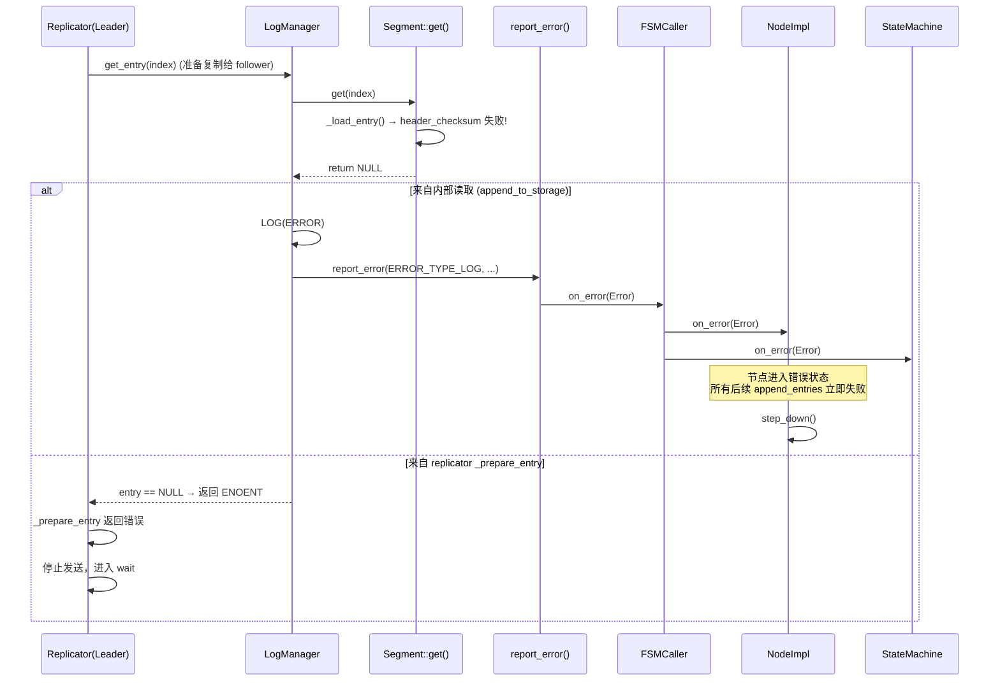
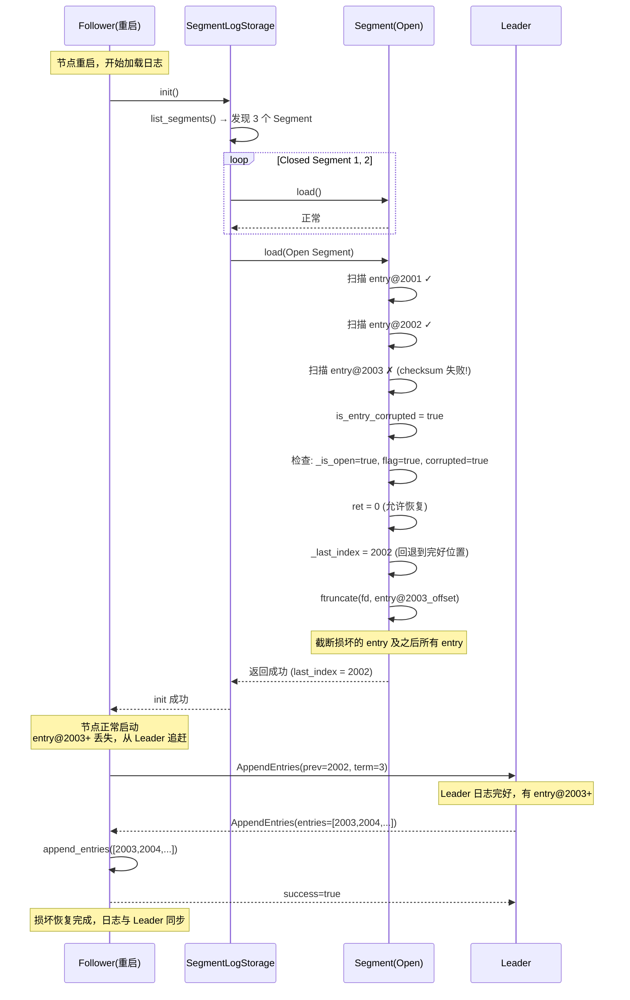
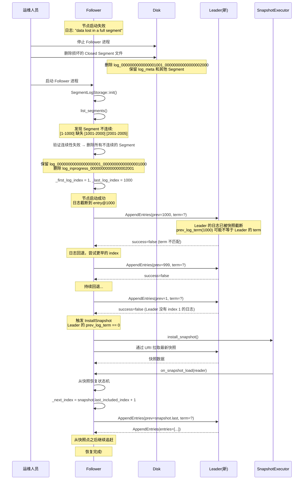
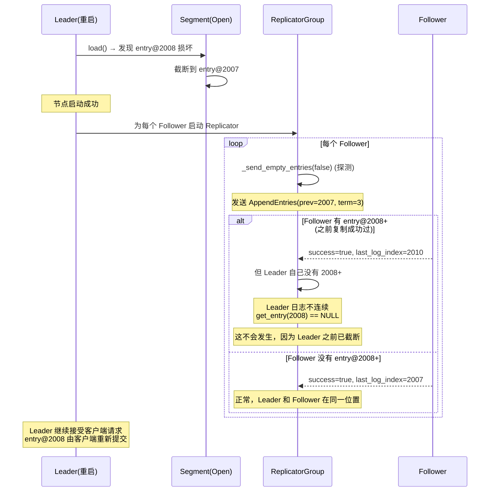
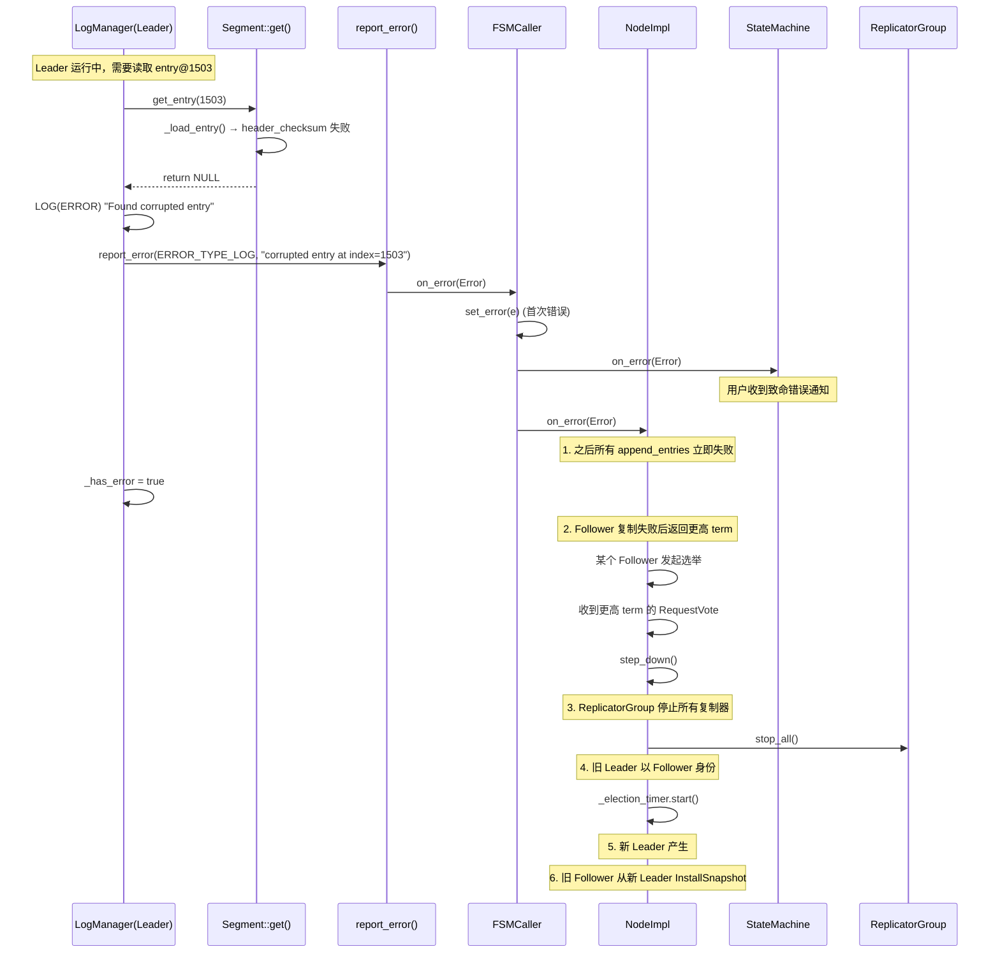
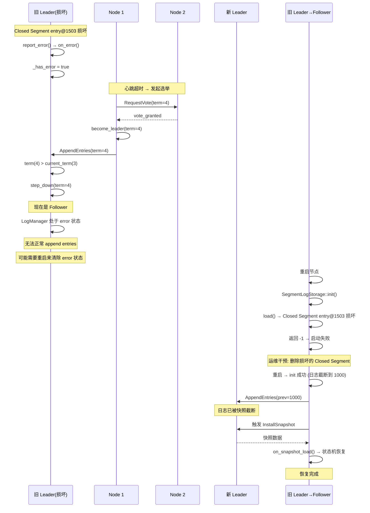
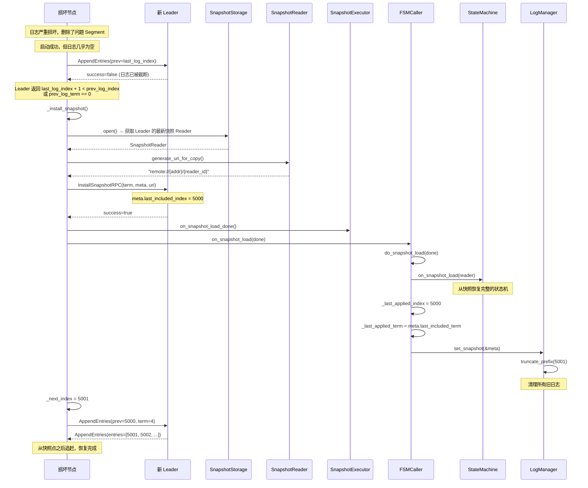

# braft 日志损坏检测与恢复机制分析

## 目录

1. [概述](#1-概述)
2. [日志条目的磁盘校验格式](#2-日志条目的磁盘校验格式)
3. [损坏识别的三种时机](#3-损坏识别的三种时机)
4. [启动加载时的损坏检测](#4-启动加载时的损坏检测)
5. [运行中读取时的损坏检测](#5-运行中读取时的损坏检测)
6. [场景一：Follower Open Segment 损坏](#6-场景一follower-open-segment-损坏)
7. [场景二：Follower Closed Segment 损坏](#7-场景二follower-closed-segment-损坏)
8. [场景三：Leader Open Segment 损坏](#8-场景三leader-open-segment-损坏)
9. [场景四：Leader Closed Segment 损坏](#9-场景四leader-closed-segment-损坏)
10. [InstallSnapshot 全量恢复流程](#10-installsnapshot-全量恢复流程)
11. [错误上报与状态传播](#11-错误上报与状态传播)
12. [check_consistency 一致性检查](#12-check_consistency-一致性检查)
13. [损坏恢复策略总结](#13-损坏恢复策略总结)
14. [配置参数与最佳实践](#14-配置参数与最佳实践)
15. [与其他实现对比](#15-与其他实现对比)
16. [源码索引](#16-源码索引)

---

## 1. 概述

日志数据损坏是分布式系统不可避免的物理故障（如磁盘坏块、位翻转、写入半完成等）。braft 通过以下机制应对：

1. **双重校验**：每个日志条目携带 `header_checksum` 和 `data_checksum`，读取时立即检测损坏
2. **启动扫描**：节点启动时全量扫描所有 Segment，发现损坏后决定截断或报错
3. **不可变原则**：损坏的日志条目不会被就地修复，而是截断后从正确数据源（Leader 或快照）重新获取
4. **自动恢复**：Open Segment 损坏可自动截断；Closed Segment 损坏需配合 InstallSnapshot 恢复
5. **错误上报**：运行中发现损坏时，通过 `report_error()` → `on_error()` 链路通知状态机和节点

---

## 2. 日志条目的磁盘校验格式

```
偏移    大小        字段                    校验覆盖范围
──────────────────────────────────────────────────────────
0       8 bytes     term (int64)
8       4 bytes     meta_field              ┐
12      4 bytes     data_len                ├─ header_checksum 覆盖
16      4 bytes     data_checksum           │  (前 20 字节)
20      4 bytes     header_checksum         ┘
──────────────────────────────────────────────────────────
24      data_len    data (用户负载)          data_checksum 覆盖
```

### 校验类型

```cpp
// log.cpp:70-73
CHECKSUM_MURMURHASH32 = 0   // 默认（非硬件加速时）
CHECKSUM_CRC32 = 1          // 有硬件 CRC32 加速时自动选择
```

选择逻辑在 `SegmentLogStorage::init()` 中：

```cpp
// log.cpp:696-702
if (butil::crc32c_is_available()) {
    _checksum_type = CHECKSUM_CRC32;
} else {
    _checksum_type = CHECKSUM_MURMURHASH32;
}
```

### 校验验证函数

```cpp
// log.cpp:200-204 — Header 校验
if (!verify_checksum(tmp.checksum_type,
                    p, ENTRY_HEADER_SIZE - 4, header_checksum)) {
    LOG(ERROR) << "Found corrupted header at offset=" << offset;
    return -1;
}

// log.cpp:221-228 — Data 校验
if (!verify_checksum(tmp.checksum_type, buf, tmp.data_checksum)) {
    LOG(ERROR) << "Found corrupted data at offset=" << offset + ENTRY_HEADER_SIZE;
    return -1;
}
```

---

## 3. 损坏识别的三种时机

```
┌──────────────────────────────────────────────────────────────────┐
│  时机 1: 节点启动 — Segment::load()                               │
│  ─────────────────────────────                                    │
│  扫描每个 Segment 的所有 entry，逐条校验 header + data checksum     │
│  Open Segment: 损坏 → 可截断恢复                                   │
│  Closed Segment: 损坏 → 硬错误，节点启动失败                        │
│  触发频率: 每次节点重启                                            │
│  检测范围: 全量（所有 Segment 文件）                                │
├──────────────────────────────────────────────────────────────────┤
│  时机 2: 运行中读取 — Segment::get()                               │
│  ─────────────────────────────                                    │
│  读取指定 entry 时校验 header + data checksum                      │
│  损坏 → 返回 NULL → 触发 report_error() → on_error()             │
│  触发频率: 复制给 follower / 快照加载 / AppendEntries 填充         │
│  检测范围: 单条 entry（按需）                                      │
├──────────────────────────────────────────────────────────────────┤
│  时机 3: 运行中写入 — 无校验                                       │
│  ─────────────────────────────                                    │
│  写入时计算并写入 checksum，但不做读取回验                          │
│  依赖 OS 的 fdatasync 保证数据落盘                                  │
│  如果写入成功但数据损坏 → 时机 1 或 2 检测                         │
└──────────────────────────────────────────────────────────────────┘
```

---

## 4. 启动加载时的损坏检测

### 4.1 Segment::load() 核心扫描逻辑



### 4.2 三种错误类型

```cpp
// log.cpp:291-334 的错误分支

// 错误 1: header_checksum 失败 (rc < 0)
if (rc < 0) {
    is_entry_corrupted = true;
    ret = rc;
    break;
}

// 错误 2: 不完整的 entry (rc > 0 或 offset + skip_len > file_size)
if (rc > 0) break;  // 读取不够
if (entry_off + skip_len > file_size) break;  // 数据越界

// 错误 3: Closed Segment 完整性不匹配 (log.cpp:336-349)
if (actual_last_index < last_index) {
    // 数据丢失
    ret = -1;
} else if (actual_last_index > last_index) {
    // 垃圾数据
    ret = -1;
}
```

### 4.3 Open vs Closed 的不同处理

```cpp
// log.cpp:352-359
if (ret != 0) {
    if (!_is_open || !FLAGS_raft_recover_log_from_corrupt || !is_entry_corrupted) {
        return ret;  // Closed / 非损坏 / 未开启恢复 → 硬错误
    } else {
        ret = 0;     // Open + 损坏 + 开启恢复 → 截断恢复
    }
}

// log.cpp:361-363
if (_is_open) {
    _last_index = actual_last_index;  // 更新为最后一个完好的 index
}

// log.cpp:366-370 — 截断不完整的尾部
if (entry_off != file_size) {
    ftruncate_uninterrupted(_fd, entry_off);
}
```

**决策矩阵**：

| Segment 类型 | 损坏类型 | `raft_recover_log_from_corrupt` | 结果 |
|-------------|---------|-------------------------------|------|
| Open | header/data checksum 失败 | true | 截断到上一个完好 entry，启动成功 |
| Open | header/data checksum 失败 | false | 返回 -1，节点启动失败 |
| Open | 不完整尾部 | 任意 | ftruncate 截断，正常 |
| Closed | header/data checksum 失败 | 任意 | 返回 -1，节点启动失败 |
| Closed | 实际 last_index < 期望 | 任意 | 返回 -1（数据丢失） |
| Closed | 实际 last_index > 期望 | 任意 | 返回 -1（垃圾数据） |

---

## 5. 运行中读取时的损坏检测

### 5.1 Segment::get() 读取路径

```cpp
// log.cpp:469-526
LogEntry* Segment::get(const int64_t index) {
    LogMeta meta;
    if (_get_meta(index, &meta) != 0) return NULL;

    EntryHeader header;
    butil::IOBuf data;
    int rc = _load_entry(meta.offset, &header, &data, meta.length);
    if (rc != 0) {
        LOG(ERROR) << "Found corrupted entry at index=" << index;
        return NULL;  // 损坏返回 NULL
    }
    // ... 构造 LogEntry
}
```

### 5.2 损坏触发链



---

## 6. 场景一：Follower Open Segment 损坏

**前提**：损坏发生在 Open Segment（日志尾部），且 `raft_recover_log_from_corrupt=true`

### 6.1 自动恢复流程



### 6.2 恢复条件分析

```
日志布局 (Follower 损坏前):
  [Closed: 1-1000] [Closed: 1001-2000] [Open: 2001-2010]
                                           ↑
                                     entry@2008 损坏

截断后:
  [Closed: 1-1000] [Closed: 1001-2000] [Open: 2001-2007]
                                           ↑
                                     从 Leader 复制 2008-2010

关键条件:
  ✓ 损坏在 Open Segment（尾部）
  ✓ raft_recover_log_from_corrupt = true
  ✓ entry@2008 之后的条目可以从 Leader 重新获取
  ✓ entry@2008 之前的数据完好
  ✓ 如果 2008-2010 已提交 → 客户端可能收到重复 apply（幂等性由用户保证）
```

---

## 7. 场景二：Follower Closed Segment 损坏

**前提**：损坏发生在 Closed Segment 中，entry 已经被提交

### 7.1 问题分析

```
日志布局 (Follower):
  [Closed: 1-1000] [Closed: 1001-2000] [Open: 2001-2005]
                      ↑
                entry@1503 header_checksum 失败

load() 检测:
  Closed Segment 校验: actual_last_index(1502) < _last_index(2000)
  → "data lost in a full segment"
  → ret = -1
  → 节点启动失败!
```

Closed Segment 的损坏无法通过截断恢复，因为这意味着丢失已提交的数据。节点会拒绝启动。

### 7.2 手动恢复流程



### 7.3 替代方案：直接全部清除

如果日志损坏严重，可以直接删除所有 Segment 文件，只保留 `log_meta`，然后完全依赖 InstallSnapshot：

```
1. 停止节点
2. 删除所有 log_* 和 log_inprogress_* 文件
3. 保留 log_meta（或也删除，让它从空开始）
4. 启动节点（空日志状态）
5. 自动触发 InstallSnapshot
```

---

## 8. 场景三：Leader Open Segment 损坏

**前提**：Leader 的 Open Segment（日志尾部）出现损坏

### 8.1 分析

```
Leader 日志:
  [Closed: 1-1000] [Closed: 1001-2000] [Open: 2001-2010]
                                           ↑
                                     entry@2008 损坏

关键问题: entry@2008 是否已经 committed?
```

**情况 A：entry@2008 未提交**

```
截断后:
  [Closed: 1-1000] [Closed: 1001-2000] [Open: 2001-2007]

影响:
  - entry@2008-2010 未提交 → 客户端会超时重试
  - Leader 的 committed_index 仍为 2007（假设）
  - 对已提交的数据没有影响
  - Follower 也没有 entry@2008+（因为未提交）
```

**情况 B：entry@2008 已提交但未 apply**

```
截断后:
  - Leader 丢失已提交但未 apply 的 entry
  - 需要 Follower 回传这些 entry
  - 但 Follower 也可能没有这些 entry（Leader 还没来得及复制）
  - 实际上: 已提交 = 多数派有，所以至少一个 Follower 有
```

### 8.2 恢复流程



**注意**：Open Segment 损坏只影响未完全复制的条目。如果条目已提交，说明多数派 Follower 已有这些条目，客户端重试时会发现重复（幂等性由用户保证）。

---

## 9. 场景四：Leader Closed Segment 损坏

**前提**：Leader 的 Closed Segment 中的已提交日志出现损坏。这是最严重的情况。

### 9.1 错误传播链



### 9.2 report_error() 的全局影响

```cpp
// log_manager.cpp:936-945
void LogManager::report_error(int error_code, const char* fmt, ...) {
    _has_error.store(true, butil::memory_order_relaxed);
    Error e;
    e.set_type(ERROR_TYPE_LOG);
    e.status().set_error(error_code, fmt, ap);
    _fsm_caller->on_error(e);
}
```

一旦 `_has_error = true`：

```cpp
// log_manager.cpp:410-417
int LogManager::append_entries(...) {
    if (_has_error) {
        // 所有后续追加立即失败
        return -1;
    }
}
```

### 9.3 自动恢复流程



---

## 10. InstallSnapshot 全量恢复流程

当日志损坏严重（Closed Segment），InstallSnapshot 是最终的恢复手段：



---

## 11. 错误上报与状态传播

### 11.1 错误类型

```cpp
// storage.h 中定义
ERROR_TYPE_NONE      = 0   // 无错误
ERROR_TYPE_LOG       = 1   // 日志存储错误（损坏、IO 错误等）
ERROR_TYPE_STATE_MACHINE = 2  // 状态机错误
ERROR_TYPE_SNAPSHOT  = 3   // 快照错误
```

### 11.2 传播链路

```
Segment::get() 返回 NULL (损坏检测)
  │
  ▼
LogManager::append_to_storage() 检测失败
  │
  ▼
LogManager::report_error(ERROR_TYPE_LOG, ...)     [log_manager.cpp:936]
  │
  ├── _has_error.store(true)                        [后续 append 立即失败]
  │
  ▼
FSMCaller::on_error(Error)                          [fsm_caller.cpp:231]
  │ (URGENT 优先级提交)
  ▼
ExecutionQueue → FSMCaller::do_on_error()          [fsm_caller.cpp:244]
  │
  ▼
FSMCaller::set_error(Error)                         [fsm_caller.cpp:249]
  │
  ├── _fsm->on_error(Error)                         [通知用户状态机]
  │
  └── _node->on_error(Error)                       [通知 NodeImpl]
       │
       └── (Leader) step_down()                    [Leader 退位]
```

### 11.3 错误后的行为

| 组件 | 行为 |
|------|------|
| LogManager | `_has_error = true`，所有 `append_entries()` 返回 -1 |
| BallotBox | `clear_pending_tasks()`，所有用户 closure 以 EPERM 失败 |
| FSMCaller | 不再投递 COMMITTED 任务，直到错误清除 |
| ReplicatorGroup | `stop_all()`，停止所有 Follower 复制 |
| NodeImpl | `step_down()`，退为 Follower |
| StateMachine | `on_error(e)` 回调，用户执行清理逻辑 |

---

## 12. check_consistency 一致性检查

除了损坏检测，braft 还提供了主动的一致性检查接口：

```cpp
// log_manager.cpp:947-975
butil::Status LogManager::check_consistency() {
    // 1. 检查 _first_log_index > 0
    // 2. 检查 _last_log_index >= 0
    // 3. 如果无快照，检查日志从 1 开始连续
    // 4. 如果有快照，检查日志从 last_snapshot_index + 1 开始连续
    // 5. 检查 _disk_id 在日志范围内
    // 6. 检查 _applied_id <= _disk_id
    // 7. 检查 _applied_id >= _last_snapshot_id
}
```

**检查维度**：

| 检查项 | 含义 |
|--------|------|
| `_first_log_index > 0` | 日志不为空 |
| `_last_log_index >= _first_log_index - 1` | 范围有效 |
| `first_log_index == 1` (无快照) | 无快照时日志必须从 1 开始 |
| `first_log_index == last_snapshot_index + 1` (有快照) | 日志与快照无间隙 |
| `_disk_id` 在范围内 | 刷盘位置有效 |
| `_applied_id <= _disk_id` | 已 apply ≤ 已刷盘 |
| `_applied_id >= _last_snapshot_id` | 已 apply ≥ 快照位置 |

---

## 13. 损坏恢复策略总结

```
┌───────────────────────────────────────────────────────────────────┐
│                     损坏恢复决策树                                  │
├───────────────────────────────────────────────────────────────────┤
│                                                                   │
│  损坏发生在哪里？                                                  │
│  ├── Open Segment (尾部)                                          │
│  │   ├── 节点启动时检测                                            │
│  │   │   ├── raft_recover_log_from_corrupt = true                  │
│  │   │   │   └── ✅ 自动截断恢复，从 Leader 重新复制               │
│  │   │   └── raft_recover_log_from_corrupt = false                 │
│  │   │       └── ❌ 节点启动失败                                   │
│  │   └── 运行中检测                                               │
│  │       └── report_error() → 退位 → 重启 → 启动时截断           │
│  │                                                                  │
│  └── Closed Segment (中间)                                         │
│      ├── 节点启动时检测                                            │
│      │   └── ❌ 节点启动失败 (硬错误)                               │
│      │       └── 运维干预: 删除损坏文件 → 重启                     │
│      │           └── InstallSnapshot 全量恢复                      │
│      └── 运行中检测                                               │
│          └── report_error() → 退位 → 新 Leader 上任               │
│              └── 重启 → 启动失败 → 删除文件 → InstallSnapshot      │
│                                                                   │
│  谁损坏了？                                                        │
│  ├── Follower 损坏                                                │
│  │   └── 从 Leader 获取数据恢复 (AppendEntries / InstallSnapshot)  │
│  │                                                                  │
│  └── Leader 损坏                                                   │
│      ├── report_error() → 退位                                     │
│      └── 新 Leader 产生 → 旧 Leader 以 Follower 恢复              │
│                                                                   │
│  核心原则: 不修复，截断 + 重新获取                                  │
│  日志是不可变的，损坏数据只能被覆盖，不能被就地修复                  │
└───────────────────────────────────────────────────────────────────┘
```

### 各场景对比

| 维度 | Follower Open 损坏 | Follower Closed 损坏 | Leader Open 损坏 | Leader Closed 损坏 |
|------|-------------------|---------------------|------------------|--------------------|
| 严重程度 | 低 | 高 | 中 | 极高 |
| 自动恢复 | 是（截断） | 否（需运维） | 是（截断） | 否（需运维） |
| 已提交数据丢失 | 可能 | 是 | 可能 | 是 |
| 恢复方式 | AppendEntries 追赶 | InstallSnapshot | 客户端重试 | InstallSnapshot |
| 客户端感知 | 无（幂等重试） | 无 | 超时重试 | 超时重试 |
| 需要运维干预 | 否 | 是（删除文件） | 否 | 是（删除文件+重启） |
| 数据完整性保证 | Raft 日志匹配 | 快照一致性 | Raft 日志匹配 | 快照一致性 |

---

## 14. 配置参数与最佳实践

### 关键配置

| 参数 | 默认值 | 说明 | 建议 |
|------|--------|------|------|
| `raft_recover_log_from_corrupt` | `true` | Open Segment 损坏时自动截断 | 保持开启 |
| `raft_sync` | `true` | 每次 batch 后 fdatasync | 必须开启 |
| `raft_sync_policy` | `0` (立即) | 0=每批次 sync | 保持 |
| `raft_sync_meta` | `false` | meta 文件是否 sync | 建议开启 |
| `raft_enable_leader_lease` | `false` | Leader Lease 功能 | 按需 |
| `max_clock_drift_ms` | `0` | 时钟漂移容忍 | 按环境配置 |

### 最佳实践

1. **保持 `raft_recover_log_from_corrupt=true`**：自动处理 Open Segment 损坏，避免人工干预
2. **使用 CRC32 checksum**：有硬件加速时自动启用，校验更快
3. **启用 `raft_sync`**：确保每次写入后 fdatasync，减少半写导致的"不完整 entry"
4. **定期快照**：快照越小，InstallSnapshot 恢复越快
5. **监控 `on_error` 回调**：用户 StateMachine 应在 `on_error` 中记录日志、触发告警
6. **客户端幂等**：确保 `on_apply` 能正确处理重复 apply（如 entry@2008 先 apply 后被截断又重新 apply）
7. **磁盘健康监控**：使用 SMART 检测坏块，提前预警

---

## 15. 与其他实现对比

| 特性 | braft | etcd/raft (WAL) | RocksDB | CDS |
|------|-------|-----------------|---------|-----|
| 校验方式 | header_crc + data_crc | record_crc + data_crc | block_crc | RGEntry CRC |
| 启动扫描 | 全量扫描所有 Segment | 全量扫描 WAL | 扫描 MANIFEST | 扫描日志 |
| 损坏恢复 | 截断 + InstallSnapshot | 截断 + 快照 | 删除损坏文件 | 截断 + Raft InstallSnapshot |
| 运行中检测 | get() 时校验 | 读取时校验 | 读取时校验 | 读取时校验 |
| 错误上报 | report_error → on_error | 直接 panic | LOG(FATAL) | report_error |
| 用户通知 | on_error 回调 | panic | 无 | on_error 回调 |
| 配置条目恢复 | ConfigurationManager 重建 | 无专门处理 | 无 | Master Raft 恢复 |
| 半写处理 | ftruncate 截断 | ftruncate 截断 | ftruncate 截断 | CRC 校验失败 |

---

## 16. 源码索引

### 核心实现文件

| 文件 | 行号 | 核心函数 |
|------|------|----------|
| `src/braft/log.cpp` | 81-95 | `EntryHeader` 结构定义 |
| `src/braft/log.cpp` | 130-172 | `verify_checksum()` / `get_checksum()` |
| `src/braft/log.cpp` | 174-232 | `Segment::_load_entry()` — 校验 header + data |
| `src/braft/log.cpp` | 259-377 | `Segment::load()` — 启动扫描与损坏检测 |
| `src/braft/log.cpp` | 336-349 | Closed Segment 完整性校验 |
| `src/braft/log.cpp` | 352-358 | Open/Closed 不同处理决策 |
| `src/braft/log.cpp` | 365-370 | 不完整 entry 截断 |
| `src/braft/log.cpp` | 469-526 | `Segment::get()` — 运行中读取与校验 |
| `src/braft/log.cpp` | 696-702 | Checksum 类型自动选择 |
| `src/braft/log_manager.cpp` | 936-945 | `LogManager::report_error()` — 错误上报 |
| `src/braft/log_manager.cpp` | 947-975 | `LogManager::check_consistency()` — 一致性检查 |
| `src/braft/fsm_caller.cpp` | 231-242 | `FSMCaller::on_error()` — URGENT 错误投递 |
| `src/braft/fsm_caller.cpp` | 249-261 | `FSMCaller::set_error()` — 首次错误处理 |
| `src/braft/snapshot_executor.cpp` | 402-450 | `install_snapshot()` — 全量恢复 |
| `src/braft/snapshot_executor.cpp` | 367-429 | `do_snapshot_load()` — 加载快照到状态机 |
