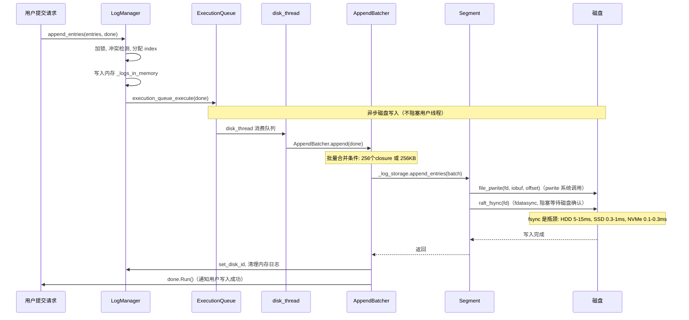
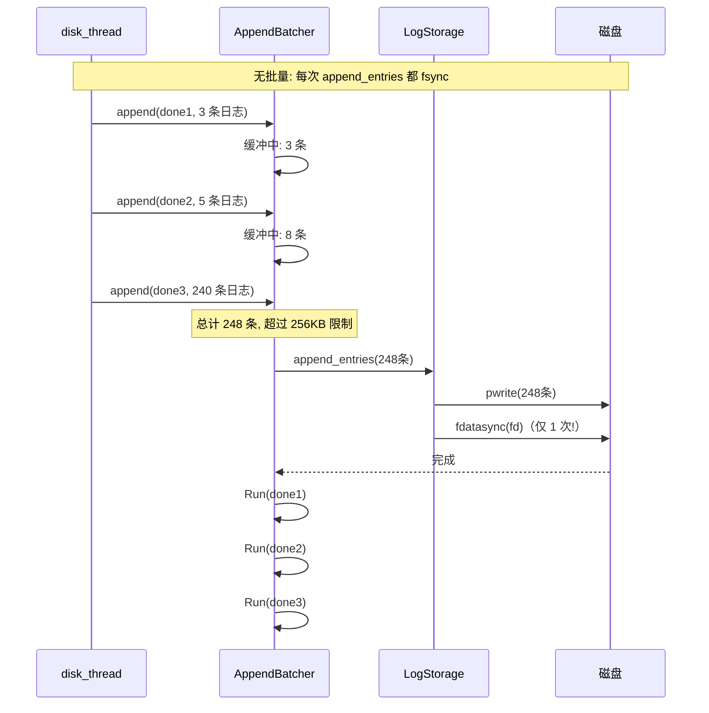
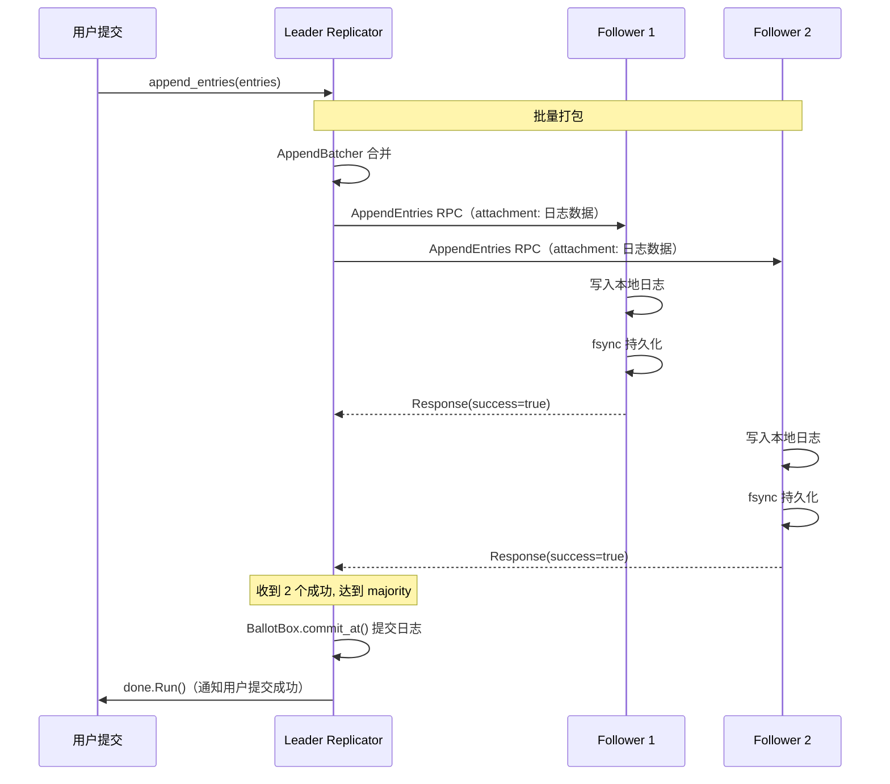
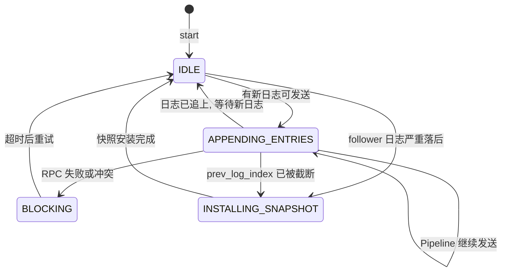
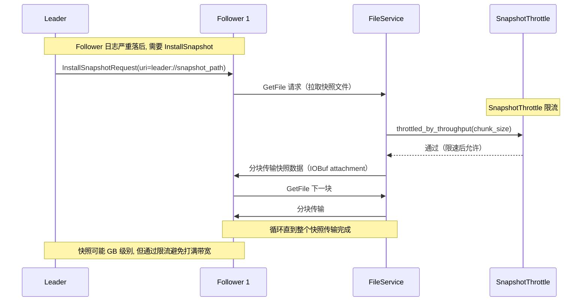

# braft 日志落盘 I/O 与复制网络带宽分析

## 目录

1. [概述](#1-概述)
2. [日志落盘机制与 I/O 消耗](#2-日志落盘机制与-io-消耗)
3. [日志复制机制与网络带宽消耗](#3-日志复制机制与网络带宽消耗)
4. [I/O 与网络的综合影响](#4-io-与网络的综合影响)
5. [braft 提供的优化手段汇总](#5-braft-提供的优化手段汇总)
6. [生产环境优化建议](#6-生产环境优化建议)
7. [总结](#7-总结)

---

## 1. 概述

braft 作为 Raft 共识协议的实现，需要解决两个核心问题：

| 问题 | 代价 | 是否可避免 |
|---|---|---|
| 日志必须持久化到磁盘 | 消耗磁盘 I/O，尤其是 fsync | 不可避免（Raft 正确性要求） |
| 日志必须复制到多数节点 | 消耗网络带宽（N-1 倍放大） | 不可避免（Raft 共识要求） |

这两个代价是分布式共识的固有开销，braft 通过多种机制尽量降低影响。

---

## 2. 日志落盘机制与 I/O 消耗

### 2.1 为什么必须落盘

Raft 协议要求日志持久化是正确性的前提。节点崩溃重启后必须能从磁盘恢复日志，才能保证共识不丢数据。

### 2.2 落盘路径



### 2.3 Segment 文件格式

```
磁盘上的日志文件布局:
data/
  log_meta                  ← 记录第一个日志 index
  log_00000000000000000001_00000000000000001000  ← 已关闭的 segment
  log_inprogress_00000000000000001001            ← 正在写入的 open segment

单个 Segment 内部:
  ┌────────────────────────────────────────────────┐
  │ EntryHeader(24B) │ Data(variable) │ EntryHeader │ Data │ ... │
  │  term(8B)        │                │             │      │     │
  │  type(1B)        │                │             │      │     │
  │  checksum(1B)    │                │             │      │     │
  │  reserved(2B)    │                │             │      │     │
  │  data_len(4B)    │                │             │      │     │
  │  data_checksum   │                │             │      │     │
  │  header_checksum │                │             │      │     │
  └────────────────────────────────────────────────┘

最大单 segment: 8MB (raft_max_segment_size)
```

### 2.4 fsync 的 I/O 瓶颈

```c
// src/braft/log.cpp:449
int Segment::sync(bool will_sync, bool has_conf) {
    if (will_sync) {
        if (!FLAGS_raft_sync) { return 0; }
        if (FLAGS_raft_sync_policy == RAFT_SYNC_BY_BYTES
            && FLAGS_raft_sync_per_bytes > _unsynced_bytes
            && !has_conf) {
            return 0;  // 按字节策略, 未达阈值跳过 fsync
        }
        _unsynced_bytes = 0;
        return raft_fsync(_fd);  // fdatasync(fd), 阻塞!
    }
}

// src/braft/fsync.h:30
inline int raft_fsync(int fd) {
    if (FLAGS_raft_use_fsync_rather_than_fdatasync) {
        return fsync(fd);       // fsync: 刷 metadata + data
    } else {
        return fdatasync(fd);   // fdatasync: 只刷 data（更快）
    }
}
```

| 存储介质 | fdatasync 延迟 | 极限写吞吐（单线程） |
|---|---|---|
| 普通 HDD | 5-15ms | ~70-200 KB/s |
| SATA SSD | 0.3-1ms | ~0.5-1.7 MB/s |
| NVMe SSD | 0.1-0.3ms | ~1.7-5 MB/s |
| 带电池写缓存 RAID | ~0.05ms | ~5-10 MB/s |

**fsync 是写入延迟的天花板**。即使批量合并了 256 条日志，最终仍然要等一次 fsync 完成。

### 2.5 AppendBatcher 批量优化



### 2.6 I/O 配置参数

| 参数 | 默认值 | 作用 | I/O 影响 |
|---|---|---|---|
| `raft_sync` | true | 是否调用 fsync | 关闭则不持久化, 崩溃丢数据 |
| `raft_sync_policy` | 0（立即同步） | 0=每次 fsync, 1=按字节 | 1 减少 fsync 次数 |
| `raft_sync_per_bytes` | INT32_MAX | 按字节策略的阈值 | 越小 fsync 越频繁 |
| `raft_max_segment_size` | 8MB | 单 segment 文件大小 | 影响 close/rename 频率 |
| `raft_sync_segments` | false | 关闭 segment 时是否 fsync | false 减少一次额外 fsync |
| `raft_max_append_buffer_size` | 256KB | 批量缓冲区大小 | 越大合并越多, fsync 越少 |
| `raft_leader_batch` | 256 | leader 最大批量数 | 越大合并越好 |

### 2.7 磁盘 I/O 量化估算

```
场景: 3 节点集群, 每秒 10000 条日志, 每条 1KB

磁盘 I/O:
  写数据: 10000 × 1KB = 10 MB/s（pwrite）
  写 EntryHeader: 10000 × 24B = 240 KB/s
  fsync 次数（默认策略）: ~40 次/s（256KB/batch）
  fsync 占比: NVMe 约 40 × 0.2ms = 8ms/s（< 1%）

  总磁盘写入: ~10.3 MB/s

按字节同步策略（raft_sync_policy=1, raft_sync_per_bytes=1MB）:
  fsync 次数: ~10 次/s（1MB/batch）
  磁盘写入: ~10.3 MB/s（相同）
  但崩溃可能丢失最多 1MB 未 fsync 的日志
```

---

## 3. 日志复制机制与网络带宽消耗

### 3.1 复制架构

```
                    ┌──────────┐
                    │  Leader  │
                    └────┬─────┘
              ┌──────────┼──────────┐
              │          │          │
         ┌────┴────┐┌───┴───┐┌────┴────┐
         │Follower1││Foll2  ││Follower3│
         └─────────┘└───────┘└─────────┘

每个 Follower 有一个 Replicator 对象:
  独立的 brpc Channel
  独立的 _next_index（下次发送的日志 index）
  独立的 _wait_id（等待新日志的通知）
  独立的状态机（IDLE/APPENDING/BLOCKING/INSTALLING）
```

### 3.2 AppendEntries RPC 结构

```protobuf
// src/braft/raft.proto

// protobuf 头部（很小, 几十字节）
message AppendEntriesRequest {
    required string group_id = 1;
    required string server_id = 2;
    required string peer_id = 3;
    required int64 term = 4;
    required int64 prev_log_term = 5;
    required int64 prev_log_index = 6;
    repeated EntryMeta entries = 7;  // 元数据数组
    required int64 committed_index = 8;
}

// 日志数据放在 brpc attachment 中（IOBuf 零拷贝, 不经过 protobuf 序列化）
message EntryMeta {
    required int64 term = 1;
    required EntryType type = 2;
    repeated string peers = 3;  // 仅配置变更日志
    optional int64 data_len = 4;
}
```

**关键设计：日志数据（IOBuf）通过 brpc attachment 传输，不走 protobuf 序列化**，避免内存拷贝。

### 3.3 复制完整流程



### 3.4 Replicator 状态机



### 3.5 网络带宽放大

```
核心公式: 带宽放大倍数 = N - 1

3 节点集群（1 Leader + 2 Follower）:
  用户写入 1KB → Leader 写磁盘 1KB
  Leader → Follower1: ~1KB
  Leader → Follower2: ~1KB
  Leader 出口总带宽: 2 × 1KB = 2KB
  放大倍数: 2 倍

5 节点集群:
  Leader 出口总带宽: 4 × 1KB = 4KB
  放大倍数: 4 倍

9 节点集群:
  Leader 出口总带宽: 8 × 1KB = 8KB
  放大倍数: 8 倍
```

### 3.6 网络带宽量化估算

```
场景: 3 节点集群, 每秒 10000 条日志, 每条 1KB

Leader 出口带宽:
  日志数据: 2 × 10000 × 1KB = 20 MB/s
  EntryMeta: 2 × 10000 × 40B ≈ 0.8 MB/s
  RPC 头部: 2 × 10000 × 200B ≈ 4 MB/s
  ─────────────────────────
  总计: ~24.8 MB/s

Follower 入口带宽:
  日志数据: 10000 × 1KB = 10 MB/s
  元数据: ~2.4 MB/s
  ─────────────────────────
  总计: ~12.4 MB/s

5 节点同样场景:
  Leader 出口: ~49.6 MB/s（放大 4 倍）
  Follower 入口: 各 ~12.4 MB/s

心跳开销（50ms 间隔, 空心跳 ~200B）:
  2 Follower × 20次/秒 × 200B = 8 KB/s（可忽略）
```

### 3.7 InstallSnapshot 的带宽冲击



```
快照传输特点:
  - Pull 模式: Follower 主动从 Leader 拉取
  - 分块传输: 每块通过 FileService RPC 传输
  - 限流保护: ThroughputSnapshotThrottle 控制速率
  - 默认不限流: 需要用户配置 SnapshotThrottle

快照带宽消耗:
  假设快照 10GB, 限流 100MB/s → 传输时间 ~100s
  限流 10MB/s → 传输时间 ~1000s（较慢但不影响业务）
```

---

## 4. I/O 与网络的综合影响

### 4.1 延迟链路分析

```
用户提交到确认成功的完整延迟链路:

  ┌──────────────────────────────────────────────────────────┐
  │ 阶段 1: Leader 内存操作（~10us）                          │
  │   序列化 + 内存写入 _logs_in_memory                       │
  ├──────────────────────────────────────────────────────────┤
  │ 阶段 2: Leader 磁盘写入（~0.1-10ms）                     │
  │   pwrite + fdatasync（瓶颈！）                           │
  ├──────────────────────────────────────────────────────────┤
  │ 阶段 3: 网络传输到 Follower（~0.1-1ms, 同机房）           │
  │   AppendEntries RPC + IOBuf attachment                   │
  ├──────────────────────────────────────────────────────────┤
  │ 阶段 4: Follower 磁盘写入（~0.1-10ms）                   │
  │   pwrite + fdatasync（瓶颈！）                           │
  ├──────────────────────────────────────────────────────────┤
  │ 阶段 5: Follower 响应返回 Leader（~0.1-1ms）             │
  │   AppendEntriesResponse                                 │
  ├──────────────────────────────────────────────────────────┤
  │ 阶段 6: Leader 等待 majority 确认（取最慢的 Follower）     │
  │                                                          │
  └──────────────────────────────────────────────────────────┘

  总延迟 = 阶段1 + 阶段2 + max(阶段3+4+5 across followers)

  典型值（NVMe SSD, 同机房）:
    = 10us + 0.2ms + max(0.5ms + 0.2ms + 0.5ms)
    = 10us + 0.2ms + 1.2ms
    ≈ 1.4ms

  典型值（HDD, 同机房）:
    = 10us + 10ms + max(0.5ms + 10ms + 0.5ms)
    ≈ 21ms
```

### 4.2 吞吐瓶颈分析

```
吞吐瓶颈取决于最慢环节:

  ┌──────────────────────┐     ┌──────────────────────┐
  │ 磁盘 I/O 吞吐       │     │ 网络吞吐              │
  │ pwrite + fsync       │     │ AppendEntries RPC    │
  │ Leader: 10 MB/s      │     │ Leader 出口: 20 MB/s │
  │ Follower 各: 10 MB/s │     │ Follower 入口: 10 MB/s│
  └──────────┬───────────┘     └──────────┬───────────┘
             │                            │
             └──────────┬─────────────────┘
                        │
              ┌─────────┴─────────┐
              │ 实际吞吐取较小值   │
              └───────────────────┘

  NVMe SSD 场景: 磁盘 > 网络 → 瓶颈在网络
  HDD 场景: 磁盘 < 网络 → 瓶颈在磁盘 I/O
  千兆网卡场景: 网络 < 磁盘 → 瓶颈在网络带宽
```

### 4.3 Leader 出口带宽是热点

```
Leader 的网络和磁盘压力最大:

  网络: 出口带宽 = (N-1) × 业务写入量
  磁盘: 写入量 = 1 × 业务写入量（+ fsync）

  3 节点: Leader 网络 2x, 磁盘 1x
  5 节点: Leader 网络 4x, 磁盘 1x

  Leader 网络是瓶颈的概率远大于磁盘!
```

---

## 5. braft 提供的优化手段汇总

### 5.1 I/O 优化

| 优化手段 | 机制 | 效果 |
|---|---|---|
| AppendBatcher | 256 个 closure 或 256KB 合并一次 fsync | 减少 fsync 次数 |
| 按字节同步策略 | raft_sync_policy=1, 累积到阈值再 fsync | 减少 fsync 次数 |
| Segment 分段 | 日志分段存储, 关闭 segment 时可选不 fsync | 减少单次 fsync 数据量 |
| IOBuf pwrite | 零拷贝写入, 不经过中间缓冲 | 减少内存拷贝 |
| fdatasync | 默认使用 fdatasync 而非 fsync | 不刷 metadata, 更快 |

### 5.2 网络优化

| 优化手段 | 机制 | 效果 |
|---|---|---|
| 批量 RPC | 一次 RPC 最多 1024 条或 512KB | 减少 RPC 往返次数 |
| IOBuf attachment | 日志数据走 attachment, 不走 protobuf | 零拷贝传输 |
| Pipeline | 支持并行多个 AppendEntries RPC | 提高吞吐（默认关闭） |
| Witness 节点 | Witness 只接收元数据, 不接收数据 | 减少 1 份数据传输 |
| SnapshotThrottle | 限制快照传输速率 | 避免快照打满带宽 |
| 心跳合并 | 空心跳仅携带元数据 | 心跳开销可忽略 |

### 5.3 braft 没有做的优化

| 缺失的优化 | 说明 |
|---|---|
| 日志数据压缩 | 源码中无压缩逻辑, 业务层需自行压缩 |
| 批量 RPC 压缩 | 多条日志合并后也不压缩 |
| 差量复制 | 只传输日志差异, 不传输完整数据（Raft 协议限制） |
| Read-only replica | Follower 也需要完整日志, 无只读副本优化 |

---

## 6. 生产环境优化建议

### 6.1 磁盘优化

```
1. 日志盘和数据盘分离
   braft 日志放 NVMe SSD（减少 fsync 延迟）
   业务数据放 HDD 或 SATA SSD（节省成本）

2. 使用按字节同步策略
   raft_sync_policy=1
   raft_sync_per_bytes=1048576  (1MB)
   崩溃最多丢失 1MB 日志, fsync 次数减少 4 倍

3. 使用带电池写缓存的 RAID 卡
   fsync 延迟从 ~0.3ms 降到 ~0.05ms
   吞吐提升 6 倍

4. 避免日志盘和业务盘共用同一块物理磁盘
   共享磁盘时 fsync 和业务 I/O 互相影响延迟
```

### 6.2 网络优化

```
1. 控制集群节点数
   3 节点: 带宽放大 2 倍（推荐）
   5 节点: 带宽放大 4 倍（容忍 2 节点故障）
   避免不必要的多节点部署

2. 应用层压缩
   提交前压缩业务数据, 减少 Entry data 大小
   压缩率好的场景可减少 50-90% 网络流量

3. 合理设置批量参数
   raft_max_entries_size=1024（默认）
   raft_max_body_size=524288（512KB, 默认）
   数据量小时可适当减小, 数据量大时可适当增大

4. 配置 SnapshotThrottle
   避免快照传输打满网络带宽
   影响正常日志复制

5. 使用 Witness 节点
   不需要数据的节点配置为 Witness
   节省该节点的数据传输带宽
```

### 6.3 不同规模的配置参考

| 规模 | 节点数 | 磁盘建议 | 网络建议 | raft_sync_policy |
|---|---|---|---|---|
| 低吞吐（<1MB/s） | 3 | 普通 SSD | 千兆网卡 | 0（立即同步） |
| 中吞吐（1-50MB/s） | 3 | NVMe SSD | 万兆网卡 | 1（按字节, 1MB） |
| 高吞吐（50-500MB/s） | 3 | NVMe + Battery | 万兆网卡 | 1（按字节, 4MB） |
| 超高吞吐（>500MB/s） | 3 | 多 NVMe + RAID | 25G/100G 网卡 | 1（按字节, 8MB） |

---

## 7. 总结

### 7.1 代价本质

```
Raft 协议的固有代价:
  ┌─────────────────────────────────────────────┐
  │ I/O 代价: 每次提交必须 fsync, 无法避免       │
  │ 原因: 崩溃恢复需要日志持久化                   │
  │ 瓶颈: fsync 延迟（HDD 10ms, NVMe 0.2ms）    │
  ├─────────────────────────────────────────────┤
  │ 网络代价: 每次提交必须复制到 N-1 个节点       │
  │ 原因: 多数派确认才能提交                       │
  │ 瓶颈: Leader 出口带宽 = (N-1) × 写入量        │
  └─────────────────────────────────────────────┘
```

### 7.2 一句话总结

**braft 的日志落盘消耗磁盘 I/O（fsync 是瓶颈），日志复制消耗网络带宽（Leader 出口是热点，N-1 倍放大）。两者都是 Raft 共识协议的固有代价，braft 通过批量合并、IOBuf 零拷贝、可配置同步策略、Pipeline、SnapshotThrottle 等手段尽量降低影响，但无法消除。生产环境中建议日志盘用 NVMe SSD、控制节点数量、应用层压缩来缓解。**
