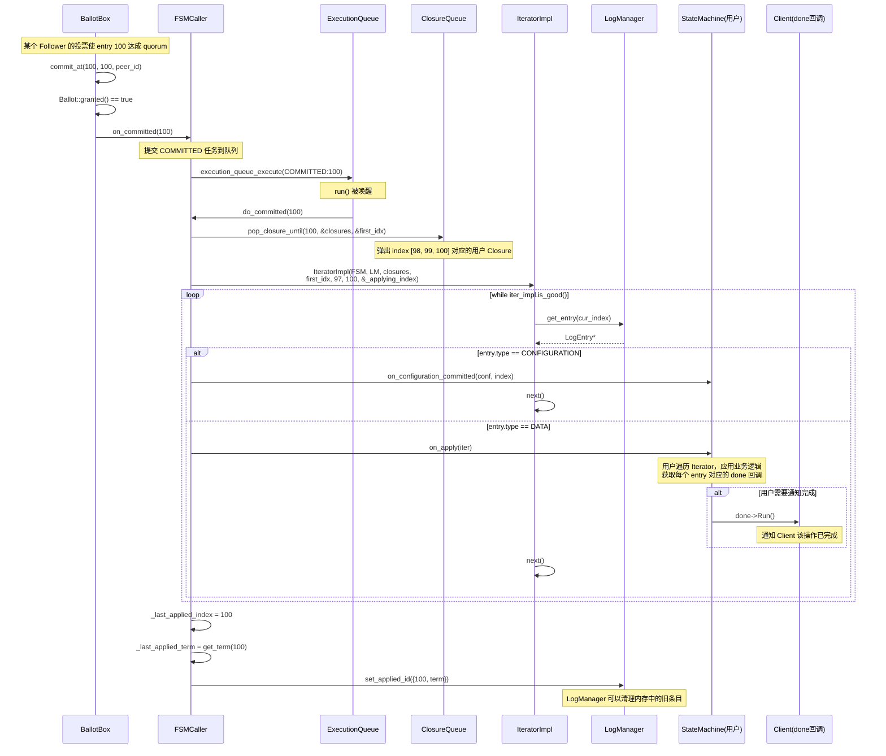
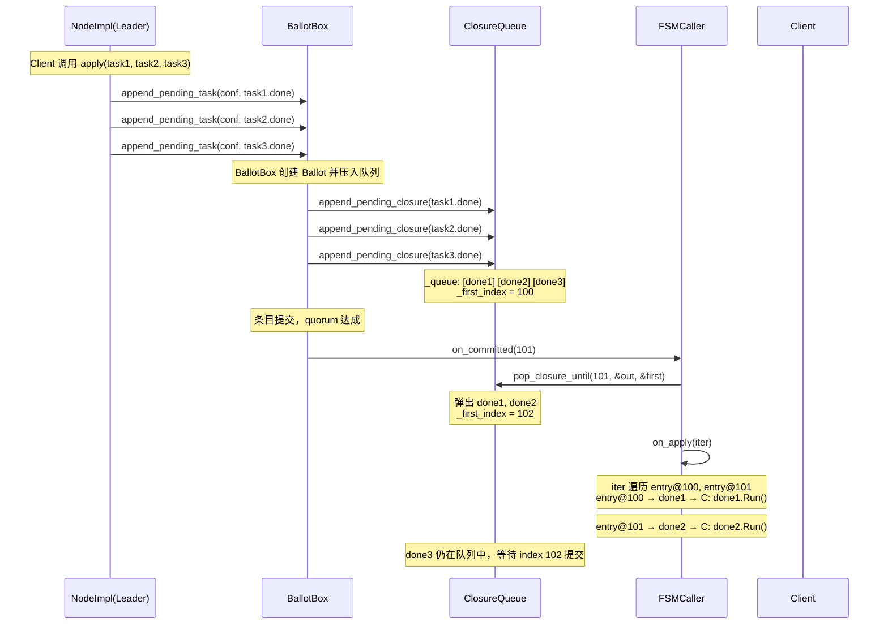
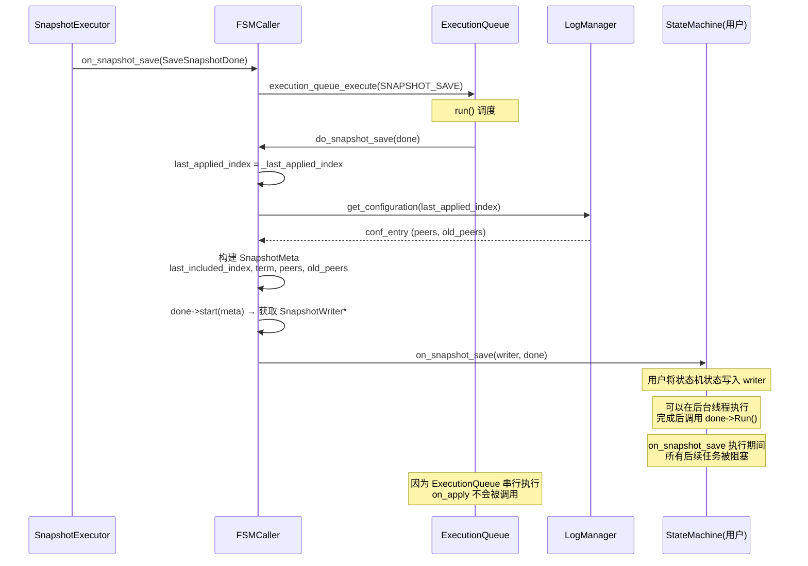
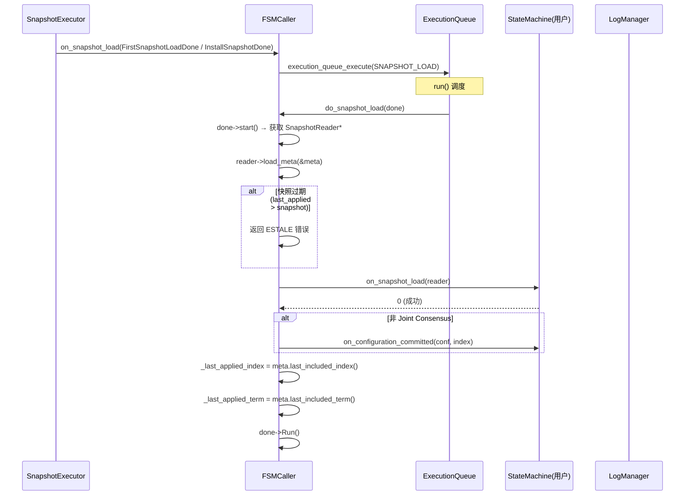
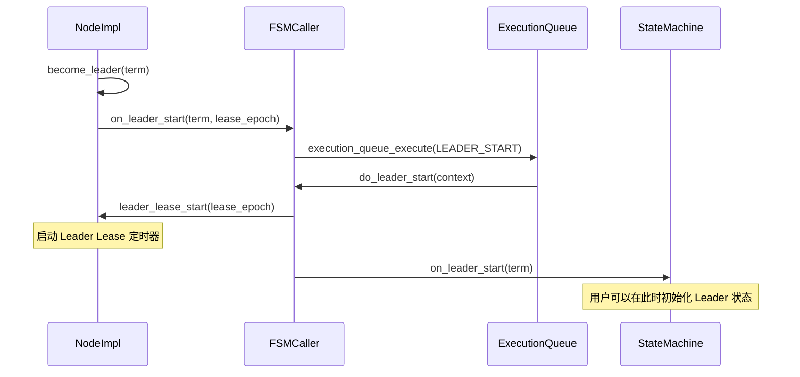
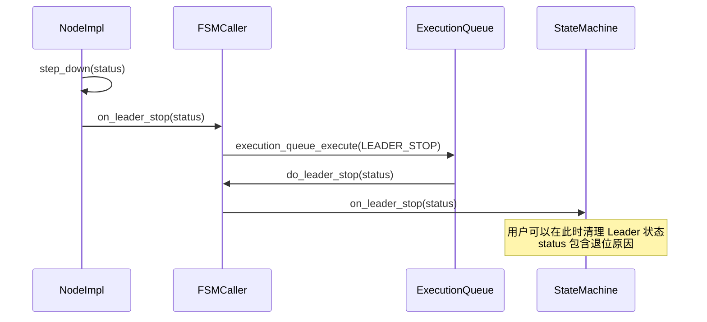
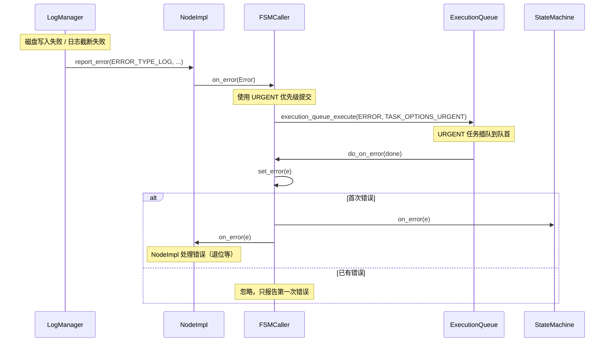
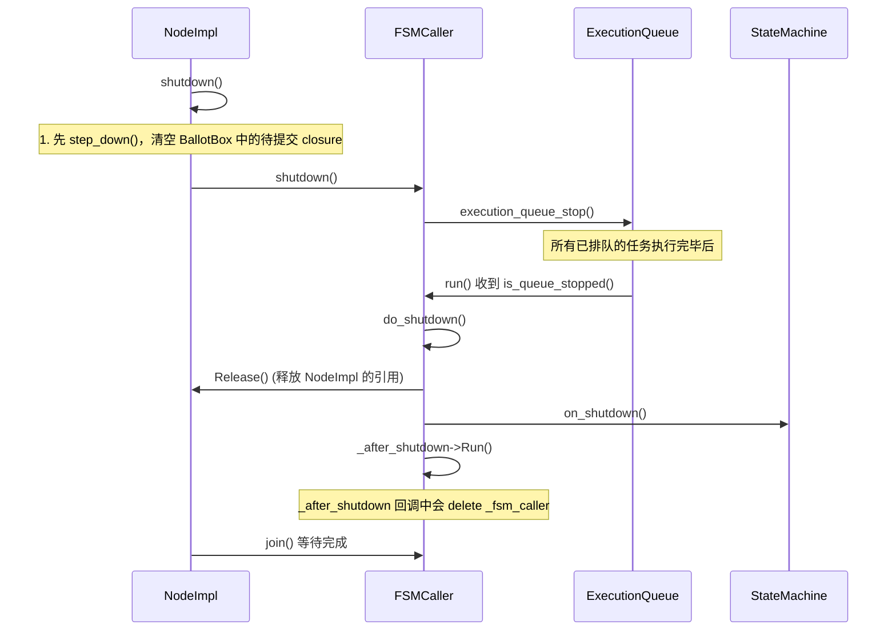
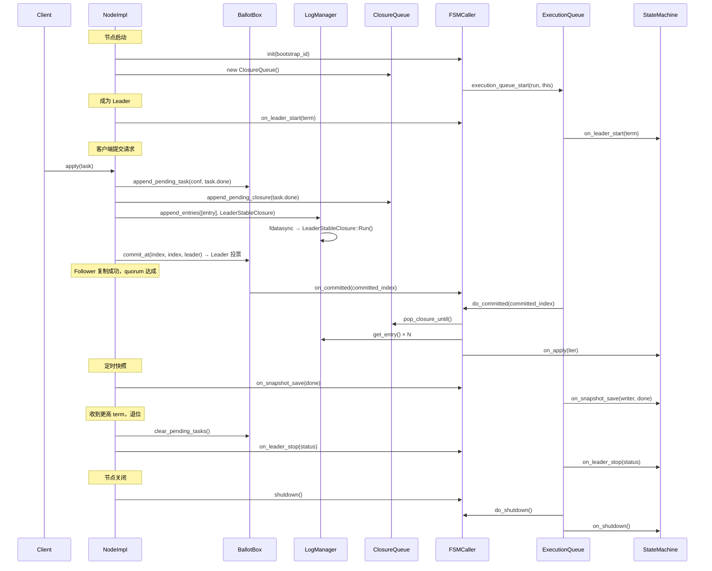

# braft 状态机机制分析

## 目录

1. [概述](#1-概述)
2. [StateMachine 用户接口](#2-statemachine-用户接口)
3. [FSMCaller 架构](#3-fsmcaller-架构)
4. [ExecutionQueue 串行化模型](#4-executionqueue-串行化模型)
5. [ApplyTask 调度机制](#5-applytask-调度机制)
6. [日志提交与应用流程](#6-日志提交与应用流程)
7. [IteratorImpl 迭代器](#7-iteratorimpl-迭代器)
8. [ClosureQueue 用户回调管理](#8-closurequeue-用户回调管理)
9. [快照保存流程（FSM 侧）](#9-快照保存流程fsm-侧)
10. [快照加载流程（FSM 侧）](#10-快照加载流程fsm-侧)
11. [Leader 身份变更通知](#11-leader-身份变更通知)
12. [Follower 跟随关系变更通知](#12-follower-跟随关系变更通知)
13. [错误处理机制](#13-错误处理机制)
14. [Shutdown 关闭流程](#14-shutdown-关闭流程)
15. [完整生命周期时序](#15-完整生命周期时序)
16. [与其他实现对比](#16-与其他实现对比)
17. [源码索引](#17-源码索引)

---

## 1. 概述

braft 的状态机（FSM）机制是 Raft 协议与用户业务逻辑之间的桥梁。核心设计特点：

1. **单线程串行执行**：所有对用户 StateMachine 的回调都通过 `bthread::ExecutionQueue` 串行化，确保用户代码无需处理并发
2. **异步解耦**：日志提交（BallotBox）与状态机应用（FSMCaller）通过 ExecutionQueue 异步解耦
3. **批量合并**：连续的 COMMITTED 任务自动合并为一次 `do_committed()` 调用（最多 512 个）
4. **Closure 追踪**：用户提交的回调通过 ClosureQueue 精确关联到对应的日志 index
5. **错误隔离**：FSM 错误通过专用 URGENT 通道传播，不影响正常提交流程
6. **8 种回调类型**：覆盖 apply、snapshot save/load、leader start/stop、follow change、error、shutdown

---

## 2. StateMachine 用户接口

```cpp
// raft.h:196-268
class StateMachine {
public:
    // 核心方法：应用已提交的日志条目
    virtual void on_apply(Iterator& iter) = 0;

    // 快照保存（用户将状态机状态写入 writer）
    virtual void on_snapshot_save(SnapshotWriter* writer, Closure* done);

    // 快照加载（用户从 reader 恢复状态机）
    virtual int on_snapshot_load(SnapshotReader* reader);

    // Leader 身份变更
    virtual void on_leader_start(int64_t term);
    virtual void on_leader_stop(const butil::Status& status);

    // 配置变更提交通知
    virtual void on_configuration_committed(const Configuration& conf, int64_t index);

    // 跟随关系变更
    virtual void on_start_following(const LeaderChangeContext& ctx);
    virtual void on_stop_following(const LeaderChangeContext& ctx);

    // 错误通知（致命错误，此后不再有回调）
    virtual void on_error(const Error& e);

    // 节点关闭
    virtual void on_shutdown();
};
```

### 关键约束

- **非线程安全**：所有回调在同一个 ExecutionQueue bthread 中串行执行，用户无需加锁
- **阻塞语义**：每个回调阻塞后续所有回调（特别是 `on_snapshot_save` 会阻塞 `on_apply`）
- **on_apply 必须消费完所有条目**：Iterator 必须被遍历到 `!valid()`，否则视为错误

---

## 3. FSMCaller 架构

```
BallotBox                  SnapshotExecutor           NodeImpl
    │                            │                        │
    │ on_committed()             │ on_snapshot_save()     │ on_leader_start()
    │ on_snapshot_save()         │ on_snapshot_load()     │ on_leader_stop()
    │                            │                        │ on_error()
    ▼                            ▼                        ▼
┌──────────────────────────────────────────────────────────────┐
│  FSMCaller                                                   │
│                                                              │
│  公共入口:                                                    │
│    on_committed(committed_index)                             │
│    on_snapshot_save(done)                                    │
│    on_snapshot_load(done)                                    │
│    on_leader_start(term) / on_leader_stop(status)            │
│    on_start_following(ctx) / on_stop_following(ctx)         │
│    on_error(e)          [URGENT]                             │
│    shutdown()                                                 │
│                                                              │
│        │                                                     │
│        ▼  bthread::execution_queue_execute()                 │
│                                                              │
│  ┌────────────────────────────────────────────┐              │
│  │  ExecutionQueue (串行执行)                  │              │
│  │                                            │              │
│  │  run() callback:                           │              │
│  │    COMMITTED × N → do_committed(max_index) │ ← 批量合并   │
│  │    SNAPSHOT_SAVE → do_snapshot_save()       │              │
│  │    SNAPSHOT_LOAD → do_snapshot_load()       │              │
│  │    LEADER_START → do_leader_start()         │              │
│  │    LEADER_STOP  → do_leader_stop()          │              │
│  │    START_FOLLOWING → do_start_following()   │              │
│  │    STOP_FOLLOWING  → do_stop_following()    │              │
│  │    ERROR        → do_on_error()             │              │
│  │    QUEUE_STOPPED → do_shutdown()             │              │
│  └────────────────────────────────────────────┘              │
│        │                                                     │
│        ▼                                                     │
│  ┌────────────────────────────────────────────┐              │
│  │  用户 StateMachine                          │              │
│  │    on_apply(iter)                           │              │
│  │    on_snapshot_save(writer, done)           │              │
│  │    on_snapshot_load(reader)                 │              │
│  │    on_leader_start/stop()                   │              │
│  │    on_error(e)                              │              │
│  │    on_shutdown()                            │              │
│  └────────────────────────────────────────────┘              │
│                                                              │
│  内部状态:                                                    │
│    _last_applied_index / _last_applied_term                   │
│    _applying_index (当前正在 apply 的 index)                  │
│    _error (错误状态)                                          │
└──────────────────────────────────────────────────────────────┘
```

### ApplyTask 类型

```cpp
// fsm_caller.h:130-140
enum TaskType {
    IDLE,
    COMMITTED,           // 日志已提交
    SNAPSHOT_SAVE,       // 保存快照
    SNAPSHOT_LOAD,       // 加载快照
    LEADER_STOP,         // Leader 退位
    LEADER_START,        // 成为 Leader
    START_FOLLOWING,     // 开始跟随新 Leader
    STOP_FOLLOWING,      // 停止跟随旧 Leader
    ERROR                // 致命错误 [URGENT 优先级]
};
```

---

## 4. ExecutionQueue 串行化模型

### 4.1 为什么需要串行化

用户 StateMachine 的 `on_apply`、`on_snapshot_save` 等操作通常涉及修改业务状态（如更新内存数据结构、写本地数据库）。如果并发执行会导致数据竞争和状态不一致。ExecutionQueue 保证了：

1. **同一时刻只有一个任务在执行**
2. **任务按提交顺序执行**
3. **不同来源的任务（BallotBox、SnapshotExecutor、NodeImpl）自动排队**

### 4.2 初始化

```cpp
// fsm_caller.cpp:157-187
int FSMCaller::init(const FSMCallerOptions& options) {
    // 存储 LogManager、StateMachine、ClosureQueue 等引用
    _log_manager = options.log_manager;
    _fsm = options.fsm;
    _closure_queue = options.closure_queue;

    // 从 bootstrap_id 初始化（快照恢复时使用）
    _last_applied_index = options.bootstrap_id.index;
    _last_applied_term = options.bootstrap_id.term;

    // 创建 ExecutionQueue
    bthread::ExecutionQueueOptions exec_queue_opts;
    if (options.usercode_in_pthread) {
        exec_queue_opts.bthread_attr = BTHREAD_ATTR_PTHREAD;
    }
    bthread::execution_queue_start(&_queue_id, &exec_queue_opts,
                                    FSMCaller::run, this);
}
```

---

## 5. ApplyTask 调度机制

### 5.1 run() — 核心调度循环

```cpp
// fsm_caller.cpp:59-141
int FSMCaller::run(void* meta, bthread::TaskIterator<ApplyTask>& iter) {
    FSMCaller* caller = (FSMCaller*)meta;

    if (iter.is_queue_stopped()) {
        caller->do_shutdown();
        return 0;
    }

    int64_t max_committed_index = -1;
    const int batch_size = FLAGS_raft_fsm_caller_commit_batch; // 默认 512

    for (; iter.is_good(); ++iter) {
        ApplyTask& task = *iter;

        if (task.type == COMMITTED) {
            // 连续 COMMITTED 任务合并：只保留最大 index
            max_committed_index = std::max(max_committed_index, task.committed_index);
            if (++counter >= batch_size) {
                // 批量达到上限，flush
                do_committed(max_committed_index);
                max_committed_index = -1;
                counter = 0;
            }
        } else {
            // 非 COMMITTED 任务：先 flush 累积的 COMMITTED
            if (max_committed_index >= 0) {
                do_committed(max_committed_index);
                max_committed_index = -1;
                counter = 0;
            }
            // 按类型分发
            switch (task.type) {
                case SNAPSHOT_SAVE: do_snapshot_save((SaveSnapshotClosure*)task.done); break;
                case SNAPSHOT_LOAD: do_snapshot_load((LoadSnapshotClosure*)task.done); break;
                case LEADER_STOP:  do_leader_stop(*task.status); delete task.status; break;
                case LEADER_START: do_leader_start(*task.leader_start_context); delete ...; break;
                case START_FOLLOWING: do_start_following(*task.leader_change_context); break;
                case STOP_FOLLOWING:  do_stop_following(*task.leader_change_context); break;
                case ERROR: do_on_error((OnErrorClosure*)task.done); break;
            }
        }
    }

    // flush 剩余的 COMMITTED
    if (max_committed_index >= 0) {
        do_committed(max_committed_index);
    }
    return 0;
}
```

### 5.2 批量合并优化

```
ExecutionQueue 收到的任务序列:
  [COMMITTED:100] [COMMITTED:101] [COMMITTED:102] [SNAPSHOT_SAVE] [COMMITTED:103]

合并后执行:
  do_committed(102)    ← 连续 3 个 COMMITTED 合并为一次
  do_snapshot_save()   ← 非 COMMITTED 任务打断合并
  do_committed(103)    ← 后续 COMMITTED 单独执行
```

---

## 6. 日志提交与应用流程



### 6.1 do_committed() 核心逻辑

```cpp
// fsm_caller.cpp:263-319
void FSMCaller::do_committed(int64_t committed_index) {
    if (_error.status().ok()) return;

    // 1. 弹出 ClosureQueue 中已提交的用户回调
    std::vector<Closure*> closure;
    int64_t first_closure_index = 0;
    _closure_queue->pop_closure_until(committed_index, &closure, &first_closure_index);

    // 2. 构建迭代器
    IteratorImpl iter_impl(_fsm, _log_manager, &closure, first_closure_index,
                           _last_applied_index, committed_index, &_applying_index);

    // 3. 逐条 apply
    for (; iter_impl.is_good();) {
        if (iter_impl.entry()->type != ENTRY_TYPE_DATA) {
            // 非 DATA 条目（如 CONFIGURATION）直接处理
            if (iter_impl.entry()->type == ENTRY_TYPE_CONFIGURATION
                && iter_impl.entry()->old_peers == NULL) {
                _fsm->on_configuration_committed(
                    Configuration(*iter_impl.entry()->peers),
                    iter_impl.entry()->id.index);
            }
            if (iter_impl.done()) iter_impl.done()->Run();
            iter_impl.next();
            continue;
        }

        // DATA 条目交给用户
        Iterator iter(&iter_impl);
        _fsm->on_apply(iter);
        // 检查用户是否消费完所有条目
        LOG_IF(ERROR, iter.valid()) << "Iterator is still valid!";
        iter.next();
    }

    // 4. 更新进度
    _last_applied_index.store(committed_index, butil::memory_order_release);
    _last_applied_term = _log_manager->get_term(committed_index);
    _log_manager->set_applied_id(LogId(committed_index, _last_applied_term));
}
```

---

## 7. IteratorImpl 迭代器

### 7.1 结构

```cpp
// fsm_caller.h:42-73
class IteratorImpl {
    StateMachine* _fsm;
    LogManager* _lm;
    std::vector<Closure*>* _closure;
    int64_t _first_closure_index;    // 第一个有用户 closure 的 index
    int64_t _cur_index;              // 当前迭代位置
    int64_t _committed_index;        // 本次 apply 的最大 index
    LogEntry* _cur_entry;            // 当前条目（引用计数）
    butil::atomic<int64_t>* _applying_index;  // 监控用
    Error _error;
};
```

### 7.2 迭代流程

```
IteratorImpl 创建:
  _cur_index = _last_applied_index (= 97)
  调用 next() → _cur_index = 98, get_entry(98) → entry_98

is_good()? → _cur_index(98) <= _committed_index(100) ✓

  用户读取 entry_98
  done() → closure[98 - first_idx] → Client 的回调

  调用 next() → _cur_index = 99, get_entry(99) → entry_99

is_good()? → _cur_index(99) <= 100 ✓

  用户读取 entry_99
  done() → closure[99 - first_idx]

  调用 next() → _cur_index = 100, get_entry(100) → entry_100

is_good()? → _cur_index(100) <= 100 ✓

  用户读取 entry_100
  done() → closure[100 - first_idx]

  调用 next() → _cur_index = 101

is_good()? → _cur_index(101) <= 100 ✗ → 退出循环
```

### 7.3 done() — 获取用户回调

```cpp
// fsm_caller.cpp:590-595
Closure* IteratorImpl::done() const {
    if (_cur_index < _first_closure_index) {
        return NULL;  // 此条目无关联的用户回调（来自复制，非本节点提出）
    }
    return (*_closure)[_cur_index - _first_closure_index];
}
```

**重要**：Follower 上复制的条目没有用户回调（`done()` 返回 NULL），因为它们不是本节点提出的。

### 7.4 set_error_and_rollback() — 错误回滚

```cpp
// fsm_caller.cpp:597-617
void IteratorImpl::set_error_and_rollback(size_t ntail, const butil::Status* st) {
    // 回滚 ntail 个条目
    if (!_cur_entry || _cur_entry->type != ENTRY_TYPE_DATA) {
        _cur_index -= ntail;
    } else {
        _cur_index -= (ntail - 1);  // 当前条目也算一个
    }
    set_error(ERROR_TYPE_STATE_MACHINE, *st);
}
```

---

## 8. ClosureQueue 用户回调管理

### 8.1 数据结构

```
ClosureQueue:
  _first_index = 5
  _queue: [closure@5] [closure@6] [closure@7] [closure@8] [closure@9]

  index 映射: _queue[i] 对应 log index = _first_index + i
```

### 8.2 操作时序



### 8.3 pop_closure_until() 逻辑

```cpp
// closure_queue.cpp:64-85
int ClosureQueue::pop_closure_until(int64_t index, vector<Closure*>* out,
                                     int64_t* out_first_index) {
    BAIDU_SCOPED_LOCK(_mutex);

    if (_queue.empty() || index < _first_index) {
        *out_first_index = index + 1;  // 无 closure 可弹出
        return 0;
    }

    CHECK_LE(index, _first_index + (int64_t)_queue.size() - 1);

    *out_first_index = _first_index;
    for (int64_t i = _first_index; i <= index; ++i) {
        out->push_back(_queue.front());
        _queue.pop_front();
    }
    _first_index = index + 1;
    return 0;
}
```

---

## 9. 快照保存流程（FSM 侧）



### 9.1 do_snapshot_save() 关键点

```cpp
// fsm_caller.cpp:328-358
void FSMCaller::do_snapshot_save(SaveSnapshotClosure* done) {
    int64_t last_applied_index = _last_applied_index.load(butil::memory_order_relaxed);

    SnapshotMeta meta;
    meta.set_last_included_index(last_applied_index);
    meta.set_last_included_term(_last_applied_term);

    // 获取当前配置
    ConfigurationEntry conf_entry;
    _log_manager->get_configuration(last_applied_index, &conf_entry);
    for (auto iter = conf_entry.conf.begin(); ...) {
        *meta.add_peers() = iter->to_string();
    }

    SnapshotWriter* writer = done->start(meta);
    _fsm->on_snapshot_save(writer, done);  // 异步，用户调用 done->Run()
}
```

**阻塞影响**：`on_snapshot_save` 阻塞 `on_apply`，但用户可以通过 COW 状态机在后台完成快照，快速调用 `done->Run()` 返回。

---

## 10. 快照加载流程（FSM 侧）



### 10.1 过期快照保护

```cpp
// fsm_caller.cpp:390-403
LogId last_applied_id;
last_applied_id.index = _last_applied_index.load(butil::memory_order_relaxed);
LogId snapshot_id;
snapshot_id.index = meta.last_included_index();

if (last_applied_id > snapshot_id) {
    // 拒绝加载过期的快照
    done->status().set_error(ESTALE, "Loading a stale snapshot");
    return done->Run();
}
```

---

## 11. Leader 身份变更通知

### 11.1 成为 Leader



### 11.2 退为 Follower



---

## 12. Follower 跟随关系变更通知

### 12.1 开始跟随

**触发时机**：Candidate 收到 AppendEntries 或无 Leader 的 Follower 收到 AppendEntries。

```cpp
// fsm_caller.cpp:491-493
void FSMCaller::do_start_following(const LeaderChangeContext& start_following_context) {
    _fsm->on_start_following(start_following_context);
}
```

### 12.2 停止跟随

**触发时机**：
- 选举超时 / Pre-Vote
- 收到更高 term 的投票请求或 AppendEntries
- 收到 TimeoutNow

```cpp
// fsm_caller.cpp:495-497
void FSMCaller::do_stop_following(const LeaderChangeContext& stop_following_context) {
    _fsm->on_stop_following(stop_following_context);
}
```

---

## 13. 错误处理机制

### 13.1 错误传播路径



### 13.2 set_error() — 只报告首次错误

```cpp
// fsm_caller.cpp:249-261
void FSMCaller::set_error(const Error& e) {
    if (_error.type() != ERROR_TYPE_NONE) {
        return;  // 只报告第一次错误
    }
    _error = e;
    _fsm->on_error(_error);
    _node->on_error(_error);
}
```

### 13.3 pass_by_status() — 快照操作守卫

```cpp
// fsm_caller.cpp:143-155
bool FSMCaller::pass_by_status(Closure* done) {
    if (!_error.status().ok()) {
        // FSMCaller 已处于错误状态
        butil::Status st = _error.status();
        done->status() = st;
        done->Run();  // 直接返回错误
        return false;
    }
    return true;
}
```

---

## 14. Shutdown 关闭流程



### 14.1 关闭顺序保证

```
shutdown() 调用链:
  1. step_down() → clear_pending_tasks() → 所有用户 closure 以 EPERM 失败
  2. _fsm_caller->shutdown() → 停止 ExecutionQueue
  3. _fsm_caller->join() → 等待所有排队任务执行完
  4. do_shutdown() → on_shutdown() → _after_shutdown->Run()
  5. delete _fsm_caller
```

**关键**：先 `step_down()` 再 `shutdown()`，确保不会在 FSMCaller 关闭期间有新的 COMMITTED 任务进入。

---

## 15. 完整生命周期时序



---

## 16. 与其他实现对比

| 特性 | braft | etcd/raft | CDS Blockserver | TiKV (raft-rs) |
|------|-------|-----------|-----------------|----------------|
| 串行化方式 | bthread::ExecutionQueue | Go channel + select | bthread | tokio mpsc channel |
| 批量合并 | 连续 COMMITTED 合并（512） | 无合并 | 无合并 | ready 批量 apply |
| Iterator | 双层实现（IteratorImpl + Iterator） | 直接传递 entry 列表 | 直接传递 | ApplyRes 遍历 |
| 用户回调追踪 | ClosureQueue（线性映射） | ApplyWaiter (map) | Closure | Callback |
| 快照阻塞 apply | 是（串行队列） | 是 | N/A | 是（单线程） |
| 错误优先级 | URGENT 插队 | 直接 panic | report_error | 直接 error |
| 配置变更通知 | on_configuration_committed | 通过 apply 传递 | 无独立通知 | 通过 apply |
| Leader/Follow 通知 | 独立回调 | 通过 apply 传递 | 无 | campaign/lead 变化 |
| Shutdown 保证 | 先 step_down 后 shutdown | stop → apply 通道关闭 | 无 | shutdown Future |
| pthread 模式 | 可选 usercode_in_pthread | 不支持 | 支持 | 不支持 |

---

## 17. 源码索引

### 核心头文件

| 文件 | 核心内容 |
|------|----------|
| `src/braft/raft.h` | `StateMachine` 抽象接口（9 个虚函数） |
| `src/braft/fsm_caller.h` | `FSMCaller` 类、ApplyTask、IteratorImpl |
| `src/braft/closure_queue.h` | `ClosureQueue` 类 |

### 核心实现文件

| 文件 | 行号 | 核心函数 |
|------|------|----------|
| `src/braft/fsm_caller.cpp` | 41-53 | `FSMCaller::FSMCaller()` 构造函数 |
| `src/braft/fsm_caller.cpp` | 59-141 | `FSMCaller::run()` — ExecutionQueue 调度（批量合并） |
| `src/braft/fsm_caller.cpp` | 143-155 | `pass_by_status()` — 快照操作错误守卫 |
| `src/braft/fsm_caller.cpp` | 157-187 | `FSMCaller::init()` — 初始化 ExecutionQueue |
| `src/braft/fsm_caller.cpp` | 189-209 | `shutdown()` / `do_shutdown()` |
| `src/braft/fsm_caller.cpp` | 211-216 | `on_committed()` — 公共入口 |
| `src/braft/fsm_caller.cpp` | 231-242 | `on_error()` — URGENT 错误提交 |
| `src/braft/fsm_caller.cpp` | 249-261 | `set_error()` — 只报告首次错误 |
| `src/braft/fsm_caller.cpp` | 263-319 | `do_committed()` — 核心应用逻辑 |
| `src/braft/fsm_caller.cpp` | 321-326 | `on_snapshot_save()` — 公共入口 |
| `src/braft/fsm_caller.cpp` | 328-358 | `do_snapshot_save()` — 触发用户快照保存 |
| `src/braft/fsm_caller.cpp` | 360-365 | `on_snapshot_load()` — 公共入口 |
| `src/braft/fsm_caller.cpp` | 367-429 | `do_snapshot_load()` — 触发用户快照加载 |
| `src/braft/fsm_caller.cpp` | 431-441 | `on_leader_stop()` — 公共入口 |
| `src/braft/fsm_caller.cpp` | 443-454 | `on_leader_start()` — 公共入口 |
| `src/braft/fsm_caller.cpp` | 456-497 | `do_leader_stop/start/stop_following/start_following()` |
| `src/braft/fsm_caller.cpp` | 499-535 | `describe()` — 状态描述 |
| `src/braft/fsm_caller.cpp` | 537-628 | `applying_index()` / `IteratorImpl` 全部方法 |
| `src/braft/closure_queue.cpp` | 23-87 | `clear()` / `reset_first_index()` / `append_pending_closure()` / `pop_closure_until()` |
| `src/braft/node.cpp` | 363-383 | `init_fsm_caller()` — 初始化 |
| `src/braft/node.cpp` | 657-689 | `_apply_queue` 回调（批量 apply） |
| `src/braft/node.cpp` | 693-703 | `NodeImpl::apply(Task)` — 用户入口 |
| `src/braft/node.cpp` | 1977-2014 | `LeaderStableClosure::Run()` — Leader 投票 |
| `src/braft/node.cpp` | 2024-2098 | `NodeImpl::apply(LogEntryAndClosure[], size_t)` |
| `src/braft/raft.h` | 196-268 | `StateMachine` 接口定义 |
