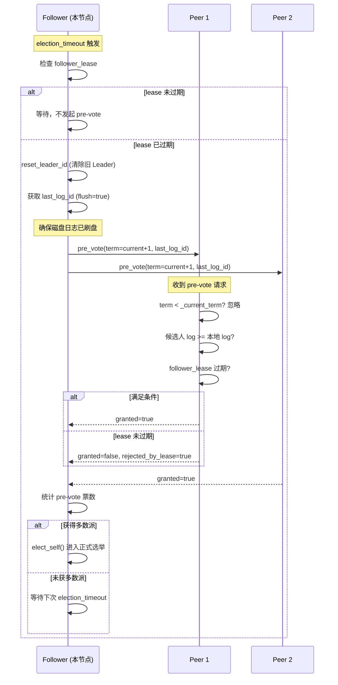
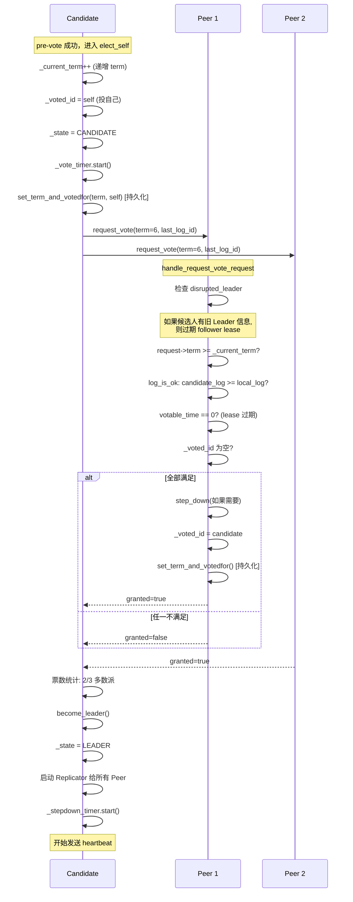
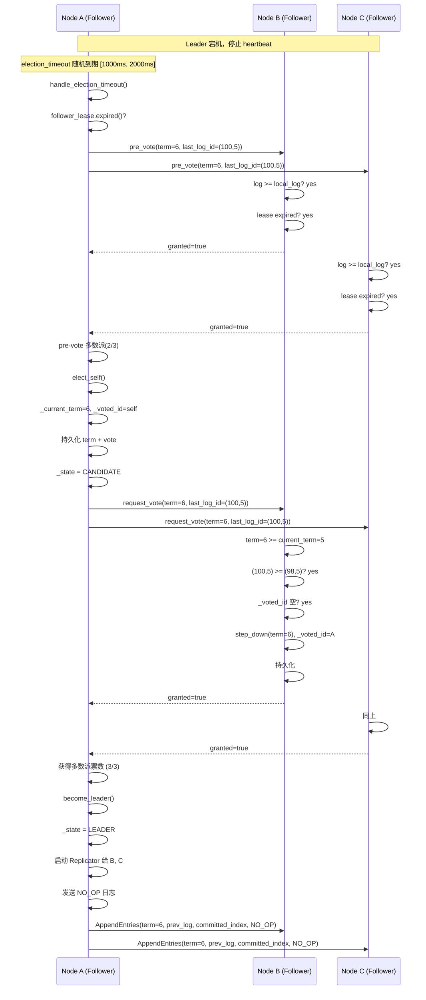
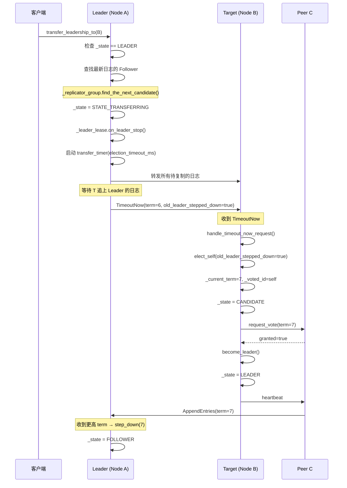
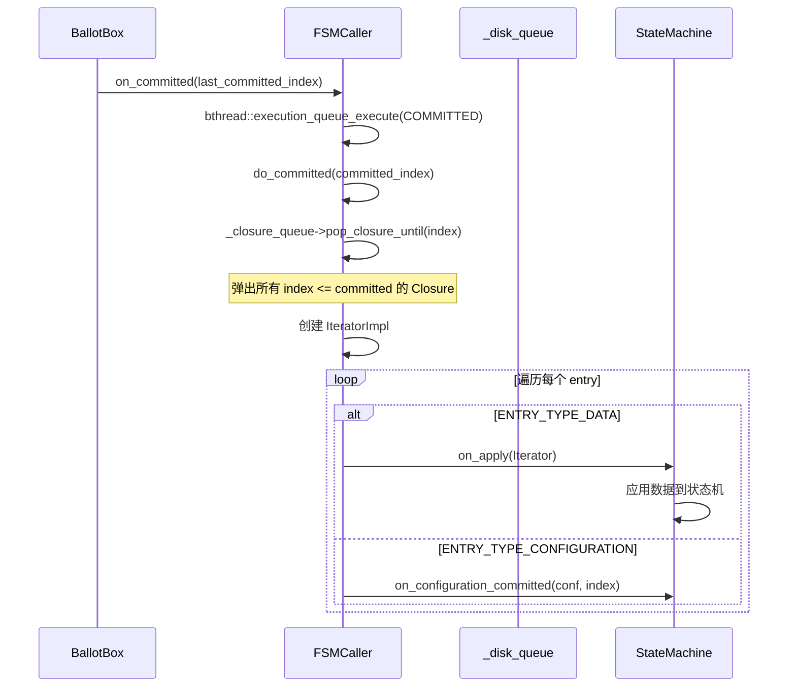
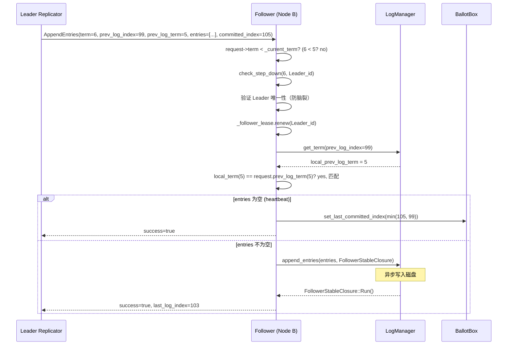
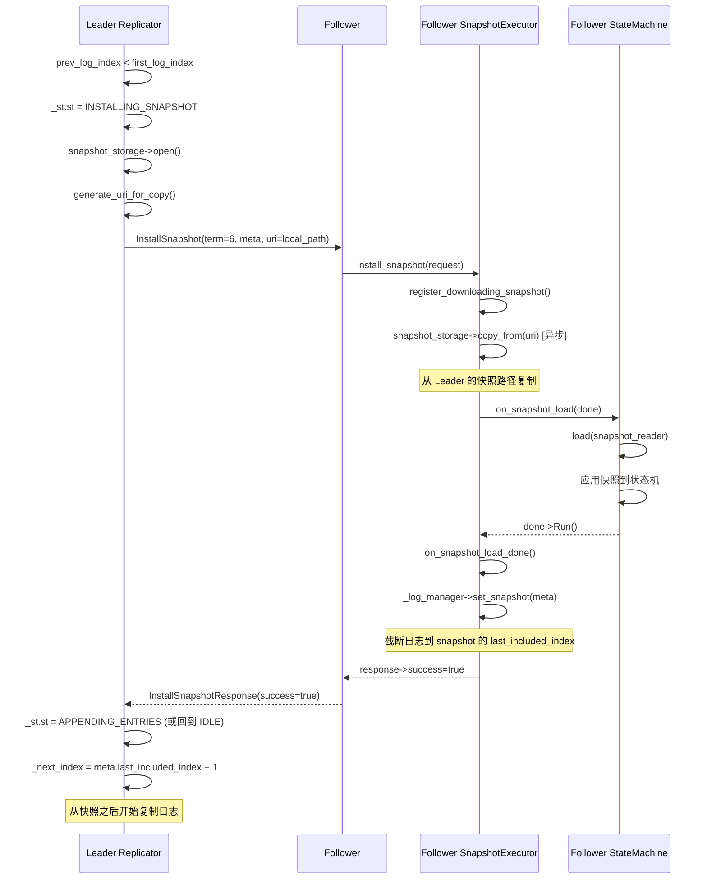
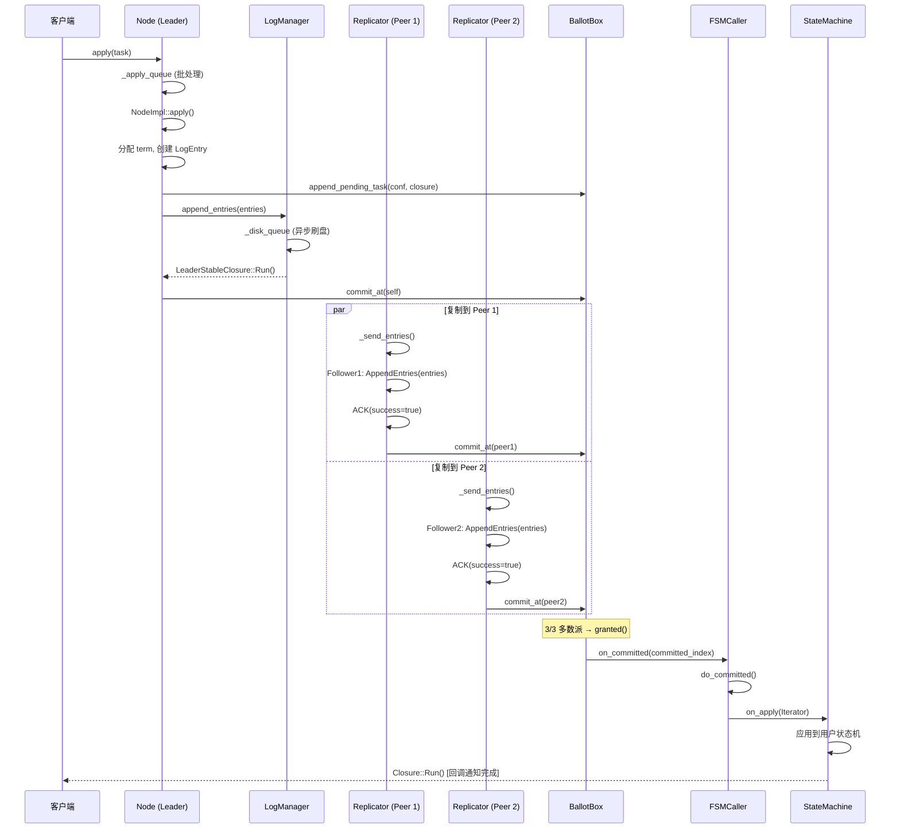

# braft 选举投票与日志复制机制详解

## 目录

1. [braft 概述](#1-braft-概述)
2. [节点状态与转换](#2-节点状态与转换)
3. [选举超时与随机化](#3-选举超时与随机化)
4. [Pre-Vote 机制](#4-pre-vote-机制)
5. [RequestVote 投票](#5-requestvote-投票)
6. [投票授予逻辑](#6-投票授予逻辑)
7. [Leader Lease 机制](#7-leader-lease-机制)
8. [完整选举流程时序图](#8-完整选举流程时序图)
9. [Leader Transfer](#9-leader-transfer)
10. [日志复制流水线](#10-日志复制流水线)
11. [日志存储架构](#11-日志存储架构)
12. [Commit Index 推进](#12-commit-index-推进)
13. [状态机 Apply](#13-状态机-apply)
14. [AppendEntries 处理（Follower 侧）](#14-appendentries-处理follower-侧)
15. [日志匹配与冲突回退](#15-日志匹配与冲突回退)
16. [InstallSnapshot](#16-installsnapshot)
17. [Heartbeat 机制](#17-heartbeat-机制)
18. [配置变更（Joint Consensus）](#18-配置变更joint-consensus)
19. [完整日志复制流程时序图](#19-完整日志复制流程时序图)
20. [流控与批处理](#20-流控与批处理)
21. [源码索引](#21-源码索引)

---

## 1. braft 概述

braft 是百度开源的 Raft 一致性算法实现（基于 [brpc](https://github.com/apache/incubator-brpc)），用于百度内部多个分布式系统。核心特性：

| 特性 | 说明 |
|------|------|
| **实现语言** | C++ (基于 brpc) |
| **状态机** | 用户自定义 `StateMachine` |
| **日志存储** | `SegmentLogStorage`（分段文件） |
| **快照** | 用户自定义 `SnapshotStorage` |
| **Pre-Vote** | 支持（减少不必要的选举干扰） |
| **Leader Lease** | 可选（优化只读查询） |
| **Joint Consensus** | 支持（两阶段配置变更） |
| **流水线复制** | 支持批量+流水线 AppendEntries |
| **日志类型** | DATA / NO_OP / CONFIGURATION |

### RPC 接口

```protobuf
// src/braft/raft.proto
service RaftService {
    rpc pre_vote(RequestVoteRequest) returns (RequestVoteResponse);
    rpc request_vote(RequestVoteRequest) returns (RequestVoteResponse);
    rpc append_entries(AppendEntriesRequest) returns (AppendEntriesResponse);
    rpc install_snapshot(InstallSnapshotRequest) returns (InstallSnapshotResponse);
    rpc timeout_now(TimeoutNowRequest) returns (TimeoutNowResponse);
}
```

---

## 2. 节点状态与转换

### 2.1 状态枚举

```cpp
// src/braft/raft.h:270-281
enum State {
    STATE_LEADER = 1,         // 领导者
    STATE_TRANSFERRING = 2,   // 正在转移领导权
    STATE_CANDIDATE = 3,      // 候选人
    STATE_FOLLOWER = 4,       // 跟随者
    STATE_ERROR = 5,          // 错误
    STATE_UNINITIALIZED = 6,  // 未初始化
    STATE_SHUTTING = 7,       // 正在关闭
    STATE_SHUTDOWN = 8,       // 已关闭
};
```

### 2.2 状态转换图

```
                          ┌─────────────────────────┐
                          │                         │
               init()     │     election_timeout     │
             ┌────────────│◄────────────────────────│
             │            │                         │
             ▼            ▼         pre_vote         │
    ┌──────────────┐   ┌──────────────┐   获得多数派   ┌──────────────┐
    │ UNINITIALIZED│──→│   FOLLOWER   │──────────────→│  CANDIDATE   │
    └──────────────┘   └──────┬───────┘               └──────┬───────┘
                              │                              │
                   收到更高term │                              │ 获得多数派
                   或 step_down│                              │ 票数
                              │                              ▼
                              │                      ┌──────────────┐
                              ├──────────────────────│    LEADER    │
                              │   收到 AppendEntries │              │
                              │   (current term)     │ transfer_    │
                              │                      │ leadership  │
                              │                      └──────┬───────┘
                              │                             │
                              │              超时/transfer │
                              │              完成/失败     │
                              │                             ▼
                              │                      ┌──────────────┐
                              └──────────────────────│   FOLLOWER   │
                                                     └──────────────┘

    step_down() 可以从任何活跃状态转换到 FOLLOWER:
    LEADER / CANDIDATE / TRANSFERRING → FOLLOWER
```

---

## 3. 选举超时与随机化

### 3.1 超时参数

| 参数 | 默认值 | 说明 |
|------|--------|------|
| `election_timeout_ms` | 1000ms | Follower 等待 Leader 的超时 |
| `raft_max_election_delay_ms` | 1000ms | 最大随机延迟 |
| `max_clock_drift_ms` | 1000ms | 时钟漂移补偿 |
| `raft_election_heartbeat_factor` | 10 | heartbeat = election_timeout / factor |

### 3.2 随机化机制

```cpp
// src/braft/node.cpp:127-130
inline int random_timeout(int timeout_ms) {
    int32_t delta = std::min(timeout_ms, FLAGS_raft_max_election_delay_ms);
    return butil::fast_rand_in(timeout_ms, timeout_ms + delta);
}
```

实际超时在 `[T, 2T]` 之间随机（T = election_timeout_ms），避免多个节点同时发起选举（split vote）。

### 3.3 心跳超时

```cpp
// src/braft/node.cpp:132-141
static inline int heartbeat_timeout(int election_timeout) {
    return std::max(election_timeout / FLAGS_raft_election_heartbeat_factor, 10);
}
// 默认: 1000 / 10 = 100ms
```

### 3.4 定时器类层次

```
RepeatedTimerTask (基类)
├── schedule() → bthread_timer_add(adjust_timeout_ms())
├── on_timedout → run() → 子类实现
└── 定时器触发后自动重新 schedule

├── ElectionTimer   → handle_election_timeout()     (Follower)
├── VoteTimer       → handle_vote_timeout()         (Candidate)
└── StepdownTimer   → handle_stepdown_timeout()     (Leader)
```

---

## 4. Pre-Vote 机制

Pre-Vote 是 Raft 论文 9.6 节的优化，用于避免网络分区中的节点不必要地递增 term，导致现有 Leader 被 step down。

### 4.1 Pre-Vote 时序图



### 4.2 Pre-Vote 关键特性

1. **不递增 term**：使用 `current_term + 1` 发送请求，但不修改本地 term
2. **不持久化投票**：pre-vote 不修改 `_voted_id`，不影响后续正式投票
3. **不改变状态**：pre-vote 不会将 FOLLOWER 变为 CANDIDATE
4. **Lease 感知**：如果 follower lease 未过期，拒绝投票（`rejected_by_lease=true`）
5. **Disrupted Leader 优化**：如果投票的 peer 是之前的 leader，候选人也自动获得自己的投票

### 4.3 Pre-Vote 请求/响应

```protobuf
// 复用 RequestVoteRequest/Response
message RequestVoteRequest {
    required int64 term = 4;               // pre-vote: current_term + 1
    required int64 last_log_term = 5;
    required int64 last_log_index = 6;
}

message RequestVoteResponse {
    required int64 term = 1;
    required bool granted = 2;
    optional bool rejected_by_lease = 5;    // lease 未过期
    optional bool disrupted = 3;            // 投票者是 Leader
    optional int64 previous_term = 4;
}
```

---

## 5. RequestVote 投票

### 5.1 正式选举时序图



### 5.2 日志比较规则

```cpp
// src/braft/log_entry.h:64-69
inline bool operator<(const LogId& lhs, const LogId& rhs) {
    if (lhs.term == rhs.term) {
        return lhs.index < rhs.index;
    }
    return lhs.term < rhs.term;
}
```

**先比较 term，再比较 index**：
- `(term=6, index=1) > (term=5, index=1000)` — term 更高直接胜出
- `(term=5, index=100) > (term=5, index=99)` — 同 term，index 更大胜出

### 5.3 Snapshot 感知投票

```cpp
// src/braft/log_manager.cpp:190-207
LogId LogManager::last_log_id(bool is_flush) {
    if (!is_flush) {
        if (_last_log_index >= _first_log_index) {
            return LogId(_last_log_index, unsafe_get_term(_last_log_index));
        }
        return _last_snapshot_id;  // 日志已被快照截断
    }
    // flush=true: 等待磁盘写入完成
}
```

当 voter 的日志已被快照截断时，返回 `_last_snapshot_id`，确保投票比较正确。

---

## 6. 投票授予逻辑

投票授予需要同时满足 **5 个条件**：

```
条件 1: request->term() >= _current_term
        ↓
条件 2: LogId(candidate_last_log) >= LogId(local_last_log)
        （候选人的日志至少和本节点一样新）
        ↓
条件 3: follower_lease.expired() (或 raft_enable_leader_lease=false)
        （Follower Lease 已过期）
        ↓
条件 4: _voted_id 为空（本 term 还未投过票）
        ↓
条件 5: 节点处于活跃状态
```

### 6.1 Disrupted Leader 优化

```cpp
// src/braft/node.cpp:2199-2208
if (request->has_disrupted_leader() &&
    _current_term == request->disrupted_leader().term() &&
    _leader_id == disrupted_leader_id) {
    _follower_lease.expire();  // 立即过期 lease
}
```

如果候选人能证明旧 Leader 已被 disrupted（相同的 term 和 leader_id），则直接过期 follower lease，避免等待。

---

## 7. Leader Lease 机制

### 7.1 Lease 状态

```
event: become leader              become follower
        ^           on leader start   ^   on leader stop
        |           ^                 |   ^
time:   ----------|-----------|-----------------|---|-------
lease:    EXPIRED | NOT_READY |      VALID      |  EXPIRED
```

| 状态 | 说明 |
|------|------|
| `DISABLED` | Lease 未启用（`raft_enable_leader_lease=false`） |
| `EXPIRED` | Lease 过期（刚成为 follower 或刚成为 leader） |
| `NOT_READY` | Lease 未就绪（还未收到多数派确认） |
| `VALID` | Lease 有效（在 election_timeout 内收到多数派 heartbeat） |
| `SUSPECT` | Lease 可能过期（超过 election_timeout 但不确定） |

### 7.2 Lease 有效条件

```cpp
// src/braft/lease.cpp:58-82
if (butil::monotonic_time_ms() < _last_active_timestamp + _election_timeout_ms) {
    state = VALID;  // Lease 有效
} else {
    state = SUSPECT; // Lease 可能过期
}
```

`_last_active_timestamp` 取**多数派 peer 的最小 RPC 发送时间戳**，保证在 election_timeout 内多数派都确认了 Leader。

### 7.3 Follower Lease（投票安全）

```cpp
// src/braft/lease.cpp:111-132
int64_t FollowerLease::votable_time_from_now() {
    int64_t votable_timestamp = _last_leader_timestamp + _election_timeout_ms
                                + _max_clock_drift_ms;
    if (now >= votable_timestamp) { return 0; }  // 可以投票
    return votable_timestamp - now;                 // 还需等待
}
```

Follower 在最后一次收到 heartbeat 后的 `election_timeout_ms + max_clock_drift_ms` 内不会投票，考虑了时钟漂移。

---

## 8. 完整选举流程时序图

### 8.1 三节点选举（包含 Pre-Vote）



### 8.2 Split Vote（选举失败）

```
场景: Node A 和 Node B 同时发起选举

Node A (term=6): 投票给 A
Node B (term=6): 投票给 B
Node C: 投票给 A 或 B（只有一个能获得票）

结果: 没有人获得多数派 → vote_timeout → 重试

retry 策略 (FLAGS_raft_step_down_when_vote_timedout):
  true  → step_down → 回到 FOLLOWER → pre_vote → 新一轮选举
  false → 直接 elect_self (term=7) → 再次尝试
```

---

## 9. Leader Transfer

### 9.1 流程



### 9.2 关键设计

- **TimeoutNow 而非 RequestVote**：让目标节点立即发起选举，而不是等待 election_timeout
- **Lease 模式下不递增 term**：如果 `raft_enable_leader_lease=true`，TimeoutNow 请求中 term 不变（防止 lease 无效化）
- **超时回滚**：如果 transfer 未在 `election_timeout_ms` 内完成，Leader 回滚到 `STATE_LEADER`

---

## 10. 日志复制流水线

### 10.1 Replicator 状态

```
Replicator 四种状态:
┌─────────┐    收到日志     ┌──────────────────┐
│  IDLE   │───────────────→│ APPENDING_ENTRIES │
└─────────┘                 └──────────────────┘
     ↑                              │
     │  没有待发送日志                 │ 遇到错误
     │                              ↓
     │                      ┌──────────────┐
     └──────────────────────│   BLOCKING   │
           阻塞超时后        └──────────────┘
                              回到 IDLE

                        需要安装快照
                              │
                              ▼
                    ┌──────────────────────┐
                    │ INSTALLING_SNAPSHOT  │
                    └──────────────────────┘
```

### 10.2 流水线数据流

```
Client → Node::apply()
    │
    ▼
_apply_queue (bthread::ExecutionQueue 批处理)
    │
    ▼
NodeImpl::apply()
    ├── _ballot_box->append_pending_task()
    └── _log_manager->append_entries()
            │
            ▼
    _disk_queue (异步刷盘)
            │
            ▼
    LeaderStableClosure::Run() → _ballot_box->commit_at(self) [Leader 自投]
            │
            ▼
    Replicator::_send_entries() [每个 Follower 一个 Replicator]
            │
            ▼
    AppendEntries RPC (异步，可流水线)
            │
            ▼
    Replicator::_on_rpc_returned() → _ballot_box->commit_at(peer)
            │
            ▼
    BallotBox 检测到多数派 → _fsm_caller->on_committed()
            │
            ▼
    FSMCaller::do_committed() → StateMachine::on_apply(Iterator)
```

---

## 11. 日志存储架构

### 11.1 存储层次

```
LogManager (内存缓冲 + 异步刷盘)
  ├── _logs_in_memory: deque<LogEntry*> (内存缓冲区)
  ├── _disk_queue: bthread::ExecutionQueue (磁盘写入队列)
  └── _log_storage: SegmentLogStorage (磁盘存储)
        ├── log_meta (元数据: start_log_index)
        ├── log_000001-0001000 (已关闭段)
        ├── log_0001001-0002000 (已关闭段)
        └── log_inprogress_0002001 (当前活跃段)
```

### 11.2 单条日志格式

```
┌──────────────────────────────────────────┐
│ Header (24 bytes)                        │
├──────────┬──────────┬──────────┬─────────┤
│ term     │ type     │ checksum │ reserved│
│ (64bit)  │ (8bit)   │ (8bit)   │ (16bit) │
├──────────┼──────────┼──────────┴─────────┤
│ data_len │data_crc  │ header_crc           │
│ (32bit)  │ (32bit)  │ (32bit)              │
├──────────┴──────────┴──────────────────────┤
│ data (变长)                               │
└──────────────────────────────────────────┘
```

### 11.3 LogEntry 类型

```cpp
enum EntryType {
    ENTRY_TYPE_NO_OP = 1,           // 空操作（Leader 初始化）
    ENTRY_TYPE_DATA = 2,            // 用户数据
    ENTRY_TYPE_CONFIGURATION = 3,    // 配置变更
};
```

---

## 12. Commit Index 推进

### 12.1 BallotBox 机制

```
BallotBox 维护:
  _pending_meta_queue: deque<Ballot>   (每个日志条目一个 Ballot)
  _pending_index: int64_t              (待提交的最小 index)
  _last_committed_index: atomic<int64_t>

每个 Ballot 追踪:
  _peers: 尚未确认的 peer 列表
  _quorum: 还需要多少票 (new_conf)
  _old_quorum: 还需要多少票 (old_conf, joint 阶段)
  granted(): _quorum <= 0 && _old_quorum <= 0
```

### 12.2 Commit 流程

```
1. Leader 写入日志 → LeaderStableClosure → ballot_box.commit_at(self)
   Ballot[self] → quorum 需要再 (N/2) 票

2. Follower1 ACK → ballot_box.commit_at(follower1)
   Ballot → quorum 需要再 (N/2 - 1) 票

3. Follower2 ACK → ballot_box.commit_at(follower2)
   Ballot → granted() → _last_committed_index 更新
   → _fsm_caller->on_committed(index) → 触发 apply
```

### 12.3 Follower 的 commit_index

```cpp
// Follower 收到 AppendEntries 后:
_ballot_box->set_last_committed_index(
    std::min(request->committed_index(), prev_log_index));
```

Follower 不参与 commit 计算，直接使用 Leader 通知的 `committed_index`。

---

## 13. 状态机 Apply

### 13.1 Apply 流程



### 13.2 Apply 批处理

```cpp
// src/braft/fsm_caller.cpp:37-39
DEFINE_int32(raft_fsm_caller_commit_batch, 512,
             "Max numbers of logs for the state machine to commit in a single batch");
```

多个 `COMMITTED` 事件可以合并为一个 `do_committed()` 调用，减少锁竞争。

---

## 14. AppendEntries 处理（Follower 侧）

### 14.1 处理流程



### 14.2 日志一致性检查

```cpp
// src/braft/node.cpp:2468-2512
const int64_t local_prev_log_term = _log_manager->get_term(prev_log_index);
if (local_prev_log_term != prev_log_term) {
    response->set_success(false);
    response->set_last_log_index(last_index);  // 快速回退提示
    return;
}
```

---

## 15. 日志匹配与冲突回退

### 15.1 冲突回退策略

```
Leader 的 _next_index = 150

发送: AppendEntries(prev_log_index=149, prev_log_term=5, entries=[...])
Follower 回复: success=false, last_log_index=100

Leader 回退策略:
  if (follower.last_log_index + 1 < _next_index) {
      // Follower 日志更少 → 快速前进
      _next_index = follower.last_log_index + 1 = 101
  } else {
      // 日志冲突 → 逐条回退
      _next_index = _next_index - 1 = 149
  }

发送: AppendEntries(prev_log_index=100, ...)
...
```

braft 不使用二分查找，而是逐条回退 + 快速前进的混合策略。

### 15.2 Out-of-Order AppendEntries 缓存

```cpp
// src/braft/node.h:396-437
class AppendEntriesCache
```

当 Follower 缺少某些历史日志时，Leader 发送的 AppendEntries 可能是 "超前" 的。braft 缓存这些请求，避免不必要的重传。

---

## 16. InstallSnapshot

### 16.1 触发条件

```
Leader 发送 AppendEntries(prev_log_index=X)
Follower 的日志已被截断（X < first_log_index）

→ Leader 的 _fill_common_fields() 返回 -1
→ 触发 _install_snapshot()
```

### 16.2 流程



---

## 17. Heartbeat 机制

### 17.1 Heartbeat 本质

Heartbeat 就是**空的 AppendEntries RPC**：

```protobuf
AppendEntriesRequest {
    term = 6,
    prev_log_index = 100,
    prev_log_term = 5,
    entries = [],              // 空的！
    committed_index = 98
}
```

### 17.2 Heartbeat 间隔

```
heartbeat_interval = election_timeout / raft_election_heartbeat_factor
默认: 1000ms / 10 = 100ms

每个 Replicator 独立的 heartbeat timer
```

### 17.3 Heartbeat 作用

| 作用 | 说明 |
|------|------|
| **维持领导权** | Follower 收到 heartbeat 后重置 election timer |
| **推进 commit** | 携带 committed_index，让 Follower 推进本地 apply |
| **Renew Lease** | Follower 收到 heartbeat 后 renew follower lease |
| **探测存活性** | 如果 Follower 丢失，Leader 检测到并可触发 stepdown |

---

## 18. 配置变更（Joint Consensus）

### 18.1 两阶段配置变更

```
阶段 1: CATCHING_UP (可选)
  新 Peer 追加日志直到 catchup_margin 内
  ReplicatorGroup.wait_caughtup()

阶段 2: JOINT (多节点变更时)
  C_old ∪ C_new 共同参与投票
  需要 C_old 和 C_new 的多数派都同意

阶段 3: STABLE
  只需要 C_new 的多数派同意
  旧 Peer 可以安全移除
```

### 18.2 单节点变更优化

```
如果只变更 1 个 Peer (add_peer 或 remove_peer):
  跳过 JOINT 阶段
  CATCHING_UP → STAGE_STABLE (直接)
```

### 18.3 Ballot 的双重 quorum

```cpp
// src/braft/ballot.cpp:24-46
int Ballot::init(const Configuration& conf, const Configuration* old_conf) {
    _quorum = conf.size() / 2 + 1;      // new conf 的多数派
    if (old_conf) {
        _old_quorum = old_conf->size() / 2 + 1;  // old conf 的多数派
    }
}

bool granted() const {
    return _quorum <= 0 && _old_quorum <= 0;  // 两个 quorum 都满足
}
```

---

## 19. 完整日志复制流程时序图

### 19.1 客户端写入到状态机 Apply



---

## 20. 流控与批处理

### 20.1 流控参数

| 参数 | 默认值 | 说明 |
|------|--------|------|
| `raft_max_entries_size` | 1024 | 单次 AppendEntries 最大条目数 |
| `raft_max_body_size` | 512KB | 单次 AppendEntries 最大 body 大小 |
| `raft_max_parallel_append_entries_rpc_num` | 1 | 最大并行 AppendEntries RPC 数 |
| `raft_max_install_snapshot_tasks_num` | 1000 | 最大并行快照安装数 |
| `raft_retry_replicate_interval_ms` | 1000 | 错误后重试间隔 |
| `raft_fsm_caller_commit_batch` | 512 | 状态机 apply 批处理大小 |

### 20.2 Replicator 阻塞

```
触发 _block() 的场景:
1. RPC 失败 → 阻塞 heartbeat_timeout_ms
2. 快照被限流 → 阻塞 retry_replicate_interval_ms (1000ms)
3. 快照打开失败 → 阻塞 retry_replicate_interval_ms

阻塞期间:
  _st.st = BLOCKING
  不发送任何 AppendEntries
  阻塞超时后回到 IDLE，重新探测
```

### 20.3 批处理层次

```
层次 1: 用户提交批处理
  Node::apply() → _apply_queue (bthread::ExecutionQueue)

层次 2: 日志写入批处理
  LogManager::append_entries() → _disk_queue (批量刷盘)

层次 3: RPC 批处理
  Replicator::_send_entries() → 最多 1024 条目/RPC

层次 4: Apply 批处理
  FSMCaller: 多个 COMMITTED 事件合并为一次 do_committed()
```

---

## 21. 源码索引

### 选举与投票

| 组件 | 文件 | 关键行号 |
|------|------|----------|
| State 枚举 | `src/braft/raft.h` | 270-281 |
| RequestVoteRequest/Response | `src/braft/raft.proto` | 24-40 |
| handle_election_timeout | `src/braft/node.cpp` | 1065-1090 |
| random_timeout | `src/braft/node.cpp` | 127-130 |
| heartbeat_timeout | `src/braft/node.cpp` | 132-141 |
| ElectionTimer | `src/braft/node.h` | 60-64 |
| pre_vote | `src/braft/node.cpp` | 1616-1678 |
| handle_pre_vote_request | `src/braft/node.cpp` | 2109-2174 |
| handle_pre_vote_response | `src/braft/node.cpp` | 1503-1582 |
| elect_self | `src/braft/node.cpp` | 1681-1750 |
| become_leader | `src/braft/node.cpp` | 1935-1975 |
| step_down | `src/braft/node.cpp` | 1793-1875 |
| check_step_down | `src/braft/node.cpp` | 1898-1917 |
| handle_vote_timeout | `src/braft/node.cpp` | 1369-1392 |
| grant_self | `src/braft/node.cpp` | 3551-3568 |
| request_peers_to_vote | `src/braft/node.cpp` | 1752-1790 |
| handle_request_vote_request | `src/braft/node.cpp` | 2176-2289 |
| VoteBallotCtx | `src/braft/node.h` | 439-444 |
| Ballot | `src/braft/ballot.h` | 24-72 |
| Ballot::granted | `src/braft/ballot.cpp` | 24-46 |
| DisruptedLeader | `src/braft/node.h` | 439-444 |
| LeaderLease | `src/braft/lease.h` | 24-62 |
| FollowerLease | `src/braft/lease.h` | 64-86 |
| lease有效性检查 | `src/braft/lease.cpp` | 58-82 |
| votable_time | `src/braft/lease.cpp` | 111-132 |
| transfer_leadership_to | `src/braft/node.cpp` | 1189-1272 |
| handle_timeout_now_request | `src/braft/node.cpp` | 1092-1151 |
| handle_transfer_timeout | `src/braft/node.cpp` | 1174-1187 |
| Term 持久化 | `src/braft/raft_meta.cpp` | 465-526 |

### 日志复制

| 组件 | 文件 | 关键行号 |
|------|------|----------|
| AppendEntriesRequest/Response | `src/braft/raft.proto` | 42-58 |
| EntryType 枚举 | `src/braft/enum.proto` | 4-9 |
| LogId 结构 | `src/braft/log_entry.h` | 30-35 |
| LogEntry 结构 | `src/braft/log_entry.h` | 38-52 |
| LogStorage 接口 | `src/braft/storage.h` | 124-178 |
| SegmentLogStorage | `src/braft/log.h` | 139-227 |
| Segment::append | `src/braft/log.cpp` | 379-447 |
| LogManager | `src/braft/log_manager.h` | 56-229 |
| LogManager::last_log_id | `src/braft/log_manager.cpp` | 190-207 |
| Replicator | `src/braft/replicator.h` | 82-264 |
| Replicator::start | `src/braft/replicator.cpp` | 109-152 |
| _send_entries (pipeline) | `src/braft/replicator.cpp` | 641-714 |
| _send_empty_entries (heartbeat) | `src/braft/replicator.cpp` | 556-596 |
| _on_rpc_returned | `src/braft/replicator.cpp` | 359-524 |
| _on_heartbeat_returned | `src/braft/replicator.cpp` | 279-357 |
| _fill_common_fields | `src/braft/replicator.cpp` | 527-554 |
| _wait_more_entries | `src/braft/replicator.cpp` | 757-770 |
| _block (流控) | `src/braft/replicator.cpp` | 242-277 |
| ReplicatorGroup | `src/braft/replicator.h` | 285-377 |
| BallotBox | `src/braft/ballot_box.h` | 51-102 |
| BallotBox::commit_at | `src/braft/ballot_box.cpp` | 49-96 |
| handle_append_entries_request | `src/braft/node.cpp` | 2387-2573 |
| LeaderStableClosure::Run | `src/braft/node.cpp` | 1998-2014 |
| NodeImpl::apply | `src/braft/node.cpp` | 2024-2079 |
| FSMCaller | `src/braft/fsm_caller.h` | 106-198 |
| FSMCaller::do_committed | `src/braft/fsm_caller.cpp` | 263-299 |
| InstallSnapshotRequest | `src/braft/raft.proto` | 67-79 |
| _install_snapshot | `src/braft/replicator.cpp` | 772-868 |
| SnapshotExecutor::install | `src/braft/snapshot_executor.cpp` | 402-449 |
| on_snapshot_load_done | `src/braft/snapshot_executor.cpp` | 247-285 |
| AppendEntriesCache | `src/braft/node.h` | 396-437 |

### 配置变更

| 组件 | 文件 | 关键行号 |
|------|------|----------|
| ConfigurationCtx | `src/braft/node.h` | 331-388 |
| ConfigurationCtx::start | `src/braft/node.cpp` | 3202-3247 |
| ConfigurationCtx::next_stage | `src/braft/node.cpp` | 3292-3325 |
| unsafe_apply_configuration | `src/braft/node.cpp` | 2081-2107 |
| wait_caughtup | ReplicatorGroup | replicator.cpp |
| catchup_margin | `src/braft/raft.h` | 502-505 |

### 定时器

| 组件 | 文件 | 关键行号 |
|------|------|----------|
| RepeatedTimerTask | `src/braft/repeated_timer_task.h` | 27-83 |
| RepeatedTimerTask::schedule | `src/braft/repeated_timer_task.cpp` | 127-135 |
| heartbeat timer | `src/braft/replicator.cpp` | 971-979 |
| _send_heartbeat | `src/braft/replicator.cpp` | 981-991 |

### RPC 分发

| 组件 | 文件 | 关键行号 |
|------|------|----------|
| RaftServiceImpl | `src/braft/raft_service.cpp` | 61-113 |
| RPC Dispatch (pre_vote) | `src/braft/raft_service.cpp` | 63-88 |
| RPC Dispatch (request_vote) | `src/braft/raft_service.cpp` | 89-99 |
| RPC Dispatch (append_entries) | `src/braft/raft_service.cpp` | 100-113 |
| RPC Dispatch (install_snapshot) | `src/braft/raft_service.cpp` | 114-126 |

### 流控配置

| 组件 | 文件 | 关键行号 |
|------|------|----------|
| raft_max_entries_size | `src/braft/replicator.cpp` | 32-33 |
| raft_max_body_size | `src/braft/replicator.cpp` | 41-43 |
| raft_max_parallel_rpc_num | `src/braft/replicator.cpp` | 36-39 |
| raft_retry_replicate_interval | `src/braft/replicator.cpp` | 45-48 |
| raft_fsm_caller_commit_batch | `src/braft/fsm_caller.cpp` | 37-39 |
| snapshot throttle | `src/braft/snapshot_throttle.cpp` | 32-34 |
