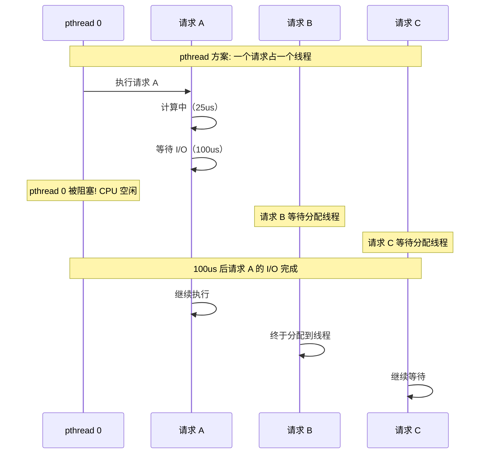
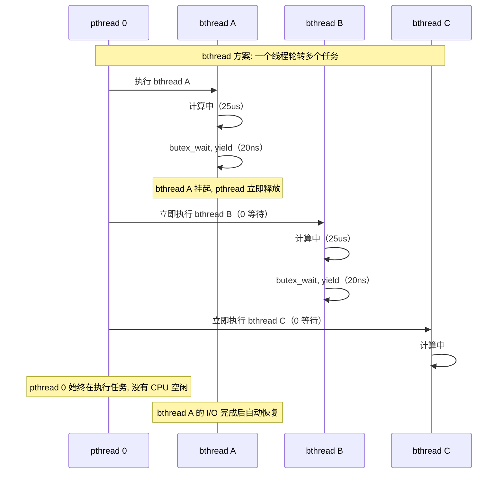
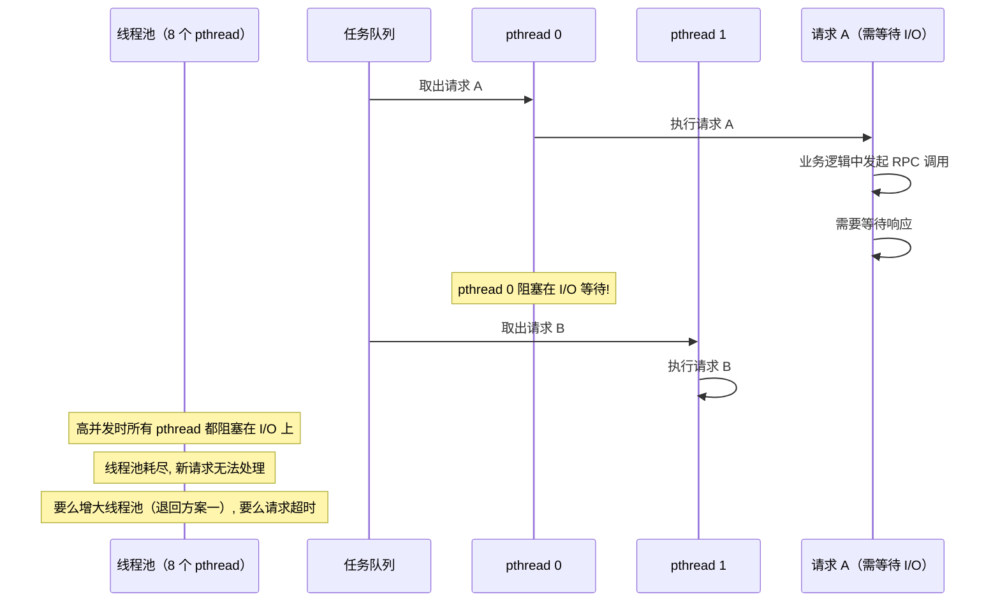
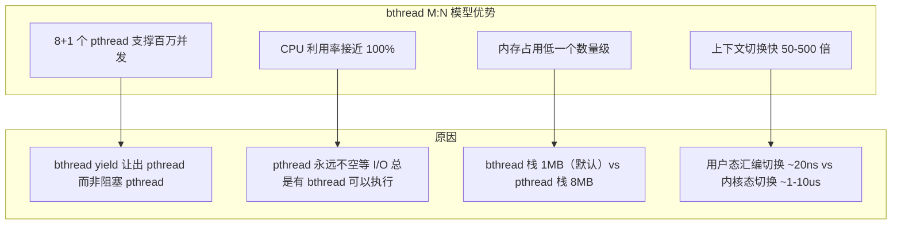
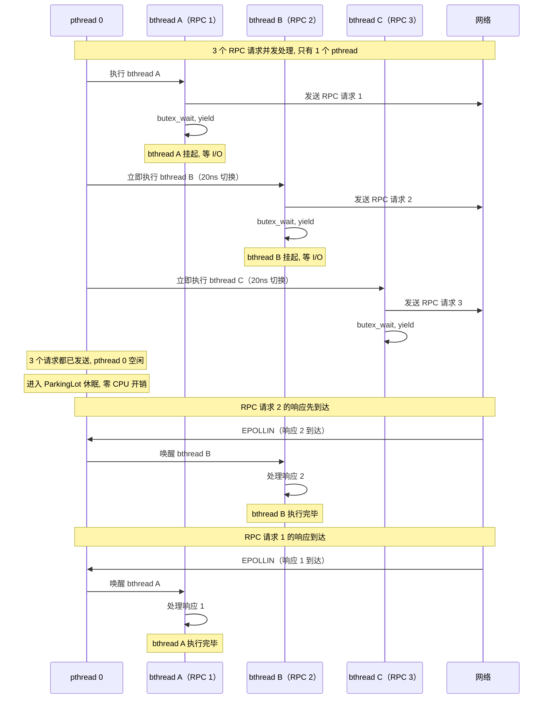
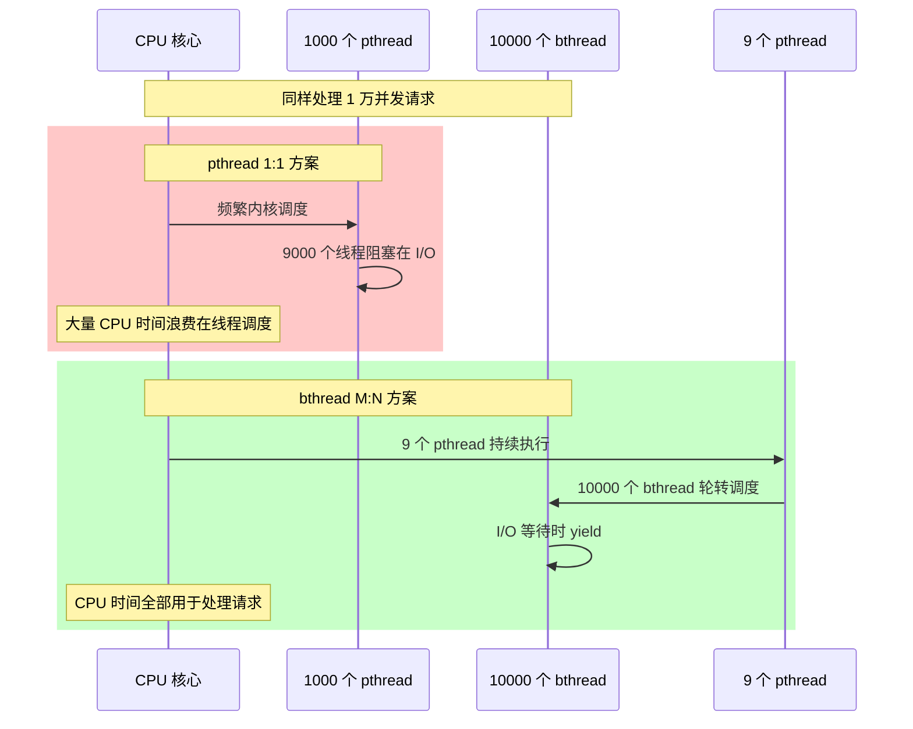
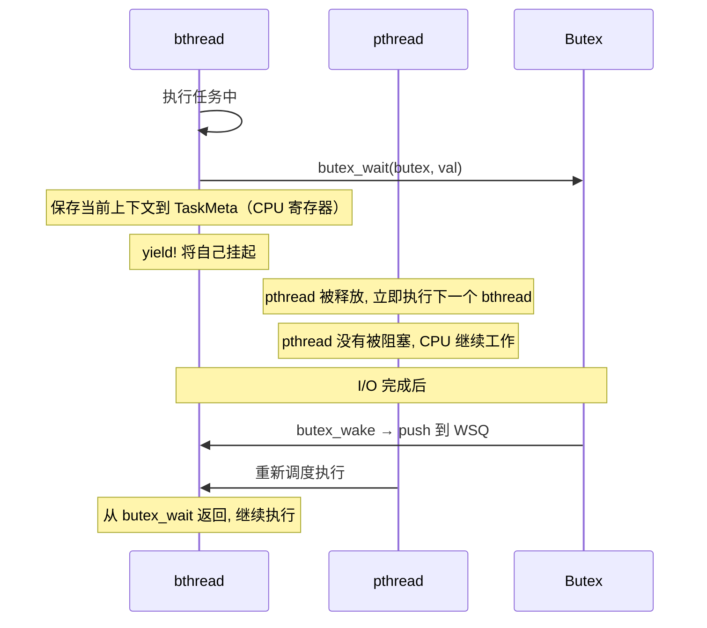
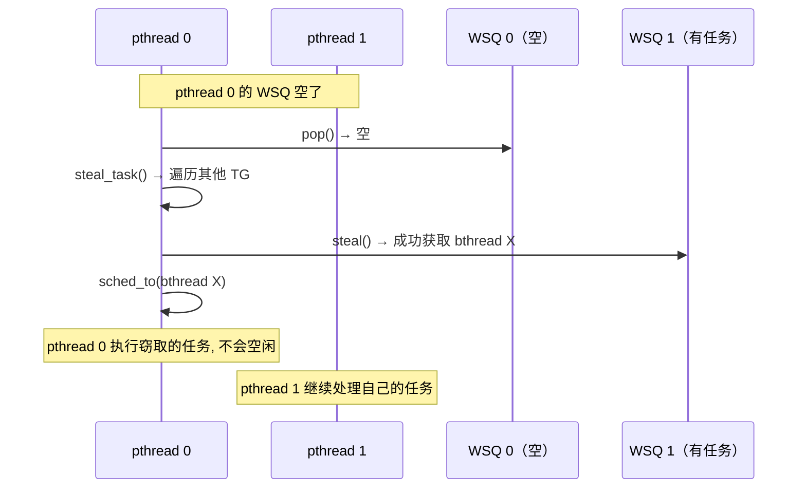

# brpc 为什么用 bthread 而不是直接用 pthread

## 目录

1. [核心问题](#1-核心问题)
2. [RPC 场景的时间分布](#2-rpc-场景的时间分布)
3. [pthread 方案及其困境](#3-pthread-方案及其困境)
4. [bthread 方案及其优势](#4-bthread-方案及其优势)
5. [三种方案对比](#5-三种方案对比)
6. [bthread 的开销与收益](#6-bthread-的开销与收益)
7. [bthread 核心机制如何解决问题](#7-bthread-核心机制如何解决问题)
8. [总结](#8-总结)

---

## 1. 核心问题

用户任务直接用 pthread 执行不行吗？bthread 毕竟有自己的栈，上下文切换也有开销，多包一层是否值得？

**答案：值得。因为 RPC 场景中，任务的大部分时间都在等待 I/O，而非执行计算。bthread 解决的不是"能不能执行"，而是"能不能高并发地等待"。**

| 问题 | pthread | bthread |
|---|---|---|
| 等待时怎么办 | 阻塞整个 pthread，CPU 空闲或内核切换 | yield 让出 pthread，CPU 立即处理其他任务 |
| 万级并发 | 万个 pthread，80GB 内存，内核调度崩溃 | 万个 bthread，10GB 内存，8 个 pthread 轮转 |
| 上下文切换 | 内核态 1-10us | 用户态 10-20ns |

---

## 2. RPC 场景的时间分布

### 2.1 单个 RPC 请求耗时分析

处理一个 RPC 请求，绝大部分时间花在等待 I/O 上：

```
请求到达
  └─ 等待网络读取:    50us（等待 socket 可读）
  └─ 读数据:          5us（readv 系统调用）
  └─ 反序列化:        5us（protobuf 解析）
  └─ 业务逻辑:       10us（用户代码执行）
  └─ 序列化:          5us（protobuf 序列化）
  └─ 写网络:          5us（writev 系统调用）
  └─ 等待网络发送:    50us（等待 socket 可写）
  ─────────────────────────
  实际计算:          25us（约 17%）
  等待 I/O:         100us（约 83%）
```

### 2.2 1 万并发请求的等待分析

```
1 万个并发请求同时处理:
  任何时刻，大部分请求都在等待 I/O
  实际需要 CPU 执行的只有 17%

  pthread 方案: 1 万个 pthread，其中 8300 个在阻塞等待 I/O
  bthread 方案: 8+1 个 pthread 轮转执行，无闲置
```

### 2.3 时序对比





---

## 3. pthread 方案及其困境

### 3.1 方案一：每请求一个 pthread（1:1 模型）

```
1 万并发请求 = 1 万个 pthread

问题 1: 内存爆炸
  每个 pthread 默认栈 8MB
  10000 × 8MB = 80GB 仅栈内存

问题 2: 内核调度崩溃
  内核需要管理 1 万个线程的就绪/阻塞/运行状态
  调度器的时间复杂度随线程数增长
  大量 CPU 时间花在线程调度上, 而非处理请求

问题 3: 上下文切换昂贵
  每次从阻塞唤醒一个 pthread: 内核态切换 ~1-10us
  1 万个 pthread 频繁切换: 累积开销巨大

问题 4: 扩展性差
  ulimit -u 限制最大线程数（通常 4096-65535）
  达到上限后新请求无法创建线程
```

### 3.2 方案二：线程池 + 任务队列（N:1 模型）



```
线程池的致命缺陷:
  → 任务如果需要等待 I/O（RPC 响应、锁、定时器、磁盘）
  → 执行该任务的 pthread 就会阻塞
  → 阻塞的 pthread 无法处理其他任务
  → 并发量越大，阻塞的 pthread 越多
  → 最终所有 pthread 都阻塞，系统停止响应

  这就是为什么传统 Java Web 服务器（Tomcat 等）
  需要配置 200-1000 个线程来应对并发
  大部分线程大部分时间都在空等 I/O
```

### 3.3 pthread 方案总结

| 问题 | 方案一（1:1） | 方案二（线程池） |
|---|---|---|
| 万并发内存 | 80GB（不可接受） | 可控（8 个线程） |
| CPU 利用率 | 调度开销大 | 高并发时线程全阻塞 |
| 等待 I/O | 线程阻塞，内核切换 | 线程池耗尽 |
| 代码复杂度 | 简单 | 需要异步回调 |

---

## 4. bthread 方案及其优势

### 4.1 M:N 模型的工作方式

```
M 个 pthread 调度 N 个 bthread（N 远大于 M）

关键机制: bthread 遇到 I/O 等待时, yield 而非阻塞 pthread

  pthread 0 负责: bthread A, B, C, D, E, F, ...
  → bthread A yield → pthread 0 立即执行 bthread B
  → bthread B yield → pthread 0 立即执行 bthread C
  → bthread A 的 I/O 完成 → bthread A 恢复 RUNNABLE
  → pthread 0 下次调度时重新执行 bthread A
```

### 4.2 bthread 的核心优势



### 4.3 完整时序：bthread 如何处理高并发



---

## 5. 三种方案对比

### 5.1 综合对比表

| 指标 | pthread 1:1 | 线程池 | bthread M:N |
|---|---|---|---|
| 万并发内存 | 80GB | ~64MB | ~10GB |
| 上下文切换 | 1-10us（内核态） | 1-10us（内核态） | 10-20ns（用户态） |
| 等待 I/O 时 | pthread 阻塞 | pthread 阻塞 | yield, pthread 立即释放 |
| CPU 利用率 | 调度开销大 | 高并发时线程全阻塞 | 始终接近 100% |
| 最大并发 | 几千（ulimit） | 几千（线程池大小） | 百万级（受内存限制） |
| 代码复杂度 | 简单 | 需异步回调 | 使用 brpc API（同步风格） |
| 适用场景 | 低并发 | 中并发 | 高并发 RPC |

### 5.2 高并发下的行为差异



### 5.3 不同并发量下的资源消耗

| 并发量 | pthread 1:1 | 线程池（200线程） | bthread M:N（9 pthread） |
|---|---|---|---|
| 100 | 800MB | 160MB + 任务队列 | 100MB |
| 1,000 | 8GB | 160MB（但 800 请求排队） | 1GB |
| 10,000 | 80GB | 160MB（但 9800 请求排队） | 10GB |
| 100,000 | 不可行 | 160MB（但 99800 超时） | 100GB |
| 1,000,000 | 不可行 | 不可行 | ~1TB（可行） |

---

## 6. bthread 的开销与收益

### 6.1 开销

用户说的没错，bthread 确实有额外开销：

| 开销项 | 具体值 | 说明 |
|---|---|---|
| 栈内存 | 1MB（默认） | 比 pthread 的 8MB 更小 |
| 上下文切换 | ~10-20ns | bthread_jump_fcontext 汇编实现 |
| TaskMeta | ~200 bytes | 每个 bthread 的元数据 |
| 调度逻辑 | ~50-100ns | 从 WSQ pop + sched_to |
| 代码约束 | 必须用 brpc 异步 API | 不能用阻塞系统调用 |

### 6.2 收益

| 收益项 | 具体值 | 说明 |
|---|---|---|
| 内存节省 | 87%（vs pthread） | 1MB vs 8MB 栈 |
| 切换加速 | 50-500 倍 | 20ns vs 1-10us |
| 并发能力 | 百万级 | vs pthread 几千 |
| CPU 利用率 | 接近 100% | pthread 永不空等 I/O |
| 编程模型 | 同步风格代码 | 看起来像同步，实际是 M:N |

### 6.3 开销与收益的量化对比

```
假设处理 1 万并发 RPC 请求:

pthread 1:1 方案:
  内存:   10000 × 8MB = 80GB
  切换:   10000 × 5us = 50ms/轮（内核调度一轮的开销）
  可用 CPU: 约 60%（40% 浪费在内核调度）

bthread M:N 方案:
  内存:   10000 × 1MB + 9 × 8MB = 10GB
  切换:   10000 × 20ns = 0.2ms/轮（用户态调度一轮）
  可用 CPU: 约 98%（2% 用于 bthread 调度）

净收益:
  内存节省 70GB（87.5%）
  调度开销降低 250 倍
  CPU 利用率提升 38 个百分点
```

---

## 7. bthread 核心机制如何解决问题

### 7.1 yield 机制：不阻塞 pthread



### 7.2 工作窃取：负载均衡



### 7.3 跨 pthread 恢复：任意 pthread 可执行

```
bthread 的执行上下文存储在 TaskMeta 中（与 pthread 无关）:
  → 栈: 独立的用户态栈（1MB）
  → 寄存器: 保存/恢复由 bthread_jump_fcontext 完成

→ bthread A 在 pthread 0 上 yield
→ bthread A 被唤醒后 push 到 WSQ
→ 任何空闲的 pthread 都可以 pop 并执行 bthread A
→ 对 bthread A 完全透明, 感觉不到切换了 pthread
```

---

## 8. 总结

### 一句话回答

**pthread 是"一个任务占一个工人"，bthread 是"一个工人轮流干多个任务的活"。**

RPC 场景中，任务 80% 以上的时间都在等待 I/O。bthread 让工人在等待时去干别的活，而不是站着发呆。虽然工人切换任务需要一点时间（20ns），但比工人发呆（1-10us 的内核态切换）划算得多。

### 核心对比

```
pthread:  任务等 I/O → pthread 阻塞 → CPU 空闲 → 浪费
bthread: 任务等 I/O → yield 让出 → pthread 执行其他任务 → 高效

代价:   必须使用 brpc 的异步 API（butex_wait 而非 pthread_mutex_lock）
收益:   8 个 pthread 支撑百万并发, CPU 利用率接近 100%
```
