# brpc pthread 与 bthread 对应关系及同步机制分析

## 目录

1. [pthread 与 bthread 的 M:N 映射](#1-pthread-与-bthread-的-mn-映射)
2. [pthread 与 TaskGroup 的 1:1 绑定](#2-pthread-与-taskgroup-的-11-绑定)
3. [bthread 为什么需要 Butex](#3-bthread-为什么需要-butex)
4. [bthread 的协作式调度与 Butex 的配合](#4-bthread-的协作式调度与-butex-的配合)
5. [bthread 同步原语全景](#5-bthread-同步原语全景)
6. [典型场景中的 Butex 使用](#6-典型场景中的-butex-使用)
7. [为什么不用 pthread 互斥锁](#7-为什么不用-pthread-互斥锁)
8. [完整时序分析](#8-完整时序分析)

---

## 1. pthread 与 bthread 的 M:N 映射

### 1.1 映射关系

```
默认配置: bthread_concurrency = 8 → 8 个 Worker pthread + 1 个 idle pthread = 9 个 pthread

pthread 0  ←→  TaskGroup 0  ←→  bthread A, B, C, D, ...
pthread 1  ←→  TaskGroup 1  ←→  bthread E, F, G, ...
pthread 2  ←→  TaskGroup 2  ←→  bthread H, I, J, ...
...
pthread 7  ←→  TaskGroup 7  ←→  bthread K, L, M, ...
pthread 8  ←→  TaskGroup 8  ←→  (idle / steal only)
```

### 1.2 关键特征

| 特征 | 说明 |
|---|---|
| 绑定关系 | 1 个 pthread 绑定 1 个 TaskGroup（生命周期一致） |
| 调度关系 | N 个 bthread 共享 M 个 pthread（M 远小于 N） |
| 栈 | 每个 pthread 有自己的系统栈（8MB）；每个 bthread 有独立的用户态栈（默认 1MB） |
| 切换 | bthread 之间的切换是用户态上下文切换（~10-20ns），不涉及内核 |
| 同一时间 | 每个 pthread 只执行 1 个 bthread，其他 bthread 挂起 |

---

## 2. pthread 与 TaskGroup 的 1:1 绑定

### 2.1 创建流程

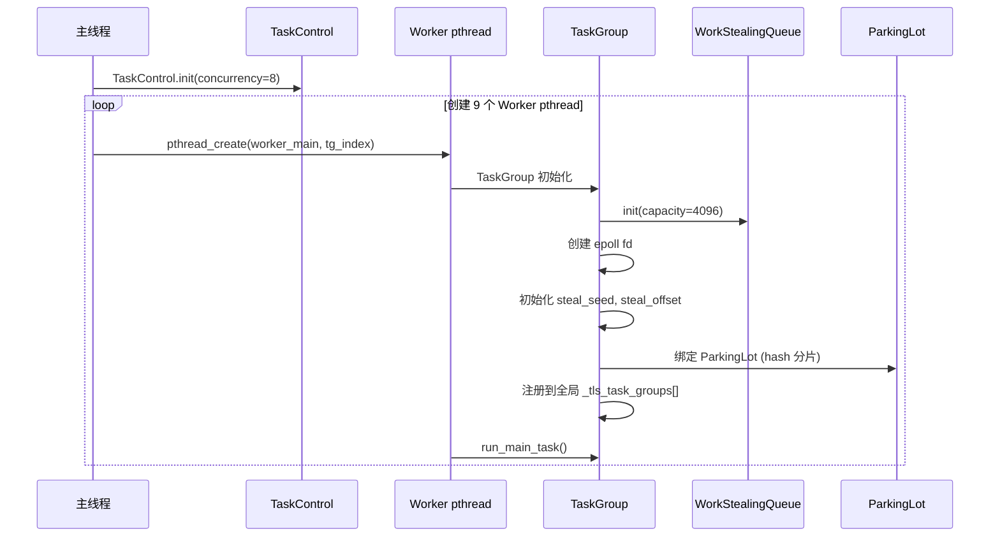

### 2.2 绑定数据结构

```c
// 每个 pthread 有一个 TLS 变量指向自己的 TaskGroup
__thread TaskGroup* tls_task_group = NULL;

// 全局数组: 所有 TaskGroup 按索引存储
// TaskControl::_groups[tag][index]
// 用于 steal 时遍历其他 TaskGroup
```

### 2.3 生命周期一致性

```
pthread 创建  →  TaskGroup 创建    →  pthread 运行调度循环
pthread 退出   →  TaskGroup 销毁    →  所有 bthread 必须完成
```

**pthread 不会销毁直到它上面所有的 bthread 执行完毕**。`TaskControl::stop_and_join()` 会等待所有 bthread 完成。

---

## 3. bthread 为什么需要 Butex

### 3.1 核心问题

虽然任务已经分派给 bthread 执行，但 bthread 之间存在**协作关系**，需要同步：

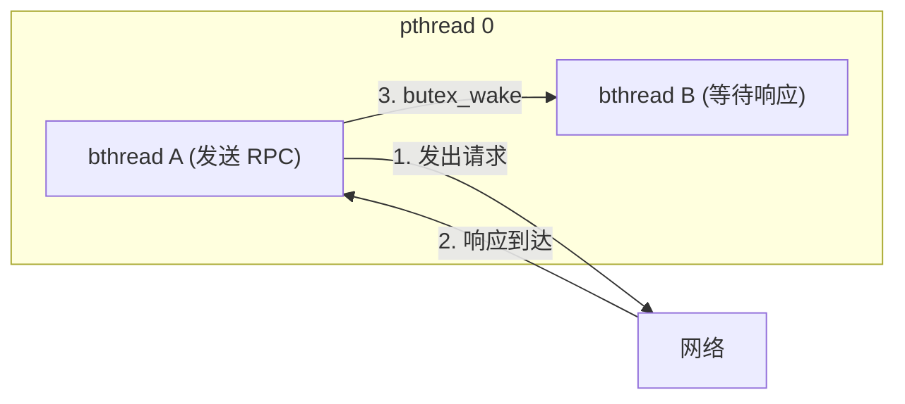

**问题**：bthread B 需要等待 bthread A（或其他异步事件）的结果。在同一个 pthread 上，bthread B 不能 `sleep()` 或 `pthread_cond_wait()`，因为那会阻塞整个 pthread，导致其他 bthread 都无法执行。

### 3.2 三种等待场景

| 场景 | 需要等待的对象 | 不能用的方式 | 正确方式 |
|---|---|---|---|
| 等待 RPC 响应 | 其他 bthread 或 I/O 事件 | `sleep()`（阻塞 pthread） | `butex_wait()` + yield |
| 等待定时器 | 时间到期 | `nanosleep()`（阻塞 pthread） | `bthread_usleep()` + yield |
| 等待 I/O | fd 可读/可写 | `epoll_wait()`（阻塞 pthread） | `bthread_fd_wait()` + yield |
| 等待写缓冲区 | Socket 可写 | 忙等轮询（浪费 CPU） | yield + EPOLLOUT |

### 3.3 Butex 的本质

**Butex = bthread mutex**，但它不是互斥锁，而是一个**条件等待原语**（类似 futex）：

```c
butex_wait(butex, expected_val):
    if butex.value == expected_val:
        将当前 bthread 加入 butex 等待队列
        yield（让出 pthread，调度其他 bthread）
    // 被唤醒后从这里恢复

butex_wake(butex):
    从 butex 等待队列取出 bthread
    推入该 bthread 所属 TaskGroup 的 WSQ 或远程 RQ
    signal_task() 唤醒 idle worker
```

**关键区别**：

| 特性 | pthread mutex/cond | butex |
|---|---|---|
| 阻塞对象 | pthread（内核线程） | bthread（用户态协程） |
| 阻塞代价 | 内核上下文切换（~1-10μs） | 用户态上下文切换（~10-20ns） |
| 唤醒目标 | 特定 pthread | 特定 bthread（可能在不同 pthread 上恢复执行） |
| 与 M:N 的兼容性 | 不兼容（阻塞 pthread 会饿死其他 bthread） | 完全兼容（yield 让出 pthread） |

---

## 4. bthread 的协作式调度与 Butex 的配合

### 4.1 yield 是一切的基础

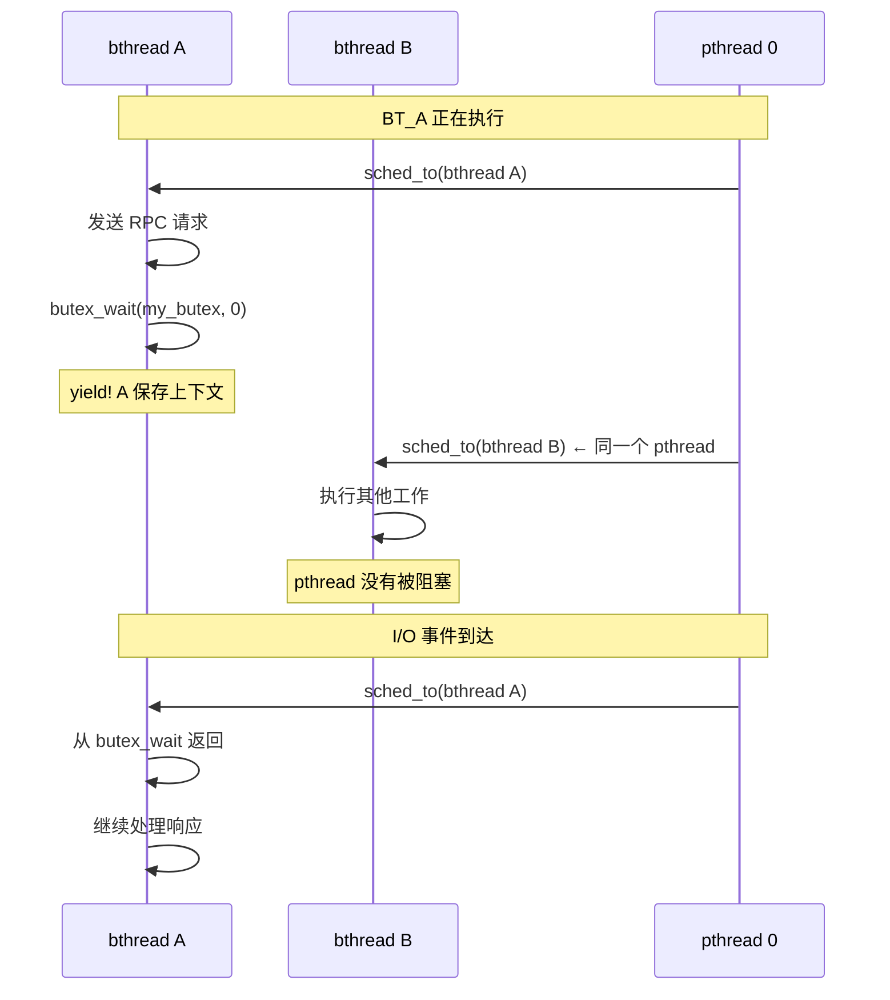

**要点**：`butex_wait()` 内部调用 `yield`，将 pthread 让给其他 bthread。这与 pthread 的 `pthread_cond_wait()` 有本质不同——后者让出的是内核线程。

### 4.2 同一 pthread 上两个 bthread 通过 Butex 同步

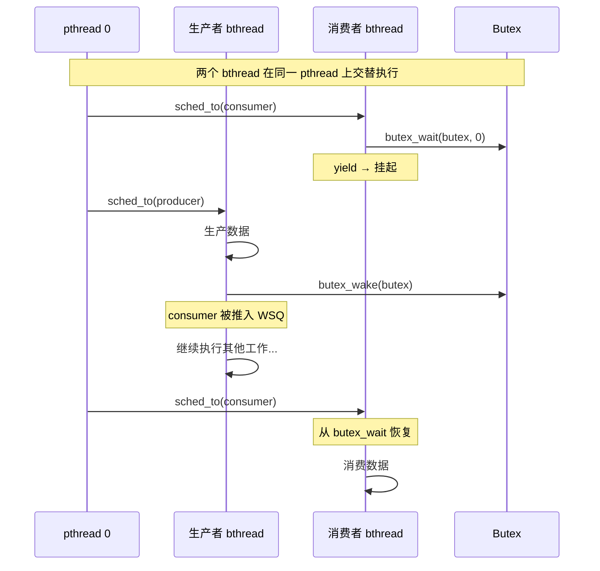

### 4.3 跨 pthread 上两个 bthread 通过 Butex 同步

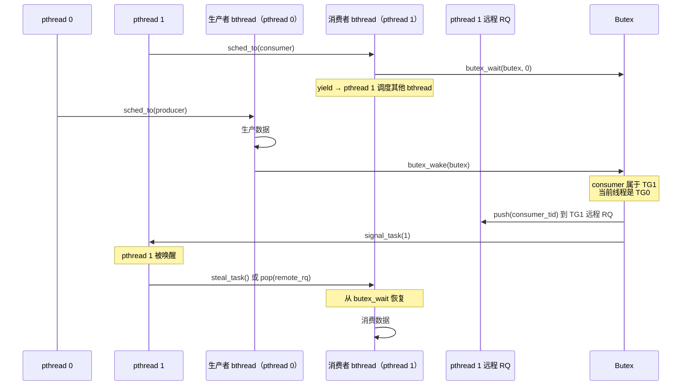

**关键点**：`butex_wake` 知道目标 bthread 属于哪个 TaskGroup，自动选择投递到本地 WSQ（同 pthread）或远程 RQ（跨 pthread）。

---

## 5. bthread 同步原语全景

### 5.1 同步原语层次

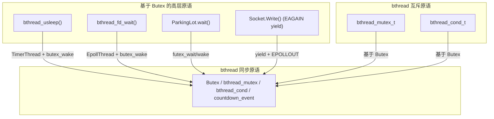

### 5.2 各原语说明

| 原语 | 用途 | 阻塞时行为 |
|---|---|---|
| `butex_wait/butex_wake` | 基础等待/唤醒 | yield，push 到 WSQ/RQ |
| `bthread_mutex_lock` | 互斥锁 | 如锁已被持有，yield |
| `bthread_mutex_trylock` | 非阻塞互斥锁 | 不阻塞，返回 EBUSY |
| `bthread_cond_wait/signal` | 条件变量 | yield |
| `bthread_countdown_event` | 倒计时事件 | yield |
| `bthread_usleep` | 定时睡眠 | yield，TimerThread 唤醒 |
| `bthread_fd_wait` | 等待 fd 事件 | yield，EpollThread 唤醒 |
| `bthread_join` | 等待 bthread 结束 | yield，结束时唤醒 |

---

## 6. 典型场景中的 Butex 使用

### 6.1 同步 RPC 调用

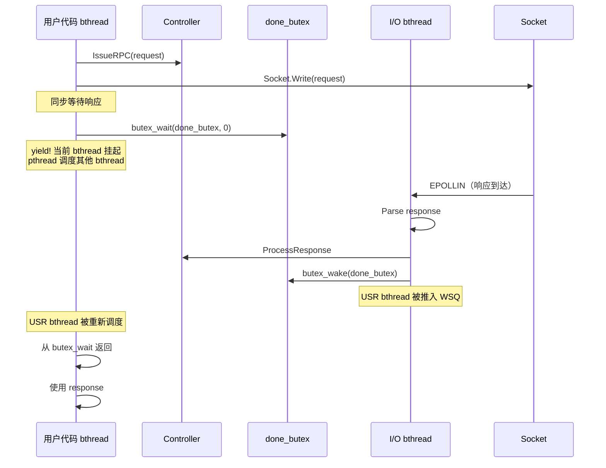

### 6.2 bthread 互斥锁

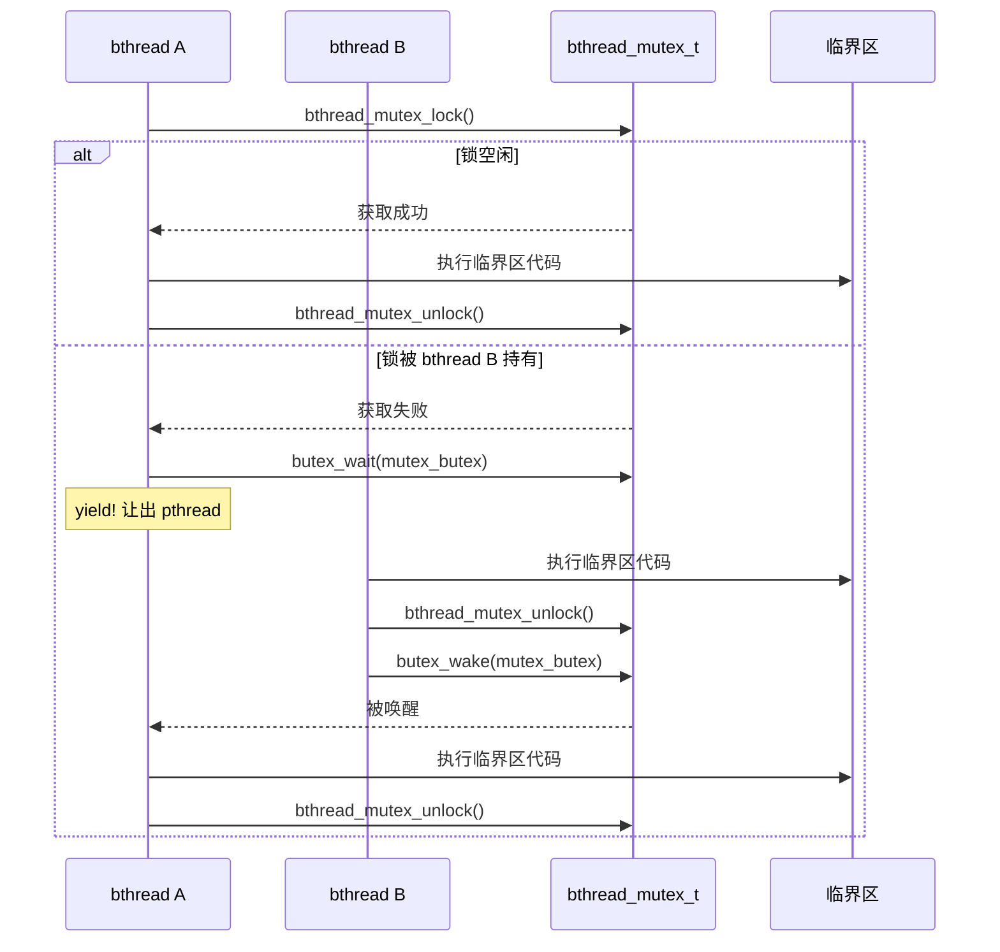

### 6.3 定时器等待

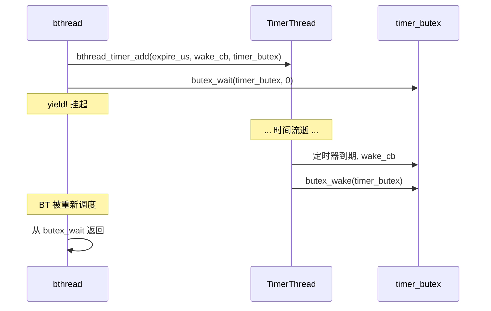

---

## 7. 为什么不用 pthread 互斥锁

### 7.1 致命问题：阻塞整个 pthread

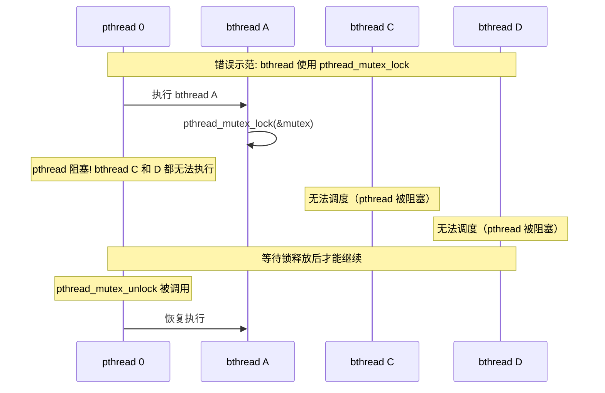

### 7.2 对比

| 特性 | pthread_mutex | bthread_mutex (butex) |
|---|---|---|
| 阻塞单位 | pthread（内核线程） | bthread（用户态协程） |
| 阻塞影响 | 同一 pthread 上所有 bthread 全部饿死 | 仅当前 bthread 让出，其他 bthread 正常执行 |
| 唤醒成本 | 内核调度（~1-10μs） | 用户态调度（~10-20ns） |
| 在 M:N 模型中 | **禁止使用** | **必须使用** |
| 最大并发 | 受限于 pthread 数量 | 仅受内存限制（百万级 bthread） |

---

## 8. 完整时序分析

### 8.1 一个 pthread 上的典型调度周期

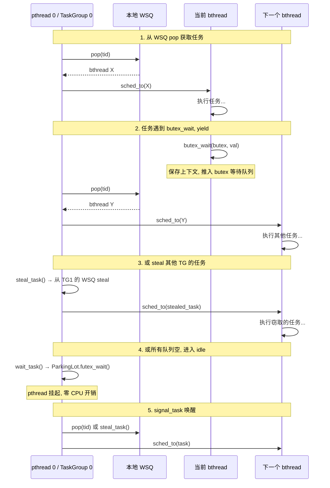

### 8.2 bthread 在不同 pthread 上恢复执行

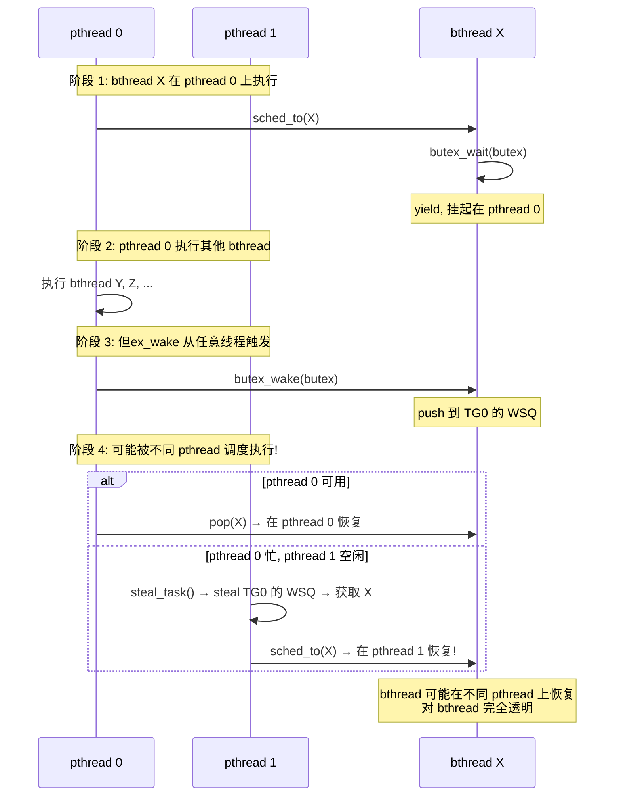

**这就是 bthread 的核心优势**：bthread 不绑定特定 pthread，任何空闲的 pthread 都可以执行它。Butex 确保了无论在哪个 pthread 上执行，语义都是正确的。
