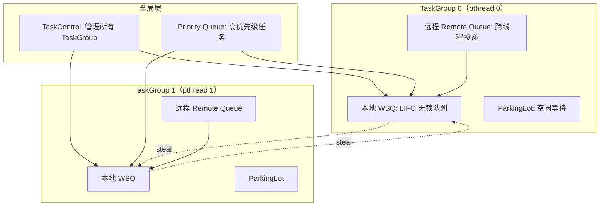
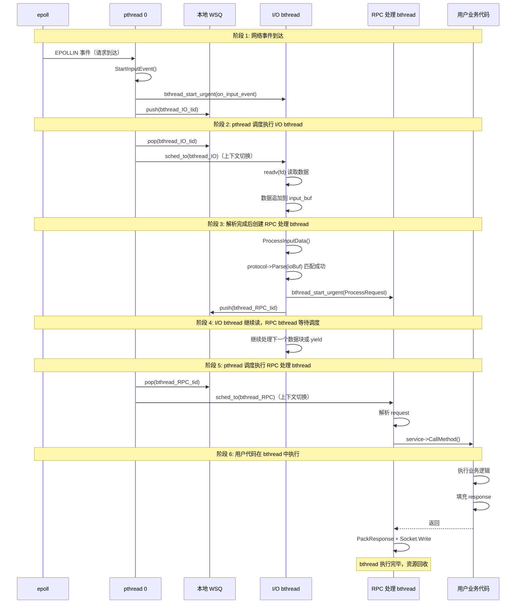
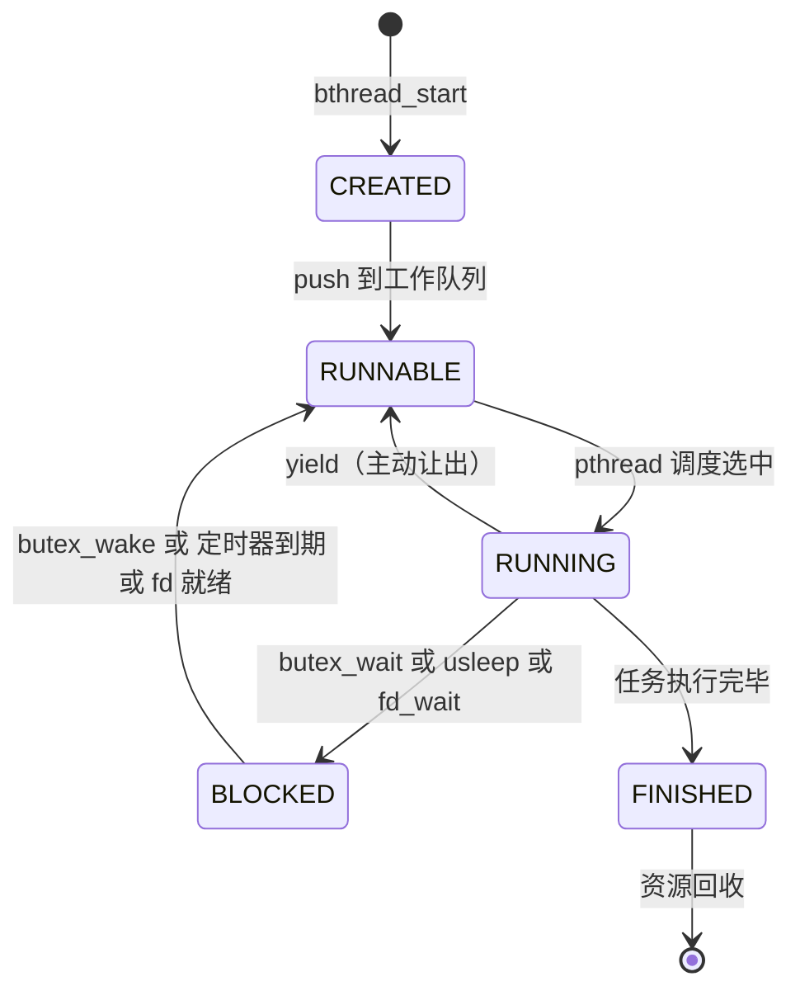
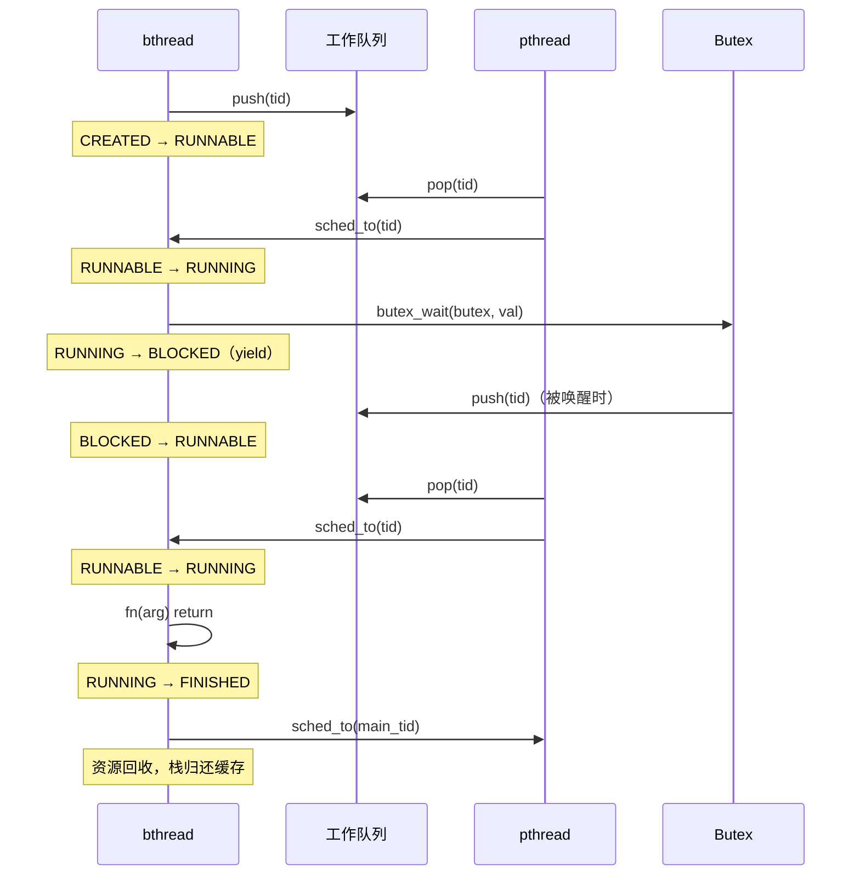
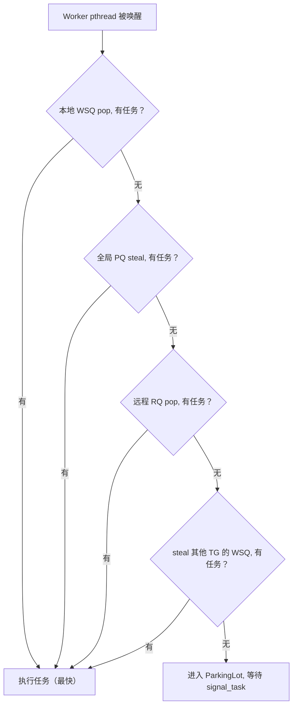
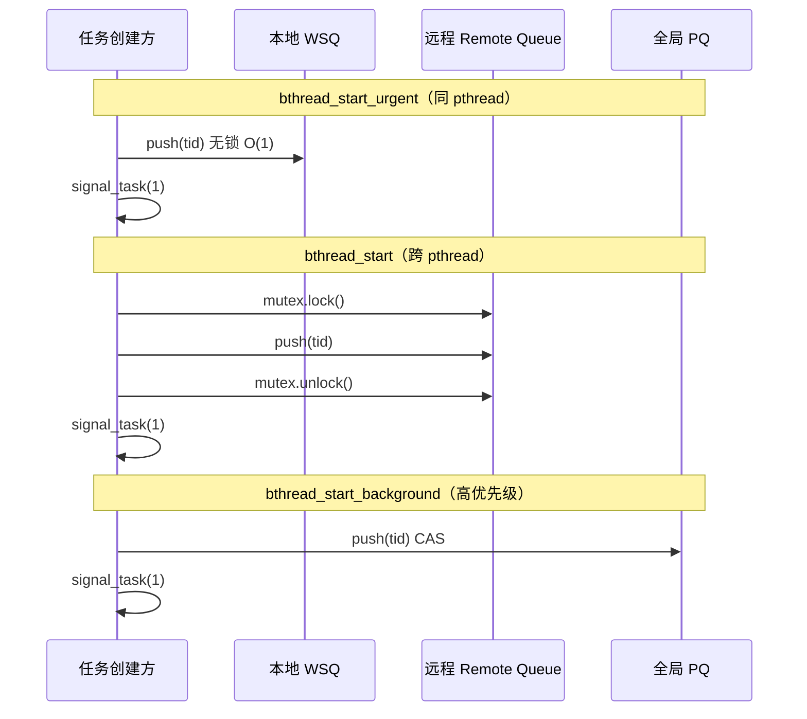
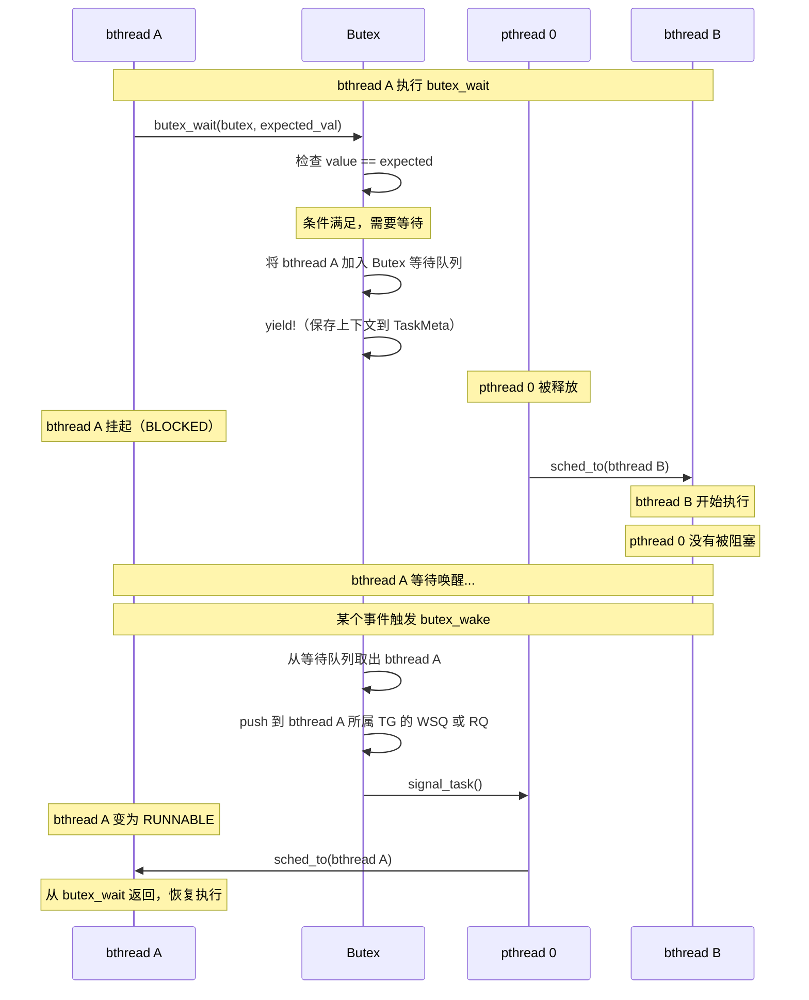
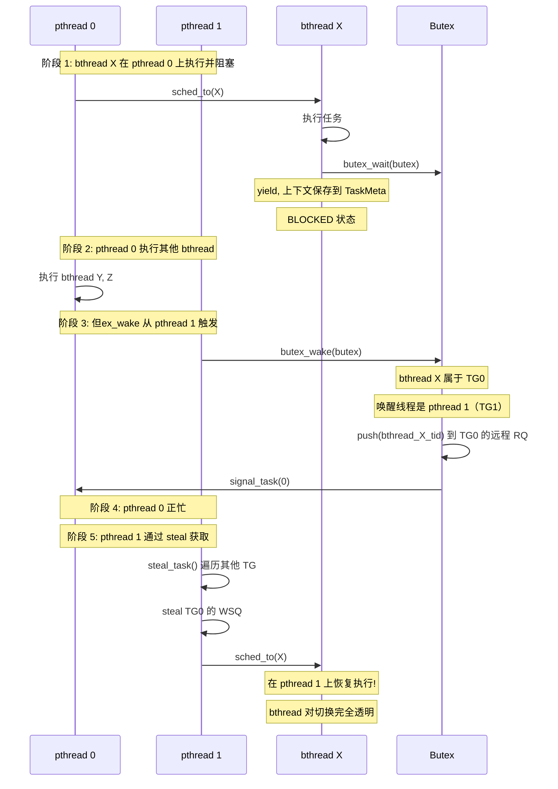
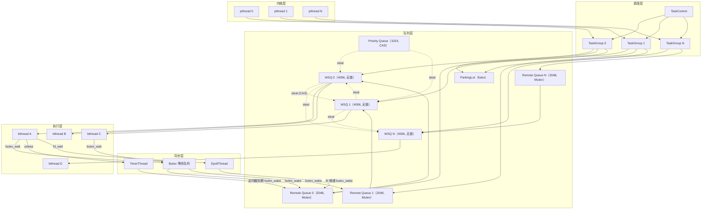

# brpc 任务调度机制总结：从用户任务到 bthread 执行

## 目录

1. [一句话概括](#1-一句话概括)
2. [完整调度模型](#2-完整调度模型)
3. [从用户任务到 bthread 执行的完整流程](#3-从用户任务到-bthread-执行的完整流程)
4. [bthread 的四种状态转换](#4-bthread-的四种状态转换)
5. [四层工作队列与调度优先级](#5-四层工作队列与调度优先级)
6. [bthread 阻塞时发生了什么](#6-bthread-阻塞时发生了什么)
7. [bthread 可以在不同 pthread 上恢复执行](#7-bthread-可以在不同-pthread-上恢复执行)
8. [所有角色与队列的关系图](#8-所有角色与队列的关系图)

---

## 1. 一句话概括

用户任务被封装为 bthread，放入 TaskGroup 的各级工作队列中，等待 Worker pthread 从队列中取出并调度执行。

```
用户任务 → 封装为 bthread → 投递到队列 → pthread 调度执行 → 完成/阻塞/让出
```

**核心概念**：

| 概念 | 说明 |
|---|---|
| bthread | 用户态轻量级协程，是任务的载体 |
| pthread | 系统内核线程，是执行单元 |
| TaskGroup | 调度器，每个 pthread 绑定一个 |
| 工作队列 | 存放待执行 bthread 的容器 |
| Butex | bthread 间同步原语（替代 pthread 锁） |

---

## 2. 完整调度模型

### 2.1 M:N 调度架构

```
                    TaskControl（全局调度管理器）
                   /        |         \
              TaskGroup0  TaskGroup1  TaskGroupN
              (pthread 0) (pthread 1) (pthread N)
              /      \     /     \     /     \
          bthread A  B  bthread E  F  bthread K  L
          bthread C  D  bthread G  H  bthread M  N
```

**M:N 映射关系**：N 个 bthread 共享 M 个 pthread（默认 M=8+1），一个 pthread 同时只执行一个 bthread。

### 2.2 调度组件



### 2.3 关键数据结构

```c
// pthread 与 TaskGroup 的绑定（TLS）
__thread TaskGroup* tls_task_group = NULL;

// 每个 TaskGroup 包含
struct TaskGroup {
    WorkStealingQueue<bthread_t>  _rq;        // 本地 WSQ（4096）
    RemoteTaskQueue               _remote_rq; // 远程队列（2048, Mutex）
    TaskMeta*                     _cur_meta;  // 当前执行的 bthread
    ParkingLot*                   _pl;        // 空闲等待
};

// 每个 bthread 的元数据
struct TaskMeta {
    bthread_t       tid;     // bthread ID
    TaskGroup*      group;   // 所属 TaskGroup
    Context         ctx;     // 执行上下文（汇编保存/恢复）
    void*           stack;   // 独立栈（默认 1MB）
};
```

---

## 3. 从用户任务到 bthread 执行的完整流程

### 3.1 以 RPC 请求为例



### 3.2 核心步骤总结

| 步骤 | 操作 | 说明 |
|---|---|---|
| 1 | 任务到达 | 网络事件、定时器、但ex_wake 等 |
| 2 | 创建 bthread | 分配 TaskMeta + 栈，填充入口函数 |
| 3 | 投递到队列 | push 到 WSQ（本地）或 Remote Queue（跨线程） |
| 4 | 唤醒 Worker | signal_task() 唤醒空闲 pthread |
| 5 | pthread 调度 | 从队列 pop/steal 获取 bthread |
| 6 | 上下文切换 | `sched_to(tid)` 切换到 bthread 栈执行 |
| 7 | 任务执行 | 执行用户函数 fn(arg) |
| 8 | 完成/阻塞 | return 结束 或 butex_wait 阻塞 |

---

## 4. bthread 的四种状态转换

### 4.1 状态机



### 4.2 各状态详解

| 状态 | 存储位置 | CPU 使用 | 说明 |
|---|---|---|---|
| CREATED | 栈上临时 | 无 | TaskMeta 已分配，尚未入队 |
| RUNNABLE | WSQ 或 Remote Queue | 无 | 等待 pthread 调度 |
| RUNNING | pthread 栈 | 占用 | 正在执行用户代码 |
| BLOCKED | Butex 等待队列 | 无 | 等待事件，pthread 已释放 |
| FINISHED | 无 | 无 | 执行完毕，等待回收 |

### 4.3 状态转换时序



---

## 5. 四层工作队列与调度优先级

### 5.1 四层队列概览

| 队列 | 数量 | 容量 | 锁 | 用途 |
|---|---|---|---|---|
| 本地 WSQ | 每个 TG 1 个 | 4096 | 无锁 | 同 pthread 上的任务 |
| 远程 Remote Queue | 每个 TG 1 个 | 2048 | Mutex | 跨线程投递的任务 |
| 全局 Priority Queue | 每个 tag 1 个 | 1024 | CAS | 高优先级后台任务 |
| Socket WriteQueue | 每个 Socket 1 个 | 无硬限制 | 单线程写 | 待发送的网络数据 |

### 5.2 调度优先级（决策树）



### 5.3 队列投递路径



---

## 6. bthread 阻塞时发生了什么

### 6.1 阻塞场景

bthread 遇到以下情况会主动 yield，让出 pthread：

| 场景 | 调用 | 行为 |
|---|---|---|
| 等待 RPC 响应 | `butex_wait()` | 加入 Butex 等待队列，yield |
| 定时等待 | `bthread_usleep()` | 注册定时器，butex_wait，yield |
| 等待 I/O | `bthread_fd_wait()` | 注册 epoll，butex_wait，yield |
| 写缓冲区满 | `Socket.Write()` EAGAIN | yield，等待 EPOLLOUT |

### 6.2 但ex_wait 阻塞流程



### 6.3 与 pthread 阻塞的对比

| 特性 | pthread 阻塞 | bthread yield |
|---|---|---|
| 阻塞对象 | 整个内核线程 | 仅当前 bthread |
| 其他任务 | 同 pthread 上所有任务饿死 | 其他 bthread 正常执行 |
| 上下文切换 | 内核态 ~1-10us | 用户态 ~10-20ns |
| 适用场景 | M:1 模型 | M:N 模型 |

---

## 7. bthread 可以在不同 pthread 上恢复执行

### 7.1 核心原理

bthread 不绑定特定 pthread。任何空闲的 pthread 都可以从工作队列中获取并执行 bthread。bthread 的执行上下文（栈、寄存器等）保存在 TaskMeta 中，与 pthread 无关。

### 7.2 跨 pthread 恢复时序



### 7.3 为什么能跨 pthread

```
bthread 执行上下文存储在 TaskMeta 中（与 pthread 无关）:

TaskMeta {
    tid:    bthread ID
    stack:  独立的用户态栈（默认 1MB）
    ctx:    CPU 寄存器（bthread_jump_fcontext 保存/恢复）
    fn:     入口函数指针
}

→ 上下文切换: 保存当前 CPU 寄存器到 meta.ctx，加载目标 meta.ctx
→ 不涉及内核调度: 纯用户态操作
→ 任何 pthread 都可以加载同一个 meta.ctx 并恢复执行
```

---

## 8. 所有角色与队列的关系图

### 8.1 全景关系图



### 8.2 角色职责一览

| 角色 | 数量 | 职责 |
|---|---|---|
| pthread | M+1（默认 9） | 执行 bthread 的物理线程 |
| TaskGroup | M+1 | 每个 pthread 绑定一个，管理队列和调度 |
| TaskControl | 1 | 全局管理，signal_task，steal 协调 |
| WorkStealingQueue | 每个 TG 1 个 | 本地 LIFO 无锁队列（owner push/pop, thief steal） |
| RemoteTaskQueue | 每个 TG 1 个 | 跨线程任务投递（Mutex 保护） |
| Priority Queue | 每个 tag 1 个 | 高优先级全局任务 |
| ParkingLot | 每 tag 4 个 | Worker 空闲等待（futex） |
| Butex | 动态创建 | bthread 阻塞/唤醒同步 |
| TimerThread | 1 | 定时器管理，bthread_usleep 支持 |
| EpollThread | 每 TG 1 个 | I/O 多路复用，bthread_fd_wait 支持 |

### 8.3 数据流向总结

```
任务创建
  └─ bthread_start_urgent    → 本地 WSQ（最快，~100ns）
  └─ bthread_start           → 本地 WSQ（同 TG）或 远程 RQ（跨 TG）
  └─ bthread_start_background → 全局 PQ（高优先级）

任务调度
  └─ 优先级: 本地 WSQ > 全局 PQ > 远程 RQ > steal 其他 WSQ
  └─ 全部空 → ParkingLot 等待 signal_task

任务执行
  └─ sched_to(tid): 上下文切换到 bthread 栈
  └─ 执行 fn(arg): 用户代码

任务阻塞
  └─ butex_wait → 保存上下文 → yield → 加入 Butex 等待队列
  └─ pthread 被释放，调度其他 bthread

任务唤醒
  └─ butex_wake → 从等待队列取出 → push 到 WSQ/RQ → signal_task
  └─ 任意 pthread 都可以恢复执行该 bthread

任务完成
  └─ fn return → ending_sched → 归还栈和 TaskMeta → 切回 worker 主循环
```
