# brpc工作窃取机制分析

## 目录

1. [概述与设计动机](#1-概述与设计动机)
2. [Chase-Lev Deque 数据结构](#2-chase-lev-deque-数据结构)
3. [Push 操作（Owner）](#3-push-操作owner)
4. [Pop 操作（Owner）](#4-pop-操作owner)
5. [Steal 操作（Thief）](#5-steal-操作thief)
6. [Pop 与 Steal 的竞争处理](#6-pop-与-steal-的竞争处理)
7. [质数步长随机游走窃取策略](#7-质数步长随机游走窃取策略)
8. [调度决策树](#8-调度决策树)
9. [Remote Task Queue（MPSC）](#9-remote-task-queuemspsc)
10. [全局优先队列](#10-全局优先队列)
11. [ParkingLot 空闲等待与唤醒](#11-parkinglot-空闲等待与唤醒)
12. [EpollThread 与 I/O 等待](#12-epollthread-与-io-等待)
13. [性能优化设计](#13-性能优化设计)
14. [BTHREAD_FAIR_WSQ 公平模式](#14-bthread_fair_wsq-公平模式)
15. [与其他系统对比](#15-与其他系统对比)
16. [源码索引](#16-源码索引)

---

## 1. 概述与设计动机

### 1.1 什么是工作窃取

工作窃取（Work Stealing）是一种**多处理器任务调度范式**：每个 worker 线程维护自己的本地任务队列，当本地队列空闲时，从其他 worker 的队列中"窃取"任务。

### 1.2 为什么需要工作窃取

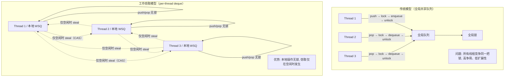

### 1.3 工作窃取 vs 其他调度模型

| 特性 | 全局锁队列 | Work Stealing | Centralized Broker |
|---|---|---|---|
| 本地操作开销 | O(1) + 锁 | O(1) 无锁 | O(1) 无锁 |
| 跨线程调度 | O(1) + 锁 | O(1) CAS | O(1) IPC |
| 锁争用 | 高（所有线程） | 低（仅空闲线程） | 无（单点） |
| 缓存局部性 | 差（任务随机分配） | 好（本地任务复用缓存） | 差 |
| 扩展性 | 差（锁瓶颈） | 好（无锁 + 分布） | 差（单点瓶颈） |
| 负载均衡 | 自然均衡 | 窃取实现均衡 | Broker 负责均衡 |
| 实现复杂度 | 低 | 中 | 低 |

### 1.4 brpc 选择工作窃取的原因

brpc 使用 M:N 协程模型（少量 pthread 调度大量 bthread），需要高效的调度器：

1. **高并发 RPC**：每秒百万级 RPC 请求，每个请求创建 bthread，调度频率极高
2. **I/O 密集型**：大量 bthread 在等待 I/O（yield），只有少量在执行
3. **缓存友好**：同一个连接的请求倾向于在同一 worker 处理，L1/L2 缓存命中率高
4. **无锁本地操作**：push/pop 无需 CAS，远快于全局队列
5. **自然负载均衡**：繁忙的 worker 的任务被空闲 worker 自动窃取

---

## 2. Chase-Lev Deque 数据结构

### 2.1 内存布局

```c
// src/bthread/work_stealing_queue.h
template <typename T>
class WorkStealingQueue {
    butil::atomic<size_t>  _bottom;    // Owner 写（push/pop）
    size_t                 _capacity;  // 2 的幂次，固定不变
    T*                     _buffer;    // 循环数组

    // 64 字节缓存行对齐，防止与 _bottom 伪共享
    BAIDU_CACHELINE_ALIGNMENT
    butil::atomic<size_t>  _top;       // Thief 读/写（steal）
};
```

### 2.2 内存布局可视化

```
低地址                                                            高地址
┌────────────┬────────────┬──────────────────────┬══════════════════┬────────────┐
│  _bottom   │ _capacity  │      _buffer        │   64B padding    │   _top     │
│  (8 bytes) │ (8 bytes)  │   (N × 8 bytes)     │   (cache line)   │ (8 bytes)  │
└────────────┴────────────┴──────────────────────┴══════════════════┴────────────┘
▲ Owner 读写                         Owner 写                        ▲ Thief 读写
▲ 缓存行 1                                                         ▲ 缓存行 2（独立）
```

**关键设计**：`_top` 与 `_bottom` 之间有 64 字节缓存行填充，确保：
- Owner 修改 `_bottom` 不会导致 Thief 缓存行失效
- Thief 修改 `_top` 不会导致 Owner 缓存行失效

### 2.3 循环数组索引

```
_bottom 和 _top 从 1 开始（不是 0），单调递增
实际索引 = position & (_capacity - 1)

例: capacity = 8, mask = 0b111

_bottom = 13, _top = 9
有效元素: 位置 9, 10, 11, 12（4个元素）
索引: 9&7=1, 10&7=2, 11&7=3, 12&7=4

┌───┬───┬───┬───┬───┬───┬───┬───┐
│ 0 │ 1 │ 2 │ 3 │ 4 │ 5 │ 6 │ 7 │
│   │ E1│ E2│ E3│ E4│   │   │   │
└───┴───┴───┴───┴───┴───┴───┴───┘
              ▲               ▲
            _top=9         _bottom=13
```

### 2.4 关键常量

| 参数 | 值 | 说明 |
|---|---|---|
| WSQ capacity | 4096 | 本地队列容量（gflag: task_group_runqueue_capacity） |
| Remote queue capacity | 2048 | 远程队列容量（WSQ / 2） |
| Priority queue capacity | 1024 | 全局优先队列容量 |
| Cache line size | 64 字节 | x86-64 缓存行大小 |
| 质数偏移表大小 | 444 个 | 窃取随机游走的步长候选 |

---

## 3. Push 操作（Owner）

### 3.1 算法

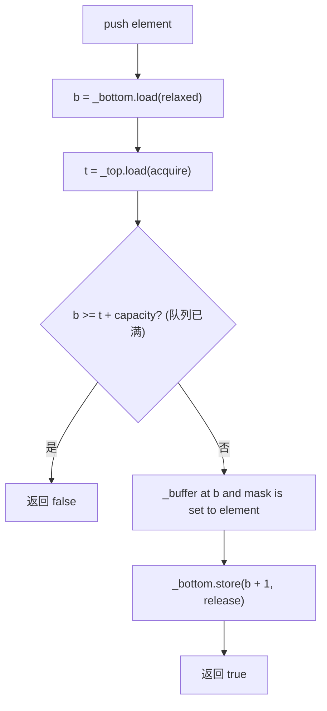

### 3.2 代码与内存序

```c
bool push(const T& x) {
    const size_t b = _bottom.load(butil::memory_order_relaxed);
    const size_t t = _top.load(butil::memory_order_acquire);
    if (b >= t + _capacity) return false;    // 满队列

    _buffer[b & (_capacity - 1)] = x;       // 写入缓冲区
    _bottom.store(b + 1, butil::memory_order_release);  // 发布新元素
    return true;
}
```

**内存序分析**：

| 操作 | 内存序 | 原因 |
|---|---|---|
| `_bottom` load | relaxed | push 是 owner-only，无需同步 |
| `_top` load | acquire | 与 steal 的 seq_cst CAS 同步，防止覆盖被窃取的槽位 |
| `_buffer` write | 无显式序 | 被 _bottom 的 release 间接排序 |
| `_bottom` store | release | 确保 buffer 写入在 _bottom 递增前可见 |

**为什么不需要 CAS**：push 只有 owner 执行，不存在并发写入，所以无需 CAS。

---

## 4. Pop 操作（Owner）

### 4.1 算法

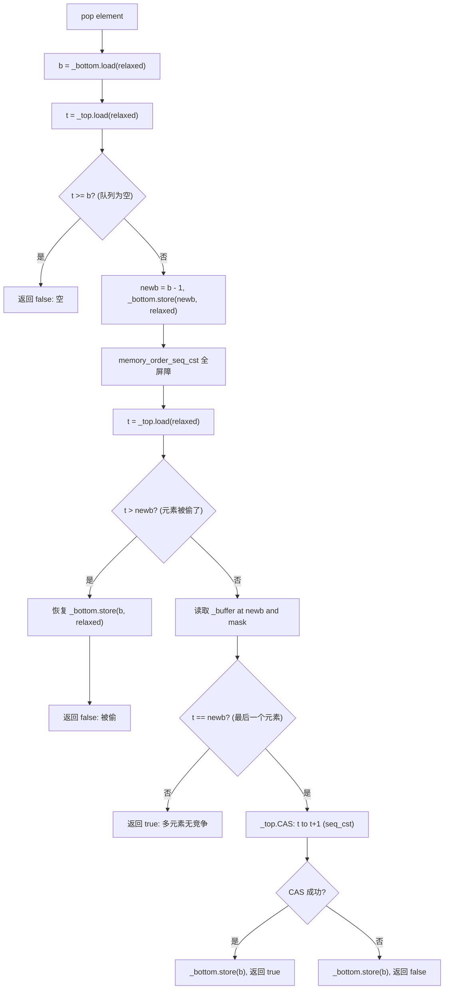

### 4.2 代码

```c
bool pop(T* val) {
    const size_t b = _bottom.load(butil::memory_order_relaxed);
    size_t t = _top.load(butil::memory_order_relaxed);
    if (t >= b) return false;                    // 空队列（快速路径）

    const size_t newb = b - 1;
    _bottom.store(newb, butil::memory_order_relaxed);
    butil::atomic_thread_fence(butil::memory_order_seq_cst);  // 全屏障
    t = _top.load(butil::memory_order_relaxed);

    if (t > newb) {                               // 被 steal 抢先
        _bottom.store(b, butil::memory_order_relaxed);
        return false;
    }

    *val = _buffer[newb & (_capacity - 1)];

    if (t != newb) return true;                   // 多元素：无竞争

    // 单元素：与 steal 竞争，用 CAS 决胜
    const bool popped = _top.compare_exchange_strong(
        t, t + 1,
        butil::memory_order_seq_cst,
        butil::memory_order_relaxed);
    _bottom.store(b, butil::memory_order_relaxed);
    return popped;
}
```

---

## 5. Steal 操作（Thief）

### 5.1 算法

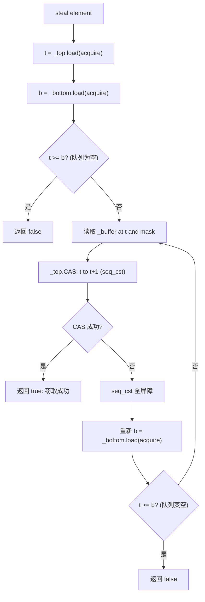

### 5.2 代码

```c
bool steal(T* val) {
    size_t t = _top.load(butil::memory_order_acquire);
    size_t b = _bottom.load(butil::memory_order_acquire);
    if (t >= b) return false;                    // 空

    do {
        butil::atomic_thread_fence(butil::memory_order_seq_cst);
        b = _bottom.load(butil::memory_order_acquire);
        if (t >= b) return false;                // 重新检查

        *val = _buffer[t & (_capacity - 1)];
    } while (!_top.compare_exchange_strong(t, t + 1,
                                           butil::memory_order_seq_cst,
                                           butil::memory_order_relaxed));
    return true;
}
```

**关键细节**：元素在 CAS 之前读取，这是安全的，因为：
- 索引单调递增，CAS 验证位置 t 未被回收
- 如果 CAS 成功，说明位置 t 的元素未被覆盖

**允许假阴性**：如果在初始检查和 CAS 之间队列变空又重新填充，steal 可能返回 false。这是为了性能而做的妥协。

---

## 6. Pop 与 Steal 的竞争处理

### 6.1 单元素竞争场景

这是 Chase-Lev 算法最核心的竞争场景——队列中只剩一个元素：

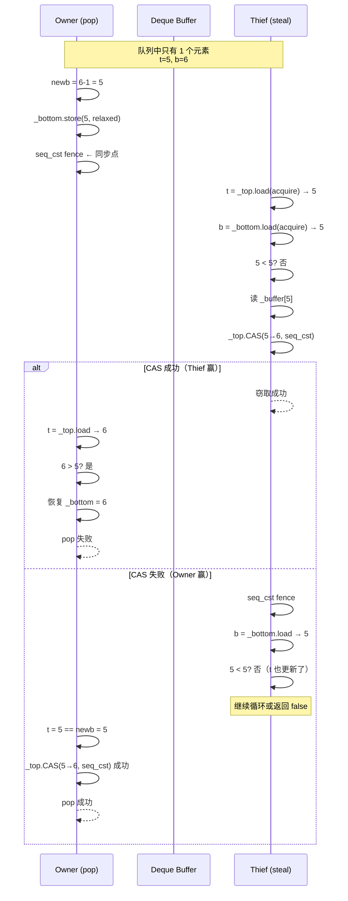

### 6.2 seq_cst 全屏障的作用

```
Owner:  _bottom.store(newb)  →  seq_cst fence  →  _top.load()
                                          ↕ 排序保证
Thief:  _buffer[t] read     →  seq_cst fence  →  _top.CAS()

屏障确保:
1. Owner 的 _bottom 递减在 Thief 的 _buffer 读取前可见
2. Thief 的 CAS 在 Owner 的 _top 读取前可见
3. 两个操作的全序关系通过 seq_cst 建立
```

### 6.3 各场景竞争结果

| 场景 | Owner 操作 | Thief 操作 | 结果 |
|---|---|---|---|
| 多元素 + pop + steal | pop 底部元素 | steal 顶部元素 | 各自成功，无竞争 |
| 单元素 + pop 赢 | CAS(t→t+1) 成功 | CAS(t→t+1) 失败 | Owner 获得元素 |
| 单元素 + steal 赢 | CAS(t→t+1) 失败 | CAS(t→t+1) 成功 | Thief 获得元素 |
| 空 + pop | t >= b 检查 | - | pop 返回空 |
| 空 + steal | - | t >= b 检查 | steal 返回空 |
| push + steal | push 写入 | steal 读取 | acquire/release 保证可见性 |

---

## 7. 质数步长随机游走窃取策略

### 7.1 算法

```
初始化:
  _steal_seed = fast_rand()           // 随机起始位置
  _steal_offset = prime_offset(seed)  // 从 444 个质数中选一个

窃取时:
  for i in 0..ngroup-1:
      victim = groups[(seed + i * offset) % ngroup]
      if victim._rq.steal(tid): success
      if victim._remote_rq.pop(tid): success
  seed += ngroup * offset  // 下次窃取从不同位置开始
```

### 7.2 为什么用质数步长

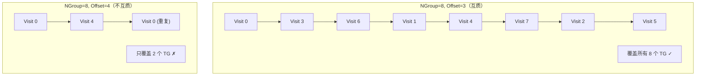

**关键**：步长与 ngroup 互质时，`gcd(stride, ngroup) = 1`，保证遍历所有组。质数步长几乎总是与 ngroup 互质。

### 7.3 多 Thief 的分散性

```
Thief A: seed=100, offset=37261 → 访问顺序: 100, 103, 106, ...
Thief B: seed=200, offset=38453 → 访问顺序: 200, 203, 206, ...
Thief C: seed=300, offset=39107 → 访问顺序: 300, 303, 306, ...

不同起始位置 + 不同质数步长 → 不同的 Thief 几乎不会同时访问同一个 TG
```

---

## 8. 调度决策树

### 8.1 完整调度流程

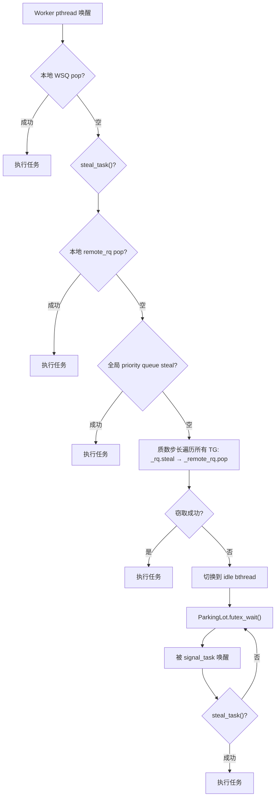

### 8.2 任务提交流程

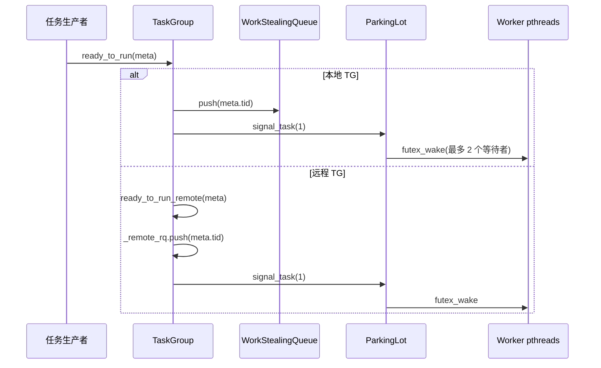

### 8.3 优先级顺序

```
调度优先级（从高到低）:
  1. 本地 WSQ pop          → LIFO，利用时间局部性，最快
  2. 全局 priority queue    → 高优先级任务，bypass 所有队列
  3. 本地 remote_rq pop     → 其他线程投递的任务
  4. 其他 TG WSQ steal     → 跨 TG 工作窃取
  5. 其他 TG remote_rq pop → 跨 TG 远程队列窃取
  6. ParkingLot wait       → 无任务，挂起等待
```

---

## 9. Remote Task Queue（MPSC）

### 9.1 设计

```c
// src/bthread/remote_task_queue.h
class RemoteTaskQueue {
    butil::BoundedQueue<bthread_t> _tasks;  // 有界队列，容量 2048
    butil::Mutex _mutex;                    // 互斥锁保护
};
```

**为什么不用无锁队列**：代码注释说明——由于非 worker 线程随机选择 TG 投递，争用已经被分散了，简单的互斥锁队列足够。

### 9.2 信号批量优化

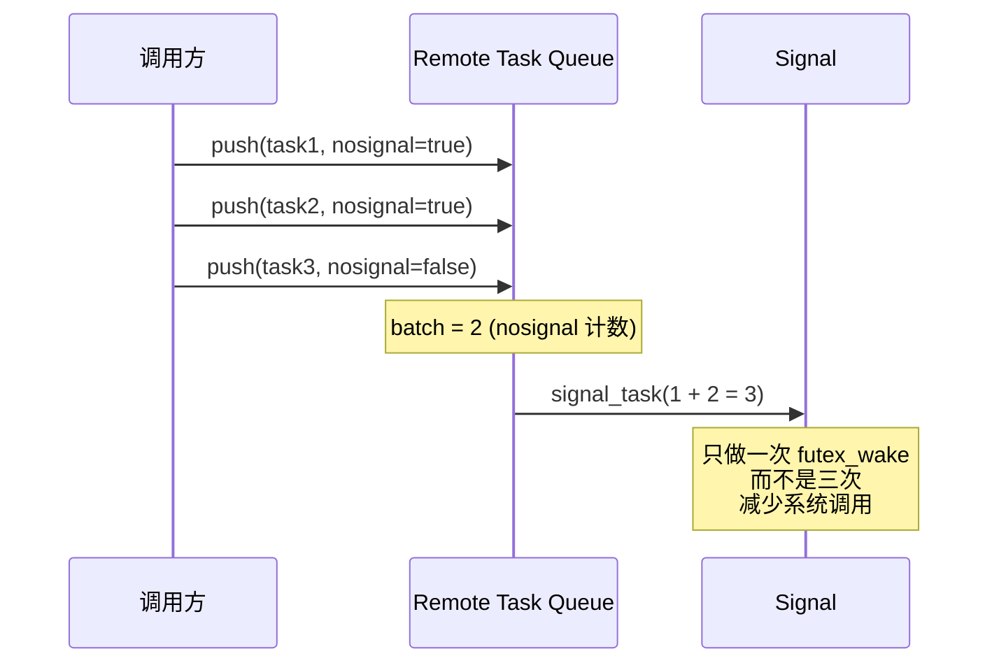

---

## 10. 全局优先队列

```c
// src/bthread/task_control.h
std::vector<WorkStealingQueue<bthread_t>> _priority_queues;
```

- 每种 tag 一个优先级 WSQ，容量 1024
- 仅当 `enable_bthread_priority_queue=true` 时启用（默认关闭）
- 带有 `BTHREAD_GLOBAL_PRIORITY` 标志的任务在完成后进入优先队列
- steal_task() 优先检查优先队列，确保高优先级任务被优先执行

---

## 11. ParkingLot 空闲等待与唤醒

### 11.1 ParkingLot 结构

```c
class ParkingLot {
    BAIDU_CACHELINE_ALIGNMENT  // 缓存行对齐
    butil::atomic<int> _pending_signal;  // 待处理信号数
    int _waiter_num;                    // 等待者数量
    // 内部 futex 实现
};
```

- 每个 tag 有 4 个 ParkingLot（分片减少 futex 争用）
- 每个 TaskGroup 绑定到固定 ParkingLot（hash 分配）

### 11.2 等待与唤醒时序

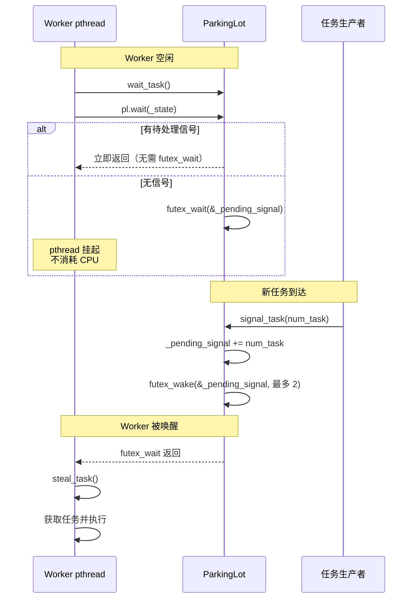

### 11.3 signal_task 的智能策略

```c
void signal_task(int num_task, bthread_tag_t tag) {
    if (num_task > 2) num_task = 2;  // 最多唤醒 2 个

    // 在多个 ParkingLot 分片上唤醒
    for (i = 0; i < pl_count && num_task > 0; ++i) {
        num_task -= pl[start].signal(1);
    }

    // 如果还有信号且未达最大并发，动态增加 worker
    if (num_task > 0 && _concurrency < max_concurrency) {
        add_workers(1, tag);
    }
}
```

---

## 12. EpollThread 与 I/O 等待

### 12.1 架构

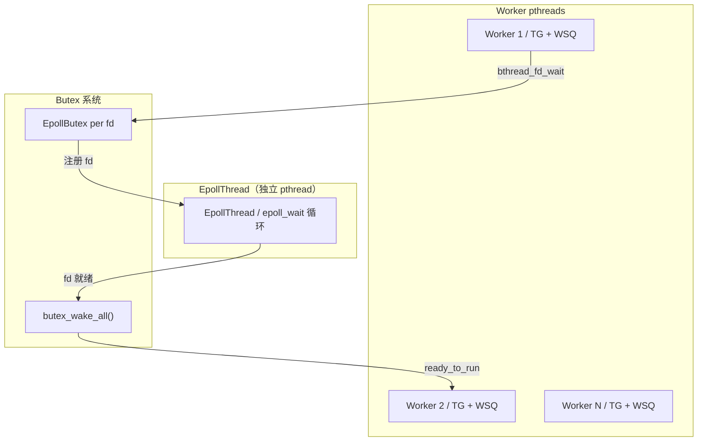

### 12.2 I/O 等待流程

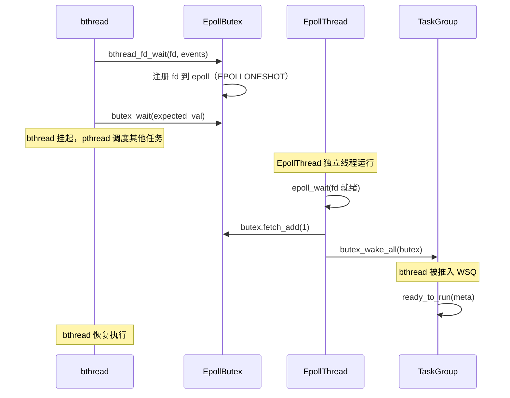

**设计优势**：
- EpollThread 是独立的 pthread，不占用 worker
- Worker 通过 butex/futex 挂起，零 CPU 开销
- fd 就绪后，bthread 被投递到 TaskGroup 的 WSQ，正常调度

---

## 13. 性能优化设计

### 13.1 缓存行对齐总览

| 结构 | 对齐方式 | 避免的伪共享 |
|---|---|---|
| WSQ._top | `BAIDU_CACHELINE_ALIGNMENT` 前置 | Owner._bottom 与 Thief._top |
| ParkingLot | 整体缓存行对齐 | 相邻 ParkingLot 的 _pending_signal |
| Butex | 整体 64 字节（static_assert） | value/waiters/waiter_lock |
| TimerThread::Task | 缓存行对齐 | 相邻 timer 条目 |
| TimerThread::Bucket | 缓存行对齐 | 相邻 bucket |

### 13.2 其他优化

| 优化 | 说明 |
|---|---|
| 信号上限 2 | `signal_task` 最多唤醒 2 个 worker，防止惊群 |
| nosignal 批量 | 多个 push 延迟信号，最后一次批量发送 |
| ParkingLot 分片 | 4 个 ParkingLot 分散 futex 争用 |
| 固定容量 WSQ | 无 grow/shrink，避免内存分配和指针重定位 |
| 快速路径 | 空/满检查用 relaxed load，仅竞争路径用 seq_cst |
| EpollThread 分离 | I/O 等待不占用 worker 资源 |
| 动态 worker 扩展 | 信号量耗尽时可增加 worker（最大 bthread_concurrency） |

---

## 14. BTHREAD_FAIR_WSQ 公平模式

### 14.1 问题

默认模式下，Owner 使用 `pop()`（从底部取），Thief 使用 `steal()`（从顶部取）。当两者竞争单元素时：

- `pop()` 先递减 `_bottom`，有"先手"优势
- 在高频竞争下，Owner 总是赢，Thief 可能饿死

### 14.2 解决方案

```c
#ifdef BTHREAD_FAIR_WSQ
    const bool popped = g->_rq.steal(&next_tid);  // Owner 也用 steal
#else
    const bool popped = g->_rq.pop(&next_tid);    // Owner 用 pop（默认）
#endif
```

### 14.3 性能代价

| 模式 | WSQ::steal CPU 占比 | 公平性 |
|---|---|---|
| 默认（Owner 用 pop） | 1.9% | Owner 优先 |
| BTHREAD_FAIR_WSQ | 2.9% | 完全公平 |

公平模式 steal 开销增加 **52%**（1.9% → 2.9%），但保证 Owner 和 Thief 有同等概率获取单元素。

---

## 15. 与其他系统对比

### 15.1 各系统工作窃取实现对比

| 特性 | brpc bthread | Go runtime | Java ForkJoinPool | TBB |
|---|---|---|---|---|
| 数据结构 | Chase-Lev Deque | FIFO + 全局队列 | WorkStealingQueue | ConcurrentQueue |
| 本地操作 | 无锁 push/pop | 无锁 push/pop | 无锁 push/pop | 无锁 push/pop |
| 窃取操作 | CAS steal | CAS steal | CAS steal | CAS steal |
| 容量 | 4096（固定） | 256（动态） | 2^15（动态） | 动态 |
| 缓存行对齐 | 64B（_top） | 64B | 无 | 有 |
| 内存序 | seq_cst（竞争路径） | CAS | volatile + CAS | CAS |
| 全局队列 | 优先队列 | 全局 runq | 无 | 无 |
| 空闲等待 | ParkingLot futex | futex + netpoll | park/unpark | condition_variable |
| 公平模式 | 可选 BTHREAD_FAIR_WSQ | 非公平（更优性能） | 公平 | 公平 |

### 15.2 Chase-Lev vs 其他无锁队列

| 特性 | Chase-Lev Deque | MS-Queue (MPSC) | Wyman Queue | Cilk The Work-Stealing Deque |
|---|---|---|---|---|
| 生产者 | 1（Owner） | N（多生产者） | N | 1（Owner） |
| 消费者 | 1+N（Owner+Thieves） | 1（单消费者） | 1 | 1+N |
| 方向 | 双端（LIFO+LFIFO） | 单端（FIFO） | 单端 | 双端 |
| 竞争处理 | seq_cst CAS（单元素） | CAS | CAS | 无 CAS |
| ABA 问题 | 无（单调递增索引） | 有（需 hazard pointer） | 有 | 无 |

---

## 16. 源码索引

### WorkStealingQueue

| 文件 | 内容 |
|---|---|
| `src/bthread/work_stealing_queue.h` | Chase-Lev Deque 完整实现（push/pop/steal） |

### TaskGroup 调度

| 文件 | 内容 |
|---|---|
| `src/bthread/task_group.h` | TaskGroup 类、steal_task()、ready_to_run() |
| `src/bthread/task_group.cpp` | sched()、ending_sched()、run_main_task()、wait_task()、push_rq()、ready_to_run_remote() |
| `src/bthread/task_group_inl.h` | push_rq() 内联实现 |

### TaskControl 全局调度

| 文件 | 内容 |
|---|---|
| `src/bthread/task_control.h` | TaskControl 类、_priority_queues、signal_task() |
| `src/bthread/task_control.cpp` | steal_task()、signal_task()、add_workers()、初始化 |

### 远程队列与同步

| 文件 | 内容 |
|---|---|
| `src/bthread/remote_task_queue.h` | RemoteTaskQueue（MPSC，mutex 保护） |
| `src/bthread/parking_lot.h` | ParkingLot（futex 等待/唤醒） |
| `src/bthread/butex.h/.cpp` | Butex 同步原语 |
| `src/bthread/fd.cpp` | EpollThread、fd_wait、bthread_fd_wait |

### 质数步长

| 文件 | 内容 |
|---|---|
| `src/bthread/prime_offset.h` | prime_offset() 函数 |
| `src/bthread/offset_inl.list` | 444 个质数偏移表 |

### 类型常量

| 文件 | 内容 |
|---|---|
| `src/bthread/types.h` | BTREAD_MAX_CONCURRENCY、BTHREAD_EPOLL_THREAD_NUM |
| `src/butil/compiler_specific.h` | BAIDU_CACHELINE_SIZE/ALIGNMENT |
