# brpc 工作队列与 bthread 生命周期分析

## 目录

1. [概述](#1-概述)
2. [工作队列全景图](#2-工作队列全景图)
3. [Per-TaskGroup 本地 WSQ](#3-per-taskgroup-本地-wsq)
4. [Per-TaskGroup 远程队列 Remote Queue](#4-per-taskgroup-远程队列-remote-queue)
5. [全局优先队列 Priority Queue](#5-全局优先队列-priority-queue)
6. [请求的 bthread 分配全流程](#6-请求的-bthread-分配全流程)
7. [响应的 bthread 分配流程](#7-响应的-bthread-分配流程)
8. [bthread 生命周期](#8-bthread-生命周期)
9. [bthread 创建与调度路径](#9-bthread-创建与调度路径)
10. [bthread 阻塞与唤醒](#10-bthread-阻塞与唤醒)
11. [bthread 销毁与资源回收](#11-bthread-销毁与资源回收)
12. [各场景 bthread 分配总结](#12-各场景-bthread-分配总结)
13. [配置参数](#13-配置参数)
14. [源码索引](#14-源码索引)

---

## 1. 概述

brpc 中存在**四类工作队列**，分布在不同的调度层级，协同完成 bthread 的调度：

| 队列类型 | 数量 | 容量 | 所有者 | 锁 |
|---|---|---|---|---|
| 本地 WSQ | 每个 TaskGroup 1 个 | 4096 | Worker pthread | 无锁（owner-only push/pop） |
| 远程 Remote Queue | 每个 TaskGroup 1 个 | 2048 | Worker pthread | Mutex（跨 TG 投递） |
| 全局 Priority Queue | 每个 tag 1 个 | 1024 | TaskControl | CAS（WSQ 的 steal） |
| Socket WriteQueue | 每个 Socket 1 个 | 无硬限制 | Socket | 无锁（单线程写入） |

**调度层级**：

```
请求到达
  → bthread_start_urgent() → TaskGroup 本地 WSQ（最快）
  → bthread_start()        → TaskGroup 远程 Queue（跨线程）
  → bthread_start_background() → 全局 Priority Queue（高优先级）
  → 空闲时 steal           → 其他 TaskGroup 的 WSQ / Remote Queue
```

---

## 2. 工作队列全景图

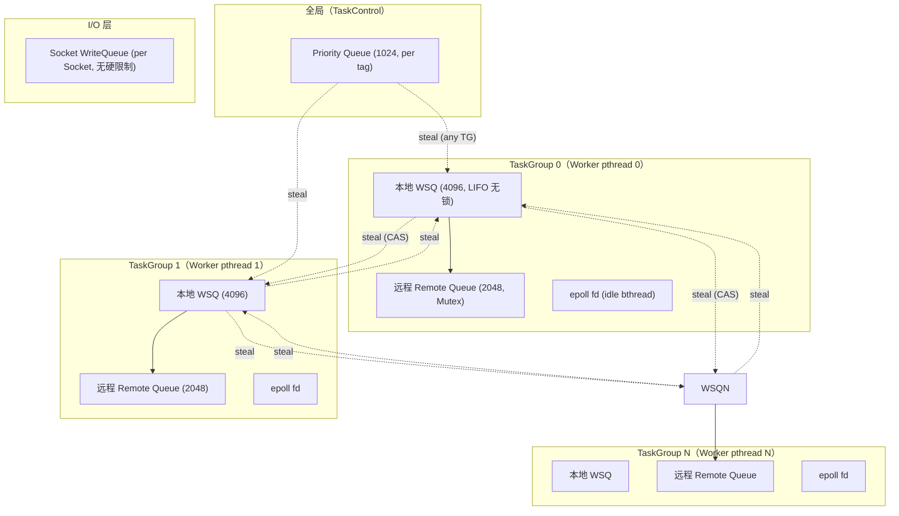

---

## 3. Per-TaskGroup 本地 WSQ

### 3.1 数据结构

```c
// src/bthread/work_stealing_queue.h
template <typename T>
class WorkStealingQueue {
    butil::atomic<size_t>  _bottom;    // Owner 读/写
    size_t                 _capacity;  // 4096（固定）
    T*                     _buffer;    // 循环数组

    BAIDU_CACHELINE_ALIGNMENT          // 64 字节填充
    butil::atomic<size_t>  _top;       // Thief 读/写
};
```

### 3.2 操作规则

| 操作 | 谁执行 | 方向 | 锁 |
|---|---|---|---|
| push | Owner（本地 pthread） | 底部（LIFO） | 无锁 |
| pop | Owner（本地 pthread） | 底部（LIFO） | 无锁（单元素时 CAS） |
| steal | Thief（其他 pthread） | 顶部（FIFO） | CAS |

### 3.3 Push 流程

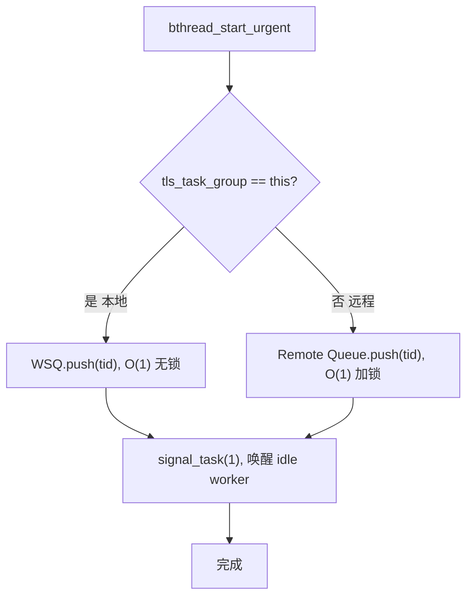

### 3.4 bthread_start_urgent vs bthread_start

```c
// bthread_start_urgent: 投递到当前 TaskGroup 的本地 WSQ（最快）
// 用于: I/O 回调、RPC 请求处理等需要尽快执行的短任务
int bthread_start_urgent(bthread_t* tid, ...) {
    TaskMeta* meta = ...;  // 分配 TaskMeta
    tls_task_group->ready_to_run(meta, false);
    // → WSQ.push(meta->tid)
    // → signal_task(1)
}

// bthread_start: 自动判断本地/远程
// 用于: 但ex_wake、定时器回调等从任意线程发起的任务
int bthread_start(bthread_t* tid, ...) {
    TaskMeta* meta = ...;
    meta->group->ready_to_run_general(meta, false);
    // 如果 tls_task_group == this → WSQ.push
    // 否则 → Remote Queue.push
}
```

---

## 4. Per-TaskGroup 远程队列 Remote Queue

### 4.1 数据结构

```c
// src/bthread/remote_task_queue.h
class RemoteTaskQueue {
    butil::BoundedQueue<bthread_t> _tasks;  // 有界队列，容量 2048
    butil::Mutex _mutex;                    // 互斥锁
};
```

### 4.2 为什么需要远程队列

```
场景: Socket 的 I/O 回调在 TaskGroup 0 的 epoll 中触发
      但 bthread_usleep 等待该 Socket 的 bthread 属于 TaskGroup 1

butex_wake() 从 TaskGroup 0 的线程调用
  → 不能直接 push 到 TG1 的 WSQ（非 owner，无权 push）
  → 推入 TG1 的 Remote Queue（加锁保护）
  → TG1 下次调度时优先从 Remote Queue 取任务
```

### 4.3 投递与消费时序

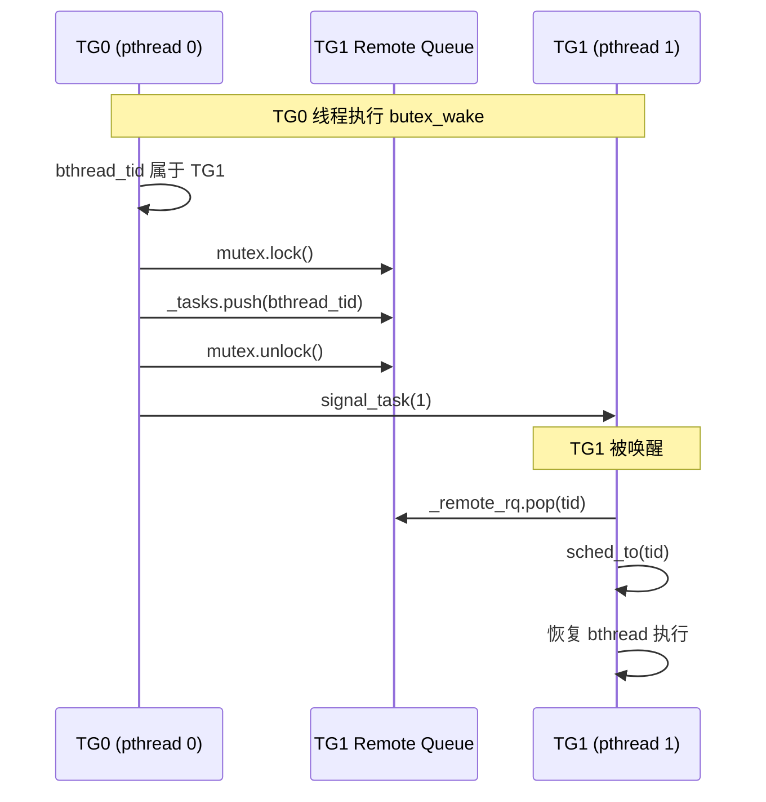

### 4.4 nosignal 批量优化

```c
// 多个 butex_wake 可以延迟信号
ready_to_run_remote(meta, nosignal=true):  // 不发信号
    _remote_rq.push(meta->tid);
    ++_remote_num_nosignal;

ready_to_run_remote(meta, nosignal=false): // 发信号
    _remote_rq.push(meta->tid);
    batch = _remote_num_nosignal + 1;
    signal_task(batch);  // 一次性唤醒多个 worker
    _remote_num_nosignal = 0;
```

---

## 5. 全局优先队列 Priority Queue

### 5.1 数据结构

```c
// src/bthread/task_control.h
std::vector<WorkStealingQueue<bthread_t>> _priority_queues;
// 每个 tag 一个 WSQ，容量 1024
// 默认关闭，需设置 enable_bthread_priority_queue=true
```

### 5.2 用途

仅用于带有 `BTHREAD_GLOBAL_PRIORITY` 标志的 bthread。steal_task() 优先检查此队列，确保高优先级任务被优先执行。

---

## 6. 请求的 bthread 分配全流程

### 6.1 服务端请求处理中的 bthread 分配

一个 RPC 请求从到达服务端到处理完成，会经历**两个 bthread**：

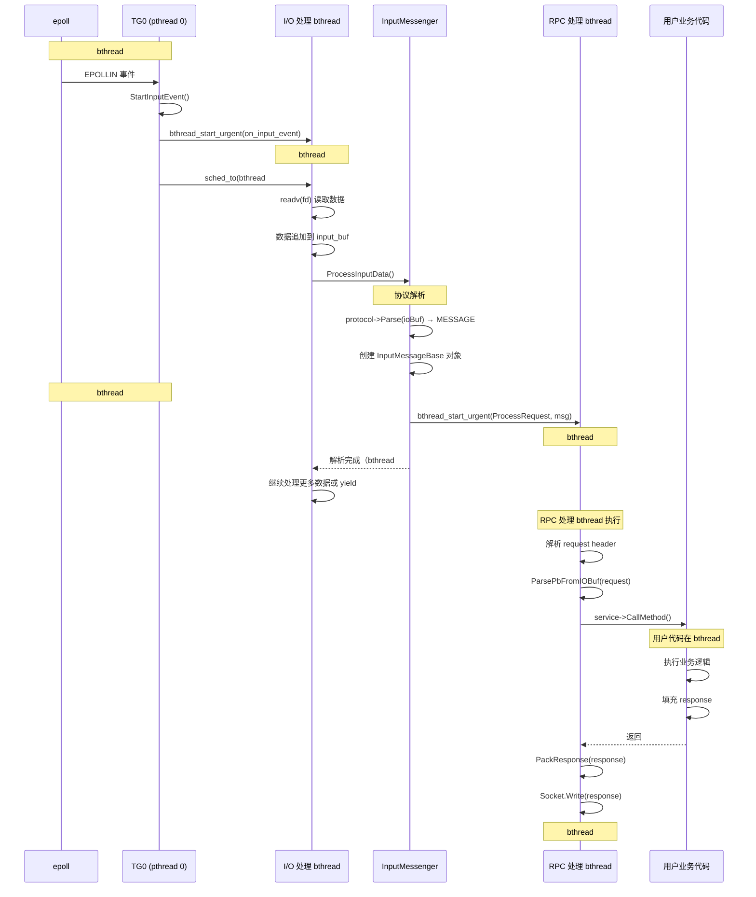

### 6.2 bthread 创建点汇总

| 创建点 | 调用方式 | 目标队列 | 说明 |
|---|---|---|---|
| I/O 事件到达 | `bthread_start_urgent` | 本地 WSQ | 处理 Socket 读写 |
| 请求解析完成 | `bthread_start_urgent` | 本地 WSQ | 执行 RPC 处理 |
| 响应发送完成 | （同 RPC bthread） | - | 不创建新 bthread |
| butex_wake | `ready_to_run_general` | 本地 WSQ 或远程 RQ | 唤醒等待中的 bthread |
| 定时器到期 | `bthread_start_urgent` | 本地 WSQ | TimerThread 回调 |
| Backup Request | `bthread_start_urgent` | 本地 WSQ | 发送备用请求 |

---

## 7. 响应的 bthread 分配流程

### 7.1 客户端接收响应

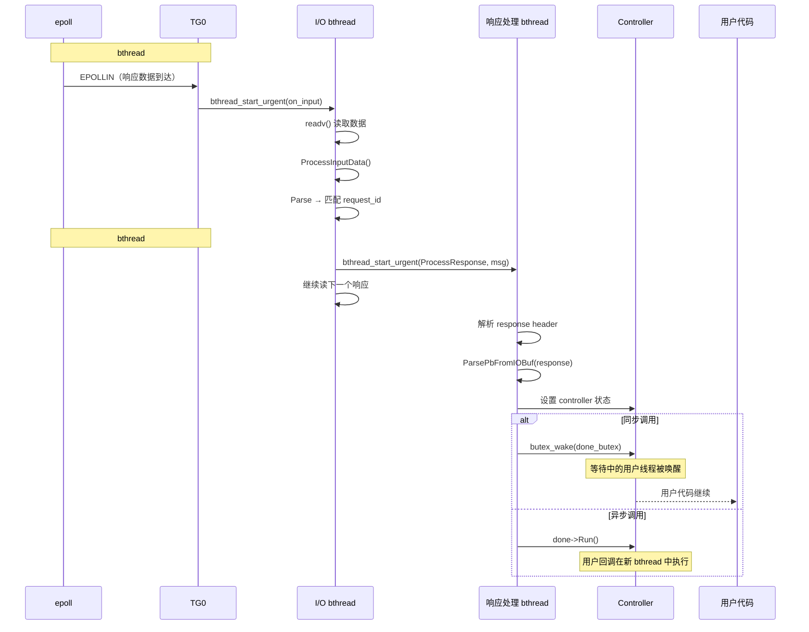

### 7.2 客户端发送请求

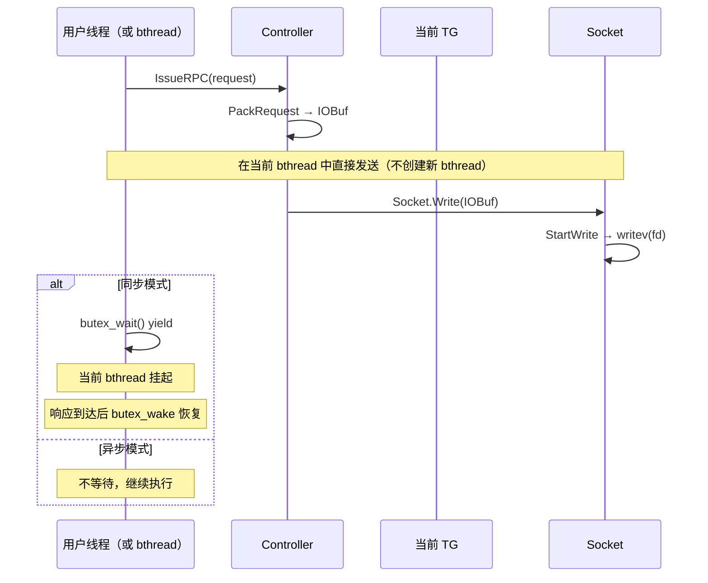

---

## 8. bthread 生命周期

### 8.1 状态机

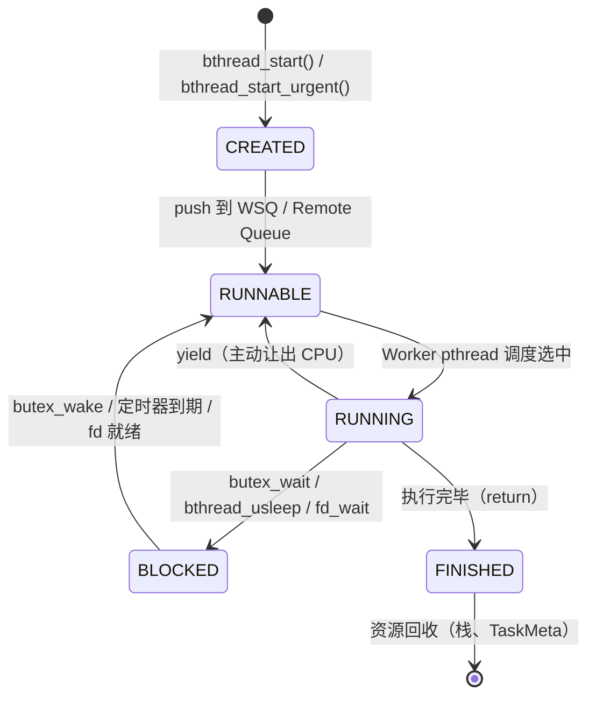

### 8.2 各状态说明

| 状态 | 存储位置 | CPU 使用 | 说明 |
|---|---|---|---|
| CREATED | 栈上临时 | - | TaskMeta 已分配，尚未入队 |
| RUNNABLE | WSQ 或 Remote Queue | 不占用 CPU | 等待被 Worker 调度 |
| RUNNING | Worker pthread 栈 | 占用 CPU | 正在执行用户代码 |
| BLOCKED | Butex 等待队列 | 不占用 CPU | 等待事件，pthread 被释放 |
| FINISHED | 无 | - | 执行完毕，资源待回收 |

### 8.3 生命周期时序

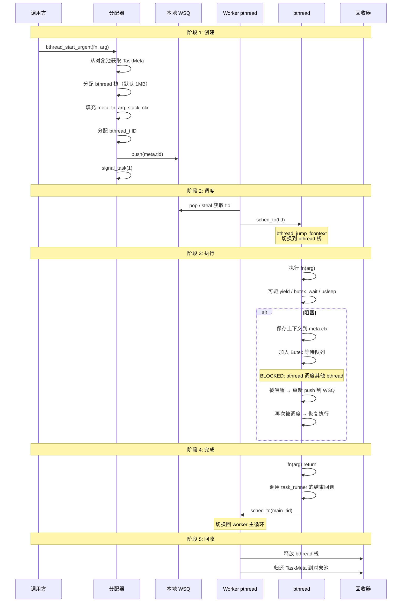

---

## 9. bthread 创建与调度路径

### 9.1 三种创建方式对比

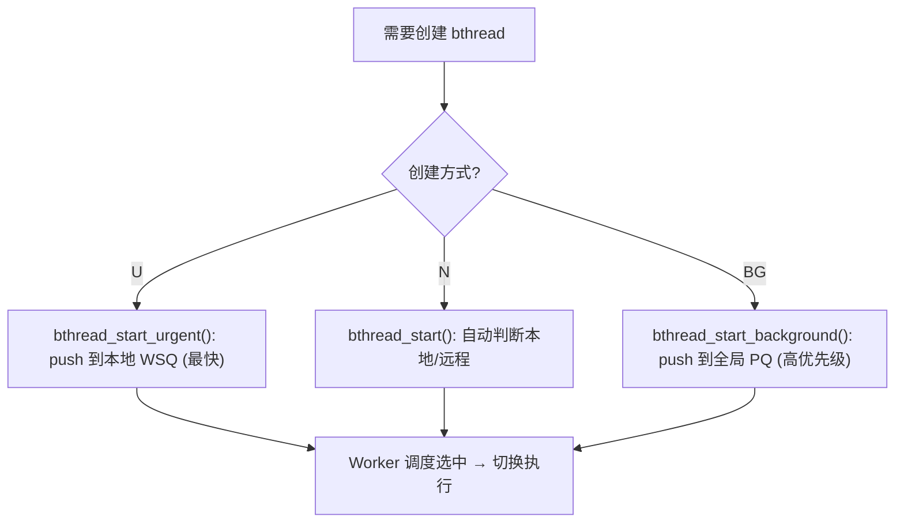

| 方式 | 队列 | 延迟 | 适用场景 |
|---|---|---|---|
| `bthread_start_urgent` | 本地 WSQ | 最低（~100ns） | I/O 回调、RPC 处理 |
| `bthread_start` | 本地 WSQ 或远程 RQ | 低~中（~1μs） | 但ex_wake、通用 |
| `bthread_start_background` | 全局 PQ | 中（~5μs） | 高优先级后台任务 |

### 9.2 TaskMeta 分配

```c
// TaskMeta 通过对象池分配（避免频繁堆分配）
// 每个 TaskGroup 有自己的对象池

// src/bthread/task_group.h
struct TaskMeta {
    bthread_t    tid;            // bthread ID
    TaskGroup*   group;          // 所属 TaskGroup
    std::function<void()> fn;    // 入口函数
    bthread_attr_t attr;         // 属性
    uint64_t     stack_size;     // 栈大小
    Context      ctx;            // 执行上下文（汇编保存）
    uint32_t     attr_flags;     // 标志位
    uint32_t     local_storage;  // TLS
    bool         interrupted;    // 中断标志
    Waiter*      waiter;         // 等待者
};
```

### 9.3 bthread 栈管理

```c
// src/bthread/stack.h
// 栈大小: 默认 1MB (BTHREAD_STACKSIZE)
// 最小栈: 32KB (BTHREAD_MIN_STACKSIZE)

// 栈分配策略:
//   get_stack(): 从当前 TaskGroup 的栈缓存获取
//   return_stack(): 归还到栈缓存（不释放内存）

// 每个 TaskGroup 维护一个栈缓存:
//   已归还的栈按大小排序
//   分配时找到 >= 需求大小的最小栈（best-fit）
//   如果没有合适大小的栈，从系统分配新栈
```

---

## 10. bthread 阻塞与唤醒

### 10.1 阻塞场景与唤醒机制

| 阻塞操作 | 阻塞原因 | 唤醒条件 | 唤醒后的队列 |
|---|---|---|---|
| `butex_wait(butex, val)` | 等待 butex 值变化 | `butex_wake(butex)` | 所属 TG 的 WSQ 或远程 RQ |
| `bthread_usleep(us)` | 定时等待 | TimerThread 定时器到期 | 所属 TG 的 WSQ |
| `bthread_fd_wait(fd)` | 等待 fd I/O 就绪 | EpollThread epoll_wait | 所属 TG 的 WSQ 或远程 RQ |
| `Socket.Write EAGAIN` | 写缓冲区满 | EPOLLOUT 事件 | 所属 TG 的 WSQ |
| `epoll_wait (idle)` | 无任务可执行 | signal_task() |ParkingLot 唤醒后 steal |

### 10.2 butex 阻塞/唤醒详细流程

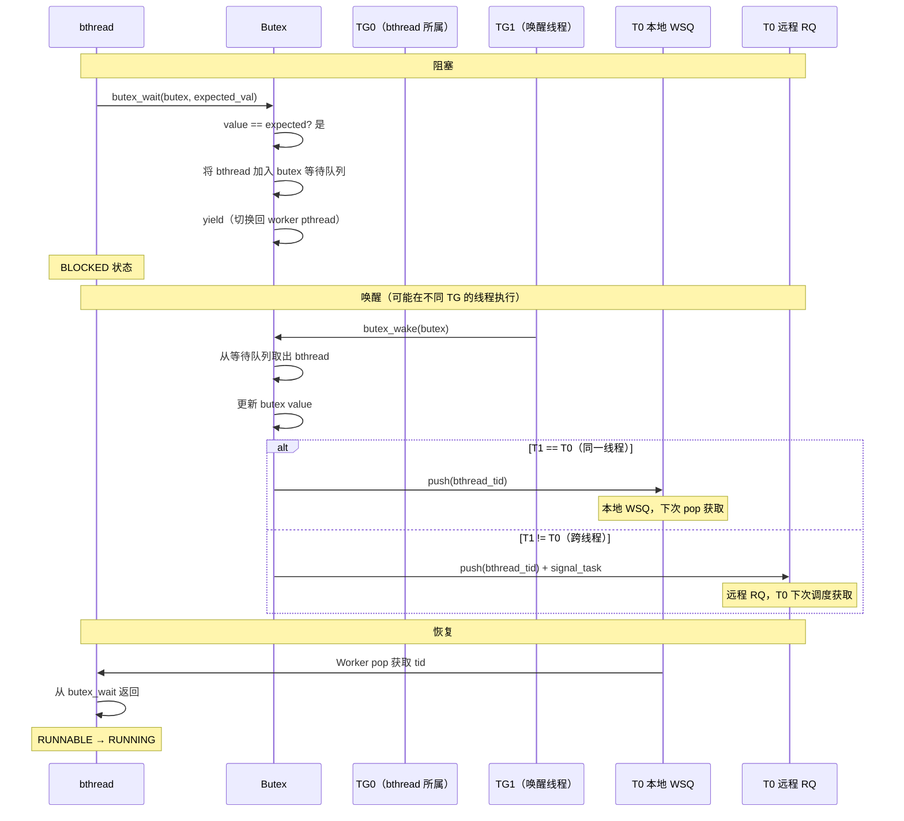

### 10.3 bthread_usleep 流程

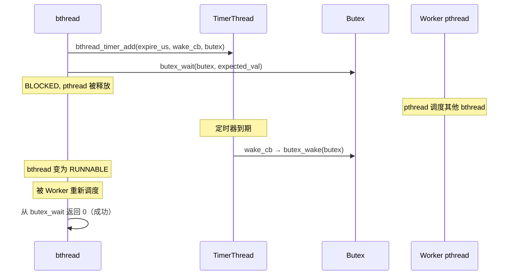

---

## 11. bthread 销毁与资源回收

### 11.1 销毁时机

```c
// src/bthread/task_group.cpp: task_runner()
// bthread 执行完毕后:
void task_runner(void* arg) {
    // 1. 调用用户函数
    meta->fn(arg);

    // 2. 结束调度
    ending_sched(top);

    // 3. ending_sched 做什么:
    //    - 检查是否有 remaining 任务（错误处理的回调等）
    //    - 如果没有，调用 ending_sched_inner
    //    - ending_sched_inner:
    //      - 归还 bthread 栈到栈缓存
    //      - 归还 TaskMeta 到对象池
}
```

### 11.2 资源回收流程

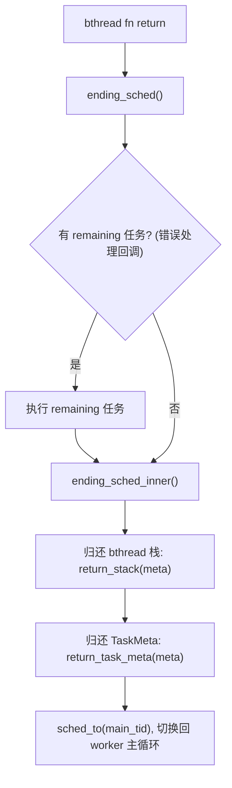

### 11.3 栈缓存设计

```
TaskGroup 栈缓存（best-fit）:
┌──────────────────────────────┐
│ StackCache                   │
│ ┌────────┬───────┬────────┐  │
│ │ 32KB   │ 64KB  │ 1MB   │  │  已归还的栈（按大小排序）
│ │(可用)  │(可用) │(可用) │  │
│ └────────┴───────┴────────┘  │
│ 分配: 找 >= 需求的最小栈      │
│ 命中: 直接使用（无需 mmap）   │
│ 未命中: mmap 分配新栈         │
└──────────────────────────────┘
```

---

## 12. 各场景 bthread 分配总结

### 12.1 服务端处理一个 RPC

| 阶段 | bthread 创建 | 队列 | 说明 |
|---|---|---|---|
| EPOLLIN | bthread_start_urgent | 本地 WSQ | I/O 处理 bthread |
| Parse → MESSAGE | bthread_start_urgent | 本地 WSQ | RPC 处理 bthread |
| 用户业务代码 | （同 RPC bthread） | - | 不创建新 bthread |
| 响应写入 | （同 RPC bthread） | - | 不创建新 bthread |
| I/O 继续读 | （同 I/O bthread） | - | I/O bthread 循环 |

**总计：每个 RPC 请求使用 2 个 bthread（I/O + RPC）**

### 12.2 客户端发送并等待响应

| 阶段 | bthread 创建 | 队列 | 说明 |
|---|---|---|---|
| 打包并发送 | （当前 bthread） | - | 在调用者 bthread 中直接写 |
| 同步等待 | （当前 bthread yield） | Butex | butex_wait，不创建新 bthread |
| 响应到达 | bthread_start_urgent | 本地 WSQ | I/O bthread 读取 |
| 响应解析 | bthread_start_urgent | 本地 WSQ | 响应处理 bthread |
| butex_wake | — | WSQ 或 RQ | 唤醒调用者 bthread |

**总计：每个 RPC 调用使用 2-3 个 bthread（调用者 + I/O + 响应处理）**

### 12.3 Backup Request

| 阶段 | bthread 创建 | 队列 | 说明 |
|---|---|---|---|
| 首次请求 | （调用者 bthread） | - | 发送 + yield |
| Backup 定时器 | （TimerThread bthread） | 本地 WSQ | 定时器回调 |
| Backup 请求 | （调用者 bthread） | - | 复用调用者 bthread |
| 任一响应到达 | bthread_start_urgent | 本地 WSQ | I/O + 响应处理 |

---

## 13. 配置参数

| 参数 | 默认值 | 说明 |
|---|---|---|
| `bthread_concurrency` | 8 + 1 | Worker pthread 数量 |
| `BTHREAD_STACKSIZE` | 1MB | bthread 默认栈大小 |
| `BTHREAD_MIN_STACKSIZE` | 32KB | 最小栈大小 |
| `task_group_runqueue_capacity` | 4096 | 本地 WSQ 容量 |
| Remote queue capacity | 2048（WSQ/2） | 远程队列容量 |
| Priority queue capacity | 1024 | 全局优先队列容量 |
| `enable_bthread_priority_queue` | false | 是否启用全局优先队列 |
| `bthread_parking_lot_of_each_tag` | 4 | 每 tag 的 ParkingLot 分片数 |

---

## 14. 源码索引

### bthread 核心

| 文件 | 内容 |
|---|---|
| `src/bthread/bthread.h` | bthread_start/stop/join/yield/usleep API |
| `src/bthread/bthread.cpp` | bthread 创建、ID 分配 |
| `src/bthread/task_group.h` | TaskGroup、TaskMeta、WSQ、Remote Queue |
| `src/bthread/task_group.cpp` | sched、ending_sched、ready_to_run、wait_task、steal_task |
| `src/bthread/task_group_inl.h` | push_rq 内联实现 |
| `src/bthread/work_stealing_queue.h` | Chase-Lev Deque |
| `src/bthread/remote_task_queue.h` | 远程队列（MPSC） |
| `src/bthread/stack.h` | 栈分配/回收缓存 |
| `src/bthread/butex.h/.cpp` | Butex 同步原语 |
| `src/bthread/context.h` | 上下文切换 |
| `src/bthread/fd.cpp` | EpollThread、bthread_fd_wait |

### 调度控制

| 文件 | 内容 |
|---|---|
| `src/bthread/task_control.h` | TaskControl、Priority Queue、signal_task |
| `src/bthread/task_control.cpp` | steal_task、add_workers、初始化 |
| `src/bthread/parking_lot.h` | ParkingLot 空闲等待 |
| `src/bthread/timer_thread.h/.cpp` | 定时器、bthread_usleep |

### 网络

| 文件 | 内容 |
|---|---|
| `src/brpc/socket.h/.cpp` | Socket、StartInputEvent、Write |
| `src/brpc/input_messenger.h/.cpp` | ProcessInputData、消息分发 |
| `src/brpc/acceptor.h/.cpp` | Acceptor accept 循环 |
| `src/brpc/controller.h/.cpp` | IssueRPC、OnVersionedRPCReturned |
