# brpc 收发包流程分析

## 目录

1. [概述](#1-概述)
2. [协议体系架构](#2-协议体系架构)
3. [IOBuf 零拷贝缓冲区](#3-iobuf-零拷贝缓冲区)
4. [发包流程（客户端发送）](#4-发包流程客户端发送)
5. [收包流程（服务端接收）](#5-收包流程服务端接收)
6. [响应发送流程（服务端回复）](#6-响应发送流程服务端回复)
7. [响应接收流程（客户端接收）](#7-响应接收流程客户端接收)
8. [Socket 写入机制](#8-socket-写入机制)
9. [Socket 读取与协议解析](#9-socket-读取与协议解析)
10. [InputMessenger 消息分发](#10-inputmessenger-消息分发)
11. [连接管理与复用](#11-连接管理与复用)
12. [流控与背压](#12-流控与背压)
13. [HTTP 协议收发包](#13-http-协议收发包)
14. [gRPC 协议收发包](#14-grpc-协议收发包)
15. [端到端完整时序](#15-端到端完整时序)
16. [对比总结](#16-对比总结)
17. [源码索引](#17-源码索引)

---

## 1. 概述

brpc 的收发包机制基于 **epoll + bthread 协程 + IOBuf 零拷贝** 构建：

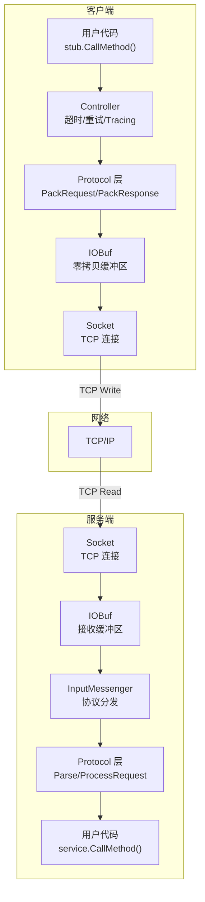

**核心设计原则**：

- **零拷贝序列化**：Protobuf 直接序列化到 IOBuf，无中间缓冲
- **协议无关传输**：Socket + IOBuf 不关心上层协议，协议解析由 InputMessenger 分发
- **协程化 I/O**：阻塞 write/read 通过 bthread yield 不阻塞 pthread
- **流式处理**：数据可以边接收边解析，不需要等完整报文

---

## 2. 协议体系架构

### 2.1 Protocol 接口

```c
// src/brpc/protocol.h
class Protocol {
public:
    // 协议名称 (如 "baidu_std", "http", "grpc")
    virtual const char* Name() const = 0;

    // 解析从 Socket 接收到的数据
    // 返回: ParseResult(MESSAGE)  → 完整消息
    //       ParseResult(NOT_ENOUGH) → 数据不完整，继续接收
    //       ParseResult(ERROR)     → 协议错误
    virtual ParseResult Parse(
        IOBuf* source, Socket* socket, bool read_eof,
        const void* arg) const = 0;

    // 序列化请求并打包到 IOBuf
    virtual int PackRequest(
        IOBuf* request_buf,
        Controller* cntl,
        const google::protobuf::Message* request) const = 0;

    // 序列化响应并打包到 IOBuf
    virtual int PackResponse(
        IOBuf* response_buf,
        Controller* cntl,
        const google::protobuf::Message* response) const = 0;

    // 处理已解析的请求（服务端）
    virtual void ProcessRequest(
        InputMessageBase* msg) const = 0;

    // 处理已解析的响应（客户端）
    virtual void ProcessResponse(
        InputMessageBase* msg) const = 0;

    // 验证请求合法性
    virtual bool VerifyRequest(
        const InputMessageBase* msg) const;

    // 支持的传输类型
    virtual bool SupportsTransport(TransportType t) const;

    // 支持的压缩类型
    virtual bool SupportsCompression(CompressType t) const;
};
```

### 2.2 协议注册

```c
// src/brpc/global.cpp
// 所有协议在启动时注册到全局列表
Protocol::RegisterProtocol(PROTOCOL_BAIDU_STD,   new BaiduStdProtocol);
Protocol::RegisterProtocol(PROTOCOL_HTTP,        new HttpProtocol);
Protocol::RegisterProtocol(PROTOCOL_HTTPS,       new HttpsProtocol);
Protocol::RegisterProtocol(PROTOCOL_H2,          new H2Protocol);
Protocol::RegisterProtocol(PROTOCOL_GRPC,        new GrpcProtocol);
Protocol::RegisterProtocol(PROTOCOL_THRIFT,      new ThriftProtocol);
Protocol::RegisterProtocol(PROTOCOL_MEMCACHE,    new MemcacheProtocol);
Protocol::RegisterProtocol(PROTOCOL_REDIS,       new RedisProtocol);
Protocol::RegisterProtocol(PROTOCOL_NOVA_PBRPC,  new NovaPbrpcProtocol);
Protocol::RegisterProtocol(PROTOCOL_PUBLIC_PBRPC, new PublicPbrpcProtocol);
Protocol::RegisterProtocol(PROTOCOL_DISCOVERY,   new DiscoveryProtocol);
Protocol::RegisterProtocol(PROTOCOL_ESP,         new EspProtocol);
// ...
```

### 2.3 协议识别流程

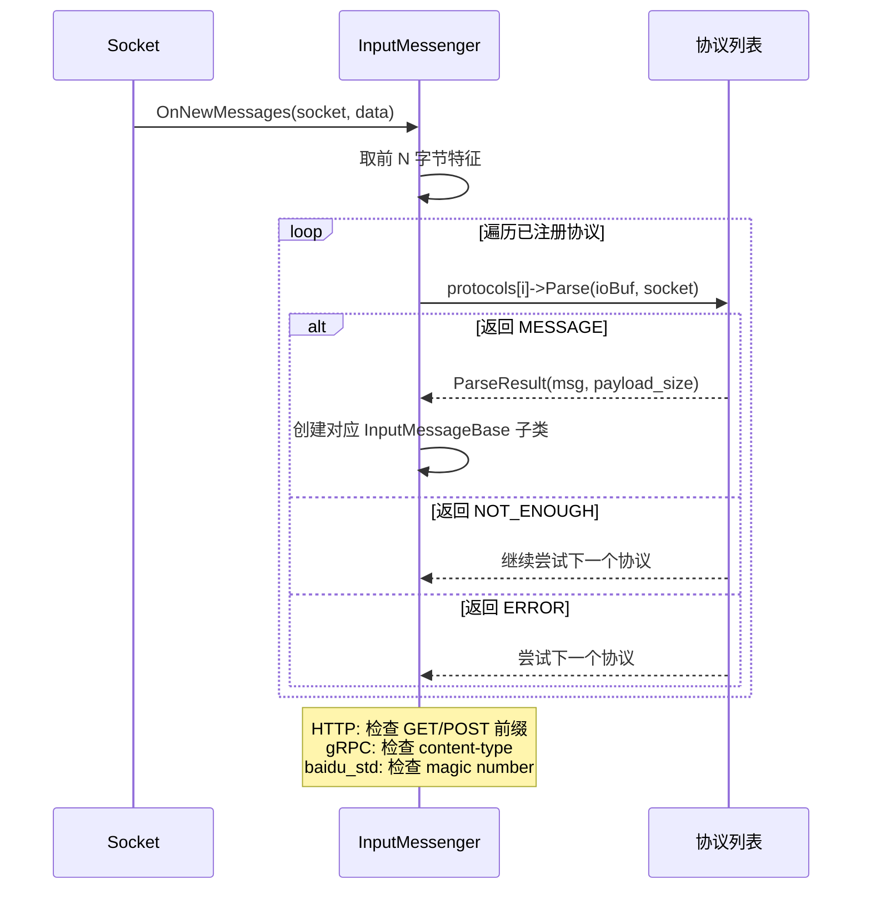

---

## 3. IOBuf 零拷贝缓冲区

### 3.1 IOBuf 结构

```c
// src/butil/iobuf.h
class IOBuf {
    // Block 链表结构
    struct BlockRef {
        Block*   offset;     // 指向 Block 的偏移位置
        size_t   length;     // 该段的长度
    };

    BlockRef* _refs;          // BlockRef 数组
    size_t    _ref_count;     // ref 数组大小
    size_t    _start;         // 第一个有效 ref 的索引
    size_t    _num_refs;      // 有效 ref 数量
};

// 每个 Block 是一块连续内存（默认 4KB 对齐）
struct Block {
    std::atomic<int> refcount; // 引用计数
    size_t   cap;              // Block 容量
    size_t   size;             // 已用大小
    size_t   abuf_size;        // abslify 大小
    char     data[0];          // 柔性数组：实际数据存储
};
```

### 3.2 IOBuf 内存布局

```
IOBuf
┌───────────────────────────────────────────────────────┐
│ BlockRef[0]  BlockRef[1]  BlockRef[2]                │
│ ┌──────────┐ ┌──────────┐ ┌──────────┐               │
│ │ offset───┼─→│ Block A  │ │ Block B  │ │ Block C  │  │
│ │ length=3KB│ │ 8KB cap  │ │ 8KB cap  │ │ 8KB cap  │  │
│ └──────────┘ │ [data...]│ │ [data...]│ │ [data...]│  │
│              └──────────┘ └──────────┘ └──────────┘  │
└───────────────────────────────────────────────────────┘

零拷贝: 数据存储在 Block 中，IOBuf 只持有 BlockRef 指针
追加数据: 在最后一个 Block 的剩余空间写入，或分配新 Block
切割数据: 只调整 BlockRef 的 offset/length，不移动数据
```

### 3.3 IOBuf 与 Protobuf 零拷贝

```c
// IOBufAsZeroCopyOutputStream - Protobuf 序列化直接写入 IOBuf
class IOBufAsZeroCopyOutputStream : public google::protobuf::io::ZeroCopyOutputStream {
    IOBuf* _buf;  // 目标 IOBuf

    bool Next(void** data, int* size) {
        // 返回 IOBuf 尾部的可写区域指针
        // Protobuf 直接写入该区域，无额外拷贝
        *data = _buf->append_space(*size);
        return true;
    }
};

// IOBufAsZeroCopyInputStream - Protobuf 反序列化直接从 IOBuf 读取
class IOBufAsZeroCopyInputStream : public google::protobuf::io::ZeroCopyInputStream {
    const IOBuf* _buf;  // 源 IOBuf

    bool Next(const void** data, int* size) {
        // 返回 IOBuf 当前 Block 的数据指针
        // Protobuf 直接从该区域读取，无额外拷贝
        const BlockRef& ref = _buf->_refs[_cur_ref];
        *data = ref.offset->data + ref.offset;
        *size = ref.length;
    }
};
```

---

## 4. 发包流程（客户端发送）

### 4.1 发包完整时序

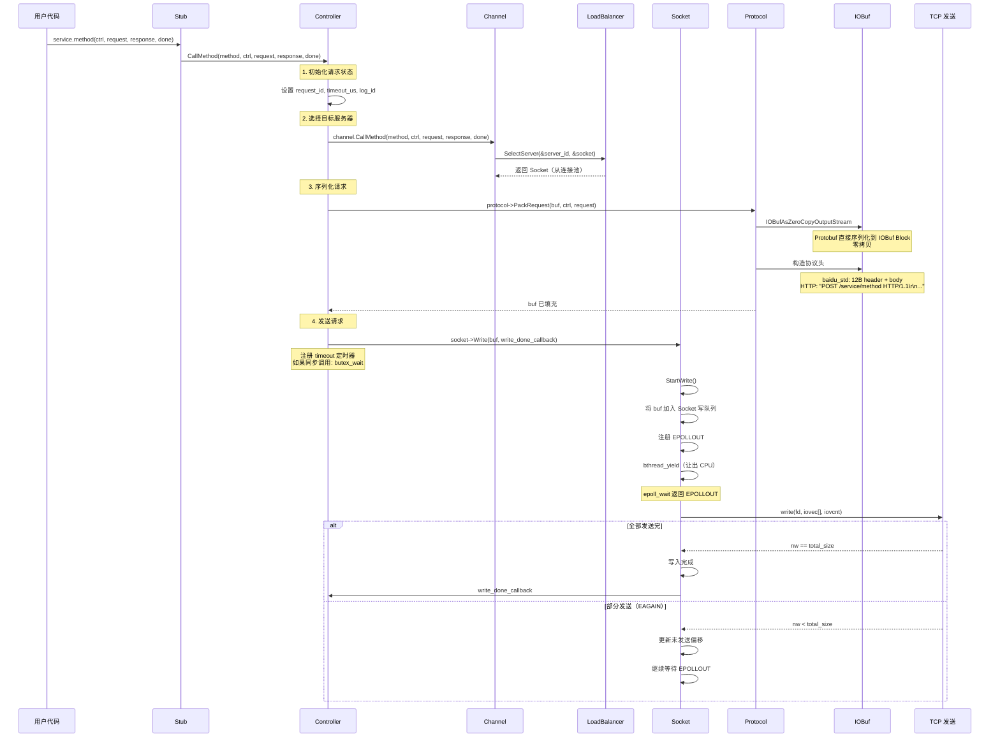

### 4.2 Channel::CallMethodImpl 详解

```c
// src/brpc/channel.cpp
void Channel::CallMethodImpl(
    const google::protobuf::MethodDescriptor* method,
    Controller* cntl,
    const google::protobuf::Message* request,
    google::protobuf::Message* response,
    google::protobuf::Closure* done) {

    // 1. 检查请求状态
    if (cntl->Failed()) { done->Run(); return; }

    // 2. 选择服务器（通过 LoadBalancer）
    SocketUniquePtr sock;
    if (_lb) {
        _lb->SelectServer(&cntl->_server_id, &sock);
    } else {
        // SingleServer 模式：直连
        sock = _server_socket;
    }

    // 3. 设置 Socket 和 Protocol 到 Controller
    cntl->_current_call.sending_sock = sock.get();
    cntl->_current_call.protocol = _options.protocol;

    // 4. 发起 RPC
    cntl->IssueRPC(method, request, response, done);
}
```

### 4.3 Controller::IssueRPC 详解

```c
// src/brpc/controller.cpp
void Controller::IssueRPC(
    const google::protobuf::MethodDescriptor* method,
    const google::protobuf::Message* request,
    google::protobuf::Message* response,
    google::protobuf::Closure* done) {

    // 1. 分配 request_id
    _request_id = butil::fmix32(butil::get_self_tid());

    // 2. 选择 Protocol
    Protocol* protocol = _current_call.protocol;
    if (!protocol) protocol = _options.protocol;

    // 3. 序列化 + 打包请求
    IOBuf buf;
    int rc = protocol->PackRequest(&buf, this, request);
    if (rc != 0) { HandleSendFailed(rc); return; }

    // 4. 记录请求元数据（用于重试、超时）
    _current_call.begin_time_us = butil::cpuwide_time_us();
    _current_call.real_timeout_ms = _timeout_ms;
    _current_call.need_feedback = _options.enable_feedback;

    // 5. 设置发送完成回调
    _on_rpc_end = done;

    // 6. 设置超时定时器
    if (_timeout_ms > 0) {
        bthread_timer_add(gettimeofday_us() + _timeout_ms * 1000L,
                          timer_callback, this);
    }

    // 7. 通过 Socket 发送
    Socket* s = _current_call.sending_sock;
    s->Write(buf, write_done_callback, this);

    // 8. 同步模式: 等待完成
    if (!_done) {
        butex_wait(_done_butex, 0, &_timeout_abs_time);
    }
}
```

---

## 5. 收包流程（服务端接收）

### 5.1 收包完整时序

```mermaid
sequenceDiagram
    participant EPOLL as epoll
    participant SOCK as Socket
    participant IOBUF as IOBuf
    participant INMSG as InputMessenger
    participant PROTO as Protocol
    as InputMsg as InputMessageBase
    participant ALLOC as 对象池分配
    participant PROC as Protocol::ProcessRequest
    participant BTH as bthread（处理协程）
    participant USR as Service::CallMethod

    EPOLL->>SOCK: EPOLLIN 事件就绪
    SOCK->>SOCK: StartInputEvent()<br/>bthread_start_urgent(on_input)

    SOCK->>SOCK: DoRead()

    loop 读取数据
        SOCK->>SOCK: readv(fd, iovec[])
        SOCK->>IOBUF: Append read data to IOBuf
    end

    SOCK->>INMSG: ProcessInputData(source_buf)

    Note over INMSG: 协议识别 + 解析循环

    INMSG->>PROTO: protocol->Parse(ioBuf, socket, eof)

    alt ParseResult(MESSAGE)
        PROTO-->>INMSG: 完整消息
        INMSG->>ALLOC: 从对象池创建 InputMessageBase 子类
        INMSG->>InputMsg: 填充: socket, io_buf, meta

        alt 请求类型（服务端）
            INMSG->>BTH: bthread_start_urgent(ProcessRequest, msg)
        else 响应类型（客户端）
            INMSG->>BTH: bthread_start_urgent(ProcessResponse, msg)
        end

        INMSG->>INMSG: 继续解析剩余数据
    else ParseResult(NOT_ENOUGH)
        PROTO-->>INMSG: 数据不完整
        INMSG->>INMSG: 保留在 IOBuf，等待更多数据
    else ParseResult(ERROR)
        PROTO-->>INMSG: 协议错误
        INMSG->>SOCK: SetFailed()
    end

    Note over BTH,USR: 新 bthread 中处理消息

    BTH->>PROC: msg->_process(msg)
    PROC->>PROC: ParsePbFromIOBuf(msg->_buf, request)
    PROC->>PROC: 验证请求
    PROC->>USR: service->CallMethod(cntl, request, response, done)

    USR->>USR: 执行用户业务逻辑
    USR->>PROC: 业务完成，填充 response
```

### 5.2 InputMessenger::ProcessInputData

```c
// src/brpc/input_messenger.cpp
void InputMessenger::OnNewMessages(Socket* socket) {
    IOBuf* source = socket->_input_buf;

    while (!source->empty()) {
        // 尝试用每个已注册协议解析
        for (size_t i = 0; i < _protocol_list.size(); ++i) {
            Protocol* p = _protocol_list[i];

            ParseResult result = p->Parse(source, socket, read_eof, arg);

            if (result.is_message()) {
                // 创建消息对象（从全局对象池分配，避免堆分配）
                InputMessageBase* msg = p->CreateMessage(socket, result);
                msg->_process = [p](InputMessageBase* m) {
                    p->ProcessRequest(m);
                };

                // 立即投递到当前 TaskGroup（urgent）
                bthread_start_urgent(msg->_tid, NULL,
                                    ProcessInputMessage, msg);
                break;
            } else if (result.is_not_enough()) {
                // 数据不完整，继续等待
                goto break_loop;
            } else if (result.is_error()) {
                socket->SetFailed(result.error_code());
                goto break_loop;
            }
        }
    }
    break_loop:
    // 保留未消费的数据在 source IOBuf 中
}
```

---

## 6. 响应发送流程（服务端回复）

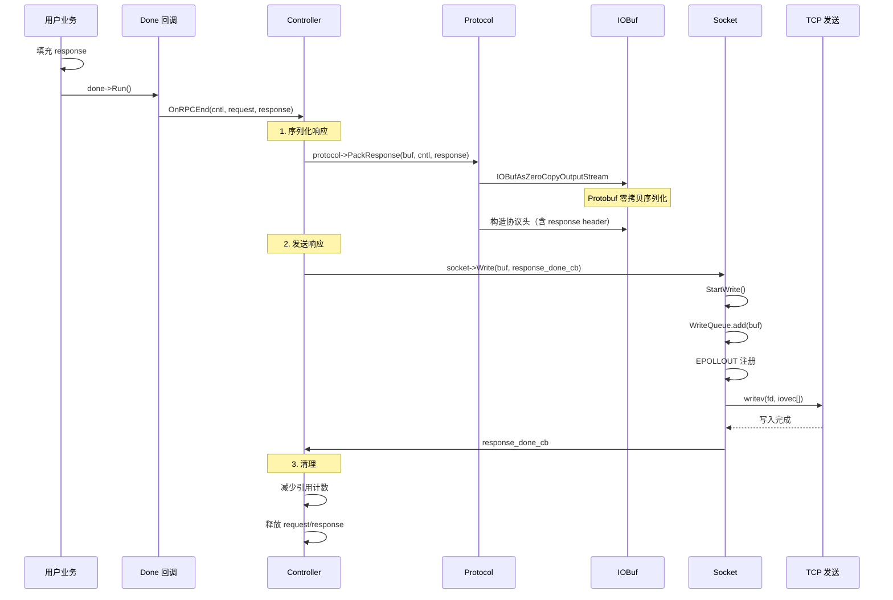

---

## 7. 响应接收流程（客户端接收）

```mermaid
sequenceDiagram
    participant SOCK as Socket
    participant IOBUF as IOBuf
    participant INMSG as InputMessenger
    participant PROTO as Protocol
    as CNTL as Controller

    SOCK->>SOCK: EPOLLIN → OnNewMessages()
    SOCK->>IOBUF: readv() 追加数据

    SOCK->>INMSG: ProcessInputData(ioBuf)

    INMSG->>PROTO: protocol->Parse(ioBuf, socket)
    Note over PROTO: baidu_std: 匹配 request_id
    Note over PROTO: HTTP: 匹配 HTTP response status

    PROTO-->>INMSG: ParseResult(MESSAGE)
    INMSG->>INMSG: 创建 InputMessageBase（响应类型）

    INMSG->>INMSG: bthread_start_urgent(ProcessResponse, msg)

    Note over INMSG,CNTL: 响应处理 bthread

    INMSG->>PROTO: protocol->ProcessResponse(msg)

    PROTO->>PROTO: 解析 response header
    PROTO->>PROTO: ParsePbFromIOBuf(buf, response)
    PROTO->>CNTL: 设置 controller 状态

    alt 同步调用
        PROTO->>CNTL: butex_wake(cntl->_done_butex)
        Note over CNTL: 从 butex_wait 恢复
        CNTL-->>USR: 用户代码继续
    else 异步调用
        PROTO->>CNTL: cntl->_done->Run()
        Note over CNTL: 用户回调执行
    end
```

---

## 8. Socket 写入机制

### 8.1 Socket::Write 核心路径

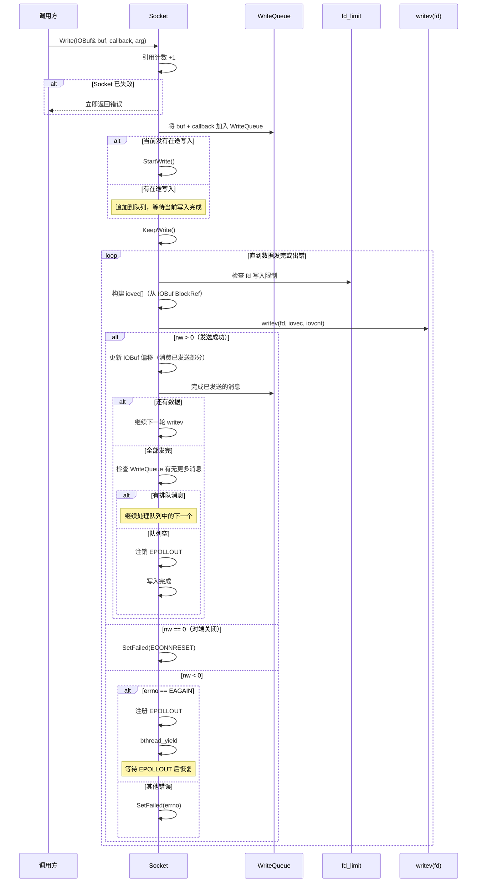

### 8.2 IOBuf 到 iovec 的转换

```c
// Socket::DoWrite() 中:
int iovcnt = _write_buf.backing_block_num(&iovec[0], iovcnt_max);

// IOBuf::backing_block_num() 将 BlockRef 数组转换为 iovec 数组
// 每个 BlockRef 对应一个 iovec:
//   iov_base = block->data + ref_offset
//   iov_len  = ref_length
// 无需拷贝数据，直接传递 Block 指针给 writev
```

### 8.3 WriteQueue 消息合并

```
Socket WriteQueue:
┌──────────────────────────────────────┐
│ [Msg1: 4KB] [Msg2: 1KB] [Msg3: 8KB] │
└──────────────────────────────────────┘
       │
       ▼ writev() 一次性发送
┌──────────────────────────────────────┐
│ iovec[0] = Msg1.Block[0] (4KB)      │
│ iovec[1] = Msg1.Block[1] (2KB)      │
│ iovec[2] = Msg2.Block[0] (1KB)      │
│ iovec[3] = Msg3.Block[0] (4KB)      │
│ iovec[4] = Msg3.Block[1] (4KB)      │
└──────────────────────────────────────┘

优势: 多个消息的 writev 合并为一次系统调用
```

---

## 9. Socket 读取与协议解析

### 9.1 Socket 读取流程

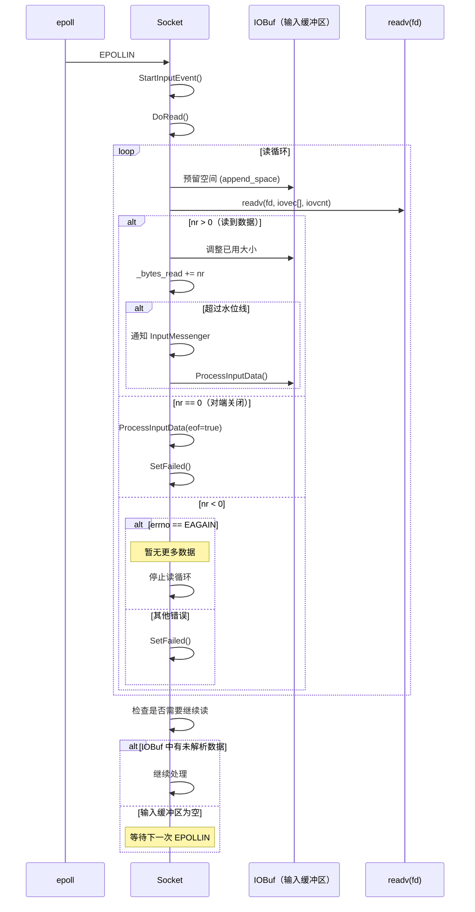

---

## 10. InputMessenger 消息分发

### 10.1 InputMessenger 架构

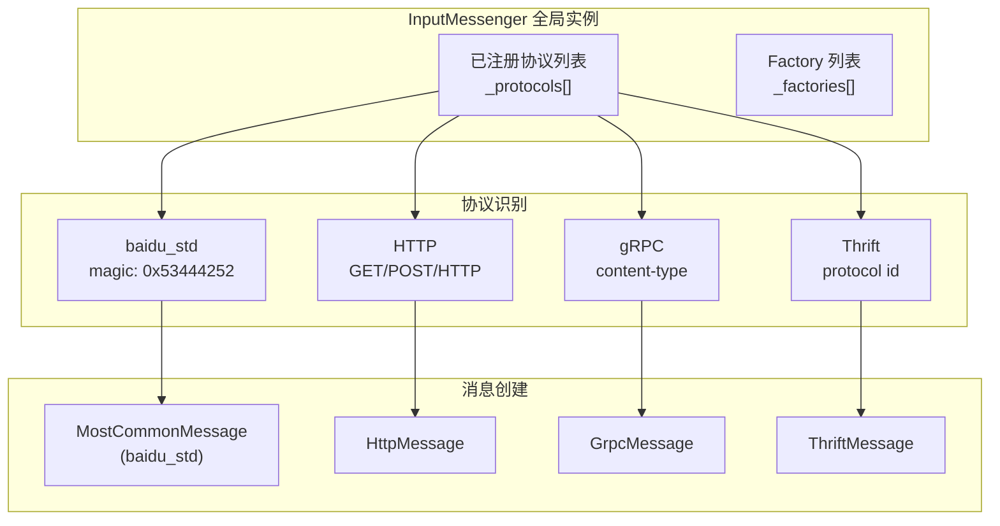

### 10.2 对象池分配

```c
// InputMessageBase 使用对象池避免频繁堆分配
// baidu_std 使用 MostCommonMessage（预分配大小固定）

// src/brpc/policy/most_common_message.h
class MostCommonMessage : public InputMessageBase {
    // 固定大小结构，可直接从对象池获取
    // 避免运行时多态的开销
};

// 对象池实现 (get_object()/return_object())
// 基于 per-thread 缓存 + 全局链表
```

---

## 11. 连接管理与复用

### 11.1 SocketMap 连接池

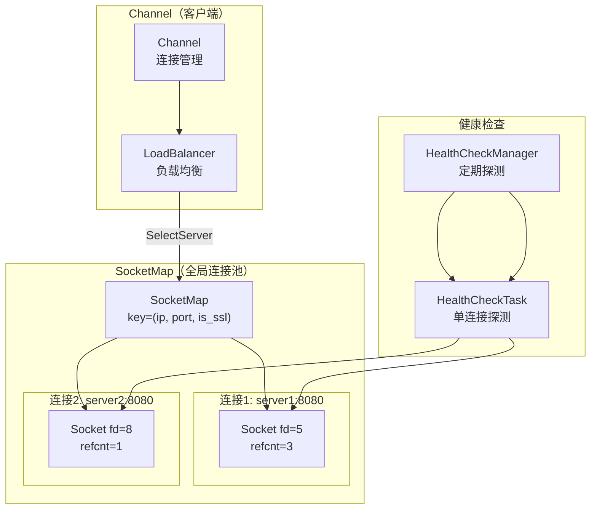

### 11.2 连接生命周期

```mermaid
stateDiagram-v2
    [*] --> CONNECTING: Socket::Create()
    CONNECTING --> CONNECTED: connect() 成功
    CONNECTED --> IDLE: 无在途 RPC
    IDLE --> CONNECTED: 新 RPC 发送
    CONNECTED --> FAILED: I/O 错误 / 超时
    FAILED --> CONNECTING: 自动重连
    CONNECTED --> CLOSED: Socket::SetFailed() + refcnt==0

    IDLE --> HC_CHECK: 健康检查超时
    HC_CHECK --> FAILED: 探测失败
    HC_CHECK --> IDLE: 探测成功
```

### 11.3 健康检查

```c
// src/brpc/details/health_check.cpp
class HealthCheckTask {
    void StartHealthCheck(Socket* socket) {
        // 定期发送探测请求
        // baidu_std: 发送空 RPC
        // HTTP: 发送 GET /status
        // 失败阈值: 3 次连续失败 → SetFailed
        // 成功: 重置失败计数
    }
};
```

---

## 12. 流控与背压

### 12.1 多级流控

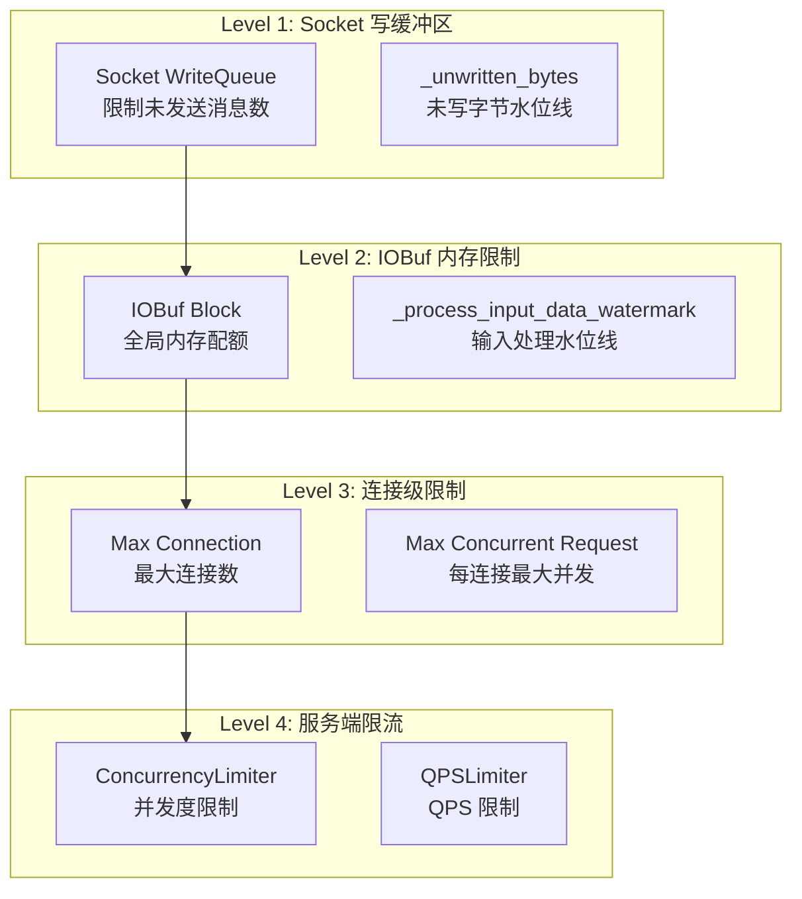

### 12.2 Socket 写缓冲区水位线

```c
// src/brpc/socket.h
class Socket {
    // 写缓冲区水位线
    size_t  _unwritten_bytes;           // 当前未写字节数
    size_t  _overcrowded_threshold;     // 拥挤阈值（默认 64MB）
    bool    _overcrowded;               // 是否拥挤

    bool IsCrowded() const {
        return _unwritten_bytes > _overcrowded_threshold;
    }

    // 调用方在发送前检查
    // 如果拥挤，负载均衡器会选择其他连接
};
```

### 12.3 服务端并发控制

```c
// ConcurrencyLimiter: 限制每个方法的并发请求数
class ConcurrencyLimiter {
    int _max_concurrency;        // 最大并发数
    int _current_concurrency;    // 当前并发数

    bool OnRequested() {
        if (++_current_concurrency <= _max_concurrency)
            return true;   // 允许
        --_current_concurrency;
        return false;      // 拒绝（ELIMIT）
    }

    void OnResponded() {
        --_current_concurrency;
    }
};
```

---

## 13. HTTP 协议收发包

### 13.1 HTTP 请求解析

```c
// src/brpc/policy/http_rpc_protocol.cpp
// HTTP 协议特征: GET/POST/PUT/DELETE/HEAD 前缀

ParseResult HttpProtocol::Parse(IOBuf* source, Socket* socket, ...) {
    // 1. 搜索 "\r\n\r\n"（头部结束标记）
    // 2. 解析请求行: "POST /EchoService/Echo HTTP/1.1"
    // 3. 解析头部: Content-Length, Content-Type 等
    // 4. 根据 Content-Length 判断 body 是否完整
    // 5. 切割 header 和 body 到独立 IOBuf
}
```

### 13.2 HTTP 收发时序

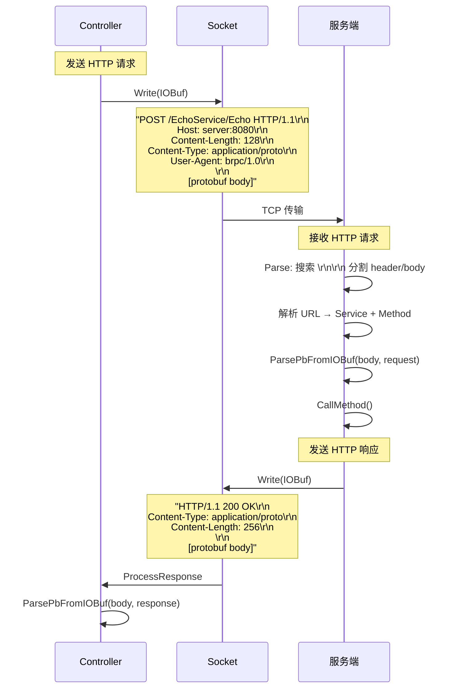

---

## 14. gRPC 协议收发包

### 14.1 gRPC Wire Format

```
gRPC Frame:
┌────────────────┬──────────────┬─────────────────────┐
│ Compressed (1B)│ Length (4B)  │  gRPC Message       │
│ 0=uncompressed │ big-endian   │  [protobuf encoded] │
└────────────────┴──────────────┴─────────────────────┘

HTTP/2 Frame:
┌──────────────┬─────────────┬──────────┬─────────────────────┐
│ Length (3B)  │ Type (1B)   │ Flags(1B)│ Stream ID (4B)     │
│              │ DATA = 0x00 │ END=0x01 │                     │
└──────────────┴─────────────┴──────────┴─────────────────────┘
│                     Payload                              │
│                     (gRPC Frame)                          │
└────────────────────────────────────────────────────────────┘
```

### 14.2 gRPC 收发时序

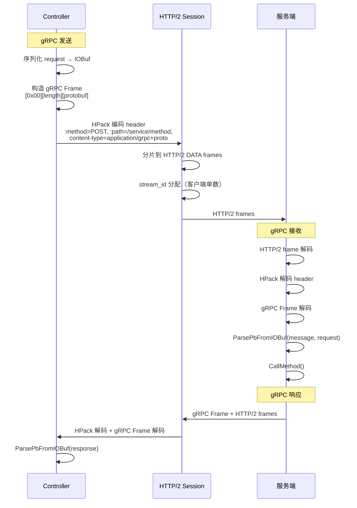

---

## 15. 端到端完整时序

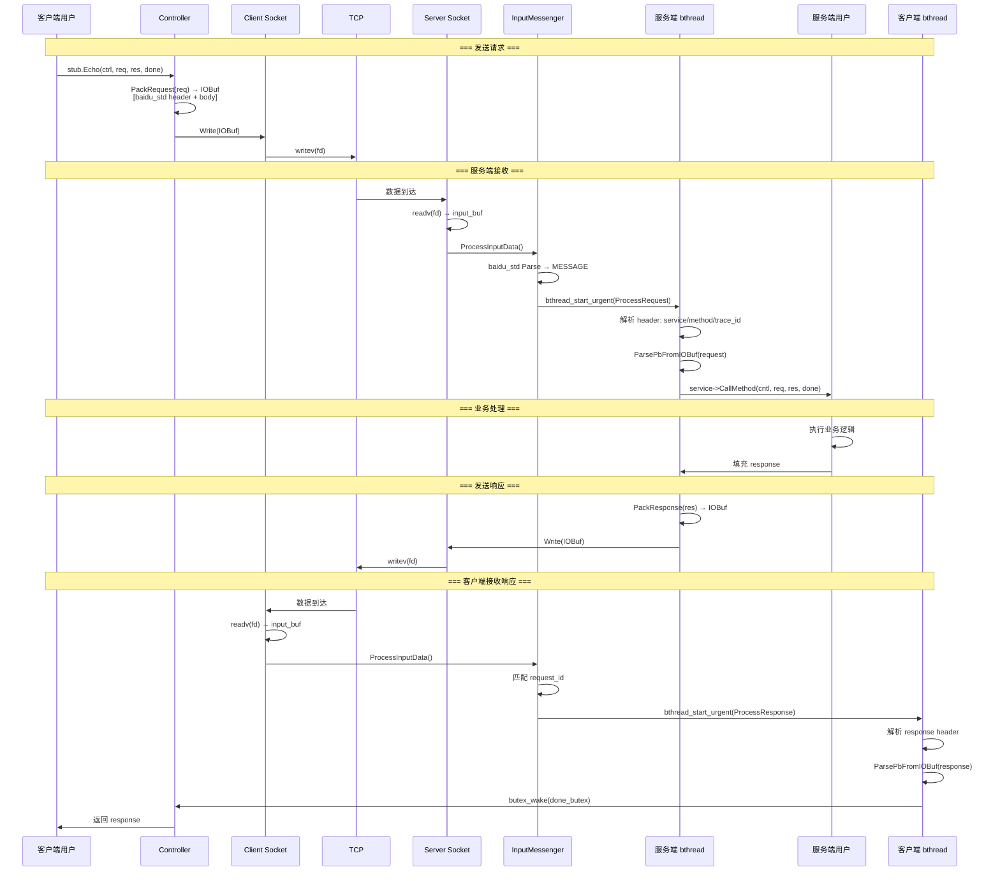

---

## 16. 对比总结

### 16.1 brpc vs gRPC vs Thrift 网络层对比

| 特性 | brpc (baidu_std) | gRPC | Thrift (TBinaryProtocol) |
|---|---|---|---|
| 传输协议 | TCP（自定义 header） | HTTP/2 | TCP（自定义 framing） |
| 序列化 | Protobuf（零拷贝 IOBuf） | Protobuf（零拷贝） | Thrift IDL |
| 多路复用 | request_id 匹配 | HTTP/2 Stream | 连接级串行 |
| 头部大小 | 12B（紧凑） | ~20-200B（HPack） | ~10B（frame header） |
| 流控 | Socket 写水位线 + 并发限制 | HTTP/2 flow control | 无内置 |
| 超时 | per-RPC 定时器 + bthread_usleep | per-RPC deadline | per-call timeout |
| 重试 | 自动重试 + backup request | 无内置 | 无内置 |
| 连接管理 | SocketMap + 健康检查 | gRPC channel | 连接池 |

### 16.2 发包/收包路径对比

| 阶段 | brpc 发包 | brpc 收包 |
|---|---|---|
| 入口 | Controller::IssueRPC | InputMessenger::OnNewMessages |
| 序列化 | IOBufAsZeroCopyOutputStream | IOBufAsZeroCopyInputStream |
| 协议头 | PackRequest/PackResponse | Parse（增量解析） |
| I/O | Socket::Write → writev | Socket::DoRead → readv |
| 阻塞处理 | EAGAIN → EPOLLOUT + yield | EAGAIN → 等待 EPOLLIN |
| 回调 | write_done_callback | bthread_start_urgent |
| 协程 | bthread 执行 | bthread 执行 |

---

## 17. 源码索引

### 核心网络层

| 文件 | 内容 |
|---|---|
| `src/brpc/socket.h` | Socket 类（连接抽象、读写接口） |
| `src/brpc/socket.cpp` | Write、Read、StartWrite、KeepWrite、DoWrite、DoRead |
| `src/brpc/socket_inl.h` | 内联辅助函数 |
| `src/brpc/transport.h` | Transport 抽象基类 |
| `src/brpc/tcp_transport.h/.cpp` | TCP Transport 实现 |

### 协议层

| 文件 | 内容 |
|---|---|
| `src/brpc/protocol.h` | Protocol 接口、ParseResult、ProtocolType 枚举 |
| `src/brpc/protocol.cpp` | 协议注册、ParsePbFromIOBuf |
| `src/brpc/policy/baidu_rpc_protocol.h/.cpp` | baidu_std 协议实现 |
| `src/brpc/policy/most_common_message.h` | MostCommonMessage 消息对象 |
| `src/brpc/policy/http_rpc_protocol.h/.cpp` | HTTP 协议 |
| `src/brpc/policy/http2_rpc_protocol.h/.cpp` | HTTP/2 协议 |
| `src/brpc/policy/grpc.cpp` | gRPC 协议 |
| `src/brpc/policy/thrift_protocol.h/.cpp` | Thrift 协议 |
| `src/brpc/global.cpp` | 全局协议注册 |

### 消息处理

| 文件 | 内容 |
|---|---|
| `src/brpc/input_messenger.h` | InputMessenger 类 |
| `src/brpc/input_messenger.cpp` | ProcessInputData、OnNewMessages、CutInputMessage |
| `src/brpc/input_message_base.h` | InputMessageBase 基类 |
| `src/brpc/parse_result.h` | ParseResult 定义 |
| `src/brpc/socket_message.h` | SocketMessage 基类、AppendAndDestroySelf |

### 客户端

| 文件 | 内容 |
|---|---|
| `src/brpc/channel.h` | Channel 类 |
| `src/brpc/channel.cpp` | CallMethodImpl、InitSocketOptions |
| `src/brpc/controller.h` | Controller 类 |
| `src/brpc/controller.cpp` | IssueRPC、HandleSendFailed、HandleRecvFailed |
| `src/brpc/load_balancer.h/.cpp` | LoadBalancer 接口 |
| `src/brpc/socket_map.h/.cpp` | SocketMap 连接池 |

### IOBuf

| 文件 | 内容 |
|---|---|
| `src/butil/iobuf.h` | IOBuf、IOPortal、IOBufAsZeroCopyOutputStream/InputStream |
| `src/butil/iobuf.cpp` | Block 分配、内存池、append/cut 操作 |
| `src/butil/iobuf_inl.h` | 内联优化 |

### 服务端

| 文件 | 内容 |
|---|---|
| `src/brpc/server.h` | Server 类 |
| `src/brpc/server.cpp` | ProcessRequest、Service 注册 |
| `src/brpc/acceptor.h/.cpp` | Acceptor 连接接收 |
| `src/brpc/details/health_check.h/.cpp` | 健康检查 |

### 流控

| 文件 | 内容 |
|---|---|
| `src/brpc/adaptive_max_concurrency.h/.cpp` | 自适应并发限制 |
| `src/brpc/concurrency_limiter.h/.cpp` | 固定并发限制 |
| `src/brpc/qps_limiter.h/.cpp` | QPS 限制 |
