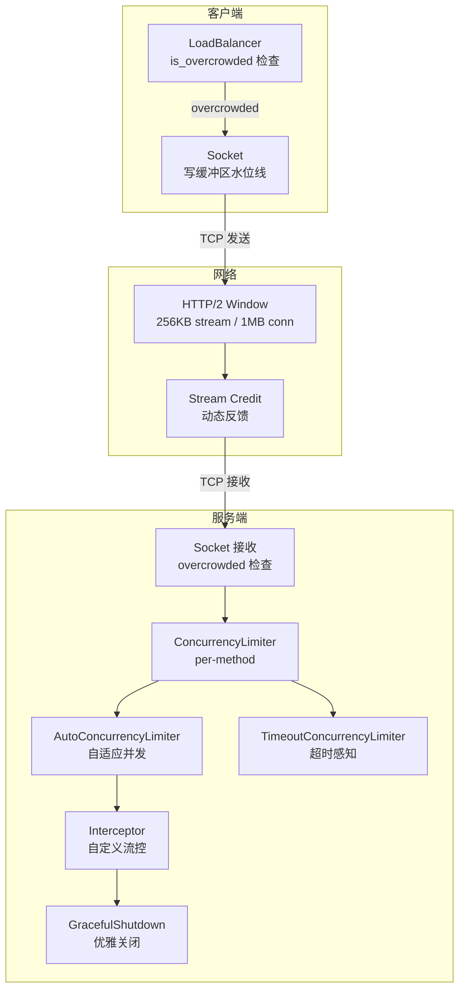
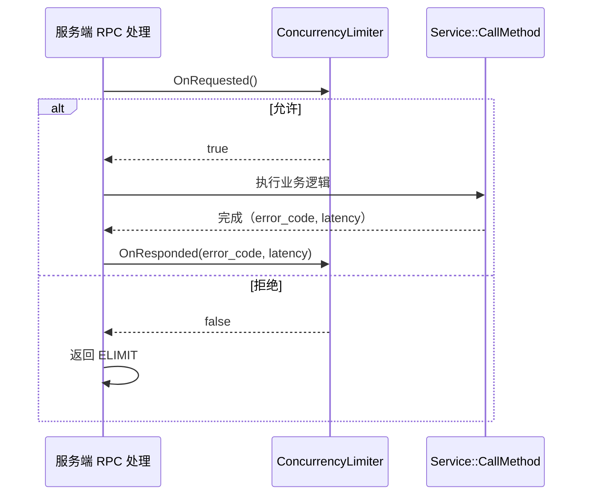
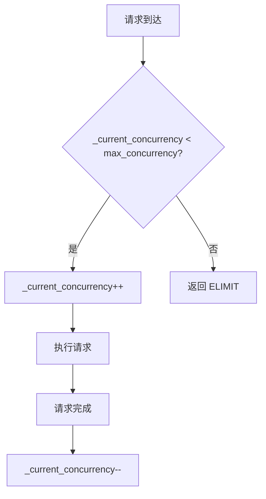
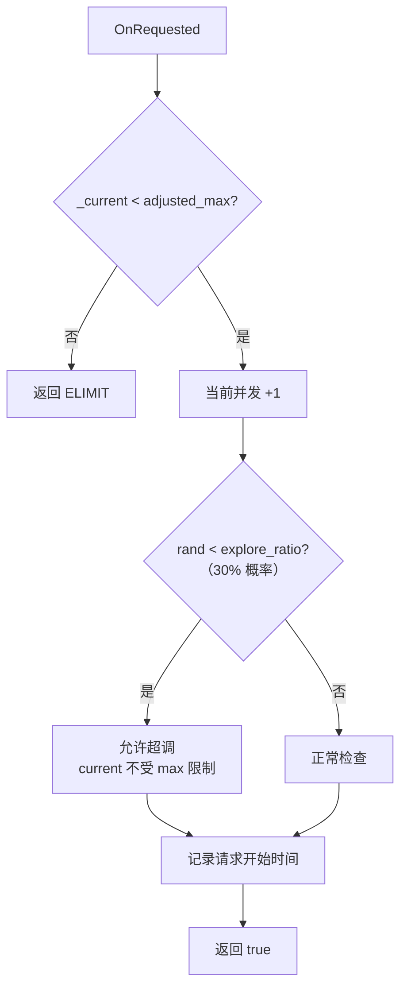
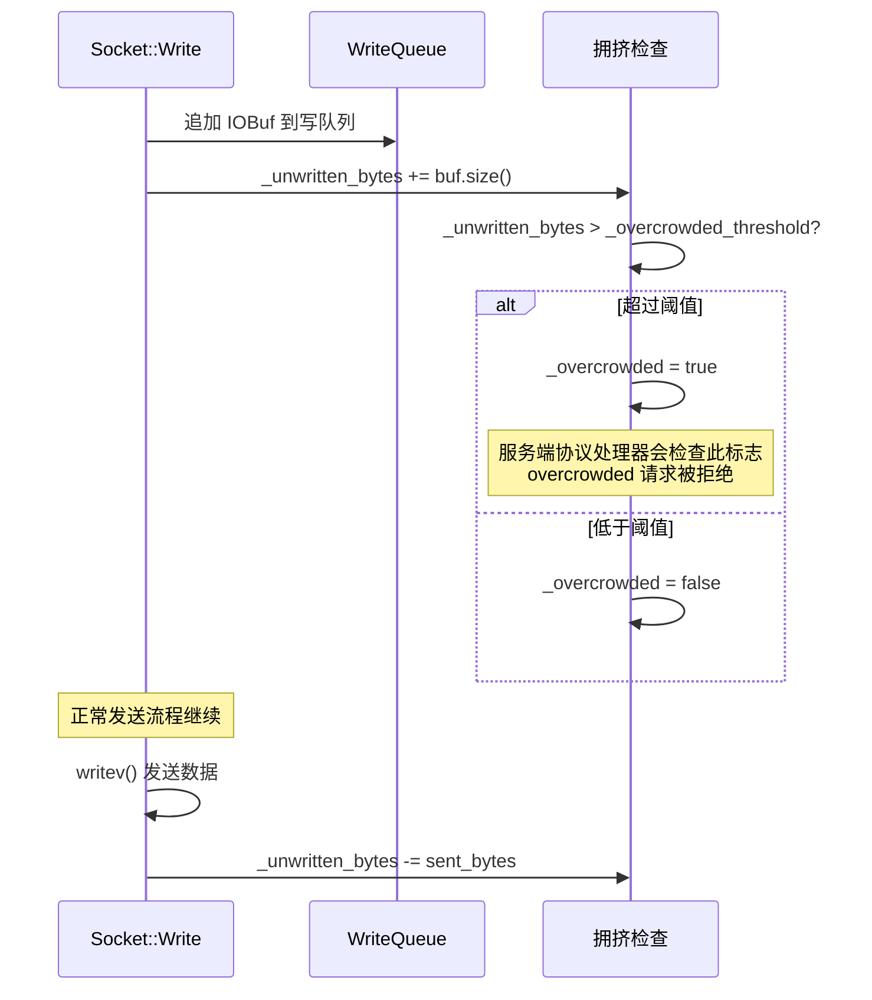
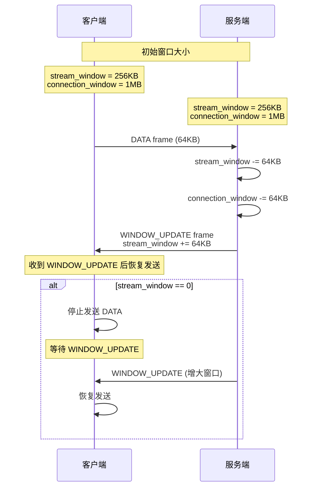
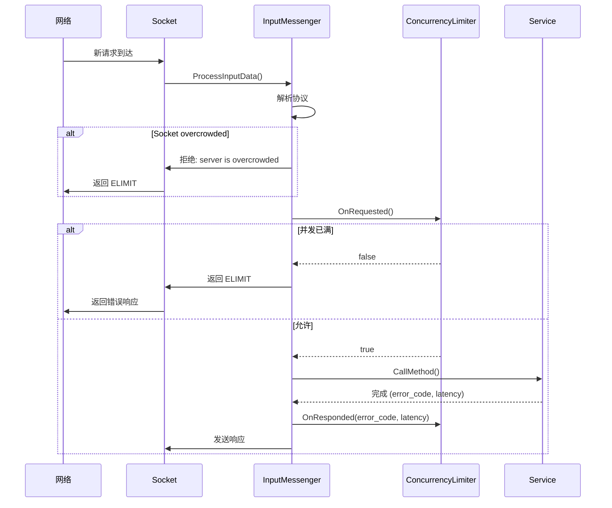
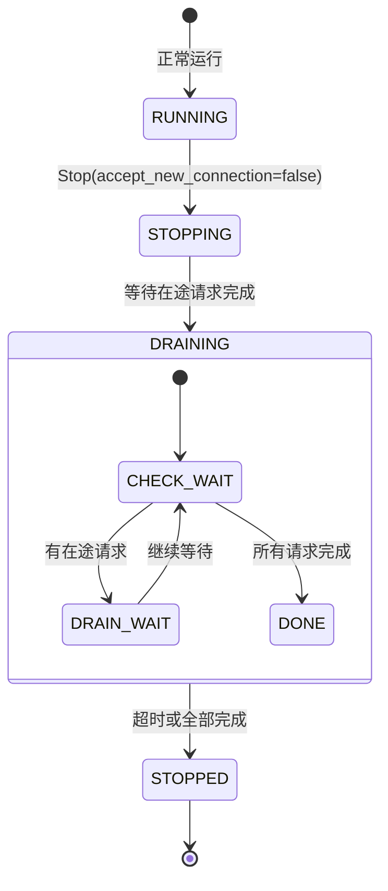

# brpc 流控机制分析

## 目录

1. [概述](#1-概述)
2. [流控体系架构](#2-流控体系架构)
3. [ConcurrencyLimiter 接口](#3-concurrencylimiter-接口)
4. [ConstantConcurrencyLimiter](#4-constantconcurrencylimiter)
5. [AutoConcurrencyLimiter](#5-autoconcurrencylimiter)
6. [TimeoutConcurrencyLimiter](#6-timeoutconcurrencylimiter)
7. [Socket 写缓冲区流控](#7-socket-写缓冲区流控)
8. [HTTP/2 流量控制](#8-http2-流量控制)
9. [Stream 流式消息流控](#9-stream-流式消息流控)
10. [Server 端流控](#10-server-端流控)
11. [优雅重启限流](#11-优雅重启限流)
12. [Interceptor 自定义流控](#12-interceptor-自定义流控)
13. [端到端流控完整时序](#13-端到端流控完整时序)
14. [配置参数](#14-配置参数)
15. [对比总结](#15-对比总结)
16. [源码索引](#16-源码索引)

---

## 1. 概述

brpc 的流控机制是**多层级、多维度的**，覆盖从 Socket 写缓冲区到服务端并发控制的完整链路：

| 层级 | 机制 | 类型 | 作用 |
|---|---|---|---|
| L1: Socket 写缓冲区 | `_overcrowded_threshold` | 背压 | 防止连接发送堆积 |
| L2: HTTP/2 Window | RFC 7540 流量窗口 | 协议流控 | 控制 HTTP/2 数据帧流量 |
| L3: Stream Credit | 动态 Credit 反馈 | 消息级流控 | 控制流式消息速率 |
| L4: ConcurrencyLimiter | per-method 并发限制 | 请求级限流 | 防止服务过载 |
| L5: AutoConcurrency | 自适应并发控制 | 智能限流 | 根据延迟动态调整 |
| L6: TimeoutConcurrency | 超时感知限流 | SLA 保护 | 保护请求不超时 |
| L7: GracefulShutdown | 优雅关闭限流 | 生命周期 | 安全重启 |
| L8: Interceptor | 自定义拦截器 | 扩展限流 | QPS 限流等自定义策略 |

**设计原则**：

- **拒绝优于排队**：大部分流控直接返回 `ELIMIT`，不做入队等待
- **分级保护**：从底层 Socket 到上层 RPC 全链路覆盖
- **自适应优先**：AutoConcurrencyLimiter 根据延迟动态调整，无需人工配置

---

## 2. 流控体系架构



---

## 3. ConcurrencyLimiter 接口

### 3.1 接口定义

```c
// src/brpc/concurrency_limiter.h
class ConcurrencyLimiter : public NonConstDescribable {
public:
    // 请求到达时调用
    // 返回 true = 允许, false = 拒绝（ELIMIT）
    virtual bool OnRequested() = 0;

    // 请求完成时调用（成功/失败）
    virtual void OnResponded(int error_code, int64_t latency_us) = 0;

    // 获取当前最大并发数（用于监控）
    virtual int MaxConcurrency() = 0;

    // 创建实例（Extension 工厂）
    virtual ConcurrencyLimiter* New(const butil::StringPiece& params) const = 0;

    virtual ~ConcurrencyLimiter() {}
};
```

### 3.2 注册的限流器

```c
// 三种内置实现通过 Extension 机制注册
// Extension注册名 → 类名
"constant" → ConstantConcurrencyLimiter   // 固定并发上限
"auto"     → AutoConcurrencyLimiter       // 自适应（推荐）
"timeout"  → TimeoutConcurrencyLimiter    // 超时感知
```

### 3.3 集成位置



### 3.4 Per-Method 限流

每个 Service 方法可以独立配置限流器：

```c
// Server::ServiceOptions
struct ServiceOptions {
    // 方法级限流配置
    // 在 ServiceDescriptor 中按 method 名匹配
    // 例如: "EchoMethod:auto:1024"
};

// 每个方法有独立的 ConcurrencyLimiter 实例
// Service::MethodStatus::limiter
```

---

## 4. ConstantConcurrencyLimiter

### 4.1 算法

最简单的固定并发限制，无反馈、无自适应：



### 4.2 核心实现

```c
class ConstantConcurrencyLimiter {
    int _max_concurrency;       // 配置的上限
    butil::atomic<int> _current_concurrency; // 当前并发数

    bool OnRequested() {
        if (_current_concurrency.fetch_add(1, butil::memory_order_relaxed)
            >= _max_concurrency) {
            _current_concurrency.fetch_sub(1, butil::memory_order_relaxed);
            return false;  // 拒绝
        }
        return true;
    }

    void OnResponded(int, int64_t) {
        _current_concurrency.fetch_sub(1, butil::memory_order_relaxed);
    }
};
```

### 4.3 配置

```
"constant:max_concurrency=100"   // 固定限制 100 并发
```

---

## 5. AutoConcurrencyLimiter

### 5.1 核心思想

基于**梯度上升法**动态调整最大并发数，目标是在不增加延迟的前提下最大化吞吐量。

### 5.2 关键公式

```
核心关系（Little's Law）:
  concurrency = QPS × latency
  ⇒ max_qps = max_concurrency / latency

目标: 找到 max_concurrency 使 QPS 最大且 latency 在可接受范围内
方法: 梯度上升 → 微增并发 → 观察延迟变化 → 调整方向
```

### 5.3 数据结构

```c
class AutoConcurrencyLimiter {
    // 平滑后的统计值
    double _avg_latency;          // EMA 平均延迟
    double _current_qps;          // 当前 QPS
    double _max_concurrency;      // 当前最大并发（浮点数）
    double _adjusted_concurrency; // 经 min/max 边界调整后的值

    // 采样计数
    int _sample_count;            // 当前窗口采样数
    int _min_sample_count;        // 最小采样数（默认 100）

    // 边界
    int _min_concurrency;         // 最小并发（默认 1）
    int _max_concurrency_limit;   // 最大并发上限

    // 探索比例
    double _explore_ratio;        // 探索概率（默认 0.3）

    // 无负载重测
    int64_t _noload_remeasure_start;  // 无负载重测开始时间
    int _noload_remeasure_interval;   // 重测间隔（默认 30s）

    // 上次窗口统计
    int64_t _last_latency_sum;
    int64_t _last_call_count;
    double _last_qps;
};
```

### 5.4 OnRequested 流程



**关键设计**：30% 的请求作为"探索请求"，即使当前并发已接近 max，也允许通过。这用于探测是否可以增加 max_concurrency。

### 5.5 OnResponded 流程（核心自适应算法）

```mermaid
sequenceDiagram
    participant RPC as 请求完成
    participant AL as AutoConcurrencyLimiter
    member STATS as 窗口统计

    RPC->>AL: OnResponded(error_code, latency_us)

    Note over AL: 1. 累计统计
    AL->>AL: _sample_count++
    AL->>AL: _last_latency_sum += latency_us
    AL->>AL: _last_call_count++

    Note over AL: 2. 达到采样阈值时调整

    AL->>AL: 采样数 >= min_sample_count?

    alt 是 → 执行调整
        AL->>STATS: 计算 EMA 延迟
        STATS-->>AL: avg_latency = EMA(prev_avg, new_avg)

        AL->>STATS: 计算 QPS
        STATS-->>AL: qps = call_count / time_window

        AL->>STATS: 计算 max_concurrency
        Note over STATS: updated = max_concurrency<br/>+ gradient * step_size

        AL->>AL: 边界裁剪<br/>adjusted = clamp(updated, min, max)

        AL->>AL: 更新 _max_concurrency = adjusted

        AL->>AL: 重置采样计数器
    end

    AL->>AL: 当前并发 -1
```

### 5.6 梯度上升算法详解

```mermaid
flowchart TD
    START[每个采样窗口] --> QPS[计算当前窗口 QPS]

    QPS --> DELTA_QPS[delta_qps = current_qps - last_qps]
    DELTA_QPS --> DELTA_LAT[delta_lat = current_avg_lat - last_avg_lat]

    DELTA_LAT --> GRADIENT[梯度计算:<br/>gradient = delta_qps / delta_latency]
    GRADIENT --> STEP[max += gradient * step_size]

    STEP --> CLAMP[边界裁剪:<br/>max = clamp(max, min_concurrency, max_limit)]

    CLAMP --> NOLOAD{无负载检测:<br/>qps 接近 0?}
    NOLOAD -->|是| REMEASURE[启动无负载重测<br/>设置 noload_remeasure_start]
    NOLOAD -->|否| UPDATE[更新 last_qps, last_avg_lat]
    REMEASURE --> UPDATE

    UPDATE --> RESET[重置采样窗口]
```

### 5.7 无负载重测

当检测到 QPS 接近 0 时（可能是流量低谷），启动周期性重测：

```c
// 每 30 秒重测一次
if (elapsed > _noload_remeasure_interval) {
    // 重置所有统计
    _avg_latency = 0;
    _max_concurrency = _min_concurrency;
    // 允许从低基数开始重新探测最优并发
}
```

---

## 6. TimeoutConcurrencyLimiter

### 6.1 核心思想

当平均延迟接近请求的 timeout 时，自动拒绝新请求，保护已有请求的 SLA。

### 6.2 算法

```mermaid
flowchart TD
    REQ[OnRequested] --> CHECK1{_current < max?}
    CHECK1 -->|否| REJECT[返回 ELIMIT]
    CHECK1 -->|是| INC[当前并发 +1]

    INC --> RECORD[记录请求开始时间]
    RECORD --> ACCEPT[返回 true]

    RESP[OnResponded] --> LAT[记录延迟]
    LAT --> AVG[更新 avg_latency]

    AVG --> THRESH{avg_latency > timeout * safety_ratio?}
    THRESH -->|是| REDUCE[max_concurrency = min(max, current)<br/>收缩上限]
    THRESH -->|否| GROW[缓慢增长 max_concurrency<br/>+1 per window]
    REDUCE --> DEC[当前并发 -1]
    GROW --> DEC
```

### 6.3 配置

```
"timeout:max_concurrency=1000:safety_ratio=0.8"
```

- `max_concurrency`：绝对上限
- `safety_ratio`：安全比例（默认 0.8），当 avg_latency > timeout * 0.8 时收缩

---

## 7. Socket 写缓冲区流控

### 7.1 水位线机制

```c
// src/brpc/socket.h
class Socket {
    size_t  _unwritten_bytes;            // 当前未发送字节数
    size_t  _overcrowded_threshold;      // 拥挤阈值（默认 64MB）
    bool    _overcrowded;                // 是否处于拥挤状态
};
```

### 7.2 拥挤检测流程



### 7.3 服务端 overcrowded 处理

```c
// 服务端收到请求时，部分协议检查 overcrowded
// 例如 baidu_std 协议:
bool BaiduStdProtocol::ProcessRequest(InputMessageBase* msg) {
    Socket* socket = msg->socket();
    if (socket->is_overcrowded()) {
        // 直接返回 ELIMIT
        SendErrorResponse(cntl, ELIMIT, "server is overcrowded");
        return;
    }
    // 正常处理...
}
```

### 7.4 客户端侧不检查

```c
// 注意: LoadBalancer 在 SelectServer 时不检查 overcrowded
// 这是有意的设计:
// 1. 客户端的 "crowded" 可能只是暂时的写队列堆积
// 2. 不应因为短暂的网络延迟就绕开某个 server
// 3. overcrowded 主要影响服务端的请求接受决策
```

---

## 8. HTTP/2 流量控制

### 8.1 RFC 7540 流量窗口



### 8.2 brpc HTTP/2 流控参数

| 参数 | 默认值 | 说明 |
|---|---|---|
| stream_window | 256KB | 每 Stream 发送窗口 |
| connection_window | 1MB | 每 Connection 发送窗口 |
| max_concurrent_streams | 100 | 最大并发 Stream 数 |
| initial_window_size | 65535 | 初始窗口大小（兼容 HTTP/2 spec） |

---

## 9. Stream 流式消息流控

### 9.1 Credit-Based 反馈机制

brpc Stream 使用**信用量（Credit）反馈**控制消息流：

```mermaid
sequenceDiagram
    participant SENDER as 发送端
    participant RECEIVER as 接收端
    member BUF as 接收缓冲区<br/>（min 1MB, max 2MB）

    Note over SENDER,RECEIVER: 初始 Credit = 1MB

    loop 发送消息
        SENDER->>RECEIVER: StreamMessage (data)
        SENDER->>SENDER: credit -= data.size()
    end

    alt credit > 0
        Note over SENDER: 继续发送
    else credit <= 0
        SENDER->>SENDER: StreamWait()<br/>挂起发送协程
        Note over SENDER: yield 等待唤醒

        RECEIVER->>BUF: 消费消息 → 释放缓冲区
        RECEIVER->>SENDER: StreamFeedback(frame)<br/>credit += freed_size
        SENDER->>SENDER: 从 StreamWait 恢复
        Note over SENDER: 恢复发送
    end
```

### 9.2 动态缓冲区大小

```c
// 接收端根据消费速率动态调整缓冲区大小
// 最小: 1MB, 最大: 2MB
// 当消费速率高 → 增大缓冲区（允许更多 in-flight 数据）
// 当消费速率低 → 缩小缓冲区（减少内存占用）
```

### 9.3 Socket 级反压

```c
// 全局 Stream 未消费字节限制: socket_max_streams_unconsumed_bytes
// 当所有 Stream 的未消费字节总和超过此阈值:
//   - 新的 Stream 创建被拒绝
//   - 已有 Stream 的 credit 反馈暂停
```

---

## 10. Server 端流控

### 10.1 Server 级并发控制

```c
// ServerOptions
struct ServerOptions {
    int max_concurrency;  // 全局最大并发（默认 0 = 无限制）

    // 当并发超过 max_concurrency:
    // 新请求直接返回 ELIMIT
    // 不做入队等待
};
```

### 10.2 Server 端流控流程



### 10.3 各协议的流控检查点

| 协议 | 检查点 | 拒绝方式 |
|---|---|---|
| baidu_std | ProcessRequest 入口 | SendErrorResponse(ELIMIT) |
| HTTP | ProcessRequest 入口 | HTTP 503 Service Unavailable |
| gRPC | ProcessRequest 入口 | gRPC UNAVAILABLE + ELIMIT |
| HTTP/2 | HTTP/2 窗口 | 不发送 WINDOW_UPDATE |
| Thrift | ProcessRequest 入口 | TApplicationException |

---

## 11. 优雅重启限流

### 11.1 GracefulShutdown 机制



### 11.2 限流策略

```c
// 优雅关闭期间:
// 1. Acceptor 停止 accept 新连接
// 2. 已有连接继续服务
// 3. ConcurrencyLimiter 逐步降低 max_concurrency
// 4. 新请求可能被拒绝（ELIMIT）
// 5. 等待所有在途请求完成或超时
```

---

## 12. Interceptor 自定义流控

### 12.1 Interceptor 接口

```c
// src/brpc/interceptor.h
class Interceptor {
    // 请求到达时拦截
    virtual void OnRequest(
        Controller* cntl,
        Interceptor::ControllerClosurePtr done) = 0;

    // 创建实例
    virtual Interceptor* New(const butil::StringPiece& params) const = 0;
};
```

### 12.2 自定义 QPS 限流示例

```c
class QPSLimiterInterceptor : public Interceptor {
    void OnRequest(Controller* cntl, ClosurePtr done) {
        if (!_token_bucket.Consume(1)) {
            // 超过 QPS 限制
            cntl->SetFailed(ELIMIT, "qps limit exceeded");
            done->Run();
            return;
        }
        // 继续执行
        _real_call(cntl, done);
    }
};
```

### 12.3 拦截器链


---

## 13. 端到端流控完整时序

```mermaid
sequenceDiagram
    participant CLI as 客户端
    participant NET as 网络
    participant SOCK as 服务端 Socket
    member PROTO as 协议处理器
    participant CL as ConcurrencyLimiter
    participant SVC as Service

    Note over CLI,SVC: 请求到达

    CLI->>NET: 发送 RPC 请求
    NET->>SOCK: TCP 数据到达
    SOCK->>SOCK: readv() 读取
    SOCK->>PROTO: ProcessInputData()

    Note over SOCK,CL: 第1关: Socket 拥挤检查

    alt Socket is_overcrowded
        PROTO->>SOCK: 返回 ELIMIT
        SOCK->>NET: 错误响应
    end

    Note over SOCK,CL: 第2关: 并发限制检查

    PROTO->>CL: OnRequested()

    alt 并发已满
        CL-->>PROTO: false
        PROTO->>SOCK: 返回 ELIMIT
        SOCK->>NET: 错误响应
    else 允许
        CL-->>PROTO: true

        Note over SOCK,SVC: 第3关: 自适应调整

        PROTO->>SVC: CallMethod()

        Note over SVC: 执行业务逻辑

        SVC-->>PROTO: 完成 (error, latency)
        PROTO->>CL: OnResponded(error, latency)

        Note over CL: AutoConcurrencyLimiter:<br/>更新 EMA 延迟<br/>调整 max_concurrency

        PROTO->>SOCK: Write(response)
        SOCK->>NET: 发送响应
    end
```

---

## 14. 配置参数

### 14.1 并发限流参数

| 参数 | 默认值 | 说明 |
|---|---|---|
| `max_concurrency` (ServerOptions) | 0（无限制） | 全局最大并发 |
| `constant:max_concurrency` | - | 固定并发限流值 |
| `auto` (无参数) | - | 自适应并发（推荐） |
| `auto:min_concurrency` | 1 | 自适应最小并发 |
| `auto:max_concurrency` | INT_MAX | 自适应最大并发 |
| `auto:explore_ratio` | 0.3 | 探索请求比例（30%） |
| `auto:min_sample_count` | 100 | 最小采样数 |
| `auto:noload_remeasure_interval` | 30s | 无负载重测间隔 |
| `timeout:max_concurrency` | 1000 | 超时感知最大并发 |
| `timeout:safety_ratio` | 0.8 | 安全比例（延迟/超时） |

### 14.2 Socket 流控参数

| 参数 | 默认值 | 说明 |
|---|---|---|
| `socket_max_unwritten_bytes` | 64MB | Socket 拥挤阈值 |
| `socket_max_streams_unconsumed_bytes` | varies | Stream 未消费字节上限 |

### 14.3 HTTP/2 流控参数

| 参数 | 默认值 | 说明 |
|---|---|---|
| `http2_settings.initial_window_size` | 65535 | HTTP/2 初始窗口 |
| `http2_max_concurrent_streams` | 100 | 最大并发 Stream |

---

## 15. 对比总结

### 15.1 三种 ConcurrencyLimiter 对比

| 特性 | Constant | Auto | Timeout |
|---|---|---|---|
| 自适应 | 无 | 有（梯度上升） | 有（基于延迟） |
| 需要配置 | 需要手动设置 max | 不需要 | 设置 timeout + max |
| 最佳场景 | 已知流量模式 | 生产环境（推荐） | 有 SLA 要求 |
| 过载保护 | 硬限制 | 软限制（有探索） | 延迟保护 |
| 复杂度 | O(1) | O(1) + 统计 | O(1) + EMA |
| 无负载恢复 | 自动 | 重测机制 | 自动 |

### 15.2 与其他系统对比

| 特性 | brpc | gRPC | Sentinel | Guava RateLimiter |
|---|---|---|---|---|
| 并发限流 | 内置 3 种 | 无内置 | 支持 | 无 |
| 自适应并发 | AutoConcurrencyLimiter | 无 | 有 | 无 |
| QPS 限流 | Interceptor 扩展 | 无内置 | 支持 | 令牌桶 |
| 熔断 | 内置 CircuitBreaker | 外部 | 内置 | 无 |
| Socket 背压 | overcrowded 检查 | HTTP/2 only | 无 | 无 |
| 优雅关闭 | GracefulShutdown | Graceful Stop | 无 | 无 |

### 15.3 流控层次总结

```
请求进入的流控关卡（从外到内）:

1. Socket overcrowded    → 背压（发送堆积）
2. GracefulShutdown      → 生命周期（关闭中）
3. ConcurrencyLimiter    → 并发限制（per-method）
4. AutoConcurrencyLimiter → 自适应调整
5. HTTP/2 Window         → 协议级窗口
6. Stream Credit         → 消息级信用量
```

---

## 16. 源码索引

### 并发限流

| 文件 | 内容 |
|---|---|
| `src/brpc/concurrency_limiter.h` | ConcurrencyLimiter 接口 |
| `src/brpc/concurrency_limiter.cpp` | IsOverloaded、Extension 注册 |
| `src/brpc/adaptive_max_concurrency.h` | AdaptiveMaxConcurrency（旧版） |
| `src/brpc/adaptive_max_concurrency.cpp` | 旧版自适应并发（梯度上升） |
| `src/brpc/auto_concurrency_limiter.h` | AutoConcurrencyLimiter（新版） |
| `src/brpc/auto_concurrency_limiter.cpp` | 新版自适应并发实现 |

### Socket 流控

| 文件 | 内容 |
|---|---|
| `src/brpc/socket.h` | `_overcrowded_threshold`、`_unwritten_bytes` |
| `src/brpc/socket.cpp` | Write、KeepWrite、is_overcrowded() |

### HTTP/2

| 文件 | 内容 |
|---|---|
| `src/brpc/policy/http2_rpc_protocol.h/.cpp` | HTTP/2 流量窗口 |
| `src/brpc/policy/h2_support.h/.cpp` | HTTP/2 核心实现 |
| `src/brpc/builtin_service_impl.cpp` | HTTP/2 settings |

### Stream

| 文件 | 内容 |
|---|---|
| `src/brpc/stream.h` | Stream API |
| `src/brpc/stream.cpp` | StreamWait、StreamFeedback、Credit 机制 |

### 拦截器

| 文件 | 内容 |
|---|---|
| `src/brpc/interceptor.h` | Interceptor 接口 |
| `src/brpc/interceptor.cpp` | InterceptorManager、拦截器链 |

### Server

| 文件 | 内容 |
|---|---|
| `src/brpc/server.h` | ServerOptions、max_concurrency |
| `src/brpc/server.cpp` | GracefulShutdown、ProcessRequest |
| `src/brpc/policy/baidu_rpc_protocol.cpp` | overcrowded 检查示例 |
