# brpc 线程模型分析

## 目录

1. [概述](#1-概述)
2. [线程架构总览](#2-线程架构总览)
3. [bthread M:N 调度模型](#3-bthread-mn-调度模型)
4. [TaskGroup 与工作窃取](#4-taskgroup-与工作窃取)
5. [上下文切换机制](#5-上下文切换机制)
6. [Worker 线程池](#6-worker-线程池)
7. [EventDispatcher 与 epoll I/O](#7-eventdispatcher-与-epoll-io)
8. [Acceptor 线程](#8-acceptor-线程)
9. [RPC 请求处理全流程](#9-rpc-请求处理全流程)
10. [RPC 发送端流程](#10-rpc-发送端流程)
11. [Timer 线程](#11-timer-线程)
12. [Butex 与同步原语](#12-butex-与同步原语)
13. [bthread_usleep 与 I/O 等待](#13-bthread_usleep-与-io-等待)
14. [ConcurrentQueue 与任务投递](#14-concurrentqueue-与任务投递)
15. [配置参数](#15-配置参数)
16. [对比总结](#16-对比总结)
17. [源码索引](#17-源码索引)

---

## 1. 概述

brpc（Apache BRPC，百度开源 C++ RPC 框架）采用 **M:N 协程模型**，核心是 bthread（boosted thread）用户态协程：

| 概念 | 说明 |
|---|---|
| **pthread** | 真正的内核线程，数量有限（默认 8+1） |
| **bthread** | 用户态轻量级协程，可创建百万级 |
| **TaskGroup** | 每个 pthread 绑定一个 TaskGroup，负责调度 bthread |
| **M:N 映射** | M 个 bthread 调度到 N 个 pthread 上执行 |

**核心设计理念**：

- I/O 等待时自动让出 CPU（yield），不阻塞 pthread
- 使用自研汇编上下文切换（非 ucontext），性能高
- Chase-Lev deque + 工作窃取实现高效调度
- EventDispatcher 的 epoll 循环本身也是 bthread

---

## 2. 线程架构总览

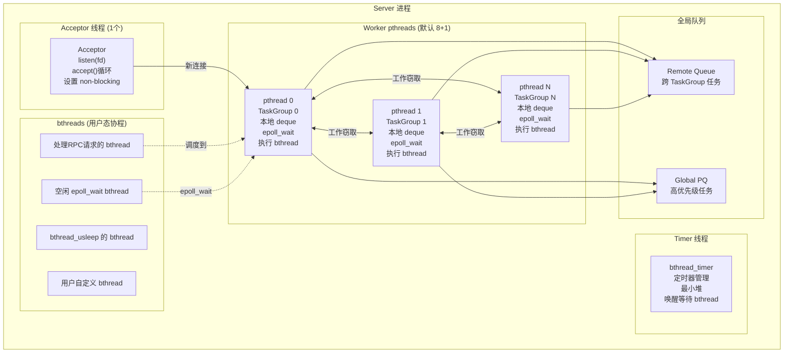

**线程角色**：

| 线程类型 | 数量 | 职责 |
|---|---|---|
| Acceptor pthread | 1（per listener） | 监听端口，accept 新连接 |
| Worker pthread | `bthread_concurrency`（默认 8）+ 1 | 执行 bthread，处理 I/O 和计算 |
| Timer bthread | 1（运行在 worker 上） | 管理定时器，唤醒到期的 sleep bthread |

---

## 3. bthread M:N 调度模型

### 3.1 bthread 生命周期

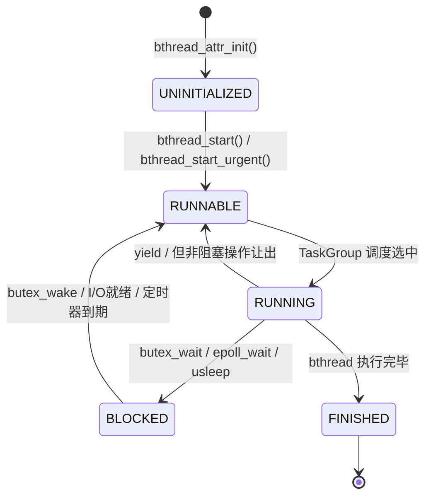

### 3.2 bthread 数据结构

```c
// src/bthread/bthread.h
typedef struct bthread {
    // bthread_t 本质是 int64_t，编码 TaskGroup 索引 + 本地序号
    // 高32位: TaskGroup 索引 (tls 序号)
    // 低32位: TaskGroup 内的版本号
} bthread_t;
```

真正的 bthread 上下文存储在 `TaskMeta` 中：

```c
// src/bthread/task_group.h
struct TaskMeta {
    bthread_t          tid;          // bthread ID
    TaskGroup*         group;        // 所属 TaskGroup
    std::function<void()> fn;        // 入口函数
    bthread_attr_t     attr;         // 属性（栈大小等）
    uint64_t           stack_size;   // 栈大小（默认 1MB）
    Context            ctx;          // 执行上下文（汇编保存的寄存器）
    uint32_t           attr_flags;   // 标志位
    uint32_t           local_storage; // TLS
    bool               interrupted;  // 是否被中断
    Waiter*            waiter;       // 等待者
};
```

### 3.3 bthread 创建

```c
// src/bthread/bthread.cpp
int bthread_start(bthread_t* __restrict tid,
                  const bthread_attr_t* __restrict attr,
                  void* (*fn)(void*), void* __restrict arg) {
    // 1. 分配 TaskMeta（从当前 TaskGroup 的远程队列或缓存获取）
    // 2. 填充 fn, arg, attr
    // 3. 投递到 TaskGroup 的远程队列
    // 4. 唤醒目标 TaskGroup（如果空闲）
}

int bthread_start_urgent(bthread_t* __restrict tid,
                         const bthread_attr_t* __restrict attr,
                         void* (*fn)(void*), void* __restrict arg) {
    // 与 bthread_start 相同，但投递到当前 TaskGroup 的本地 deque
    // 用于需要尽快执行的短任务（如 I/O 回调）
}
```

---

## 4. TaskGroup 与工作窃取

### 4.1 TaskGroup 核心结构

```c
// src/bthread/task_group.h
class TaskGroup {
    // 本地任务队列（Chase-Lev deque）
    WorkQueue<TaskMeta> _rq;

    // 远程任务队列（其他 TaskGroup 投递过来的任务）
    ButexWaiter        _rq_waiter;    // 远程队列非空时的等待机制
    RemoteTaskQueue    _remote_rq;

    // 当前运行的 TaskMeta
    TaskMeta*          _cur_meta;
    // 上一个运行的 TaskMeta（用于上下文切换的临时保存）
    TaskMeta*          _last_meta;

    // 空闲 epoll_wait bthread
    bthread_t          _idle_bthread;

    // epoll fd
    int                _epoll_fd;

    // 统计信息
    uint64_t           _nswitch;       // 上下文切换次数
    uint64_t           _nload;         // 调度次数

    // 窃取元数据
    static TaskGroup*  _tls_task_groups[MAX_TASKGROUP_SIZE];
    static size_t      _tls_task_group_num;
};
```

### 4.2 Chase-Lev Deque 工作窃取

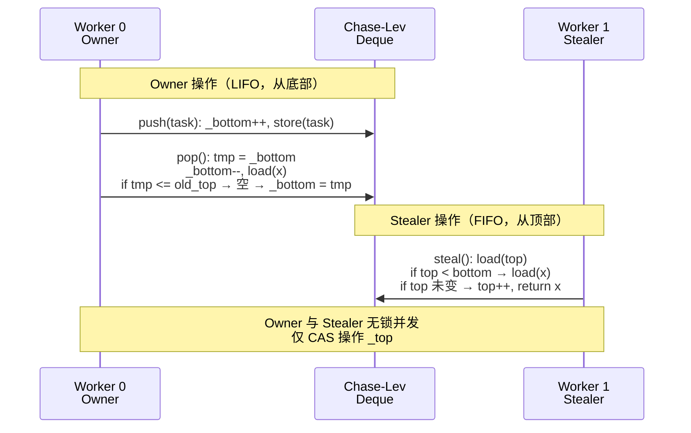

**关键特性**：

| 操作 | 方向 | 谁执行 | 锁 |
|---|---|---|---|
| push / pop | 底部（LIFO） | Owner（本地 worker） | 无锁 |
| steal | 顶部（FIFO） | Stealer（其他 worker） | CAS on top |

- **本地 push/pop**：缓存友好，LIFO 利用时间局部性
- **远程 steal**：FIFO，避免任务饥饿
- **环形缓冲区 + 对齐**：`_bottom` 和 `_top` 分别缓存行对齐，减少 false sharing

### 4.3 窃取策略

```c
// src/bthread/task_group.cpp
TaskGroup* TaskGroup::steal_task(size_t* seed) {
    // 质数步长随机游走
    const size_t ngroups = _tls_task_group_num;
    size_t idx = *seed;
    for (size_t i = 0; i < ngroups; ++i) {
        idx = (idx + 1543275363) % ngroups;  // 质数步长
        if (idx == _cur_idx) continue;        // 跳过自己
        TaskGroup* g = _tls_task_groups[idx];
        // 尝试从 g 的 deque steal
        if (g->_rq.steal(&task)) return g;
    }
    return NULL;
}
```

---

## 5. 上下文切换机制

### 5.1 汇编实现（非 ucontext）

brpc 使用自研汇编实现上下文切换，比 glibc 的 `ucontext` 快很多：

```c
// src/bthread/context.h
// 保存/恢复 callee-saved 寄存器:
//   x86_64: rbx, rbp, r12-r15, rsp, mxcsr, x87 control word
//   aarch64: x19-x28, x29(FP), x30(LR), sp, d8-d15

// 跳转到另一个上下文
int bthread_jump_fcontext(void** ofc, void* nfc, int preserve_fpu);

// 生成新上下文（分配栈 + 设置入口函数）
void* bthread_make_fcontext(void* sp, size_t size, void (*fn)(int, void*));
```

### 5.2 上下文切换时序

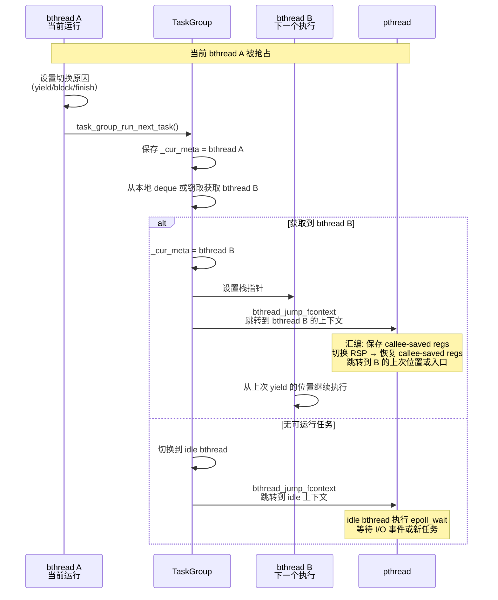

### 5.3 切换开销

| 指标 | bthread_jump_fcontext | ucontext_swap | setjmp/longjmp |
|---|---|---|---|
| 保存寄存器 | callee-saved（6个 + FPU） | 全部寄存器 | callee-saved |
| 切换耗时 | ~10-20 ns | ~100-200 ns | ~20-50 ns |
| 栈管理 | per-bthread 独立栈 | per-thread 栈 | 共享栈 |

---

## 6. Worker 线程池

### 6.1 Worker 线程启动

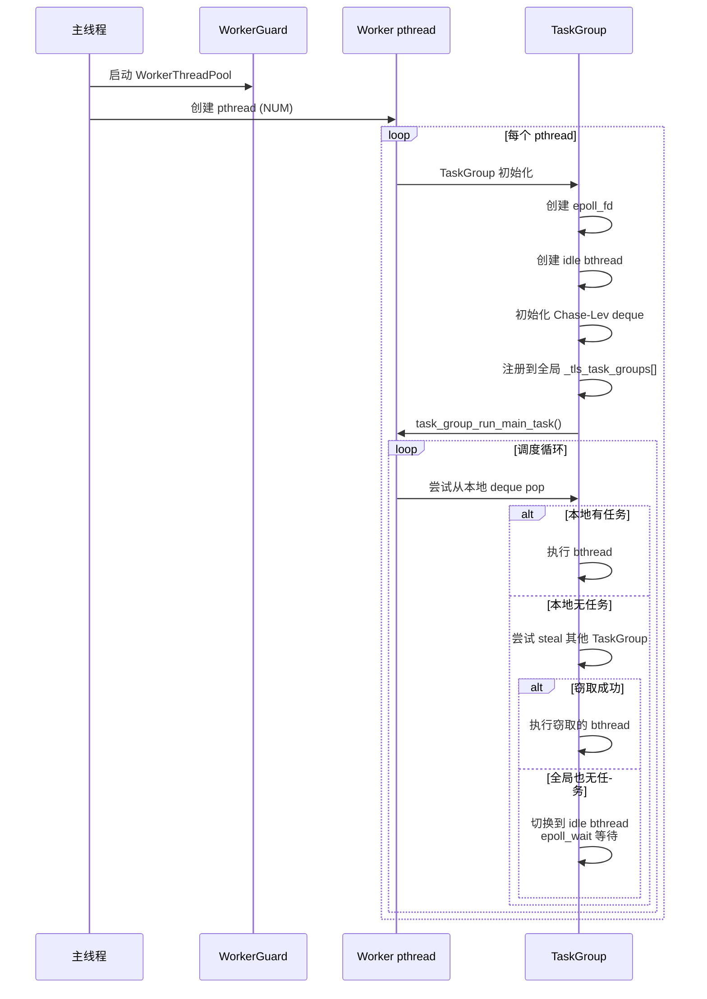

### 6.2 WorkerThreadPool 类

```c
// src/bthread/task_group.h
class WorkerThreadPool {
    // 全局单例，管理所有 worker pthread
    // _threads: pthread 数组
    // _task_groups: TaskGroup 数组（与 pthread 一一对应）

    void start(int num_threads);
    void stop();
    void join();  // 等待所有 bthread 完成
};

// 默认配置
// bthread_concurrency = 8 (加上 1 个 idle thread = 9 个 pthread)
// BTHREAD_STACKSIZE = 1MB (默认 bthread 栈大小)
// BTHREAD_MIN_STACKSIZE = 32KB
```

---

## 7. EventDispatcher 与 epoll I/O

### 7.1 核心设计：epoll 循环也是 bthread

brpc 的 EventDispatcher 不是独立的 pthread，而是一个 **运行在 worker pthread 上的 bthread**：

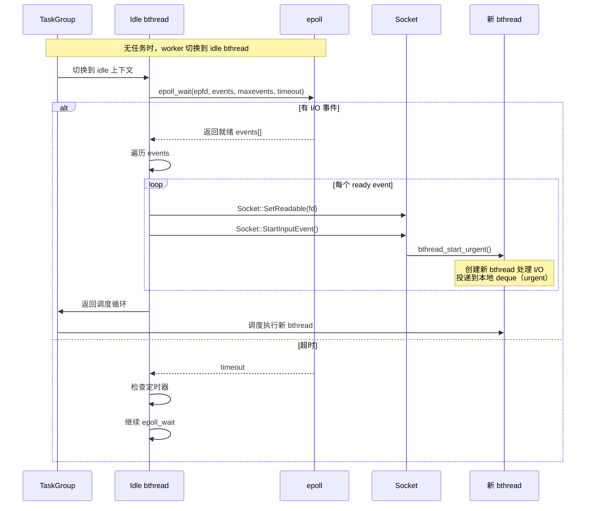

### 7.2 Socket 与 epoll 交互

每个 Socket 绑定到特定的 TaskGroup（通过 fd 取模）：

```c
// src/brpc/socket.cpp
class Socket {
    int          _fd;
    TaskGroup*   _tg;          // 绑定的 TaskGroup
    int          _epoll_fd;    // 注册的 epoll fd
    uint32_t     _events;      // 监听的事件（EPOLLIN/EPOLLOUT）

    void StartInputEvent() {
        // 创建 bthread 处理输入
        bthread_start_urgent(NULL, NULL, on_input_event, this);
    }

    void StartOutputEvent() {
        // 创建 bthread 处理输出
        bthread_start_urgent(NULL, NULL, on_output_event, this);
    }
};
```

**fd 分配策略**：

```c
// src/bthread/task_group.cpp
TaskGroup* get_task_group(int fd) {
    // fd % num_task_groups → 选择 TaskGroup
    // 确保 fd 的事件总是在同一个 TaskGroup 的 epoll 中处理
}
```

---

## 8. Acceptor 线程

### 8.1 Acceptor 工作流程

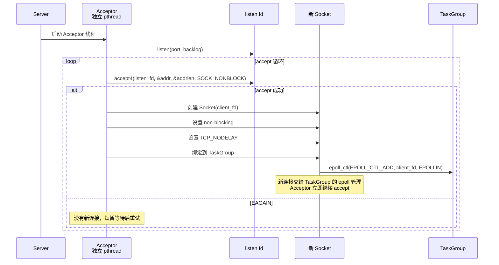

### 8.2 关键设计

- **Acceptor 是独立 pthread**：不参与 bthread 调度，专门做 accept
- **accept4 + SOCK_NONBLOCK**：原子设置非阻塞，避免 race
- **多 Acceptor**：`ServerOptions.acceptor_thread_num` 可配置多个 Acceptor（SO_REUSEPORT）
- **连接交给 epoll**：accept 后立即注册到 TaskGroup 的 epoll，后续 I/O 由 bthread 处理

---

## 9. RPC 请求处理全流程

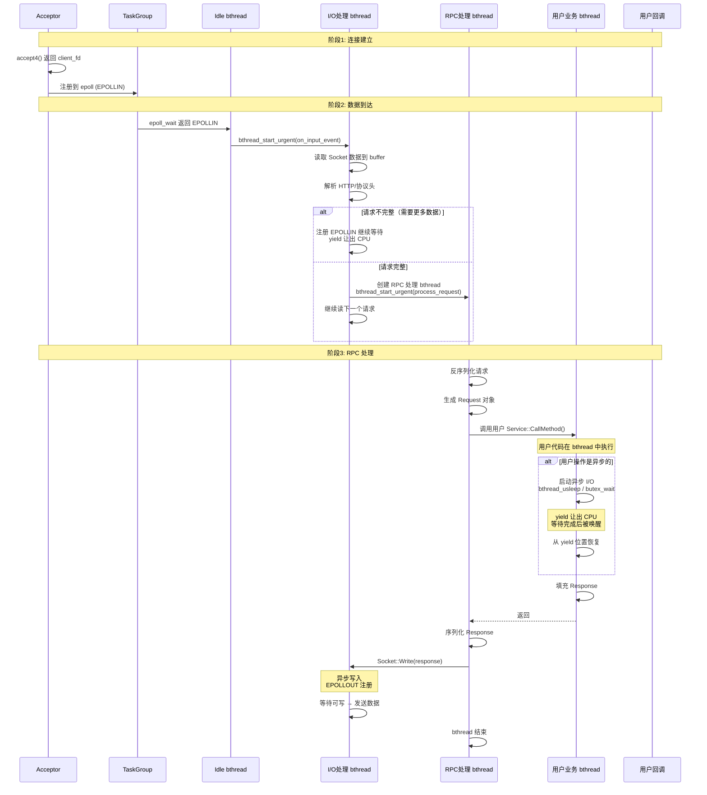

### 9.1 Controller 处理链

```c
// src/brpc/controller.cpp
// RPC 处理流程:
void Controller::CallMethod(...) {
    // 1. 检查 request 是否已设置
    // 2. 打包 request 到 Socket
    // 3. Socket::Write() 异步发送
    // 4. 设置 done->Run() 回调
}

// 服务端处理:
void Server::ProcessRequest(InputMessageBase* msg) {
    // 1. 反序列化请求
    // 2. 查找 Service + Method
    // 3. new Controller
    // 4. service->CallMethod(controller.get(), request, response, done)
    // 5. done->Run() 序列化 response 并发送
}
```

---

## 10. RPC 发送端流程

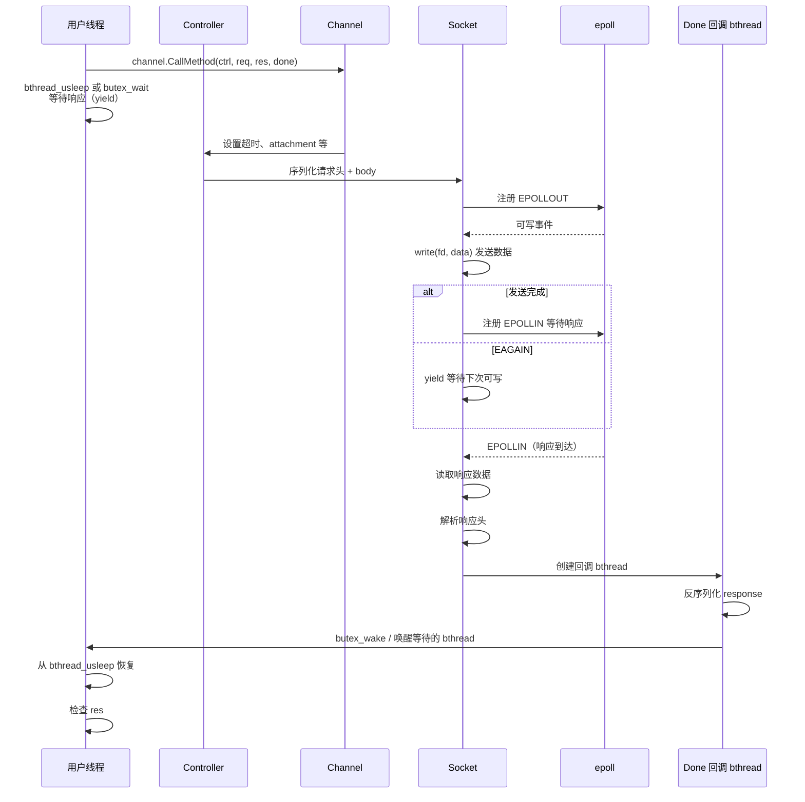

---

## 11. Timer 线程

### 11.1 Timer 实现

brpc 的定时器基于 bthread 实现，使用最小堆管理定时事件：

```c
// src/bthread/timer_thread.h
class TimerThread {
    struct TimerInfo {
        uint64_t          expiration_us;  // 到期时间（微秒）
        TaskGroup*        task_group;     // 目标 TaskGroup
        void*             arg;            // 回调参数
        TimerInfo*        next;           // 堆链接
    };

    // 最小堆
    TimerInfo*         _heap;
    size_t             _heap_size;
    butex_t            _stop;

    // 运行在一个专用 bthread 中
    bthread_t          _timer_thread;
};
```

### 11.2 Timer 工作流程

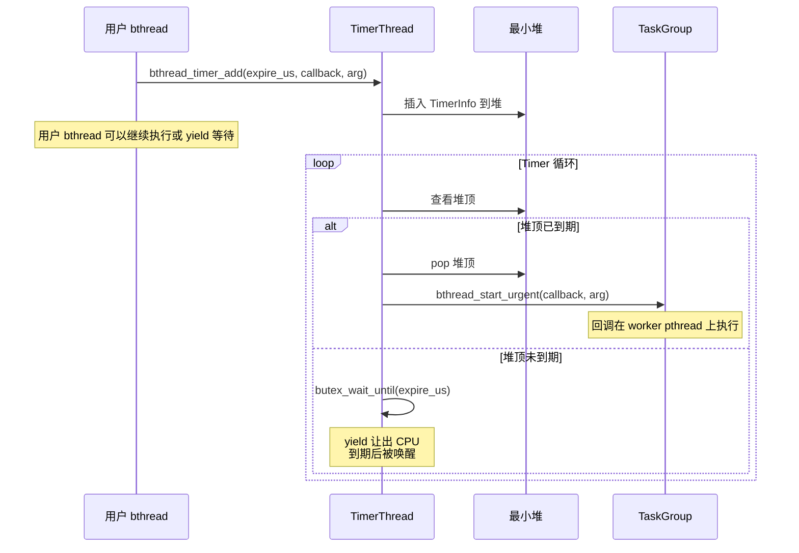

### 11.3 bthread_usleep 实现

```c
// src/bthread/bthread.cpp
int bthread_usleep(uint64_t microseconds) {
    // 1. 添加定时器到 TimerThread
    // 2. butex_wait(自己的 butex, 超时=expire_us)
    // 3. yield 让出 CPU
    // 4. 被定时器唤醒 → 恢复执行
}
```

---

## 12. Butex 与同步原语

### 12.1 Butex（bthread mutex）

Butex 是 brpc 的基础同步原语，类似 futex，但工作在 bthread 层面：

```c
// src/bthread/butex.h
typedef struct butex {
    int value;       // 原子变量
} butex_t;

int butex_wait(butex_t* b, int expected_value, const timespec* abstime);
int butex_wake(butex_t* b);
int butex_wake_all(butex_t* b);
```

### 12.2 Butex 等待流程

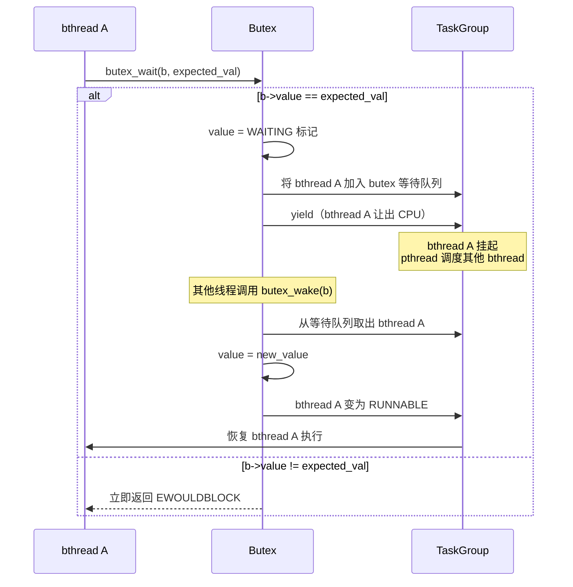

### 12.3 其他同步原语

| 原语 | 实现 | 说明 |
|---|---|---|
| `bthread_mutex_t` | 基于 butex | bthread 互斥锁 |
| `bthread_cond_t` | 基于 butex | bthread 条件变量 |
| `bthread_countdownevent_t` | 基于 butex | 倒计时事件 |
| `brpc::CondVar` | 基于 butex | RPC 层条件变量 |
| `brpc::Mutex` | 包装 bthread_mutex | RPC 层互斥锁 |

---

## 13. bthread_usleep 与 I/O 等待

### 13.1 bthread_usleep 详细流程

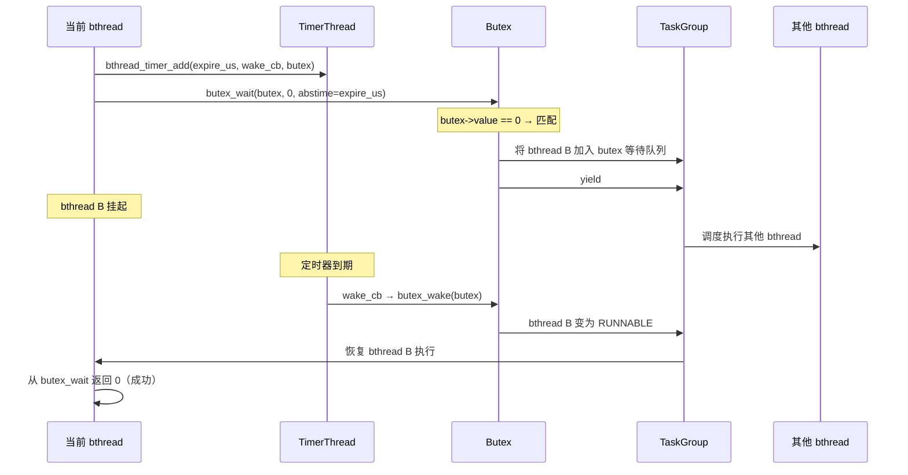

### 13.2 Socket I/O 等待

当 Socket 写入遇到 EAGAIN 时：

```c
// src/brpc/socket.cpp
int Socket::Write(Buffer* buf) {
    int nw = ::write(_fd, buf->data(), buf->size());
    if (nw < 0 && errno == EAGAIN) {
        // 注册 EPOLLOUT，yield 等待可写
        _epoll_events |= EPOLLOUT;
        epoll_ctl(_epoll_fd, EPOLL_CTL_MOD, _fd, &_event);
        bthread_yield();  // 让出 CPU
        // 恢复后继续写入
    }
}
```

---

## 14. ConcurrentQueue 与任务投递

### 14.1 远程任务投递

当一个 bthread 需要向其他 TaskGroup 投递任务时：

```c
// src/bthread/task_group.cpp
int TaskGroup::push_remote_task(TaskGroup* target, TaskMeta* task) {
    // 1. CAS 操作将 task 追加到 target->_remote_rq
    // 2. 如果 target 正在等待（idle），则 butex_wake 唤醒它
    // 3. 无锁设计：_remote_rq 使用 MPSC 队列
}
```

### 14.2 全局优先队列

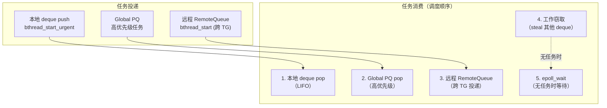

**调度优先级**：

1. 本地 deque（LIFO，最快）
2. 全局优先队列（高优先级任务）
3. 远程队列（其他 TG 投递的任务）
4. 工作窃取（从其他 TG 的 deque steal）
5. epoll_wait（所有队列都空，进入 idle）

---

## 15. 配置参数

| 参数 | 默认值 | 说明 |
|---|---|---|
| `bthread_concurrency` | 8 | Worker pthread 数量 |
| `BTHREAD_STACKSIZE` | 1MB | bthread 默认栈大小 |
| `BTHREAD_MIN_STACKSIZE` | 32KB | bthread 最小栈大小 |
| `bthread_min_concurrency` | `bthread_concurrency + 1` | 最小 pthread 数量 |
| `ServerOptions.acceptor_thread_num` | 1 | Acceptor 线程数 |
| `ServerOptions.num_threads` | 0（自动） | Server worker 线程数（0=使用全局 bthread 池） |
| `brpc_socket_recv_max_unwritten_bytes` | 256MB | Socket 接收缓冲区上限 |
| `brpc_socket_max_connections_per_epoll` | 10000 | 每个 epoll 最大连接数 |
| `TimerThread.max_tasks` | 无限制 | 定时器最大任务数 |
| `TaskGroup.steal_rounds` | 3 | 每轮窃取尝试次数 |

---

## 16. 对比总结

### 16.1 brpc vs 其他 RPC 框架线程模型

| 特性 | brpc (bthread) | gRPC | Thrift | libevent |
|---|---|---|---|---|
| 线程模型 | M:N 协程 | 1:1 + CQ | TThreadedServer (1:1) | Reactor (1:N) |
| 用户态线程 | bthread（自研汇编切换） | 无协程 | 无协程 | 无协程 |
| I/O 模型 | epoll（每个 TG 一个） | epoll + CQ poll | blocking I/O | epoll Reactor |
| 任务调度 | Chase-Lev deque + 窃取 | Completion Queue | 无调度 | 回调链 |
| 同步编程 | 支持（butex_wait） | 异步回调为主 | 同步阻塞 | 纯异步回调 |
| 上下文切换 | ~10-20 ns | N/A（1:1） | N/A（1:1） | N/A（回调） |
| 阻塞 I/O | yield 不阻塞 pthread | 阻塞 pthread | 阻塞 pthread | 不支持阻塞 |

### 16.2 bthread vs pthread vs goroutine

| 特性 | bthread | pthread | goroutine |
|---|---|---|---|
| 创建成本 | ~1μs | ~50μs | ~0.3μs |
| 栈大小 | 默认 1MB（可调） | 默认 8MB（固定） | 初始 2KB（动态增长） |
| 调度 | 协作式 + 抢占式 | 抢占式 | 抢占式 |
| M:N 比 | 8:~10000 | 1:1 | P:~100000 |
| 上下文切换 | 汇编（callee-saved） | 内核切换 | Go runtime（汇编） |
| 阻塞 I/O | yield 不阻塞 pthread | 阻塞 pthread | yield 不阻塞 M |

---

## 17. 源码索引

### bthread 核心

| 文件 | 内容 |
|---|---|
| `src/bthread/bthread.h` | bthread_t 定义、bthread_attr_t、公共 API |
| `src/bthread/bthread.cpp` | bthread_start/stop/join/yield/usleep |
| `src/bthread/task_group.h` | TaskGroup、TaskMeta、WorkQueue |
| `src/bthread/task_group.cpp` | TaskGroup 调度循环、工作窃取、远程投递 |
| `src/bthread/context.h` | 上下文切换 API |
| `src/bthread/context.cpp` | 上下文切换实现（调用汇编） |
| `src/bthread/sys_fcontext.cpp` | 各平台汇编上下文切换 |
| `src/bthread/stack.h` | bthread 栈管理 |
| `src/bthread/stack_inl.h` | 栈分配/释放实现 |
| `src/bthread/butex.h` | Butex 同步原语 API |
| `src/bthread/butex.cpp` | butex_wait/wake 实现 |
| `src/bthread/countdown_event.h` | CountdownEvent |
| `src/bthread/mutex.h` | bthread_mutex_t |
| `src/bthread/condition_variable.h` | bthread_cond_t |
| `src/bthread/timer_thread.h` | TimerThread 定时器 |
| `src/bthread/timer_thread.cpp` | 定时器堆管理、唤醒逻辑 |
| `src/bthread/unsafe_butex.h` | 不安全但高效的 butex |

### brpc 网络

| 文件 | 内容 |
|---|---|
| `src/brpc/socket.h` | Socket 类 |
| `src/brpc/socket.cpp` | Socket I/O、epoll 注册、事件处理 |
| `src/brpc/acceptor.h` | Acceptor 类 |
| `src/brpc/acceptor.cpp` | accept 循环、连接分发 |
| `src/brpc/server.h` | Server 类 |
| `src/brpc/server.cpp` | Server 启动、Service 注册、请求处理 |
| `src/brpc/channel.h` | Channel 类（客户端连接） |
| `src/brpc/channel.cpp` | RPC 发送、超时、重试 |
| `src/brpc/controller.h` | Controller 类 |
| `src/brpc/controller.cpp` | RPC 控制、序列化、发送 |
| `src/brpc/input_message_base.h` | InputMessageBase 输入消息基类 |
| `src/brpc/event_dispatcher.h` | EventDispatcher |
| `src/brpc/event_dispatcher.cpp` | epoll 事件分发 |
| `src/brpc/periodic_task.cpp` | 周期性任务（Timer 封装） |

### 但线程池

| 文件 | 内容 |
|---|---|
| `src/bthread/worker_pthread.h` | Worker pthread 管理 |
| `src/bthread/worker_pthread.cpp` | pthread 创建、TLS 初始化 |
| `src/bthread/work_queue.h` | Chase-Lev WorkQueue 实现 |
