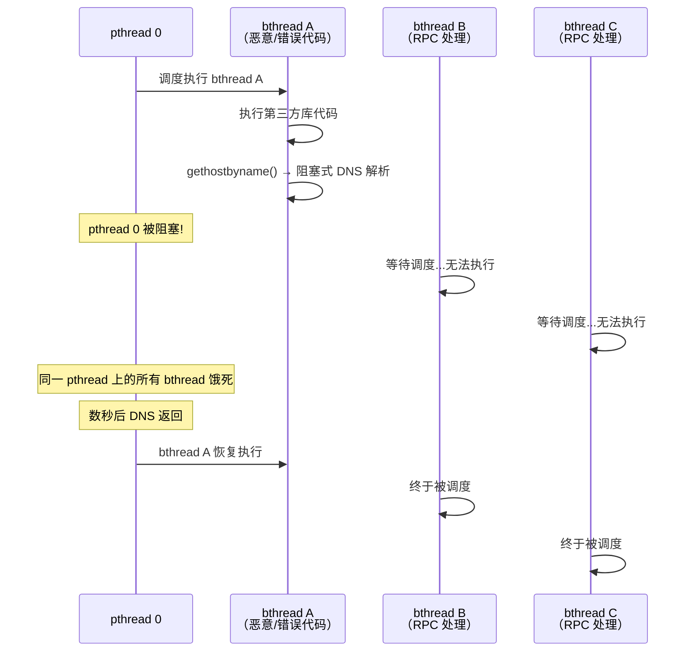
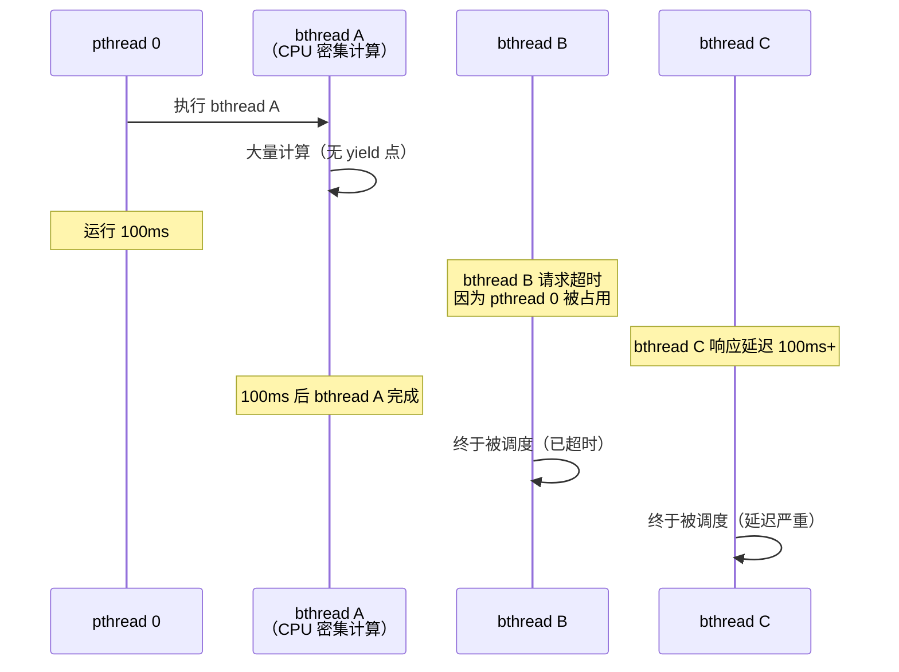
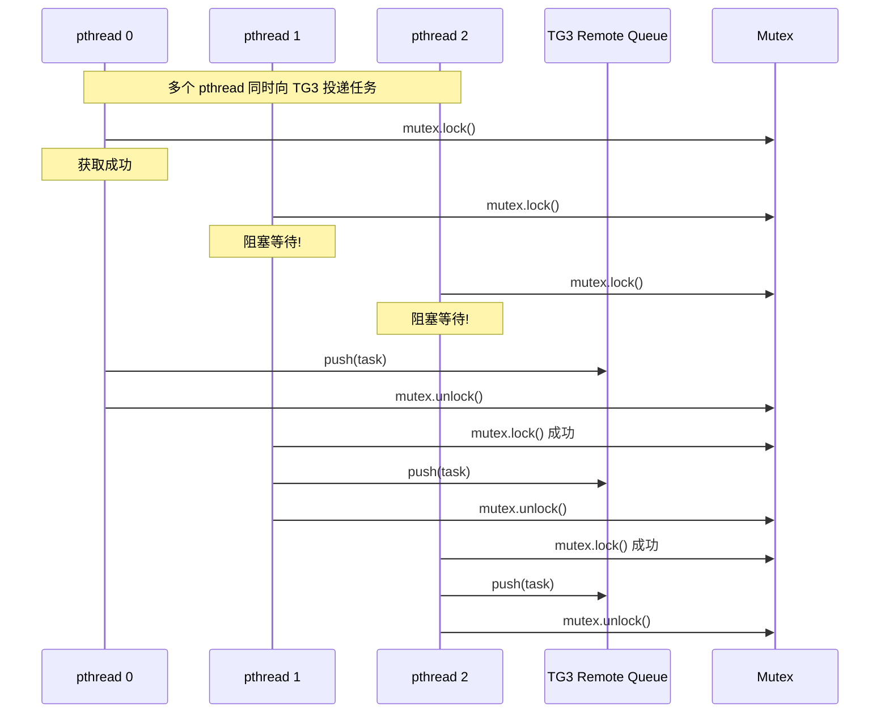
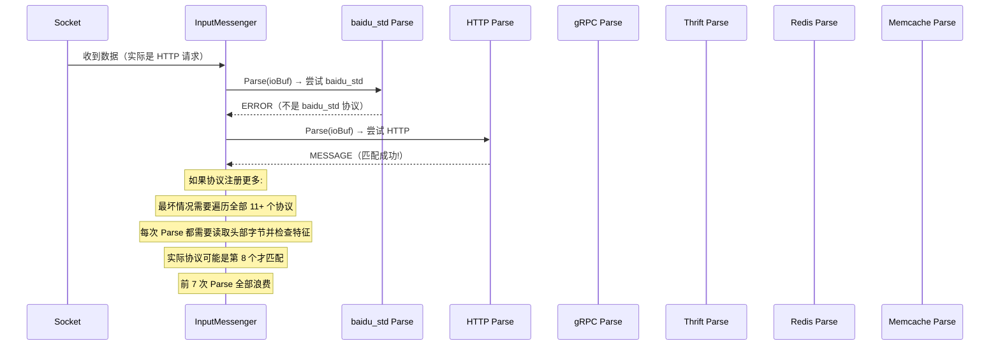
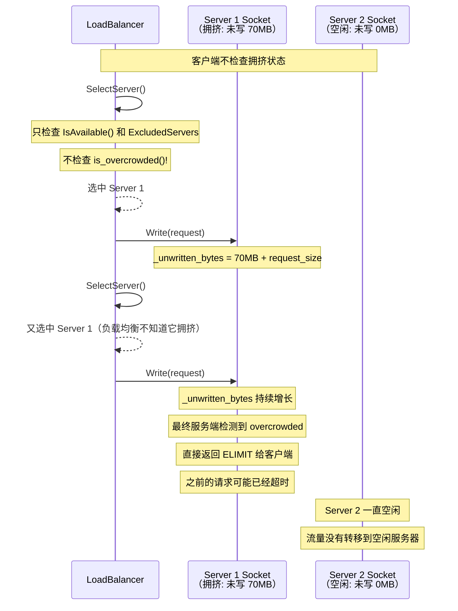
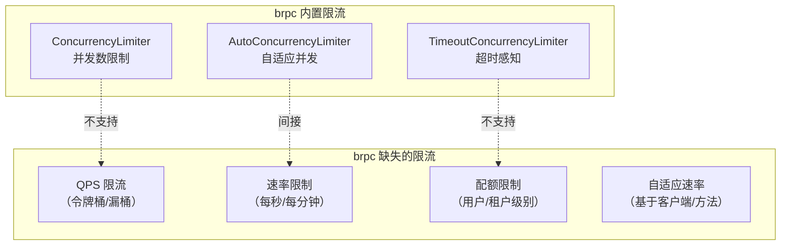
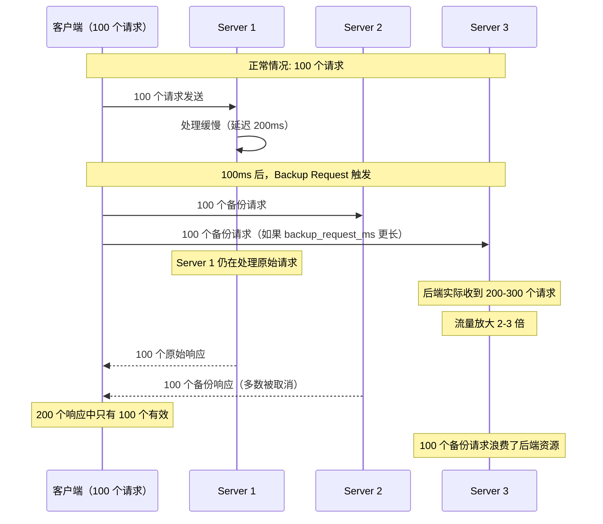
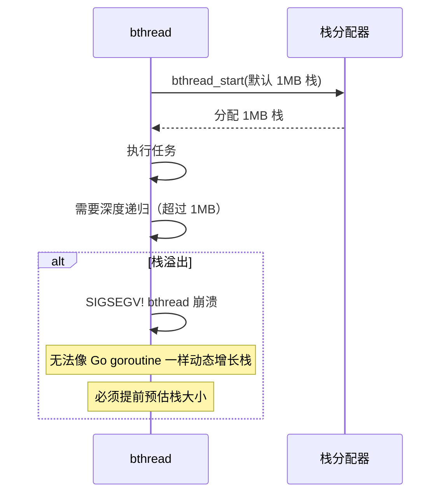
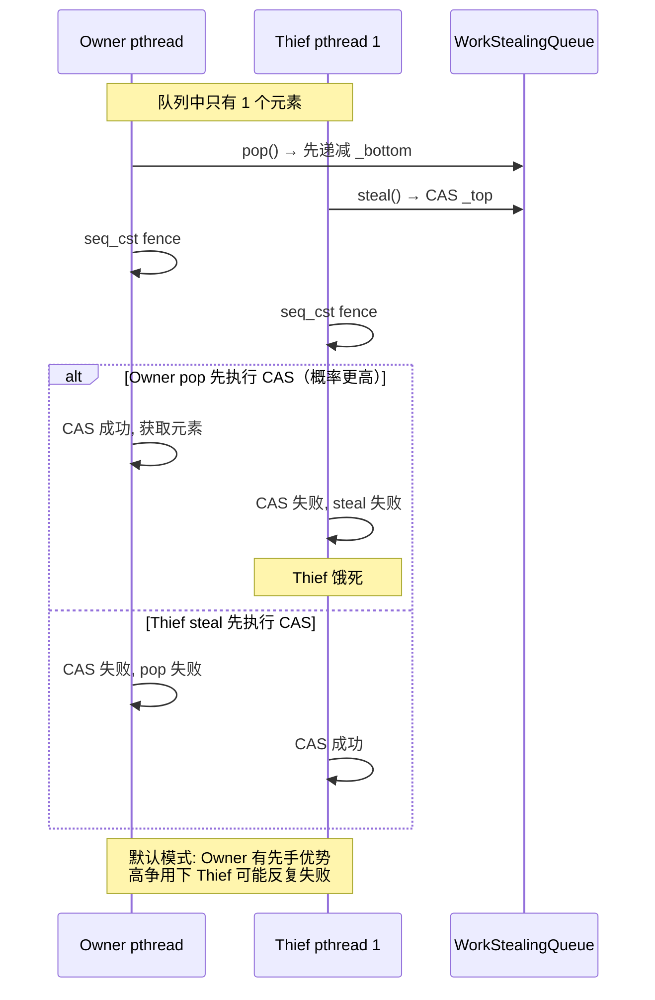

# brpc 缺点与局限性分析

## 目录

1. [概述](#1-概述)
2. [协作式调度的缺陷](#2-协作式调度的缺陷)
3. [远程队列的互斥锁瓶颈](#3-远程队列的互斥锁瓶颈)
4. [协议解析的试错开销](#4-协议解析的试错开销)
5. [客户端不感知服务端拥挤](#5-客户端不感知服务端拥挤)
6. [缺乏内置 QPS 限流](#6-缺乏内置-qps-限流)
7. [备份请求的流量放大风险](#7-备份请求的流量放大风险)
8. [资源泄漏风险](#8-资源泄漏风险)
9. [bthread 栈大小问题](#9-bthread-栈大小问题)
10. [工作窃取的公平性问题](#10-工作窃取的公平性问题)
11. [熔断器的局限性](#11-熔断器的局限性)
12. [配置复杂度过高](#12-配置复杂度过高)
13. [服务发现的耦合与限制](#13-服务发现的耦合与限制)
14. [与其他框架的对比](#14-与其他框架的对比)
15. [总结](#15-总结)

---

## 1. 概述

brpc 作为工业级 RPC 框架有其优势，但也存在多个设计缺陷和局限性。本文从源码层面分析这些问题，并给出时序流程图。

**问题分类**：

| 类别 | 缺点 | 严重程度 |
|---|---|---|
| 调度模型 | 协作式调度无抢占、公平性问题 | 高 |
| 性能瓶颈 | 远程队列互斥锁、协议试错解析 | 中 |
| 功能缺失 | 无内置 QPS 限流、客户端不感知拥挤 | 中 |
| 资源管理 | Butex 对象池不释放、栈大小不可动态增长 | 中 |
| 运维风险 | 备份请求流量放大、配置复杂 | 中 |
| 生态 | 服务发现耦合深、协议识别试错 | 低 |

---

## 2. 协作式调度的缺陷

### 2.1 问题描述

brpc 的 bthread 使用**协作式调度**：bthread 必须主动 yield 才能让出 pthread。如果 bthread 执行了阻塞系统调用或长耗时计算，会导致整个 pthread 被阻塞。

### 2.2 问题场景：阻塞系统调用



### 2.3 问题场景：CPU 密集型 bthread



### 2.4 gRPC 的对比：抢占式调度

| 特性 | brpc（协作式） | gRPC（抢占式） |
|---|---|---|
| 调度方式 | bthread 主动 yield | Go runtime 定时抢占 |
| 阻塞系统调用 | pthread 饿死 | 自动调度其他 goroutine |
| CPU 密集型任务 | 无时间片剥夺 | ~10ms 抢占 |
| 编程要求 | 必须使用 brpc 异步 API | 可以使用同步代码 |

---

## 3. 远程队列的互斥锁瓶颈

### 3.1 问题描述

当 bthread A 在 TaskGroup 0 上调用 `butex_wake` 唤醒属于 TaskGroup 1 的 bthread B 时，需要将 B 推入 TG1 的远程队列。该队列使用 `Mutex` 保护，在高并发场景下成为瓶颈。

### 3.2 锁竞争时序



### 3.3 性能影响

```c
// src/bthread/remote_task_queue.h
class RemoteTaskQueue {
    butil::BoundedQueue<bthread_t> _tasks;  // Mutex 保护
    butil::Mutex _mutex;                    // 全局互斥锁
};

// 高并发 RPC 场景:
// - 大量 butex_wake 跨 TG 投递
// - 所有投递竞争同一个 Mutex
// - 容量仅 2048，满时 spin + usleep(1000) 更严重
```

### 3.4 对比：无锁 MPSC 队列

| 方案 | brpc 当前 | 改进方案 |
|---|---|---|
| 数据结构 | Mutex + BoundedQueue | 无锁 MPSC 队列（如 Vyukov Queue） |
| 投递延迟 | O(1) + 锁等待 | O(1) 无等待 |
| 争用影响 | 高并发时 pthread 阻塞 | CAS 重试，不阻塞 pthread |
| 实现复杂度 | 简单 | 中等 |

---

## 4. 协议解析的试错开销

### 4.1 问题描述

brpc 收到数据后，需要逐个协议尝试解析，直到匹配成功。这种试错机制在协议数量多时效率低下。

### 4.2 试错解析时序



### 4.3 性能开销

```c
// src/brpc/input_messenger.cpp
void OnNewMessages(Socket* socket) {
    while (!source->empty()) {
        for (size_t i = 0; i < _protocol_list.size(); ++i) {
            ParseResult result = _protocol_list[i]->Parse(source, ...);
            if (result.is_message()) break;
            if (result.is_error()) break;  // 可能误判
        }
    }
}

// 注册 11+ 个协议时:
// 每个请求可能需要 1~11 次 Parse 尝试
// 每次 Parse 至少读取 4-12 字节 + 字符串比较
// 高 QPS 场景下累积开销可观
```

---

## 5. 客户端不感知服务端拥挤

### 5.1 问题描述

brpc 的 `Socket.is_overcrowded()` 仅在服务端检查，客户端的 LoadBalancer **不检查**目标 Socket 是否拥挤，导致请求可能被发送到已经堆积大量未写数据的 Socket。

### 5.2 拥挤传播时序



### 5.3 源码证据

```c
// src/brpc/load_balancer.cpp
// SelectServer 中只检查:
bool IsServerAvailable(ServerId id) {
    SocketUniquePtr ptr;
    if (Socket::Address(id, &ptr) != 0) return false;
    return ptr->IsAvailable();
    // 注意: 没有 is_overcrowded() 检查!
}
```

---

## 6. 缺乏内置 QPS 限流

### 6.1 问题描述

brpc 没有内置的 QPS 限流器，只能通过 Interceptor 扩展实现。

### 6.2 现有限流能力对比



### 6.3 影响

| 场景 | 现状 | 理想 |
|---|---|---|
| 限制某方法 1000 QPS | 需要自己写 Interceptor | 内置 `QPSLimiter("1000/s")` |
| 限制某用户 100 QPS | 需要复杂扩展 | 内置 `UserRateLimiter` |
| 滑动窗口限流 | 无 | 内置 `SlidingWindowLimiter` |
| 令牌桶 | 无 | 内置 `TokenBucketLimiter` |

---

## 7. 备份请求的流量放大风险

### 7.1 问题描述

Backup Request 机制在高延迟场景下会大幅放大后端流量。

### 7.2 流量放大时序



### 7.3 RateLimitedBackupPolicy 的不足

```c
// RateLimitedBackupPolicy 仅限制:
// max_backup_ratio = 0.1（窗口内最多 10% 请求触发 backup）

// 问题:
// 1. 滑动窗口为 10 秒，粒度太粗
// 2. 不考虑后端当前负载
// 3. 不区分服务端的健康状态
// 4. 恢复后没有退避机制
```

---

## 8. 资源泄漏风险

### 8.1 Butex 对象池永不释放

```c
// src/bthread/butex.cpp:265-271
// Butex 对象从不释放，来自永不排空的 ObjectPool
// ObjectPoolBlockMaxItem<Butex>::value = 128

// 问题:
// - 但ex_wake 后 Butex 对象永不归还
// - 如果频繁创建新的 butex_wait 点，ObjectPool 持续增长
// - 内存使用只增不减
```

### 8.2 栈缓存只增不减

```c
// bthread 栈缓存策略:
// - 归还的栈放入 TaskGroup 栈缓存
// - 分配时 best-fit
// - 繁忙后缓存可能积累大量不同大小的栈
// - TaskGroup 销毁时才释放所有缓存栈

// 问题:
// - 如果曾经有大栈的 bthread（如 bthread_attr_set_stacksize(8MB)）
// - 栈缓存会持有这些大栈直到 TaskGroup 销毁
// - 默认栈大小固定 1MB，不可动态增长（Go 的 goroutine 栈可从 2KB 动态增长到 GB）
```

### 8.3 Socket WriteQueue 无硬限制

```c
// Socket WriteQueue 没有硬性的消息数量上限
// 只有字节级别的 overcrowded 阈值（默认 64MB）

// 问题:
// - 如果大量小消息堆积，消息数量可以非常大
// - 每个 pending 消息占用 IOBuf 内存
// - 可能导致内存 OOM
```

---

## 9. bthread 栈大小问题

### 9.1 固定栈大小 vs 动态增长



### 9.2 与 Go goroutine 对比

| 特性 | bthread | Go goroutine |
|---|---|---|
| 初始栈大小 | 1MB（固定） | 2KB |
| 最大栈大小 | 用户指定（固定） | 可动态增长到 GB 级 |
| 栈溢出保护 | 无（SIGSEGV） | 运行时检查 + 扩展 |
| 空间浪费 | 深度小的任务浪费 ~1MB | 仅使用实际需要的栈空间 |
| 栈分配方式 | mmap 预分配 | split stack / copied stack |

---

## 10. 工作窃取的公平性问题

### 10.1 默认模式下 Owner 优先



### 10.2 公平模式的代价

```c
// BTHREAD_FAIR_WSQ: Owner 也使用 steal() 而非 pop()
// 公平性: Owner 和 Thief 使用相同 CAS 竞争
// 代价: WSQ::steal() CPU 占比从 1.9% 增加到 2.9%（+52%）
// 默认关闭: 追求性能而非公平
```

---

## 11. 熔断器的局限性

### 11.1 仅 Socket 级熔断

```c
// CircuitBreaker 绑定在 Socket 级别
// 问题:
// - 一个 Server 实例只有一个 Socket（单连接复用）
// - 熔断该 Socket = 熔断整个 Server 实例
// - 无法做到方法级别的细粒度熔断
// - 无法做到用户/租户级别的熔断
```

### 11.2 恢复延迟大

```c
// 熔断恢复依赖 HealthCheckTask
// 初始隔离: 10ms
// 每次失败: 隔离时间翻倍
// 最大隔离: 30s

// 问题:
// - 30s 的最大隔离时间过长
// - 服务端可能在几秒内恢复，但客户端被阻塞 30s
// - 恢复后没有渐进式流量恢复（half_open 窗口太小）
```

---

## 12. 配置复杂度过高

### 12.1 GFlag 参数数量

brpc 暴露了数百个 GFlag 参数，很多有非直觉的默认值和交互：

```c
// 仅与 bthread 相关的 GFlag:
bthread_concurrency = 8        // Worker pthread 数
task_group_runqueue_capacity = 4096
enable_bthread_priority_queue = false
bthread_parking_lot_of_each_tag = 4
bthread_min_concurrency = 3

// 仅与 Socket 相关的:
socket_max_unwritten_bytes = 67108864  // 64MB
socket_connect_timeout_ms = 200
socket_fail_limit = 1000
socket_keepalive_time_s = 600
socket_keepalive_idle_timeout_ms = 600000

// 仅与流控相关的:
health_check_interval_s = 3
max_concurrency = 0
...
```

### 12.2 参数交互问题

```
问题: bthread_concurrency 设置过高的影响
  - 更多的 pthread → 更多的 epoll fd → 更多的 futex 争用
  - 更多的 TaskGroup → 更多的远程队列 → 更多的 Mutex 争用
  - 不一定带来性能提升（Amdahl 定律）

问题: socket_max_unwritten_bytes 设置过高
  - 拥挤检测延迟增大
  - 内存占用增加
  - 可能导致 OOM

问题: task_group_runqueue_capacity 设置过高
  - 内存占用增加（每个 TG × 4096 × 8 bytes）
  - 不影响性能（WSQ 总是局部操作）
```

---

## 13. 服务发现的耦合与限制

### 13.1 NamingService 耦合深

```c
// Channel::Init() 中 NamingService 和 LoadBalancer 紧耦合
// 1. Channel 内部创建 NamingServiceThread
// 2. NamingServiceThread 自动管理 Socket
// 3. Socket 直接与 ServerId 关联
// 4. 无法自定义服务发现后的处理逻辑

// 问题:
// - 无法拦截 NamingService 返回的 server list 做过滤
// - 无法在 LB 选择前插入自定义逻辑（如地域路由）
// - 多个 Channel 共享同一 NamingServiceThread 时无法差异化
```

### 13.2 无内置服务网格支持

| 特性 | brpc | gRPC + Envoy | Dubbo + Istio |
|---|---|---|---|
| 服务网格 | 无内置支持 | 原生支持 | 通过 Mesh 适配 |
| mTLS | 不支持 | 支持 | 支持 |
| 流量镜像 | 不支持 | 支持 | 支持 |
| 灰度发布 | 不支持 | 支持 | 支持 |
| 熔断 | Socket 级 | 外部（istio） | 外部（sentinel） |
| 限流 | ConcurrencyLimiter | 外部（envoy） | 外部（sentinel） |

---

## 14. 与其他框架的对比

### 14.1 核心缺陷对比

| 缺点 | brpc | gRPC | Dubbo | Thrift |
|---|---|---|---|---|
| 调度模型 | 协作式（无抢占） | 抢占式（Go runtime） | 线程池 | 线程池 |
| QPS 限流 | 无内置 | 无内置 | 内置 | 无内置 |
| 协议识别 | 试错遍历 | 基于请求头 | 显式指定 | 显式指定 |
| 流量放大风险 | Backup Request | 无 | 无 | 无 |
| 资源泄漏 | Butex 永不释放 | GC 管理 | GC 管理 | N/A |
| 栈管理 | 固定大小 | 动态增长 | N/A | N/A |
| 服务网格 | 不支持 | 原生 | 适配 | 不支持 |

### 14.2 brpc 的独特优势（作为平衡）

尽管存在以上缺点，brpc 在以下方面仍然领先：

| 优势 | 说明 |
|---|---|
| 上下文切换速度 | ~10-20ns（自研汇编），远快于 goroutine |
| IOBuf 零拷贝 | Protobuf 直接序列化到 Block，无中间缓冲 |
| 内置 Backup Request | 减少 P99 尾延迟 |
| 内置 LALB | 延迟感知自适应权重 |
| 协议丰富度 | 11+ 协议，一套框架支持多种场景 |
| 中文文档和社区 | 百度内部长期使用，文档完善 |

---

## 15. 总结

brpc 的缺点主要集中在以下几个方面：

1. **协作式调度无抢占**：阻塞系统调用或 CPU 密集型任务会饿死同 pthread 上的所有 bthread
2. **远程队列互斥锁**：高并发跨 TG 投递时成为瓶颈，应改为无锁 MPSC 队列
3. **协议试错解析**：11+ 协议逐个尝试，最坏情况每次请求都需要全部 Parse
4. **客户端不感知拥挤**：LoadBalancer 不检查 overcrowded，流量无法转移到空闲服务器
5. **无内置 QPS 限流**：只能通过 Interceptor 扩展，不如 gRPC+Envoy 的生态完整
6. **资源管理粗糙**：Butex 永不释放、栈不可动态增长
7. **工作窃取不公平**：默认模式下 Owner 优先，Thief 可能饿死
8. **配置复杂**：数百个 GFlag，参数交互不直观
