# brpc 负载均衡机制分析

## 目录

1. [概述](#1-概述)
2. [LoadBalancer 接口与类层次](#2-loadbalancer-接口与类层次)
3. [NamingService 服务发现集成](#3-namingservice-服务发现集成)
4. [RoundRobinLoadBalancer](#4-roundrobinloadbalancer)
5. [RandomizedLoadBalancer](#5-randomizedloadbalancer)
6. [WeightedRoundRobinLoadBalancer](#6-weightedroundrobinloadbalancer)
7. [WeightedRandomizedLoadBalancer](#7-weightedrandomizedloadbalancer)
8. [ConsistentHashingLoadBalancer](#8-consistenthashingloadbalancer)
9. [LocalityAwareLoadBalancer](#9-localityawareloadbalancer)
10. [DynPartLoadBalancer](#10-dynpartloadbalancer)
11. [熔断器 CircuitBreaker](#11-熔断器-circuitbreaker)
12. [健康检查与恢复](#12-健康检查与恢复)
13. [Backup Request 机制](#13-backup-request-机制)
14. [重试与 ExcludedServers](#14-重试与-excludedservers)
15. [服务发现到负载均衡完整时序](#15-服务发现到负载均衡完整时序)
16. [配置参数](#16-配置参数)
17. [对比总结](#17-对比总结)
18. [源码索引](#18-源码索引)

---

## 1. 概述

brpc 提供了 7 种内置负载均衡算法，覆盖从简单轮询到自适应感知的高级策略：

| LB 名称 | 标识字符串 | 核心算法 | 适用场景 |
|---|---|---|---|
| RoundRobin | `rr` | 质数步长轮询 | 通用，服务器性能均等 |
| Random | `random` | 随机 + 步长回退 | 通用，简单高效 |
| WRR | `wrr` | 加权轮询 | 服务器性能不等 |
| WR | `wr` | 加权随机（二分查找） | 服务器性能不等 |
| ConsistentHash | `c_murmurhash/c_md5/c_ketama` | 一致性哈希环 | 缓存友好、有状态 |
| LocalityAware | `la` | 延迟感知自适应权重 | 跨机房、性能波动大 |
| DynPart | `_dynpart` | 动态分区加权随机 | 内部：DynamicPartitionChannel |

**核心架构**：

```
Channel → LoadBalancerWithNaming → NamingServiceThread（服务发现）
                              → LoadBalancer（选择算法）
                              → CircuitBreaker（熔断）
                              → HealthCheck（恢复）
```

---

## 2. LoadBalancer 接口与类层次

### 2.1 接口定义

```c
// src/brpc/load_balancer.h
class LoadBalancer {
public:
    // 服务器管理
    virtual bool AddServer(const ServerId& server) = 0;
    virtual bool RemoveServer(const ServerId& server) = 0;
    virtual size_t AddServersInBatch(const std::vector<ServerId>& servers) = 0;
    virtual size_t RemoveServersInBatch(const std::vector<ServerId>& servers) = 0;

    // 选择服务器
    // SelectIn: 输入（时间戳、请求码、排除列表等）
    // SelectOut: 输出（选中的 Socket、是否需要反馈）
    virtual int SelectServer(const SelectIn& in, SelectOut* out) = 0;

    // 反馈（仅当 need_feedback=true 时调用）
    virtual void Feedback(const CallInfo& info) {}

    // 工厂方法
    virtual LoadBalancer* New(const butil::StringPiece& params) const = 0;
};
```

### 2.2 类层次

```
LoadBalancer (抽象基类)
├── RoundRobinLoadBalancer          "rr"
├── RandomizedLoadBalancer          "random"
├── WeightedRoundRobinLoadBalancer  "wrr"
├── WeightedRandomizedLoadBalancer  "wr"
├── LocalityAwareLoadBalancer       "la"
├── ConsistentHashingLoadBalancer   "c_murmurhash" / "c_md5" / "c_ketama"
└── DynPartLoadBalancer             "_dynpart" (内部使用)
```

### 2.3 核心数据结构

```c
// SelectIn - 选择输入
struct SelectIn {
    int64_t              begin_time_us;      // RPC 开始时间
    bool                 changable_weights;  // 权重是否可变（LALB 用）
    bool                 has_request_code;   // 是否有请求码
    uint64_t             request_code;       // 请求码（一致性哈希用）
    ExcludedServers*     excluded;           // 排除列表（重试/backup 用）
};

// SelectOut - 选择输出
struct SelectOut {
    SocketUniquePtr*     ptr;               // 选中的 Socket
    bool                 need_feedback;     // 是否需要反馈
};

// CallInfo - 反馈输入
struct CallInfo {
    int64_t              begin_time_us;      // RPC 开始时间
    ServerId             server_id;         // 使用的服务器
    int                  error_code;        // 错误码
    const Controller*    controller;        // Controller
};

// ServerId - 服务器标识
struct ServerId {
    SocketId             id;                // Socket ID
    std::string          tag;               // 标签（权重字符串，如 "10"）
};
```

### 2.4 DoublyBufferedData

所有 LB 内部使用 `DoublyBufferedData<T, TLS>` 实现线程安全：

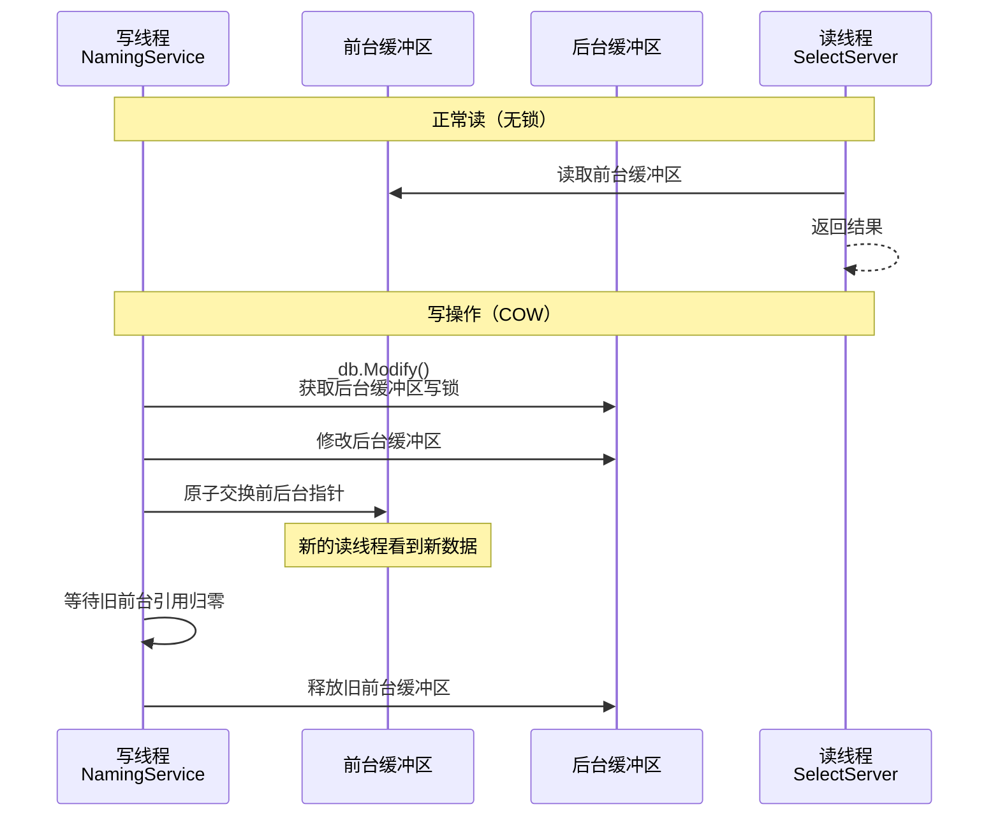
```mermaid
sequenceDiagram
    participant WR as 写线程<br/>NamingService
    participant FG as 前台缓冲区
    participant BG as 后台缓冲区
    participant RD as 读线程<br/>SelectServer

    Note over WR,RD: 正常读（无锁）

    RD->>FG: 读取前台缓冲区
    RD-->>RD: 返回结果

    Note over WR,RD: 写操作（COW）

    WR->>BG: _db.Modify()<br/>获取后台缓冲区写锁
    WR->>BG: 修改后台缓冲区
    WR->>FG: 原子交换前后台指针
    Note over FG: 新的读线程看到新数据
    WR->>WR: 等待旧前台引用归零
    WR->>BG: 释放旧前台缓冲区
```

**特点**：读完全无锁（仅原子指针交换），写需要短暂加锁。

---

## 3. NamingService 服务发现集成

### 3.1 集成架构

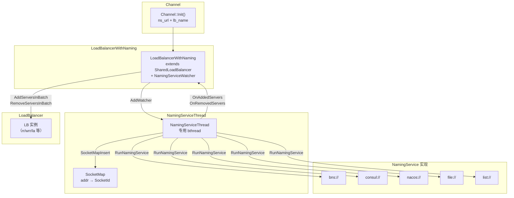
```mermaid
graph TB
    subgraph "Channel"
        CH["Channel::Init()<br/>ns_url + lb_name"]
    end

    subgraph "LoadBalancerWithNaming"
        LBWN["LoadBalancerWithNaming<br/>extends SharedLoadBalancer<br/>+ NamingServiceWatcher"]
    end

    subgraph "NamingServiceThread"
        NST["NamingServiceThread<br/>专用 bthread"]
        SM["SocketMap<br/>addr → SocketId"]
    end

    subgraph "NamingService 实现"
        NS_BNS["bns://"]
        NS_CON["consul://"]
        NS_NAC["nacos://"]
        NS_FILE["file://"]
        NS_LIST["list://"]
    end

    subgraph "LoadBalancer"
        LBA["LB 实例<br/>（rr/wrr/la 等）"]
    end

    CH --> LBWN
    LBWN -->|"AddWatcher"| NST
    NST -->|"RunNamingService"| NS_BNS
    NST -->|"RunNamingService"| NS_CON
    NST -->|"RunNamingService"| NS_NAC
    NST -->|"RunNamingService"| NS_FILE
    NST -->|"RunNamingService"| NS_LIST
    NST -->|"SocketMapInsert"| SM
    NST -->|"OnAddedServers<br/>OnRemovedServers"| LBWN
    LBWN -->|"AddServersInBatch<br/>RemoveServersInBatch"| LBA
```

### 3.2 服务发现到 LB 的更新流程

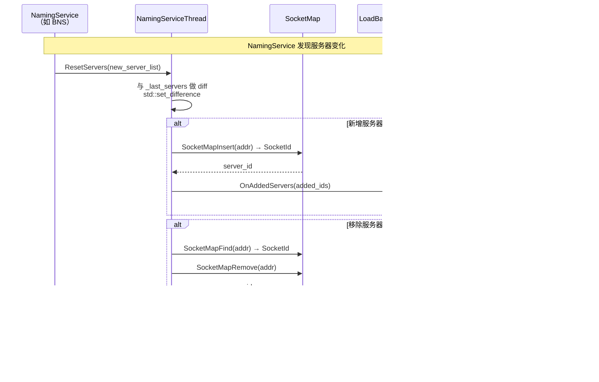
```mermaid
sequenceDiagram
    participant NS as NamingService<br/>（如 BNS）
    participant NST as NamingServiceThread
    participant SM as SocketMap
    participant LBWN as LoadBalancerWithNaming
    participant LB as LoadBalancer

    Note over NS,LB: NamingService 发现服务器变化

    NS->>NST: ResetServers(new_server_list)

    NST->>NST: 与 _last_servers 做 diff<br/>std::set_difference

    alt 新增服务器
        NST->>SM: SocketMapInsert(addr) → SocketId
        SM-->>NST: server_id
        NST->>LBWN: OnAddedServers(added_ids)
        LBWN->>LB: AddServersInBatch(added_ids)
    end

    alt 移除服务器
        NST->>SM: SocketMapFind(addr) → SocketId
        NST->>SM: SocketMapRemove(addr)
        SM-->>NST: server_id
        NST->>LBWN: OnRemovedServers(removed_ids)
        LBWN->>LB: RemoveServersInBatch(removed_ids)
    end
```

### 3.3 内置 NamingService

| 协议 | 类名 | 说明 |
|---|---|---|
| `list://ip1:port1,ip2:port2` | ListNamingService | 静态列表（仅一次） |
| `file:///path/to/file` | FileNamingService | 从文件读取（轮询更新） |
| `http://domain:port/path` | DomainNamingService | DNS 解析 |
| `bns://service_name` | BaiduNamingService | 百度内部 |
| `consul://service_name` | ConsulNamingService | Consul 服务发现 |
| `nacos://service_name` | NacosNamingService | Nacos 服务发现 |
| `discovery://service_name` | DiscoveryNamingService | brpc 自带发现服务 |

---

## 4. RoundRobinLoadBalancer

### 4.1 算法原理

使用**质数步长轮询**（prime-offset stride），步长与服务器数量互质，确保均匀分布：

```
服务器: [A, B, C, D] (n=4)
步长:   coprime(4) = 3（质数步长）

Thread 1 (offset=1): 1→B, 2→A, 3→D, 0→C, 1→B ...
Thread 2 (offset=3): 3→D, 0→C, 1→B, 2→A, 3→D ...
```

### 4.2 选择流程

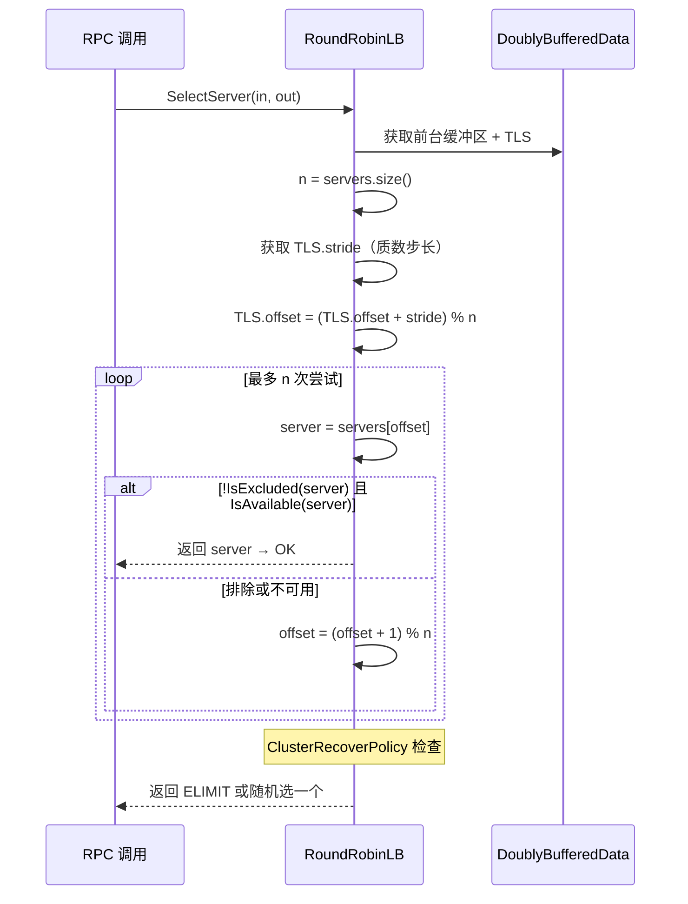
```mermaid
sequenceDiagram
    participant RPC as RPC 调用
    participant LB as RoundRobinLB
    participant DB as DoublyBufferedData

    RPC->>LB: SelectServer(in, out)
    LB->>DB: 获取前台缓冲区 + TLS
    LB->>LB: n = servers.size()

    LB->>LB: 获取 TLS.stride（质数步长）
    LB->>LB: TLS.offset = (TLS.offset + stride) % n

    loop 最多 n 次尝试
        LB->>LB: server = servers[offset]
        alt !IsExcluded(server) 且 IsAvailable(server)
            LB-->>RPC: 返回 server → OK
        else 排除或不可用
            LB->>LB: offset = (offset + 1) % n
        end
    end

    Note over LB: ClusterRecoverPolicy 检查
    LB-->>RPC: 返回 ELIMIT 或随机选一个
```

### 4.3 线程安全

- `DoublyBufferedData` 提供无锁读
- TLS（Thread Local Storage）存储每个线程的 `offset` 和 `stride`
- 不同线程各自轮询，互不干扰

---

## 5. RandomizedLoadBalancer

### 5.1 算法原理

随机选择 + 质数步长回退：

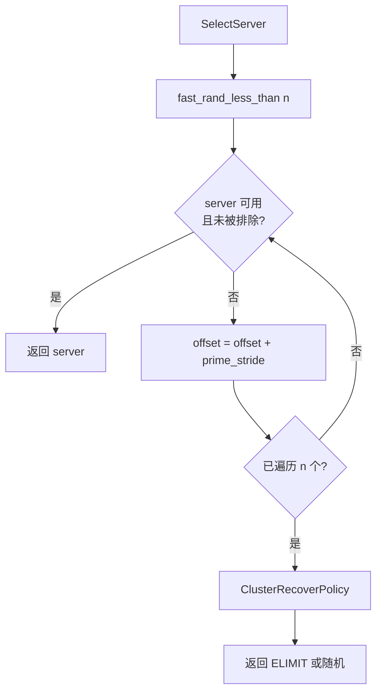
```mermaid
flowchart TD
    START[SelectServer] --> RAND[fast_rand_less_than n]
    RAND --> CHECK{server 可用<br/>且未被排除?}
    CHECK -->|是| RETURN[返回 server]
    CHECK -->|否| STRIDE[offset = offset + prime_stride]
    STRIDE --> CHECK2{已遍历 n 个?}
    CHECK2 -->|否| CHECK
    CHECK2 -->|是| RECOVER[ClusterRecoverPolicy]
    RECOVER --> RETURN2[返回 ELIMIT 或随机]
```

与 RoundRobin 的区别：
- 首次选择是随机的（`fast_rand_less_than(n)`）
- 回退时使用质数步长避免重复

---

## 6. WeightedRoundRobinLoadBalancer

### 6.1 权重来源

```c
// 从 ServerId.tag 解析权重
// tag = "10" → weight = 10
// tag = "invalid" → 使用 FLAGS_default_weight_of_wlb（默认 0，拒绝）
// tag = "0" → 使用默认权重
```

### 6.2 算法流程

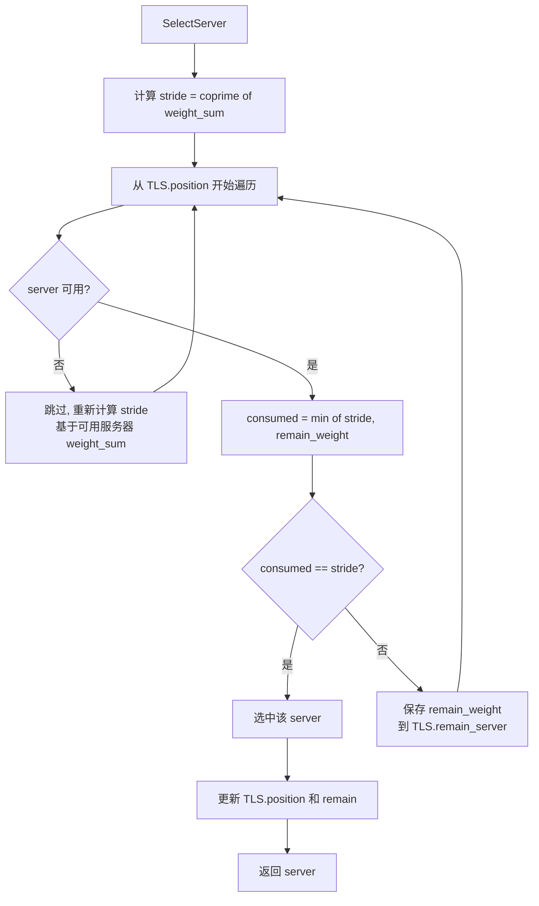
```mermaid
flowchart TD
    START[SelectServer] --> INIT[计算 stride = coprime of weight_sum]
    INIT --> WALK[从 TLS.position 开始遍历]

    WALK --> CHECK{server 可用?}
    CHECK -->|否| SKIP[跳过, 重新计算 stride<br/>基于可用服务器 weight_sum]
    SKIP --> WALK

    CHECK -->|是| CONSUME[consumed = min of stride, remain_weight]
    CONSUME --> ENOUGH{consumed == stride?}

    ENOUGH -->|是| SELECT[选中该 server]
    ENOUGH -->|否| SAVE[保存 remain_weight<br/>到 TLS.remain_server]
    SAVE --> WALK

    SELECT --> UPDATE[更新 TLS.position 和 remain]
    UPDATE --> RETURN[返回 server]
```

**示例**：

```
Server A: weight=5, Server B: weight=3, Server C: weight=2
weight_sum = 10, stride = coprime(10) = 3

Selection sequence (stride=3):
  pos=A, consume=min(3,5)=3, remain=2 → A
  pos=B, consume=min(3-3+0,3)=0, carry=0 → consume=3, remain=0 → B
  pos=C, consume=min(3,2)=2, remain=0 → C
  pos=A, consume=min(3-2+0,5)=1 → A
  pos=B, consume=min(3-1+0,3)=2 → B
  ...
```

---

## 7. WeightedRandomizedLoadBalancer

### 7.1 算法原理

使用**累积权重 + 二分查找**，O(log N) 选择：

```
Server A: weight=3, cumsum=3
Server B: weight=5, cumsum=8
Server C: weight=2, cumsum=10

random_weight = rand(10)
lower_bound 找到 cumsum >= random_weight 的 server
```

### 7.2 选择流程

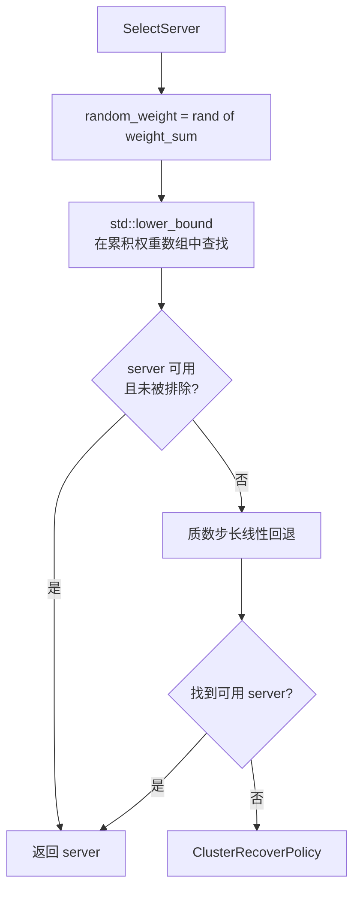
```mermaid
flowchart TD
    START[SelectServer] --> RAND[random_weight = rand of weight_sum]
    RAND --> BSEARCH[std::lower_bound<br/>在累积权重数组中查找]
    BSEARCH --> CHECK{server 可用<br/>且未被排除?}
    CHECK -->|是| RETURN[返回 server]
    CHECK -->|否| STRIDE[质数步长线性回退]
    STRIDE --> FOUND{找到可用 server?}
    FOUND -->|是| RETURN
    FOUND -->|否| RECOVER[ClusterRecoverPolicy]
```

---

## 8. ConsistentHashingLoadBalancer

### 8.1 哈希环构建

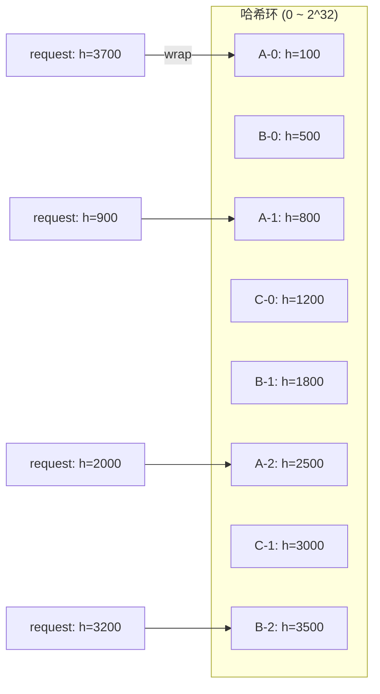
```mermaid
graph LR
    subgraph "哈希环 (0 ~ 2^32)"
        N1["A-0: h=100"]
        N2["B-0: h=500"]
        N3["A-1: h=800"]
        N4["C-0: h=1200"]
        N5["B-1: h=1800"]
        N6["A-2: h=2500"]
        N7["C-1: h=3000"]
        N8["B-2: h=3500"]
    end

    R1["request: h=900"] --> N3
    R2["request: h=2000"] --> N6
    R3["request: h=3200"] --> N8
    R4["request: h=3700"] -->|"wrap"| N1
```

### 8.2 虚拟节点策略

| 策略 | 名称 | 说明 |
|---|---|---|
| Default | `DefaultReplicaPolicy` | hash(host:port-index)，每服务器 1 个虚拟节点 |
| Ketama | `KetamaReplicaPolicy` | MD5(host:port-index) 产生 4 个 32 位 hash |

默认 `replicas=100`，即每个物理服务器 100 个虚拟节点。

### 8.3 选择算法

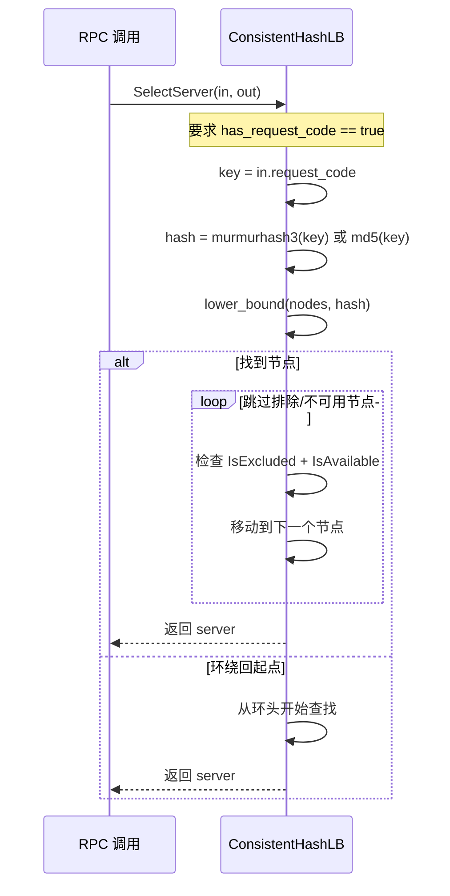
```mermaid
sequenceDiagram
    participant RPC as RPC 调用
    participant LB as ConsistentHashLB

    RPC->>LB: SelectServer(in, out)
    Note over LB: 要求 has_request_code == true

    LB->>LB: key = in.request_code
    LB->>LB: hash = murmurhash3(key) 或 md5(key)

    LB->>LB: lower_bound(nodes, hash)

    alt 找到节点
        loop 跳过排除/不可用节点
            LB->>LB: 检查 IsExcluded + IsAvailable
            LB->>LB: 移动到下一个节点
        end
        LB-->>RPC: 返回 server
    else 环绕回起点
        LB->>LB: 从环头开始查找
        LB-->>RPC: 返回 server
    end
```

### 8.4 服务器变更影响

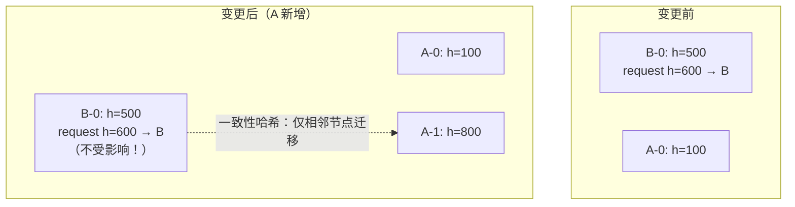
```mermaid
graph TB
    subgraph "变更前"
        BK["B-0: h=500<br/>request h=600 → B"]
        AK["A-0: h=100"]
    end

    subgraph "变更后（A 新增）"
        AK2["A-0: h=100"]
        BK2["B-0: h=500<br/>request h=600 → B<br/>（不受影响！）"]
        AN["A-1: h=800"]
    end

    BK2 -.->|"一致性哈希：仅相邻节点迁移"| AN
```

**一致性哈希的优势**：服务器增删仅影响相邻节点，大幅减少缓存失效。

---

## 9. LocalityAwareLoadBalancer

### 9.1 核心思想

LALB（Locality-Aware LB）主动跟踪每个服务器的延迟和 QPS，动态调整权重，使更多流量分配给低延迟服务器。

### 9.2 数据结构

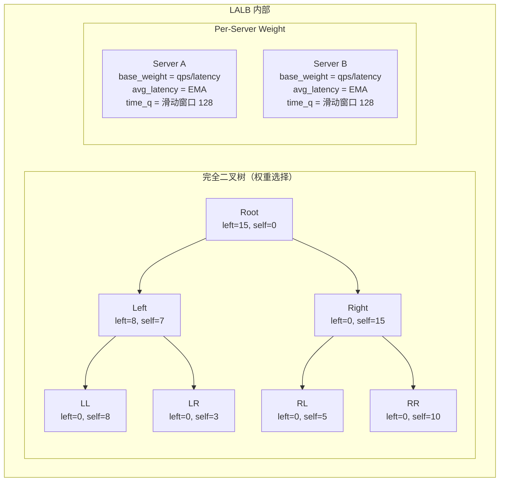
```mermaid
graph TB
    subgraph "LALB 内部"
        subgraph "完全二叉树（权重选择）"
            ROOT["Root<br/>left=15, self=0"]
            L["Left<br/>left=8, self=7"]
            R["Right<br/>left=0, self=15"]
            LL["LL<br/>left=0, self=8"]
            LR["LR<br/>left=0, self=3"]
            RL["RL<br/>left=0, self=5"]
            RR["RR<br/>left=0, self=10"]
        end

        subgraph "Per-Server Weight"
            W_A["Server A<br/>base_weight = qps/latency<br/>avg_latency = EMA<br/>time_q = 滑动窗口 128"]
            W_B["Server B<br/>base_weight = qps/latency<br/>avg_latency = EMA<br/>time_q = 滑动窗口 128"]
        end
    end

    ROOT --> L
    ROOT --> R
    L --> LL
    L --> LR
    R --> RL
    R --> RR
```

### 9.3 选择算法（O(log N)）

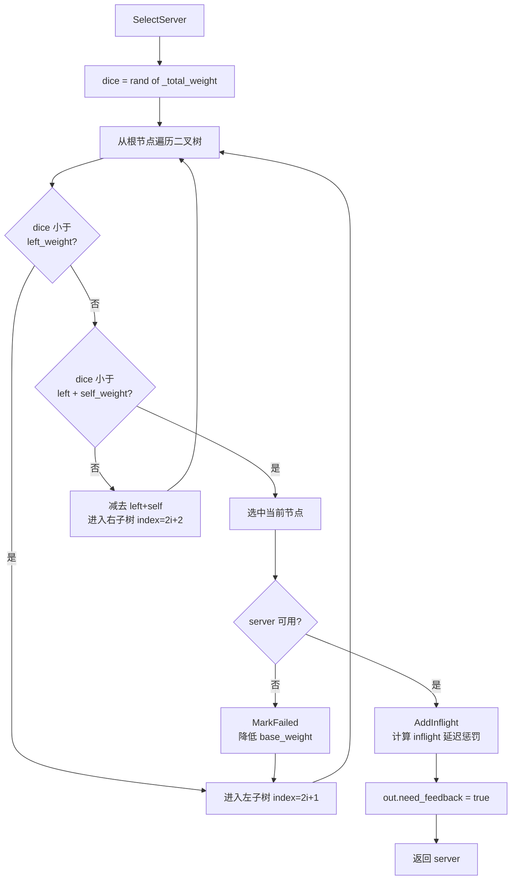
```mermaid
flowchart TD
    START[SelectServer] --> DICE[dice = rand of _total_weight]
    DICE --> WALK[从根节点遍历二叉树]

    WALK --> CMP{dice 小于<br/>left_weight?}
    CMP -->|是| LEFT[进入左子树 index=2i+1]
    CMP -->|否| CMP2{dice 小于<br/>left + self_weight?}
    CMP2 -->|是| SELECT[选中当前节点]
    CMP2 -->|否| RIGHT[减去 left+self<br/>进入右子树 index=2i+2]

    LEFT --> WALK
    RIGHT --> WALK

    SELECT --> AVAIL{server 可用?}
    AVAIL -->|是| INFLIGHT[AddInflight<br/>计算 inflight 延迟惩罚]
    AVAIL -->|否| MARKFAIL[MarkFailed<br/>降低 base_weight]
    MARKFAIL --> LEFT
    INFLIGHT --> FB[out.need_feedback = true]
    FB --> RETURN[返回 server]
```

### 9.4 权重计算公式

```
QPS = (n - 1) * 1,000,000 / (time_q.end_time - time_q.begin_time)
avg_latency = EMA（指数移动平均）
base_weight = QPS / avg_latency

inflight 惩罚:
  inflight_delay = now - avg(begin_time_of_inflight_requests)
  if inflight_delay > punish_inflight_ratio * avg_latency:
      effective_weight = base_weight * avg_latency / inflight_delay
```

### 9.5 Feedback 流程

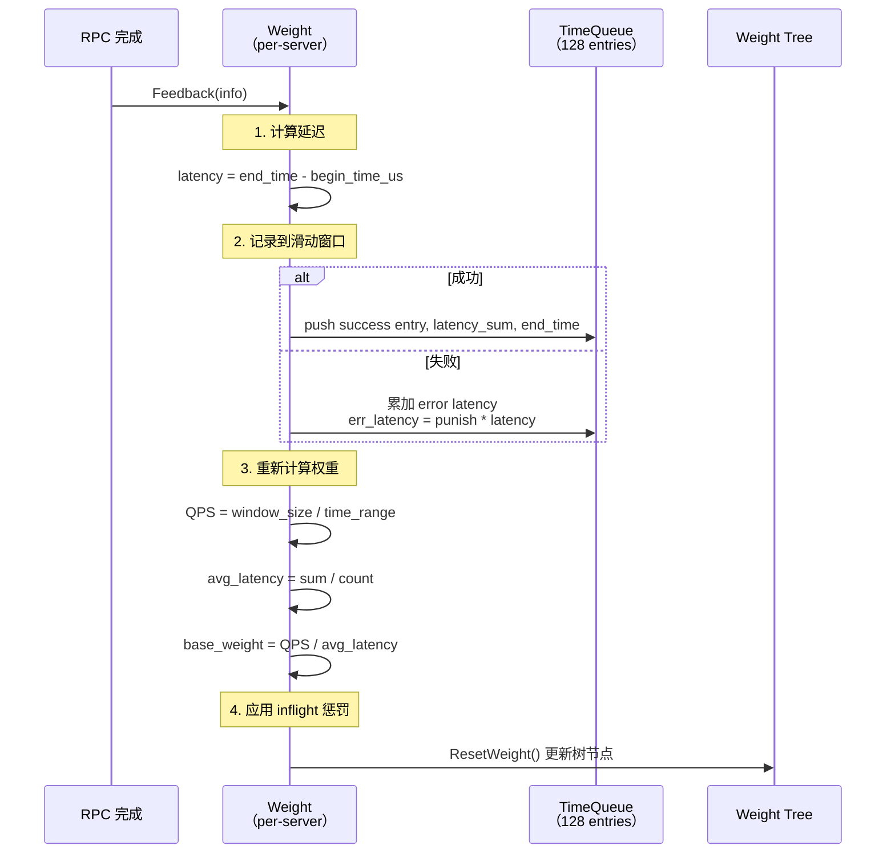
```mermaid
sequenceDiagram
    participant RPC as RPC 完成
    participant W as Weight<br/>（per-server）
    participant TQ as TimeQueue<br/>（128 entries）
    participant TREE as Weight Tree

    RPC->>W: Feedback(info)

    Note over W: 1. 计算延迟
    W->>W: latency = end_time - begin_time_us

    Note over W: 2. 记录到滑动窗口
    alt 成功
        W->>TQ: push success entry, latency_sum, end_time
    else 失败
        W->>TQ: 累加 error latency<br/>err_latency = punish * latency
    end

    Note over W: 3. 重新计算权重
    W->>W: QPS = window_size / time_range
    W->>W: avg_latency = sum / count
    W->>W: base_weight = QPS / avg_latency

    Note over W: 4. 应用 inflight 惩罚
    W->>TREE: ResetWeight() 更新树节点
```

---

## 10. DynPartLoadBalancer

内部 LB，用于 `DynamicPartitionChannel`。简单加权随机：

```c
// 1. 获取每个 server 的 weight（通过 schan::GetSubChannelWeight）
// 2. 累积权重
// 3. random_weight = rand(weight_sum)
// 4. lower_bound 找到 server
// 5. 跳过 excluded servers
```

---

## 11. 熔断器 CircuitBreaker

### 11.1 架构

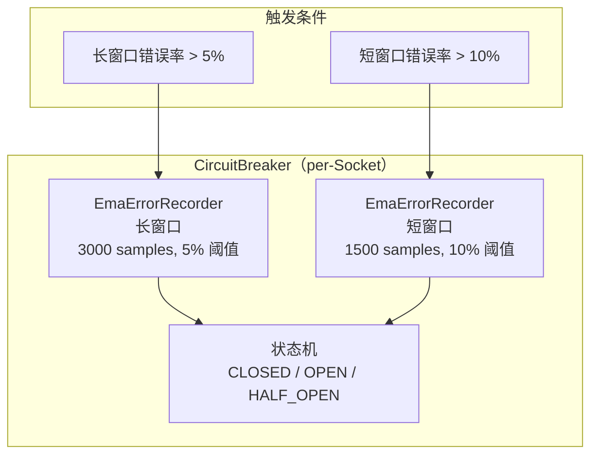
```mermaid
graph TB
    subgraph "CircuitBreaker（per-Socket）"
        LW["EmaErrorRecorder<br/>长窗口<br/>3000 samples, 5% 阈值"]
        SW["EmaErrorRecorder<br/>短窗口<br/>1500 samples, 10% 阈值"]
        STATE["状态机<br/>CLOSED / OPEN / HALF_OPEN"]
    end

    subgraph "触发条件"
        T1["长窗口错误率 > 5%"]
        T2["短窗口错误率 > 10%"]
    end

    LW --> STATE
    SW --> STATE
    T1 --> LW
    T2 --> SW
```

### 11.2 状态机

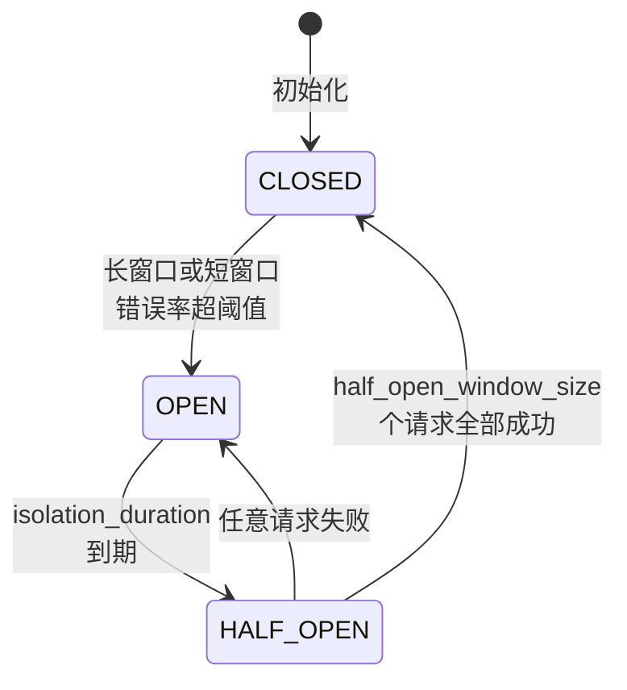
```mermaid
stateDiagram-v2
    [*] --> CLOSED : 初始化
    CLOSED --> OPEN : 长窗口或短窗口<br/>错误率超阈值
    OPEN --> HALF_OPEN : isolation_duration<br/>到期
    HALF_OPEN --> CLOSED : half_open_window_size<br/>个请求全部成功
    HALF_OPEN --> OPEN : 任意请求失败
```

### 11.3 EMA 错误跟踪

```c
// EmaErrorRecorder
struct EmaErrorRecorder {
    double ema_latency;       // EMA 延迟
    double ema_error_cost;    // EMA 错误代价
    size_t sample_count;      // 样本计数

    void OnCallEnd(error_code, latency) {
        if (success) {
            ema_latency = ema * smooth + latency * (1 - smooth);
            ema_error_cost *= smooth;  // 衰减
        } else {
            ema_error_cost += min(latency, max_failed_latency * ema_latency);
        }
        // 检查: ema_error_cost > ema_latency * window_size * max_error_percent
    }
};
```

### 11.4 熔断触发与恢复流程

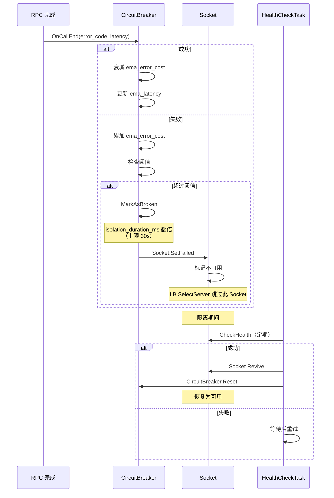
```mermaid
sequenceDiagram
    participant RPC as RPC 完成
    participant CB as CircuitBreaker
    participant SOCK as Socket
    participant HC as HealthCheckTask

    RPC->>CB: OnCallEnd(error_code, latency)

    alt 成功
        CB->>CB: 衰减 ema_error_cost
        CB->>CB: 更新 ema_latency
    else 失败
        CB->>CB: 累加 ema_error_cost
        CB->>CB: 检查阈值
        alt 超过阈值
            CB->>CB: MarkAsBroken
            Note over CB: isolation_duration_ms 翻倍<br/>（上限 30s）
            CB->>SOCK: Socket.SetFailed
            SOCK->>SOCK: 标记不可用
            Note over SOCK: LB SelectServer 跳过此 Socket
        end
    end

    Note over SOCK: 隔离期间

    HC->>SOCK: CheckHealth（定期）
    alt 成功
        HC->>SOCK: Socket.Revive
        HC->>CB: CircuitBreaker.Reset
        Note over SOCK: 恢复为可用
    else 失败
        HC->>HC: 等待后重试
    end
```

---

## 12. 健康检查与恢复

### 12.1 两级健康检查

| 级别 | 类型 | 实现 | 说明 |
|---|---|---|---|
| 连接级 | TCP 探测 | `Socket::CheckHealth()` | 测试 TCP 连通性 |
| 应用级 | HTTP 探测 | `HealthCheckManager` | GET `/health_check_path` |

### 12.2 恢复流程

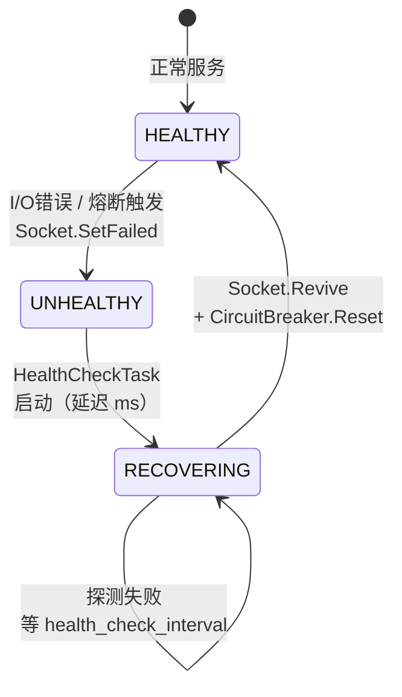
```mermaid
stateDiagram-v2
    [*] --> HEALTHY : 正常服务

    HEALTHY --> UNHEALTHY : I/O错误 / 熔断触发<br/>Socket.SetFailed
    UNHEALTHY --> RECOVERING : HealthCheckTask<br/>启动（延迟 ms）

    RECOVERING --> RECOVERING : 探测失败<br/>等 health_check_interval
    RECOVERING --> HEALTHY : Socket.Revive<br/>+ CircuitBreaker.Reset
```

---

## 13. Backup Request 机制

### 13.1 概述

Backup Request 解决**长尾延迟**问题：在第一个请求发出一定时间后，如果未返回，则向另一个服务器发送相同的请求，取先到者。

### 13.2 流程

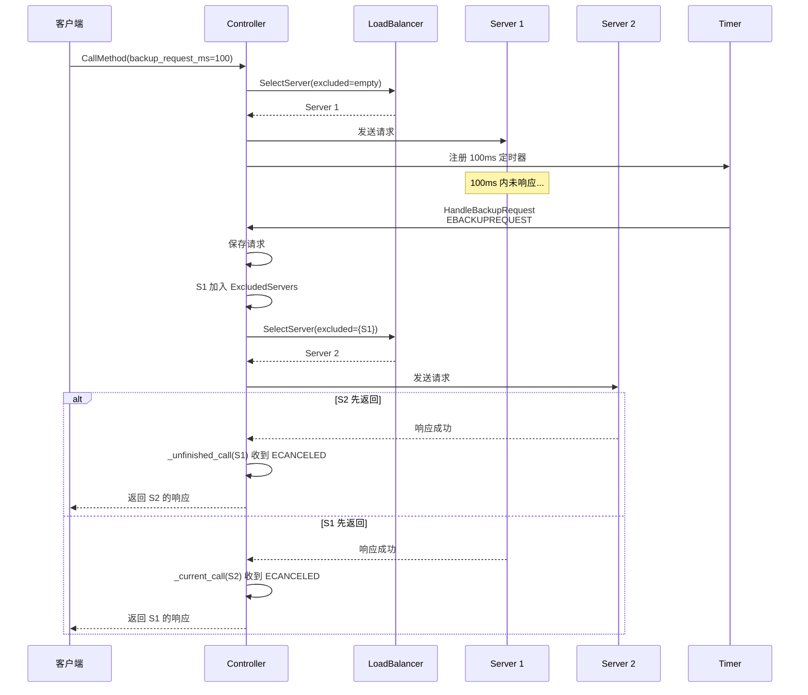
```mermaid
sequenceDiagram
    participant CLI as 客户端
    participant CNTL as Controller
    participant LB as LoadBalancer
    participant S1 as Server 1
    participant S2 as Server 2
    participant TM as Timer

    CLI->>CNTL: CallMethod(backup_request_ms=100)
    CNTL->>LB: SelectServer(excluded=empty)
    LB-->>CNTL: Server 1
    CNTL->>S1: 发送请求 #1

    CNTL->>TM: 注册 100ms 定时器

    Note over S1: 100ms 内未响应...

    TM->>CNTL: HandleBackupRequest<br/>EBACKUPREQUEST

    CNTL->>CNTL: 保存请求 #1 为 _unfinished_call
    CNTL->>CNTL: S1 加入 ExcludedServers

    CNTL->>LB: SelectServer(excluded={S1})
    LB-->>CNTL: Server 2
    CNTL->>S2: 发送请求 #2

    alt S2 先返回
        S2-->>CNTL: 响应成功
        CNTL->>CNTL: _unfinished_call(S1) 收到 ECANCELED
        CNTL-->>CLI: 返回 S2 的响应
    else S1 先返回
        S1-->>CNTL: 响应成功
        CNTL->>CNTL: _current_call(S2) 收到 ECANCELED
        CNTL-->>CLI: 返回 S1 的响应
    end
```

### 13.3 RateLimitedBackupPolicy

防止 Backup Request 滥用（放大流量）：

```c
// 滑动窗口内限制 backup 比例
max_backup_ratio = 0.1  // 最多 10% 请求触发 backup
window_size = 10s       // 滑动窗口大小
update_interval = 5s    // 更新间隔
```

---

## 14. 重试与 ExcludedServers

### 14.1 ExcludedServers

```c
// src/brpc/excluded_servers.h
class ExcludedServers {
    // 有界队列，存储已尝试过的 SocketId
    // 重试和 backup request 时，已尝试的 server 加入此列表
    // LB SelectServer 时检查 IsExcluded() 跳过
};
```

### 14.2 重试流程

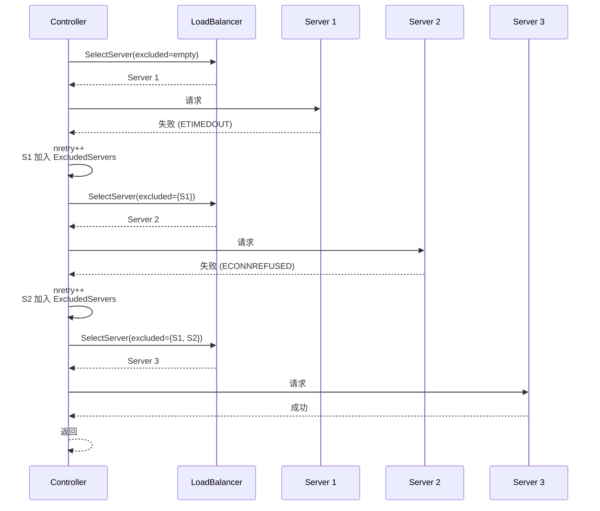
```mermaid
sequenceDiagram
    participant CNTL as Controller
    participant LB as LoadBalancer
    participant S1 as Server 1
    participant S2 as Server 2
    participant S3 as Server 3

    CNTL->>LB: SelectServer(excluded=empty)
    LB-->>CNTL: Server 1
    CNTL->>S1: 请求 #1
    S1-->>CNTL: 失败 (ETIMEDOUT)

    CNTL->>CNTL: nretry++<br/>S1 加入 ExcludedServers

    CNTL->>LB: SelectServer(excluded={S1})
    LB-->>CNTL: Server 2
    CNTL->>S2: 请求 #2
    S2-->>CNTL: 失败 (ECONNREFUSED)

    CNTL->>CNTL: nretry++<br/>S2 加入 ExcludedServers

    CNTL->>LB: SelectServer(excluded={S1, S2})
    LB-->>CNTL: Server 3
    CNTL->>S3: 请求 #3
    S3-->>CNTL: 成功
    CNTL-->>CNTL: 返回
```

### 14.3 Versioned CallId 防重复

```
call_id:        base ID（用于 ECANCEL, ERPCTIMEDOUT）
call_id + 1:    首次尝试（versioned）
call_id + 2:    重试 1（versioned）
call_id + 3:    重试 2（versioned）
...
```

当重试 N+1 发出后，重试 N 的 ID 失效。迟到的重试 N 响应被忽略。

---

## 15. 服务发现到负载均衡完整时序

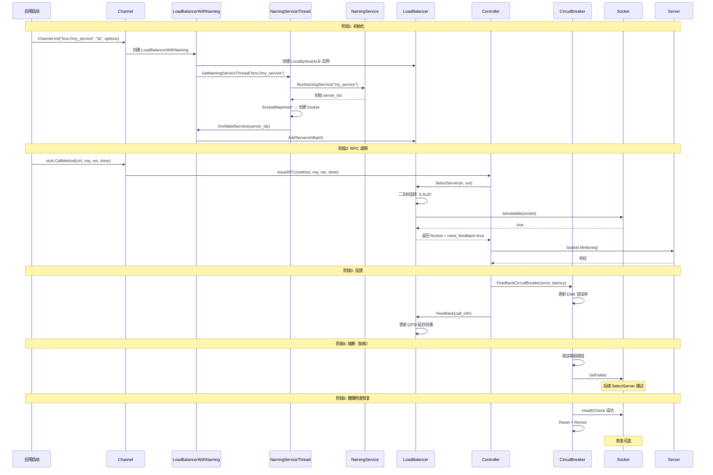
```mermaid
sequenceDiagram
    participant APP as 应用启动
    participant CH as Channel
    participant LBWN as LoadBalancerWithNaming
    participant NST as NamingServiceThread
    participant NS as NamingService
    participant LB as LoadBalancer
    participant CNTL as Controller
    participant CB as CircuitBreaker
    participant SOCK as Socket
    participant SVR as Server

    Note over APP,SVR: 阶段1: 初始化

    APP->>CH: Channel.Init("bns://my_service", "la", options)
    CH->>LBWN: 创建 LoadBalancerWithNaming
    LBWN->>LB: 创建 LocalityAwareLB 实例
    LBWN->>NST: GetNamingServiceThread("bns://my_service")
    NST->>NS: RunNamingService("my_service")
    NS-->>NST: 初始 server_list

    NST->>NST: SocketMapInsert → 创建 Socket
    NST->>LBWN: OnAddedServers(server_ids)
    LBWN->>LB: AddServersInBatch

    Note over APP,SVR: 阶段2: RPC 调用

    APP->>CH: stub.CallMethod(ctrl, req, res, done)
    CH->>CNTL: IssueRPC(method, req, res, done)
    CNTL->>LB: SelectServer(in, out)

    LB->>LB: 二叉树选择（LALB）
    LB->>SOCK: IsAvailable(socket)
    SOCK-->>LB: true
    LB-->>CNTL: 返回 Socket + need_feedback=true

    CNTL->>SVR: Socket.Write(req)
    SVR-->>CNTL: 响应

    Note over APP,SVR: 阶段3: 反馈

    CNTL->>CB: FeedbackCircuitBreaker(error, latency)
    CB->>CB: 更新 EMA 错误率
    CNTL->>LB: Feedback(call_info)
    LB->>LB: 更新 QPS/延迟/权重

    Note over APP,SVR: 阶段4: 熔断（如有）

    CB->>CB: 错误率超阈值
    CB->>SOCK: SetFailed
    Note over SOCK: 后续 SelectServer 跳过

    Note over APP,SVR: 阶段5: 健康检查恢复

    CB->>SOCK: HealthCheck 成功
    CB->>CB: Reset + Revive
    Note over SOCK: 恢复可选
```

---

## 16. 配置参数

| 参数 | 默认值 | 说明 |
|---|---|---|
| `max_retry` (ChannelOptions) | 3 | 最大重试次数 |
| `backup_request_ms` | -1（禁用） | Backup request 触发时间 |
| `timeout_ms` | 500 | RPC 超时 |
| `circuit_breaker` (ServerOptions) | false | 是否启用熔断 |
| `default_weight_of_wlb` | 0 | WRR/WR 默认权重（0=无效权重拒绝） |
| `min_weight` (LALB) | 1000 | LALB 最小权重 |
| `punish_inflight_ratio` | 1.5 | LALB inflight 惩罚系数 |
| `punish_error_ratio` | 1.2 | LALB 错误惩罚系数 |
| `replicas` (一致性哈希) | 100 | 虚拟节点数 |
| `health_check_interval_s` | 3 | 健康检查间隔 |
| `isolation_duration_ms` | 10 | 初始熔断隔离时间 |
| `max_isolation_duration_ms` | 30000 | 最大隔离时间 |
| `long_window_size` | 3000 | 熔断长窗口大小 |
| `short_window_size` | 1500 | 熔断短窗口大小 |
| `max_backup_ratio` | 0.1 | Backup request 最大比例 |
| `min_working_instances` | varies | 恢复策略最小可用实例 |

---

## 17. 对比总结

### 17.1 各 LB 算法对比

| 特性 | RR | Random | WRR | WR | ConsistentHash | LALB |
|---|---|---|---|---|---|---|
| 时间复杂度 | O(n) | O(n) | O(n) | O(log n) | O(log n) | O(log n) |
| 权重支持 | 无 | 无 | 有 | 有 | 无 | 自适应 |
| 延迟感知 | 无 | 无 | 无 | 无 | 无 | 有 |
| 缓存友好 | 无 | 无 | 无 | 无 | 高 | 低 |
| 一致性 | 弱 | 弱 | 弱 | 弱 | 强 | 弱 |
| 服务器变更影响 | 全部重分布 | 全部重分布 | 全部重分布 | 全部重分布 | 仅相邻迁移 | 渐进调整 |
| Feedback | 无 | 无 | 无 | 无 | 无 | 有（必需） |

### 17.2 与其他系统对比

| 特性 | brpc | gRPC | Dubbo | Ribbon |
|---|---|---|---|---|
| 内置算法 | 7 种 | round_robin, pick_first | 5+ 种 | 7+ 种 |
| 自适应权重 | LALB | 无 | 无 | 无 |
| 一致性哈希 | 支持 | 无 | 支持 | 无 |
| 熔断集成 | 内置 | 外部库 | 外置 Hystrix | 外置 Hystrix |
| Backup Request | 内置 | 无 | 无 | 无 |
| 版本化 CallId | 内置 | 无 | 无 | 无 |

---

## 18. 源码索引

### 核心接口

| 文件 | 内容 |
|---|---|
| `src/brpc/load_balancer.h` | LoadBalancer 接口、SelectIn/Out、CallInfo、SharedLoadBalancer |
| `src/brpc/load_balancer.cpp` | IsServerAvailable、Extension 注册 |
| `src/brpc/server_id.h` | ServerId 定义 |
| `src/brpc/excluded_servers.h` | ExcludedServers 排除列表 |

### LB 实现

| 文件 | 内容 |
|---|---|
| `src/brpc/policy/round_robin_load_balancer.h/.cpp` | RoundRobin（质数步长） |
| `src/brpc/policy/randomized_load_balancer.h/.cpp` | Randomized |
| `src/brpc/policy/weighted_round_robin_load_balancer.h/.cpp` | WRR（加权轮询） |
| `src/brpc/policy/weighted_randomized_load_balancer.h/.cpp` | WR（加权随机） |
| `src/brpc/policy/consistent_hashing_load_balancer.h/.cpp` | 一致性哈希 |
| `src/brpc/policy/locality_aware_load_balancer.h/.cpp` | LALB（延迟感知） |
| `src/brpc/policy/dynpart_load_balancer.h/.cpp` | DynPart（内部） |

### 服务发现

| 文件 | 内容 |
|---|---|
| `src/brpc/naming_service.h` | NamingService 接口 |
| `src/brpc/details/naming_service_thread.h/.cpp` | NamingServiceThread（bthread 运行） |
| `src/brpc/details/load_balancer_with_naming.h/.cpp` | LoadBalancerWithNaming（桥接） |
| `src/brpc/channel.h/.cpp` | Channel::Init、CallMethod |

### 熔断与健康检查

| 文件 | 内容 |
|---|---|
| `src/brpc/circuit_breaker.h/.cpp` | CircuitBreaker、EmaErrorRecorder |
| `src/brpc/details/health_check.h/.cpp` | HealthCheckTask、HealthCheckManager |
| `src/brpc/cluster_recover_policy.h/.cpp` | ClusterRecoverPolicy（防惊群） |

### Backup Request 与重试

| 文件 | 内容 |
|---|---|
| `src/brpc/backup_request_policy.h/.cpp` | BackupRequestPolicy、RateLimitedBackupPolicy |
| `src/brpc/controller.h/.cpp` | IssueRPC、OnVersionedRPCReturned、HandleBackupRequest |
| `src/brpc/socket.h/.cpp` | FeedbackCircuitBreaker |
